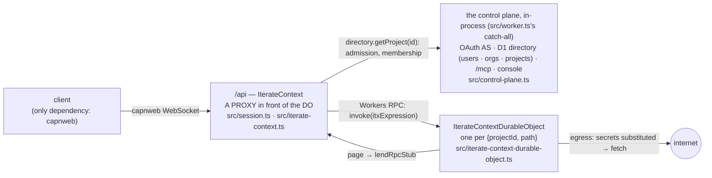

# The clean-room itx surface, as built

> `packages/v3/project-worker`, as of 2026-09-04, round two of the review (after the first Plannotator
> round on this document), brought to the one-worker consolidation of 2026-09-08 (the control plane
> in-process, one package). Every signature below is transcribed from source; the file is named so
> you can check. Sections 1–11 are what exists. Section 12 records what the review decided and
> what is still open, each open item with a concrete proposal. The long-form walkthrough is
> `docs/clean-room-api-walkthrough.md`. `docs/history/proposals/itx-surface-SYNTHESIS.md` is HISTORY: its
> §§1-8 argue for an API that lost (the verb `rewrite`, never shipped) and only its §9 records
> what was built.

---

## 1. The picture

ONE worker (the stateless edge with the control plane in-process as its catch-all), one Durable
Object class, one dotted surface, one package.



- **The context** is a dotted surface. `itx.kv.get('x')`, `itx.slack.chat.postMessage(…)`,
  `itx.append({…})` are all ONE thing on the wire: `invoke(itxExpression)`.
- **Two vocabularies, kept apart.** (a) **rpc stubs**: physical. A client's live function or
  RpcTarget, lent under an opaque `rpcStubKey`, borrowed by the DO, paged back on demand.
  (b) **itx-expression rewrite rules**: pure data. `{ match, target }` in a record keyed by the
  canonical match, written by one event. "A call starting with `match` runs as the same call with
  `match` replaced by `target`."
- **Everything else is an event.** The DO has `append` and no configuration verbs. The edge's
  verbs (`provide`, `subscribe`) build an event and append it; the built-in root
  `itx.processors.enable` / `disable` does the same inside the DO (section 5).
- **The DO is the parent** of: the stream, the core reduce (inline at commit), the one delivery
  loop, the facets (loaded DurableObject classes), the rpc-stub directory, the fetch door.
- **Two hosts for loaded code, one door each:** `itx.workers.get(spec)` (stateless) and
  `itx.facets.get(name, spec)` (durable).
- **Bindings, named for what they hold.** `env.ITERATE_CONTEXT` is the project worker's
  `DurableObjectNamespace<IterateContextDurableObject>` (singular, the Cloudflare and apps/os
  convention: `PROJECT`, `STREAM`, `MY_DURABLE_OBJECT`). `env.ITX` is what a LOADED worker gets: a
  stub of `ItxEntrypoint` minted with the one prop `iterateContextName`.

---

## 2. The tour in the tutorial's order

Five chapters. Each one adds exactly one idea. Every example uses the string half of the codec;
the array half (`["itx", "kv", ["get", "x"]]`) is the same call and is what a dotted call compiles to.

```ts
using api = newWebSocketRpcSession("wss://<worker>/api");
const itx = api.authenticate({ type: "from-server-cookie" }).projects.get("prj_demo"); // the root context "/"
const support = itx.cd("/agents/support"); // pure addressing, no DO hop

// ── 1. rpc stubs: provide a live stub — it is lent under the key = its match ──
using laptop = await itx.provide("itx.laptop", {
  async ping() {
    return "pong";
  },
});
await itx.invoke("itx.builtins.rpcStubs.get('itx.laptop').ping()"); // "pong" — the registry itself, in the kernel's spelling (a session may; loaded code may not)
await itx.invoke("itx.laptop.ping()"); // "pong" — through the rule provide wrote

// ── 2. itx expressions: the dotted sugar IS invoke ──
await itx.laptop.ping(); // the same call

// ── 3. rewrite rules: provide an EXPRESSION and it is a pure rewrite ──
using grok = await itx.provide("itx.grok", "itx.openai.chat"); // itx.grok(x) ⇒ itx.openai.chat(x)
await itx.provide("itx.ai.run('gpt-5')", async (inputs) => …); // a live stub behind a pinned arg
await itx.provide("itx.laptop", null); // delete

// ── 4. subscriptions: a name for a delivery ──
using tail = await itx.subscribe({
  target: (events, range) => render(events), // a live callback…
  consumes: ["events.iterate.com/chat/message"],
});
await itx.subscribe({ name: "mirror", target: "itx.cd('/archive').append" }); // …or an expression
await itx.append({ type: "events.iterate.com/chat/message", payload: { text: "hi" } });

// ── 5. processors: a subscription whose target is a facet's processEventBatch ──
await itx.processors.enable("presence", {
  source: { "cap.js": PRESENCE_SOURCE },
  className: "PresenceDurableObject",
});
await itx.facets.get("presence").snapshot();
await itx.processors.disable("presence"); // ONE event; the facet goes with it

// the durable spelling of any verb is its raw event (no handle, outlives the session)
await itx.append({
  type: "events.iterate.com/itx/rewrite-rule-configured",
  payload: { match: "itx.cam", target: "itx.rpcStubs.get('cam')" },
});
```

---

## 3. Itx expressions (`src/context/expression.ts`)

The one codec every door speaks. String half ⇄ structured half.

| Type                  | Shape                                                                                    | Example                                          |
| --------------------- | ---------------------------------------------------------------------------------------- | ------------------------------------------------ |
| `ItxExpressionStep`   | `string` (property) or `[method, ...args]` (call) — NOT exported, unlike the three below | `"kv"`, `["get", "x"]`                           |
| `ItxExpression`       | `ItxExpressionStep[]`, root first                                                        | `["itx", "kv", ["get", "x"]]`                    |
| `ItxExpressionInput`  | `string \| ItxExpression`                                                                | `"itx.kv.get('x')"` — what every door accepts    |
| `ItxExpressionPrefix` | an `ItxExpression` used as a rule's `match`                                              | `["itx", "ai", ["run", "gpt-5"]]` pins `'gpt-5'` |

- Args are JSON5 in the string half. `print(parse(s))` round-trips; the canonical spelling
  (`canonicalItxExpressionPrefix`) is the rewrite-rule record's key.
- **The reserved root** is `itx.builtins`: the kernel's record (section 5) and the FIXED POINT of
  rewriting (section 7). `itx.builtins.kv.get('x')` runs as is and reads no rule; `itx.kv.get('x')`
  reaches the same door through the implicit row `itx.kv ⇒ itx.builtins.kv` — present at the owner
  root; below it only the fourteen context roots are implicit — unless the context's own table says
  otherwise. A rule's match may not be rooted there; a target may (the owner's grant of the real
  thing); a call from loaded code may not (section 10). Apex ingress stores its complete worker expression
  in a `project/ingress-configured` event. It adds no implicit rewrite row or subscription. The project
  processor re-points it at every commit of `/repos/config` (the repo facet cross-posts
  `repo/commit-completed` to `/`): a commit to the config repo IS its publication (2026-09-21).
- The **anonymous call step** `""` calls the value itself: `itx.builtins.rpcStubs.get('cam')(1)` is
  `["itx","builtins","rpcStubs",["get","cam"],["",1]]`. It is what a rule spells when a lent stub
  is called with args.
- **`@` is the caller's input** (section 7, rule 7) — legal in a rewrite rule's TARGET only, in its
  final step's arguments: a bare `@` outside a string literal (`'@cf/…'` in quotes is a string), and
  `...@` as an object-literal entry. The array half spells them as the one reserved literal
  `{ "@": true }` and the entry key `"...@"`, so a stored target is plain JSON; `print` spells
  them back. `parse(source, { holes: true })` is how a target is read; a bare `@` anywhere else is
  refused in the marker's own words.
- `invoke(call, ...args)`: the string is the pure part, the args the live part — `args` are applied
  to the value the expression denotes (`invoke("itx.kv.get", "k")` ≡ `itx.kv.get("k")`; the fetch
  lane's Request rides the same door).
- **The dotted surface is a prototype hop**, not a Proxy around the instance
  (`src/context/expression.ts`, `installPrototypeInvokeFallback`). Declared methods
  win; every unknown segment accumulates and lands on `invoke` as ONE expression. It is a
  prototype hop so workerd's pipelining brand-check still passes (workerd#6873).

---

## 4. The edge: what `IterateContext` declares (`src/iterate-context.ts`)

The class declares only what the edge must do itself. Everything else rides the hop. Since this
review the class's TYPE also carries every built-in root (section 5) by declaration merging
(`export interface IterateContext extends Omit<BuiltInScope, "cd"> {}`): zero runtime, but a
reader of the file sees the whole surface, and `env.ITX.get().append(…)` typechecks in loaded code.

| Method                                                                                                             | Returns                           | What physically happens                                                                                                                                                                                                                                                                                                                                                                                                                                                                                                                                                                                                                                                                   |
| ------------------------------------------------------------------------------------------------------------------ | --------------------------------- | ----------------------------------------------------------------------------------------------------------------------------------------------------------------------------------------------------------------------------------------------------------------------------------------------------------------------------------------------------------------------------------------------------------------------------------------------------------------------------------------------------------------------------------------------------------------------------------------------------------------------------------------------------------------------------------------- |
| `cd(path)`                                                                                                         | `IterateContext`                  | Pure addressing. Absolute by convention, relative resolves. Returns an EDGE context so a later `provide` lends in this session. Loaded code's handle (section 10) has no such door: its `cd` goes through its own table, down only.                                                                                                                                                                                                                                                                                                                                                                                                                                                       |
| `invoke(call: ItxExpressionInput, ...args)`                                                                        | `Promise<unknown>`                | THE door (live args fold into a name-final call BEFORE the rules). `durableObject.invoke(expression)`. One fork: a terminal `fetch(Request)` rides `durableObject.fetch` with the expression in `x-itx-expression`.                                                                                                                                                                                                                                                                                                                                                                                                                                                                       |
| `provide({ match, target, description? })` · `provide(match, target: ClientRpcStub \| ItxExpressionInput \| null)` | `RewriteRuleHandle`               | THE ONE FRONT DOOR: make `match` mean `target` — the event's payload, or the `(match, target)` shorthand; `description` is the one line a model reads for the name (≤ 500 chars) and rides the row into `rewriteRules.list()`. Not on loaded code's handle (section 10). A live stub is lent to the DO through a pager owned here (DON'T-PIN) under the key = the canonical match; the rule `match ⇒ itx.builtins.rpcStubs.get('<match>')` RIDES the pager upgrade and the DO appends it as it accepts the pager (one round trip); an expression is the rule alone, appended from here; `null` masks where an implicit row lies beneath, deletes elsewhere, and at bare `itx` denies all. |
| `subscribe({ name?, target: ItxExpressionInput \| ClientRpcStub \| null, consumes?, afterOffset? })`               | `SubscriptionHandle` (has `name`) | A live target is lent under the key `subscription:<name>`, its row (target `itx.builtins.rpcStubs.get('subscription:<name>')`) riding the same pager upgrade; an expression target is `append(subscriptionConfiguredEvent(…))` from here. `afterOffset` is where the cursor lane starts (0 = the whole log; absent = from now); a push target ignores it.                                                                                                                                                                                                                                                                                                                                 |

The two handles (`RewriteRuleHandle`, `SubscriptionHandle`) are server-side RpcTargets with one
member, `[Symbol.dispose]`, plus a `name` getter on `SubscriptionHandle`. Disposing undoes the act. capnweb disposes every
exported handle when the session ends, so **a verb's effect is session-scoped; the raw event
is durable**.

`ClientRpcStub` (`src/context/rpc-stubs.ts`) is the type of what a client hands over:
`{ dup(): ClientRpcStub; [k: string]: unknown }`. On the wire it is a callable capnweb Proxy, so
a bare `async function` and an `RpcTarget` subclass both work.

How a client reaches one (`src/session.ts`, the apps/os session shape):
`IterateRpcTarget.authenticate(credentials: SessionCredentials)` → `SessionRpcTarget`
(`whoami()` → `SessionPrincipal`, and the getter `projects`) → `ProjectCollection`:
`list()` → `Project[]` (`{ id, orgId, role? }` — the projects of the orgs the user belongs to; every
project, no role, for the admin secret), `get(project)` → the root `IterateContext` (a project only —
`ProjectIdOrSlug`, one DNS-safe name; a context name belongs to `cd`), `create({ project })` → the
root `IterateContext` of the project it made in the user's org (their first, created on first use;
the slug IS the id, globally unique — `PROJECT_NAME_TAKEN` names another org's) or, for the admin
secret, in `org_admin` — THE DIRECTORY ROW, THEN THE SAGA: it enables the `project` processor row on
`/` and appends `project/create-requested { slug, orgId }` there under the caller, and returns at
once; the project processor (`src/project/`) lands `project/created` (or `project/create-failed`)
from state at head, and the dash renders the facet's live state as the creation's progress. Both
steps are idempotent (the row at the door, the request keyed), so the same slug again appends
nothing. `get` touches no DO: addressing plus the directory's membership answer.

**Who** (`src/principal.ts`, `src/session.ts`, `src/oauth.ts`, `src/grants.ts`). `SessionCredentials`
is a union of two kinds. `from-server-cookie`: the OAuth grant the transport already resolved — the
OAuth gate (`src/api.ts`) admitted the request's bearer or the browser adapter's cookie before capnweb
ever opened, so the call only says "hand me that session"; a transport that carries none is
`UNAUTHENTICATED`. `admin-secret`: `APP_CONFIG` `secrets.adminBearer` compared in constant time
(`verifyAdminSecret`, both SHA-256 hashed) — `{ actor: "admin" }` on every project, or with
`as: { email }` that user's session without a login (the directory row upserted as `/login` does —
its id, `user_<email>`, is the actor); a wrong secret is `INVALID_CREDENTIALS`. OAuth grants are the
ONE credential for every other principal (`src/oauth.ts` `GrantProps`: `issuer` — the issuer's own
login, `app` — a connected client, `personal` — a PERSONAL ACCESS TOKEN): `session.grants.mint({
name, projects })` (`src/grants.ts`) mints one finite `personal` grant of the user's — 30 days, scoped
to the projects named (each one the user reaches), no refresh credential, its access token answered
ONCE and never stored readable — listed by `session.grants.list()` (kind "Personal access token")
and ended by `session.grants.end(grantId)` like any grant; minting needs an HTTPS issuer or the local
worker (`isLocalOrigin`, `src/lib.ts`). What a session reaches is its `Reach` (`src/directory.ts`):
`"every"` (the admin secret), `{ userId }` (a user: the login cookie, the admin's `as`) or
`{ userId, projectIds }` (a grant that chose projects — a personal access token always does) —
`directory.reachableProjects(reach)` is `list()`, `directory.reachesProject(reach, id)` is `get`'s
admission, `directory.createProject(reach, name)` is every create door (`FORBIDDEN` on a narrowed
grant). A user's `projects.get` admits members of the owning org only (`FORBIDDEN` otherwise). The
principal rides every dispatch the session makes (`IterateContextDurableObject.invoke`, a DO-only
Workers-RPC verb, or the `x-itx-principal` header on a terminal fetch), and the built-in append root
stamps it as `source.principal` on every event — the DO's field: a client's own `source.principal`
is overwritten, a loaded worker's `env.ITX` (the entrypoint stub) has no such door. The platform's own
rows (a `provide`, a `subscribe`) carry it too. On a project host the same bearer (an access token —
a personal access token included — or the admin secret) is verified by the edge (`src/worker.ts`:
`authorizationForToken`, then `reachesProject` — 401 for a bad or ended bearer, 403 for a project the
grant does not cover), stamps `x-itx-principal` on the Request the app sees, and is stripped; an
app's own bearer scheme passes through untouched.

---

## 5. The built-in roots: the kernel's record (`src/context/built-ins.ts`)

A plain record — and THE RECORD IS `itx.builtins`, the reserved root. A call `itx.builtins.<root>…`
runs against it directly and never reads the rule table. A short call `itx.<root>…` reaches it
through the IMPLICIT ROW `itx.<root> ⇒ itx.builtins.<root>` (never stored; applied by the resolver
when no context row matches) where that root is implicit: at the owner root (`/`; `/users/<id>` or
`/organizations/<id>` in the global namespace) every root in the table below; at every other
context only the fourteen context roots — `whoami`, `url`, `append`, `readEvents`, `waitForEvent`, `cd`,
`facets`, `subscriptions`, `processors`, `schedules`, `rewriteRules`, `rpcStubs`, `workers`, `run`.
A project-level name (`kv`, `secrets`, `ai`, `fetch`, `repos`, `agents`, …) is ambient nowhere
below the root: a child reaches it through a row — its creator's bare row (section 7) or a grant.
So a context may shadow a root (`provide("itx.ai", fake)`), mask one (`provide("itx.kv", null)`),
or deny itself whole (`provide("itx", null)`). `itx.builtins` is the kernel's word: the kernel
spells it, a rule's target may name it, and a call from loaded code may not (section 10). The one
list of roots is `src/context/itx-expression-rewriting.ts`, type-checked against
`keyof BuiltInScope`. **The platform never spells a short name**: the proxy's own append, a lent
stub's rule, a processor's row are all `itx.builtins.…`, so a user's row at `itx.facets` or
`itx.rpcStubs` redirects the user's calls and nothing the platform relies on.

| Root                                                                                                                                                                                                                                                                     | Signature                                                                                                                                                                                                                                                                                                                                                                                                                                                                                                                                                                                                                                                                                                                                                                                                                                                                                                                                                                                                                                                                                                                                                                                                                                                                                                                                                                                                                                                                                                                                                                                                                                                                                                                                                                                                                                                                                                                                                                                                                                                                                                                                                                                                                                                                                                                                                                                                                                                                                                                                                                                                                                                                                                                                                                                                                                                                                                                                                                                                                                                                                                                                                                                                                                                                                                                                                                                                                                                                                                                                                                                                                                                                                                                                                                                                                                                                                                                                                                                                                                                                                                                                                                                                                                                                                                                                                                                                                                                                                                                                                                                                                                               | Backed by                                                                                                                                                                                                                                                                                                                                                                                                                                                                                                                                                                                                                                                                                                                                                                                                                                                                                                                                                                                                                                                                                                                                                                                                                                                                                                                                                                                                                                                                                                                                                                                                                                                                                                    |
| ------------------------------------------------------------------------------------------------------------------------------------------------------------------------------------------------------------------------------------------------------------------------ | ------------------------------------------------------------------------------------------------------------------------------------------------------------------------------------------------------------------------------------------------------------------------------------------------------------------------------------------------------------------------------------------------------------------------------------------------------------------------------------------------------------------------------------------------------------------------------------------------------------------------------------------------------------------------------------------------------------------------------------------------------------------------------------------------------------------------------------------------------------------------------------------------------------------------------------------------------------------------------------------------------------------------------------------------------------------------------------------------------------------------------------------------------------------------------------------------------------------------------------------------------------------------------------------------------------------------------------------------------------------------------------------------------------------------------------------------------------------------------------------------------------------------------------------------------------------------------------------------------------------------------------------------------------------------------------------------------------------------------------------------------------------------------------------------------------------------------------------------------------------------------------------------------------------------------------------------------------------------------------------------------------------------------------------------------------------------------------------------------------------------------------------------------------------------------------------------------------------------------------------------------------------------------------------------------------------------------------------------------------------------------------------------------------------------------------------------------------------------------------------------------------------------------------------------------------------------------------------------------------------------------------------------------------------------------------------------------------------------------------------------------------------------------------------------------------------------------------------------------------------------------------------------------------------------------------------------------------------------------------------------------------------------------------------------------------------------------------------------------------------------------------------------------------------------------------------------------------------------------------------------------------------------------------------------------------------------------------------------------------------------------------------------------------------------------------------------------------------------------------------------------------------------------------------------------------------------------------------------------------------------------------------------------------------------------------------------------------------------------------------------------------------------------------------------------------------------------------------------------------------------------------------------------------------------------------------------------------------------------------------------------------------------------------------------------------------------------------------------------------------------------------------------------------------------------------------------------------------------------------------------------------------------------------------------------------------------------------------------------------------------------------------------------------------------------------------------------------------------------------------------------------------------------------------------------------------------------------------------------------------------------------------------------- | ------------------------------------------------------------------------------------------------------------------------------------------------------------------------------------------------------------------------------------------------------------------------------------------------------------------------------------------------------------------------------------------------------------------------------------------------------------------------------------------------------------------------------------------------------------------------------------------------------------------------------------------------------------------------------------------------------------------------------------------------------------------------------------------------------------------------------------------------------------------------------------------------------------------------------------------------------------------------------------------------------------------------------------------------------------------------------------------------------------------------------------------------------------------------------------------------------------------------------------------------------------------------------------------------------------------------------------------------------------------------------------------------------------------------------------------------------------------------------------------------------------------------------------------------------------------------------------------------------------------------------------------------------------------------------------------------------------ | --------------------------------------------------------------------------------------------------------------------------------------------------------------------------------------------------------------------------------------------------------------------------------------------------------------------------------------------------------------------------------------------------------------------------------------------------------------------------------------------------------------------------------------------------------- |
| `whoami()`                                                                                                                                                                                                                                                               | `→ { projectId, path }`                                                                                                                                                                                                                                                                                                                                                                                                                                                                                                                                                                                                                                                                                                                                                                                                                                                                                                                                                                                                                                                                                                                                                                                                                                                                                                                                                                                                                                                                                                                                                                                                                                                                                                                                                                                                                                                                                                                                                                                                                                                                                                                                                                                                                                                                                                                                                                                                                                                                                                                                                                                                                                                                                                                                                                                                                                                                                                                                                                                                                                                                                                                                                                                                                                                                                                                                                                                                                                                                                                                                                                                                                                                                                                                                                                                                                                                                                                                                                                                                                                                                                                                                                                                                                                                                                                                                                                                                                                                                                                                                                                                                                                 | the DO name                                                                                                                                                                                                                                                                                                                                                                                                                                                                                                                                                                                                                                                                                                                                                                                                                                                                                                                                                                                                                                                                                                                                                                                                                                                                                                                                                                                                                                                                                                                                                                                                                                                                                                  |
| `kv`                                                                                                                                                                                                                                                                     | `.get(k)` `.put(k, v)` `.delete(k)` `.list(prefix?)`                                                                                                                                                                                                                                                                                                                                                                                                                                                                                                                                                                                                                                                                                                                                                                                                                                                                                                                                                                                                                                                                                                                                                                                                                                                                                                                                                                                                                                                                                                                                                                                                                                                                                                                                                                                                                                                                                                                                                                                                                                                                                                                                                                                                                                                                                                                                                                                                                                                                                                                                                                                                                                                                                                                                                                                                                                                                                                                                                                                                                                                                                                                                                                                                                                                                                                                                                                                                                                                                                                                                                                                                                                                                                                                                                                                                                                                                                                                                                                                                                                                                                                                                                                                                                                                                                                                                                                                                                                                                                                                                                                                                    | `ITX_KV`, `${resourceScope(projectId, path).id}:` prefixed — a project's id; in the global namespace the owner subtree's `global--users--<id>` / `global--organizations--<id>` (`iterate-context.ts`)                                                                                                                                                                                                                                                                                                                                                                                                                                                                                                                                                                                                                                                                                                                                                                                                                                                                                                                                                                                                                                                                                                                                                                                                                                                                                                                                                                                                                                                                                                        |
| `secrets`                                                                                                                                                                                                                                                                | `.set(path, material, { urls, refresh? })` → `{ path }` · `.beginOAuth(path, { authorizationEndpoint, tokenEndpoint, clientId, clientSecret?, clientAuth?, scope?, urls?, extra? })` → `{ authorizationUrl }` · `.completeOAuth(path, { code, nonce })` (the callback's — never yours) · `.delete(path)` → `{ path }` · `.list()` → `[{ path, urls, refresh?, createdAt }]` — paths, pins and strategy kinds, never a value — WRITE-ONLY. PATH-KEYED: a secret is a DOMAIN OBJECT on the context at `/secrets/<name>` under the resource owner's root (a project's `/secrets/<name>`; a user's own at `/users/<id>/secrets/<name>`, an organization's under `/organizations/<id>`), hosted as the first-party facet `secret` — THE ENTITY PATTERN (`src/secret/contract.ts` · `processor.ts` · `durable-object.ts`; `src/first-party-facets.ts`), apps/os's ADR 0005 invariant kept: material in, nothing out but a request to a pinned host. A secret IS its path, and the path is what the placeholder spells: `getSecret("/secrets/<name>")`. The material is a string or a JSON object (`getSecret("/secrets/NAME", { field: "a.b" })` picks one string out of it), `urls` is REQUIRED and pins it to those origins only, `refresh` is the strategy the facet re-mints an expired credential with in its own trusted code — `oauth-refresh-token` (RFC 6749 §6 from `refreshToken` + `clientId`/`clientSecret` in the material; `clientAuth` is the RFC 8414 registry value, `client_secret_basic` by default, `client_secret_post` for GitHub-shaped endpoints, `none` for a public client) or `waitrose-session` (the username/password → session login) — on a 401 from the pinned host or on first use, single-flight, the exchange endpoint itself within the pin. Every writing verb runs ON THE SECRET'S OWN CONTEXT (from any other context it is the same call over the DO hop, the caller carried), so the log's order is the value's: `set` enables the `secret` processor row there, appends `secret/set { path, urls, refresh? }` on that path attributed to the caller (`source.principal`), cross-posts the same fact to the owner's root — the catalog — and puts the value in the facet (`write(record)`; a refused append leaves no value behind); `delete` is the facet's `clear()`, then `secret/deleted { path }` on both logs, then the row disabled (the facet's storage goes with it) — a never-set secret has nothing to delete (thrown), a deleted one answers at once, and a deleted secret can be set again. `beginOAuth` obtains the first tokens (`secret-oauth.ts`): the facet keeps the pending attempt (PKCE verifier, nonce, ten minutes) and hands out the authorize URL with a platform-signed `state` naming the secret's CONTEXT; the provider redirects the human to `/.secrets/oauth/callback`, which admits only a signed-in session that reaches the owner derived from it (a project's member, the user themself, an organization's member, the admin — cookie or bearer, the project-host admission) and completes with `completeOAuth(path, { code, nonce })` on the secret's context: the facet exchanges the code and stores `{ clientId, clientSecret, accessToken, refreshToken }` under `oauth-refresh-token`, then `secret/set` lands (a refused append clears the exchange again) — nothing is on the catalog before that. The facet's own facts, on the path only and best-effort: `secret/refreshed { kind, ok, error? }` per refresh outcome and `secret/used { method, url, status }` per dispatch (the request AS RECEIVED — placeholders, never values; a WebSocket upgrade is a dispatch, status 101). The secret's state is `itx.cd(path).facets.get("secret").snapshot()` → `{ material: { offset } \| null, deletion: { offset } \| null }`, the offsets of the facts that say so (read the event for the pin). The material sits in the facet's storage ENCRYPTED (`secret-at-rest.ts`: AES-256-GCM under `APP_CONFIG_SECRETS_KEY`, bound to the secret's context — its Durable Object name — its pin and the write's revision; `APP_CONFIG_SECRETS_KEY_PREVIOUS` opens during a rotation and the record is rewritten under the current key on that read). `list()` reads the owner root's facet — `project` (`src/project/contract.ts` `secrets`; `account` / `organization` for the global owners) — folded from the cross-posted certificates, strongly consistent with `set` and `delete`. A ROOT, not a library member: a write must reach the facet from the DO's own trusted scope with the caller's principal on its facts (`deps.caller()`), which only the built-ins hold. | the `secret` facet on the context at the secret's path (`SecretDurableObject`, `src/secret/durable-object.ts`, hosted from `ctx.exports`; its own storage: the record — material encrypted — a write counter every change bumps, the pending attempt, the completed attempt — nonce + the revision it wrote, so a replayed callback completes idempotently); the facts on that path's log, cross-posted to the owner's root; the catalog in the owner root facet's state                                                                                                                                                                                                                                                                                                                                                                                                                                                                                                                                                                                                                                                                                                                                                                                                                                                                                                                                                                                                                                                                                                                                                                                                                                     |
| `ai`                                                                                                                                                                                                                                                                     | Cloudflare's Workers AI binding, VERBATIM: `.run(model, inputs, options?)` `.models()` `.gateway(id).run(req)` `.toMarkdown()` `.autorag(id)`                                                                                                                                                                                                                                                                                                                                                                                                                                                                                                                                                                                                                                                                                                                                                                                                                                                                                                                                                                                                                                                                                                                                                                                                                                                                                                                                                                                                                                                                                                                                                                                                                                                                                                                                                                                                                                                                                                                                                                                                                                                                                                                                                                                                                                                                                                                                                                                                                                                                                                                                                                                                                                                                                                                                                                                                                                                                                                                                                                                                                                                                                                                                                                                                                                                                                                                                                                                                                                                                                                                                                                                                                                                                                                                                                                                                                                                                                                                                                                                                                                                                                                                                                                                                                                                                                                                                                                                                                                                                                                           | `AI` (Workers AI), the binding object itself                                                                                                                                                                                                                                                                                                                                                                                                                                                                                                                                                                                                                                                                                                                                                                                                                                                                                                                                                                                                                                                                                                                                                                                                                                                                                                                                                                                                                                                                                                                                                                                                                                                                 |
| `browser`                                                                                                                                                                                                                                                                | Cloudflare Browser Run (apps/os `itx.browser`): `.quickAction(action, options)` returns the action's RESULT; `.fetch(input, init)` is the raw CDP door                                                                                                                                                                                                                                                                                                                                                                                                                                                                                                                                                                                                                                                                                                                                                                                                                                                                                                                                                                                                                                                                                                                                                                                                                                                                                                                                                                                                                                                                                                                                                                                                                                                                                                                                                                                                                                                                                                                                                                                                                                                                                                                                                                                                                                                                                                                                                                                                                                                                                                                                                                                                                                                                                                                                                                                                                                                                                                                                                                                                                                                                                                                                                                                                                                                                                                                                                                                                                                                                                                                                                                                                                                                                                                                                                                                                                                                                                                                                                                                                                                                                                                                                                                                                                                                                                                                                                                                                                                                                                                  | `BROWSER` (Browser Run)                                                                                                                                                                                                                                                                                                                                                                                                                                                                                                                                                                                                                                                                                                                                                                                                                                                                                                                                                                                                                                                                                                                                                                                                                                                                                                                                                                                                                                                                                                                                                                                                                                                                                      |
| `cfArtifacts`                                                                                                                                                                                                                                                            | THE ARTIFACTS PROXY: Cloudflare Artifacts, project-scoped and addressed BY THE REPO'S PATH (`src/context/repos.ts` `ArtifactsScope`) — the binding's verbs only: `.create(path)` → `{ created }` `.get(path)` → a handle with `.createToken(scope, ttl)` and `.remote()` `.list()` → `{ repos: [{ path }] }` `.delete(path)`. GIT is the repo facet's (`src/repo/durable-object.ts` over `src/repo/git-wire.ts`, reached as `itx.repos.get(path)` — THE way to interact): it mints its token and learns its remote here. The Artifacts NAME (`repos--config`, under `${projectId}.`) is derived here and spelled nowhere else                                                                                                                                                                                                                                                                                                                                                                                                                                                                                                                                                                                                                                                                                                                                                                                                                                                                                                                                                                                                                                                                                                                                                                                                                                                                                                                                                                                                                                                                                                                                                                                                                                                                                                                                                                                                                                                                                                                                                                                                                                                                                                                                                                                                                                                                                                                                                                                                                                                                                                                                                                                                                                                                                                                                                                                                                                                                                                                                                                                                                                                                                                                                                                                                                                                                                                                                                                                                                                                                                                                                                                                                                                                                                                                                                                                                                                                                                                                                                                                                                           | `ARTIFACTS`, `${projectId}.` prefixed                                                                                                                                                                                                                                                                                                                                                                                                                                                                                                                                                                                                                                                                                                                                                                                                                                                                                                                                                                                                                                                                                                                                                                                                                                                                                                                                                                                                                                                                                                                                                                                                                                                                        | `ARTIFACTS`, `${projectId}.` prefixed, + the git wire (the tail of `repos.ts`)                                                                                                                                                                                                                                                                                                                                                                                                                                                                            |
| `append(...events)`                                                                                                                                                                                                                                                      | `→ StreamEvent[]`                                                                                                                                                                                                                                                                                                                                                                                                                                                                                                                                                                                                                                                                                                                                                                                                                                                                                                                                                                                                                                                                                                                                                                                                                                                                                                                                                                                                                                                                                                                                                                                                                                                                                                                                                                                                                                                                                                                                                                                                                                                                                                                                                                                                                                                                                                                                                                                                                                                                                                                                                                                                                                                                                                                                                                                                                                                                                                                                                                                                                                                                                                                                                                                                                                                                                                                                                                                                                                                                                                                                                                                                                                                                                                                                                                                                                                                                                                                                                                                                                                                                                                                                                                                                                                                                                                                                                                                                                                                                                                                                                                                                                                       | the stream                                                                                                                                                                                                                                                                                                                                                                                                                                                                                                                                                                                                                                                                                                                                                                                                                                                                                                                                                                                                                                                                                                                                                                                                                                                                                                                                                                                                                                                                                                                                                                                                                                                                                                   |
| `readEvents(afterOffset?, limit?, { includeEphemeral? }?)`                                                                                                                                                                                                               | `→ { events, scannedThroughOffset, atHead }` — a page is cut by the server's byte budget (8 MiB, less while other readers are outstanding) or by `limit`; `atHead` says the durable mark was reached; `includeEphemeral` merges in the ephemerals this incarnation still holds (a byte-bounded ring), never counted by the proof                                                                                                                                                                                                                                                                                                                                                                                                                                                                                                                                                                                                                                                                                                                                                                                                                                                                                                                                                                                                                                                                                                                                                                                                                                                                                                                                                                                                                                                                                                                                                                                                                                                                                                                                                                                                                                                                                                                                                                                                                                                                                                                                                                                                                                                                                                                                                                                                                                                                                                                                                                                                                                                                                                                                                                                                                                                                                                                                                                                                                                                                                                                                                                                                                                                                                                                                                                                                                                                                                                                                                                                                                                                                                                                                                                                                                                                                                                                                                                                                                                                                                                                                                                                                                                                                                                                        | the stream                                                                                                                                                                                                                                                                                                                                                                                                                                                                                                                                                                                                                                                                                                                                                                                                                                                                                                                                                                                                                                                                                                                                                                                                                                                                                                                                                                                                                                                                                                                                                                                                                                                                                                   |
| `waitForEvent(filter?)`                                                                                                                                                                                                                                                  | `{ type?, afterOffset?, timeoutMs? } → StreamEvent`                                                                                                                                                                                                                                                                                                                                                                                                                                                                                                                                                                                                                                                                                                                                                                                                                                                                                                                                                                                                                                                                                                                                                                                                                                                                                                                                                                                                                                                                                                                                                                                                                                                                                                                                                                                                                                                                                                                                                                                                                                                                                                                                                                                                                                                                                                                                                                                                                                                                                                                                                                                                                                                                                                                                                                                                                                                                                                                                                                                                                                                                                                                                                                                                                                                                                                                                                                                                                                                                                                                                                                                                                                                                                                                                                                                                                                                                                                                                                                                                                                                                                                                                                                                                                                                                                                                                                                                                                                                                                                                                                                                                     | the stream                                                                                                                                                                                                                                                                                                                                                                                                                                                                                                                                                                                                                                                                                                                                                                                                                                                                                                                                                                                                                                                                                                                                                                                                                                                                                                                                                                                                                                                                                                                                                                                                                                                                                                   |
| `cd(path)`                                                                                                                                                                                                                                                               | `→ InvokeHandle` onto another context, every call through ITS table; the hop carries the caller's path, so a relative `repos.get('./x')` there resolves against the caller; from loaded code only itself and its descendants, and through its own table (`itx.cd ⇒ null` is a legal row)                                                                                                                                                                                                                                                                                                                                                                                                                                                                                                                                                                                                                                                                                                                                                                                                                                                                                                                                                                                                                                                                                                                                                                                                                                                                                                                                                                                                                                                                                                                                                                                                                                                                                                                                                                                                                                                                                                                                                                                                                                                                                                                                                                                                                                                                                                                                                                                                                                                                                                                                                                                                                                                                                                                                                                                                                                                                                                                                                                                                                                                                                                                                                                                                                                                                                                                                                                                                                                                                                                                                                                                                                                                                                                                                                                                                                                                                                                                                                                                                                                                                                                                                                                                                                                                                                                                                                                | `ITERATE_CONTEXT.getByName`                                                                                                                                                                                                                                                                                                                                                                                                                                                                                                                                                                                                                                                                                                                                                                                                                                                                                                                                                                                                                                                                                                                                                                                                                                                                                                                                                                                                                                                                                                                                                                                                                                                                                  |
| `fetch(request)`                                                                                                                                                                                                                                                         | egress (`src/iterate-context-durable-object.ts`, the DO's `#egress`): a request naming NO secret goes to the terminal `fetch`; one naming a secret — `getSecret("/secrets/NAME")` or `getSecret("/secrets/NAME", { field: "a.b" })` in the URL (path and query; the parser's percent-encoded spelling matched too) or the headers — is FORWARDED to the CONTEXT at that path under the resource owner's root (a DO `.fetch()` hop; its own facet when the path is this context's), whose `#egress` hands it to its `secret` facet (`ctx.facets.get("secret").fetch(request)`, `src/secret/durable-object.ts` `fetch`), which substitutes (spliced into the URL as ONE component with `:` kept — a Telegram bot token; apps/os's grammar for a URL or a header, WITHOUT its `Basic base64(user:getSecret(…))` peeling or its JSON-body template — the body is never scanned), checks the pin, dispatches with `redirect: "manual"`, and on a 401 (or a field not there yet) runs the refresh strategy and retries ONCE. One request, one secret (two names is a 502). A placeholder with no stored secret, a field the material has no string at, or a secret pinned to other origins, is a 502 (`ProjectSecretRefused`) to the caller, never the destination; an unreachable host is a generic 502 naming the host, never the substituted URL. A WebSocket upgrade through a secret works: the 101 rides the fetch channel back through the facet, its parent and the caller's context — the facet HOLDS no socket, it dials one and hands it back, so the socket lives as long as the dial (measured 2026-09-21, `__workers-tests__/secret-facet-proxies-a-socket.test.ts`). No next door.                                                                                                                                                                                                                                                                                                                                                                                                                                                                                                                                                                                                                                                                                                                                                                                                                                                                                                                                                                                                                                                                                                                                                                                                                                                                                                                                                                                                                                                                                                                                                                                                                                                                                                                                                                                                                                                                                                                                                                                                                                                                                                                                                                                                                                                                                                                                                                                                                                                                                                                                                                                                                                                                                                                                                                                                                                                                                                                                                             | the secret's context, its `secret` facet, then `fetch`                                                                                                                                                                                                                                                                                                                                                                                                                                                                                                                                                                                                                                                                                                                                                                                                                                                                                                                                                                                                                                                                                                                                                                                                                                                                                                                                                                                                                                                                                                                                                                                                                                                       |
| `rpcStubs`                                                                                                                                                                                                                                                               | `.get(rpcStubKey) → RpcStubHandle` · `.list() → string[]` (presence)                                                                                                                                                                                                                                                                                                                                                                                                                                                                                                                                                                                                                                                                                                                                                                                                                                                                                                                                                                                                                                                                                                                                                                                                                                                                                                                                                                                                                                                                                                                                                                                                                                                                                                                                                                                                                                                                                                                                                                                                                                                                                                                                                                                                                                                                                                                                                                                                                                                                                                                                                                                                                                                                                                                                                                                                                                                                                                                                                                                                                                                                                                                                                                                                                                                                                                                                                                                                                                                                                                                                                                                                                                                                                                                                                                                                                                                                                                                                                                                                                                                                                                                                                                                                                                                                                                                                                                                                                                                                                                                                                                                    | `RpcStubDirectory`                                                                                                                                                                                                                                                                                                                                                                                                                                                                                                                                                                                                                                                                                                                                                                                                                                                                                                                                                                                                                                                                                                                                                                                                                                                                                                                                                                                                                                                                                                                                                                                                                                                                                           |
| `rewriteRules`                                                                                                                                                                                                                                                           | `.list() → Promise<{ match, target, description?, context }[]>` (the EFFECTIVE table, described: context rows, masks as `target: null`, the implicit rows with the platform's one-liners, and behind a bare hop row the rows of the context it names, depth-capped; `context` is the path a row was read from) · `.get(match)` · `.resolve(call) → string[]` (the pure chain; `invoke(call) ≡ invoke(resolve(call).at(-1))`)                                                                                                                                                                                                                                                                                                                                                                                                                                                                                                                                                                                                                                                                                                                                                                                                                                                                                                                                                                                                                                                                                                                                                                                                                                                                                                                                                                                                                                                                                                                                                                                                                                                                                                                                                                                                                                                                                                                                                                                                                                                                                                                                                                                                                                                                                                                                                                                                                                                                                                                                                                                                                                                                                                                                                                                                                                                                                                                                                                                                                                                                                                                                                                                                                                                                                                                                                                                                                                                                                                                                                                                                                                                                                                                                                                                                                                                                                                                                                                                                                                                                                                                                                                                                                            | core state + the implicit rows                                                                                                                                                                                                                                                                                                                                                                                                                                                                                                                                                                                                                                                                                                                                                                                                                                                                                                                                                                                                                                                                                                                                                                                                                                                                                                                                                                                                                                                                                                                                                                                                                                                                               |
| `facets`                                                                                                                                                                                                                                                                 | `.get(name) → FacetHandle` (a RUNNING facet) · `.get(name, { source, cacheKey?, className })` (load and host it) — no delete: a facet leaves with the row that hosted it (section 9)                                                                                                                                                                                                                                                                                                                                                                                                                                                                                                                                                                                                                                                                                                                                                                                                                                                                                                                                                                                                                                                                                                                                                                                                                                                                                                                                                                                                                                                                                                                                                                                                                                                                                                                                                                                                                                                                                                                                                                                                                                                                                                                                                                                                                                                                                                                                                                                                                                                                                                                                                                                                                                                                                                                                                                                                                                                                                                                                                                                                                                                                                                                                                                                                                                                                                                                                                                                                                                                                                                                                                                                                                                                                                                                                                                                                                                                                                                                                                                                                                                                                                                                                                                                                                                                                                                                                                                                                                                                                    | `ctx.facets`; mirrors `ctx.facets.get(name, startupCallback)`                                                                                                                                                                                                                                                                                                                                                                                                                                                                                                                                                                                                                                                                                                                                                                                                                                                                                                                                                                                                                                                                                                                                                                                                                                                                                                                                                                                                                                                                                                                                                                                                                                                |
| `subscriptions`                                                                                                                                                                                                                                                          | `.list() → SubscriptionListEntry[]` · `.get(name)`                                                                                                                                                                                                                                                                                                                                                                                                                                                                                                                                                                                                                                                                                                                                                                                                                                                                                                                                                                                                                                                                                                                                                                                                                                                                                                                                                                                                                                                                                                                                                                                                                                                                                                                                                                                                                                                                                                                                                                                                                                                                                                                                                                                                                                                                                                                                                                                                                                                                                                                                                                                                                                                                                                                                                                                                                                                                                                                                                                                                                                                                                                                                                                                                                                                                                                                                                                                                                                                                                                                                                                                                                                                                                                                                                                                                                                                                                                                                                                                                                                                                                                                                                                                                                                                                                                                                                                                                                                                                                                                                                                                                      | core state ⋈ the loop's cursors                                                                                                                                                                                                                                                                                                                                                                                                                                                                                                                                                                                                                                                                                                                                                                                                                                                                                                                                                                                                                                                                                                                                                                                                                                                                                                                                                                                                                                                                                                                                                                                                                                                                              |
| `processors`                                                                                                                                                                                                                                                             | `.enable(name, { source, className, consumes? }) → { name }` — ONE `subscription-configured` event whose target is `itx.builtins.facets.get(name, spec).processEventBatch`; DURABLE, no handle · `.disable(name)` — ONE event `{ name, target: null }`; the DO deletes the facet the row hosted before the append returns · `.list()` — the subscriptions that host a facet. The third layer of the onion: `rpcStubs` → `subscriptions` → `processors`.                                                                                                                                                                                                                                                                                                                                                                                                                                                                                                                                                                                                                                                                                                                                                                                                                                                                                                                                                                                                                                                                                                                                                                                                                                                                                                                                                                                                                                                                                                                                                                                                                                                                                                                                                                                                                                                                                                                                                                                                                                                                                                                                                                                                                                                                                                                                                                                                                                                                                                                                                                                                                                                                                                                                                                                                                                                                                                                                                                                                                                                                                                                                                                                                                                                                                                                                                                                                                                                                                                                                                                                                                                                                                                                                                                                                                                                                                                                                                                                                                                                                                                                                                                                                 | the stream (two appends) ⋈ `subscriptions.list()`                                                                                                                                                                                                                                                                                                                                                                                                                                                                                                                                                                                                                                                                                                                                                                                                                                                                                                                                                                                                                                                                                                                                                                                                                                                                                                                                                                                                                                                                                                                                                                                                                                                            |
| `workers`                                                                                                                                                                                                                                                                | `.get({ source, cacheKey?, className?, props? }) → InvokeHandle`, a stateless WorkerEntrypoint; any exported method                                                                                                                                                                                                                                                                                                                                                                                                                                                                                                                                                                                                                                                                                                                                                                                                                                                                                                                                                                                                                                                                                                                                                                                                                                                                                                                                                                                                                                                                                                                                                                                                                                                                                                                                                                                                                                                                                                                                                                                                                                                                                                                                                                                                                                                                                                                                                                                                                                                                                                                                                                                                                                                                                                                                                                                                                                                                                                                                                                                                                                                                                                                                                                                                                                                                                                                                                                                                                                                                                                                                                                                                                                                                                                                                                                                                                                                                                                                                                                                                                                                                                                                                                                                                                                                                                                                                                                                                                                                                                                                                     | Worker Loader; the stateless twin of `facets.get`                                                                                                                                                                                                                                                                                                                                                                                                                                                                                                                                                                                                                                                                                                                                                                                                                                                                                                                                                                                                                                                                                                                                                                                                                                                                                                                                                                                                                                                                                                                                                                                                                                                            |
| `run(script)`                                                                                                                                                                                                                                                            | THE LIBRARY: the text of `async (itx) => …` run ONCE against this context, ON THE LOG — `run` appends `context/run-requested { code }` (attributed to the caller; the event's offset is the run), the context's runner (`src/iterate-context-durable-object.ts` `#executeRun`) starts it at that commit in a confined isolate (the smallest WorkerEntrypoint, `run()` hands it `env.ITX.get()`, through `itx.workers.get({ source }).run()` — the same text is the same module, so the loader's content hash reuses the isolate) and appends `run-settled { requestOffset, settlement }`; `run` resolves with the settlement's result or rejects with its error. A literal `run-requested` appended by anyone runs the same way; a run the context's restart interrupted is settled `interrupted` by the wake record, never re-run (core state `scriptRuns` is what is open)                                                                                                                                                                                                                                                                                                                                                                                                                                                                                                                                                                                                                                                                                                                                                                                                                                                                                                                                                                                                                                                                                                                                                                                                                                                                                                                                                                                                                                                                                                                                                                                                                                                                                                                                                                                                                                                                                                                                                                                                                                                                                                                                                                                                                                                                                                                                                                                                                                                                                                                                                                                                                                                                                                                                                                                                                                                                                                                                                                                                                                                                                                                                                                                                                                                                                                                                                                                                                                                                                                                                                                                                                                                                                                                                                                            | `src/library.ts`, over `itx.workers` only. WHERE a requested run executes is the context's own `itx.run` row: here by default (the implicit row), elsewhere when a row redirects it — the agent's `itx.run ⇒ itx.builtins.cd('<agent>/sandbox').builtins.run` (the runner resolves `itx.run` through the table before executing; the request and the wait are spelled at the fixed point, so a jail's bare null never walls the runner).                                                                                                                                                                                                                                                                                                                                                                                                                                                                                                                                                                                                                                                                                                                                                                                                                                                                                                                                                                                                                                                                                                                                                                                                                                                                     |
| `connectToMcp(url, { headers? })`                                                                                                                                                                                                                                        | THE LIBRARY: an MCP server over Streamable HTTP → `McpConnection`: `.callTool(name, args)` `.listTools()` `.tools()` `.close()` + one method per tool                                                                                                                                                                                                                                                                                                                                                                                                                                                                                                                                                                                                                                                                                                                                                                                                                                                                                                                                                                                                                                                                                                                                                                                                                                                                                                                                                                                                                                                                                                                                                                                                                                                                                                                                                                                                                                                                                                                                                                                                                                                                                                                                                                                                                                                                                                                                                                                                                                                                                                                                                                                                                                                                                                                                                                                                                                                                                                                                                                                                                                                                                                                                                                                                                                                                                                                                                                                                                                                                                                                                                                                                                                                                                                                                                                                                                                                                                                                                                                                                                                                                                                                                                                                                                                                                                                                                                                                                                                                                                                   | `src/library.ts`, over `itx.fetch` only                                                                                                                                                                                                                                                                                                                                                                                                                                                                                                                                                                                                                                                                                                                                                                                                                                                                                                                                                                                                                                                                                                                                                                                                                                                                                                                                                                                                                                                                                                                                                                                                                                                                      |
| `connectToOpenApi(specOrUrl, { baseUrl?, headers? })`                                                                                                                                                                                                                    | THE LIBRARY: an OpenAPI 3 service → `OpenApiConnection`: `.call(operationId, input)` `.operations()` + one method per `operationId` (one input object: path, query, header, body fields)                                                                                                                                                                                                                                                                                                                                                                                                                                                                                                                                                                                                                                                                                                                                                                                                                                                                                                                                                                                                                                                                                                                                                                                                                                                                                                                                                                                                                                                                                                                                                                                                                                                                                                                                                                                                                                                                                                                                                                                                                                                                                                                                                                                                                                                                                                                                                                                                                                                                                                                                                                                                                                                                                                                                                                                                                                                                                                                                                                                                                                                                                                                                                                                                                                                                                                                                                                                                                                                                                                                                                                                                                                                                                                                                                                                                                                                                                                                                                                                                                                                                                                                                                                                                                                                                                                                                                                                                                                                                | `src/library.ts`, over `itx.fetch` only                                                                                                                                                                                                                                                                                                                                                                                                                                                                                                                                                                                                                                                                                                                                                                                                                                                                                                                                                                                                                                                                                                                                                                                                                                                                                                                                                                                                                                                                                                                                                                                                                                                                      |
| `connectToCapnweb(url, { headers?, transport? })`                                                                                                                                                                                                                        | THE LIBRARY: a remote capnweb API's main object as a pipelinable handle — a WebSocket session through egress, or `{ transport: "batch" }` = one POST per chain                                                                                                                                                                                                                                                                                                                                                                                                                                                                                                                                                                                                                                                                                                                                                                                                                                                                                                                                                                                                                                                                                                                                                                                                                                                                                                                                                                                                                                                                                                                                                                                                                                                                                                                                                                                                                                                                                                                                                                                                                                                                                                                                                                                                                                                                                                                                                                                                                                                                                                                                                                                                                                                                                                                                                                                                                                                                                                                                                                                                                                                                                                                                                                                                                                                                                                                                                                                                                                                                                                                                                                                                                                                                                                                                                                                                                                                                                                                                                                                                                                                                                                                                                                                                                                                                                                                                                                                                                                                                                          | `src/library.ts`, over `itx.fetch` only                                                                                                                                                                                                                                                                                                                                                                                                                                                                                                                                                                                                                                                                                                                                                                                                                                                                                                                                                                                                                                                                                                                                                                                                                                                                                                                                                                                                                                                                                                                                                                                                                                                                      |
| `repos.get(path)` · `repos.list()` · `repos.create(path)` · `repos.delete(path)`                                                                                                                                                                                         | THE LIBRARY: a repo as a DOMAIN OBJECT — the `repo` facet on the context at ANY path (`/repos/<name>` is the convention; the Artifacts repo's name derives from the path: `repos--config`), hosted on its first call. `create(path)` is the COLLECTION's — the `project` facet on `/` carries it (`src/repo/collection.ts`): the `repo` processor row enabled on the path, `repo/create-requested` appended there, then the wait for `repo/created` (cross-posted to `/` by the repo processor, which provisions the Artifacts repo at head from state) or `repo/create-failed`, thrown; a later `create` is a new attempt, a created repo answers at once. `get(path)` is the HANDLE — pure addressing: the facet's verbs, each refused until the certificate has landed — `.tip()` · `.readFile(path)` `.listFiles()` · `.commitFiles({ message, changes })` → one commit on `main` plus `repo/commit-completed` on the repo's path · `.writeFile(path, text)` · `.log({ limit? })` — plus the typed `.append(...events)`: the repo's own events, validated against its contract and appended on that context under the caller, never through the facet. The tip's snapshot is memoized in memory under its oid: one ls-refs per call, the pack only when the tip moved; a commit through the facet drops it. `list()` is the CATALOG: the `project` facet on `/` (`src/project/`) folding every cross-posted certificate → `{ path, createdAt }[]`                                                                                                                                                                                                                                                                                                                                                                                                                                                                                                                                                                                                                                                                                                                                                                                                                                                                                                                                                                                                                                                                                                                                                                                                                                                                                                                                                                                                                                                                                                                                                                                                                                                                                                                                                                                                                                                                                                                                                                                                                                                                                                                                                                                                                                                                                                                                                                                                                                                                                                                                                                                                                                                                                                                                                                                                                                                                                                                                                                                                                                                                                                                                                                                                   | `src/library.ts`: `get` over `itx.cd(path).facets.get`; `list` and `create` one dispatch on the `project` facet's collection                                                                                                                                                                                                                                                                                                                                                                                                                                                                                                                                                                                                                                                                                                                                                                                                                                                                                                                                                                                                                                                                                                                                                                                                                                                                                                                                                                                                                                                                                                                                                                                 |
| `workspaces.get(path)` · `workspaces.list()` · `workspaces.create(path)` · `workspaces.delete(path)`                                                                                                                                                                     | THE LIBRARY: the workspace of ANY context, at most one per path — the `workspace` facet on `itx.cd(path)` (`src/workspace/`: contract · processor · collection · durable-object), hosted on its first call. `create(path)` is the COLLECTION's — the `project` facet on `/` carries it (`src/workspace/collection.ts`): the `workspace` processor row enabled on the path, `workspace/create-requested` appended there, then the wait for `workspace/created { path }` (cross-posted to `/` by the workspace processor at head from state — nothing to provision) or `workspace/create-failed`, thrown. `get(path)` is the HANDLE: the facet's verbs, each refused until the certificate has landed, over ONE private overlay (the facet's own SQLite, a NULL content being a whiteout) over the MOUNT TABLE — every catalogued repo at its OWN path: `.readFile(p)` `.readBase(p)` `.writeFile(p, text)` `.deleteFile(p)` (a whiteout of a repo file) `.revert(p)` `.listAllFiles()` `.mounts()` `.gitStatus()` `.gitCommit({ message, scope? })` (ONE mount's changes → one commit on its repo's `main` through the repo facet, then cleared) `.gitLog({ scope?, limit? })`; a path under no mount is scratch, never committed — plus the typed `.append(...events)` of the workspace's own events on that context, under the caller. `list()` is the CATALOG: the `project` facet on `/` → `{ path, createdAt }[]`                                                                                                                                                                                                                                                                                                                                                                                                                                                                                                                                                                                                                                                                                                                                                                                                                                                                                                                                                                                                                                                                                                                                                                                                                                                                                                                                                                                                                                                                                                                                                                                                                                                                                                                                                                                                                                                                                                                                                                                                                                                                                                                                                                                                                                                                                                                                                                                                                                                                                                                                                                                                                                                                                                                                                                                                                                                                                                                                                                                                                                                                                                                                                                                                                                   | `src/library.ts`: `get` over `itx.cd(path).facets.get`; `list` and `create` one dispatch on the `project` facet's collection                                                                                                                                                                                                                                                                                                                                                                                                                                                                                                                                                                                                                                                                                                                                                                                                                                                                                                                                                                                                                                                                                                                                                                                                                                                                                                                                                                                                                                                                                                                                                                                 |
| `r2.head(key)` · `r2.get(key, { range? })` · `r2.put(key, value, { httpMetadata?, customMetadata?, storageClass? })` · `r2.delete(key \| keys[])` · `r2.list({ prefix?, cursor?, limit?, delimiter?, startAfter? })` · `r2.presign({ key, method?, expiresInSeconds? })` | THE OBJECT STORE: the R2 binding VERBATIM on the resource owner's slice of ONE bucket (`FILES`, keys under `<owner.id>/` as kv's are `<owner.id>:` — the prefix applied to every key and prefix, stripped from every key answered): the binding's verbs, arguments and pagination (`list` is ONE page, `{ objects, delimitedPrefixes, truncated, cursor? }`); what cannot cross the wire is data — an `R2Object` as its fields (`key version size etag httpEtag checksums uploaded httpMetadata customMetadata range? storageClass`), a body as `data: Uint8Array`. `presign` is the one verb the binding lacks: a signed URL on the project host `files--<project>.<base>` (`context/file-urls.ts`, served at ingress straight from the bucket — a `GET` with Range, or a `PUT`), the platform serving the bytes — no S3 credentials. Multipart is not here yet                                                                                                                                                                                                                                                                                                                                                                                                                                                                                                                                                                                                                                                                                                                                                                                                                                                                                                                                                                                                                                                                                                                                                                                                                                                                                                                                                                                                                                                                                                                                                                                                                                                                                                                                                                                                                                                                                                                                                                                                                                                                                                                                                                                                                                                                                                                                                                                                                                                                                                                                                                                                                                                                                                                                                                                                                                                                                                                                                                                                                                                                                                                                                                                                                                                                                                                                                                                                                                                                                                                                                                                                                                                                                                                                                                                        | `context/built-ins.ts`, over `env.FILES`                                                                                                                                                                                                                                                                                                                                                                                                                                                                                                                                                                                                                                                                                                                                                                                                                                                                                                                                                                                                                                                                                                                                                                                                                                                                                                                                                                                                                                                                                                                                                                                                                                                                     |
| `files.get(path)` · `files.list(prefix?)`                                                                                                                                                                                                                                | THE LIBRARY: project file storage as a PATH namespace over `itx.r2` (apps/os's `itx.files`, lean: no events) — a file is its path (leading slash; the key below is the path without it), its bytes and a content type; last write wins. `get(path)` is a handle: `.put({ contentType?, data })` (bytes, or a string that is base64 or a `data:` URL — whose own content type wins) → `{ path, contentType, size }` · `.bytes()` (throws when gone) · `.head()` (null when absent) · `.delete()` · `.url({ method?, expiresInSeconds? })` → `{ url, expiresAt }`, a signed download (`GET`, default, 7 days) or upload (`PUT`) URL, `r2.presign` underneath. `list(prefix?)` → every record under a prefix. An agent's `message()` stores attachments here under the agent's path                                                                                                                                                                                                                                                                                                                                                                                                                                                                                                                                                                                                                                                                                                                                                                                                                                                                                                                                                                                                                                                                                                                                                                                                                                                                                                                                                                                                                                                                                                                                                                                                                                                                                                                                                                                                                                                                                                                                                                                                                                                                                                                                                                                                                                                                                                                                                                                                                                                                                                                                                                                                                                                                                                                                                                                                                                                                                                                                                                                                                                                                                                                                                                                                                                                                                                                                                                                                                                                                                                                                                                                                                                                                                                                                                                                                                                                                        | `src/library.ts`, over `itx.r2`                                                                                                                                                                                                                                                                                                                                                                                                                                                                                                                                                                                                                                                                                                                                                                                                                                                                                                                                                                                                                                                                                                                                                                                                                                                                                                                                                                                                                                                                                                                                                                                                                                                                              |
| `agents.get(path)` · `agents.list()` · `agents.create(path)` · `agents.delete(path)`                                                                                                                                                                                     | THE LIBRARY: an agent as a DOMAIN OBJECT — the `agent` facet on the context at ANY path (`/agents/<name>` is the convention; `src/agent/`: contract · processor · durable-object — apps/os's agent, lean), hosted on its first call. `itx.agents.create(path)` births it — the COLLECTION's, the `project` facet on `/` (`src/agent/collection.ts`): the `agent` processor row on the path (so the loop runs on every commit), `agent/create-requested`, then `agent/created { path }` cross-posted to `/` by the agent processor, or `agent/create-failed`, thrown; an operator prompt is a keyed `agent/context-added` through the handle's typed `.append`; `.message(text                                                                                                                                                                                                                                                                                                                                                                                                                                                                                                                                                                                                                                                                                                                                                                                                                                                                                                                                                                                                                                                                                                                                                                                                                                                                                                                                                                                                                                                                                                                                                                                                                                                                                                                                                                                                                                                                                                                                                                                                                                                                                                                                                                                                                                                                                                                                                                                                                                                                                                                                                                                                                                                                                                                                                                                                                                                                                                                                                                                                                                                                                                                                                                                                                                                                                                                                                                                                                                                                                                                                                                                                                                                                                                                                                                                                                                                                                                                                                                           | { message, files? })`is a person's`agents/context-added`, the trigger of a turn — its attachments stored first under the agent's path (`itx.files`) and named on the event; an image among them reaches the model as an image part (a data: URL of its bytes), anything else as a line naming its path. THE LOOP, every step an event on the path: `agent/llm-request-requested`→ the model (the default`gpt-6-astra`, read FAST — low reasoning effort, the priority tier — OpenAI's chat completions through the context's egress with the project's `openai`secret as the placeholder, so a project sets`itx.secrets.set("openai", key, { urls: ["https://api.openai.com"] })`first; a`@cf/…`model routes to`itx.ai.run` under the path's rules — a test lends a fake there) →`agent/llm-request-settled`+ the assistant's`context-added`; the answer is markdown plus at most one `<codemode status>` block on its own lines (`src/agent/codemode-format.ts`, mmkal's codemode-tag grammar): the prose → `agents/web-message-sent`, the status → `agent/summary-updated`, the body → the context's `context/run-requested`→ the context runs it →`run-settled` → a developer`context-added` → the next turn; prose alone ends the turn. A request is debounced as in apps/os (`llmRequestDebounceMs`, 250 ms: more words inside the window move the trigger and one request answers them all; a failure's backoff, `llmRequestRetryPolicy.backoffBaseMs · 2^(n−1)`capped at`backoffMaxMs`, folds into the same window). Bounded: expiry,`agent/paused`on N failures or N self-triggered turns,`agent/resumed`on a person's words.`list()`is the catalog: the`project`facet on`/`→`{ path, createdAt }[]` | `src/library.ts`, over `itx.cd(path).facets.get` — the facet over `itx.ai` and `itx.run` THE SANDBOX: an agent's scripts run in `<agent>/sandbox` — the saga writes `itx.run ⇒ itx.builtins.cd('<agent>/sandbox').builtins.run` on the agent (the runner honours it) and the sandbox's link back to the agent, the latter only while the sandbox has no bare `itx` row; both are part of the birth, before the certificate. A jail replaces that link with `null` and adds its grants; the model is shown the sandbox's `rewriteRules.list()` every turn. |
| `mcpConnections.list()`                                                                                                                                                                                                                                                  | THE LIBRARY: the MCP connections born under the project, by grant — each connection's context path (`/mcp/inbound/grants/<grantId>`, its transcript) and when it was born (the grant's first run); the project catalog's `mcpConnections`, folded from `project/mcp-connection-created` (mcp.ts cross-posts the birth to `/`).                                                                                                                                                                                                                                                                                                                                                                                                                                                                                                                                                                                                                                                                                                                                                                                                                                                                                                                                                                                                                                                                                                                                                                                                                                                                                                                                                                                                                                                                                                                                                                                                                                                                                                                                                                                                                                                                                                                                                                                                                                                                                                                                                                                                                                                                                                                                                                                                                                                                                                                                                                                                                                                                                                                                                                                                                                                                                                                                                                                                                                                                                                                                                                                                                                                                                                                                                                                                                                                                                                                                                                                                                                                                                                                                                                                                                                                                                                                                                                                                                                                                                                                                                                                                                                                                                                                          | `src/library.ts`, over the `project` facet's snapshot                                                                                                                                                                                                                                                                                                                                                                                                                                                                                                                                                                                                                                                                                                                                                                                                                                                                                                                                                                                                                                                                                                                                                                                                                                                                                                                                                                                                                                                                                                                                                                                                                                                        |

**Two groups of built-ins, one record.** Everything above `run` is a ROOT, implementedagainst `ctx` or `env` (the log, the stub registry, the rule table, the two hosts, the bindings).
The rows from `run` down are THE LIBRARY (`src/library.ts`): first-party code whose ONLY dependency is `itx`,
the same dotted handle a loaded worker holds after `env.ITX.get()` — the record hands each verb a
local `InvokeHandle` over this context's own `invoke`, so a library call's `itx.fetch(...)` resolves
through this context's rules (a test shadows `itx.fetch` to fake a remote) and lands on egress with
no hop. That signature is the litmus test ("could this be written in a userspace worker?") and the
whole layering: a library module could move to userspace unchanged, and the surface shows no level.
`src/library.test.ts` pins it — no runtime import from the stream, the DO, the fetch module
or `context/` except `invoke-handle.ts`. A held capnweb WebSocket connection pins the context awake
(a facet does not); a batch connection and the two HTTP connectors hold nothing. `connectToGraphql`
is the obvious next member of the family and does not exist yet. `secrets` is the one entity (`src/secret/`, the same contract · processor · host shape as `repos`, `workspaces`
and `agents`) whose collection is a ROOT and not a library member: a write must put material into the `secret`
facet from the DO's own trusted scope and land its facts attributed to the caller — `deps.caller()`, the principal
only the built-ins hold; the library sees `itx`, never who is calling.

`WorkerSource` is the worker's modules, literally (`Record<string, string>`, module name → code,
`"cap.js"` the main module) OR an itx expression that PRODUCES them. A producer needs a `cacheKey`
(a build id, a commit): the loader is Cloudflare's `LOADER.get(id, getCode)`, and the producer runs
inside `getCode`, so only when no isolate is warm under `kind:deploy:context:cacheKey`. Same key
means same code, the caller's contract; a producer without a key is refused at the door, since
hashing the expression would run stale code. Literal modules key by their content hash.

Two brands the delivery loop reads (`src/context/expression.ts`): `FacetHandle` and
`RpcStubHandle`, both `InvokeHandle` (a genuine RpcTarget whose unknown members reduce into
one relative dispatch, so mid-chain calls pipeline). Reserved words on any handle: `invoke`,
`applyRoot`.

**Why the edge has `cd` and the built-ins have `cd` too.** The edge `cd` returns an EDGE
`IterateContext`, so `itx.cd('/x').provide(…)` lends in the caller's session and costs no DO hop.
The built-in `cd` exists for expressions evaluated INSIDE the DO, where there is no edge: a
subscription target `itx.cd('/archive').append`, a rule whose target is a sibling's capability.
Same resolver (`resolveContextPath`), two evaluation sites. Deleting either breaks one of those.

---

## 6. Vocabulary (a): rpc stubs (`src/context/rpc-stubs.ts` · `rpc-stub-relay.ts`)

Two layers, in the order the tutorial builds them.

**Layer 1, the borrowed table.** Anyone with a Workers-RPC route to the DO can
`lendRpcStub({ rpcStubKey, stub })`. The DO keeps it in `#borrowedRpcStubs`, every call on that
key rides it, and `returnBorrowedRpcStubs()` by the pins' timer (30 s after their last use), because a held stub
pins the DO awake. A lender with no pager is one-shot.

**Layer 2, the pagers.** One hibernatable WebSocket per key, opened by the edge relay in ONE
request: the upgrade's `x-itx-rpc-stub-pager` header carries the key and the events that name it
(the rule, the row), the DO accepts the socket and appends them in the same synchronous turn, and
the socket keeps `{ transportId, rpcStubKey }` in its attachment. A standing offer: "I can lend
this back." A refused append (a paused stream) is the upgrade's answer — a 409 with the code —
and leaves no socket, no presence and no row.

```
invokeRpcStub(rpcStubKey, steps):
  borrowed?      → call it
  else pager?    → send {type:"page"}, the edge answers with lendRpcStub, then call it
  else           → RPC_STUB_OFFLINE
```

A lend that ends MID-CALL is `RPC_STUB_OFFLINE` too, re-coded at the relay (rpc-stub-relay.ts): the
lender's recall disposes the session's dup at once, while the DO's un-set of what named the key lands
one append after the pager's close — a call in that window walks the disposed dup, and the code (never
capnweb's raw "disposed" message) is what crosses back. Once the un-set lands, `NO_ITX_EXPRESSION_MATCH`.

- **Key**: opaque to the directory, which never parses it. `provide` uses the canonical match
  (`"itx.laptop"`, `"itx.ai.run('gpt-5')"`); `subscribe` uses `subscription:<name>`.
- **Reconnect**: a new pager under an existing key REPLACES the old one (newest wins). Not a
  detach.
- **Presence**: `itx.rpcStubs.list()` = borrowed ∪ pager-backed. Two EPHEMERAL events as it
  changes: `rpc-stub/attached` / `rpc-stub/detached { rpcStubKey }`. The log never claims a
  socket is open.
- **The DO owns both ends.** The rule (or row) that names a lent key is SET by the DO as it
  accepts the key's pager — the edge built the event and sent it inside the upgrade — and UN-SET
  by the DO on the key's LAST pager close: `rewrite-rule-configured { match, target: null, ifTarget }`
  (a compare-and-set deletion — the row goes only while it is still the one the stub wrote, and it never masks) for every rule and
  `subscription-configured { name, null }` for every subscription whose target RESOLVES to
  `itx.builtins.rpcStubs.get('<key>')` — decided against one frozen table (`rowsNamingRpcStub`), so an
  alias to a shadowed root survives the shadow's stub dying whatever order the rows were configured
  in, and a row that names the key only through the user's own registry rule goes. The edge's
  teardown only closes the pager. A last close DURING a pause has its un-set refused; the `resumed`
  commit un-sets every key a row still names that has no transport then. On the log the set has
  a lower offset than the key's `rpc-stub/attached`. Accepted: an expression rule's handle
  disposed after another session re-set the same match deletes it (last writer wins).
- **DON'T-PIN**: the client's capnweb stub lives in the stateless worker for the session. The
  DO holds no stub while idle and hibernates with any number of clients attached.
- Wire: `x-itx-rpc-stub-pager` header = URI-encoded JSON `{ rpcStubKey, appendEvents }` on the
  upgrade (no attach verb: `attachRpcStubPager` is gone); keepalive pair answered by
  `setWebSocketAutoResponse` so a pager stays warm without waking the DO.

---

## 7. Vocabulary (b): rewrite rules (`src/context/itx-expression-rewriting.ts`)

ONE file: the rules, the one event, the resolver. Every rule is a row in its table test.

**THE RULES**

1. A `match` is an expression PREFIX: dotted names; any step may be a call step pinning
   literal args (`itx.ai.run('gpt-5')`).
2. A name step matches the same property, or as the final step a call of that name. A call
   step matches a call whose leading args equal the pinned literals; pinned args are CONSUMED.
3. The most SPECIFIC row wins: longest match, then most pinned args. The implicit rows (rule 5)
   compete as rows of length two, so a bare `itx` row WITH a target claims only what no implicit
   row claims (`itx ⇒ itx.builtins.cd('<creator>')`: the creator's surface, the row a create path
   writes; `itx ⇒ itx.builtins`: the whole local surface), and a bare `itx ⇒ null` claims
   everything — one row denies all.
4. The rewrite is the target, then the unpinned args, then the call's remaining steps. Args
   fold into the target's final step when it is a name (`itx.grok ⇒ itx.openai.chat`), else
   become an anonymous call on the target's result (`itx.cam ⇒ itx.builtins.rpcStubs.get('cam')`).
   A target denotes a VALUE; calling the match calls that value.
5. THE FIXED POINT is `itx.builtins`: a call rooted there runs as is and never reads the table.
   Any other `itx.…` call, RULES FIRST: a matching row whose target is `null` is a MASK and the
   call is refused; a matching row rewrites and the loop repeats; NO matching row and a root that
   is IMPLICIT HERE is the row `itx.<root> ⇒ itx.builtins.<root>`, applied and done; anything else
   is `NO_ITX_EXPRESSION_MATCH` (default-deny). Implicit at the owner root: every root (section 5);
   elsewhere: the fourteen context roots. A rewrite onto `itx.builtins.cd('<path>')…` is one hop
   into that context's table, the caller's path riding along (a fresh resolve per hop, so a bare row
   may not name its own context). 32 rewrites is the budget.
6. THE DOOR: a match is rooted at `itx`, never at `itx.builtins`, never at a proxy verb (`invoke`,
   `provide`, `subscribe`; `itx.cd` is a legal match); a target is rooted at `itx` and may name
   `itx.builtins.…` (the owner's grant). From loaded code (`caller.app`, section 10) the INPUT
   expression may not carry a `builtins` step nor a `cd` that is not self-or-descendant — never
   checked on a rewrite, so a grant's target hops up freely.
7. `@` IS THE CALLER'S INPUT. A target whose final call step holds `@` is a TEMPLATE, and rule 4's
   fold does not apply to it. As a top-level argument `@` is the unpinned argument list, SPLICED:
   `itx.fable ⇒ itx.ai.run('@cf/…', @)` makes `itx.fable(inputs, opts)` run
   `itx.builtins.ai.run('@cf/…', inputs, opts)`, and a property access on the match (no args) DROPS it.
   Nested inside an object or array literal `@` is THE one argument; `...@` as an object entry
   merges the one argument's fields under the template's own keys, the template winning
   (`query: { ...@, model: 'claude-x' }` — the stored, key-sorted spelling — cannot be talked out of its model). Two or more arguments,
   or none, where one is required is a refusal at rewrite time. The door refuses `@` in a match and
   in a non-final step of a target; `parse` refuses it in a call.
8. UN-SETTING: `target: null` deletes the row — kept as a MASK only where something beneath the
   match HERE would answer it (an implicit row, or a stored shorter row with a target: the parent
   link, a granted root). A handle's undo and a dead stub's census send `null` WITH `ifTarget`: a
   compare-and-set DELETE, never a mask. No restore spelling: at a child `itx.builtins.<x>` is a
   GRANT and is stored; at the owner root it equals the implicit row and deletes.

**The table** is a plain-object record keyed by canonical match in core state
(`itxExpressionRewriteRules`, JSON-safe; the values hold the two halves parsed). Set replaces;
`null` and the physical spelling behave as rule 8 says. `description` rides the row. No stack, no
offset, no identity beyond the
match.

**The one event** `events.iterate.com/itx/rewrite-rule-configured { match: string, target:
ItxExpression | null, description?: string }`. The match is the printed prefix — a short canonical key; the target is AT REST
IN THE PARSED FORM (the array half), because a target may carry a facet's whole source as data and the
reduce must never push that through the string codec again (wave 0, 2026-09-07: stock json5 allocates per
character and a multi-megabyte literal kills a 128 MiB isolate). Both halves go through the codec's one
door at build time — a string is parsed once (and a STRING expression is capped at
`ITX_EXPRESSION_STRING_MAX_CHARS`, 2 KiB: it is for what a person types; anything bigger rides the parsed
form, `EXPRESSION_TOO_LONG` says so), an array is shape-checked in place (`assertItxExpressionShape`) — so
a bad spelling fails at the door, never silently in the reduce. `subscription-configured`'s target is
stored the same way. `rewriteRules.list()` still PRINTS targets for the reader.

**A live stub behind a pinned match** (`rewrite-rules.e2e`, spelled on `itx.llm` because
`itx.ai` is a root whose `null` would mask): `provide("itx.llm.run('special')", fn)`, then
`itx.llm.run('special', inputs)` runs as `itx.builtins.rpcStubs.get("itx.llm.run('special')")(inputs)`,
so `fn(inputs)`. No key to invent: the key is the match.

**A chain** (`rewriteRules.resolve("itx.greeter.hello()")` returns exactly these four lines — for a
HAND-WRITTEN short rule; a `provide(stub)` rule is already `itx.builtins.…` and its chain is three lines):

```
itx.greeter.hello()
  rule itx.greeter ⇒ itx.greeterA
itx.greeterA.hello()
  rule itx.greeterA ⇒ itx.rpcStubs.get('greeterA')
itx.rpcStubs.get('greeterA').hello()
  the implicit row itx.rpcStubs ⇒ itx.builtins.rpcStubs
itx.builtins.rpcStubs.get('greeterA').hello()   ← the fixed point: runs
```

**Misha's test** (`ai-root-shadow-and-fable.e2e`; `rewrite-rules.e2e` runs it on `whoami`):
`provide("itx.ai", fake)` shadows `itx.ai` for
the context, the kernel's `itx.builtins.ai` is the real one throughout, and disposing the handle (or
the test session ending) gives the implicit row back.

---

## 8. The stream and the core reduce (`src/stream/stream.ts` · `core-processor.ts`)

One append-only log per context. Offsets shared by durable and ephemeral events (an
ephemeral consumes an offset, never a row). Idempotency at the door. `waitForEvent`.
`readEvents` with a scanned-range proof. The DO's own alarm.

**Memory hygiene (the 2026-09-04 memory-budget arc, three commits).** The isolate must never run out
of memory: one event's body is capped at 8 MiB (`EVENT_BODY_MAX_CHARS`, coded `EVENT_TOO_LARGE` at the
door); a `readEvents` page is BUDGETED by bytes (8 MiB, down to 512 KiB while other reads are
outstanding, `READ_OUTSTANDING_BUDGET_BYTES`) and rows (1000), `limit` only shrinks it, and the page
carries `atHead`; a reduce's checkpoint that would not fit one storage cell is refused BEFORE the
write (`REDUCE_CHECKPOINT_TOO_LARGE`); a stored row whose body is not JSON surfaces coded
(`EVENT_UNREADABLE`, `data.offset` names it); the delivery loop keeps a per-context ledger of
in-flight and pending push bytes (one 8 MiB in-flight budget, one 8 MiB pending total) and drops a stalled client's pushes
rather than buffer them; a deterministic refusal (a coded `NOT_A_METHOD`, a `NO_ITX_EXPRESSION_MATCH`)
HALTS a cursor row at its first attempt instead of climbing the retry ladder. Every SQL statement
the stream runs lives in ONE typed module, `src/stream/stream.ts`, over `ctx.storage.sql`
(`node-sqlite-durable-object-storage.ts` is its 41-line node shim for the unit lane).

ONE reduce runs INLINE at the commit point: `reduceCoreEventBatch` (core-processor.ts)
(slug `core`, contract `13.0.0`). It reduces a whole batch at once: each core table is
copied ONCE per batch, on its first touch (a draft), and mutated in place from then on, so a page of N
control events costs one copy, not N; the contract's single-event `reduce` stays pure (every touch
copies). Its state is everything the DO needs synchronously:

| Event                                                       | Payload                                             | Reduces into                                                                                                                                                                                                                                                                                                                                                                                                                                                                                                                                                                                               |
| ----------------------------------------------------------- | --------------------------------------------------- | ---------------------------------------------------------------------------------------------------------------------------------------------------------------------------------------------------------------------------------------------------------------------------------------------------------------------------------------------------------------------------------------------------------------------------------------------------------------------------------------------------------------------------------------------------------------------------------------------------------- |
| `stream/created`                                            | `{ projectId, path }`                               | `projectId`, `path`, `createdAt`                                                                                                                                                                                                                                                                                                                                                                                                                                                                                                                                                                           |
| `stream/woken`                                              | `{ incarnation, reason }`                           | `incarnation`                                                                                                                                                                                                                                                                                                                                                                                                                                                                                                                                                                                              |
| `stream/paused` · `stream/resumed`                          | `{ reason }` · `{}`                                 | `paused: { reason } \| null` (one `if` in `Stream.append`)                                                                                                                                                                                                                                                                                                                                                                                                                                                                                                                                                 |
| `itx/rewrite-rule-configured`                               | `{ match, target \| null }`                         | `itxExpressionRewriteRules` (a record by match)                                                                                                                                                                                                                                                                                                                                                                                                                                                                                                                                                            |
| `stream/subscription-configured`                            | `{ name, target \| null, consumes?, afterOffset? }` | `subscriptions` (a record by name)                                                                                                                                                                                                                                                                                                                                                                                                                                                                                                                                                                         |
| `stream/subscription-delivery-halted` · `-delivery-resumed` | `{ name, afterOffset, … }`                          | a row's `halted` / `resumed`                                                                                                                                                                                                                                                                                                                                                                                                                                                                                                                                                                               |
| `secret/set` · `secret/deleted` (NOT core)                  | `{ path, urls, refresh? }` · `{ path }`             | nothing here — the core has no `secrets` slice since 2026-09-21. Both land on the secret's own path (`src/secret/contract.ts`: the `secret` facet's `material` / `deletion`, the offsets of the facts) and are cross-posted to the owner's root, where the `project` facet's `secrets` (`account` / `organization` for the global owners) folds them — a record by path: the pin, the strategy KIND and `createdAt`, never a value — what `itx.secrets.list()` reads. `secret/refreshed { kind, ok, error? }` and `secret/used { method, url, status }` are facts only, on the path, appended by the facet |

All prefixed `events.iterate.com/`. Control is ORDINARY events: a breaker processor pauses
the stream by appending `stream/paused`. Runtime state IS reduced state:
`itx.facets.get('core').snapshot()`. The whole state is plain JSON (hand-written types — no zod on this script — records and arrays),
so the checkpoint and the live-state snapshot carry it as is.

Event envelope (`packages/iterate/src/next/stream/processor.ts`, plain TS types):
`{ type, payload?, metadata?, source?, idempotencyKey?, offset?, ephemeral? }` in;
`+ offset, createdAt, path` out.

---

## 9. Subscriptions and delivery (`src/stream/core-processor.ts` · `subscription-delivery.ts`)

A subscription is pure data: a name, a target expression whose terminal is callable with
`(events, range)`, an optional `consumes` filter, an optional `afterOffset` (where the cursor lane
starts — 0 = the whole log; absent = the configure offset, "from now"; a push target ignores it).
`subscriptionConfiguredEvent(input)` is the ONE builder. Same name replaces; `null` removes.

After every commit the ONE loop evaluates each row's target through the ordinary dispatch
door and asks the value what it is:

| The value evaluates to                           | Owns its progress? | Delivery                                                          |
| ------------------------------------------------ | ------------------ | ----------------------------------------------------------------- |
| `FacetHandle` (a facet's `processEventBatch`)    | yes                | PUSH `(events, { after, through })`, awaited, serialized per row  |
| `RpcStubHandle` (a lent client callback)         | yes                | PUSH, fire-and-forget; the client heals a gap with `readEvents`   |
| anything else (an entrypoint, a sibling context) | no                 | the STREAM keeps a cursor: at-least-once, retry ladder, halt fact |

Nothing is declared on the event. The brand is minted where the built-in mints the handle.

**The one effect of a removal.** When `subscription-configured { name, target: null }` commits
and the removed row's target HOSTED a facet (a target that RESOLVES to
`itx.builtins.facets.get(name, spec)…` — the platform's spelling from `processors.enable`, or a user's
short one), the DO deletes that facet, storage included, before the
append returns (`#deleteFacetsWhoseHostingSubscriptionWasRemoved`). A row that only ADDRESSED a
running facet (`itx.facets.get(name)…`, no spec) deletes nothing. So the raw event is the disablement.

---

## 10. Processors, loaded code, lifetimes, fetch

**Processors** (`stream/processor.ts` · `sdk/index.ts`).
Two classes. `StreamProcessor` is pure: a contract plus `reduce` / `processEvent` /
`projectLiveState`, no constructor args, unit-testable bare. Its host is a
`StreamProcessorDurableObject` with one field, `processor = new PresenceProcessor()`.
Hosted like any class: `itx.facets.get('presence', { source, className: 'PresenceDurableObject' })`,
identity in `ctx.props` as `{ iterateContextName, name }`. A processor IS a subscription whose
target is that chain plus `.processEventBatch`. Durable configuration, no handle.

**Loaded code's world** (`src/iterate-context.ts`). Every loaded worker's `env.ITX`
and `globalOutbound` are one stub of `ItxEntrypoint`, minted with `{ iterateContextName }` as
its prop. It has TWO doors and nothing else: `get()` BUILDS the `IterateContext` RpcTarget a
capnweb client holds, stamped as loaded code's (`caller.app`): every call goes through this
context's rows; a `builtins` step in the call is refused; `cd` resolves through the table and goes
down only — itself and its descendants; `provide` and `subscribe` throw `FORBIDDEN`, so a loaded
worker writes rows with `itx.append` and lends nothing. The platform's own facets (repo, workspace,
agent), minted from `ctx.exports` with `platform: true` (`packages/iterate/src/next/sdk/index.ts`),
keep the full handle. Every stream verb rides it (the processor engine appends with
`env.ITX.get().append(…)`, one pipelined round trip), and `fetch`, which exists because
Cloudflare calls `fetch` on the globalOutbound binding. `fetch` hands the raw Request to the DO's
fetch door unchanged, because that door is where raw Requests are sorted (pager, upgrade leg,
`x-itx-expression` lane, egress); a loaded worker may have addressed the lane itself, and routing
through the RpcTarget's `itx.fetch` would overwrite that header. A raw `fetch()` with no lane
header is `itx.fetch(request)` at this context, through its table, before egress — a context with
no `itx.fetch` row has no internet. A `LiveState` sink in a field
initializer is one line over the scope:
`new LiveState({ append: (e) => this.env.ITX.get().append(e) }, "chat", {…})`.

**Lifetimes.**

| Thing                        | Made by                                 | Dies when                                                                                                                                                 |
| ---------------------------- | --------------------------------------- | --------------------------------------------------------------------------------------------------------------------------------------------------------- |
| a lent rpc stub              | `provide(match, stub)`, `subscribe(fn)` | handle disposed, or the session ends                                                                                                                      |
| a rule for a live stub       | `provide(match, stub)`                  | the stub's last pager closes (the DO un-sets it)                                                                                                          |
| a rule for an expression     | `provide(match, expression)`            | handle disposed, or the session ends (the handle appends `null` with `ifTarget`, a compare-and-set delete — rule 8 — only while the row is still its own) |
| a subscription (expression)  | `subscribe`                             | same as above                                                                                                                                             |
| a processor                  | `itx.processors.enable`                 | its `null` event (`processors.disable`, or raw), which also deletes the facet it hosted                                                                   |
| anything spelled as an event | `itx.append(event)`                     | its `null` event                                                                                                                                          |

**Fetch** (`src/context/rpc-stubs.ts`, parked). A fetch-shaped capability is
always called through a terminal `.fetch(request)`. Two doors: a terminal `.fetch` inside a session,
which `invoke` forks onto the DO's fetch channel with the expression in `x-itx-expression` (a loaded
worker's `env.ITX.fetch` sets the same header itself), and from the web the PROJECT HOST (below) —
the one HTTP way into a project. Everything unusual in the file is fenced WORKAROUND for the day
workerd and capnweb serialize sockets over plain RPC.

**Project hosts** (`src/worker.ts`: `projectHostOf`, the pure half, and the edge branch). A label is
the address — apps/os's host shapes: a request on `<app>--<project>.<base>` or
`<app>.<project>.<base>` IS the app `itx.apps.<app>` of that project's root context (the dotted
shape is parsed and served locally; deployed, the one-label wildcard certificate does not cover a
second label, so only `<app>--<project>` serves until a certificate per project exists); the apex
`<project>.<base>` names no app and uses the explicit target from `project/ingress-configured` followed by `fetch(request)`
(`src/sdk/index.ts` `ConfigWorker`: the bundled default answers 404, a project's own `fetch` routes
by hostname — `this.env.ITX.get().apps.site.fetch(request)`). `<project>` is the project's id or its
slug (one string here: the directory slugifies an id), resolved by the directory read below. A
CUSTOM HOSTNAME (`acme.com`, `<app>.acme.com`) is a directory lookup by hostname — a later build. The
edge strips inbound `x-itx-*`, sets `x-itx-expression` to the spelling, and rides the Request
VERBATIM into the DO's fetch lane, where `x-iterate-app` is ALWAYS overwritten from the expression
(the label of `itx.apps.<label>`, deleted for any other — a visitor on a host, or loaded code on
`env.ITX.fetch`, can never pick an app the expression did not): the
URL, host-scoped cookies and WebSocket upgrades survive, so a served page's relative links resolve
on the same host. The app is one rule row (`provide("itx.apps.site", "itx.workers.get({ source })")`,
a live stub, a facet) and the log never names a hostname; a label with no row is the lane's 404.
`<base>` is `urls.ingressRouting.hostname` (`{ type: "subdomains" }`; `{ type: "paths" }` serves projects at
`/projects/<slug>/<app>/…` on the platform origin instead, every answer sandboxed; unset ⇒ no project
ingress); prd's is `iterate2.app` (a wildcard DNS record and the route in wrangler.jsonc); the workers
lane's is `projects.test`, the e2e lane's `localhost`. ADMISSION comes first: a context is created on
first touch, so before the edge dials a Durable Object for a project host it asks the in-process
directory whether the project exists — ONE D1 read, `directory(env.DB).getProject(project)`
(`src/control-plane.ts`), whose row is the project id — and an unknown project is 421 (a stranger's
label under the wildcard mints nothing); a hostname under the base that fails the grammar at all
(`site--prj_1`, `a.b.c`, `--x`; an `xn--` label is punycode, never an app) is 421 too, never the
control plane. A project's id IS its DNS-safe slug (`projects.create({
project })` slugifies it): the directory row, the DO name and the host label are one name.
Everything on a project host is the app's; the platform's own doors stay on the worker's hostname.
An app that fetches its own host re-enters the edge with the hop count it FORWARDS
(`x-itx-expression-hops`, the count the app was handed); the fourth forwarded pass is a 508 — a
fresh Request starts at zero, so an app looping its own project with fresh Requests is its own
cost. WHO, on a project host: the same OAuth grants as everywhere else. A browser signs in through the
app's own `/.auth/*` adapter on that host (`src/client/app-auth.ts`: `/.auth/login` sends it to the
issuer, `/.auth/callback` exchanges the code, `/.auth/logout` ends it) and holds one opaque HttpOnly
`__Host-itx-session` cookie whose `BrowserSession` Durable Object keeps the tokens
(`browserAuthorization`, `src/browser-client.ts`); a script sends `Authorization: Bearer <accessToken>`
— an OAuth grant's access token (a personal access token included) or the admin secret (the bearer
wins when both are present). The edge admits either through the one provider gate
(`authorizationForToken`, `src/worker.ts`): a bearer that does not verify is 401, a grant that does
not reach THIS project is 403 (`directory.reachesProject`), and the verified principal is stamped as
`x-itx-principal` (the JSON principal) on the Request the app sees; the lane's call runs under it.
The credential itself never reaches the app: every `__Host-itx-*` cookie is stripped from the cookie
header (`appCookies`) and the platform's bearer is dropped (a visitor's other cookies, and an
`Authorization` header in another scheme, pass through untouched); a visitor's own `x-itx-principal`
is stripped with every inbound `x-itx-*`. The admin secret as the bearer is `{ actor: "admin" }` on
any project. Who signs in is the issuer's (`/login`, the OAuth AS); the ingress only verifies.

**The control plane** (`src/control-plane.ts`, IN-PROCESS: everything on the worker's hostname that
is not `/api` or `/version` is its catch-all — one worker,
one front door).
An OAuth 2.1 Authorization Server (`@cloudflare/workers-oauth-provider`, built per request from the
request's origin: `/authorize` app-owned, `/oauth/token`, `/oauth/register` (DCR; CIMD on, with the
`global_fetch_strictly_public` flag), `/.well-known/*`; `/mcp` its ONLY protected route and its ONE
pinned resource, `<origin>/mcp`, this origin the authorization server — every token bound to it, a
foreign one refused), a D1 directory (`control-plane.sql`: users → orgs via `org_members` →
projects; access is org membership), THE ISSUER'S PAGES (`/login` and the `/authorize` consent, files in `public/` the assets
binding serves, each asking its JSON sibling here what to show): `/login`
(the email form; "continue as / switch account" with a session), the `_auth` layout (no session ⇒
`/login?next=`), the account page at `/` (orgs; projects — a project's hosts, the APEX (the config
worker's `fetch`, the bundled default's 404 for a project with none of its own) and one per app it
serves, `<label>--<project>`, sign a visitor in through their own `/.auth/*` adapter, never through a
token in a link; a create-project form; log out) and the `/authorize` consent — every route reading and acting through its own
`createServerFn`s, which call this file's console half (`consoleSessionOf` · `signIn` · `signOut` ·
`accountOf` · `createProjectFor` · `consentOf` · `approveConsent`) with the worker's env and the
request as `context` (`src/routes/-console-context.ts`); beside them THE MACHINE DOORS
(`consoleDoor`): the same actions as plain form POSTs, `POST /login`, `/logout`, `/projects`,
`/authorize`, for a script, the lanes, a `page.request.post` and the console's own forms until the
page hydrates — every POST refused with 403 from a
foreign `Origin`, every page `Cache-Control: no-store`; the session a signed cookie
(`__Host-itx-control-plane-session`, `src/principal.ts` verifies it) — the `/authorize` consent
being THE PROJECT SELECTION (the user's
projects as checkboxes, all checked; the grant's `props: { actor, email, projects }` — `projects`
absent when there was nothing to choose from ⇒ every project of the user's orgs, per call; a
request the provider refuses is sent back to the client with `error`, `error_description`, `state`
and `iss` once its redirect URI validated, rendered here otherwise), and `/mcp` — THE ONE MCP SERVER
for every project, ONE tool: `run({ project?, script })` — the text of
`async (itx) => …` run (`itx.run`) in the CONNECTION'S context of THAT project (`/mcp/inbound/grants/<grantId>`; the project root is `itx.cd('/')`) in-process under the
bearer's principal; `project` optional when the grant reaches exactly one, required
for the admin secret, refused outside the grant (apps/os `resolveToolProject`) and refused as a
context name (the expression reaches the project's other contexts through `itx.cd(path)`); an
expression error an `isError` result led by its code. No tool creates a project: a project is
created on the OS, in consent, or over `/api` (`projects.create`). The provider's `resolveExternalToken`
admits one more bearer: the admin secret (`{ actor: "admin" }`, every project). What a bearer
reaches is its grant's `Reach` (`authorizationOf`, `src/oauth.ts`), THE CEILING FIRST: a grant that
chose projects — a consent's selection, a personal access token's `projects` — reaches exactly those
whoever it is; unbound, the admin secret every project and a user the projects of their orgs. The admin secret's projects live in `org_admin`, the deployment's own org (no members;
`directory.adminOrg`).

**Configuration** (`src/worker.ts`). ONE typed object per isolate, parsed once from the
`APP_CONFIG_*` wrangler vars (the apps/os shape, without its schema library) plus the version-metadata
binding, loud on a bad variable: the error names it and the shape it wanted, at the first request or
the first DO construction. A key the module does not name is warned about at boot and
ignored, so a typo cannot configure something silently. Configuration is what differs between deployments of the same
code; a constant is a property of the code — the inventory is the module's header. ONE object, the `APP_CONFIG`
Worker secret (any key also settable alone as `APP_CONFIG_<PATH>__<KEY>`): `urls` (`os` — the issuer, blank ⇒
each request's own origin; `mcp`; `dash`; `ingressRouting` — `{ type: "subdomains", hostname }` or
`{ type: "paths" }`; `temporaryCustomHostnames`), `login` (`password`, `emailCode: { from }`, `google`; each on iff
present, none ⇒ refuses to boot) and `secrets` (`key` — session signing and project secrets at rest derive
from it; `previousKey` mid-rotation; `adminBearer`, optional: the operator door); plus `deployId`
(`CF_VERSION_METADATA.id`, "unversioned" where the binding is absent), folded into every loader cacheKey.
`/version` answers the deploy id and the platform origin
name: `<version id> poc`, e.g. `7474bb76-… poc` (the stamp a deploy smoke waits for).

**Tests** (`vitest.config.ts`, the ONE config): four projects — `unit` (in-process node,
`src/**/*.test.ts`), `workers` (inside workerd via `@cloudflare/vitest-plugin` over
`wrangler.test.jsonc`, `__workers-tests__/**`), `e2e` (ONE real worker booted once by
`e2e/support/global-setup.ts` from `e2e/support/worker-config.ts` — wrangler.jsonc patched for the
lane, the directory schema applied through the worker's own `DB` binding; every file a capnweb client
at `/api`), `bench`. `pnpm test` runs all; `pnpm e2e` the wire lane; `WORKER_BASE_URL=https://os.iterate2.com pnpm e2e`
the same suite against the DEPLOYED worker, the proof that counts; `deployedOnly` (`e2e/support/project-host.ts`)
gates what only a deployment can prove. The package exports `./types` and `./client`.

---

## 11. Code structure

Two ways to count, both honest. **Code lines** (non-blank, non-comment) in non-test `src/`,
the generated bundles and the sqlfu client excluded: 4,481 on the morning of 2026-09-01 → 3,903 after
the 09-02 review → 6,004 on 2026-09-04 after round two (the builtins root, `@`, `itx.ai`, the library
tier with three connectors, the app config, the memory-hygiene arc's storage module and ledger, and
the two review rounds' fixes) → 8,313 on 2026-09-09 (the in-process control plane, project hosts and
the principal, `itx.secrets`, `itx.cfArtifacts` + `itx.git` with the git wire — and `serveMcp`,
deleted the same day). **Raw
lines** including comments and blanks: 12,670 in 62 files. About a third of the source is comment.

Every number in this section is a COUNT OF A MOMENT (the file table recounted 2026-09-09; the test
tallies are 2026-09-04's) and drifts with the next commit — it is kept in one place, this section,
and nowhere else in this document. Recount rather than trust it.

Tests (2026-09-04): unit + workers 431 (13 expected fails); e2e 176 passed, 2 expected fails, 11
skipped on 45 files (the deployed-only ones run against the deployed worker).

| Layer                    | Files (raw lines, comments included)                                                                                                                                | Lines |
| ------------------------ | ------------------------------------------------------------------------------------------------------------------------------------------------------------------- | ----: |
| the edge                 | `worker.ts` · `session.ts` · `iterate-context.ts` · `principal.ts` · `types.ts`                                                                                     | 1,250 |
| the control plane        | `control-plane.ts` · `control-plane.sql`                                                                                                                            | ≈ 830 |
| the issuer's pages       | `control-plane.ts` (`loginState`, `authorizeHandler`) · `public/` (login.html, authorize.html, issuer.css, login.js, authorize.js, \_headers)                       | ≈ 500 |
| the DO                   | `iterate-context-durable-object.ts`                                                                                                                                 |   949 |
| expressions + dispatch   | `context/expression.ts` · `dispatch.ts` · `invoke-handle.ts`                                                                                                        |   623 |
| built-ins + loader       | `context/built-ins.ts` · `worker-loader.ts` · `durable-object-names.ts`                                                                                             |   859 |
| artifacts + repos        | `context/repos.ts` · `git-wire.ts`                                                                                                                                  |   820 |
| (a) rpc stubs            | `context/rpc-stubs.ts` · `rpc-stub-relay.ts`                                                                                                                        |   654 |
| (b) rewrite rules        | `context/itx-expression-rewriting.ts` · `built-in-roots.ts`                                                                                                         |   525 |
| the stream + core        | `stream/stream.ts` · `stream-storage.ts` · `node-sqlite-durable-object-storage.ts` · `core-processor.ts` · `events.ts` · `reduce-checkpoint.ts` · `test-support.ts` | 1,708 |
| the library              | `library.ts` · `mcp.ts` · `openapi.ts` · `capnweb.ts` · `mcp-server.ts`                                                                                             |   898 |
| configuration            | `worker.ts`                                                                                                                                                         |   104 |
| subscriptions + delivery | `stream/core-processor.ts` · `subscription-delivery.ts`                                                                                                             |   819 |
| processors + live state  | `stream/processor.ts` · `live-state.ts` · `sdk/*`                                                                                                                   | 1,002 |
| fetch (parked) + egress  | `context/rpc-stubs.ts` · `iterate-context-durable-object.ts`                                                                                                        |   339 |
| lib, client demo         | `lib/*` · `client/*` (the generated bundles excluded)                                                                                                               |   679 |

Error codes (`src/lib.ts`): `NO_ITX_EXPRESSION_MATCH`, `RPC_STUB_OFFLINE`,
`IDEMPOTENCY_CONFLICT`, `OFFSET_CONFLICT`, `STREAM_PAUSED`, `NOT_A_METHOD`, `NO_FACET`,
`WAIT_TIMEOUT`, `TIMEOUT`, `EVENT_TOO_LARGE`, `REDUCE_CHECKPOINT_TOO_LARGE`, `EVENT_UNREADABLE`,
`RESERVED_SUBSCRIPTION_NAME`, `INVALID_CONTEXT`, `EXPRESSION_TOO_LONG`, `FACET_SOURCE_TOO_LARGE`,
`INVALID_CREDENTIALS`, `UNAUTHENTICATED`, `FORBIDDEN`, `PROJECT_NAME_TAKEN`.

---

## 12. The review: decided, and open

### Decided on 2026-09-02, done in this commit

- Examples use the string half of the codec and inline sources; stub keys in examples are bare.
- `subscribe` keeps its single object argument. A live subscriber is lent under `subscription:<name>`.
- `enableProcessor` / `disableProcessor` stay, the one durable pair. `disableProcessor` is one
  event: the DO deletes the facet a removed row hosted (section 9), so the raw event agrees.
- `ItxEntrypoint` is `get()` and `fetch` only. `get()` builds the `IterateContext` RpcTarget;
  `fetch` is the raw-Request door to the DO (section 10 says why it cannot ride the RpcTarget).
- The edge `IterateContext` TYPE includes every built-in root (declaration merging).
- `env.CONTEXT` → `env.ITERATE_CONTEXT` (project worker and control-plane shell); the prop
  `contextName` → `iterateContextName`. Singular, as Cloudflare and apps/os name DO bindings.
- `authenticate()` stays a gate — a no-op one that day; `authenticate(credentials)` since 2026-09-06 (section 4).
- **A, done ("ok" on the recommendations):** ONE front door `provide(match, target)`; `rewrite`
  deleted; a live stub is lent under the key = the canonical match; `ProvidedRpcStubHandle` gone,
  `RewriteRuleHandle` for both cases; read root `itx.rewriteRules`; a rule's match must be rooted
  at `itx` (refused at the door). The bare-key question dissolved with the key.
- **C, done:** ONE facet door `itx.facets.get(name, { source, className })` hosts; `itx.facets.get(name)`
  addresses. `enableProcessor`'s target is
  `itx.facets.get(name, spec).processEventBatch` (spelled `itx.builtins.facets…` since 09-04); the hosting check in the DO is "a `facets.get` with a spec".
- **E, done (your follow-up):** `itx.workers.get({ source, className?, props? })` is the stateless twin of
  `facets.get`; `load` and the `getEntrypoint` step are deleted. One door per host kind, named for the
  host; a stateless worker has no name because it has no identity beyond its spec.
- **F, done (your follow-up on cache keys):** `workers.get` and `facets.get` take `cacheKey?`, and
  `source` may again be an itx expression that produces the modules, evaluated only on a cold isolate
  under that key — Cloudflare's `get(id, getCode)` used as designed. Checked against apps/os first:
  it derives its key from a repo content hash and caches the BUILD artifact in KV under it; that
  tier belongs to a build capability, not to the loader door.
- **B, done, then amended by F:** sources are the worker's modules, literally (`WorkerModules =
Record<string, string>`, `"cap.js"` the main module), and the old inline wrapper object, the
  loader's `resolved` option and the DO's resolved-source cache are deleted; a facet's startup memo
  stores what it was given. The unkeyed producer-expression branch (`"itx.kv.get('src/x.js')"`) is
  gone; F brought a producer back only behind a required `cacheKey`. The e2e fixtures are inline;
  nothing is seeded into kv.

### Decided on 2026-09-04, done (the builtins arc)

- **The reserved root.** `itx.builtins` is the kernel's record and the fixed point; rules resolve
  FIRST, the built-in rows are implicit (`src/context/itx-expression-rewriting.ts` is the one list; then
  every root everywhere — per context since 2026-09-21, below); `null`
  masks under a built-in root and deletes elsewhere; the platform-equivalent target deletes;
  two new door guards (a match at `itx.builtins`, a match at a proxy verb); the platform spells
  `itx.builtins.…` in every expression it writes; the built-in `cd`'s append/read bypass is gone.
- **`rewriteRules.resolve(call)`** is the pure chain; the resolver's run door is `invoke`; the law
  `invoke(call) ≡ invoke(resolve(call).at(-1))` is pinned in the unit table and end to end.
- **`invoke(call, ...args)`** is public on the proxy and the DO with the fetch lane's semantics.
- Hosting is decided on the RESOLVED target (a user's short spelling hosts like the platform's);
  `hostedFacet` carries the facet's `name`, and the marker FOLLOWS THE RULES: every rule commit
  re-derives it for every row whose target is not builtins-rooted, so the delivery loop (which
  re-resolves per push), the removal effect and the M1 recovery always agree on which facet a row
  owns.

### Decided on 2026-09-04, done (memory hygiene — three commits, `94f315ae6` · `ce503fdc1` · `8b99eb39e`)

- An 8 MiB append ceiling (`EVENT_TOO_LARGE`), byte-budgeted `readEvents` pages carrying `atHead`,
  a checkpoint-size refusal before the write (`REDUCE_CHECKPOINT_TOO_LARGE`), unreadable rows coded
  (`EVENT_UNREADABLE`), ONE typed SQL storage module (`stream-storage.ts`), a per-context byte ledger
  for pushes, deterministic-failure halts in the delivery loop. Section 8 has the shapes.

### Decided on 2026-09-04, done (review round two)

- Twenty-one red proofs, all fixed live (each pinned beside the module it pins — the resolver,
  the codec, the core reduce, the library, the delivery loop, the DO doors and the e2e surface):
  what names a dead stub is decided against a frozen table; live args obey the rules; connections
  are memoized per context and released by the pins' timer; hosting markers follow the rules; a stub
  dying under a pause is un-set on resume; a bare `itx` row may not name its own context;
  the subscribe undo is compare-and-set; MCP reads SSE as it arrives; the array half of a match
  goes through the door; JSON5 comments inside call args are comments.
- The SDK processor host spelled `itx.builtins.append` / `.readEvents` (since 2026-09-21 the short
  names: `append` and `readEvents` are implicit in every context, and `builtins` left the public
  type — below).
- Reduce and clean: ONE string-literal regex for the whole codec (measured equivalent on 40,000
  expressions), ONE prototype-method subclass and ONE refusal spelling for the three connectors,
  ONE pipelined stub walk for the relay and the capnweb connector, `BuiltInScope extends
LibraryRoots`, the resolver walks from the record with one built-in predicate, the config parsers
  are exactly the kinds the rows name, knip covers the package.

### Decided on 2026-09-04, done (arc two)

- **`@`, the caller's input** (section 3, section 7 rule 7): the token stolen from the pipeline
  proposals' topic idea, none of their machinery. One token, three positions (spliced argument,
  the one argument when nested, `...@` merging fields under the template's keys), legal only in a
  target's final step. The codec grew by a lexer for targets and a printer for the marker; rule 4
  gained one branch taken only by templates. No `?`, no ordinals, no `~()`.
- **`itx.ai`, the first bindings root**: Cloudflare's Workers AI binding VERBATIM (`run`, `models`,
  `gateway`, `toMarkdown`, `autorag`), bound as `AI` in both wrangler configs; `itx.builtins.ai` is
  the kernel's door. Misha's test runs on the real root (`provide("itx.ai", fake)`), the dream is
  the row `itx.fable ⇒ itx.ai.run('@cf/…', @)`, and the deployed lane runs one real inference.
- **`itx.browser`**: apps/os's Browser Run root (`fetch` + unwrapping `quickAction`), bound as `BROWSER`.
- **`read` → `readEvents`** on the surface (`append` and `waitForEvent` unchanged; `Stream.read`
  and the DO's method keep their names — only the root and its callers renamed).

- **Arc three, the library tier** (`src/library/`): `connectToMcp`, `connectToOpenApi`,
  `connectToCapnweb` as built-in verbs that take only `itx` (section 5, "Two groups"); a service
  served behind a project host sees real paths (the Request rides verbatim); the SDK bundle is
  capnweb's workerd build and exports `newWorkersRpcResponse`, so a loaded worker can serve a capnweb
  API; capnweb's own promises register as pipelinable in the step walk.
  Proved (arc 3b) against the REAL pet shop, `apps/dummy-petshop`, which grew a bearer-authed
  `/capnweb` door for it (the same `accessGrant` as its `/mcp` and `/api/v2`): the connector e2e
  depends on the deployed shop (`PETSHOP_BASE_URL`, default `https://dummy-petshop.iterate.com`),
  mints a legacy-login bearer and passes it as the connectors' `headers` option; the loaded-worker
  MCP/OpenAPI/capnweb fixtures are gone.

### Decided on 2026-09-04, done (arc four)

- **Configuration is ONE typed object** (`src/worker.ts`, section 10): `APP_CONFIG_*` vars parsed once
  per isolate by a row table, loud on a bad or unknown variable, plus the deploy identity from the
  version-metadata binding. Constants stay constants (the inventory is the module header). `/version` answers
  `<deployId> <platformOrigin>`.
- **A root-applied non-callable is the coded `NOT_A_METHOD`**, like the dotted case (dispatch.ts): the
  delivery loop treats it as deterministic and halts an uncallable cursor target at the first failure.

### Decided on 2026-09-06, done (project-host ingress — the assessment's Gap 1)

- **A label is the address** (section 10, "Project hosts"; `src/worker.ts` + the edge branch in
  `worker.ts`): `<label>--<projectId>.<base>` serves `itx.apps.<label>` of the project's root context
  with the Request verbatim; the apex was the label `default` (since 2026-09-09 the config worker's
  `fetch`; the `<app>.<project>` shape and the trusted `x-iterate-app` landed with it, and the public
  `/expression` lane was deleted — a project host is the one HTTP way in). The DO is untouched — the fetch lane
  already resolves the expression, appends the terminal `.fetch`, maps `NO_ITX_EXPRESSION_MATCH` to
  404 and carries 101s. Deployed under `*.iterate2.app` (the wildcard DNS record, the
  route, `urls.ingressRouting`) — or under `/projects/<slug>/<app>/…` on a paths deployment; the e2e lane hangs its hosts under `localhost` and
  reaches them with a Host header (`e2e/support/project-host.ts`). Proof:
  `e2e/ingress-project-host.e2e.test.ts` — the page at `/w?repo=x` with the URL verbatim, its relative
  `app.js` from the same host, a visitor's `x-itx-*` stripped, the apex, a 404 for a label without a
  row, and (deployed) a WebSocket upgrade through the host.
- Deferred with it, on purpose: a slug directory and custom domains (the control plane's rows), and
  the `/api` door on a project host (an app proxies the project API itself if it wants same-origin).

### Decided on 2026-09-07, done (wave 0 of the v4 review — what v4 found wrong in shipped v3)

- **Admission before the dial** (section 10): a project host is served only for a project the control
  plane knows; 421 otherwise. First one Worker + one D1 table over Workers RPC — Jonas's choice over an
  opt-in KV index; since 2026-09-08 the same D1 read in-process (below). Closes the open wildcard.
- **The parsed form at rest, a 2 KiB cap on the string form** (section 7): a configured target is stored
  as the array; a string expression over 2 KiB is `EXPRESSION_TOO_LONG` with the parsed form named in the
  message; a facet's literal source over 1 MiB is `FACET_SOURCE_TOO_LARGE` at the door (edge and DO),
  never a late failure at materialization. Together they make v4's json5 workspace patch unnecessary
  for this package.
- **The loader**: the content hash is two independent hashes plus the length; the loader id a JSON array
  (b5e31c7c0).
- **Measured, not fixed** (`docs/plan-wave-0-fixes-2026-09-07.md` issue 3a): on the deployed worker the
  loaded isolates' `env.ITX.get()` calls show as `canceled` telemetry rows (the returned capability is
  never disposed — the SDK host's `using` release is the mitigation) and an ingress WebSocket request's
  parent span shows an `exception` with no exception listed; bytes and closes are correct. The wake-loop
  probe and the runaway-wake control are d3's (issue 3b), in flight.
- Not taken: v4's opt-in KV serving index; classifying platform DO resets as expected in the logs.

### Decided on 2026-09-06, done (identity — the assessment's Gap 2)

- **The principal is an event `source`**, the platform's own field (`source.principal`, section 4
  "Who"): set by the DO's append root from the session's verified principal (an OAuth grant's, or
  the admin secret's), never taken from a client. The two questions the assessment left open are answered minimally: a loaded worker's
  `env.ITX` carries NO principal (it speaks for the project; the request's principal reaches the app
  as `x-itx-principal` and the app attributes what it appends itself), and membership stays the
  control plane's — the token names one project, minted after the check, so the worker calls no
  directory. (The bare `authenticate()` of that day — the anonymous session — is gone: every
  session now names a credential, section 4.)
- Proofs: `e2e/session.e2e.test.ts` (whoami; `source.principal` on a note and on the
  session's own rule row; a forged one overwritten; `FORBIDDEN`;
  `INVALID_CREDENTIALS` for a bad and an expired token) and the session-door test in
  `e2e/ingress-project-host.e2e.test.ts` (the cookie, the header the app sees, a forged header
  stripped, a foreign token's 401, logout). `src/principal.test.ts` is the token table.
- Deferred then, built since: the machine lane (`Authorization: Bearer` — an OAuth access token — on
  a project host, section 10; `itx.serveMcp()` of that day is gone since 2026-09-09 — the one `/mcp` below)
  and the login page (the in-process control plane's email form, section 10).

### Decided on 2026-09-08, done (ONE worker, ONE package)

- The separate control-plane Worker — with the service binding the DO's egress used to fall through
  to, its local stand-in and its own test lane — and the shared package are DELETED. The control plane runs in-process as
  `src/worker.ts`'s catch-all (`src/control-plane.ts`, section 10): an OAuth AS, a D1 directory of
  users, orgs and projects (a project's id IS its DNS-safe name), `/mcp`, a console with an email login
  form (the `open` login mode of that day is gone since 2026-09-09: every session names a
  credential — an OAuth grant, as the cookie or a bearer, or the admin secret). Ingress admits a
  project host by ONE directory read.
- The session is the catalog (section 4): `authenticate(credentials)`; `Session.whoami()`;
  `projects.list()` / `get(project)` / `create({ project })`.
- Egress is terminal (section 5, `fetch`): a request naming a secret is forwarded to that secret's
  Durable Object (since 2026-09-21: to the context at the secret's path, whose `secret` facet does the
  rest), which substitutes it in the URL and headers, checks the pin, refreshes on a 401, then
  `fetch` — no next door; a missing or pinned-elsewhere secret is a 502. `itx.secrets` writes them.
- The e2e lane boots the same worker from `e2e/support/worker-config.ts`; one `vitest.config.ts`, four
  projects; every var is `APP_CONFIG_*` (section 10).

### Decided on 2026-09-09, done (ONE MCP server — `docs/plan-auth-one-lane-2026-09-09.md` §5, step 3)

- `/mcp` on the platform host is the ONE MCP server for every project (section 10): the provider's
  one pinned resource (`<origin>/mcp`), `/oauth/token` + `/oauth/register`, CIMD on, PKCE S256 only;
  project selection at consent narrows `props.projects`; `itx.invoke({ project?, expression, args? })`
  runs through the named project's context under the bearer's principal; the admin secret is a
  bearer through `resolveExternalToken` (the project-secret bearer of that day was deleted on
  2026-09-14, PR #2644).
- `itx.serveMcp()` — the library member, `McpServerHandle`, its unit rows, the
  `library-mcp-server` e2e and the per-project `mcp--<p>.<base>` mount — is DELETED, and with it
  the email-mode red pin (an anonymous `tools/call` on the mount): there is no unauthenticated MCP
  door left. Proof: `__workers-tests__/control-plane.test.ts`, the `/mcp` rows.

### Decided on 2026-09-11, done (the processors root and `itx.run`)

- `enableProcessor` / `disableProcessor` are no longer edge verbs: `itx.processors.enable(name, spec)`
  / `.disable(name)` / `.list()` is a built-in root (section 5), two appends spelled for you inside the
  DO — so loaded code and a sibling (`itx.cd(p).processors…`) reach them through the same door as a
  client, and the onion's three layers are three roots: `rpcStubs` → `subscriptions` → `processors`.
  The proxy-verb list (rule 6) is `cd`, `invoke`, `provide`, `subscribe`.
- `itx.run(script)` joins THE LIBRARY: the text of `async (itx) => …` as a loaded
  worker's one call, sugar over `itx.workers.get({ source }).run(...args)` (`src/library.ts`,
  `runScriptModule` is the template). The library's `itx` widened to `fetch` + `workers`.

### Decided on 2026-09-14, done (secrets: one Durable Object per secret; the OAuth first-token flow)

_Superseded 2026-09-21 (below): the bound `SecretDurableObject` per secret became the `secret` facet on the
context at `/secrets/<name>`; the OAuth flow, the pin and the strategies carried over._

- A project secret is ONE `SecretDurableObject` (`<owner>:<name>`) holding JSON material, a REQUIRED
  pin of origins and an optional refresh strategy run in its own trusted code (`oauth-refresh-token`,
  `waitrose-session`) — apps/os's ADR 0005 at its smallest; the KV lane and the unpinned secret are gone.
  Egress forwards a placeholder-bearing request to its object; one request, one secret. The catalog
  stays a fact on the owner's root log; the object appends a refresh's outcome and an OAuth completion.
- `itx.secrets.beginOAuth` + the one callback `/.secrets/oauth/callback` obtain the first tokens; the
  callback admits only a session that reaches the secret's owner; the pending attempt is consumed on success
  only, and the same callback again completes idempotently (no second exchange); every write to the
  object bumps one counter that fences a refresh and an
  exchange (a `clear` bumps it too, so a delete-then-set cannot present a stale number).
- The refusals: the review that shaped this (2026-09-16) weighed and REJECTED spelling secrets as
  rewrite rules (policy must travel with material in one authorized write), keeping material in the root
  context DO (a refresh's provider round-trip on the log's thread; the extra hop is the price of a
  single writer per secret), generalizing `waitrose-session` into a login template (an arbitrary body
  in trusted code), and sending both client-auth forms at once (RFC 6749 §2.3.1 forbids it).

### Decided on 2026-09-16, done (secrets: material at rest, a use is a fact, a 101 through a secret, the delete order)

_Superseded 2026-09-21 (below): the same four decisions hold for the `secret` facet — the ciphertext is bound to
the secret's context instead of owner + name, `secrets/used` is `secret/used` on the secret's path, the 101 rides
the facet's fetch channel, `delete` still clears first._

- **Material at rest is AES-256-GCM** (`secret-at-rest.ts`) under `APP_CONFIG` `secrets.key`, the
  ciphertext bound to the object (owner, name), its pin and the revision it was written at — ADR
  0005's binding with the write counter in the offset's place. Rotation is lazy: `secrets.previousKey`
  opens, the read rewrites under the current key, the old key is dropped once every record has been
  read. A record from before (or under a lost key) is a refusal naming the fix: set it again.
- **Every dispatch through a secret is a `secrets/used` fact** — the request as received (its
  placeholders, never a value) and the upstream's status — appended off the response path
  (`waitUntil`), best-effort. A refusal dispatches nothing and is no use.
- **A WebSocket 101 through a secret's object works as it is**: the upgrade request is substituted
  and dispatched like any other, the 101 and its socket come back across the object hop; proven
  deployed against the petshop's capnweb door with the bearer as a secret. No handshake-header
  rewrite was needed.
- **`delete` clears the object first, then appends** — the reverse of `set`, so each verb's crash
  window fails LOUD (a catalog row egress answers 502 for) and never silent (live material behind a
  catalog that says it is gone). The reconciliation sweep the cleanup log deferred is not needed.

### Decided on 2026-09-21, done (secrets are facets: the entity pattern; a proxied socket through a facet)

- **A secret is a domain object on the context at `/secrets/<name>`** under the resource owner's root (a
  project's `/secrets/<name>`; a user's own at `/users/<id>/secrets/<name>`; an organization's under
  `/organizations/<id>`), hosted as the first-party facet `secret` (`src/secret/contract.ts` · `processor.ts` ·
  `durable-object.ts`; listed in `src/first-party-facets.ts`) — THE ENTITY PATTERN every other entity follows:
  a contract with inline state and offsets, a processor, a host, the catalog on the owner root's facet. The
  `SECRET` binding, the bound `SecretDurableObject` named `<owner>:<name>` and `src/secret-durable-object.ts` are
  gone. A secret IS its path, and the path is what the placeholder spells: `getSecret("/secrets/<name>")`.
- **`itx.secrets` is path-keyed** (section 5): `set(path, material, { urls, refresh? })` → `{ path }`,
  `beginOAuth(path, options)` → `{ authorizationUrl }`, `completeOAuth(path, { code, nonce })` (the callback's),
  `delete(path)` → `{ path }`, `list()` → `[{ path, urls, refresh?, createdAt }]`, and the one READING verb that
  reveals nothing: `verifyHmac(path, { payload, signature, field? })` → `boolean` — is the hex signature the
  HMAC-SHA256 of the payload under the secret (or one field of a JSON value)? Computed in the facet, constant-time,
  one bit out; a secret never set answers false (the candidate comes from an unauthenticated door, a webhook).
  Every writing verb runs ON THE
  SECRET'S OWN CONTEXT, so the log's order is the value's: it enables the `secret` processor row there, appends the
  fact on that path attributed to the caller, cross-posts the same fact to the owner's root (the catalog) and puts
  the value in the facet (`write(record)`); `delete` is the facet's `clear()`, `secret/deleted` on both logs, then
  the row disabled (the facet's storage goes with it). A never-set secret has nothing to delete (thrown); a deleted
  one answers at once; a deleted secret can be set again. No saga: a value cannot ride an event, so the write stays
  a VERB — and a ROOT, not a library member, because only the built-ins hold the caller's principal
  (`deps.caller()`) the facts are attributed with.
- **The events** (`src/secret/contract.ts`): `secret/set { path, urls, refresh? }` and `secret/deleted { path }`
  on the path and cross-posted to the owner's root; `secret/refreshed { kind, ok, error? }` and
  `secret/used { method, url, status }` on the path only, appended by the facet, best-effort. `secrets/changed`,
  `secrets/used` and `secrets/refreshed` are GONE, and the core reduce has NO `secrets` slice (section 8): the
  catalog is the `project` facet's state `secrets` (the `account` / `organization` facets' for the global owners),
  folded from the cross-posted certificates — what `list()` reads, strongly consistent. The secret's own state is
  `itx.cd(path).facets.get("secret").snapshot()` → `{ material: { offset } | null, deletion: { offset } | null }`.
- **Egress forwards to the context at the path** (section 5, `fetch`): `#egress` resolves
  `getSecret("/secrets/NAME")` under the owner's root and `.fetch()`es that context (a DO hop; its own facet when
  the path is its own), whose `#egress` hands the request to its `secret` facet
  (`ctx.facets.get("secret").fetch(request)`): substitute, pin, dispatch (`redirect: "manual"`), refresh-and-retry
  once on 401 — as before. One request, one secret.
- **A proxied socket through a facet works — MEASURED** (2026-09-21, the workers lane,
  `__workers-tests__/secret-facet-proxies-a-socket.test.ts`): a facet's proxied 101 crosses
  `ctx.facets.get(name).fetch`, its frames round-trip, and aborting the facet closes the socket (1006) — the socket
  lives as long as the facet's dial, as it did through the former Durable Object. The rule "a facet answers RPC and
  plain HTTP, never a WebSocket" (`FACET_NO_UPGRADE`) is the rule for a facet reached BY ITX EXPRESSION — the
  `facets.get` door refuses an upgrade; the `secret` facet is reached by egress only and PROXIES a socket without
  holding one.
- **Material at rest** (`secret-at-rest.ts`) is still AES-256-GCM under `APP_CONFIG_SECRETS_KEY`, now bound to the
  secret's CONTEXT (its Durable Object name), the pin and the write's revision (was owner + name). The OAuth
  callback `/.secrets/oauth/callback`: the signed `state` names the secret's `context` (not owner + name), admission
  is by the owner derived from it, and completion runs `itx.secrets.completeOAuth(path, …)` on the secret's context.
- **No backwards compatibility**: a secret stored in a former `SECRET` object is unreachable — set it again.

### Decided on 2026-09-21, done (described rows, naked children, the sandbox)

- **Implicit rows are per context.** Every root at the owner root; the fourteen context roots
  everywhere else; nothing project-level is ambient below the root. A bare `itx` row with a target
  claims what no implicit row claims (`itx ⇒ itx.builtins.cd('<creator>')` is the creator's
  surface; `itx ⇒ itx.builtins` the whole local one); a bare `null` denies all. The library's three
  creations (`itx.agents.create(path)`, `itx.repos.create(path)`, `itx.workspaces.create(path)` —
  `src/library.ts` `createEntity`, before the collection's saga) append the child's bare row
  targeting the creator, described, keyed `itx@<creator>`; a context merely
  `cd`-ed into is naked. `null` deletes, and is kept as a mask only where an implicit row lies
  beneath at that path; a `null` with `ifTarget` is a compare-and-set deletion, what every handle
  and every dead stub append. Gone: the physical-spelling door check, the whole-context-override
  wording and its e2e, `origin`, `cd` from the proxy verbs (`itx.cd ⇒ null` is a row).
- **Rows carry `description`.** `RewriteRuleConfigured = { match, target, description? }`, declared
  once in `packages/iterate/src/next/api.ts`; `provide(input)` and the `(match, target)` shorthand;
  the door caps the line at 500 chars. `rewriteRules.list()` is async and returns
  `{ match, target, description?, context }` — own rows, the implicit rows with the platform's
  one-liners, a bare hop row followed to a depth cap. The agent's prompt is rendered from the
  sandbox's `list()` each turn; the per-verb catalogue leaves the default system prompt (its codemode
  example and the website work's rules of the road stay); the MCP `run` tool's description says to
  read the list first (`src/mcp.ts`).
- **`itx.builtins` is not loaded code's word.** `Caller.app` is stamped by `ItxEntrypoint.get()`
  unless its props say `platform: true`, which only the SDK's first-party mint passes, from the
  Durable Object's own exports (`packages/iterate/src/next/sdk/index.ts`); under it the resolver
  refuses a `builtins` step and any `cd` that is not self-or-descendant on the INPUT expression,
  never on a rewrite; `provide`/`subscribe` throw `FORBIDDEN`; a raw `fetch()` resolves `itx.fetch`
  through the table before egress; `builtins` left `IterateContextApi`.
- **Scripts run in a sandbox.** The agent's creation saga (`src/agent/processor.ts`
  `#assertSandbox`) appends `itx.run ⇒ itx.builtins.cd('<agent>/sandbox').builtins.run` on the
  agent — the runner resolves `itx.run` through the table before executing — and the sandbox's bare
  row targeting the agent, keyed `itx@<agentPath>`, the latter only while the sandbox has no bare
  `itx` row; Both are part of the birth, written before the certificate. A jail
  replaces that row with `null` and appends its grants beside it. A bare reply is
  `agent/web-message-sent` with its `llmRequestOffset`, directly; `plainResponse` and the `chat`
  library root are deleted.
- **D, `cd` on the edge and in the built-ins: keep both.** The edge `cd` is a session's pure
  addressing; the built-in `cd` is the hop every rewrite onto another context takes, and the door
  loaded code's `cd` goes through.

### Open

Nothing on the surface.
