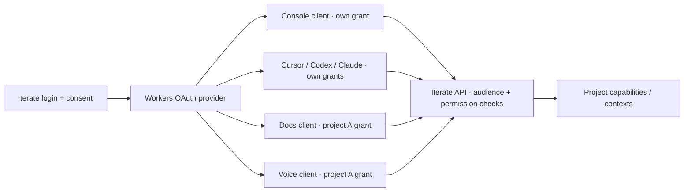

# One OAuth system for the console, MCP clients, and project apps

Historical research/planning record. The implemented design is documented in
[Unified OAuth and the issuer app](../unified-oauth-architecture.md); it supersedes
implementation choices and status statements below.

Research date: 2026-09-10. This is a researched recommendation, not an implemented design.

Follow-up: [Kitterate/ESP32 device provisioning and refreshable credentials](kit-device-oauth-research.md)
covers the browser flasher, local Bonjour login, and the missing Device Authorization extension.

The branch baseline is `1a0ffc2027d5e2a5644d1ba8f1feacaa01f1d75f`. Its recent clean-room
console/auth commits are in `packages/v3/project-worker`; the separate uncommitted V4 work
is not the basis for the current-auth findings below. The clean room pins
`@cloudflare/workers-oauth-provider` **0.10.3**. I inspected that upstream source at
[`c580aea7f79a99105fac28958edba3ab1dc317b9`](https://github.com/cloudflare/workers-oauth-provider/tree/c580aea7f79a99105fac28958edba3ab1dc317b9),
fetched upstream, and checked its open proposals. Upstream `main` at
`742e222c55f5adbd8975c964f2248ea8a1670770` differs from the release only in an
Enterprise-Managed Authorization replay-marker TTL fix. The standards reference is
the published [MCP 2026-07-28 authorization specification](https://modelcontextprotocol.io/specification/2026-07-28/basic/authorization).

## Recommendation

**Yes: make the console, Docs, Voice, and MCP hosts clients of the same Iterate
authorization server, and make a user's authorization for each client an OAuth grant.**
The provider already manages grants, access tokens, refresh tokens, client registration,
grant listing, and revocation. Its authorization machinery works for ordinary HTTP APIs
as well as MCP; applications do not need to speak MCP to be OAuth clients.
([Provider overview](https://github.com/cloudflare/workers-oauth-provider/blob/c580aea7f79a99105fac28958edba3ab1dc317b9/README.md),
[public helper API](https://github.com/cloudflare/workers-oauth-provider/blob/c580aea7f79a99105fac28958edba3ab1dc317b9/src/oauth-provider.ts#L597-L688).)

That supports the requested screen: OS in this browser, Cursor, Codex, Claude, Docs in
project A, and Voice in project A, each with its own revocable authorization. A browser
cookie still connects a browser to its application's backend. Our login handler still
establishes who the human is. Those are parts we supply around the provider, whose
documentation explicitly leaves authentication and consent to the application.
([Authorization endpoint](https://github.com/cloudflare/workers-oauth-provider/blob/c580aea7f79a99105fac28958edba3ab1dc317b9/README.md#authorization-endpoint).)

For the first version, keep authorization and token validation in the trusted platform
Worker, register project app installations as clients, and have their backends use the
Iterate API. **A Docs web app being an OAuth client does not require Docs to become a
separate OAuth resource server.** That extra role is needed when another client must
obtain a token specifically to call Docs' own protected API. Separate resource servers
are supported by OAuth's model, but the released provider's configuration is much less
convenient for them; upstream PR #289 addresses exactly that distinction (§7).

## 1. What this branch currently does

The current implementation has a shared login experience but several credential systems:

| Caller                  | Credential and validation today                                                                          | In the provider's grant list? |
| ----------------------- | -------------------------------------------------------------------------------------------------------- | ----------------------------- |
| Console browser         | A custom signed, host-only cookie; `from-server-cookie` authenticates Cap'n Web                          | No                            |
| Project app browser     | A custom signed user-on-project token, installed into a host-only cookie through `/.itx/session?token=…` | No                            |
| MCP host                | Provider-issued OAuth access/refresh tokens, with consent selecting projects                             | Yes                           |
| Device/headless project | Project API secret                                                                                       | No                            |
| Operator/tooling        | Admin API secret                                                                                         | No                            |

Evidence: [credential union and gate](../../src/session.ts),
[cookie/token signing](../../src/principal.ts),
[console app links](../../src/control-plane.ts#L618-L661),
[project ingress](../../src/worker.ts#L44-L143), and
[provider configuration](../../src/control-plane.ts#L858-L896).

The provider protects only `/mcp`, with its canonical resource pinned to
`https://<platform>/mcp`. `/api` and project-host ingress do not accept the provider's
tokens through their normal credential union. `resolveExternalToken` makes the other
platform credentials usable at MCP; it does not turn those credentials into provider
grants. Consent currently saves only `clientName` as display metadata and
`actor`, `email`, and selected `projects` as encrypted authorization props.
([Configuration and external-token hook](../../src/control-plane.ts),
[consent completion](../../src/control-plane.ts#L729-L760).)

The old remote-app mechanism is accurately described in
[remote-apps.md](../../../../../docs/remote-apps.md): the config worker proxies the project-host request,
including a short-lived project-auth cookie, to a separately deployed app. That app
presents the token back to OS as `project-app-session`. Thus the architectural question
is about replacing the proprietary delegation credential, as well as giving that
delegation a client identity and revocable grant.

Two existing details matter for a migration:

- Console sign-out only clears a signed cookie. There is no server-side browser-session
  record to enumerate or revoke individually. The current login also accepts an email
  directly; it is a clean-room placeholder, not proof of email ownership.
  ([Login/sign-out](../../src/control-plane.ts#L595-L611),
  [cookie implementation](../../src/principal.ts#L220-L273).)
- Selected project IDs become a stored permission snapshot. `reachOf()` chooses the
  explicit list, and `reachesProject()` tests inclusion without rechecking the user's
  membership. Long-lived OAuth sessions need an explicit membership-change policy;
  the provider cannot infer one from our directory.
  ([Reach](../../src/control-plane.ts#L90-L96),
  [project admission](../../src/control-plane.ts#L249-L260).)

## 2. The terms that make the design fit

| Term                    | Meaning for Iterate                                                                                |
| ----------------------- | -------------------------------------------------------------------------------------------------- |
| Identity/login session  | Evidence that this browser signed in as Jonas; used by the authorization page for SSO              |
| Authorization server    | The platform's OAuth endpoints and our login/consent handler, backed by the provider               |
| OAuth client            | Console backend, Cursor, Codex, Claude, or a Docs/Voice app installation requesting access         |
| Resource                | The API for which access is requested; identified by a canonical URI, enforced as token audience   |
| Grant                   | Jonas's authorization for one client, including its permission ceiling and refresh-token lifecycle |
| Access token            | A short-lived credential a client presents to the intended API                                     |
| Browser app session     | A cookie-based association with the app backend and its OAuth grant/tokens                         |
| Live RPC/MCP connection | A transport lifetime; it may end while its OAuth grant remains usable                              |

The role split is standard [OAuth/MCP authorization](https://modelcontextprotocol.io/specification/2026-07-28/basic/authorization#roles).
The provider's [Grant and TokenSummary types](https://github.com/cloudflare/workers-oauth-provider/blob/c580aea7f79a99105fac28958edba3ab1dc317b9/src/oauth-provider.ts#L952-L1174)
make the stored distinction concrete. Calling the resulting product page “Sessions” is
reasonable, but a grant does not prove that a client process is currently connected.

## 3. What the released provider supplies

| Capability                     | What the source actually provides                                                                                      |
| ------------------------------ | ---------------------------------------------------------------------------------------------------------------------- |
| OAuth protocol                 | Authorization-code exchange, public-client S256 PKCE, refresh rotation, revocation, AS/resource metadata, registration |
| Protected HTTP handlers        | `apiRoute` / `apiHandler`, or `apiHandlers`; validate bearer and audience, then deliver decrypted `ctx.props`          |
| Known client provisioning      | `createClient`, `lookupClient`, `updateClient`, `deleteClient`, `listClients`                                          |
| User authorization inventory   | `listUserGrants(userId, { limit, cursor })`                                                                            |
| Disconnect an authorization    | `revokeGrant(grantId, userId)` deletes the grant and its access-token records                                          |
| Internal token inspection      | `unwrapToken()` returns token identity, audience, effective scope, grant information, and decrypted props              |
| Policy during issuance/refresh | `tokenExchangeCallback` can adjust props, scope, and lifetimes, or refuse issuance                                     |
| Optional token exchange        | RFC 8693 and `exchangeToken()` for tokens within permitted resources/scopes/lifetimes                                  |

Sources: [helper interfaces](https://github.com/cloudflare/workers-oauth-provider/blob/c580aea7f79a99105fac28958edba3ab1dc317b9/src/oauth-provider.ts#L597-L688),
[protected request implementation](https://github.com/cloudflare/workers-oauth-provider/blob/c580aea7f79a99105fac28958edba3ab1dc317b9/src/oauth-provider.ts#L3833-L4026),
[callback contract](https://github.com/cloudflare/workers-oauth-provider/blob/c580aea7f79a99105fac28958edba3ab1dc317b9/src/oauth-provider.ts#L151-L246),
[exchange implementation](https://github.com/cloudflare/workers-oauth-provider/blob/c580aea7f79a99105fac28958edba3ab1dc317b9/src/oauth-provider.ts#L2995-L3164).

Its storage design is useful: credentials are located through hashes, and application
props are encrypted with keys wrapped using the tokens. Grant metadata remains readable
for management without possessing those tokens. Keep labels and project display IDs in
metadata; keep credentials and authorization-bearing application data out of display
metadata. Do not build our code around the private KV key layout.
([Storage design](https://github.com/cloudflare/workers-oauth-provider/blob/c580aea7f79a99105fac28958edba3ab1dc317b9/storage-schema.md).)

It does **not** supply a user directory, login methods, browser-cookie sessions, a sessions
UI, application permission enforcement, or a full OpenID Connect identity provider.
There are no shipped ID tokens/UserInfo flow or standard HTTP introspection endpoint to
plug into a generic OIDC client. Remote backends can use the platform API as clients;
independent resource servers need a deliberate validation integration for opaque tokens.
([Application responsibilities](https://github.com/cloudflare/workers-oauth-provider/blob/c580aea7f79a99105fac28958edba3ab1dc317b9/README.md#authorization-endpoint),
[metadata implementation](https://github.com/cloudflare/workers-oauth-provider/blob/c580aea7f79a99105fac28958edba3ab1dc317b9/src/oauth-provider.ts#L2220-L2266),
[open introspection proposal](https://github.com/cloudflare/workers-oauth-provider/pull/189).)

`unwrapToken()` is not a substitute for the protected-resource gate: it looks up the
token, checks expiry, and decrypts props, but does not apply the request's expected
audience policy. Prefer the provider's HTTP middleware. A Cap'n Web adapter using the
helper must explicitly enforce audience and application permissions. Similarly,
`ctx.props` is application data, not automatically an effective-scope/client/grant auth
context. Preserve effective scope when constructing an Iterate principal; do not turn a
downscoped token back into all the authority in its grant props.
([Inspection](https://github.com/cloudflare/workers-oauth-provider/blob/c580aea7f79a99105fac28958edba3ab1dc317b9/src/oauth-provider.ts#L1767-L1809),
[middleware](https://github.com/cloudflare/workers-oauth-provider/blob/c580aea7f79a99105fac28958edba3ab1dc317b9/src/oauth-provider.ts#L3880-L3936),
[upstream auth-context issue](https://github.com/cloudflare/workers-oauth-provider/issues/263).)

## 4. Registration: dynamic apps do not require DCR

Current MCP prefers pre-registration when credentials already exist, then **Client ID
Metadata Documents (CIMD)** for clients without that relationship. DCR remains a
compatibility path and is deprecated for new MCP implementations. CIMD means a client
identifies itself with an HTTPS URL serving its metadata; it is not the registration of
a new resource server.
([MCP client registration](https://modelcontextprotocol.io/specification/2026-07-28/basic/authorization/client-registration).)

For Iterate-owned apps, use `createClient()` when an app installation is provisioned.
Record the returned client ID against our `{ project, app }` installation, configure
exact callback URLs, and keep a confidential client's secret in its trusted backend.
The method generates the ID; supplying a preferred `clientId` does not make it use that
ID. App installation and OAuth grant remain separate: two browsers can authorize the
same installation independently.
([Client creation implementation](https://github.com/cloudflare/workers-oauth-provider/blob/c580aea7f79a99105fac28958edba3ab1dc317b9/src/oauth-provider.ts#L5479-L5540).)

This can all happen dynamically through platform code without exposing DCR to project
app code. Store an app's maximum allowed projects/permissions in our installation
catalog and intersect it with user consent and current user authority. Registration
metadata identifies the client; it is not permission to access the registered user's
projects. In particular, a client naming itself “OS” is not thereby first party.

Keep CIMD plus DCR compatibility for external MCP clients until interoperability with
the actual client versions has been proven. In 0.10.3, CIMD requires
`global_fetch_strictly_public` and supports public-client token authentication (`none`),
while programmatically registered clients can use a client secret. DCR records expire
after 90 days by default; clients created through `createClient()` do not have that
registration TTL. CIMD clients are fetched from their URLs, so `listClients()` is not a
complete inventory of all possible clients; use grant records for the user's screen.
([Registration documentation](https://github.com/cloudflare/workers-oauth-provider/blob/c580aea7f79a99105fac28958edba3ab1dc317b9/README.md#client-registration),
[client listing](https://github.com/cloudflare/workers-oauth-provider/blob/c580aea7f79a99105fac28958edba3ab1dc317b9/src/oauth-provider.ts#L5549-L5586).)

## 5. A browser app flow using the same grants

Use the server-side OAuth client pattern for the console and project apps. This is the
Backend for Frontend (BFF) architecture described in
[RFC 10017 §6.1](https://www.rfc-editor.org/rfc/rfc10017.html#section-6.1): the backend
handles code exchange and refresh, keeps OAuth tokens off frontend JavaScript, and uses
a browser cookie for its local session. Our proposed mapping is:

1. A visitor opens `docs--project-a.iterate.app`. The app's trusted backend or a
   platform-managed backend at that host starts Authorization Code + PKCE.
2. The platform authorization page uses its existing login session for SSO, authenticates
   when necessary, and grants only the permitted app/project access. First-party consent
   shortcuts must be based on platform-owned client registration, not a supplied label.
3. The provider returns a code to Docs' registered callback. Docs validates the OAuth
   transaction/issuer and exchanges the code for provider tokens.
4. Docs establishes a host-only, Secure, HttpOnly browser session associated with that
   grant and the tokens held server-side. A safe platform identity/API response supplies
   the identity fields the UI needs; opaque access tokens are not ID tokens to decode.
5. Docs calls Iterate with its OAuth access token. The API validates audience and derives
   project/capability authority under the approved grant and current policy.

This diagram shows roles; the console backend, issuer, and API can live in the same
Worker. Neither separate deployments nor network self-calls are required merely to
maintain the separation of authority.

The platform login session is still needed to bootstrap authorization. To have the
console itself appear in `listUserGrants()`, deliberately give the console a first-party
grant and associate its app session with it. Otherwise the screen can combine our login
session records with provider grants, but cannot claim all rows came from the provider.
Revoking the console's grant must also end the associated console session; if “sign out
this browser” should end SSO, invalidate its identity session too.

### What happens to the remote-app proxy?

The cleanest conventional app lets its backend own the OAuth client and browser session.
Alternatively, Iterate can supply a shared implementation at each app host. Either
approach removes the need for an independent `project-app-session` signing/verification
protocol.

If retaining a stateless external “vessel” is important, the platform-managed backend
can own the app's OAuth flow and refresh token, and hand the trusted app backend its
dedicated, short-lived Iterate API access token. That is a split implementation of the
Docs OAuth client and still requires a deliberate trusted proxy-to-backend boundary.
The token belongs to **Docs acting on Iterate**, with Docs' grant and project limits.
It must not be the console's or an unrelated MCP client's token. OAuth still uses an
Authorization header for API calls; the improvement is a standard grant/token lifecycle
and explicit delegation rather than eliminating every token-carrying header.

An app that separately accepts access tokens on its own public API is also a resource
server. It needs an audience appropriate to that API. Sharing an authorization server
does not make a token interchangeable between unrelated API audiences.
([MCP audience requirements](https://modelcontextprotocol.io/specification/2026-07-28/basic/authorization#token-handling),
[resource indicators](https://www.rfc-editor.org/rfc/rfc8707.html#section-2).)

## 6. The API resource decision we must make

The existing `/mcp` token cannot simply be accepted at `/api`. Version 0.10.3 checks
both exact equality with a configured canonical resource and whether the actual request
URL falls within the token's audience. Its path matcher accepts descendants on path
boundaries, not sibling paths or other origins.
([Validation](https://github.com/cloudflare/workers-oauth-provider/blob/c580aea7f79a99105fac28958edba3ab1dc317b9/src/oauth-provider.ts#L3880-L3929),
[resource resolution](https://github.com/cloudflare/workers-oauth-provider/blob/c580aea7f79a99105fac28958edba3ab1dc317b9/src/oauth-provider.ts#L4126-L4184).)

There are two sound designs:

| Design                                                  | Consequence                                                                                                                                                                                                                                                            |
| ------------------------------------------------------- | ---------------------------------------------------------------------------------------------------------------------------------------------------------------------------------------------------------------------------------------------------------------------- |
| One platform API resource                               | Make `/api` the actual MCP endpoint, for example, with Cap'n Web at `/api/rpc`. Pin the canonical resource to `/api`; all these routes are intentionally one API, with operation/project permissions checked separately. Project app backends are clients of this API. |
| Separate `/mcp`, `/api`, and possibly app API resources | Keep a single issuer and grant-management system, but issue audience-specific tokens. This preserves the independent resource boundaries and makes upstream multi-resource support particularly useful.                                                                |

The first design is my recommendation **if the clean room is free to choose the API
layout**: it is close to the released provider's simplest configuration and does not
require every Docs/Voice host to be an OAuth resource. It is a proposed route change,
not behavior already present. If preserving `/mcp` is a requirement, use the second
design; the shared mechanism does not depend on all clients receiving the same audience.

Do not keep an MCP transport at `/api/mcp` and merely advertise `/api` as its resource
to evade the distinction. When resource metadata is discovered from a challenge,
[RFC 9728 §3.3](https://www.rfc-editor.org/rfc/rfc9728.html#section-3.3) requires its
`resource` to match the resource URL requested by the client. MCP also requires the
[canonical server resource](https://modelcontextprotocol.io/specification/2026-07-28/basic/authorization#canonical-server-uri).
For the first design, `/api` must actually be the endpoint MCP clients use.
Its subordinate RPC routes are not additional independently discoverable MCP endpoints.

The library has `apiHandlers` and supports resource arrays on grants without a fixed
canonical resource, but that is not a complete dynamic-resource registration/policy
layer. Removing `resourceMetadata.resource` reintroduces permissive legacy behavior,
including potentially unbound grants. Do not remove it as a shortcut. A multi-resource
integration needs trusted resource selection and an allowlist.
([Authorization resource policy](https://github.com/cloudflare/workers-oauth-provider/blob/c580aea7f79a99105fac28958edba3ab1dc317b9/src/oauth-provider.ts#L5267-L5290),
[token resource policy](https://github.com/cloudflare/workers-oauth-provider/blob/c580aea7f79a99105fac28958edba3ab1dc317b9/src/oauth-provider.ts#L4126-L4184).)

RFC 8693 is also not a magic “use this MCP token anywhere” switch. The current provider's
exchange uses the existing grant and does not create a separately named Docs grant;
with our current canonical `/mcp` configuration, it cannot retarget that token to `/api`.
Use a separate app authorization when a separately revocable app connection is wanted.
([Exchange implementation](https://github.com/cloudflare/workers-oauth-provider/blob/c580aea7f79a99105fac28958edba3ab1dc317b9/src/oauth-provider.ts#L2995-L3164).)

## 7. Relevant upstream work: released versus proposed

Checked against GitHub on 2026-09-10. These are **open proposals, not 0.10.3 features**:

| Upstream work                                                                                            | Relevance                                                                                                              |
| -------------------------------------------------------------------------------------------------------- | ---------------------------------------------------------------------------------------------------------------------- |
| [#289: one AS for multiple MCP resources](https://github.com/cloudflare/workers-oauth-provider/pull/289) | Directly relevant if project app APIs become independently protected resources under the platform issuer               |
| [#292: RFC 9068 JWT access tokens](https://github.com/cloudflare/workers-oauth-provider/pull/292)        | Independent resource validation/JWKS; stacked on #289; opaque tokens are what we have today                            |
| [#189: token introspection](https://github.com/cloudflare/workers-oauth-provider/pull/189)               | Standard HTTP validation of opaque tokens by another backend; currently absent                                         |
| [#185: client credentials](https://github.com/cloudflare/workers-oauth-provider/pull/185)                | Machine identities without a human authorization flow; existing project secrets are a distinct lane today              |
| [#237: storage providers](https://github.com/cloudflare/workers-oauth-provider/pull/237)                 | Alternative storage capabilities; the release is directly KV-backed                                                    |
| [#302: CIMD `private_key_jwt`](https://github.com/cloudflare/workers-oauth-provider/pull/302)            | Stronger client authentication for metadata-document clients; not required for our pre-registered confidential clients |

None is required merely to make Docs a client of the platform API. #289 is the most
relevant upstream interface to follow for the broader multi-resource architecture.
Using `main` instead of 0.10.3 would not currently make these features available.

### What #289 would add

The PR is a **draft**, proposing a major release, at head
`decdc76440de129bfc9ec04de437bc1078903e2a`. It proposes:

| Proposed API                                                              | Purpose                                                         |
| ------------------------------------------------------------------------- | --------------------------------------------------------------- |
| `OAuthAuthorizationServer({ issuer, … })`                                 | One explicitly configured issuer                                |
| `.protectResource({ resourceMetadata, handler })`                         | Host an audience-bound resource in the same Worker              |
| `.registerResource(resource)`                                             | Permit issuance for a resource hosted elsewhere                 |
| `createOAuthResourceServer({ resourceMetadata, validateToken, handler })` | Protect a separately deployed resource Worker                   |
| `.validateToken(token, fixedResource, env)`                               | Validate for a fixed resource through a private Service Binding |

It requires each new grant/token to have exactly one registered canonical resource and
scopes automatic grant replacement to user + client + resource. It also intentionally
prevents cross-resource token exchange. This would let Docs and Voice APIs share our
issuer and provider storage while retaining separate audiences; it would not turn a
Docs-resource token into an Iterate-API token. Resource registration here is trusted AS
configuration, distinct from OAuth client registration. Our directory would still own
which project app resources exist and may be registered.
([PR #289 description and proposed source](https://github.com/cloudflare/workers-oauth-provider/pull/289).)

This is a good upstream direction to evaluate if separate app resources are required,
but the draft is not a supported release to assume available or adopt without validation.

## 8. How Cloudflare itself uses the library

I also inspected [`cloudflare/mcp` at `46641b2f8514b208a7ce808e986554219f286542`](https://github.com/cloudflare/mcp/tree/46641b2f8514b208a7ce808e986554219f286542),
whose production configuration names `https://mcp.cloudflare.com/mcp`. It pins provider
0.10.2 and uses the combined `OAuthProvider` for one MCP resource. Its app-owned
authorization handler logs into Cloudflare as an upstream OAuth client, then issues
the MCP client a provider-owned grant/token. Upstream credentials are retained in
encrypted props for calls to Cloudflare's API.
([Entrypoint](https://github.com/cloudflare/mcp/blob/46641b2f8514b208a7ce808e986554219f286542/src/index.ts#L36-L70),
[authorization handler](https://github.com/cloudflare/mcp/blob/46641b2f8514b208a7ce808e986554219f286542/src/auth/oauth-handler.ts),
[configuration](https://github.com/cloudflare/mcp/blob/46641b2f8514b208a7ce808e986554219f286542/wrangler.jsonc).)

Its refresh callback refreshes the upstream credential and explicitly invokes revocation
of the exact downstream grant on terminal upstream `invalid_grant`. Direct Cloudflare
API tokens are a separate, explicitly validated `resolveExternalToken` mode. These are
useful patterns for provider-owned credentials and bounded failure handling; the repo
is not evidence that the proposed multi-resource API is already shipping. It also has
legacy configuration such as `resourceMatchOriginOnly`; copy the intended protocol
boundary, not every historical setting.
([Refresh callback](https://github.com/cloudflare/mcp/blob/46641b2f8514b208a7ce808e986554219f286542/src/auth/oauth-handler.ts#L59-L116),
[external-token mode](https://github.com/cloudflare/mcp/blob/46641b2f8514b208a7ce808e986554219f286542/src/auth/api-token-mode.ts).)

## 9. Turning grants into a useful sessions screen

The exact provider calls are `listUserGrants(userId, options)` and
`revokeGrant(grantId, userId)`. Grant summaries include `id`, `clientId`, `userId`,
`scope`, arbitrary display `metadata`, `createdAt`, optional `expiresAt`, and the
authorization `redirectUri`. They do not include decrypted props, an online flag,
device history, or last-used time. They also do not expose the resource in the summary;
include a non-secret resource/project display description in our metadata if needed.
Grant creation happens before the authorization code is redeemed, so a listed grant
alone does not establish that the client finished connecting.
([Summary type](https://github.com/cloudflare/workers-oauth-provider/blob/c580aea7f79a99105fac28958edba3ab1dc317b9/src/oauth-provider.ts#L1265-L1310),
[listing/revocation implementation](https://github.com/cloudflare/workers-oauth-provider/blob/c580aea7f79a99105fac28958edba3ab1dc317b9/src/oauth-provider.ts#L5687-L5778).)

For concurrent browser/device sessions, explicitly decide when to set
`revokeExistingGrants: false`. The default revokes previous grants for the same
user/client. For CIMD it further matches the exact redirect URI, which does not
necessarily distinguish devices sharing a callback. Our own app-session association
should decide which grant a browser is replacing; blindly disabling replacement can
accumulate stale grants. Persist labels such as `{ kind, app, project, deviceLabel }`
as display metadata and associate first-party browser sessions with their grant IDs.
([Grant creation/replacement](https://github.com/cloudflare/workers-oauth-provider/blob/c580aea7f79a99105fac28958edba3ab1dc317b9/src/oauth-provider.ts#L5248-L5317).)

Use a small application-owned record only for information the provider does not own:
the browser-session association, last activity if wanted, and durable disconnect/audit
history. Revocation deletes provider records; it is not a historical audit log. Enforce
that the signed-in user is the `userId` passed to listing/revocation, rather than exposing
the privileged helpers as arbitrary client RPC.

Revocation also needs an honest operational contract. The release deletes token records
and the grant through KV; ordinary access-token validation reads a denormalized token
record. Cloudflare documents eventually consistent reads, so this is not instant global
revocation. Nor does deleting a token automatically terminate a Cap'n Web socket or
recall a capability already handed out. Existing sessions need a bounded lifetime or
an explicit revocation signal/check, and the UI must reflect that policy.
([Provider revoke/read paths](https://github.com/cloudflare/workers-oauth-provider/blob/c580aea7f79a99105fac28958edba3ab1dc317b9/src/oauth-provider.ts#L5739-L5778),
[KV consistency](https://developers.cloudflare.com/kv/concepts/how-kv-works/#consistency),
[current capability session lifetime](../../src/session.ts).)

The refresh-token default is 30 days and access-token default one hour. The provider
keeps the previously used refresh token valid until a newer token is used; it is an
availability policy, not strict replay detection. KV concurrency is discussed in
[#214](https://github.com/cloudflare/workers-oauth-provider/issues/214). Coordinate
refreshes for each app session rather than refreshing once per parallel request, and
test refresh/revoke races before claiming bounded disconnection behavior.
([Lifetimes](https://github.com/cloudflare/workers-oauth-provider/blob/c580aea7f79a99105fac28958edba3ab1dc317b9/src/oauth-provider.ts#L393-L407),
[rotation implementation](https://github.com/cloudflare/workers-oauth-provider/blob/c580aea7f79a99105fac28958edba3ab1dc317b9/src/oauth-provider.ts#L2906-L2933).)

## 10. What an implementation should prove

This research does not change the implementation or claim a runtime proof. The useful
next slice would register the console and one Docs installation, complete their normal
authorization-code flows, and show them beside an MCP client in the provider-backed
grant list. Before replacing the current credentials, prove:

- Two browser/device grants can coexist, and disconnecting Docs does not disconnect
  the console or another client.
- A project A grant cannot reach project B; an app cannot exceed its installation's
  permission ceiling; a narrowed OAuth scope remains narrowed at the capability gate.
- Wrong audiences are refused, and MCP discovery works for real clients at the chosen
  canonical resource URL.
- Browser callbacks, cookie requests, and WebSocket authentication enforce the intended
  origin/CSRF policy without forwarding the platform's SSO cookie to app backends.
- Expiry, refresh concurrency, user membership removal, revoked grants, already-open
  sockets, and page reloads all follow the documented session policy.
- A preview deployment's traces and resulting state agree with these outcomes, including
  correctly classified expected authorization refusals.

The recommended implementation boundary is therefore **provider-owned OAuth grants and
credentials; platform-owned identity, app registration policy, browser session adapters,
and capability authorization**. That gets the requested common mechanism while relying
on the upstream library for the protocol and token lifecycle it actually implements.
