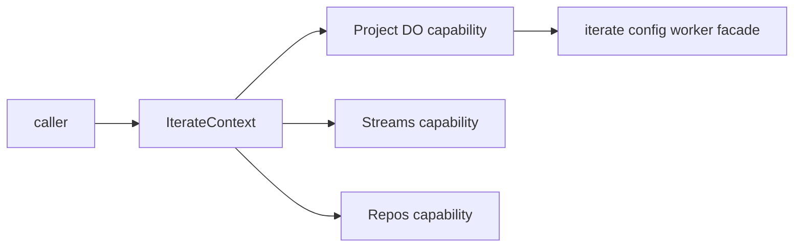

# Iterate Context

`IterateContext` is the one capability tree we want application code, dynamic
workers, codemode snippets, Vitest e2e tests, and developer scripts to use when
they talk to OS runtime capabilities.

The goal is not to force every call through one Durable Object. The goal is to
give every caller the same authority-shaped API:

```ts
await ctx.projects.get("proj_123").describe();
await ctx.project.fetch(request);
await ctx.streams.read({ streamPath: "/agents/a", afterOffset: "start" });
await ctx.project.worker.someTool({ input: "value" });
using sdk = await ctx.sdk;
await sdk.chat.postMessage({ channel: "C123", text: "hi" });
```

## Model

`IterateContextProps` has only scopes and mounts:

```ts
type IterateContextProps = {
  scopes: ProjectScopes;
  mounts?: Mount[];
};

type ProjectScopes = {
  projects: "all" | string[];
};
```

Scopes decide what can be reached. Mounts decide which shortcuts or custom RPC
targets appear on `ctx` for this execution.

There is no separate privileged context type. A root session is just an
`IterateContext` with `scopes: { projects: "all" }`. A project-scoped session is
the same `IterateContext` with `scopes: { projects: ["proj_123"] }`.

## Capability Tree

The canonical root is the context itself:

```text
ctx
├── projects
│   └── get("proj_123")
│       ├── fetch(request)
│       ├── ingressFetch(request)
│       ├── egressFetch(request)
│       ├── streams
│       ├── repos
│       ├── workspace
│       └── worker
├── project        # shortcut when scopes contain exactly one project
├── streams        # shortcut to ctx.project.streams
├── repos          # shortcut to ctx.project.repos
├── workspace      # shortcut to ctx.project.workspace
└── worker         # shortcut to ctx.project.worker
```

`ctx.project` is exactly the project capability for the scoped project. It is
not `ctx.projects.get(id).project`; it is the same thing as
`ctx.projects.get(id)`.

```ts
using project = await ctx.projects.get("proj_123");
using sameProject = await ctx.project;

await sameProject.fetch(request);
await sameProject.ingressFetch(request);
```

The path is canonical API shape, not a routing diagram. `ctx.project.fetch()`
uses the Project Durable Object because ingress/config-worker behavior is
project-owned. `ctx.streams.read(...)` may go directly to the stream runtime
because streams can enforce the same project scope without using the project DO
as a hop.



## Mounts

A mount says: "make this target callable at this path on `ctx`."

```ts
type Mount = {
  path: string[];
  invoke?: "target" | "method";
  target: MountTarget;
};

type MountTarget =
  | {
      type: "ctx";
      call?: TargetCall[];
    }
  | {
      type: "dynamic-worker";
      script: string;
      entrypoint?: string;
      loader?: { get: string };
      call?: TargetCall[];
    };

type TargetCall =
  | string
  | {
      method: string;
      args?: unknown[];
    };
```

String `TargetCall` segments are getter/property access. Object segments are
method calls:

```ts
["projects", { method: "get", args: ["proj_123"] }, "streams"];
// ctx.projects.get("proj_123").streams
```

The default `invoke` is `"target"`:

```ts
{
  path: ["tools"],
  target: {
    type: "dynamic-worker",
    script: toolsWorkerSource,
  },
}

await ctx.tools.echo({ text: "hi" });
await ctx.tools.nested.describe();
```

Use `"method"` for root-level shortcut methods:

```ts
{
  invoke: "method",
  path: ["append"],
  target: {
    type: "ctx",
    call: ["projects", { method: "get", args: ["proj_123"] }, "streams", "append"],
  },
}

await ctx.append({
  streamPath: "/agents/a",
  event: { type: "events.iterate.com/example", payload: {} },
});
```

For SDK-shaped APIs whose method hierarchy is not known ahead of time, prefer a
normal target mount whose target returns `localProxyCaller(...)` from a getter or
method:

```ts
{
  path: ["sdk"],
  target: {
    type: "dynamic-worker",
    script: `
      import { WorkerEntrypoint } from "cloudflare:workers";
      import { localProxyCaller } from "./local-proxy-wrapper.js";

      export default class SdkTarget extends WorkerEntrypoint {
        get sdk() {
          return localProxyCaller(({ path, args }) => this.call({ path, args }));
        }

        async call({ path, args }) {
          return {
            method: path.join("."),
            args,
          };
        }
      }
    `,
    call: ["sdk"],
  },
}

using sdk = await ctx.sdk;
await sdk.chat.postMessage({ channel: "C123", text: "hi" });
```

That final call becomes:

```ts
await target.call({
  path: ["chat", "postMessage"],
  args: [{ channel: "C123", text: "hi" }],
});
```

The same shape works for nested shortcuts:

```ts
{
  path: ["some", "path", "sdk"],
  target: {
    type: "dynamic-worker",
    script: sdkWorkerSource,
    call: ["sdk"],
  },
}

using sdk = await ctx.some.path.sdk;
await sdk.chat.postMessage({ channel: "C123", text: "hi" });
```

The mount resolver still finds the most specific path. The difference is that
the target decides whether the returned value is a normal RPC target, a method,
or an SDK-shaped local proxy marker.

## Built-In Roots

Built-in roots and shortcuts are normal `IterateCapability` getters inferred
from scopes. They are not user mounts and are not trusted user input.

For `scopes: { projects: "all" }`, the root `projects` collection is available:

```ts
using projects = await ctx.projects;
using project = await projects.get("proj_123");
```

For `scopes: { projects: ["proj_123"] }`, the context also gets project
shortcuts:

```ts
ctx.project; // ctx.projects.get("proj_123")
ctx.streams; // ctx.project.streams
ctx.repos; // ctx.project.repos
ctx.workspace; // ctx.project.workspace
ctx.worker; // ctx.project.worker
```

A shortcut cannot grant new authority. It only points at something already
reachable through the scoped canonical tree.

## Streams

Streams currently take the stream path in method inputs:

```ts
await ctx.streams.read({
  streamPath: "/agents/a",
  afterOffset: "start",
});
```

At the root, the intended collection ergonomics are that a fully-qualified
durable stream name can include the project:

```ts
ctx.streams.get("proj_123:/agents/a");
```

Project shortcuts are convenience only:

```ts
ctx.projects.get("proj_123").streams.get("/agents/a");
// same domain idea as:
ctx.streams.get("proj_123:/agents/a");
```

That `.get(...)` collection shape is a requirement for the capability model, not
the whole current implementation. The e2e coverage today proves the existing
`append`, `read`, `list`, and related `streamPath` methods.

Different domains may construct durable object names differently. Some names
are `namespace:path`, some are JSON, and some are globally unique IDs. The
domain capability owns that naming rule; callers should use the capability path
that matches the domain concept.

## Dynamic Workers

Dynamic workers receive a skinny named WorkerEntrypoint binding:

```ts
export default {
  async fetch(_request, env) {
    const ctx = await env.ITERATE.context;
    return Response.json(await ctx.project.describe());
  },
};
```

`env.ITERATE` is created with the same `IterateContextProps`:

```ts
ctx.exports.IterateContextEntrypoint({
  props: {
    scopes: { projects: ["proj_123"] },
    mounts: [],
  },
});
```

Dynamic mount workers also receive `env.ITERATE`, scoped to the same authority:

```ts
import { WorkerEntrypoint } from "cloudflare:workers";

export default class Tools extends WorkerEntrypoint {
  async echo(input) {
    const ctx = await this.env.ITERATE.context;
    using streams = await ctx.streams;
    const visibleStreams = await streams.list();
    return { input, visibleStreams: visibleStreams.length };
  }
}
```

## `/run` Snippets

The `/api/captnweb/run` path exists so Vitest and codemode can run the same
function shape in Node or in a dynamic worker:

```ts
type CapnwebFunctionInput<Vars> = {
  ctx: IterateContext;
  env: Record<string, unknown>;
  vars: Vars;
};

async function snippet({ ctx, vars }: CapnwebFunctionInput<{ projectId: string }>) {
  using projects = await ctx.projects;
  using project = await projects.get(vars.projectId);
  return await project.describe();
}
```

The dynamic `/run` response is always JSON. Snippet results must be serializable.

Because Vitest lowers `using` before `fn.toString()`, the `/run` wrapper provides
the explicit-resource-management helper functions that the serialized snippet
expects. Use `using` in shared test/snippet code instead of manual disposable
arrays.

## Project Config Worker

The iterate config `worker.js` is exposed through the project capability:

```ts
using project = await ctx.project;
using worker = await project.worker;

await worker.fetch(request);
await worker.someTool({ value: 1 });
```

`ctx.project.worker.someTool()` does not transfer the raw dynamic-worker
entrypoint. It calls a parent-owned Project Durable Object facade, which forwards
to the config worker internally.

Inside config `worker.js`, custom tools use the same context:

```ts
export default {
  async someTool(input, env) {
    const ctx = await env.ITERATE.context;
    using streams = await ctx.streams;
    await streams.append({
      streamPath: "/tools/someTool",
      event: {
        type: "events.iterate.com/tool-called",
        payload: input,
      },
    });
    return { ok: true };
  },
};
```

## First-Party Code

First-party handlers should construct the same capability tree instead of using
a separate tool system:

```ts
const ctx = createIterateContext({
  context: appContext,
  projects: createProjectsCapability({ context: appContext }),
  props: { scopes: { projects: ["proj_123"] } },
});

using project = await ctx.project;
return await project.describe();
```

oRPC procedures can still use domain helpers directly when that is cleaner, but
the behavior should be explainable as the same scoped capability tree.

## Runtime Constraints

These are observed constraints from the e2e implementation:

- Do not mutate `IterateContext.prototype`. Runtime mounts are installed on a
  per-instance prototype so one context's mounted methods do not leak into
  another context.
- Dynamic-worker entrypoints returned by `env.LOADER.load(...).getEntrypoint()`
  cannot be transferred to another Worker.
- A dynamic `/run` worker cannot call the parent and have the parent forward to
  a second dynamic worker over the same RPC call. `/run` therefore loads dynamic
  mount scripts as modules in the same dynamic worker isolate as the snippet.
- Normal Cap'n Web and Workers RPC stubs should pass through untouched. The
  local SDK proxy applies only to marker values returned by `localProxyCaller`.
- SDK marker ergonomics require the caller side to run `liftLocalProxies(...)`
  once around the Cap'n Web session or injected context.
- The root `/run` bridge returns JSON, not live RPC stubs.

## Proven E2E Shapes

The Cap'n Web e2e suite proves these shapes in both Node and dynamic `/run`
execution:

```ts
using projects = await ctx.projects;
using project = await projects.get(projectId);
await project.describe();
```

```ts
using project = await ctx.project;
await project.fetch(new Request("https://project.example/"));
await project.egressFetch(new Request(echoUrl));
```

```ts
using tools = await ctx.tools;
await tools.echo({ marker });
await tools.nested.describe({ marker });
```

```ts
await ctx.rootEcho({ marker });
await ctx.append({
  streamPath,
  event: { type: eventType, payload: { marker } },
});
```

```ts
using sdk = await ctx.sdk;
await sdk.chat.postMessage({ text: marker });

using nestedSdk = await ctx.some.path.sdk;
await nestedSdk.chat.postMessage({ text: marker, via: "nested" });
```

The Cap'n Web e2e file runs alongside the full local and deployed preview OS
e2e suites so context changes are checked against codemode, agents, oRPC,
streams, workspace, MCP, and Slack flows.
