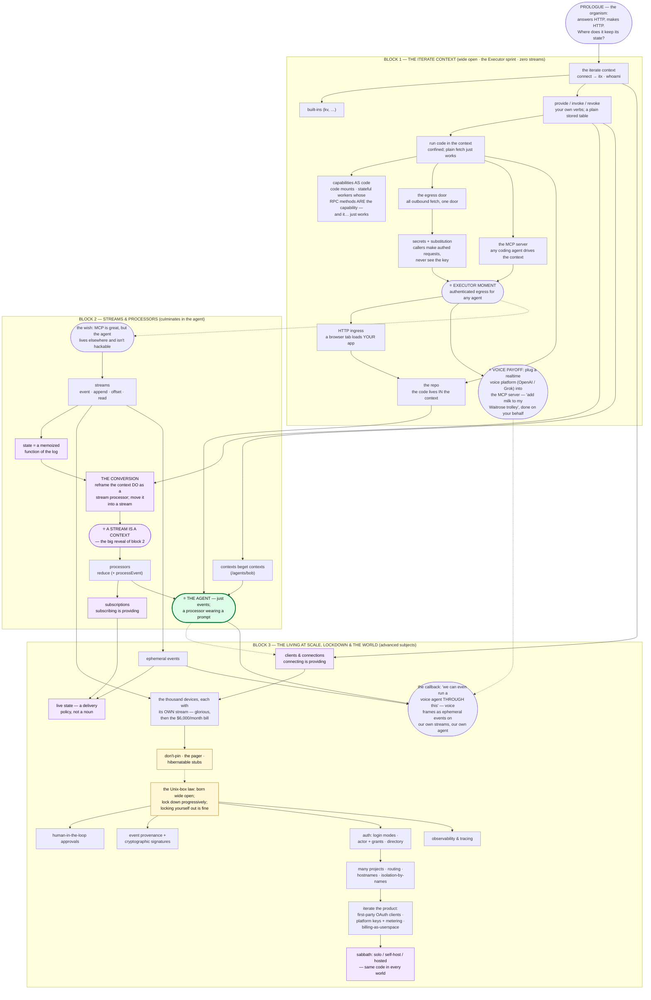

# The Bible — tech tree v3 (three blocks; carving; annotate freely)

2026-08-19. One artifact, three audiences: (i) Jonas + Misha alignment; (ii) AI agents
learning the layout; (iii) later, a build-from-scratch tutorial series. Describes the WHOLE
target system; clean room = largest built region; apps/os = proof of concept. Simplified
technical English; **no term used before it is introduced**; Cloudflare technologies are
NOT tree nodes — they are link-out unlocks ("we have just the thing for it") listed per
block.

**The shape (this round's ruling):** three blocks. Block 1 = the iterate context, sprinting
to an Executor-like payoff, with **no streams anywhere**. Block 2 = streams & stream
processors — big reveal: **a stream is a context** — culminating in **our own agent**.
Block 3 = advanced subjects: the living at scale (thousand devices, don't-pin), then
progressive lockdown & the world. The tech tree is the data structure; onion layers ≈ the
blocks; the gap chain is the narrative fuel.

---

## The tree

Solid arrows = concept `needs`. Dotted = block transitions (narrative, not dependency).
Purple = reveals (no new mechanism — an is-just-a collapse). Yellow = laws. Green = the
summit.

---

## Block 1 — THE ITERATE CONTEXT (wide open; the Executor sprint)

The whole block runs like a fresh Unix box: **no auth, no lockdown, wide open** — that is
deliberate and stated up front. No streams anywhere in this block.

1. **The context** — connect over a WebSocket, receive `itx`, call `whoami()`. One
   addressable place. _(link-outs: Cloudflare Workers, Durable Objects, capnweb,
   Workers RPC)_
2. **Built-ins** — `itx.kv` and friends; typed getters. _(link-out: Workers KV)_
3. **provide / invoke / revoke** — your own verbs; static values and aliases (itx
   expressions); a plain stored table. NOT event-sourced — deliberately; block 2 will
   re-found it.
4. **Run code in the context** — a mount that RUNS; confined isolate holding only
   `env.ITX`; plain `fetch` just works (planted — paid off next). _(link-out: Worker
   Loader)_
5. **Capabilities AS code** — provide a capability whose implementation IS dynamic worker
   code (a `code` mount). Then go further: provide **stateful** dynamic worker code — a
   class whose RPC methods become the capability's methods (`itx.counter.add(1)`) — and
   it… **just works**. (Grounded: the clean room's `code` + `stateful` mounts, native
   facet-method RPC.)
6. **The egress door** — every outbound `fetch` from confined code goes through ONE door.
   Gap: you want scripts to call third parties — but controlled.
7. **Secrets + substitution** — `{{secret:…}}` placeholders substituted at the door,
   headers-only; the script (or agent) makes authenticated requests and **can never see
   the key**. Secrets only become relevant once egress exists — the dependency is real.
8. **The MCP server** — the context exposed so ANY coding agent can drive it. Gap: "as
   soon as somebody can run a script against the context — what if that somebody is an AI
   agent?"
9. **⭐ THE EXECUTOR MOMENT** — the block's payoff sprint: _an MCP server any coding agent
   can use to make authenticated egress requests._ A real, usable product with nothing but
   the context.
10. **HTTP ingress** — a browser tab loads something served BY the context; your app at a
    hostname.
11. **The repo** — the code lives IN the context (`repo.put` → run it); reveal: **config is
    a web server, not a settings file**.
12. **⭐ THE VOICE PAYOFF** — plug a plug-and-play realtime voice platform (OpenAI's
    realtime API + MCP support, or Grok's) into our wide-open MCP server: a **voice agent
    takes actions in our system on our behalf**. The Waitrose example: "add milk to my
    trolley" → real search, real basket, authenticated egress — and the voice agent never
    saw the credentials. (Grounded: the Waitrose userspace integration is live-proven on
    prd, agent-autonomous.) _Plant:_ "later, we'll run a voice agent THROUGH this."

Everything here — scripts, egress, secrets, MCP, ingress, repos, dynamic workers, even a
voice agent driving it all — is usable through the MCP server **without streams even being
a thing**.

## Block 2 — STREAMS & PROCESSORS (culminating in the agent)

Opens with **the wish**: MCP was great, but the agent lives somewhere else and isn't
hackable. We want OUR OWN agent — and the agent turns out to need everything in this block.

1. **Streams** — event · append · offset · read; `itx.stream`. _(link-out: DO SQLite)_
2. **The Tobi reveal** — state is just a memoized function of the log (VERBATIM-TODO).
3. **The conversion** — go back to the iterate context DO and reframe it as a stream
   processor; the mount table becomes a fold of `capability-provided` events
   (provide/revoke were appends all along); then move the whole thing INTO a stream.
4. **⭐ A STREAM IS A CONTEXT** — the big reveal of block 2. After the conversion there is
   one thing, not two.
5. **Processors** — `reduce` (+ `processEvent` for effects); the placement rule (inline /
   facet / userspace) as the technical footnote. _(link-outs: DO facets, alarms)_
6. **Subscriptions** — a mount at `itx.subscribers.*`; **subscribing is providing**; push
   mode with retry-skip-halt.
7. **Contexts beget contexts** — `/agents/bob` gets its own context; attenuation by
   context.
8. **⭐ THE AGENT** — the summit. The journaling law (an LLM's answer cannot be re-derived
   — journal it, never rerun it), then: **an agent is just events** — a processor wearing a
   prompt. Memory, replay, audit fall out. The inner book closes: _in the abstract, one
   ordered log; the organism has its state._

## Block 3 — THE LIVING AT SCALE, LOCKDOWN & THE WORLD (advanced subjects)

**The living at scale** (moved here per annotation — an advanced subject, and the argument
is strongest AFTER streams exist):

1. **Clients & connections** — connect = get + presence; **connecting is providing**;
   roster, fan-out, kick.
2. **The thousand devices** — now we can do a ton of cool shit: connect 1000 ESP32s +
   browsers, remote-control them, **each device with its OWN stream** — glorious. Then the
   bill: every connection pins a Durable Object, and suddenly it's **$6,000 a month**.
   **Don't-pin** (law) → the pager + hibernatable stubs. _(link-out: WebSocket
   hibernation)_
3. **Ephemeral events** — the devices flood the log; frames that deliver but never
   persist.
4. **Live state** — the third delivery policy; patches + re-seed; the present is
   re-askable; **a policy, not a noun**.
5. **The voice callback** — block 1's plant pays off: "we can even run a voice agent
   THROUGH this" — voice frames ride our own streams as ephemeral events, our own agent
   answers; the plug-and-play platform from block 1 is now just one more client.

**The lockdown**, opening with **the Unix-box law**: the system is born wide open and gets
locked down progressively; you can absolutely lock yourself out, and that's fine.

Unordered inventory (sequence = open hook):

- **Human-in-the-loop** — approvals on actions.
- **Event provenance + cryptographic signatures** — who appended this, and can you prove
  it; a whole section of its own.
- **Auth** — login modes (open → email → access = the lockdown dial), actor + grants
  (three credential kinds, one resolution), the directory (users → orgs → projects →
  devices). _(link-out: D1, OAuth/MCP specs)_
- **Many projects** — one namespace; isolation = which names you can construct;
  outer-writes-inner; routing (hostname → project); reserved host.
- **Observability & tracing.**
- **Iterate the product** — first-party OAuth clients (integrations = events + secrets,
  collapse deliberately not taken), platform keys + metering, **billing is a userspace
  processor**.
- **Sabbath** — solo / self-host / hosted: same code in every world; portability is a
  provider concern; residency = a capability override.

---

## Open hooks (annotate these)

1. **Block 1 table durability**: is the block-1 mount table deliberately in-memory (so the
   RESTART gap can open block 2), or plainly stored (and block 2 opens on the agent-wish
   alone)? Currently: stored; wish-driven.
2. ~~Block 2 strand interleave~~ — RESOLVED by annotation: the living strand moved to
   block 3 as an advanced subject; block 2 is a single spine to the agent.
3. **PATHS placement**: right before the agent (adopted — the agent lives at its own
   path), or earlier in block 1?
4. **kv in block 1**: keep `itx.kv` as the day-1 built-in, or start with secrets/egress
   only?
5. **Block 3 order**: living-at-scale first, then lockdown (current) — or interleaved?
   Also whether provenance/signatures belong before or after auth.
6. **Observability placement**: block 3 (current) vs block 2 (tracing processors is where
   pain first appears).
7. **Genesis material** (birth = first append to a virgin path; endowments; born broke):
   place in block 3, keep as apocrypha, or cut.
8. **MCP appears twice** (block 1 wide-open; block 3 authed with emerge-with-a-project).
   Same node revisited, or two nodes?
9. **Three blocks or four**: block 3 now holds two unrelated movements (the living at
   scale; the lockdown/world). Split into four blocks, or keep three with two movements?
10. **CLIENT pull-forward**: clients & connections moved to block 3 with the living
    strand — but if a block-1/2 moment wants a live browser participant, it could come
    earlier. Currently: block 3.

## The settled ledger (rounds 1–4, compressed)

- Three audiences (team / agents / internet-tutorials-later); whole target system;
  apps/os = PoC; clean-room-wins on vocabulary; carve now, living later.
- Tech tree = data structure; blocks/onion = eras; gap chain = narrative; **narrative
  fragments have their own dependency edges** distinct from concept edges.
- Prologue = the organism (HTTP in, HTTP out) + "where does it keep its state?"
- Egress + secrets EARLY (block 1); secrets depend on egress; MCP long before our own
  agent; the Executor sprint is block 1's payoff — capped by the VOICE payoff (plug-and-
  play realtime voice platform drives the MCP server; the Waitrose example), with the
  "voice agent THROUGH this" callback landing in block 3's living movement.
- Streams deliberately withheld until block 2; the conversion (context DO reframed as a
  stream processor, moved into a stream) lands the big reveal — **a stream is a context**;
  the agent is the summit.
- The living at scale (clients, thousand-devices-each-with-own-stream, ~$6k/month,
  don't-pin, ephemerals, live state) = block 3 advanced subjects, AFTER streams — per
  annotation.
- Block 3 also = progressive lockdown (the Unix-box law) + provenance/signatures +
  observability + product + topologies.
- The floor is called **the kernel**; "core" is reserved for the inline core processor.
- Cloudflare tech = link-outs, not nodes. Glossary + anti-glossary: later. Misha: parked.
  Lightweight-build form: parked. Tobi tweet verbatim: TODO.

## The graveyard (words the Bible must not resurrect)

the lattice · Level 1/2/3 · the four archetypes · the wall · runner · seed (as the
kernel's name) · connector · consume · tenant/workspace/org · message/record · doorbell ·
rootParent/parent · the roots object · egress-as-a-noun in prose (the door stays; "there
is only fetch" pending block-3 treatment) · organ / worldline / Effect Court.
