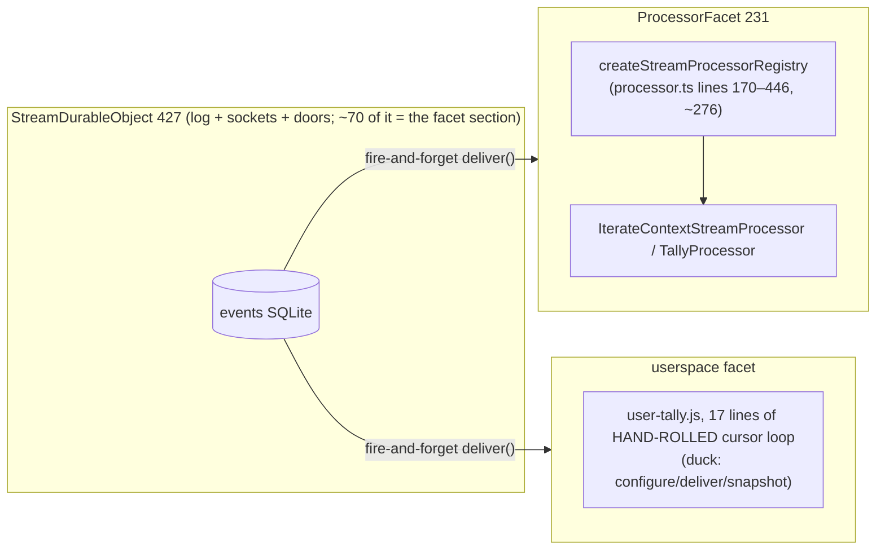

# Processors jam v2 — streams, stream processors, and how dynamic workers load

v2 after the owner's annotations on v1. **DECIDED: Proposal C** ("yes we should do this — the
base class is part of our SDK"). Everything else below is v1 made concrete: real line counts,
real code, the exact itx expression for remote placement, and the problems worked through.
Grounded in the clean room at `annotations-1` (`packages/v3/project-worker`).

## Today, with real numbers



| piece                                      | lines | what it is                                                                                                                                                                                           |
| ------------------------------------------ | ----- | ---------------------------------------------------------------------------------------------------------------------------------------------------------------------------------------------------- |
| `core/processor.ts`                        | 446   | contract (~105) + `StreamProcessor` author base (~65) + **the registry (~276)**: `Map<name, Registered>`, `register`, `deliver`, `catchUp(name?)`, `reads(processor)`, the `runnerHooks` static seam |
| `processor-facet.ts`                       | 231   | the facet DO: configure/deliver/snapshot, `FACET_PROCESSORS` built-ins map, one registry instance wired per facet                                                                                    |
| `stream-durable-object.ts` (facet section) | ~70   | `#facetEntries`/`#facet`/`enableProcessor`/`facetSnapshot` — builds either the built-in facet or a loader-loaded userspace class                                                                     |
| `hello-files.ts` user-tally demo           | 17    | a userspace processor that must hand-roll its own cursor discipline and gets NONE of the five rules                                                                                                  |

The structural facts driving the collapse: **every facet hosts exactly one processor** (the Map,
per-name catchUp, and the register/reads/runnerHooks indirection are all bookkeeping for a
multi-tenancy that never occurs), and **userspace processors get a worse deal than built-ins**
(they hand-roll the cursor and get no serial chain, no at-head pass, no refold, no barrier).

### What `configure` is (v1's answer, kept)

First contact. A facet wakes knowing nothing — the parent calls
`configure({parentName, projectId, path, slug})` once and the facet persists it in its own kv,
so a fresh incarnation after eviction re-resolves its parent **by name** (a retained stub would
pin). It stays — but it is the _runner's_ job; after the collapse no processor author ever
writes or sees it.

## The collapsed world (Proposal A, made concrete)

The five rules move into `StreamProcessor` itself. They are all per-processor invariants; the
base class can hold them directly — the `runnerHooks` seam dies too (a class does not need a
seam to reach its own protected methods).

```ts
// core/processor.ts after — the whole author + runner surface, one class
export abstract class StreamProcessor<State> {
  abstract readonly contract: ProcessorContract<State>;
  constructor(args: {
    stream: ProcessorStream;        // append + read, as today
    storage: KvLike;                // NEW: the hosting facet's kv, handed in
    path: string; projectId: string;
  }) { … }

  // ── the author surface (unchanged) ──
  protected reduce(args: ReduceArgs<State>): State | null | undefined;
  protected processEvent(args: ProcessEventArgs<State>): undefined;   // blockProcessorWhile / runInBackground / delivery.caughtUp — all as today
  protected idempotencyKey(key: string, whileProcessing?: StreamEvent): string;

  // ── the runner surface (absorbed from the registry) ──
  /** The drive door. Cursor-driven: enqueue one catch-up on this processor's own serial
   *  chain; each pass reads contiguously from the PERSISTED fold. A wake carries nothing. */
  wake(): Promise<void>;
  // ── the read surface: apps/os StreamProcessorRpc, verbatim ──
  snapshot(): Promise<ProcessorSnapshot<State>>;
  getRuntimeState(): Promise<ProcessorRuntimeState<State>>;
  waitUntilProcessed(input: { offset: number; timeoutMs?: number }): Promise<void>;

  // private: #chain #running #progress #waiters #loadProgress #refoldIfNeeded #processBatch
}
```

The facet runner after:

```ts
export class ProcessorFacet extends DurableObject<Env> {
  configure(identity: FacetIdentity) {
    this.ctx.storage.kv.put("identity", identity);
  }
  deliver() {
    return this.#processor().wake();
  } // params gone — wake carries nothing
  snapshot() {
    return this.#processor().snapshot();
  }
  getRuntimeState() {
    return this.#processor().getRuntimeState();
  }
  waitUntilProcessed(input) {
    return this.#processor().waitUntilProcessed(input);
  }
  #processor() {
    /* rehydrate identity → FACET_PROCESSORS[slug] or the SDK-loaded class,
                    constructed with {stream: parent-by-name, storage: this facet's kv} */
  }
}
```

The parent does not change shape at all: same `enableProcessor`, same fire-and-forget drive,
same duck contract (minus deliver's now-unused params).

**Honest line accounting** (estimates, labeled as such):

| file                        | today | after | Δ        | why                                                                                                                  |
| --------------------------- | ----- | ----- | -------- | -------------------------------------------------------------------------------------------------------------------- |
| `core/processor.ts`         | 446   | ~340  | **−106** | registry −276; base class absorbs the mechanics +~170 (chain, catch-up loop, processBatch, refold, three read verbs) |
| `processor-facet.ts`        | 231   | ~190  | −41      | no registry construction/wiring; reads verbs are one-line forwards                                                   |
| `stream-durable-object.ts`  | 427   | ~427  | 0        | unchanged (drive + facet section keep their shape)                                                                   |
| `hello-files.ts` user-tally | 17    | ~8    | −9       | see the SDK example below — and it _gains_ the five rules                                                            |
| concepts                    | —     | —     | **−3**   | "the registry", the `runnerHooks` seam, and `reads()` all stop existing                                              |

Net ~−150 lines, but the real win is conceptual: "a processor" and "the thing that runs a
processor" become the same object, and there is exactly one processor contract in the world.

## The SDK (Proposal C — DECIDED)

Userspace stops hand-rolling. After:

```js
// user-tally.js — userspace, loaded via the Worker Loader
import { StreamProcessor } from "./processor.js"; // ← injected SDK module, like itx.js today
export class UserTally extends StreamProcessor {
  contract = {
    slug: "user-tally",
    version: "1",
    consumes: ["*"],
    emits: [],
    initialState: () => ({ counts: {} }),
  };
  reduce({ event, state }) {
    return { counts: { ...state.counts, [event.type]: (state.counts[event.type] ?? 0) + 1 } };
  }
}
```

Eight lines, and the five rules + cursor + refold + read verbs come free. The generic runner DO
is ALSO part of the injected SDK, so userspace never writes a DurableObject — the parent's
`#facet` loads the user's module alongside the SDK and hosts their export in the SDK runner
(`ref` becomes `{source, export: "UserTally"}`).

Two problems worked through, one open choice:

1. **Single source of truth for the subtlest code.** The five rules must NOT exist twice (host
   TypeScript + a hand-maintained JS string would drift — these are the most delicate ~150
   lines in the package). Two honest options:
   - **(a) prebuild:** keep the mechanics in TypeScript; a one-line esbuild step in the deploy
     script emits `processor-sdk.js`, which the host imports as a text module and
     `confinedWorker` injects. Types stay on the subtle code; vitest tests the TS directly;
     cost = the package's first build step.
   - **(b) plain-JS core:** write the mechanics once as dependency-free JS with JSDoc types;
     host imports it as code, loader injects it as text. No build step; cost = the subtlest
     code loses strict typing internally.
     **Recommend (a)** — the rules deserve the type checker more than the package deserves
     zero build steps.
2. **zod.** The host contract validates with zod; shipping zod into every userspace isolate is
   heavy. Resolution: `stateSchema`/payload schemas become _host-side_ concerns of built-ins;
   the SDK contract takes `initialState: () => State` and treats any object with `.parse` as an
   optional schema (bring-your-own). The refold trigger stays `contract.version` — unchanged.
3. **Versioning.** Already solved by existing machinery: the loader `cacheKey` carries deploy
   id + content hash (an SDK change is a deploy → new isolate), and the facet version-marker
   pattern aborts + recreates the facet KEEPING its storage on source change. A refold happens
   only when the author bumps `contract.version` — SDK upgrades never re-run side effects.

## Remote placement — the exact expression (v1's Q4, answered properly)

The owner asked: _what is this itx expression exactly? Can it be one kind — can expressions
target facets? How do we exploit being in a facet?_

**One caller-facing kind.** A processor row generalizes from `{slug, ref?}` to:

```jsonc
{ "slug": "tally" }                                   // facet placement — the HOST's base case
{ "slug": "heavy",                                     // remote placement — an ordinary itx
  "target": "itx.workers.get({ type: 'stateful', source: ['itx','files',['read','/heavy.js']], className: 'HeavyRunner' })" }
{ "slug": "basement",
  "target": "itx.clients.get('basement-pc')" }         // a NAT'd box provides the processor LIVE
```

The row's `target` is an ordinary itx expression evaluated in **event scope** (no `roots` —
the provenance gate applies unchanged, so a remote target can never spell a physical binding).
Whatever it resolves to just has to answer the duck verbs: `wake`, `snapshot`,
`getRuntimeState`, `waitUntilProcessed`. The wake stays a fire-and-forget nudge carrying
nothing; the remote processor reads the stream through its own confined `env.ITX`
(`itx.streams.get(path).read(after)`) and folds into its own DO storage.

So: facets are NOT targeted by expressions, and don't need to be — the absent-`target` facet
default is the host's base case, exactly as config seeds are the base case of the capability
table and `env` bindings are the base case of roots. One caller-facing kind (an itx
expression); one host base case. This is also apps/os's shape verbatim: a processor-wake
subscription row is served from the facet or has the read verbs "replayed onto an expression
row's own processor node."

**What the facet base case buys** (the owner's "how do we take advantage" — this is why it's
the default, and why remote must stay the exception):

1. **Locality:** parent→facet calls are in-process; the facet reads the log through
   parent-by-name on the same machine. A remote processor pays a network hop per wake AND per
   read page.
2. **Subordinate lifecycle:** `ctx.facets.abort` on source change (keeping storage), and the
   facet dies/moves/deletes WITH its stream — no orphan-GC problem. (This is Kenton's facets
   thesis: "dynamically loading workers makes sense, but dynamically creating DO namespaces
   seems wrong." A remote processor is exactly a dynamically-addressed DO — it must manage its
   own storage lifetime.)
3. **Co-hibernation:** facets don't pin the parent (proven, increment 29) and hibernate with
   it — one idleness story. A remote processor idles separately.
4. **No identity protocol:** `configure` works because the facet is born from the parent. A
   remote target IS its own identity (the expression names it); it gets projectId/path from
   its confined `env.ITX`, so `configure` simply does not exist for remotes.

**Recommendation unchanged from v1:** design the row now (above — it is one optional field),
build it when a CPU-heavy processor actually exists. The collapse must not speculate.

## The read surface (v1's Q5, this time in English)

v1's compressed question, spelled out: today the ONLY way to read a processor from outside is
`facetSnapshot(slug)` on the parent — an ad-hoc single verb. apps/os instead gives every
processor a uniform three-verb node (`StreamProcessorRpc`: `snapshot`, `getRuntimeState`,
`waitUntilProcessed`) and dials it by placement. The question was: keep the ad-hoc verb or
adopt the node?

**Recommend the node, apps/os names verbatim:** the parent (and `Itx`) expose
`processorReads(slug)` returning the three verbs, forwarded to the facet (or, later, replayed
onto a remote row's target). `facetSnapshot` dies into it. This is also where
`waitUntilProcessed` lives from now on — the apps/os evidence (~25 call sites, all
append→barrier→read) says the barrier earns its place the day anything builds on a processor's
fold.

## Increment plan

1. **Increment 32 — the collapse + the SDK:** base class absorbs the registry; SDK module
   (prebuild option a) + generic runner; user-tally rewritten to 8 lines; processor tests
   rewritten from registry-of-two to two-processors-on-one-stream; live proof: userspace facet
   - built-in tally side by side, byte-identical folds.
2. **Increment 33 — the read node:** `processorReads(slug)` three-verb node replaces
   `facetSnapshot`; barrier proven live (append → waitUntilProcessed → snapshot).
3. **Deferred, designed:** the optional `target` row field for remote placement — one schema
   field + an `evaluate`-then-duck-verbs branch in `#facet`, built when a real CPU-heavy
   processor shows up.

## Open questions v2

1. SDK single-source: prebuild TypeScript (recommended) or plain-JS core?
2. `processorReads(slug)` as the node name, or mirror apps/os's fuller
   `subscriptions.get(name).processor` shape once subscriptions exist here?
3. Go: increment 32 as specced?
