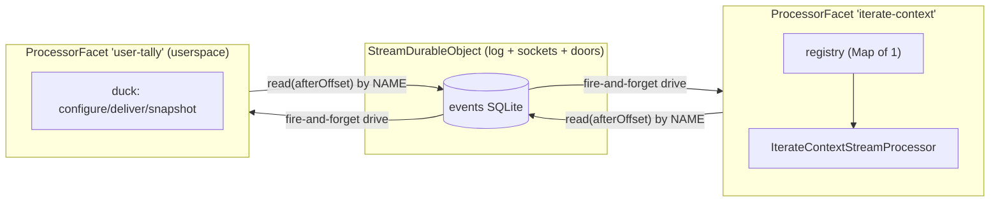
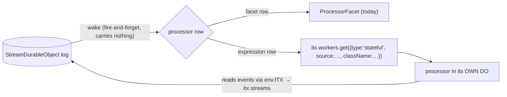

# Processors jam — streams, stream processors, and how dynamic workers load

The next design leg, opened by the owner's REVIEW-KENTON annotation: "I'm not sure we need this
registry in this form… stream processors only run as facets… extend some base class, and all
this stuff we need to implement in the base class… maybe in the future a CPU-intensive
processor runs somewhere else and we wake it up in a similar fashion — maybe there's even an
itx expression to wake it up… this is the next bit where we can decrease complexity very
significantly."

Everything below is a proposal to annotate, not a decision. Grounded in the clean room at
`annotations-1` (`packages/v3/project-worker`).

## Today

Three layers carry the processor machinery today:

| Piece                | Size      | What it holds                                                                                                                                                                                               |
| -------------------- | --------- | ----------------------------------------------------------------------------------------------------------------------------------------------------------------------------------------------------------- |
| `core/processor.ts`  | 446 lines | contract + `StreamProcessor` base + **`createStreamProcessorRegistry`** — a `Map<name, Registered>` with per-entry `{chain, running, progress, waiters}`, `deliver()`, `catchUp(name?)`, `reads(processor)` |
| `processor-facet.ts` | 231 lines | the facet DO class: `configure`/`deliver`/`snapshot`, the `FACET_PROCESSORS` map, ONE registry instance per facet                                                                                           |
| userspace            | —         | duck-typed `{configure, deliver, snapshot}` classes loaded through the Worker Loader                                                                                                                        |

The observation that opened this jam: **every facet hosts exactly one processor**, so the
registry's multi-processor machinery (the Map, per-name catchUp, cross-processor waiter
bookkeeping) is rent paid to the apps/os mirror, not to the runtime.

### What `configure` is (the annotation asked)

First contact. A facet wakes knowing nothing — not even whose stream it serves. The parent
calls `configure({parentName, projectId, path, slug})` once; the facet persists that identity
in its own kv so a **fresh incarnation after eviction can re-resolve its parent BY NAME**
(never a retained stub — a retained stub would pin). It is host bookkeeping, yet today the
duck contract forces every userspace processor to export it, even as a no-op.

## Proposal A — collapse the registry into the base class

Processors run **only as facets** for now. The five contract rules are all per-processor
(serial chain, strict per-event barrier, background-may-overtake, one-persist-per-batch before
cursor advance, at-head pass) — nothing about them needs a Map of neighbors. So:

- `StreamProcessor` base grows the machinery: `wake()` (cursor-driven — reads contiguously
  from its persisted fold, exactly today's `catchUpBody`), the fold persistence, refold-on-
  version-bump, and the read surface.
- The read surface mirrors apps/os **verbatim** (`StreamProcessorRpc` in the itx API):
  `snapshot()`, `getRuntimeState()`, `waitUntilProcessed({offset, timeoutMs})`.
  Evidence for keeping the barrier: apps/os `rpc-targets.ts` has ~25 production call sites,
  all the same read-your-writes shape — append, `waitUntilProcessed`, read. It is not
  incidental complexity; it is THE barrier verb.
- The facet runner shrinks to: construct the processor, stamp identity (absorbing `configure` —
  **userspace never writes it again**), forward `deliver` → `wake()` and the read verbs.
- `createStreamProcessorRegistry` is deleted. The multi-processor contract tests become
  two-facets-on-one-stream tests — truer to production anyway.

Rough shape after: one base class carrying rules + fold + reads, one thin facet runner.
Estimated net deletion ~150 lines and one whole concept (the registry).

## Proposal B — placement is a row kind, the wake stays uniform

The future the owner sketched — a CPU-heavy processor in its own DO, woken similarly, "maybe
an itx expression to wake it up" — is a shape apps/os **already has**: a processor-wake
subscription row is either a _facet row_ (served from the Stream DO's facet) or an
_expression row_ (the read verbs replay onto that row's own processor node). Mirror it:

Cursor-driven delivery makes this nearly free: the wake carries nothing, so a remote processor
just reads the stream through its confined `env.ITX` (the door already exists) and folds into
its own DO storage. `enableProcessor(slug, ref?)` grows into that row — same verb, placement
as data. Nothing about the base class changes between placements; that is the point.

## Proposal C — one contract for userspace too

Today userspace processors satisfy a duck contract while built-ins extend `StreamProcessor` —
two contracts for one job. Instead: ship the base class INTO the loaded worker (the injected
`itx.js` module already exists and is versioned by the loader cacheKey), so userspace extends
the same `StreamProcessor` with the same `reduce`/`processEvent`/contract shape. The duck
contract dies; `configure` was already absorbed by the runner in Proposal A.

Cost: `itx.js` grows by the base class; the loader cacheKey already versions it. Benefit: one
honest contract, and userspace processors port to apps/os unchanged — the mirror that was
paying rent in the registry moves to where it earns it.

## Open questions (annotate here)

1. Collapse now (Proposal A as the next increment) or after this jam settles B/C?
2. `waitUntilProcessed` — keep as the base-class barrier verb mirroring apps/os? (Recommended:
   yes, with the apps/os call-site evidence above.)
3. Userspace = extend the injected base class (Proposal C) vs keep the duck contract?
   (Recommended: extend.)
4. Expression rows for remote placement — build the row shape now (dormant until needed) or
   leave `enableProcessor(slug, ref?)` as-is until a CPU-heavy processor actually exists?
   (Recommended: leave as-is; the collapse must not speculate.)
5. Does `snapshot` stay on the facet surface (`facetSnapshot(slug)` on the DO) or move behind
   the read verbs uniformly?
