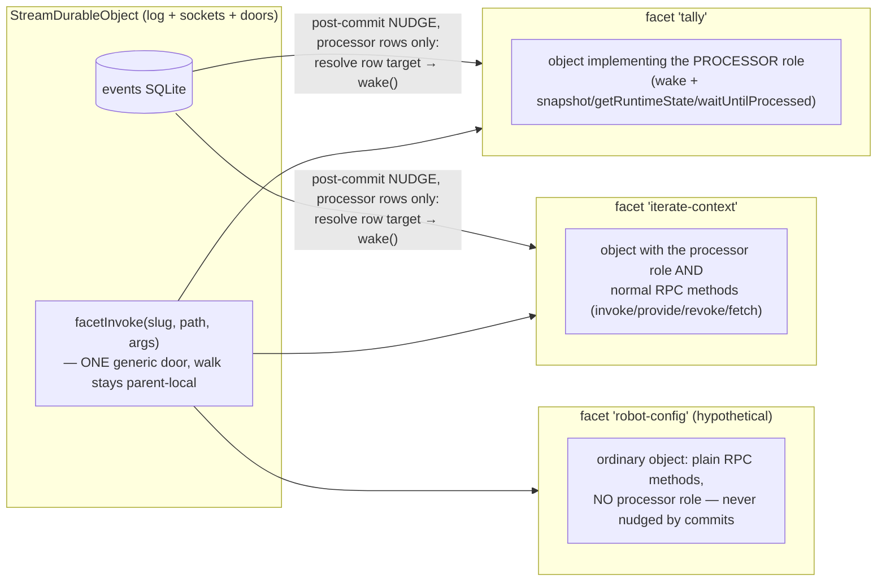

# Processors jam v3 — facets are objects; processors are facets that fold

v3 after the owner's two annotations on v2, which sharpen the model considerably:

1. _"I want facets to be able to have normal RPC methods as well as being stream processors. I
   need to be able to invoke them… can we collapse things to ITX expressions, where, from the
   perspective of the parent durable object, everything is just an ITX expression?"_
2. _"`deliver` is an extremely leaky abstraction name — deliver what? are all facets guaranteed
   to be stream processors?"_

The answer to 2 is **no, and the naming was hiding the real model**: a facet hosts an ordinary
object — RPC methods, its own storage, its own lifecycle. _Stream processor_ is a role a facet's
object can play (it implements the processor contract), not what a facet is. That split is the
spine of v3. Still standing from v2: **DECIDED: the base class is part of our SDK**; the
collapse numbers; the SDK options. Grounded at `lessons-1`.

## Today, with real numbers (unchanged from v2)

| piece                                      | lines | what it is                                                                                                                                                                    |
| ------------------------------------------ | ----- | ----------------------------------------------------------------------------------------------------------------------------------------------------------------------------- |
| `core/processor.ts`                        | 446   | contract (~105) + `StreamProcessor` author base (~65) + **the registry (~276)** — bookkeeping for a multi-tenancy that never occurs (every facet hosts exactly one processor) |
| `processor-facet.ts`                       | 231   | the facet DO: configure/deliver/snapshot + `FACET_PROCESSORS` built-ins map + one registry per facet                                                                          |
| `stream-durable-object.ts` (facet section) | ~70   | `#facet`/`enableProcessor`/`facetSnapshot`                                                                                                                                    |
| `hello-files.ts` user-tally                | 17    | hand-rolled cursor loop, none of the five rules                                                                                                                               |

`configure` (the v1 question): first contact — the parent stamps
`{parentName, projectId, path, slug}` durably into the facet's kv so a fresh incarnation
re-resolves its parent BY NAME. Runner bookkeeping; authors never see it after the collapse.

**How do you reach INTO a facet today? You don't — that's the gap annotation 1 names.** There
is no expression that lands on a facet. The parent reaches facets only through the private
`ctx.facets.get` handle and a fixed duck contract (`configure`/`deliver`/`snapshot`), plus
iterate-context-specific extras (`invoke`/`provide`/`revoke`/`fetch`) the parent calls by name.
Externally there are two dedicated RPC doors (`enableProcessor`, `facetSnapshot`) — verbs, not
addresses. A facet with a novel method is unreachable without editing the parent.

## The v3 model: facet = hosted object, processor = a role



- **A facet hosts an object.** Any RPC methods, own SQLite-backed storage, subordinate
  lifecycle. Nothing about being a facet implies folding a stream.
- **The processor role** is a contract the object may implement: `wake()` (cursor-driven, the
  nudge carries nothing) plus the three read verbs (`snapshot`/`getRuntimeState`/
  `waitUntilProcessed` — apps/os `StreamProcessorRpc` verbatim). The SDK base class implements
  the role; extending it is how userspace opts in.
- **`deliver` dies.** The parent's post-commit act is a _nudge to the processor-role facets
  only_ — the rows `enableProcessor` recorded. The verb is `wake`, it takes nothing, and it is
  never sent to a facet that didn't enrol as a processor. (v2's runner sketch had
  `deliver() { … }` forwarding to `wake()` — leaky exactly as annotated; gone.)

## Reaching any facet with an itx expression (annotation 1, the mechanism)

The collapse the owner asked for, built from parts that already exist:

1. **The parent grows ONE generic door:** `facetInvoke(slug, path, args)` — resolve the facet
   handle locally, walk the dotted `path` receiver-preservingly, apply the terminal. This is
   the stateful runner's proven idiom (`Reflect.apply`, `stepGet` guard) and the clients-view
   precedent (`stubFanOut`/`facetClientsView`). It must be parent-local because **facet stubs
   are non-transferable** (the DataCloneError learning): no design may hand a facet stub across
   an RPC hop, so the walk happens where the stub lives.
2. **`roots.facets`** — a view in the roots vocabulary: `roots.facets.get(slug)` returns the
   dotted pathProxy over `facetInvoke` (for the iterate-context facet resolving siblings, the
   proxy rides the parent's stub facade, exactly like its clients view).
3. **One config seed:** `itx.facets ⇒ roots.facets`. Now every facet is an ordinary address:

   ```
   itx.facets.get('tally').snapshot()
   itx.facets.get('robot-config').setThreshold(0.7)     // a NORMAL RPC method — no processor role
   itx.robot ⇒ itx.facets.get('robot-config')            // userspace alias, shadow stack applies
   ```

   The fetch lane already works this way (`x-itx-cap` forwards natively into `facet.fetch`,
   101s tunnel) — expressions with a terminal `fetch` on a facet address ride it unchanged.

4. **Processor rows desugar into the same vocabulary.** `enableProcessor('tally')` stores a row
   whose target _is_ `itx.facets.get('tally')`; a remote row stores a different expression:

   ```jsonc
   { "slug": "tally",  "target": "itx.facets.get('tally')" }        // the desugared default
   { "slug": "heavy",  "target": "itx.workers.get({ type: 'stateful', source: ['itx','files',['read','/heavy.js']], className: 'HeavyRunner' })" }
   { "slug": "basement", "target": "itx.clients.get('basement-pc')" }
   ```

   The parent's post-commit nudge is now literally: resolve each row's target, call `wake()` —
   **from the parent's perspective everything it addresses is an itx expression.** The parent
   keeps exactly one private, non-expression mechanism — `ctx.facets.get` itself — the same way
   `roots` keeps `env`: the physical layer under the last vocabulary, spellable only by the
   host. Row targets from userspace evaluate in event scope (no `roots`), so the provenance
   gate carries over unchanged.

What stays true from v2 (why facet placement remains the default): locality (in-process calls;
log reads never leave the machine), subordinate lifecycle (`facets.abort` keeps storage; dies
with the stream — Kenton's "dynamically creating DO namespaces seems wrong" is about exactly
the remote alternative), co-hibernation (facets don't pin, proven inc-29), and no identity
protocol (a remote target IS its identity; `configure` doesn't exist for remotes).

## The collapsed code (v2, with v3's renames)

```ts
// core/processor.ts — one class: the author surface + the processor ROLE
export abstract class StreamProcessor<State> {
  abstract readonly contract: ProcessorContract<State>;
  constructor(args: { stream: ProcessorStream; storage: KvLike; path: string; projectId: string });

  // authors write these (unchanged):
  protected reduce(args: ReduceArgs<State>): State | null | undefined;
  protected processEvent(args: ProcessEventArgs<State>): undefined;

  // the role, absorbed from the registry (five rules, cursor, refold live here):
  wake(): Promise<void>;
  snapshot(): Promise<ProcessorSnapshot<State>>;
  getRuntimeState(): Promise<ProcessorRuntimeState<State>>;
  waitUntilProcessed(input: { offset: number; timeoutMs?: number }): Promise<void>;
}
```

The facet runner hosts the object and forwards — `wake()` and the read verbs for
processor-role facets; arbitrary methods reach the object through `facetInvoke`'s walk, so the
runner no longer enumerates them. Line accounting unchanged from v2: net ~−150 lines, minus
three concepts (registry, runnerHooks seam, `reads()`), plus one small door (`facetInvoke`).

## The SDK (DECIDED; options unchanged from v2)

Userspace: 8 lines, extends the injected base, gains the five rules + cursor + refold + read
verbs. Single-source options: **(a) prebuild** the TS mechanics into the injected module via a
one-line esbuild step (recommended — the subtlest code keeps the type checker) vs **(b)**
plain-JS core with JSDoc. zod stays host-side (`initialState: () => State` in userspace
contracts; bring-your-own `.parse` optional). Versioning: loader cacheKey (deploy id + content
hash) + facet version-marker abort-keeping-storage; refold only on `contract.version` bump.

## Increment plan v3

1. **The collapse + the SDK + the renames** — registry into the base class; `deliver` → `wake`
   everywhere; user-tally rewritten onto the SDK; tests from registry-of-two to
   two-facets-one-stream.
2. **The facet address** — `facetInvoke` door, `roots.facets`, the `itx.facets` seed, processor
   rows desugared to expression targets; live proof: a facet with a normal RPC method (no
   processor role) invoked through the table, aliased, shadowed.
3. **The read node** — `waitUntilProcessed` proven live through the barrier
   (`itx.facets.get(slug).waitUntilProcessed(...)` — note it now comes free with the facet
   address; no separate `processorReads` door needed).
4. **Deferred, designed:** remote `target` rows — built when a real CPU-heavy processor exists.

## Open questions v3

1. SDK single-source: prebuild TypeScript (recommended) or plain-JS core?
2. Naming: `itx.facets` — or should the address space be something else (`itx.streams.get(path)
.facets…` once sub-streams arrive)? Today one stream = one context, so the short form reads
   right.
3. Should `enableProcessor` itself desugar to a mount in the capability table (a processor row
   IS a mount with a wake obligation), or stay a separate small table? v3 keeps it separate —
   mounts answer calls, rows answer commits — but the symmetry is close enough to ask.
4. Go on increments 1–2?
