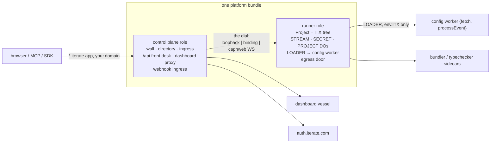

# Fable minimalism — one bundle, two roles, one tree, one dial

An architect's proposal for the whole "iterate kernel + control plane + project runner" system,
grounded in the clean-room POC (`apps/kernel/`, ~850 lines) and the current `apps/os` design, aimed
at the self-hosting plan (`../self-hosting-plan.md`, Part 0 + D1..D12). North-star lean: **maximal
conceptual minimalism** — the fewest concepts that still deliver the whole lattice.

The count, up front:

- **6 nouns**: project · stream · secret · capability (itx) · wall · directory.
- **1 platform bundle, 2 roles**: control plane · project runner. Same bytes everywhere (R1).
- **1 interface**: `Os.authenticate() → Session → session.projects.get(id) → Project`. It is the
  _only_ interface — between browser and platform, between control plane and runner, between
  runners, and between a config worker and its own project (`env.ITX`).
- **1 verb for the lattice**: **the dial** — how you reach a `Project`. Three transports, one
  meaning: loopback (`ctx.exports`), service binding (Workers RPC), capnweb WebSocket.

Everything in the self-hosting plan — the independence lattice, level 2, home-assistant mode,
account-per-project — is a **value of one field in one record** (the registry row's `runner`
field), not an architecture.

---

## 1. The proposal

### 1.1 The six nouns

| noun                 | what it is                                                                                                                                   | authority lives in             |
| -------------------- | -------------------------------------------------------------------------------------------------------------------------------------------- | ------------------------------ |
| **project**          | the unit of isolation; a `projectId` scoping an otherwise-identical entrypoint (`clean-room-build.md`: "a project is a projectId parameter") | runner                         |
| **stream**           | the durable log, `{projectId, path}`-addressed; append/subscribe; the project's memory                                                       | runner (`StreamDurableObject`) |
| **secret**           | write-only material; substituted at the egress door, never revealed                                                                          | runner (`SecretDurableObject`) |
| **capability (itx)** | the tree hanging off `Project`; addressing, not security (D6); assembled from mounts, built-ins pre-seeded                                   | runner                         |
| **wall**             | _who authenticated you_ — verify one ingress JWT (`apps/kernel/src/wall.ts`, 47 lines); omit ⇒ wide open                                     | control plane                  |
| **directory**        | _which projects exist + who's a member + where each one's runner is_ — registry ∪ routing table ∪ membership (R13)                           | control plane                  |

Egress is not a seventh noun: it is `itx`'s one `fetch` capability (D4 — "the separate `egress`
member collapses into `itx.fetch`"), plus a policy fold on the stream. The agent is not a noun at
all: it is userspace — a stream plus a preset of events (D20), run by the config worker.

### 1.2 One bundle, two roles

The plan says "two workers: control plane + project runner" (Part 0, D6). This proposal keeps the
two **roles** but insists they ship as **one platform bundle** — pure-play, no Node compat, like
`apps/kernel` — exporting:

- a default `fetch` (the **control plane** role: ingress, wall, directory, `/api` front desk,
  dashboard serving, webhook ingress), and
- a `Runner` `WorkerEntrypoint` plus every project-scoped DO class (the **runner** role: the ITX
  tree, `LOADER` confinement, `STREAM`/`SECRET`/`PROJECT` DOs, the egress door).

`APP_CONFIG.role: "control-plane" | "runner" | "both"` selects which doors are open. Consequences:

- **R1 is satisfied by construction.** There is exactly one build; hosted deploys it twice (two
  worker names, two configs), self-host and `pnpm dev` deploy it once with `role: "both"`.
  `sha256(hosted-cp) == sha256(hosted-runner) == sha256(selfhost) == sha256(pi)` because they are
  the same file.
- **The split is a placement choice, not an architectural one** (echoing R10's own words). We get
  the Part-0 decomposition without re-running the 11-worker split disaster (PR #1500, reverted:
  cross-script cold-start chains, RPC subscriptions pinning DOs awake, two-pass deploys) — because
  in the common same-account case the "split" is a config value, and **all DOs live in one script**
  (the runner role) so no DO namespace ever straddles a script boundary.
- The **Pi floor (R3/R3b)** is the degenerate case: `role: "both"`, no wall, `kv` directory,
  loopback dial, Miniflare. Zero external dependencies except an AI source.

Around the bundle sit exactly three satellites, none of which is "the platform":

- the **dashboard vessel** — a separately-deployed TanStack app (today's `apps/os` dashboard;
  clean-room's `mini-apps/os`), credential-free, proxied by the control plane at
  `dashboard--<slug>` with a minted `project-app-session`. Kernel-_served_, userspace-_authored_
  (R14; `apps/kernel/src/kernel.ts` `serveDashboard`).
- the **worker-bundler** and **typechecker** wasm sidecars — stateless pure functions
  (files-in/artifact-out), exactly as in `apps/os/docs/worker-topology.md`. Optional; the runner
  degrades without the typechecker.
- **auth.iterate.com** — hosted-only, _below_ the platform. The one-way edge `control-plane → AUTH`
  never reverses (the acyclicity rule from `kernel-review-2026-07-28.md`: the directory's
  existence-write stays below the kernel, or you get `auth → kernel → auth`).



### 1.3 The interface is self-similar: one front desk, everywhere

Both roles expose the **same** capnweb tree, verbatim from `apps/os` (`UnauthenticatedOsRpcTarget →
SessionRpcTarget → ProjectCollectionRpcTarget → ProjectRpcTarget`) and already mirrored by
`apps/kernel/src/kernel.ts` (`Os`/`Session`/`Project`):

- **Control plane `/api`** (every hostname, kernel-reserved): `authenticate()` resolves the wall's
  ambient JWT (or an explicit lane); `session.projects.get(slug)` is the **membership gate**
  against the directory; the `Project` it returns is _implemented as a dial_ — the control plane
  looks up the registry row and returns the runner's `Project` stub (capnweb proxies stubs through
  the middleman; that transit is fine per D1).
- **Runner front desk** (Workers RPC entrypoint + `/api` for cross-account dials): **no wall in
  front of it** (D7). It accepts exactly the credential lanes `apps/os/src/auth.ts` already
  defines: `project-secret` (`{projectId, secret}`, verified by the Secret DO's
  `verifyMaterialField`) and `project-app-session` (local HS256 verify, no directory hop) — plus
  possession of the same-account binding, which _is_ a credential (as `env.AUTH` is today).
- **`env.ITX`** inside the config worker: the same `Project`, pre-authenticated by construction —
  one props-scoped entrypoint bound as **both** `env.ITX` and `globalOutbound`
  (`apps/kernel/src/kernel.ts:366-379` — "one thing is both").
- **MCP** (`mcp.iterate.com` → `/api/mcp`, today's `rewriteMcpHostRequest`): a stateless protocol
  adapter over the same tree (jam §14: "front-ends are stateless adapters"). Not a second surface.

So "control plane talks to runner" is not a new protocol to design. It is a client of the product's
own API. The control plane is, in capability terms, **just another caller holding a powerful
credential** — which is precisely the remote-apps mutual-auth pattern the plan flags as the rhyme
(OQ-h: yes, that is the concrete basis for M5/M7).

### 1.4 The dial: the registry row is the whole lattice

The directory's registry half is one KV table (today's `PROJECT_DIRECTORY`), control-plane-owned
regardless of where data lives (D8). One record shape:

```jsonc
// registry["acme"], registry["example.com"], registry["dashboard--acme.iterate.app"] → same row
{
  "projectId": "prj_…",
  "runner":
    { "kind": "loopback" }                                   // role:"both" — ctx.exports, zero hops
    | { "kind": "binding", "service": "os-runner-prd" }      // hosted — Workers RPC, same account
    | { "kind": "capnweb", "url": "wss://…/api",             // BYO account / home-assistant —
        "credential": { "type": "project-secret", … } }      //   persistent bidirectional WS (R11/D4)
}
```

`dial(row) → Project` is the only routing machinery in the system. Hostname resolution stays
exactly `apps/os`'s `decideIngressRoute` shapes (`<slug>.<base>`, `<app>--<slug>.<base>`, custom
hostnames via `projectByHostname`) writing the same trusted headers (`x-itx-project-id`,
`x-iterate-app`, `x-iterate-host-kind`), with the kernel's one-label hardening
(`apps/kernel/src/kernel.ts` `resolveIngress`, review #14 — a stray host can't mint a project).

Every point in the Part-B lattice is now a row value:

| lattice point       | `runner` value                                                             | data at rest  |
| ------------------- | -------------------------------------------------------------------------- | ------------- |
| L1 hosted           | `binding` (or `loopback` while we run one script)                          | our account   |
| L2 BYO account      | `capnweb` → worker in _their_ account                                      | their account |
| account-per-project | `capnweb` → worker in a per-project account                                | that account  |
| home-assistant      | `capnweb` → a **tunnel session** the runner dialed _out_ to us             | the home box  |
| L3 full self-host   | their own control plane; row is `loopback`/`binding` in _their_ deployment | their account |

Moving up/down the ladder (R12, Part C) = rewrite the row (+ D10-parked data migration). No code
changes, by construction.

### 1.5 Inside the runner

The runner role is today's project-scoped `apps/os`, kept almost verbatim but **finally split from
ingress**:

- **`Project` is the ITX tree** — `ProjectRpcTarget`'s member names survive as-is (`streams`,
  `secrets`, `ai`, `repos`, `agents`, `worker`, `kv`, `files`, `scheduler`, `egress`, …) because
  the generated contract (`itx-api.generated.ts`) is the public API and must not churn. What
  changes is the _implementation_: the 7,667-line `rpc-targets.ts` god-object dissolves into
  **pre-seeded mounts** (core-boundary.md WS1), with the perf constraint honored — built-ins
  resolve from a **static in-isolate registry, zero capability-host DO hops**; only dynamic/remote
  mounts touch the folded mount snapshot.
- **Capability sourcing (R5) is not a new mechanism — it _is_ `provideCapability`.** A "source" is
  a mount recipe: `{ binding: "AI" }` for a local capability, or `{ dial: {url, credential}, path:
"ai" }` for a capability served by another deployment/account over a persistent capnweb session
  (M5). `repos` from account A and `ai` from account B in one project (M3's proof) is two mount
  recipes. This is the structural unlock the plan asks for, using a verb `apps/os` already has.
- **The durable log is `apps/os`'s, moved in whole.** `StreamDurableObject` (SQLite journal,
  `append`/`getEvents`/`subscribe`/`acceptCrossPost`, four subscriber lanes, cursor spine,
  alarm-driven retries) is the single most valuable artifact in the codebase and this proposal
  changes nothing about it except its address: it lives in the runner script, in whichever account
  the runner runs in — which is what makes "data in your account" true (M4). The kernel's
  `processEvent` stub dies; delivery is `ProjectWorker.processEventBatch` with
  `StreamReceiverUnavailableError` back-off, verbatim.
- **Confinement, verbatim from both parents**: `env.LOADER.get(contentAddressedKey, cb)` with
  `env: { ITX }` only, `globalOutbound` = the same entrypoint, content-addressed builds
  (`workerBuildKey`) via the bundler sidecar, `WORKER_BUILD_CACHE` KV, and the loader cache key
  including script name + deploy version (loader isolates capture the parent's loopback stubs and
  cannot survive a rollout). Config-worker DO needs are met with **DO facets** under a runner
  supervisor DO — the platform-blessed way for dynamically loaded code to get isolated SQLite.
- **The egress door**: bare `fetch()` from the sandbox → `globalOutbound` →
  `ProjectEgressEntrypoint` → the project's one decision point (today `ProjectDurableObject`):
  interceptors (placeholders only, never material) → rules fold (≤5 s staleness) → **exactly one
  project secret per request** → `SecretDurableObject.fetch` substitutes under its pinned host →
  out. Two fixes this proposal makes load-bearing: **allowed egress must leave a trace** (today
  `rules.length === 0 ⇒` silent pass-through — `core-model-grounding.md` calls this the real gap),
  and gmail/github token refresh must ride the same door instead of dialing the Secret DO directly
  (jam WS2).

### 1.6 The control plane, and what it deliberately does not hold

The control plane is stateless plus two small stores, and that is the whole point (R7 — "the edge,
never the store"):

- the **registry KV** (routing rows above),
- a **short-TTL webhook buffer** (R8): first-party Slack/GitHub/Telegram ingress verifies
  signatures at our edge (today's `handleIntegrationWebhookApiRequest`, kept on the api lane so
  signed events reach streams without a capnweb round-trip), then `acceptCrossPost`s the batch down
  the dial into the _project's_ stream. Durable webhook bytes exist only in the customer's account;
  ours expire in minutes.
- the **wall** (one `WallConfig`; Cloudflare Access and an auth.iterate.com proxy are the same 47
  lines with different JSON), the **directory** (two real modes — `kv` single-tenant,
  `auth.iterate.com` multi-tenant; `open` as the zero-config default; `local` deleted, per R13),
  the **dashboard proxy** (strip cookies/authorization, stamp non-secret caller, mint
  `project-app-session`), and **billing/metering ledgers** (D5 — our data about usage, not
  customer content; metered events also cross-post into the project's own stream so the log stays
  the itemized bill, jam §3).

Level-2 egress adds the second hop here: project door → **control-plane egress door** → world.
That hop is where volume-discounted first-party keys substitute (R9) and where metering happens
when we are the billing counterparty. Self-host collapses the two hops into one — same code,
`role: "both"`.

### 1.7 What gets deleted or demoted from `apps/os`

- `rpc-targets.ts` as a single file (7,667 lines, ~62 classes) → thin tree + seeded mounts;
  `ITX_SURFACE_MEMBER_NAMES` collision guard shrinks as built-ins become mounts.
- The `local` directory provider; the `/prj_<id>/…` path lane (R6: real hostnames only —
  deprecate, keep only as a dev convenience behind `role: "both"`).
- The dashboard's bespoke session machinery on the app lane — identity converges on wall +
  `project-app-session` (SUMMARY.md decision 7).
- OIDC/cookie code in the platform: the kernel proved 47 lines of verification replace a 164-line
  OIDC client + a separate Access verifier. Login lives in the wall (Access or an
  auth.iterate.com forward-auth proxy), never in the platform bundle.
- The agent as platform machinery: it stays userspace (`iterate/*` packages consumed by the config
  repo); the one load-bearing residue is `itx.ai` (the thing that holds the AI/gateway binding).

## 2. Scripts

Small, boring, and shared with today's conventions (`envs.ts` + per-app deploy scripts). Each is a
normal TypeScript script exposed as a CLI (docs/cli-scripts.md style).

| script                                                                | what it does                                                                                                                                                                                                                                                                                                               |
| --------------------------------------------------------------------- | -------------------------------------------------------------------------------------------------------------------------------------------------------------------------------------------------------------------------------------------------------------------------------------------------------------------------- |
| `pnpm dev`                                                            | Miniflare, `role: "both"`, no wall, `kv` directory, loopback dial. The Pi floor and the dev loop are the same command. Everything works offline except AI sourcing.                                                                                                                                                        |
| `pnpm run deploy --env <name>`                                        | Build the platform bundle **once**, print its sha256, then `wrangler deploy` per role/worker name for that env with atomic secrets, then smoke. Hosted = two deploys of the same artifact; self-host = one.                                                                                                                |
| `pnpm verify-bundle` (CI, M0)                                         | Build with every profile; assert one identical sha256. The R1 tripwire.                                                                                                                                                                                                                                                    |
| `pnpm ensure-resources --env <name> [--account <id> --api-token <…>]` | Idempotently create KV/DO/R2/routes/DNS/Total-TLS for a deployment. Pointed at a **customer** account with their API token (D3), this same script _is_ the cross-account provisioner (M6/D11) — it stands up a runner and returns the identifiers that become the registry row.                                            |
| `pnpm erase-data --env <name>`                                        | Today's reset semantics; workers are never deleted.                                                                                                                                                                                                                                                                        |
| `pnpm smoke --env <name>`                                             | Prove the invariants: create `foo`; `foo.<base>` serves; `dashboard--foo.<base>` serves; an `ai` call round-trips; an egress with a substituted secret lands. Milestone proofs (M1..M7) are smoke cases, not documents.                                                                                                    |
| `pnpm connect --control-plane <url> --project <slug>`                 | Home-assistant mode (D12): the local runner dials out, authenticates with the project secret, holds a persistent bidirectional capnweb session, and the control plane writes a `capnweb` registry row pointing at the tunnel. Ctrl-C = row parks; restart = re-dial (Miniflare-tier reliability is restart-on-crash, R3b). |
| `pnpm cli itx …` / `pnpm auth:mint`                                   | Unchanged: talk to any deployment's `/api` as any identity.                                                                                                                                                                                                                                                                |

## 3. Main stories

**(a) Create a project.** Browser (or MCP) → control plane `/api` → `authenticate()` (wall JWT) →
`session.projects.get("acme")` → unknown slug ⇒ **prospective handle** → `.create({
organizationSlug })` → the directory authority writes (auth-prd hosted; local KV self-host — same
call, `apps/kernel/src/directory.ts`) → control plane writes the registry row (`acme` +
`dashboard--acme` + default runner) → dials the runner → runner appends the birth certificate
(`project/created` + deterministic creation events), seeds the config repo from the template, and
mints the project API key into the Secret DO (`PROJECT_API_KEY_SECRET_PATH`). `acme.iterate.app`
is live; `create → serve` touches no code path self-host doesn't also run.

**(b) Hosted serving.** `GET https://acme.iterate.app/guestbook` → CF route → control plane:
`decideIngressRoute` → registry row → dial (`binding`) → runner `Project` **fetch lane** (trusted
headers `x-iterate-app` etc.; WebSocket upgrades ride this lane because an upgrade can only return
from a method literally named `fetch`) → `serveProjectResponse` envelope → `DynamicWorkerRunner` →
`LOADER.get(key)` → config worker `fetch` with `env.ITX` only → response. Dashboard:
`dashboard--acme.iterate.app` never reaches the config worker — control plane checks membership,
mints a `project-app-session`, proxies the vessel. A broken config worker can never lock you out
of the tool that fixes it (R14).

**(c) Self-host, own domain.** Fresh CF account: `wrangler login` → `pnpm ensure-resources --env
selfhost` (zone, `*.you.com` wildcard route, proxied wildcard DNS + Total TLS — the route alone
does not provision certs) → `pnpm run deploy` with `APP_CONFIG = { role: "both", hostBase:
"you.com", wall?: <your Access org>, directory: { provider: "kv" } }`. `foo.you.com` public,
`dashboard--foo.you.com` behind your Access. Upgrades are `git pull && pnpm run deploy` (D9). No
wall ⇒ wide open, single-tenant, first-class (R3).

**(d) BYO Cloudflare account (level 2).** Customer hands us an API token (D3). Our
`ensure-resources --account theirs` provisions the runner bundle + DOs/KV/R2 in _their_ account
(D11) and returns identifiers; registry row becomes `{ kind: "capnweb", url, credential }`. From
then on: HTTP at `--acme.iterate.app` hits **our** edge → down the persistent capnweb session →
**their** runner → **their** streams; egress returns through **our** egress hop where first-party
discounted keys substitute and metering events are stamped (R9/D5); webhooks are
signature-verified at our edge and cross-posted with only a short-TTL buffer on our side (R7/R8).
Data and webhook payloads at rest exist **only** in their account — M7's proof.

**(e) Local `pnpm dev` / home-assistant.** `pnpm dev` is story (c) minus the domain: Miniflare,
wide open, `acme.localhost:<port>`, everything offline except AI. Home-assistant adds `pnpm
connect`: the box is behind NAT, so the **runner dials out** and holds the bidirectional capnweb
WebSocket; the control plane terminates the session in a **hibernatable tunnel DO** (inbound
server-side sockets hibernate; the outbound side lives in the local Node/Miniflare process, which
has no such limits). Inbound HTTP routes _down_ the session — the capnweb fork passes
`Request`/`Response` by value and tunnels WebSocket upgrades over RPC, so the whole fetch lane
rides it. Our ingress, wall, and directory; the data never leaves the box (D12).

**(f) MCP connect → emerge with a project.** Claude connects to `mcp.iterate.com` → control plane
host-rewrite → `/api/mcp` adapter (a stateless front-end over the same tree, jam §14). Managed
OAuth injects a JWT that the same 47-line wall verifies — MCP auth is not a second identity
system. Tools mirror the tree: `projects.list`, `projects.get`, `create`, then itx calls. The
model says "make me a guestbook" → `get("guestbook-jonas").create({...})` → story (a) runs →
the tool returns the hostnames plus a scoped credential. You emerge from a chat with a living
project URL.

**(g) Agent LLM call via ITX.** The agent is userspace: a processor in the config worker.
`processEventBatch` folds the conversation, decides to think, and calls `itx.ai` (`using itx =
await this.env.ITX.get()`). The `ai` mount's recipe decides the source (R5): hosted ⇒ the
runner's AI Gateway binding with unified billing, spend appended as events (the log is the
itemized bill; replay reads the logged answer instead of re-paying — jam §3); BYO ⇒ the gateway's
provider-native endpoint with the customer's key from BYOK/Secrets Store, because the `env.AI`
binding path does not support BYOK (see §5). Either way the response lands on the agent's stream
as an event before anything else happens to it.

**(h) Egress with a substituted secret.** Config worker code holds no material — it writes a
placeholder: `fetch("https://api.stripe.com/v1/charges", { headers: { authorization: "Bearer " +
getSecret("/secrets/stripe", { field: "key" }) } })`. workerd routes the bare `fetch` through
`globalOutbound` → `ProjectEgressEntrypoint` → the project's decision point: interceptors run
first and see **placeholders, never material**; the rules fold matches (`matchEgressRule`, deny ⇒
`egress_denied`, hold ⇒ a durable `human-approval-*` event); exactly **one** project secret per
request; the request forwards _into_ `SecretDurableObject.fetch`, which substitutes material only
under its **pinned host** and appends a `used` audit fact. Level 2 adds the second hop: out
through the control-plane door, which meters, substitutes any first-party platform key
(origin-pinned allowlist), and stamps the spend event. The mechanism is `apps/kernel`'s one door;
the policy is `apps/os`'s, moved onto it.

## 4. Difficulties & trade-offs

- **The 2-script split re-risks PR #1500.** The 11-worker split died on cross-script cold-start
  chains and RPC subscriptions pinning DOs. Mitigations are structural: exactly two roles; all DOs
  in the runner script; the control plane stateless; and the option to run `role: "both"` (one
  script) in any environment where the split isn't paying rent. But the extra hop on every hosted
  project request is real (cheap same-account, an RTT cross-account).
- **DO namespace moves are data resets.** Migrating `STREAM`/`SECRET`/`PROJECT` from `os-prd` into
  a runner script creates fresh namespaces (the documented cutover hazard). Sequencing: either a
  prd reset window or a copy-based migration — D10 parks the mechanics, but the split forces the
  question earlier than the lattice does.
- **KV is the routing table, and KV lies for 60 s.** Negative lookups are cached too: a
  just-created hostname can 404 at a colo for up to a minute. Mitigation: on registry miss, the
  control plane read-throughs to the directory authority before answering 404 (one extra RPC on
  the cold path only). 1 write/sec/key is fine for rows.
- **capnweb sessions don't resume.** A dropped cross-account session rejects all stubs; the only
  signal is `onRpcBroken`. Every dial must be re-acquirable from the row, and durable
  subscriptions must tolerate re-subscribe — which the cursor spine already does (at-least-once,
  watermark-driven). HTTP-batch stubs die at end of batch, so cross-account is WebSocket-first
  (D4), batch only for one-shots.
- **Long-lived sessions meet platform limits.** A whole WS session on a stateless worker counts as
  one request for CPU accounting; outgoing WebSockets never hibernate and cap at ~15 min of DO
  keep-alive. Hence the asymmetry baked into §1.4: the _remote_ runner always dials **in**, the
  control plane terminates in a hibernatable DO, and no DO ever holds an outbound tunnel socket.
- **Two egress hops can double-count or loop.** The door must stamp hop identity on the metering
  event, and the control-plane hop must never re-enter a project door. Cheap to enforce (one
  trusted header), embarrassing to get wrong.
- **`ai` sourcing is asymmetric on Cloudflare.** Unified billing rides `env.AI.run()`; BYOK does
  not — customer-keyed calls must use gateway provider endpoints with keys in Secrets Store.
  `envs.ts` already carries `cloudflareAiGatewayTransport: "unified" | "byok"`; the mount recipe
  inherits that split rather than hiding it.
- **Custom hostnames are not free of Cloudflare shape.** Non-Enterprise CF-for-SaaS: no wildcard
  custom hostnames, apex via CNAME flattening, fallback origin per-zone, $0.10/hostname past 100.
  The design survives because ingress only needs "the request reached our worker + a row says
  whose it is" (R6), but the _onboarding UX_ for `<app>.customer.com` sibling hosts needs one
  custom hostname per app hostname on non-Enterprise.
- **The identical bundle constrains the dashboard.** The platform bundle stays pure-play (no Node
  compat), so the TanStack dashboard cannot live inside it — it is a proxied vessel. That's the
  right boundary (jam §13 wants the dashboard deployable/fixable independently of the kernel), but
  it means dashboard SSR is a second deployable with its own lifecycle, and localhost dev needs
  both processes (today's `pnpm dev` already manages this).
- **32 MiB RPC / message caps.** Big payloads (files, repo pushes) must ride streams over the dial
  or go straight to R2 — never inline event bodies. Already doctrine (D9: events are small and
  reference bigger durable objects), now enforced by the transport.
- **Worker Loader economics.** $0.002/unique-worker/day past 1,000/month, and isolate caching is
  best-effort — the content-addressed build cache is load-bearing for both cost and cold-start,
  and "code must be re-fetchable by ID" is a hard rule (it already is: KV artifact store).

## 5. Fragments of knowledge

Load-bearing facts discovered while grounding this proposal, with citations.

1. **Service bindings / Workers RPC cannot cross Cloudflare accounts** — cross-account RPC must go
   over the network; capnweb over WSS is the sanctioned re-implementation of the same semantics.
   (developers.cloudflare.com/workers/runtime-apis/bindings/service-bindings/rpc/; R11.)
2. **capnweb's `RpcTarget` on Workers _is_ `cloudflare:workers`' `RpcTarget`** — one class serves
   `env.ITX`, `/api`, and the cross-account wire; stubs from either system auto-proxy over the
   other. (`apps/kernel/node_modules/capnweb/README.md`, §Workers interop — note the package is
   vendored only under `apps/kernel/node_modules`, not the repo root.)
3. **The iterate capnweb fork tunnels WebSockets over RPC and passes `Request`/`Response`/streams
   by value** (with flow control), plus an `onCall` per-call hook for tracing — which is exactly
   what makes the home-assistant fetch-lane-over-a-dial (§3e) possible. (fork README, "Tunneling
   WebSockets"; `@iterate-com/capnweb` 0.10.0.)
4. **capnweb HTTP-batch stubs die when the batch ends; sessions have no resume** — the only
   disconnect signal is `stub.onRpcBroken`; reconnection = new session + re-acquire. (fork README,
   §HTTP batch, §Listening for disconnect.)
5. **A whole WebSocket session on a stateless Worker counts as one request for CPU limits**, and
   pipelining lets a client enqueue unbounded work — rate-limit expensive tree nodes. (fork
   README, §Security Considerations.)
6. **`ctx.exports` (loopback bindings) mint entrypoint stubs with dynamic `props`**
   (`ctx.exports.ProjectEntrypoint({ props: { projectId } })`), and props may themselves contain
   service bindings; props are per-_instance_, not per-request — so the caller must never live in
   props (it rides trusted headers / the envelope). (developers.cloudflare.com/workers/runtime-apis/context/;
   `apps/kernel/src/kernel.ts:366-379`; jam §17.)
7. **Worker Loader `get(id, cb)` caching is best-effort** — "a later call with the same ID may
   start a new isolate from scratch"; code must always be re-fetchable by ID. Dynamic Workers hit
   open beta 2026-03-24; billing $0.002/unique worker/day past 1,000/month.
   (developers.cloudflare.com/dynamic-workers/api-reference/, /pricing/.)
8. **Dynamically loaded workers can't define standalone DOs — the blessed path is DO _facets_**: a
   supervisor DO instantiates a loaded `DurableObject` class as a named child facet with its own
   isolated SQLite DB. This is how config-worker stateful classes get storage without platform
   namespaces. (developers.cloudflare.com/dynamic-workers/usage/durable-object-facets/.)
9. **`globalOutbound: null` cuts a loaded worker off the network entirely**; a binding there
   intercepts _all_ egress — the confinement mechanism is platform-enforced, not convention.
   (developers.cloudflare.com/dynamic-workers/api-reference/; verified in kernel review #7.)
10. **KV caches negative lookups**: a new key may be invisible (as a 404) for up to 60 s at other
    colos; max 1 write/sec/key. Routing tables on KV need a read-through-on-miss path.
    (developers.cloudflare.com/kv/concepts/how-kv-works/.)
11. **Outgoing WebSockets never hibernate and keep a DO alive (billing) up to 15 min; inbound
    hibernatable sockets survive eviction free** — tunnel topology must be dial-in.
    (developers.cloudflare.com/durable-objects/best-practices/websockets/.)
12. **SQLite-in-DO: 10 GB per object, one alarm per object, at-least-once alarms with backoff** —
    the stream journal's physical envelope; >10 GB means R2 offload (already D11's TTL plan).
    (developers.cloudflare.com/durable-objects/.)
13. **Workers RPC serialized payload cap is 32 MiB** (and WS messages likewise) — streams for
    anything bigger. (developers.cloudflare.com/workers/runtime-apis/rpc/.)
14. **CF-for-SaaS on non-Enterprise: no wildcard custom hostnames, no apex proxying; fallback
    origin is per-zone; 100 hostnames free then $0.10/mo, cap 50k.** "Your own domain even fully
    hosted" (R6) is exact-match hostnames unless Enterprise.
    (developers.cloudflare.com/cloudflare-for-platforms/cloudflare-for-saas/plans/.)
15. **Access injects `Cf-Access-Jwt-Assertion`; JWKS at
    `https://<team>.cloudflareaccess.com/cdn-cgi/access/certs`** — which is why one 47-line
    `WallConfig` covers Access and an auth proxy identically (`apps/kernel/src/wall.ts`; live
    config in `apps/kernel/wrangler.jsonc`).
16. **BYOK is not supported through the `env.AI` binding** — unified billing only; customer keys
    require gateway provider-native endpoints with keys in Secrets Store. The `ai` capability's
    source split is forced by the platform, not by us.
    (developers.cloudflare.com/ai-gateway/usage/worker-binding-methods/.)
17. **Miniflare runs worker_loaders, DOs+SQLite, KV/R2/D1, and service bindings fully offline; AI
    is the one always-remote binding** — the Pi floor is real, and its one cloud tether is exactly
    the `ai` source (OQ-g's shape). (developers.cloudflare.com/workers/local-development/.)
18. **A WebSocket upgrade can only be returned from an RPC method literally named `fetch`** — so
    the fetch lane can never be wrapped in `invokeCapability`, and apps/os's `DynamicWorkerRunner`
    already refuses upgrades on the capability path. (jam §17 caveat;
    `apps/os/src/domains/workers/worker-runner.ts`.)
19. **The loader cache key must include the parent script name + deploy version** — loader
    isolates capture the parent's loopback stubs and die on rollout with "Unable to deserialize
    cloned data". (`apps/os/src/domains/workers/worker-loader.ts`, cache-key comment.)
20. **The egress door's real gap is silence**: with no rules configured, allowed egress leaves no
    event — a project cannot enumerate the bytes that left it, yet money must be metered at that
    door. (`core-model-grounding.md` §observability; `apps/os/src/domains/projects/egress.ts`.)
21. **The Secret DO's invariant is a sentence**: "material goes in; nothing comes out except a
    request to a pinned host" — no read/reveal/compute lane; exactly one secret per egress
    request; interceptors see placeholders. (`apps/os/src/domains/secrets/secret-durable-object.ts`;
    `docs/adr/0002-…`.)
22. **The 11-worker split was tried and reverted** — merged cold start ~130-160 ms beat sequential
    cross-script cold chains; cross-script subscriptions pinned DOs awake for hours; and a merged
    redeploy over a split env silently mints fresh DO namespaces (a data reset).
    (`apps/os/docs/worker-topology.md`.)
23. **`apps/kernel` proves the floor at ~850 lines, two deps (`capnweb`, `jose`), no Node compat**:
    confinement (env = `{ ITX }` only), wall, directory (with the one-way `kernel → AUTH` edge),
    `/api` tree, project-app-session mint/verify, kernel-reserved dashboard — hosted and self-host
    live on the prd account as two `APP_CONFIG` strings. (`apps/kernel/README.md`, `src/*.ts`.)

## 6. Three radical reshapings

Deliberately different from the main proposal and from each other.

### 6.1 The federation of cells (no control plane at all)

Every deployment is the whole organism: **one worker, one cell** — exactly today's `apps/kernel`
grown up, wall + directory + runner fused, always `role: "both"`. There is no distinguished
control plane. iterate.com is merely _the biggest cell_, plus one tiny extra service: a **phone
book** (slug/hostname → cell) and a webhook relay. Hosted customers are cells we happen to run;
BYO customers run their own cell and register it in the phone book; cells speak to each other only
via persistent capnweb sessions, using the same `Os.authenticate → projects.get` front desk
peer-to-peer. "Level 2" disappears as a concept — there are only cells and who operates them.
**Pitch:** maximal sovereignty and the smallest possible mental model (one deployable, zero
internal topology); R10-grade isolation by default; the Pi is not a floor but the _unit_.
**Key trade-off:** everything hosted-convenient becomes an inter-cell protocol — custom domains,
first-party webhook ingress, discounted capabilities, billing — and trust becomes N×N instead of
hub-and-spoke; fleet upgrades are a thousand `git pull`s you don't control (D9 taken to its
logical, slightly frightening, conclusion).

### 6.2 The log is the computer (no runner worker either)

Collapse compute into storage: **the Stream DO _is_ the project.** Ingress appends an
`http/request-received` event; the config worker runs as **DO facets of the stream** (each with
its own SQLite); `fetch` handling is a fold that appends `http/response-ready`; egress is a
processor draining an outbox path through the one door; `itx` calls are events with reply offsets.
The "control plane" is a dumb hostname→DO-id router. Serving, agents, scheduling, and replay are
all the same primitive — D7 ("one stream abstraction = database + queue + workflow + live") taken
literally, D18's two entry points (HTTP, alarm) as the only writers.
**Pitch:** perfect provenance (every byte in and out is an event by construction — the §5.20 gap
cannot exist), perfect replay, one storage+compute noun, per-project isolation = per-DO isolation.
**Key trade-off:** physics. A DO is single-threaded; interactive serving pays fold latency on the
hot path; 10 GB and one-alarm-per-object shape everything; CPU-heavy userspace contends with the
journal. Fine for organisms that think; wrong for organisms that serve traffic — the exact reason
R13 ("ingress is served by the stateless worker, never the project DO") was locked.

### 6.3 The compiler platform (account-per-project, no multi-tenant runtime)

Take Part 0's "account-per-project" aside and make it the whole design: **"create project"
compiles and provisions a dedicated stack** — its own Cloudflare account (or, cheaper, its own
Workers-for-Platforms dispatch-namespace slot with an `outbound` worker as the egress door and
per-invocation limits) holding a stock runner bundle, its own DOs, its own budget. The platform is
not a runtime; it is a **provisioner + DNS + phone book** that sits on the request path never.
Isolation, budget caps, and billing become Cloudflare's enforcement problem, not our code's
(R10 at account granularity; the strongest possible "Breakup Black Box" — export = account
handover). **Pitch:** the multi-tenant software layer — the hardest thing we maintain — ceases to
exist; every project is trivially self-hostable because it already _is_ self-hosted, just on our
payment method. **Key trade-off:** creation latency (accounts and zones are minutes, not
milliseconds — the WfP-namespace variant mitigates), quota/account sprawl as a first-class ops
discipline, fleet upgrades = redeploying every stack, and every cross-project capability call is
cross-account capnweb with nothing ever on a fast local binding.

---

_Written 2026-07-30 against `archive/simplification-2026-07-15`. Companion sources:
`../self-hosting-plan.md`, `../clean-room-status.md`, `../kernel-review-2026-07-28.md`,
`../core-boundary.md`, `../core-model-grounding.md`, `../jam-2026-07-28.md`, `apps/kernel/src/_`,
`apps/os/src/{worker,rpc-targets,auth,env,ingress}.ts`, `apps/os/docs/worker-topology.md`,
root `envs.ts`.\*
