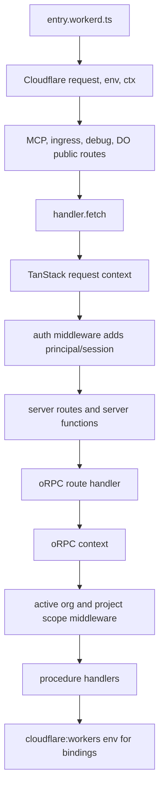

# Simplify Context Around Cloudflare Native Runtime

## Objective

Simplify OS context plumbing now that `apps/os` is definitively Cloudflare-only.
Stop preserving abstractions whose main purpose was theoretical Node.js
portability. Follow the first-party TanStack Start, oRPC, and Cloudflare
Workers model:

- Cloudflare bindings come from `cloudflare:workers` `env` in server-only code.
- Cloudflare `ExecutionContext` capabilities stay at the Worker boundary, with
  only narrow per-request capabilities passed inward when unavoidable.
- TanStack Start request context carries request-local state.
- oRPC context starts from the TanStack request context and is enriched by oRPC
  middleware for API-domain concepts such as active organization and project
  scope.
- Strongly typed `AppConfig` stays, but it is product config parsed from
  Cloudflare env, not a runtime portability layer.

## First-Party Baseline

TanStack Start does not define a canonical `AppContext`. It documents an
optional typed `server.requestContext` passed through:

```ts
handler.fetch(request, { context });
```

Cloudflare's TanStack Start docs show bindings accessed directly from
server-side code:

```ts
import { env } from "cloudflare:workers";
```

oRPC's TanStack Start adapter examples use:

- `context: {}` for a basic server route.
- `context: async () => ({ headers: getRequestHeaders() })` for optimized SSR.
- `createRouterClient(router, { context })` to avoid server-side HTTP loopback.

None of those docs imply that app metadata, D1, Durable Object namespaces, or
all Worker bindings should be threaded through a single request context object.

TanStack's current docs show module augmentation on `@tanstack/react-router`.
The current OS code augments both `@tanstack/react-start` and
`@tanstack/react-router`; verify whether the `@tanstack/react-start`
augmentation can be removed after the context shape is narrowed.

## Current Problem

`apps/os/src/context.ts` currently mixes unrelated categories:

- request-local data: `rawRequest`, `log`, `config`, `db`
- auth/session data: `principal`, `iterateAuthSession`
- oRPC middleware data: `projectScope`, `projectAccess`
- app metadata: `manifest`
- Cloudflare bindings: `agent`, `codemodeSession`, `projectDurableObjectNamespace`,
  `stream`, `slackIntegration`, `doCatalog`, and others
- dead or historical fields: `waitUntil`, `workerScriptName`, `artifacts`,
  `loader`, `repo`, `slackAgent`, `callableEnv`

This makes `AppContext` look like the dominant runtime abstraction, but in the
canonical stack the dominant outer runtime is Cloudflare Workers, then TanStack
request context, then oRPC context for procedure execution.

## Target Model



## Placement Rules

### Cloudflare `env`

Use `env` for raw Worker bindings in server-only code:

- `env.DB`
- `env.DO_CATALOG ?? env.DB`
- `env.PROJECT`
- `env.STREAM`
- `env.CODEMODE_SESSION`
- `env.AGENT`
- service bindings and optional integration bindings

Do not pass these through TanStack/oRPC request context unless there is a
specific per-request reason.

### Cloudflare `ctx`

Keep `ctx` usage at the Worker boundary:

- WebSocket upgrade handling
- `ctx.waitUntil(...)`
- `ctx.exports`

Cloudflare also supports importing `waitUntil` from `cloudflare:workers` in
server-only code. Either way, do not thread `waitUntil` through app context.

`ctx.exports` is not available from `cloudflare:workers` `env`, so keep the
current `workerExports` context field until the callers are redesigned around a
narrower explicit capability.

### App Config

Keep `AppConfig` strongly typed in `apps/os/src/app.ts`.

It is used by:

- `entry.workerd.ts` to parse runtime config.
- `alchemy.run.ts` to validate deployment config.
- `__internal.publicConfig` to expose public config.
- OAuth helpers and integration setup.
- Durable Objects that parse config from their own `this.env`.
- tests.

Avoid a premature `runtime/` folder or generic config helper layer. Keep config
parsing in `entry.workerd.ts` unless duplication forces extraction. If extraction
becomes useful, prefer a plain name such as `app-config.ts` over a broad runtime
namespace.

The existing request fallback should remain:

```ts
const requestConfig = config.baseUrl
  ? config
  : { ...config, baseUrl: new URL(request.url).origin as AppConfig["baseUrl"] };
```

### App Manifest

The manifest in `app.ts` is useful app metadata but should not be request
context.

It is currently used for:

- Alchemy/deploy naming through `initAlchemy(manifest, AppConfig, env)`.
- request logging through `withEvlog({ manifest, ... })`.
- OpenAPI docs metadata through `createOpenApiReferencePluginForApp`.
- `__internal.health`, which currently reads `context.manifest`.

Keep the manifest export, but remove `manifest` from `AppContext`. Adjust shared
internal-router wiring so health metadata is closed over or passed as an option,
not read from per-request context.

`withEvlog({ manifest, config })`, `createOpenApiReferencePluginForApp(manifest)`,
and `initAlchemy(manifest, AppConfig, env)` already use manifest in the target
shape. The main manifest/context coupling is `packages/shared/src/apps/internal-router.ts`.

### TanStack Request Context

Request context should contain request-local state only:

```ts
export interface AppContext {
  config: AppConfig;
  log: SharedRequestLogger;
  rawRequest?: Request;
  principal?: Principal | null;
  iterateAuthSession?: AuthenticatedSession | null;
  workerExports?: Cloudflare.Exports;
}
```

`db` can be removed from context once procedure call sites create `sqlfu`
clients from `env.DB` directly. Keeping it temporarily is acceptable if it makes
the migration easier, but it should not be a long-term runtime abstraction.

`projectHostnameBases` should not remain as a duplicate context field. Migrate
callers to `context.config.projectHostnameBases` before removing it.

### Auth

Auth belongs in TanStack Start request middleware:

- handle auth-worker routes
- resolve admin API secret, session, and bearer principals
- attach `principal` and `iterateAuthSession` to request context
- propagate auth `set-cookie` headers

oRPC procedures should read auth from their oRPC `context`, not from
`getGlobalStartContext()`.

### oRPC Context

oRPC context should be seeded from TanStack context at the route/client bridge:

- HTTP/OpenAPI routes pass the route `context` into `handler.handle(...)`.
- SSR in-process client uses `createRouterClient(appRouter, { context })`.

Inside oRPC handlers, use the oRPC handler `context` parameter. Avoid global
TanStack context helpers inside procedures.

oRPC middleware should continue to add domain-specific data:

- `activeOrganization`
- `projectScope`
- `projectAccess` for codemode's project-bound in-process calls

Those additions are oRPC-call-local. They should not be confused with global
TanStack request context.

Keep this distinction explicit in types. The base oRPC context starts from the
TanStack request context; middleware-enriched procedure context is a superset
inside the oRPC call chain.

## Shared Package Impact

### Required shared change

- `packages/shared/src/apps/internal-router.ts`: close over `manifest` in
  `createInternalRouter` / `createAppRouterWithInternal` so
  `__internal.health` does not read `context.manifest`.
- Update `apps/os/src/orpc/root.ts` to pass manifest into
  `createAppRouterWithInternal`.
- Consider updating sibling call sites in `apps/semaphore` in the same small
  shared change, because they use the same
  helper.

### Already correct

- `packages/shared/src/apps/logging/with-evlog.ts` takes manifest as an option.
- `packages/shared/src/apps/orpc.ts` takes manifest for OpenAPI metadata.
- `packages/shared/src/alchemy/*` uses manifest at deploy/module scope.
- `EvlogHandlerPlugin` only needs `log` and optional `rawRequest`.
- `getPublicConfig(context.config, schema)` correctly depends on request
  config, not manifest.

### Optional shared cleanup

- `packages/shared/src/apps/logging/runtime.ts` still has older helpers shaped
  around `context.manifest`; if they are unused, remove them or reshape them to
  match `withEvlog({ manifest, config })`.
- Rename or narrow the shared `packages/shared/src/apps/types.ts` `AppContext`
  type so it does not imply every app should share a manifest-bearing context.

## Implementation Plan

### 1. Remove Dead Context Fields

Remove unused or historical fields from `apps/os/src/context.ts` and
`apps/os/src/entry.workerd.ts`:

- `waitUntil`
- `workerScriptName`
- `artifacts`
- `loader`
- `repo`
- `slackAgent`
- `callableEnv`

Remove now-unused type imports.

### 2. Remove Manifest From Request Context

- Remove `manifest` from `AppContext`.
- Stop adding `manifest` to the context object in `entry.workerd.ts`.
- Stop adding synthetic `manifest` in codemode's `createCodemodeOrpcContext`.
- Update shared internal router setup so `__internal.health` can return app
  metadata without reading `context.manifest`.
- Update `packages/shared/src/apps/internal-router.ts` and
  `createAppRouterWithInternal` consumers to pass manifest at router construction.

### 3. Move Cloudflare Bindings Out Of Context

Replace context binding reads with direct `cloudflare:workers` `env` usage:

- `apps/os/src/orpc/routers/agents.ts`: `agent`, `stream`, `doCatalog`
- `apps/os/src/orpc/routers/codemode.ts`: `codemodeSession`
- `apps/os/src/orpc/routers/projects.ts`: `projectDurableObjectNamespace`, `doCatalog`
- `apps/os/src/domains/secrets/integration-api.ts`: `stream`, `slackIntegration`

Then remove these fields from `AppContext` and entry context construction:

- `agent`
- `codemodeSession`
- `projectDurableObjectNamespace`
- `slackIntegration`
- `stream`
- `doCatalog`

Use `env.DO_CATALOG ?? env.DB` wherever the DO catalog database is needed.
`workerExports` is not a normal binding and must stay on request context for
now.

Be careful with import graphs: `orpc/client.ts` imports `appRouter`, and
`appRouter` imports routers. Direct `cloudflare:workers` imports are canonical
for server-only code, but validate the client build/typecheck after adding them
to modules that are reachable from isomorphic imports. If a specific module must
remain importable outside Worker SSR, isolate that boundary narrowly rather than
restoring all bindings to `AppContext`.

### 4. Move D1 Client Creation Toward Call Sites

Replace `context.db` usages with local `createD1Client(env.DB)` in server-only
procedures and helpers where straightforward.

If this creates too much churn, keep `db` as a transitional context field and
remove it in a follow-up slice.

### 5. Standardize Context Boundaries

- In `orpc/client.ts`, return the TanStack global context directly in the
  server-side `createRouterClient` context function instead of spreading it.
- In oRPC handlers, use the oRPC `context` parameter only.
- In TanStack server functions/routes, prefer the provided `context` parameter.
- Keep `getGlobalStartContext()` only in framework bridge code where no direct
  context parameter exists.
- Verify whether the `@tanstack/react-start` module augmentation can be removed,
  leaving the docs-aligned `@tanstack/react-router` augmentation.

### 6. Simplify API Route Context Bridging

Keep route bridging explicit and boring:

```ts
orpcHandler.handle(request, {
  prefix: "/api",
  context: { ...context, rawRequest: request },
});
```

Avoid adding a helper unless repeated bridging starts hiding real differences
between OpenAPI, RPC, and WebSocket routes.

### 7. Shrink Codemode Synthetic Context

After binding reads move to `env`, `createCodemodeOrpcContext` should only
rebuild what oRPC actually needs for in-process calls:

- synthetic `log`
- project-bound `projectAccess`
- `workerExports`
- real config only if the exposed project-bound procedures need it
- `db` only until D1 access moves to `env.DB`

The current `config: {} as AppContext["config"]` is a smell. Either give it a
real parsed config or ensure codemode-exposed procedures cannot hit config
requirements. This matters because `OrpcCapability` exposes the project router
subtree; integrations and some project operations can require real config.

## Things To Keep

- Strongly typed `AppConfig`.
- Start request middleware for auth/session.
- oRPC middlewares for organization and project scoping.
- Pre-Start Worker routing for MCP, ingress, captun, debug endpoints, and
  Durable Object public routes.
- `workerExports` as a transitional context field until replaced by a narrower
  explicit capability.

## Acceptance Criteria

- `AppContext` no longer contains app manifest or Cloudflare binding fields.
- `entry.workerd.ts` passes a small request context to `handler.fetch`.
- oRPC procedure code reads Cloudflare bindings from `cloudflare:workers` `env`.
- oRPC procedure handlers do not call `getGlobalStartContext()`; framework
  bridge code may.
- `__internal.health`, OpenAPI docs, logging, and Alchemy still receive app
  metadata without request-context threading.
- `AppConfig` remains strongly typed and public config extraction still works.
- Codemode's oRPC capability no longer reconstructs binding-heavy context.
- `projectHostnameBases` is handled explicitly through `config`, not duplicated
  as a request-context field.
- The shared internal router health route works with oRPC context that has no
  `manifest` field.

## Validation

- `pnpm --dir apps/os typecheck`
- `pnpm --dir apps/os test`
- `pnpm --dir packages/shared test` if a shared internal-router test is added.
- Focused smoke for sign-in redirect, `/api`, `/api/orpc`, and one
  project-scoped procedure.
- Focused smoke for `/api/__internal/health`.
- Focused smoke or test coverage for Slack OAuth/webhook handling and codemode
  `OrpcCapability`.
- If feasible, local `pnpm --dir apps/os dev:localhost` smoke for a route that
  uses auth context and a project route that uses DO bindings.
