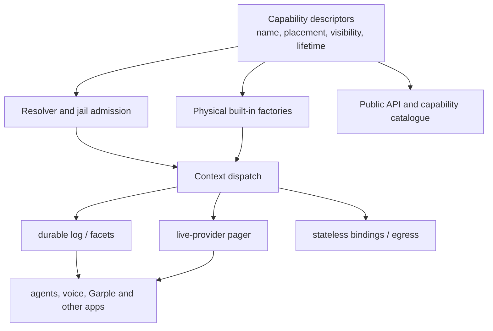

# Archived first core/userspace design

> **Superseded.** This is retained as audit evidence, not a recommendation. It proposes the public descriptor/provider taxonomy rejected by the current direction. The active model is in [findings.md](findings.md): existing `itx`, events, `provide`, `subscribe`, processors, facets, workers, and jails with private platform plumbing beneath them.

# Core and user-space simplification audit

This is an audit of `cfd8a1d36`, focused on the context kernel, capability
resolution, live providers, subscriptions, fetch and jails. It deliberately
does not propose a new product model. The behaviour to retain is:

- a named Iterate context has an ordered durable event log, bounded live
  ephemerals, append/read/wait and fast local dispatch;
- a context resolves capabilities, including live values supplied by an active
  client, and can call/fetch across contexts;
- a context can default-deny (`itx => null`) and grant selected names through
  that boundary;
- durable processors retain at-least-once delivery and recovery; live clients
  can receive low-latency push and repair gaps from the log;
- Cloudflare Durable Object resets, eviction and hibernation remain explicit
  outcomes rather than hidden retries.

Garple is useful confirmation of the intended user-space shape. Its project
worker is an ordinary processor, its agent-specific policy is configuration,
and its checkout state is an app stream. `worker.ts` uses only normal event
and context APIs; it does not need a platform-specific agent or capability
host abstraction. The installed Agents and Voice packages now make the same
boundary explicit: [packages/agents/README.md](../../packages/agents/README.md)
and [packages/voice/README.md](../../packages/voice/README.md) call both
userspace. That direction should continue.

## Finding 1 — capability definition is split into four authorities

**Confidence: high. This is the largest structural simplification with the
best behaviour-preservation story.**

The platform has a good internal model — a physical `itx.builtins` record and
rewrites from the short public spelling — but it defines that model repeatedly:

| Concern                                      | Current authority                                                                                                       |
| -------------------------------------------- | ----------------------------------------------------------------------------------------------------------------------- |
| Public TypeScript API                        | `packages/iterate/src/api.ts` (`IterateContextApi`, beginning at line 669)                                              |
| Physical and platform-only API               | `apps/os/src/context/built-ins.ts` (`BuiltInScope`, line 231)                                                           |
| Human/model description and root enumeration | `apps/os/src/context/itx-expression-rewriting.ts` (`BUILT_IN_ROOT_DESCRIPTIONS`, line 58)                               |
| Where a root is implicit or runs             | `CONTEXT_ROOTS` line 118, `PORTABLE_ROOTS` line 146, and resolver routing at line 1002 in `itx-expression-rewriting.ts` |

There are compile-time equality assertions in `built-ins.ts` at lines 435–460.
They catch a missing _root key_, but cannot express or verify its placement,
visibility, delivery semantics, live/durable lifetime, argument schema,
description accuracy, or whether the same root is available in stateless
dispatch. The implementation is then split across `buildBuiltIns` (line 644),
`buildPortableBuiltIns` (line 2225), `buildIdentityRoots` (line 2133), and the
special `workersRoot` builder (line 2425). A contributor adding a root has to
understand all of these places and the resolver's private root sets.

That split is more consequential than an object-table nuisance: a root's
placement is authority. `implicitRootsAt` decides which short names exist in a
child context, and the resolver uses `PORTABLE_ROOTS` to decide whether a call
runs locally or crosses into a context. A stale list can therefore produce a
capability that is visible in an unintended context or runs with the wrong
context's authority.

### Candidate change: a kernel capability descriptor registry

Make one small data registry the source of truth for every physical root. A
descriptor should contain only kernel facts, for example:

```ts
type CapabilityDescriptor<Name extends string, Public, Physical = Public> = {
  name: Name;
  description: string;
  visibility: "public" | "platform";
  placement: "every-context" | "owner-root" | "portable";
  execution: "context" | "stateless" | "either";
  lifetime: "durable" | "live" | "stateless";
  public: Public;
  physical: Physical;
  build?: (deps: KernelDeps) => Physical;
};
```

This is not a runtime type-reflection proposal. TypeScript interfaces can
remain the public authoring form initially; the registry may use type-only
references and zod parsers at the command boundary. The important part is that
the runtime policy is represented once and derived rather than copied.

From it derive:

1. `BUILT_IN_ROOTS`, descriptions, context/root availability, and the resolver
   dispatch policy;
2. the physical built-ins record by composing descriptors valid in the current
   execution site;
3. the public `IterateContextApi` projection and platform-only projection;
4. a machine-readable capability catalogue returned to an app/model (name,
   description, availability, argument/result schema where supplied);
5. admission checks for a jail and diagnostics that say whether a denied name
   is absent, masked, platform-only, live-only, or unavailable at this path.

The registry should _not_ collapse all implementations into one giant file.
Each descriptor can import a focused factory. The change replaces duplicated
policy while retaining modules such as secrets, repos and egress.

The target layering is:



### Migration and acceptance checks

Start with the existing roots and produce byte-for-byte equivalent root names,
short-name availability, and descriptions. Keep the current type equality
assertions during the migration, then replace them with one descriptor
completeness test. Test the descriptor's projection over these axes:

- project root, child context and global owner context;
- session, loaded code and platform caller;
- short root, `itx.builtins` root, masked root and explicit grant through a
  jail;
- DO resolver and stateless resolver.

The existing rewrite tests are strong behavioural fixtures for this: see
`apps/os/src/context/itx-expression-rewriting.test.ts` lines 717–809.

## Finding 2 — `subscribe(live callback)` is already an RPC provider, but its

semantics are rediscovered in the delivery loop

**Confidence: high for consolidation of the live path; medium for collapsing
durable delivery paths.**

`IterateContextRpcTarget.subscribe` converts a callback into the exact same
kind of named live capability as `provide`: it creates a key
`subscription:<name>`, appends a normal subscription row pointing at
`itx.builtins.rpcStubs.get(key)`, and opens a pager through
`lendRpcStubOverPager` ([iterate-context.ts](../../apps/os/src/iterate-context.ts),
lines 415–493). `provide` follows the same transport directly above it (lines
307–412). The pager layer already has the needed lifecycle: session-owned
duplicated stub, hibernatable WebSocket offer, page-on-use, relend, redial,
presence accounting and disposal (`context/rpc-stubs.ts`, lines 1–103;
`context/rpc-stub-relay.ts`, lines 193–407).

After that shared setup, `SubscriptionDelivery` contains a second, large
classification and transport policy. It determines whether a target is a
facet/live stub that "owns progress", keeps delivery chains and queues,
separately has cursor delivery and an independent fan-out protocol. Its header
describes the three protocols in detail at
`apps/os/src/stream/subscription-delivery.ts:1`; the implementation is 1,962
lines with a 2,459-line test file.

This creates a confusing public contract: `subscribe` accepts one concept
(target), yet its observable ordering, acknowledgement, retry, ephemerality
and backpressure are inferred from the _brand that happens to result from
evaluating its expression_. A user cannot see that declaration in the row.

### Candidate change: make live subscriptions a provider session

Introduce an internal `LiveProvider` protocol behind `RpcStubDirectory`.
`provide` and `subscribe` become two registrations of the same provider:

```ts
type LiveProviderRegistration = {
  key: string;
  purpose: "capability" | "subscription";
  onPage: "invoke" | "push-events";
  // For push-events only: delivery filters and last offered durable offset.
};
```

The pager remains the only live transport. For subscription providers, its
`push-events` operation sends `{events, after, through}` and receives an
optional acknowledgement. An absent acknowledgement explicitly means
best-effort: durable gaps are repaired with `readEvents`, ephemerals are not
recoverable. This is already the effective live-client contract described in
`subscription-delivery.ts` and `packages/voice/README.md`.

Move the live-only queue, budget and pager-offline outcome into that provider
module. The stream then only does three small actions after a commit: select
matching live providers, notify them, and enqueue durable subscribers. It no
longer needs to discover a live `RpcStubHandle` by evaluating arbitrary target
expressions on every path.

Do **not** merge this with durable at-least-once delivery in the first change.
Facets have durable checkpoints and cursor targets have persisted alarm
claims. Those behaviours are useful and materially different. Keep a compact
`DurableSubscriptionRunner` for cursor/facet/webhook semantics, but make its
mode explicit in the configuration event rather than inferred from a target
brand. A later decision can determine whether facets should use the same
acknowledgement protocol.

This preserves live subscribe, arbitrary live `provide`, hibernation, low
latency push, durable replay and event ephemerality while deleting duplicated
session/pager ownership from the subscription feature.

## Finding 3 — subscription rows currently mix declarative intent and

implementation-selected delivery mode

**Confidence: high.**

`subscription-configured` stores a target expression, filter, `afterOffset`
and `ordered` flag (`core-processor.ts`, lines 650–695). It does not say
whether the caller requires durable acknowledgement, best-effort live delivery,
or fan-out. `targetOwnsProgress` then resolves the expression through current
rules and recognizes the private `facets`/`rpcStubs` implementation spelling
(`core-processor.ts`, lines 189–196). A rewrite can consequently change the
delivery contract without changing the row.

Represent this in the event as an explicit delivery policy:

```ts
delivery: { kind: "live-push" }
        | { kind: "ordered", afterOffset?: number }
        | { kind: "fanout" };
```

The initial migration can derive the field from current targets on append, so
no public API needs to change immediately. Once present, the reducer and
runner do not need `targetOwnsProgress`, and a rewrite's job returns to
capability routing. This makes replay/ephemeral guarantees inspectable in
`subscriptions.list()` and testable as data.

## Finding 4 — jailing is elegant in principle, but its policy is distributed

through resolver internals and append admission

**Confidence: medium-high.**

A bare `itx => null` is the jail. Its selected grants are normal rewrite rows.
Resolution correctly makes the null row win over implicit roots
(`resolveItxExpression`, `itx-expression-rewriting.ts` lines 318–363), while
`refuseLiftingAJail` prevents loaded code from removing or overriding the wall
(line 757). This retains a useful property: a jail is data in the context log,
not a separate runtime mode.

However, security policy is spread across:

- the root sets and `implicitRootsAt`;
- resolver admission of loaded code (`#admit`, line 980);
- `admitLoadedCodeExpression` / `admitLoadedCodeRow`;
- the direct dispatch exceptions for `cd`, portable roots, workers and identity
  roots (lines 365–390 and 1002 onward);
- append-time handling in `buildBuiltIns` (line 644).

The result is hard to audit: adding a capability requires deciding which
combination of those mechanisms applies. The descriptor registry should expose
an `admission` rule separately from placement: `always`, `grant-required`, or
`platform-only`. The resolver then has a single gate before every execution
site. Raw `itx.builtins` should remain physically reachable for platform code
but never be a grantable public capability.

Keep the existing event representation of a jail and its compare-and-set
unsets. Do not replace it with a separate permissions database. The
simplification is in making the policy that evaluates those rows declarative.

## Finding 5 — the live-stub liveness loop contradicts the stated bounded

recovery invariant

**Confidence: high as a boundedness defect; low on the intended product timeout.**

`whileClientAnswers` waits ten seconds, probes every ten seconds, and repeats
without a deadline whenever probes answer but the original invocation never
settles (`context/rpc-stub-relay.ts`, lines 139–188). The comments explicitly
say a slow local server is the client's business. That leaves an unbounded
pending call on a live provider and, depending on caller, a retained delivery
slot/pin. It conflicts with the repository invariant that recovery must be
bounded and observable.

There are two valid contracts, and the code should choose one explicitly:

1. a provider declares a deadline for each operation or subscription push, and
   the relay cancels/fails once; or
2. a provider declares the operation intentionally streaming, where the
   operation's own session has a cancellation method and a bounded lease.

The default should be a deadline. `fetch` already has explicit timeout policy
for webhooks; cursor delivery has a 20-second watchdog. Add a deadline to the
provider protocol, log an `rpc-stubs.provider-deadline` outcome with key and
purpose, and release the borrowed stub. This needs an integration test that a
responsive liveness probe plus a permanently pending method stops retaining
the delivery/pin.

## Finding 6 — only the core should remain core

**Confidence: high.**

Agents and Voice are now clearly installable project packages. Their READMEs
show that they use normal contexts, facts, subscriptions, processor facets,
live callbacks and `itx` rules; no core-only primitive is needed for their
domain loops. Preserve that boundary:

- core owns context address/dispatch, event storage, durable subscriptions,
  capability descriptor enforcement, live provider pager, egress and the
  minimal facet host;
- first-party integration services remain capabilities or facets only where
  they are a general platform binding (for example KV, R2, secret-backed
  egress); their domain flows must be installable app code;
- Agents, Voice, chat rendering, prompt construction, audio framing and kit
  policies remain packages/configuration. Their specialised events remain app
  event types, never core control events.

The same principle applies to convenience roots. `connectToMcp`,
`connectToOpenApi` and `connectToCapnweb` are library code already composed
into built-ins by `buildPortableBuiltIns`; their implementation should stay out
of the durable context host. The capability registry can label them
`stateless`/`portable` without pretending they are kernel state.

## Recommended sequence

1. Establish a short written kernel contract: event log, resolver/jail,
   durable subscriber, live provider, egress. Treat all other roots as
   capabilities layered on it.
2. Add the descriptor registry in compatibility mode, deriving descriptions
   and root placement first. Preserve the current implementations and use a
   parity test against the existing root sets.
3. Make subscription delivery policy explicit in new events. Read legacy rows
   with the current target-brand inference until a configuration rewrite
   migrates them.
4. Extract live subscription delivery into the pager/provider module; retain
   cursor/fan-out recovery as a separate durable runner. Validate reset,
   hibernation, pager redial and ephemeral gap behaviour in Workers tests.
5. Bound live invocation lifetime. Emit a typed observable outcome rather than
   an endless probe loop.
6. Once the descriptor and provider seams exist, split `built-ins.ts` by
   capability factory. Do not mechanically shorten the existing giant file
   before those ownership seams are real.

The main deletion opportunity is not the durable-log correctness machinery.
It is repeated capability metadata and live-session machinery that has leaked
into rewrite, subscription and built-in implementations. Consolidating those
two concerns gives the rest of the core a small, explainable shape.
