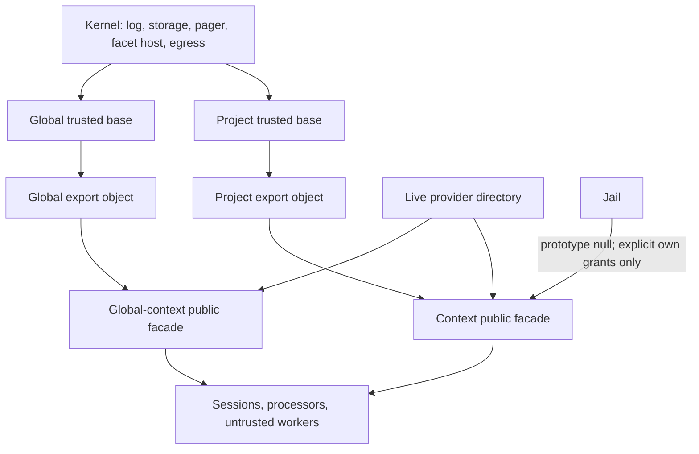

# Paused first-pass design: capability objects, trusted exports and jail boundaries

> **Status: superseded as the active recommendation.** This document preserves
> a useful audit of the old design, but its descriptor/target taxonomy is not
> the proposed core API. See [findings.md](findings.md) for the lean current
> model: event log, ordinary RPC namespace, explicit inheritance/jail, and
> normal code composed above the context.

This proposal is based on `ce251e06c1c3c5894aebdc674e57b2196be0ae08`.
It accepts breaking the rule/provide API. The objective is to remove the
expression-rewrite architecture, not repackage it as a new resolver.

The retained product contract is small:

1. A context owns its event log: append, durable read, live ephemeral read and
   subscription.
2. A context can invoke an object graph over Cap'n Web, fetch through an
   explicitly granted egress capability, and host durable processors.
3. A live provider can be attached without keeping a context resident.
4. A trusted owner can construct a capability object for a project or global
   owner; an untrusted worker receives only a capability facade.
5. A jail gives that facade no inherited capabilities until a trusted owner
   grants explicit exports through it.

Processor authoring (`StreamProcessor`, `ProcessorEngine`,
`StreamProcessorDurableObject`), React live-state/event-log hooks and the
vanilla Cap'n Web client remain public APIs. They do not depend on rewrite
rules and should not be redesigned in this change.

## Decision: replace rules; do not translate them to a new general engine

The current rule is much more expressive than a JavaScript prototype lookup.
`ItxExpressionRewriteRule` can match a prefix including call arguments,
partially apply it, fill `@` / `...@` argument holes, repeatedly rewrite, and
traverse an explicit `cd` hop. See
`apps/os/src/context/itx-expression-rewriting.ts` lines 200–363 and
`packages/iterate/src/expression.ts` lines 20–80.

A prototype chain alone models only property lookup. Trying to add method
matchers, templates, repeated redirection and route snapshots to it recreates
the existing 1,200-line resolver with worse visibility. Therefore:

- retain `ItxExpression` as the _wire invocation representation_ for an
  `InvokeHandle` and Cap'n Web pipelining;
- delete `itx/rewrite-rule-configured`, `provide(expression | null)`,
  `rewriteRules`, `@` in target expressions, and rule snapshots as a routing
  mechanism;
- replace a transformed rewrite with a named trusted export implemented as an
  ordinary adapter object. For example, a fixed-model `fable` export is a
  method that calls AI with its fixed model; it is not a special target
  template;
- replace a `cd` target with an ordinary `contexts.get(path)`/`cd(path)` handle
  that is explicit in the object tree.

This breaks stored configuration. That is acceptable under the stated
constraint and is materially safer than preserving a hidden language in the
event log.

## Target object model

There are two distinct object graphs. Keeping them distinct is the important
security simplification.



### 1. Kernel objects are never a public namespace

`KernelContext` contains the actual privileged primitives: stream mutation,
stream reads, alarm scheduling, facet operations, per-owner storage prefixes,
the pager directory, outbound fetch and context addressing. It replaces the
current `itx.builtins` as an implementation detail.

No untrusted worker, Cap'n Web session or app-defined export receives a
`KernelContext`. This removes the reason for the current string-level ban on
`itx.builtins` in `admitLoadedCodeExpression`
(`itx-expression-rewriting.ts:627`) and the corresponding special fixed point
in resolution.

`ProjectTrustedBase` and `GlobalTrustedBase` are built independently. They
share factories only where their authority is genuinely the same. They are not
one object with a collection of `if (global)` checks. For example, project
egress/secrets/repositories live in the former; user/organization/instance
operations live in the latter. The existing placement logic in
`first-party-facet-placement.ts` remains the authoritative validator for where
a first-party durable component may exist.

### 2. Public capability scopes use explicit lookup

Each context stores a compact public scope record:

```ts
type CapabilityScope = {
  readonly revision: string;
  readonly own: Record<string, unknown>;
  readonly parent: string | null;
  readonly jailed: boolean;
};
```

The resolver keeps the lookup order explicit: the longest own export, then a
jail denial, then an implicit built-in root, then the parent scope. A context
or provider object never crosses the wire as a JavaScript prototype. Cap'n Web
and workerd require ordinary objects, while the existing dispatch walker follows
prototype properties; a prototype would both fail serialization and bypass a
jail. `InvokeHandle` remains the cross-wire capability representation.

Cache a resolved scope by its context address and revisions. The cache needs a
bounded TTL, an invalidation revision, and a dispatch-time revocation fence.
For a parent held in another Durable Object, acquire its revision and scope
asynchronously; a local cache is not proof that a remote grant remains valid.
A stale or revoked revision must re-read once before dispatch and deny if it
still disagrees. Parent scopes are followed only through the context tree and
must detect a cycle at construction.

### 3. A jail is a boundary between facade objects

A jail must not be implemented by removing a parent prototype from the normal
object after kernel roots have been copied into it. That would leave local
`append`, `cd`, `fetch` and provider entries exposed. This is a flaw-prone
version of the existing distinction between implicit roots and the bare-null
mask.

Instead, constructing a jailed public facade starts from `Object.create(null)`
and installs only explicit grants. The kernel still has its own internal
context object, so it can append execution receipts, perform delivery and
recover providers without gaining visibility through the public jail.

The trusted owner changes the jail or grants only through one authoritative
configuration path. An untrusted invocation has no API that can mutate its
scope, change its parent, or gain a trusted object reference. This replaces:

- `refuseLiftingAJail` (`itx-expression-rewriting.ts:757`);
- loaded-code expression admission and row admission (lines 627–756);
- the special bare-null precedence rule in `resolveItxExpression`.

Keep a durable audit event such as `itx/capabilities-configured` containing the
declarative scope definition and its revision. It is a configuration receipt,
not an executable language. A non-empty update must be atomic: validation,
revision increment and facade invalidation occur in the same storage
transaction.

### 4. Trusted exports replace arbitrary targets

Trusted configuration publishes a small declarative export record. It is not
a string expression and does not accept a generic target expression:

```ts
type TrustedExport =
  | { kind: "facet"; name: string; spec?: FacetSpec; description?: string }
  | { kind: "worker"; spec: WorkerSpec; description?: string }
  | { kind: "context"; path: string; description?: string }
  | { kind: "adapter"; module: PublishedModule; export: string; description?: string };

type ScopeDefinition = {
  jailed?: boolean;
  exports: Record<string, TrustedExport>;
};
```

The loader resolves `adapter` only from a published, trusted configuration
module. The object it returns is wrapped as a public Cap'n Web target. It
receives a deliberately selected capability facade as an argument, never the
kernel object. This is how a fixed model, argument validation, composition or
an app-specific capability is implemented. It makes policy ordinary code with
ordinary tests instead of data interpreted by a second language.

An untrusted worker also needs to implement transforms and composition over
the capabilities it has been granted. It may export an adapter object or return
ordinary Cap'n Web handles from its worker entrypoint; the wrapper passes it a
jail facade and rejects any kernel, trusted-base, or parent-scope reference.
Trusted registration controls where that worker is mounted and its declared
metadata. It does not reserve composition for privileged modules.

`facet`, `worker` and `context` are intentionally narrow. Do not add a
`target: ItxExpression` escape hatch, or the old resolver becomes permanent.
An export may return further regular handles, which preserves collections such
as `itx.agents.get(path)` and `itx.repos.get(path)`.

Project configuration currently implements agents and voice by appending
rewrite facts:

- `packages/agents/src/install.ts:15–34` installs `itx.agents` as a facet;
- `packages/voice/src/install.ts:27–45` installs `itx.voice` as a worker.

Those become trusted export registrations, for example
`itx.capabilities.export("agents", facet(...))`. The package remains
userspace. Its TypeScript module augmentation can remain optional ergonomics:
`IterateContextApiWith<"agents">` remains a compile-time assertion for callers
that installed it, while the runtime treats the result as an object capability.
Unknown exports are valid `unknown`; the platform need not generate types.

## Live capabilities and subscriptions

The live-provider pager should remain. It is already a purpose-built solution
to a hard Durable Object property: retain a hibernatable offer, page a client
only on call, borrow and release the live RPC stub, then redial after reset.
See `context/rpc-stubs.ts` and `context/rpc-stub-relay.ts`.

Registering a provider adds an **own** capability entry to a public scope:

```ts
type ProviderEntry = {
  kind: "provider";
  key: string;
  purpose: "invoke" | "events";
  description?: string;
};
```

For `invoke`, the entry is exposed under a named export. For `events`, it is a
live subscription sink. The pager protocol, attach/detach state, redial and
lease are shared. A durable event subscription remains a separate configured
consumer with a persisted cursor and bounded retry policy; a live sink is
best-effort and receives ephemerals. This removes the current inference that a
subscription's target "owns progress" because evaluating an arbitrary
expression returns a `FacetHandle` or `RpcStubHandle`
(`core-processor.ts:189–196`, `subscription-delivery.ts:1–25`).

The new public API can deliberately be clearer:

```ts
itx.providers.attach("camera", liveTarget, { description });
itx.events.live({ consumes, sink: liveTarget });
itx.events.durable({ name, consumes, target, afterOffset });
```

It need not retain overloaded `provide` or `subscribe`. React hooks and
`connectEventLog` adapt to `events.live` internally; their existing users keep
their hook API. The vanilla client continues to receive Cap'n Web handles.

Provider calls must have a declared deadline/lease. The current
`whileClientAnswers` loop probes indefinitely if a client answers probes while
the original call never resolves (`rpc-stub-relay.ts:139–188`). The new entry
must choose a bounded default and emit an observable provider deadline
outcome. This is part of the provider contract, not a subscription exception.

## Exact source migration

This is intentionally a breaking, vertical replacement. Running both routing
systems indefinitely would retain the complexity.

| Current source                                          | Replace/remove                                                                                                                                                                                                           | Result                                                                             |
| ------------------------------------------------------- | ------------------------------------------------------------------------------------------------------------------------------------------------------------------------------------------------------------------------ | ---------------------------------------------------------------------------------- |
| `apps/os/src/context/itx-expression-rewriting.ts`       | Delete expression rewrite, target templates, app wall, rule resolver, root sets and rule list formatting. Retain only a small `CapabilityScopeResolver` if its name helps transition.                                    | Lookup is own/prototype/base, no recursive rewrite.                                |
| `apps/os/src/stream/core-processor.ts`                  | Remove `itxExpressionRewriteRules`, rewrite event normalization/reduction, target resolution used to classify subscriptions, and rewrite-specific unsets. Add `ScopeDefinition` revision reduction.                      | Core state records a compact declarative capability configuration.                 |
| `apps/os/src/context/rule-snapshots.ts`                 | Replace after fetch-route/ingress routing is separated into its own root snapshot or owner configuration record.                                                                                                         | The scope facade cache retains a bounded TTL, revision check and revocation fence. |
| `apps/os/src/context/built-ins.ts`                      | Split into `kernel-context.ts`, `project-base.ts`, `global-base.ts`, `capability-scope.ts` and focused capability factories. Remove public `builtins`, `rewriteRules` and arbitrary `workers.get` as routing primitives. | Trust, owner and stateful/stateless axes become visible in filenames and types.    |
| `apps/os/src/context/stateless-context.ts`              | Build/cache public facade and invoke a handle; no multi-context rule traversal. Keep explicit `cd`/context handle, egress and worker loading.                                                                            | Stateless dispatch has one lookup model.                                           |
| `apps/os/src/iterate-context.ts`                        | Replace `provide` with provider attach and trusted export administration; replace overloaded `subscribe` with live/durable subscription APIs.                                                                            | Session methods no longer write executable routing data.                           |
| `apps/os/src/context/rpc-stubs.ts`, `rpc-stub-relay.ts` | Keep pager transport, rename around `LiveProviderDirectory`, add purpose and deadline.                                                                                                                                   | One live mechanism for values and event sinks.                                     |
| `apps/os/src/stream/subscription-delivery.ts`           | Remove live-stub target detection and move live push queue to provider delivery. Retain durable ordered/fanout runner only.                                                                                              | Durable recovery is isolated from live session transport.                          |
| `packages/iterate/src/api.ts`                           | Remove `RewriteRuleConfigured`, `rewriteRules`, `provide` and rule-target type coupling; add narrow scope/provider declarations. Keep `IterateContextApiWith` optional.                                                  | Public API tells callers which lifetime/guarantee they choose.                     |
| `packages/iterate/src/expression.ts`                    | Keep parse/print/dotted InvokeHandle for Cap'n Web calls. Delete `@` / merge-hole syntax after all rule targets are removed.                                                                                             | Expression is a transport codec, not a policy language.                            |
| Agents/Voice install packages                           | Replace appended rewrite facts with trusted export registration. Do not move their processors, contracts or Voice relay into `apps/os`.                                                                                  | First-party apps stay ordinary userspace.                                          |

The hard deletion boundary is `itx-expression-rewriting.ts` plus the
rewrite-specific portions of `core-processor.ts`, `rule-snapshots.ts`,
`iterate-context.ts` and their tests. Merely replacing their names while
leaving expression targets in durable events fails this proposal.

## What remains deliberately separate

The following distinctions are real and should not be flattened:

- project trusted base versus global trusted base;
- stateful context operations versus portable/stateless binding calls;
- durable subscribers (cursor/retry/ack) versus live event sinks
  (best-effort/ephemeral/gap repair);
- trusted export configuration versus the untrusted `itx` facade;
- a Cap'n Web handle's dotted invocation transport versus capability lookup.

They are the correct dimensions of the system. The current code makes them
cross-cutting through rules and caller checks; the new design makes them
construction-time choices.

## Migration evidence required before deletion

1. A capability matrix test for project root, child, global user,
   organization and instance contexts; trusted configuration, session and
   untrusted worker callers; normal and jailed facades.
2. End-to-end tests that an explicit grant crosses a jail, inherited project
   export does not, and no returned value can reveal a kernel object.
3. Pager tests for provider attach, DO hibernation, reset/redial, detach,
   deadline and live-event gaps. Reuse the existing transport scenarios rather
   than reimplementing Cloudflare fault tests.
4. Processor SDK, React `useLiveState`/event-log, and a vanilla Cap'n Web
   client compatibility test against the new `events.live` adapter.
5. Agents and Voice integration tests using export registration; config
   publication must atomically switch the export revision and the modules it
   names.
6. One production-shaped preview proving scope revision telemetry, provider
   deadline outcomes and no unexplained platform errors.

The target is a smaller core because the resolver stops interpreting
user-supplied programs. Trusted code still has full expressive power, but it
uses ordinary objects and functions at a named export boundary, where its
authority and tests are legible.
