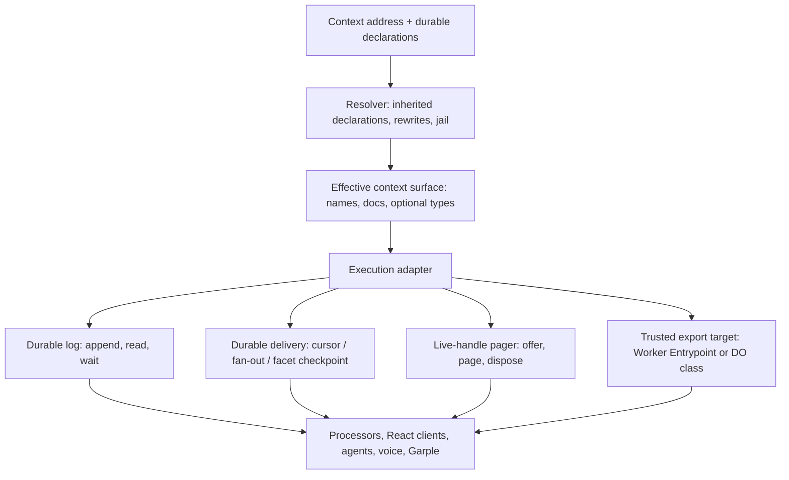
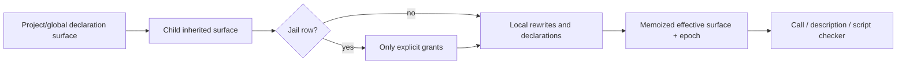

# Cook the context kernel back down

**Status: draft finding report, 29 September 2026.** This report audits the core at two deliberately distinct points: `cfd8a1d3687c77755817d6c5ece586bc15a24bf6`, the initial audit baseline, and `ce251e06c1c3c5894aebdc674e57b2196be0ae08`, current main after #3442. It proposes a breaking proof-of-concept redesign, not a compatibility migration. No implementation, deployment, commit, push, or pull request is made by this report.

The codebase has not proved that it needs a 50,000-line execution kernel. The reproducible narrow runtime count is **25,545 physical TypeScript/TSX lines**, of which the OS context runtime is 18,787 and the public SDK upper bound is 6,758; broader OS runtime is 45,012 lines. The excess complexity has three identifiable sources: one capability is defined and routed in several authorities; live callbacks duplicate their session protocol inside subscription delivery; and one facet lifecycle is decomposed into many durable keys and mirrored maps. Cloudflare-specific recovery remains necessary where it pins observed platform behaviour, but it should sit behind a small lifecycle boundary rather than infect capability resolution and product code. The proposed kernel has five primitives: a durable event log, a context resolver with a jail boundary, durable delivery, an ephemeral live-handle pager, and activation of declared trusted code. Agents, voice, project policy, and ordinary integrations remain userspace. This preserves the current hooks, stream processor authoring model, and vanilla forked Cap'n Web client while making trusted versus untrusted authority explicit.

## The largest reductions require explicit requirement relaxations

The largest safely countable deletions do not come from a refactor that keeps
every exact guarantee. They come from deciding which platform-owned operational
guarantees should instead be explicit SDK/user-space responsibilities. The
following ranking is the first PR decision input. Counts are direct,
non-overlapping physical source lines at ce251e06c1; they are not a deletion
promise. A proposed relaxation must be stated in the PR title and body, and
its replacement contract must be implemented before any deletion.

| Rank | Requirement deliberately relaxed                                                                                                                      |                             Direct core source | Capability retained / concrete impact                                                                                                                              | Prerequisites and risk                                                                                                                                       |
| ---- | ----------------------------------------------------------------------------------------------------------------------------------------------------- | ---------------------------------------------: | ------------------------------------------------------------------------------------------------------------------------------------------------------------------ | ------------------------------------------------------------------------------------------------------------------------------------------------------------ |
| 1    | Core durably brokers every subscription to an arbitrary expression, chooses mode from its resolved target, and owns cursor/retry/halt/fan-out forever |                  1,962 in SubscriptionDelivery | append/read, ephemerals, live callbacks, and SDK-authored durable processors remain; an arbitrary configured target loses automatic platform catch-up/retry/resume | implement an SDK processor cursor/checkpoint service; migrate or explicitly reject each row; prove eviction/replay/no duplicate keyed effect before deletion |
| 2    | A fetch through a lent provider/project host transparently forwards a WebSocket upgrade and survives context reset                                    | 978 in fetch-upgrade plus fetch-upgrade-splice | HTTP, streamed bodies, live Capn Web and user-owned WebSockets remain; transparent 101 bridge/reconnect is removed                                                 | inventory 101 routes, refuse with replacement endpoint, prove HTTP/provider RPC and user-owned websocket across deploy                                       |
| 3    | Configuration rewrites arbitrary expression prefixes with precedence, masks and argument-hole templates                                               |          234 directly exclusive resolver lines | named adapters, direct roots, cd and destination jail checks remain; declarative dynamic interception and no-code forwarding are removed                           | inventory rules, provide static adapter registrations/refusals and preserve jail/cross-context tests                                                         |

The first requirement has the greatest **future** payoff because it hides a
background execution service behind subscription configuration. It is not the
first implementation slice: generic cursor/fan-out remains until a
demonstrated consumer replacement carries its retry, dead-letter, concurrency,
idempotency and webhook behaviour. That future change is a deliberate
relaxation of convenience and platform ownership, not a no-loss refactor.

The **current first slice** is the capability manifest plus explicit delivery
mode and bounded provider leases. It centralises trusted built-in metadata and
removes target-brand delivery inference while retaining the pager, relay,
cursor/fan-out runner and wire APIs. **Exports, not expressions** is the
recommended follow-on phase: it replaces executable durable routing rules with
a typed dotted-name export table while preserving provider/callback wire
shapes, snapshots/revocation fence and durable runner. Its honest measured net
is roughly 900–1,600 production lines and about 3,100 obsolete test lines
after ported tests; it is valuable semantic concentration, not evidence for a
50k-to-20k reduction.

## The first slice prevents specific difficult states

The current implementation slice is architectural rather than a broad cleanup:
it introduces the trusted built-in capability manifest, makes subscription
delivery mode a durable declaration, and bounds provider calls. Its value is
that several formerly representable contradictory states no longer exist. It
does not delete the pager, relay, generic durable runner, snapshot fence,
cross-context resolver, built-in factories, or facet lifecycle machinery.

| Earlier representable state                                                                                                           | Mechanism now removed or constrained                      | State that is now impossible                                                                                         | Boundary retained                                                                                                                                                                                                                           |
| ------------------------------------------------------------------------------------------------------------------------------------- | --------------------------------------------------------- | -------------------------------------------------------------------------------------------------------------------- | ------------------------------------------------------------------------------------------------------------------------------------------------------------------------------------------------------------------------------------------- |
| A subscription row is syntactically classified as push/cursor from a rewrite, then its evaluated target has a different runtime brand | delivery is required as live, processor, or durable       | Alias resolution cannot silently change the acknowledgement/progress owner                                           | Durable targets retain arbitrary callable RPC, ordered/fan-out retry state and alarms                                                                                                                                                       |
| A live callback is configured with durable-only cursor options that the implementation silently ignores                               | Live delivery is a distinct declared mode                 | A callback cannot appear to own afterOffset or ordered semantics it will not receive                                 | The existing dotted live-provider `provide` wire shape remains for firmware, browser extension and tunnel clients; callback `subscribe` remains its own wire operation                                                                      |
| A row declared live resolves to a non-provider, or a processor row resolves to the wrong endpoint shape                               | Target-kind validation at delivery                        | The platform does not reinterpret a mismatch as another delivery protocol                                            | Mismatch is a coded input failure; it does not delete or mutate the durable runner                                                                                                                                                          |
| A resumed live subscription has an implicit cursor/checkpoint whose replay meaning depends on target re-resolution                    | Live mode owns no stream cursor                           | A resumed live row cannot replay an invented durable range; it waits for the next matching append                    | A client that requires durable recovery still uses a processor/durable consumer and readEvents                                                                                                                                              |
| A provider answers liveness probes while its actual call never settles, retaining a borrowed answer/pin without an end                | Per-call lease with an explicit deadline                  | The caller's borrowed RPC invocation cannot remain retained indefinitely                                             | A long call can declare a bounded larger deadline; expiry releases the borrowed answer and does not cancel arbitrary provider-side internal work. Streaming response-body ownership is unchanged                                            |
| Root descriptions, availability, placement and dispatch are copied across root-description/root-set/factory authorities               | Trusted capability manifest is the shared metadata source | Description, placement, availability and dispatch projections cannot disagree through independently maintained lists | Factory code remains manually assembled. A separate compile-time key-conformity check verifies physical factory keys against the manifest; the slice deletes redundant name-uniqueness/filter-copy unit rows rather than deriving factories |

This slice retains the durable runner and existing provider/callback wire APIs,
but deliberately changes two contracts: ambiguous delivery configuration is
rejected, and a provider invocation has a configurable bounded lease instead
of arbitrary pending duration. The default is five minutes, with declared
20-second to 30-minute leases where the operation requires it. Timeout releases
the caller's borrowed invocation; it does not cancel arbitrary provider-side
execution. Streaming response-body ownership is unchanged. The source record is
[delivery-transport-slice.md](delivery-transport-slice.md); its focused unit
evidence is 24 relay tests and 277 subscription-delivery tests. Broader
Workers/e2e, redial, raw configured-event, React/SDK and processor
checkpoint/catch-up evidence remains required before the implementation slice
can be considered complete.

### A parked facet experiment is the anti-pattern

A compact facet control/identity-row experiment was deliberately parked. Its
source change is not part of this production diff: it introduced 26 additional
hazards and did not reduce the lifecycle branch count. Treat it as evidence
against storage consolidation by itself. A design that moves the same
cross-generation, delete/recreate, migration, recovery and birth-order states
into a smaller record has moved complexity without removing it.

The existing facet memo and the deployed abort/start platform pin remain the
reference constraints. Any later replacement must show fewer state transitions,
an explicit recovery proof, and a failure matrix before it replaces source.

### The next boundary is exports, not an expanded manifest

The manifest describes trusted built-ins. It does not yet replace dynamic
rewrite rows, parent scope, provider-name census, late-bound configuration
pointer, jailed inheritance or route snapshots. The planned exports phase
therefore adds one typed dotted-name table for dynamic scope entries; it must
not add a second general descriptor system or turn the manifest into mutable
project configuration.

The export lookup remains an explicit resolver, not a JavaScript prototype
chain: longest matching own export; deny if jailed; implicit built-in at this
location; then parent snapshot. This ordering preserves current own-name
shadowing, prevents a parent link from capturing context-local append/read
operations, and keeps narrowing/repointing behind the existing bounded
cross-isolate revocation fence. The root configuration head is a typed,
platform-written Worker identity, not a self-context pointer, and is resolved
late. A publication changes that one identity while descendant workers,
ingress and subscriptions, and every target configuration name, resolve the
current head.

App adapters are ordinary untrusted Worker exports with fixed props and an
attenuated env.ITX facade. Only platform-deployed trusted entries receive
declared environment bindings. This is the intended replacement for a rewrite
template; introducing a generic trusted published module would create a
secret/binding escape and is outside this architecture.

The second and third rows are not first implementation work. Transparent
WebSocket forwarding may be important to existing routes, and dynamic rewrites
may encode product policy that needs an adapter. The direct resolver count is
only 234 because direct routing, context addressing and jail admission remain
necessary even after the DSL is removed. Short cache leases instead of
authoritative revocation fences, less cause detail, weaker loader recovery and
weaker ephemeral ordering are intentionally not ranked: their direct payoff is
small, overlapping or security/operations-sensitive.

## Scope, baselines, and what changed underneath the audit

The target behaviour is intentionally broad: a named context has ordered durable events and bounded ephemerals; callers append, read, wait and subscribe; a context invokes local, cross-context, stateless, and live capabilities; fetch enters and leaves the context; and a jail can default-deny then grant selected expressions. Throughput, low latency, hibernation, and recovery after a Durable Object reset are observable requirements. Backward compatibility of APIs, persisted rows, and data shape is explicitly out of scope for this proof of concept. The non-negotiable product boundaries are that processors retain their authoring shape, React hooks retain their shape, and the API client stays a vanilla Cap'n Web client from the Iterate fork.

The initial investigation began at `cfd8a1d36` (#3446). Current main is `ce251e06c1` after #3442, a net change of 2,099 additions and 1,787 deletions across 143 files. #3442 adds causal/wake tracing, standardises loaded code on `using itx = this.getItx()`, and pins one compatibility date for Workers. It touches the loader, built-ins, stream wake plumbing, SDK scope handling, residency tests, and many worker/e2e fixtures. It **does not change the capability root table, subscription delivery classification, or pager architecture**, so the principal findings survive; the implementation must build on `ce251e06c1` and preserve the newer scope/release discipline. The earlier note that #3442 was still in flight is retained here as historical audit context only.

The historical audit also observed birth/deploy-shape work in flight. Its final
state must be treated as an integration input: do not copy temporary storage
shapes into the new model and do not silently discard deployed failure
evidence. The prior test-cleanup change, `80b01d6cd`, removed 3,321 test
lines by assigning a guarantee to its cheapest proving layer. That direction
is sound; it is not authorization to delete runtime-defect pins or e2e
contracts.

The line count comes from [`count-loc.sh`](count-loc.sh), which counts tracked
physical lines and names its selectors. It is not a claim that every SDK line
is execution kernel, nor evidence for a numerical deletion promise. The first
working slice is explicit delivery and a capability manifest; it is **not** a
claim or acceptance target of 15–20k lines. Establish its behavioural boundary
and measure it with the same selector before setting a later LOC target.

## The kernel has five durable ideas, not dozens of roots

The simplest useful model is a context as an addressable event log plus an evaluated capability environment. The environment is reconstructed from durable declarations and the current caller; it is never itself a durable object graph. It needs only the following layers.



**The durable facts are small.** A context stores its event stream; rewrite/jail
rules; declared trusted targets and immutable code identity; durable
subscription policy and cursor/lease state; and facet lifecycle. An invocation
builds live bindings from those facts, runs through a resolver, and releases
them at the scope boundary. Do not persist live references or secret values;
persist only an explicit, revocable declaration, recipe, or secret path where
that capability's owner supports restoration. Cloudflare documents that
`RpcTarget` stubs need explicit disposal/`using` and can extend an
execution context; loaded code must not rely on isolate identity surviving
activation or reload ([RPC lifecycle](https://developers.cloudflare.com/workers/runtime-apis/rpc/lifecycle/), [Worker Loader API](https://developers.cloudflare.com/dynamic-workers/api-reference/)).

**The two authority axes should be first-class.** A target is stateful (a Durable Object class/facet) or stateless (a Worker Entrypoint); independently it is trusted or untrusted. A trusted target receives narrowly selected platform bindings—environment configuration, secrets, AI, browser, loader/facet bindings and an `itx` accessor—as its declared entrypoint contract allows. An untrusted target receives only `itx`, with authority filtered by the effective surface. This is the right meaning of the earlier `ITX.Builtins`: privileged implementation code, not a universal end-user object. Project and global contexts can therefore differ because they declare different trusted targets rather than because one hand-built object has more special cases.

A candidate target declaration for platform-trusted code names a versioned
entrypoint export or Durable Object class together with code identity,
visibility and method metadata. It is a future export-scope model beyond the
current manifest slice. Its
invocation keeps the existing Cap'n Web shape: context methods and clients are
ordinary RPC; the declaration does not proxy or replace the client. A native
JS `Proxy` is not a general description or authority mechanism. It needs a
targeted Workers serialization test if used at a boundary; the older workerd
#3184 failure was fixed and is not evidence of a current prohibition.

### A concrete declaration, deliberately smaller than a schema system

```ts
type TargetDeclaration = {
  target: { kind: "entrypoint" | "durable-object"; export: string; codeId: string };
  trust: "trusted" | "untrusted";
  state: "stateless" | "stateful";
  exposure: "owner" | "inherited" | "explicit-grant";
  description: string;
  methods?: Record<string, { description?: string; input?: TypeRef; output?: TypeRef }>;
};

type TypeRef =
  | { kind: "unknown" }
  | { kind: "typescript"; declaration: string }
  | { kind: "json-schema"; schema: object };
```

`unknown` is a valid answer. This catalogue is documentation and optional script
checking, not a requirement to reflect arbitrary JavaScript or Cap'n Web
objects at runtime. Cap'n Web RpcTargets expose prototype methods/getters rather
than own instance fields and TypeScript types are erased; this is the firmer
reason that runtime reflection cannot produce complete type descriptions.
Worker Loader already asks callers to supply code, compatibility date/flags,
bindings, and identity ([Worker Loader API](https://developers.cloudflare.com/dynamic-workers/api-reference/)).
Build-time declarations should produce the optional catalogue, typechecking
input, public method allowlist, and human/model description. Runtime evaluation
returns a value or a stable error; it does not attempt to infer a shape from it.

The initial implementation should keep today’s public TypeScript interfaces and layer generated declarations over them. A later breaking API can make `declareTarget()` the authoring source. Do not introduce a universal JSON schema engine: most methods need names, prose, and an optional input/output type more than validation; a schema engine would duplicate TypeScript, impose serialisation rules on Cap'n Web values, and turn documentation into a new runtime dependency.

## Built-ins are four competing authorities today

The current design has an intellectually sound distinction between physical `itx.builtins` and short expression names. But it defines it repeatedly. `packages/iterate/src/api.ts` owns public surface types; `apps/os/src/context/built-ins.ts` owns `BuiltInScope` and construction; `itx-expression-rewriting.ts` owns `BUILT_IN_ROOT_DESCRIPTIONS`; and the latter independently owns `CONTEXT_ROOTS`, `PORTABLE_ROOTS`, implicit-root placement, and resolver dispatch. `buildBuiltIns`, `buildPortableBuiltIns`, identity roots, and `workersRoot` then rebuild pieces of the policy. Existing type assertions catch missing root keys but cannot prove placement, visibility, lifetime, delivery contract, type description, or stateless availability.

That is more than a maintenance complaint. `implicitRootsAt()` decides which short names a child context sees; `PORTABLE_ROOTS` decides whether evaluation runs locally, hops to the context, or runs statelessly. A stale list can give a capability the wrong authority or execution site. The long literal documentation table also cannot describe a dynamically provided capability, a mask, or the result of a jail.

Replace the parallel lists with a small static descriptor registry. The registry carries only kernel policy and points to focused implementation factories; it is not a giant built-in module in a different syntax.

```ts
type CapabilityDescriptor = {
  name: string;
  description: string;
  kind: "kernel" | "trusted-target" | "binding" | "library" | "live";
  placement: "context" | "owner" | "global";
  execution: "context" | "stateless" | "either";
  admission: "always" | "grant-required" | "platform-only";
  lifetime: "durable" | "ephemeral" | "per-call";
  types?: { input?: TypeRef; output?: TypeRef };
  build?: (deps: InvocationDeps) => unknown;
};
```

From this one registry derive root names, descriptions, implicit placement, dispatch routing, physical factory composition, the public projection, the description API, and jail diagnostics. The registry must report the **effective** surface: root declarations plus inherited declarations, then rewrite rules, then masks and explicit grants, finally caller admission. A description can say `available`, `masked by jail`, `requires explicit grant`, `platform-only`, `live provider absent`, or `unknown type`; it must not claim that a static built-in record alone is callable.

The visible prototype-chain idea is good, provided it is only a cached resolution model. Contexts have a logical parent surface; the resolver computes and memoizes ancestor declaration epochs, and invalidates on a declaration/rule change. A jail is an explicit hard boundary in that chain: it yields no inherited values unless a later grant is recorded. This avoids repeated hopping while keeping the present property that the jail is durable context data rather than a separate permissions database. Current resolution already makes a bare `itx => null` win and prevents loaded code from lifting that boundary; preserve those semantics while moving admission into one descriptor gate.



`itx.builtins` can remain an implementation-only physical namespace during the transition. It should not be a grantable user capability, and external code should not have to know it. The public expression compiler maps a public name to a descriptor and target declaration; trusted platform code may use the physical namespace when assembling bindings. This directly meets the project/global distinction without retaining a universal privileged object.

## Live subscriptions already share a pager; make that contract explicit

`IterateContextRpcTarget.provide` and `.subscribe` already use the same core mechanism. A subscription callback is named `subscription:<name>`, stored as an ordinary subscription target pointing at `itx.builtins.rpcStubs.get(key)`, and lent using `lendRpcStubOverPager`. The directory pages a session-owned duplicate stub on demand, re-lends after reconnect, tracks availability and disposal, and allows the DO to hibernate. That is the requested common provider mechanism.

This commonality is a relay/lease mechanism, not a claim that all transports
are equivalent. Streams and WebSocket-upgrade responses retain adapter-specific
limits and lifecycle work; the pager does not make a socket-bearing fetch
response an ordinary event callback.

The duplication begins later. `SubscriptionDelivery` is 1,962 lines and `subscription-delivery.test.ts` is 2,459 lines. It separately determines whether a target “owns progress” by inspecting rewrite syntax (`facets` or `rpcStubs`), then discovers an actual `RpcStubHandle` at delivery time, manages queue/budget state, and treats offline as loss repaired by a read. In other words, a single subscription API infers ordering, acknowledgements, retry, ephemerality, and backpressure from the brand that happens to be returned by the expression.

The safe simplification is to evaluate a subscription target once into an internal delivery adapter:

```ts
type DeliveryTarget =
  | { kind: "live-hint"; offer(batch: EventBatch): Promise<LiveOffer> }
  | { kind: "checkpointed"; push(batch: EventBatch): Promise<void> }
  | { kind: "acknowledged"; deliver(batch: EventBatch): Promise<void> };

type LiveOffer =
  { accepted: true } | { accepted: false; reason: "offline" | "backpressured" | "over-budget" };
```

The pager owns every session-owned live target: borrow/page/return/redial/
liveness/close and the typed `LiveOffer`. The stream only selects matching
live registrations after a committed append and invokes `offer`. A missed
live offer is explicitly best-effort: durable events repair through
`readEvents`; ephemerals do not. This retains low-latency push without making
a transient `RpcTarget` a durable subscription. For a Cap'n Web RPC session
inside a DO today, retain/reacquire-or-drop it on wake; native hibernatable
WebSockets preserve socket plus attachment, not arbitrary JavaScript RPC
session state ([WebSocket best practices](https://developers.cloudflare.com/durable-objects/best-practices/websockets/), [workerd #6087](https://github.com/cloudflare/workerd/issues/6087)).

Do **not** collapse the other two adapters into the pager. Ordered cursor delivery claims the one DO alarm before work and persists acknowledgement afterwards. Fan-out retains one durable record per admitted event with retry/dead-letter and parallelism. Facets use a checkpoint/catch-up protocol attached to their own lifecycle. Those are three different durable guarantees, and forcing them through an ephemeral provider would lose expressive power. The simplification is to make the difference visible in a subscription declaration instead of inferred from private target syntax.

```ts
type SubscriptionPolicy =
  | { kind: "live-hint"; filter: EventFilter }
  | { kind: "ordered"; filter: EventFilter; after?: number }
  | { kind: "fanout"; filter: EventFilter; concurrency?: number };
```

The proof-of-concept can write this policy directly and delete the current target-brand classifier. It does not need a legacy derivation. Subscription authoring can retain its ergonomic target/callback input and choose the policy at construction, so processors and React hooks do not change. Facet policy deserves a distinct explicit checkpointed variant only if callers need to select it; otherwise target declaration classification creates that internal adapter once.

There is a real boundedness defect to fix while extracting this layer. `whileClientAnswers` keeps probing every ten seconds indefinitely when a provider answers probes but the original call never settles. This can retain a delivery slot or residency pin forever, contrary to the repository’s bounded-recovery invariant. A live provider needs a declared default deadline, with a separate intentionally-streaming lease/cancellation contract. Emit a typed deadline outcome with key and purpose, return the borrowed stub, and test a responsive provider with a permanently pending method. The exact deadline is a product decision; the absence of a deadline is the bug.

Keep WebSocket attachments tiny: protocol version, session/provider id, and compact cursor/epoch only. Cloudflare caps a hibernatable WebSocket attachment at 16,384 bytes and attachments vanish on closure ([WebSocket best practices](https://developers.cloudflare.com/durable-objects/best-practices/websockets/)). Put filters, credentials, code identity, and large cursor state in the context declaration/storage. This also avoids coupling the current pager header payload to arbitrary appended event input and opaque header-size failures.

## Facets and loaders need compact lifecycle control, not seven row families

A facet is the right primitive for the stateful side of trusted code: a supervisor owns the declaration, a named child has isolated durable storage, it may hibernate and reconstruct, and it returns a DO-like stub. Cloudflare says a facet abort invalidates existing stubs while retaining its database, while delete destroys the database; a reload must not treat a loaded worker isolate as a singleton ([Durable Object Facets](https://developers.cloudflare.com/dynamic-workers/usage/durable-object-facets/), [Worker Loader API](https://developers.cloudflare.com/dynamic-workers/api-reference/)).

Current `facet-host.ts` represents one name across `facet:<name>`, loader id, named-worker publication, restart count, `facet-ran`, claim, and claim-failures keys, then mirrors portions in numerous maps. This is the main lifecycle interleaving surface. The initial audit proposed one validated durable record; subsequent Claude Opus review correctly rejected putting the large source/spec memo in that record. Keep the existing memo separate, consolidate only compact lifecycle control and identity rows, and retain explicitly non-durable runtime state.

```ts
type FacetControl = {
  ranSinceStart?: boolean;
  lease?: { claimedAt: number; cause?: Cause; failures: number };
  loaderRecoveries: number;
};

type FacetIdentity = {
  loaderId?: string;
  publishedGeneration?: string;
};

type FacetRuntime = {
  generation: number;
  live: boolean;
  recovery?: Promise<void>;
};
```

A single `transition(name, reason)` owns an abort/start pair, patches compact rows at named boundaries, and prevents a late old generation from persisting over a replacement. It must retain the observed invariant that **no parent storage commit occurs between a facet abort and successor start attempt**. The raw deployed `createFailing` test and the current code document a parent-reset platform fault in precisely this window, so it is a platform pin rather than dead defensive code. Keep the narrow `blockConcurrencyWhile` only around that transition; Cloudflare cautions that broad use serializes normal DO input and can severely limit throughput ([Rules of Durable Objects](https://developers.cloudflare.com/durable-objects/best-practices/rules-of-durable-objects/)).

The current birth/quiet sweep does an unbounded `Promise.all` of facet reset/start work under that critical region. The platform fault requires each abort/start pair to stay adjacent; it does not require every configured facet to start simultaneously. Bound the batch or persist a continuation cursor, record counts/durations/pending names, and prove every failed start stays eligible. Dynamic Workers have a collective in-flight limit in a DO I/O context, so this is a scale correctness improvement as well as simpler control flow ([Dynamic Worker limits](https://developers.cloudflare.com/dynamic-workers/platform/limits/)).

The one-alarm model should remain. A Durable Object has one alarm, at-least-once semantics, and native retries; constructors run before alarm delivery after wake, which makes indiscriminate constructor alarm-setting dangerous ([Durable Object alarms](https://developers.cloudflare.com/durable-objects/api/alarms/)). Introduce an `AlarmSource { nextDeadline(); runDue(now); durable }` interface for schedules, cursor delivery, facet lease, and quiet sweep, preserve the existing pass order, and retain the separate alarm-watch workaround. The documented overdue native-alarm observation has bounded rearm attempts and a 28-day quiet telemetry removal criterion; it should not be folded into product scheduling.

The classifier discrepancy is a verified review target, not yet a ready bug fix. Facet start failure classification excludes coded errors only, while the stateless Worker path also excludes `remote` and overloaded look-alikes. The apparent remote-error counterexample is real in the stateless test suite, but facet test injection can yield loaded-code errors marked `remote: true` and current production telemetry logs only message text. First log `remote` and failure kind at the facet recovery boundary and add a parent-side failure injection. Only then decide whether a shared classifier preserves the real platform-fault path. Keep retry policy local: only idempotent operations replay and a failed DO stub must be replaced before an eligible retry, as Cloudflare documents ([DO error handling](https://developers.cloudflare.com/durable-objects/best-practices/error-handling/)).

Split the loader at genuine ownership seams: source resolution; immutable loader key; poisoned-generation recovery; and confined WorkerCode construction. Preserve the current identity ingredients (owner, deploy, origin, generation) until direct parity tests exist. Worker Loader’s `get(id)` may run its callback again and a stable id must always resolve the same content, so the context declaration’s `codeId` is identity while a loader cache is only performance ([Worker Loader API](https://developers.cloudflare.com/dynamic-workers/api-reference/)). The current 32-bit literal-module hash plus length is an accidental-collision guard; use the existing asynchronous SHA-256 path for source identity before treating loaded source as a durable declaration.

## Core is a substrate; agents and voice are applications

Garple demonstrates the desired boundary: its stateful storefront, public HTTP policy, attenuated served context, visitor agent, and sales stream processor compose ordinary event/context APIs. Agents and Voice packages likewise use normal subscriptions, facts, facets, callbacks, and rules. They should remain installable userspace, along with prompt composition, chat rendering, audio framing, kit policy, and app event types. The kernel owns no agent loop or voice protocol.

The same rule applies to convenience capabilities. MCP/OpenAPI/Cap'n Web connectors, repo/artifact helpers, and integration workflows can be descriptor-labelled `library`, `binding`, or trusted target without becoming durable host machinery. The core implements their common execution/authority/lifetime boundary; userspace defines their domain semantics. This does not remove any expressive power: a project can still declare a trusted stateful class or stateless entrypoint, expose it through a descriptor, and wire its own events and subscriptions.

| Current capability                             | Proposed owner                         | Preservation proof                                              |
| ---------------------------------------------- | -------------------------------------- | --------------------------------------------------------------- |
| Append/read/wait, durable and ephemeral events | context log                            | atomic append/read, ephemeral window, high-throughput perf rows |
| Cross-context calls and jails                  | resolver + cached effective surface    | root/child/global, mask/grant, caller admission matrices        |
| `provide` and live `subscribe`                 | live-handle pager                      | page once, redial, offline/re-read, hibernation and disposal    |
| Cursor, fan-out, webhook delivery              | durable delivery                       | alarm/ack/retry/dead-letter deployed rows                       |
| Facet processor delivery                       | facet lifecycle + checkpoint adapter   | reset, catch-up, late generation, lease recovery                |
| Dynamic entrypoint and DO code                 | target declaration + loader/activation | code identity, confinement, worker/facet recovery               |
| Fetch ingress/egress and bindings              | declared trusted capability factory    | route and secret/egress e2e tests                               |
| React hooks and Cap'n Web client               | SDK facade unchanged initially         | SDK compile/use tests and API e2e rows                          |

## Tests should prove contracts once at the right runtime

The direct subscription/provider area contains at least 9,371 test lines. The largest related runtime modules are `built-ins.ts` (2,616 lines), `subscription-delivery.ts` (1,962), `facet-host.ts` (1,466), public `api.ts` (1,276), rewrite resolver (1,240), and stream (1,030). Length is not evidence of redundant coverage. The Workers suite uniquely exercises native RPC, hibernation, eviction, alarms, and residency; deployed e2e uniquely exercises Cap'n Web wire behaviour, routes, and receiver deployment.

Use one branch-to-test matrix before deleting implementation tests. The chosen owner needs to be the cheapest layer that can prove the actual guarantee.

| Contract                                    | Unit owner                    | Runtime proof that must remain        |
| ------------------------------------------- | ----------------------------- | ------------------------------------- |
| Descriptor projection and jail admission    | resolver table                | one Workers root/child/global matrix  |
| Cached parent surface invalidates correctly | resolver cache                | cross-context invocation row          |
| Pager page/return/redial                    | directory/relay state machine | one real session + hibernation e2e    |
| Live hint drops then repairs durable gap    | live adapter                  | one provider-offline subscription e2e |
| Ordered/fan-out durability                  | delivery driver               | cursor/alarm and webhook e2e          |
| Facet lifecycle transitions                 | lifecycle reducer/host        | deployed raw abort/storage-reset pin  |
| Loader identity and poisoned generation     | loader unit                   | worker/facet recovery Worker test     |

Safe reductions follow from this, not from test file size: share test rigs for the three delivery modes while retaining one named terminal assertion per state transition; export a canonical rewrite input/expected-state fixture for resolver and reducer tests; table-drive residency variants while retaining distinct rows for retained `RpcTarget`, stashed `env.ITX`, and website requests; and share RPC e2e session setup while keeping value, attach-order, and lifecycle protocols separate. Delete only a row whose production branch, outcome, and equal-or-higher-fidelity replacement are named.

Do not remove tests that pin real Cloudflare behaviour: the `createFailing` facet abort/storage test, hibernatable socket attachment/close tests, memory budget tests, native alarm/watch tests, and Cap'n Web e2e tests. A workaround becomes deletable only when its specific telemetry is quiet for its declared window and the slow/runtime pin still passes. Cloudflare’s `ctx.abort()` immediately resets a DO and code after it cannot establish a completion marker; abort-specific paths must be intentionally tested and use current alarm retry controls ([DO state API](https://developers.cloudflare.com/durable-objects/api/state/), [Cloudflare changelog](https://developers.cloudflare.com/changelog/post/2026-08-25-durable-object-alarm-abort-no-retry/)).

## A staged rewrite that stays reviewable

1. **Write and test the kernel contract.** Add the descriptor and target-declaration types plus a read-only effective-surface API. Derive current root names/descriptions/placement and compare them with present tables. Add no new transport or storage semantics here.
2. **Adopt target declarations.** Move trusted project/global exports to declarations. Assemble their physical bindings in one invocation factory, enforce trusted/untrusted injection, and retain `using this.getItx()` scope ownership introduced by #3442.
3. **Replace implicit subscription policy.** Write `live-hint`, ordered, and fan-out policy into the proof-of-concept state. Convert the existing target evaluation to a tagged adapter and remove the dual target-brand decision only after state transition tests pass.
4. **Extract the pager live adapter.** Route `provide` and live subscriptions through the same registration/offering interface. Bound calls, separate transport telemetry from application failure, and verify hibernation/redial/offline repair before deleting the old branch.
5. **Compact facet control.** Preserve the source/spec memo, introduce separately versioned compact control and identity rows with new-else-old reads, then move transitions. Retain abort/start adjacency, alarm watch, claims, outcome-generation protection, and explicit observability.
6. **Split loader and alarm orchestration.** Separate loader concerns and introduce `AlarmSource` without changing pass order. Then address literal code identity and bounded reset fan-out.
7. **Delete compatibility scaffolding and count again.** This proof of concept has no compatibility requirement, so delete old state readers and legacy target-shape inference after every contract row is green. Measure the same selector, rather than claiming savings before the code exists.

Each stage needs a draft PR review by Claude Opus 5.5 xhigh and a fresh independent review after its changes. The review record should identify a concrete invariant or counterexample, not merely confirm style. Before a draft PR counts: `pnpm typecheck`, relevant unit/Workers/e2e rows, full required tests, performance/throughput rows, and soak/preview telemetry all pass; Cloudflare logs show no new unexplained errors. A preview must expose effective-surface state, lifecycle state, pager outcome counters, and alarm-watch outcomes so recovery is observable.

## Alternatives and unresolved facts

The strongest alternative is to leave physical built-ins alone and only document them. It is insufficient: root placement and dispatch are security/authority decisions scattered across lists, and a static page cannot answer what a jailed/dynamic context exposes. A universal manifest that serializes every live object is worse: it claims persistence for values Cloudflare does not persist across hibernation. A universal schema/validation engine adds a second type system and does not solve dynamic capabilities; optional descriptors do.

Another alternative is to turn every subscription into durable cursor delivery. It would simplify one internal path but gives up the low-latency, deliberately lossy live hint needed by interactive clients, and would make ephemerals nonsensical. Turning every subscriber into a pager handle does the opposite: it destroys cursor/fan-out acknowledgement guarantees. The target-adapter split is the smallest model that retains all three contracts.

Several facts need final-branch verification before implementation: deployed
compatibility dates and Wrangler/workerd support; the settled birth/deploy
storage semantics; production telemetry for the pinned alarm and abort defects;
the live-provider deadline; whether facet checkpoint delivery deserves an
externally selectable policy; and target-declaration ergonomics for loaded
Worker exports. Cloudflare documents one alarm per object, at-least-once alarm
delivery, and no exact hibernation timing guarantee, so timers must remain
bounded liveness tools rather than correctness boundaries
([Durable Object alarms](https://developers.cloudflare.com/durable-objects/api/alarms/), [Durable Object lifecycle](https://developers.cloudflare.com/durable-objects/concepts/durable-object-lifecycle/)).

## Conclusion

The proposed soul model is not “fewer features.” It is one durable context
substrate, with a cached declarative capability surface, plus two kinds of
transient execution: live handles and trusted code activation. It preserves
the currently valuable asymmetries—ephemeral versus durable events, live hints
versus acknowledged delivery, stateful versus stateless targets, and trusted
versus untrusted code—by naming them explicitly. The first rewrite should aim
for semantic concentration: every authority rule appears once, each compact
lifecycle fact has one owner while large source memos remain separate, and
every runtime workaround has a bounded owner and observable removal criterion.
Only after those seams are real can a later line-count reduction be measured
credibly.

## Source trail

- Current code baseline and reproducible inventory: [`tests-inventory.md`](tests-inventory.md), [`core-userspace.md`](core-userspace.md), [`rpc-subscriptions.md`](rpc-subscriptions.md), [`facets-loader.md`](facets-loader.md).
- Supporting decision appendices: [`requirement-tradeoffs.md`](requirement-tradeoffs.md), [`cloudflare-os-comparison.md`](cloudflare-os-comparison.md), [Claude Opus facet review](reviews/facets-plan-opus.md), [parked facet control experiment](reviews/facets-control-experiment.md), [Claude Opus exports review, round 2](reviews/opus-exports-round-2.md), and [`validation-plan.md`](validation-plan.md).
- Cloudflare/workerd/Cap'n Web research synthesis: [`reports/Iterate core runtime review.md`](../../reports/Iterate%20core%20runtime%20review.md).
- Primary-source research notes selected for the issues in this report: [Cap'n Web](../../research_notes/Iterate%20core%20runtime%20review/capnweb.md), [Cloudflare Workers](../../research_notes/Iterate%20core%20runtime%20review/cloudflare.md), [Cloudflare OS](../../research_notes/Iterate%20core%20runtime%20review/cloudflare-os.md), and [Kenton Varda capability principles](../../research_notes/Iterate%20core%20runtime%20review/kenton-varda.md). They are targeted architecture sources, not a claim of exhaustive reading of either author's corpus.
- Cloudflare primary documentation: [Durable Objects rules](https://developers.cloudflare.com/durable-objects/best-practices/rules-of-durable-objects/), [RPC](https://developers.cloudflare.com/workers/runtime-apis/rpc/), [RPC lifecycle](https://developers.cloudflare.com/workers/runtime-apis/rpc/lifecycle/), [WebSocket hibernation](https://developers.cloudflare.com/durable-objects/best-practices/websockets/), [Facets](https://developers.cloudflare.com/dynamic-workers/usage/durable-object-facets/), [Dynamic Workers](https://developers.cloudflare.com/dynamic-workers/api-reference/).

---

## Evidence ledger: current authority and context surface

This section expands the synopsis into a source-level ledger. Source locations
describe current main at ce251e06c1 unless a paragraph says it is historical
audit data. A source observation says what code or a primary upstream source
does. A finding says what follows directly from it. A proposal is deliberately
marked as such; it is not an assertion that the alternative has been
implemented or proven.

### Built-ins have distinct, overlapping authorities

Physical root descriptions sit in
[itx-expression-rewriting.ts:56](../../apps/os/src/context/itx-expression-rewriting.ts#L56).
The same module derives root names at line 108, maintains context roots at
lines 118-137, portable roots at lines 146-162, and dispatches calls according
to those sets. The comments correctly say portable placement is a security
surface. BuiltInScope and factories remain in
[built-ins.ts:231](../../apps/os/src/context/built-ins.ts#L231) and
[built-ins.ts:639](../../apps/os/src/context/built-ins.ts#L639); portable
construction starts at [line 2220](../../apps/os/src/context/built-ins.ts#L2220)
and the special Worker root begins at
[line 2385](../../apps/os/src/context/built-ins.ts#L2385). The public SDK
interface is separately represented in
[api.ts:669](../../packages/iterate/src/api.ts#L669).

**Finding — high confidence.** Existing type equality checks catch a missing
root key. They cannot establish that a root has the same placement, execution
site, description, lifetime, jail admission and API projection in every
authority. The distinct tables and construction paths above verify that
limitation. A descriptor registry is therefore an evidence-backed
consolidation target, not an aesthetic preference.

The existing taxonomy should not be erased blindly. Context roots such as
append, reads, abort, facets, subscriptions and processors answer in the
addressed context. Portable roots such as KV, R2, egress, repositories and
connector libraries answer with project-level resources or caller origin.
Some roots are platform-only. A descriptor needs to express those differences
without forcing implementations into one module.

The physical/public distinction is valuable. Short names currently compile
through implicit rows to a physical built-ins root. The proposed kernel object
is internal machinery, while the public facade resolves declared capability
names. A trusted factory can use raw platform bindings without making that
object grantable through a jail.

### The current rule language is not just property lookup

ItxExpressionRewriteRule matches expression prefixes and resolution at
[lines 318-363](../../apps/os/src/context/itx-expression-rewriting.ts#L318)
can follow rewrites, retain argument holes and use explicit context navigation.
The transport expression grammar in
[expression.ts:20](../../packages/iterate/src/expression.ts#L20) supports call
arguments and target composition. Resolver admission includes special handling
for loaded code, jailed configuration and platform paths.

**Finding — high confidence.** A JavaScript prototype chain cannot exactly
model this semantics. It can look up a property; it cannot by itself match
calls and arguments, partially apply templates, substitute holes, repeatedly
redirect, or include route snapshots in a call. Recreating those behaviours on
objects would reproduce the existing resolver with less visible policy.

**Debated radical proposal, unimplemented.** Compatibility is not required,
so the proof of concept could delete expression rewrite configuration rather
than transliterating it into another general engine. Keep expressions only as
the Capn Web dotted-invocation codec. Replace a transformed expression with a
named adapter export implemented as ordinary trusted code, and replace a cd
target with an explicit context handle. This would remove rewrite events,
provide-expression, target templates, snapshots and argument-hole syntax only
after equivalent capabilities exist. It is not a verified replacement for
every current rule.

The decisive review critique is authority, not syntax. A cached facade needs a
**revocation fence**, not eventual cache invalidation. On a configuration
commit that removes an export, changes a jail, or detaches a provider, the
commit must atomically advance a durable export/provider revision before an
invocation is admitted. A caller holding a warm facade compares its captured
revision with authoritative revision at the kernel boundary and rejects or
rebuilds on mismatch. Without that fence, a warm isolate can invoke a revoked
inherited capability after an update.

### Jails and untrusted adapters

A bare null rewrite creates the present jail, and grants are ordinary rows
after that boundary. See
[resolution](../../apps/os/src/context/itx-expression-rewriting.ts#L318),
[loaded-code admission](../../apps/os/src/context/itx-expression-rewriting.ts#L627)
and [jail lifting refusal](../../apps/os/src/context/itx-expression-rewriting.ts#L757).
The policy is distributed, but its semantic property is valuable: the jail is
durable context configuration rather than a parallel ACL database.

The object-facade proposal therefore needs two graphs. Kernel objects hold
append, storage, pager and activation and are never public. Trusted project
and global bases are independently built. A public facade exposes declared
exports. A jailed facade starts null-prototype and receives explicit grants
only; do not copy a parent then attempt to remove names.

**Review constraint.** Untrusted adapters must remain available. Trusted
exports cannot mean only platform-owned code can provide composition. An
untrusted Worker can receive a scoped public facade and return an ordinary
object or Capn Web handle under a capability explicitly exported by a trusted
owner. It gets no environment bindings or kernel reference. A design that
removes that route would reduce existing application expressive power.

### Descriptions and optional types describe the effective surface

A static interface cannot truthfully describe a context after inheritance,
local exports, jail, grants, rewrites or a temporarily absent live provider.
The description API should report a capability name, status, source, prose,
optional methods/types and the authoritative revision. Useful statuses include
available, masked, grant-required, platform-only, live-provider-absent and
unknown.

This is documentation and optional script checking, not runtime reflection.
Capn Web RpcTarget exposes prototype methods/getters rather than instance
properties, so object-field introspection cannot describe arbitrary remote
objects ([Capn Web RpcTarget](https://github.com/cloudflare/capnweb#rpctarget)).
Build-time metadata is the lightweight answer. Unknown types must stay valid.
Generated declarations are optional ergonomics, not a prerequisite for app
code.

## Evidence ledger: live providers, hibernation and delivery

### The pager is already shared transport

The public context target turns provide and live callback subscribe into
pager-backed RPC stubs at
[iterate-context.ts:307](../../apps/os/src/iterate-context.ts#L307) and
[iterate-context.ts:415](../../apps/os/src/iterate-context.ts#L415). The
directory manages opaque keys, paging, borrowing and concurrent cold calls in
[rpc-stubs.ts:146](../../apps/os/src/context/rpc-stubs.ts#L146),
[line 220](../../apps/os/src/context/rpc-stubs.ts#L220) and
[line 397](../../apps/os/src/context/rpc-stubs.ts#L397). The relay owns
redial, relend and session disposal at
[rpc-stub-relay.ts:190](../../apps/os/src/context/rpc-stub-relay.ts#L190).

The stream rediscovers this semantics indirectly. targetOwnsProgress
classifies a target from rewrite shape at
[core-processor.ts:189](../../apps/os/src/stream/core-processor.ts#L189).
SubscriptionDelivery later observes an evaluated RPC stub and applies its live
push branch at
[subscription-delivery.ts:710](../../apps/os/src/stream/subscription-delivery.ts#L710).
Static classification and the evaluated head can change independently during a
configuration change.

**Finding — high confidence.** A live subscriber is already an ephemeral RPC
provider with event-offering semantics. It should have one pager-owned
registration and typed outcome. The stream should not own a second session
transport. This preserves subscription-before-provider: absence becomes a
known offline/drop result and durable events recover by read.

The outcome must distinguish accepted, offline, backpressured and over-budget.
Current logs split provider page timeout from delivery drop. A typed result
lets the subscription layer report one notification outcome while retaining
transport telemetry and surfacing real application errors.

### Hibernation defines the durable boundary

Cloudflare documents that hibernatable server WebSockets stay attached while a
DO leaves memory, wake it on messages and retain only a structured-clone
attachment capped at 16,384 bytes
([WebSocket hibernation](https://developers.cloudflare.com/durable-objects/best-practices/websockets/)).
The hibernation API uses acceptWebSocket rather than normal listeners, and
automatic request/response pairs can avoid waking a DO for heartbeats
([DO state API](https://developers.cloudflare.com/durable-objects/api/state/)).
Outbound sockets keep a DO resident
([DO lifecycle](https://developers.cloudflare.com/durable-objects/concepts/durable-object-lifecycle/)).

The open hibernatable-RPC issue says active Capn Web/RPC state pins an isolate
and general RpcTarget references are not preserved
([workerd #6087](https://github.com/cloudflare/workerd/issues/6087)). It is
issue evidence rather than API contract, but agrees with the attachment model.
The safe invariant is therefore: **a live handle is in-memory and disposable;
a registration, compact selector and offset are durable.** Do not persist a
stub, function, fetcher, secret or arbitrary object graph.

whileClientAnswers starts a call, waits ten seconds, probes every ten seconds
and continues indefinitely while probes answer
([rpc-stub-relay.ts:136](../../apps/os/src/context/rpc-stub-relay.ts#L136)).
A responsive provider whose method never settles is not bounded. The fix must
be a deadline/lease in provider operation semantics, not a probe-cadence
change.

### Durable delivery must remain until its replacement exists

Ordered cursor delivery claims alarm state and persists acknowledgement/retry
at [subscription-delivery.ts:1077](../../apps/os/src/stream/subscription-delivery.ts#L1077)
and [line 1226](../../apps/os/src/stream/subscription-delivery.ts#L1226).
Fan-out records each admitted event with retry/dead-letter and bounded
parallelism at [line 1307](../../apps/os/src/stream/subscription-delivery.ts#L1307)
and [line 1619](../../apps/os/src/stream/subscription-delivery.ts#L1619).
Facet catch-up is checkpoint repair, not an ordinary callback, at
[lines 534-564](../../apps/os/src/stream/subscription-delivery.ts#L534).

**Finding — high confidence.** A tagged live-hint, checkpointed and
acknowledged adapter is a sound intermediate simplification. It makes the
contracts explicit and permits the live branch to move into the pager. It does
not prove a large deletion by itself.

**Debated radical proposal, unimplemented.** Eliminate the generic durable
delivery broker, retaining only live watches and hosted processors that own
checkpoints. It could remove generic cursor/fan-out tables, alarm claims and
much of SubscriptionDelivery.

**Review gate.** Generic fan-out is an existing capability. The radical broker
deletion is invalid until a concrete replacement is implemented and tested for
arbitrary acknowledged targets, ordered delivery, retries, backoff, dead
letters, halt/resume, idempotency and alarms. Calling that responsibility
userspace is insufficient unless a consumer API actually provides it. The
working rewrite must retain the durable runner first.

## Evidence ledger: facets, loaders, alarms and residency

### Platform workarounds have specific retained boundaries

| Behaviour                                                    | Current bounded boundary                  | Required disposition              |
| ------------------------------------------------------------ | ----------------------------------------- | --------------------------------- |
| stopping a written facet can reset its parent on next commit | keep abort/successor start adjacent       | retain raw deployed pin           |
| native alarm can remain undelivered while held               | bounded alarm watch/rearm plus telemetry  | remove only after quiet criterion |
| Worker Loader callback failure poisons entry                 | fresh-generation recovery                 | retain recovery classification    |
| RPC values retain a context after client use                 | scope/session release plus durable claims | retain residency proof            |

These are not reasons to retain arbitrary defensive code. Each workaround
needs a named outcome, bounded attempt/timeout, runtime pin and removal
criterion. Cloudflare says failed DO calls may leave a stub broken; a retry
uses a fresh stub and only applies to idempotent retryable work
([DO error handling](https://developers.cloudflare.com/durable-objects/best-practices/error-handling/)).

### Facet state is fragmented

One facet has startup spec, loader identity, named worker publication, restart
count, ran-since-start flag, claim and claim-failure rows. The main storage and
map concentration is in
[facet-host.ts:246](../../apps/os/src/context/facet-host.ts#L246),
[line 307](../../apps/os/src/context/facet-host.ts#L307),
[line 605](../../apps/os/src/context/facet-host.ts#L605),
[line 622](../../apps/os/src/context/facet-host.ts#L622),
[line 1114](../../apps/os/src/context/facet-host.ts#L1114) and
[line 1442](../../apps/os/src/context/facet-host.ts#L1442).

**Revised finding — high confidence.** Consolidate compact lifecycle control
and identity state, but keep the existing large facet source/spec memo
separate. Claude Opus 5.5 xhigh review found that combining them would rewrite
source on claim/run updates, risk the source-cell ceiling, force birth/quiet
scans to load every source, and confuse a hosted spec with lifecycle state.
Runtime owns generation/recovery promises/live references only. One transition
serializes the sensitive abort/start pair; unrelated host work need not
coordinate prefix scans and mirrored maps.

The preservation facts are exact: spend a claim before revive; clear
ran-since-start only after successful start; leave failures eligible; prevent
old generation work from persisting over replacement; and move published
worker identity only forward. Migration readers require new-else-old fallback
for claim, ran, identity, publication and restart count. Deferred writes must
patch a current field rather than persist a captured snapshot, and an outcome
generation must survive delete/recreate so an old timeout cannot restart a new
facet. Tests should name those transitions, not storage key spellings or
private Map updates.

### Concrete bug and scale risk

Facet start uses a different platform-failure classifier from stateless
Workers: [facet-host.ts:86](../../apps/os/src/context/facet-host.ts#L86) versus
[worker-loader.ts:449](../../apps/os/src/context/worker-loader.ts#L449). The
stateless classifier excludes coded, overloaded and remote errors; facet
classification excludes coded errors only. Existing remote-error coverage is
at [worker-loader.test.ts:551](../../apps/os/src/context/worker-loader.test.ts#L551).

**Finding — medium confidence, investigation required.** This classifier
difference needs telemetry and fault injection before behaviour changes.
Log remote and failure kind at facet recovery; add an explicit parent-side
failure injection; then determine whether a shared classifier incorrectly
suppresses actual platform recovery. Retry permission stays specific to the
caller.

Birth/quiet recovery uses unbounded Promise.all under the sensitive lifecycle
region at [facet-host.ts:460](../../apps/os/src/context/facet-host.ts#L460)
and [line 531](../../apps/os/src/context/facet-host.ts#L531). Per-start
watchdogs do not bound total work. One rebirth can trigger unlimited source
resolution while parent work is blocked. Dynamic Workers have a collective
in-flight limit per DO I/O context
([Dynamic Worker limits](https://developers.cloudflare.com/dynamic-workers/platform/limits/)).
Use bounded batches or a durable continuation, measure batch count/duration/
pending names, and prove failures remain eligible.

The single-alarm architecture is sound. Its coordinator computes earliest
deadline at [alarm-coordinator.ts:143](../../apps/os/src/alarm-coordinator.ts#L143);
the context combines schedules, subscriptions, claims, quiet sweep and owed
runs at [iterate-context-durable-object.ts:1240](../../apps/os/src/iterate-context-durable-object.ts#L1240).
An AlarmSource interface can centralise product schedule selection but must not
absorb the native-alarm watch. Cloudflare documents one at-least-once alarm
per object and constructor-before-alarm wake order
([Alarms](https://developers.cloudflare.com/durable-objects/api/alarms/)).

## Validation baseline and deletion discipline

Run [count-loc.sh](count-loc.sh) from this checkout. It counts tracked
TypeScript/TSX physical lines, including comments/blanks. The exact audited
baseline is:

| Group                               |  Files | Physical lines |
| ----------------------------------- | -----: | -------------: |
| Context engine runtime              |     23 |         10,377 |
| Stream engine runtime               |      5 |          3,993 |
| Context shell runtime               |     11 |          4,417 |
| **OS context runtime**              | **39** |     **18,787** |
| SDK runtime upper bound             |     22 |          6,758 |
| **Narrow core runtime**             | **61** |     **25,545** |
| All OS runtime, excluding generated |    174 |         45,012 |
| Context engine unit tests           |     18 |          7,160 |
| Stream engine unit tests            |      5 |          5,528 |
| SDK unit tests                      |     14 |          4,444 |
| Workers runtime tests               |     71 |         22,129 |
| OS protocol e2e tests               |     49 |         14,429 |
| OS performance tests                |      6 |            725 |

The narrow core plus its three colocated unit suites is 42,677 lines before
Workers/e2e. That explains the 50k feeling without claiming 50k production
kernel lines. Any final reduction must use this exact script and retain its
selectors.

| Candidate consolidation   | Safe transformation                | Mandatory preservation                                          |
| ------------------------- | ---------------------------------- | --------------------------------------------------------------- |
| delivery unit setup       | common mode fixture                | one named terminal assertion per transition                     |
| rewrite data              | shared canonical rows              | separate resolver and reduction checks                          |
| RPC e2e setup             | shared session helper              | distinct value, attach-order and lifecycle protocols            |
| residency e2e setup       | table-driven retained-value matrix | separate RPC target, raw ITX and website rows                   |
| facet private state tests | lifecycle transition table         | lease, source, old generation, timeout, deletion and fault rows |

No test is established as redundant by length alone. Node, Workers and deployed
e2e have non-overlapping fidelity. Keep raw createFailing, WebSocket
upgrade/close, memory-budget, native alarm-watch and Capn Web e2e pins until
the associated workaround has passed its specific removal criterion.

The working rewrite needs typecheck; relevant package tests; resolver, pager,
delivery, lifecycle and loader contracts; Workers hibernation/eviction/native
RPC/alarm rows; deployed e2e; throughput/latency; soak; and preview/Cloudflare
log evidence without new unexplained errors. Preview telemetry must include
scope revisions/revocation fence, provider outcomes/deadlines, lifecycle
transitions/batches and alarm-watch outcomes.

The exact external review requirement is **Claude Opus 5.5 xhigh through the
CLI**. It was verified as the requested canonical model/effort. Each
substantial PR needs two independent passes: before design settles and after
responses to the first critique. Reviews should record an invariant,
counterexample or uncertainty; a generic approval is not evidence.

## Decision register

| Decision                 | Confidence          | First action                                     | Do not do yet                        |
| ------------------------ | ------------------- | ------------------------------------------------ | ------------------------------------ |
| descriptor root policy   | high                | derive/parity-test names, placement and docs     | merge all factories                  |
| effective descriptions   | high                | report status/source/revision and optional types | infer arbitrary RPC shapes           |
| trusted/stateful axes    | high                | declare export trust and activation kind         | pass kernel/env to untrusted code    |
| facade cache             | medium, conditional | revisioned cache with revocation fence           | use eventual TTL invalidation        |
| shared live pager        | high                | typed registration and outcome                   | collapse durable delivery into pager |
| bounded provider call    | high defect         | deadline/lease and telemetry                     | retain indefinite probe loop         |
| facet lifecycle control  | high                | compact control/identity rows, memo separate     | delete abort/reset pin               |
| shared loader classifier | medium              | telemetry plus fault injection                   | change recovery classification       |
| remove rule DSL          | debated             | inventory every rule and adapter alternative     | delete before matrix passes          |
| remove delivery broker   | debated             | implement acknowledged consumer replacement      | delete cursor/fan-out first          |

The immediate implementation candidates are descriptor parity, explicit live
provider policy, bounded calls, lifecycle telemetry/migration preparation and
bounded restart scheduling. The DSL and delivery-broker designs explain the
largest potential reductions, but remain unimplemented architecture options
until they retain all necessary capabilities.

## External architecture constraints: Capn Proto, Capn Web and Cloudflare OS

Kenton Varda's primary capability work reinforces a distinction the rewrite
must make explicit: a live reference is authority, a persistent capability is
a host/realm/application restoration problem, and a description is merely
metadata. Capn Proto treats a remote object reference as both designation and
permission. A string address or user-defined record cannot be a transparent
substitute for a protocol-tracked capability, although a versioned,
application-owned restoration token is a valid persistent-capability pattern
([Capn Proto capability model](https://capnproto.org/news/2014-06-17-capnproto-flatbuffers-sbe.html)).
Its persistent-capability design states that persistence is often orthogonal
to interface type and not every capability can be saved
([persistent capability schema](https://github.com/capnproto/capnproto/blob/master/c%2B%2B/src/capnp/persistent.capnp)).

**Constraint.** The manifest declares contracts and authority/lifetime policy;
the actual stub is authority. Do not make a descriptive record into a bearer
token, and never give confinement-sensitive durable-reference material to
untrusted code. **Design inference:** a child/context jail should be an
attenuating membrane/projection, not a mutable copy of the parent, and should
apply to pipelined as well as settled calls. Promise pipelining is essential
to avoid a round trip at each dependent object step
([promise pipelining](https://capnproto.org/news/2013-12-13-promise-pipelining-capnproto-vs-ice.html)).

Connection loss is a normal capability outcome. Capn Proto describes dependent
capabilities as disconnected after their connection goes away; callers release
and recreate them through the original creation path or an application
SturdyRef recipe ([Capn Proto RPC](https://capnproto.org/rpc.html)). Capn Web
WebSocket transport likewise breaks session stubs permanently; recovery
requires the application to establish a new session and reacquire capabilities
([Capn Web WebSocket transport](https://github.com/cloudflare/capnweb/blob/main/packages/docs/src/content/docs/transports/websocket.md)).
**Iterate recommendation:** reconnect a logical provider registration, then
reacquire a live capability; never transparently repeat a non-idempotent call.

Cloudflare OS is a useful design comparison, but not a drop-in framework. Its
useful pattern is a durable supervisor that owns code identity, policy and
lifecycle and activates named untrusted Dynamic Worker facets with narrow
bindings ([Cloudflare OS README](https://github.com/cloudflare/cloudflare-os/blob/a9adc80d7a72548572118519f2f421a4559abec5/README.md)).
Its blueprint model keeps source/binding requirements separate from SQLite
contents, credentials and live connections
([blueprints](https://github.com/cloudflare/cloudflare-os/blob/a9adc80d7a72548572118519f2f421a4559abec5/docs/blueprints.md)).
Those are strong precedents for a ContextManifest and capability declaration.

OS also supplies two warnings. Its source has explicit hibernation ambiguity
around in-memory facet maps, and its persistent-stub facility requires
restore/proxy/loopback machinery behind an irrevocable-stub-storage flag that
workerd labels inherently insecure and plans to retract. Its open issue reports
a browser-held returned capability keeping the workspace DO resident and billable
([Cloudflare OS #338](https://github.com/cloudflare/cloudflare-os/issues/338)).
Iterate should borrow declaration-before-activation and cursor-plus-live-push,
but avoid making broad restored stubs, proxy chains or long-lived browser RPC
the core default. Do not adopt persistent-stub storage for Iterate while that
flag remains insecure; any future durable hook needs a separately validated
and authorized design.

Loaded Worker compatibility date and flags belong in that same declaration.
OS currently demonstrates how drift arises by using a hard-coded dynamic
compatibility date distinct from its backend configuration
([OS loader/config observation](https://github.com/cloudflare/cloudflare-os/blob/a9adc80d7a72548572118519f2f421a4559abec5/packages/workshop-backend/src/overseer.ts)).
Iterate current main has already centralised its Worker compatibility date in
#3442; a target declaration must preserve that consolidation rather than
reintroduce per-loader literals.
