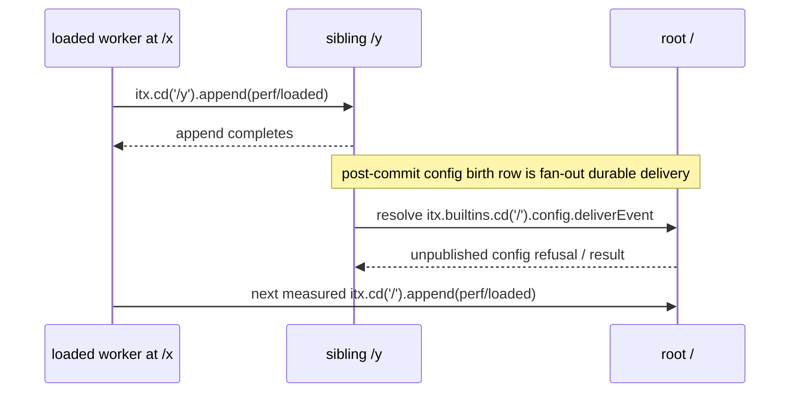

# `context.append.cross` investigation — `0739e06e`

## Result

The observed miss is concentrated in the root path; causality remains unproven. The failing metric combines two different paths in one 40-sample distribution:

| path in `contexts.perf.test.ts`                   |   samples | observed shape in `0739`                                   |
| ------------------------------------------------- | --------: | ---------------------------------------------------------- |
| loaded worker in `/x` appends to sibling `/y`     |  first 20 | 25–51 ms after the 138 ms first sample; median about 29 ms |
| loaded worker in `/x` appends to project root `/` | second 20 | 117–245 ms; median about 123 ms                            |

The merged median is therefore 117 ms and exceeds the 100 ms budget. `context.append.loaded` (same context) is 21 ms p50, and the concurrent sibling row is 257.7 events/s against a 50 events/s floor. The same root-half pattern is consistent with the earlier immutable `5eff1bf` run: its merged cross p50 was 108 ms, while loaded and x10 rows passed. The pinned-main preview baseline `0w6h6gfg31` is still running, so there is no completed e9 performance artifact yet; so source comparison alone cannot establish that this branch caused the regression.

The exact split is source-defined, not inferred: [`apps/os/perf/contexts.perf.test.ts`](https://github.com/iterate/iterate/blob/0739e06e8e01766b50015e2bc0b72d75acb50b6c/apps/os/perf/contexts.perf.test.ts) records `sibling.ms` followed by `up.ms` as `context.append.cross`.

## Actual path

A sample is not just one append:

Every project context is born with the `config` fan-out row in [`apps/os/src/project/context-birth-events.ts`](https://github.com/iterate/iterate/blob/0739e06e8e01766b50015e2bc0b72d75acb50b6c/apps/os/src/project/context-birth-events.ts): its target is `itx.builtins.cd('/').config.deliverEvent`, its delivery is `durable`, and it has `ordered: false`. `freshCtx()` creates a bare project, not a published config project. The birth-row comment says that an unpublished config passes events over, but reaching that conclusion still resolves the root target.

On every non-alarm commit, [`IterateContextDurableObject`'s `Stream.onCommit`](https://github.com/iterate/iterate/blob/0739e06e8e01766b50015e2bc0b72d75acb50b6c/apps/os/src/iterate-context-durable-object.ts) calls `#pushDurableSubscriptionDelivery(events)`. The current `DurableSubscriptionDelivery` turns a fan-out row into a `DurableDeliveryProcessor`, schedules its drain in `ctx.waitUntil`, and the drain calls the context's `#deliverConfiguredSubscription`. That method resolves the configured target before it recognizes the unpublished-config refusal. For a child context, `cd('/')` is a root DO hop. The local `catch` then intentionally treats an `unpublishedConfig` `NO_ITX_EXPRESSION_MATCH` as success for that event.

This makes the following explanation plausible and specific:

1. The 20 sibling appends complete quickly because delivery is post-commit/background work.
2. Those commits also initiate root-target resolution for the birth `config` row.
3. The immediately following 20 root appends share the root actor with those background resolution calls, producing the sustained 117–128 ms band.

The run log has no per-call trace, so this is a source-grounded hypothesis, not a demonstrated queue measurement. It does explain all three otherwise odd observations: sibling is fast, root is slow only after sibling, and x10 to `/y` remains healthy.

## Comparison with `e9f059e8`

`e9` has the same essential product behavior: every project context has a `config` fan-out birth row with the same root target, and its old `SubscriptionDelivery.onCommit` also schedules fan-out work outside the append response. It explicitly treats unpublished config as “passed over.” It therefore contains the same root-hop opportunity.

The branch replaced the old `SubscriptionDelivery` implementation (about 1,428 deleted lines) with `DurableSubscriptionDelivery` plus the SDK `DurableDeliveryProcessor` (about 927 added lines in the relevant files). The current runner differs in two relevant scheduling details:

- it starts drains through `ctx.waitUntil` after `setTimeout(..., 0)`;
- it admits fan-out calls in waves of up to eight, then resolves each configured target before the unpublished-config fast exit.

Those changes can alter overlap and root contention, but neither source comparison nor the two candidate runs proves that they caused the 100 ms breach. In particular, an e9 run is required before attributing the failure to the proof-of-concept.

## Nearest safe investigation/fix

Do not raise the merged budget or remove the config birth row. The direct, behavior-preserving cut to validate is to avoid a remote `cd('/')` resolution when the config birth subscription is known to be unpublished. The existing resolver already labels that case `unpublishedConfig`; the missing question is whether it can answer that before routing to `/`.

The smallest safe implementation shape would be an early, local unpublished-config check for the fixed `itx.builtins.cd('/').config.deliverEvent` birth target. It must retain these constraints:

- it only skips delivery while no config publication exists;
- a publication still wakes delivery from the publication commit, so prior events are not replayed;
- arbitrary user durable targets continue through normal resolution and jail/caller checks;
- no new subscription kind, state store, or retry rule is introduced.

Before making that change, split the performance recording into `context.append.sibling` and `context.append.root` while retaining the existing combined row. That makes the contract observable without hiding the breach. A single traced A/B run which records root delivery attempts during the sibling phase would confirm or falsify the queue hypothesis; the available artifacts cannot.

## Evidence

- `latency-0739-07825jfms0.log`: candidate `0739e06e`, all performance rows except merged cross pass; its 40 cross samples have the split above.
- `latency-0739-metrics.json`: cross p50 117 ms, p95 138 ms, max 245 ms; loaded p50 21 ms; x10 257.7 events/s.
- `latency-5eff-metrics.json`: earlier candidate cross p50 108 ms, p95 126 ms, max 137 ms; loaded and x10 pass.
- Pinned baseline inspected: `e9f059e8cfd1b35185a4b005489c26720fba02ea`; no baseline timing artifact was supplied.
