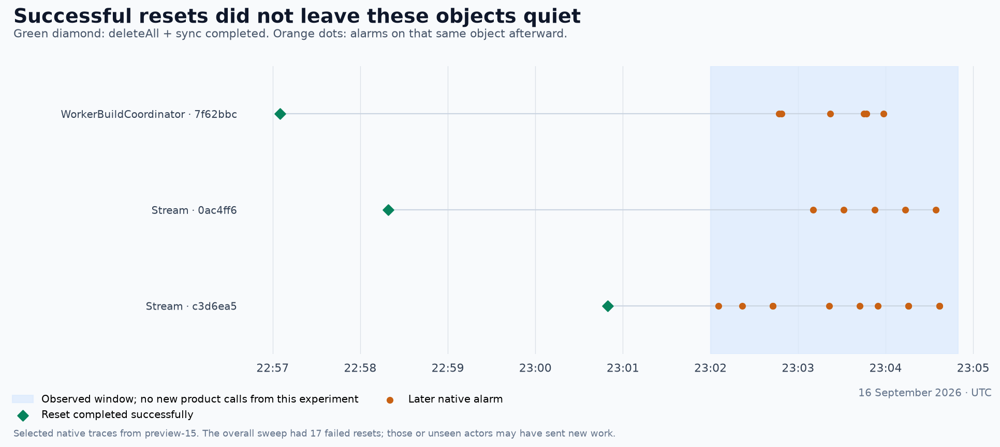

# Preview storage cleanup experiment

Status: experiment complete. **Do not adopt the current inventory-and-wipe
implementation.** It can miss active objects, and successfully wiped objects
can receive more work. The primitive remains useful for known objects; this
experiment does not show that all storage-based cleanup is impossible.

PR #2693 tested `deleteAll()`, `sync()` and abort instead of replacing the
Worker. Automatic opt-in is now removed; normal CI uses the existing full
erase. The diagnostic implementation remains for review and explicit trials.

The question is whether old test compute stops cheaply **and** new tests can use
the same deployment. Completely deleting inert data is a separate question.

## What is being tested

- Inventory the OS and streams-example namespaces through Cloudflare REST.
- Stop disposable containers, then wipe scheduler/stateful/domain objects and
  finally streams. Delete known hosted facets before their parent is wiped.
- Fail when an attempted reset fails. Save each object result and deployment ID;
  inventory completeness needs independent evidence.
- Inspect the inventory again without calling the objects. Observe native
  invocations and reported duration through GraphQL after ingestion settles.
- Create fresh work against the same deployment, then clean that up too.
- Push during prepare, tests and cleanup to exercise the existing cancellation
  and next-run recovery behavior.

## Evidence

| Case                                                             | Result                                                                                                          | What it establishes                                                                                                                                                             |
| ---------------------------------------------------------------- | --------------------------------------------------------------------------------------------------------------- | ------------------------------------------------------------------------------------------------------------------------------------------------------------------------------- |
| Original cleanup, run `v11zj80d0s`, task-only commit `1367f9dad` | Full erase 69.0s; command wrapper 71.2s                                                                         | Baseline cleanup latency; nine OS classes and the streams class retired                                                                                                         |
| Baseline tests                                                   | Six browser shards green; app suite red on the existing abandoned-project expected-failure test's setup timeout | The baseline is not a clean whole-suite comparison                                                                                                                              |
| Baseline post-erase inventory                                    | Six sandbox namespaces remain; 242 SandboxLite and 161 SandboxBasic objects still report stored data            | Full erase already retains some container-host storage                                                                                                                          |
| Real workerd/Miniflare probes                                    | Six pass                                                                                                        | SQL/KV/alarm/memory wipe, cold inventory-ID lookup, version mismatch rejection, in-flight request abort, known facet storage deletion, running-alarm reset and later recreation |
| Whole repository checks                                          | Typecheck, tests, lint, knip, formatting pass                                                                   | No detected local regression before the first live run                                                                                                                          |
| First storage run `5fj6v8h8hk`, commit `5a6ce661d`               | OS deploy blocked: SHA-pinned packages were unpublished while the PR conflicted with main                       | Not evidence about storage cleanup; fixed by merging main                                                                                                                       |
| Normal run `t1vb9scrlp`, commit `98f89966e`                      | All test consumers passed; 403/403 attempted resets passed in 61.6s (65.1s wrapper)                             | Same deployment survived the sweep, but discovery omitted new objects                                                                                                           |

## First live finding: discovery misses active objects

The normal run deployed OS version `2c6c84e7-f30a-4c69-955a-11233c932ef9`.
The native Worker tail observed a successful Stream append at 22:40:12.927 UTC.
The REST object inventory still omitted that exact object during the
22:44:06–22:44:25 capture, then listed it during 22:46:25–22:46:51.
Re-reading namespace IDs confirmed they were unchanged. This proves a delay
in this trial, not a fixed delay or a platform consistency guarantee.

Across the tests, the tail observed at least 1,045 distinct non-container DOs:
872 Streams, 85 Projects, 28 Repos, 24 Secrets, seven Schedulers, 24 build
coordinators, one Device, three Workspaces and one StatefulWorker. None were
in the cleanup inventory. Tail sampling means this is a lower bound.

The sweep ran from 22:42:47.958 to 22:43:49.532 UTC and reset only the 403
historic sandbox objects. The next REST inventory, around 22:44:06, finally
listed 224 non-container objects with stored data. Cloudflare's discovery
index is delayed enough to miss objects created and used within an entire
short test run. A successful per-object reset cannot compensate for an
incomplete inventory.

The REST response also still marked many successfully reset sandbox objects
as having stored data. That could be delayed index propagation or new writes
after reset; these observations do not distinguish them. The flag alone does
not establish current activity. Native invocations and delayed GraphQL
activity are the separate checks below.

## Reuse probe

At 22:47:24 UTC, a new project created after the partial sandbox sweep executed a
five-second recurring schedule and appended a heartbeat event. The Worker
version remained `2c6c84e7-f30a-4c69-955a-11233c932ef9`, unchanged since the
normal test deployment. This is stronger than a health check: fresh product
work can run without redeployment after that partial sweep. Reuse after
clearing all inventoried OS objects remains unproven.

`scripts/preview/cleanup-probe.ts seed-heartbeat` creates this controlled work.
It intentionally releases client handles without cancelling the schedule, so
cleanup has actual recurring work to stop. The active scheduler was then
reset directly by its known ID at 22:48:40, and its source stream at 22:49:46.
Before reset, the native trace recorded 14 successful scheduler alarms and
41 source-stream alarms. After the scheduler reset, it recorded one cancelled
scheduler alarm and one remaining stream alarm. After both resets there were
no observed invocations on either ID for 124 seconds, while unrelated trace
traffic continued. A GraphQL query at 23:21:52 corroborated this: the last
scheduler rows were at 22:48:40, and the last source-stream rows were its reset
at 22:49:46. Neither had later activity rows through 22:51:50. This establishes
a quiet observation window, not permanent retirement.

This supports wiping a known dependency set. It does not establish complete
project cleanup or make an incomplete inventory safe.

## Discovery and cancellation timeline

| Time (UTC) | Observation                                                                                                                                                            |
| ---------- | ---------------------------------------------------------------------------------------------------------------------------------------------------------------------- |
| 22:42:29   | REST still lists only the 403 old sandbox objects, while the new test objects are actively used.                                                                       |
| 22:43:49   | Normal cleanup succeeds after resetting those 403 objects.                                                                                                             |
| 22:44:25   | REST now lists 224 non-container objects missed by the sweep.                                                                                                          |
| 22:46:51   | REST lists 2,400 objects, including 1,997 non-container objects.                                                                                                       |
| 22:52:43   | The next prepare job inventories 6,329 objects in the same namespaces.                                                                                                 |
| 22:53:06   | Push `e474dafb8` interrupts that active pre-deploy wipe (run `340pfs6rxw`, workflow `ddx7qrf5pn`). All old jobs cancel; no complete per-object result file is written. |
| 22:54:27   | Replacement run `7zzc4tr2fv`, workflow `8jp447qqgm`, inventories 6,339 objects and begins recovery.                                                                    |

No complete existing registry can replace REST discovery cheaply. The
project directory is a capped KV listing and omits some impersonated test
projects. Stream lists are asynchronous projections. Stateful-worker keys,
build hashes and global stream paths have no exhaustive list. Building an
accurate run-owned registry would be a separate architecture change.

During the untouched 22:43:50–22:46:50 observation window, the native trace
recorded 80 invocations on six IDs, including 37 alarms. Stream alarms
continued through 22:46:44. These are active leftovers, not just retained bytes.

## Larger sweep and activity after successful resets

The replacement prepare job tried all 6,339 inventoried objects in preview-15.
It took 457.9 seconds internally (7m38s), with 6,322 successful responses and
17 failures: 14 HTTP 500 responses and three request timeouts. Eleven were
Schedulers and six were Streams (four OS, two streams-example). There were ten concurrent requests per class; more concurrency could
reduce elapsed time, but cannot establish discovery or quiescence.

The preview acquisition loop did **not** stop the whole workflow. It released
preview-15 and bootstrapped preview-16, where readiness passed at 23:05:26.
That is fresh-slot recovery, not successful storage-only recovery on the
original deployment. Preview-15 was reserved separately for read-only
observations so another run would not erase its evidence.

Between 23:02:00 and 23:04:49, with no new product calls from the experiment,
the original slot's native trace recorded 256 DO invocations on 21 IDs whose
resets had returned success. This included 97 native alarms. None of those
observed IDs were among the 17 failed resets or absent from the inventory.

Three examples with captured reset-completion timestamps, from the 21 affected
IDs. [Selected event data](preview-do-storage-cleanup-evidence.json) includes
the timestamps and sampling limits.

This proves successful individual wipes did not leave those objects quiet.
Failed or unseen actors may have sent them new work; the data does not show
that a perfectly complete simultaneous wipe would resume. Cold constructors,
ancestor announcements and late deliveries are concrete reasons a per-object
sweep needs more than deletion to establish that old work has stopped.

The next push, at 23:06:24, interrupted actual Playwright/app execution on
preview-16. Replacement run `4bgd89g8qg` / workflow `0z958pn7qw` passed
all seven test consumers and began its post-test wipe at 23:13:47. It inventoried
4,876 objects. Push `8bac0d467` at 23:16:49 interrupted that wipe; Depot
cancelled the finish job at 23:16:57. Thirteen completed class groups had
reported 1,638 successful resets. The interrupted sweep has no complete result
manifest, so that is a lower bound, not its final outcome.

The replacement, run `321b5c1lr0` / workflow `lvrsxt4bsj`, has automatic storage
reset disabled. Its normal full erase on the same preview-16 slot succeeded in
16.4 seconds before redeployment. This is recovery by the existing backstop,
not a successful storage-only retry. All six browser shards passed. The app
suite failed in `userspace-facet-source-version.e2e.test.ts` with a 98.5-second
stream-wait timeout, outside its allowed `SAME-BOOT STALENESS` failure pattern.
That is a recorded test failure, not evidence that cleanup succeeded merely
because the workflow recovered. The normal post-test erase still completed in
17.3 seconds. No test was weakened or quarantined for this experiment.

## Why an orphan is not necessarily harmless

**A successful reset is not permanent retirement.** A late named request can
recreate an object. More subtly, waking a cold Stream for cleanup can append
child announcements to ancestors that were already wiped. Ten concurrent
resets and one initial inventory do not establish that no state remains.

**Deleting a name has consequences.** Cloudflare's inventory supplies opaque
IDs, not the names used by our constructors. The experiment persists the name
so a cold ID-addressed object can initialize. Wiping removes it again. An
ID-only retry or delayed native alarm may then fail during construction before
its handler gets to see that pending work is absent. The local alarm probe
reads by name afterward, so it does not prove a truly untouched orphan stays
quiet; native telemetry must address that.

**Facet coverage is partial.** We delete facets from current stream
subscriptions and the stateful worker's `target`. Removed or relocated
subscriptions may leave old facet storage that the current catalog cannot
list. Retained inert storage alone would not invalidate the cost result, but
we must not describe it as a complete storage wipe.

**Container callbacks can arrive later.** Stopping a container can append
lifecycle events to streams. The sweep orders containers first, but delayed
callbacks require observation after the sweep, too.

**Auth and artifact data remain.** This experiment retains Auth D1/KV, artifact
repositories and the application configuration. It therefore needs eventual
garbage collection and a separate slot-handover policy before general use.

## Reported activity after the first sweep

For the untouched 22:43:50–22:46:50 window, a query made 30 minutes later
returned **113.61 active-time-equivalent DO-hours** and **52,351.88 GB-seconds**.
These are reported sums, not a verified bill or physical concurrency estimate.
A repeat five minutes later returned the same totals. The query shortly after
the window returned 77.31 hours: ingestion delay was material. [Saved summary](preview-do-storage-cleanup-evidence.json)
records the exact source window and capture time.

A separate server-side query across the 16 namespace IDs returned the same
totals, so client grouping did not inflate them. Those totals cover 7,143
underlying periodic records. Native telemetry independently shows old alarms
continuing after the sweep. There is no sound whole-fleet cost ratio against the baseline, whose
retired namespaces disappeared before all metrics arrived.

## Reading the metrics

`cleanup-metrics.ts snapshot` saves namespace identity. `inventory` lists
objects over REST without waking them. `capture` records raw per-object native
invocations and periodic activity for an explicit UTC window.

- `activeTime` is microseconds; DO-hours = sum / 3,600,000,000.
- `duration` is already GB-seconds. Do not multiply by memory again.
- Returned sums already account for sampling. Do not multiply by sampleInterval.
- Invocation wall times can overlap; summing them is not billed duration.
- Periodic groups can contain multiple records for one object ID and minute.
  For example, one Stream group contains six records totalling 360 active
  seconds. Facets inherit the parent ID and may explain this aggregation, but
  the public docs do not establish invoice-level interpretation. Report raw
  returned GB-seconds and active-time equivalents; do not infer physical
  concurrency or a dollar saving from these rows.
- Reporting periods can cross experiment boundaries. A narrow query's totals
  are not necessarily all incremental activity after cleanup.
- Query a finished window again after 30–60 minutes. Empty recent data does not
  prove quietness.
- Retiring a namespace removes historical analytics. In this baseline only
  retained sandbox rows arrived before the other namespaces disappeared:
  0.027298755 observed DO-hours / 12.579266304 GB-seconds. That is **not** a
  complete baseline and must not be extrapolated to the whole fleet.

Raw local evidence is also retained at `/tmp/preview-do-storage-experiment/`.
The checked-in JSON contains the selected observations and exact timestamps
needed to assess the conclusions without those temporary files.

The branch subsequently merged `a9f5eddef6` from main. This includes #2680,
which defers artifact deletion during normal preview runs. The original 69s
baseline therefore includes work current main no longer does; it is not a
controlled comparison for the final branch.

Primary references: [storage deletion](https://developers.cloudflare.com/durable-objects/api/sqlite-storage-api/#deleteall),
[alarm behavior](https://developers.cloudflare.com/durable-objects/api/alarms/),
[object inventory](https://developers.cloudflare.com/api/resources/durable_objects/subresources/namespaces/subresources/objects/),
[facet identity](https://developers.cloudflare.com/dynamic-workers/usage/durable-object-facets/),
and [metrics and ingestion](https://developers.cloudflare.com/durable-objects/observability/metrics-and-analytics/).

## Recommendation

Keep normal class retirement for fleet cleanup. `deleteAll()` is useful when
we already know the objects and can prevent their producers from sending more
work; it is not a drop-in replacement for retiring a preview's classes.

To pursue this per-object sweep, we would need:

- **Coverage of old compute:** a reliable way to find or disable all resources
  that can keep producing work. A run-owned registry is one option; the delayed
  REST inventory is insufficient. We do not need to enumerate every inert byte.
- **A way to stop old work:** reject late requests from retired runs and stop
  producers before clearing their data. An empty datastore does not tell a
  cold constructor that the old run is permanently finished.

That is product lifecycle work, beyond the small experiment requested here.
Increasing wipe concurrency, waiting a little longer for inventory, or keeping
retrying failed objects does not establish either guarantee. Do not add those
as patches merely to make this trial green.

The change-type planner can still safely inherit completed CI results for docs
and fall back to deployment for tests. It must not assume a historical preview
record means a usable backend survived cleanup.

## Validation and final resource state

All checks on `98f89966e` passed, including the full preview suite, repository
tests, lint/typecheck and formatting. Six real Miniflare probes and 146 preview
orchestration/cleanup tests passed locally. The later probe version check also
passed scripts typechecking and lint. Final changes are the report, evidence,
and removal of automatic storage-reset opt-in. Current-head check results are
visible on [PR #2693](https://github.com/iterate/iterate/pull/2693).

Preview-15's observation lease was fully reclaimed after the delayed metrics
were saved: normal class retirement, Auth cleanup and artifact repository
cleanup completed in 69.8 seconds, and the lease returned to the pool. File
objects and sandbox backups retain the existing three-hour R2 expiry policy.
The native-tail sessions and delayed collectors were stopped. Preview-16's
normal post-test erase completed; its PR lease is retained through final CI,
then released separately. No unrelated preview slot or production data was used.

| Run                                                                                                                | Purpose                                         | Outcome                                                                      |
| ------------------------------------------------------------------------------------------------------------------ | ----------------------------------------------- | ---------------------------------------------------------------------------- |
| [A: normal storage wipe](https://depot.dev/orgs/0p91s0lz49/workflows/6l42brbtj1?repo=iterate%2Fiterate)            | Complete tests then wipe                        | Green, but missed fresh objects                                              |
| [B: prepare interruption](https://depot.dev/orgs/0p91s0lz49/workflows/ddx7qrf5pn?repo=iterate%2Fiterate)           | Push during pre-deploy wipe                     | Cancelled intentionally                                                      |
| [C: recovery and test interruption](https://depot.dev/orgs/0p91s0lz49/workflows/8jp447qqgm?repo=iterate%2Fiterate) | Retry interrupted sweep, then push during tests | Sweep failed; moved to preview-16; cancelled intentionally                   |
| [D: post-test interruption](https://depot.dev/orgs/0p91s0lz49/workflows/0z958pn7qw?repo=iterate%2Fiterate)         | Push during cleanup after tests passed          | Cancelled intentionally after at least 1,638 resets                          |
| [E: normal recovery](https://depot.dev/orgs/0p91s0lz49/workflows/lvrsxt4bsj?repo=iterate%2Fiterate)                | Full erase after interrupted wipe               | Erase/deploy/browser checks passed; one app test timeout; final erase passed |
