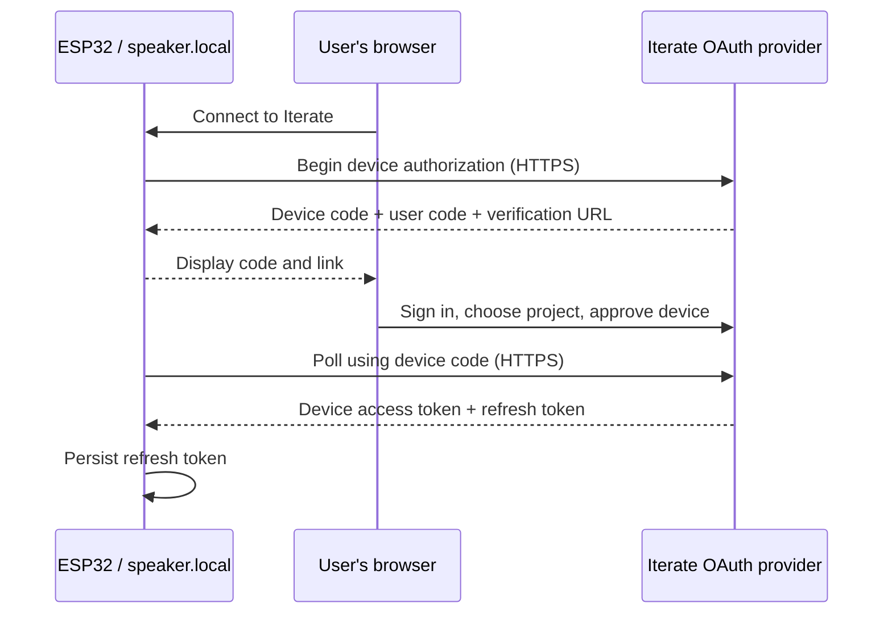

# Kitterate devices in the same OAuth system

Research date: 2026-09-10. Extends the
[console, MCP, and project-app research](clean-room-oauth-unification-research.md).
This is source/standards research, not a firmware or deployment proof.

## Answer and recommended shape

**Yes. Each physical device can have its own revocable OAuth grant and rotating refresh
token from the same Iterate authorization server.** The two setup experiences can converge
on the same credential and firmware implementation, using different initial OAuth flows:

| Setup experience                         | Recommended authorization                                                                                                                         |
| ---------------------------------------- | ------------------------------------------------------------------------------------------------------------------------------------------------- |
| Authorize at `k.iterate.com`, then flash | Authorization Code + PKCE for a dedicated public device-client grant; the installer writes that device's refresh token into private configuration |
| Click Login on `http://speaker.local`    | OAuth Device Authorization, RFC 8628: approve on Iterate's HTTPS website; the ESP32 obtains its tokens by polling Iterate                         |
| Alternative after USB installation       | Install firmware/Wi-Fi first, then let the running device perform the same Device Authorization flow                                              |

The first path can use the released provider's existing OAuth code/refresh machinery.
The local-device path requires adding Device Authorization: **it is not implemented in
the clean room's pinned `@cloudflare/workers-oauth-provider` 0.10.3 or current upstream
main**. Its old proposed implementation was closed without merging. Devices do not need
to implement MCP or host an OAuth provider themselves.
([Released grant types](https://github.com/cloudflare/workers-oauth-provider/blob/v0.10.3/src/oauth-provider.ts#L99-L110),
[device grant proposal](https://github.com/cloudflare/workers-oauth-provider/pull/194),
[RFC 8628](https://www.rfc-editor.org/rfc/rfc8628.html#section-1).)

## What Kit has today

The app is `apps/kit`, served at `k.iterate.com`. Its installer already generates a
private configuration binary in browser memory and adds it to an ESP Web Tools manifest
at a reserved flash offset. The current schema contains Wi-Fi SSID/password, Iterate
base URL, project slug, and a manually pasted **project API key**. The image is raw JSON
with a magic value, length, and CRC; the CRC supplies corruption detection, not secrecy.
([Kit README](../apps/kit/README.md),
[configuration image](../apps/kit/src/firmware/config-image.ts),
[manifest preparation](../apps/kit/src/firmware/prepare-manifest.ts).)

The catalog names Home Assistant Voice Preview Edition and StackChan, both ESP32-S3,
but intentionally has **no firmware releases**. Stock firmware does not understand
Iterate credentials. OAuth therefore needs an Iterate-aware firmware component/build,
not just a replacement field in the installer.
([Catalog](../apps/kit/src/firmware/catalog.ts).)

ESP Web Tools can flash arbitrary manifest parts at their declared offsets and requires
a secure browser context plus Web Serial. This supplies the bytes-to-device transport;
it does not implement OAuth or refresh-token storage. I inspected upstream at
`f9d1c4e4055006b9b23ae9d3c9bb6446b7835338`.
([Manifest types](https://github.com/esphome/esp-web-tools/blob/f9d1c4e4055006b9b23ae9d3c9bb6446b7835338/src/const.ts),
[flashing](https://github.com/esphome/esp-web-tools/blob/f9d1c4e4055006b9b23ae9d3c9bb6446b7835338/src/flash.ts),
[browser requirements](https://github.com/esphome/esp-web-tools/blob/f9d1c4e4055006b9b23ae9d3c9bb6446b7835338/src/install-button.ts#L5-L8).)

## Before flashing: a device grant obtained through the browser

Proposed flow using the released provider:

1. The user selects a project and names the device at Kit. Establish a provisioning
   transaction identifying the device and its allowed authority.
2. Kit drives Authorization Code + S256 PKCE **for the public device client**, with an
   exact registered HTTPS callback at `k.iterate.com`. Consent clearly authorizes that
   device, and stores its identity/project in the resulting grant metadata and props.
3. The provisioning component exchanges the code and obtains the device grant's access
   and refresh tokens. Its own operator/browser session is separate.
4. Generate a private per-install configuration image containing the device's issuer,
   client ID, resource, project/device identity, and refresh token, alongside Wi-Fi data.
   Flash it to exactly one board.
5. On boot, firmware imports the refresh token into durable writable credential storage
   and obtains an access token from the normal token endpoint. The browser relinquishes
   its provisioning copy; it must not continue refreshing the device's grant.

This is an application-specific provisioning handoff around ordinary OAuth issuance.
OAuth does not itself attest that bytes reached a particular physical board. Associate
the installation with a device identifier and verify a successful first connection;
failed/cancelled installations need a way to revoke their unused grant. Do not reuse a
credential-bearing image to flash several boards.

The distinction is essential: **do not flash the console's or Kit's own refresh token**.
A token issued to a confidential Kit backend remains tied to that client and its secret;
the device cannot properly refresh it using another client ID. Create a separate device
grant using a public client (`tokenEndpointAuthMethod: "none"`), for which code exchange
uses PKCE and later refresh uses the client ID plus refresh token. The provider already
supports that registration and validates the refresh grant's client ID.
([Client creation](https://github.com/cloudflare/workers-oauth-provider/blob/v0.10.3/src/oauth-provider.ts#L5479-L5540),
[refresh client binding](https://github.com/cloudflare/workers-oauth-provider/blob/v0.10.3/src/oauth-provider.ts#L2699-L2736).)

Either provision a client record for each board through trusted platform code, or share
a public client registration for the firmware family and issue distinct grants with
device metadata. The latter needs `revokeExistingGrants: false` for simultaneous devices;
the default code-flow replacement would otherwise disconnect older grants for the same
user/client. A client ID is public software identification, not a hardware secret.
([Grant replacement](https://github.com/cloudflare/workers-oauth-provider/blob/v0.10.3/src/oauth-provider.ts#L5296-L5317),
[public device clients](https://www.rfc-editor.org/rfc/rfc8628.html#section-5.6).)

## Local Bonjour UI: approve in the cloud, poll from the device

The ESP32's Login button starts a Device Authorization request over HTTPS. The device
retains a secret `device_code`; its local page displays the user code and links to the
cloud verification URL. The user signs in and approves the named device/project at
Iterate. The ESP32 polls the cloud token endpoint and receives its own access/refresh
tokens. No authorization response or refresh token needs to pass through `.local`.
([RFC 8628 protocol](https://www.rfc-editor.org/rfc/rfc8628.html#section-3).)

Do not use `http://speaker.local/callback` as the normal code-flow redirect. The native
app HTTP exception is for loopback on the browser's own computer (`127.0.0.1` / `[::1]`),
not an ESP32 elsewhere on the LAN. Modern OAuth requires encrypted authorization
responses outside that exception. A separately engineered trusted HTTPS callback is
possible, but Device Authorization avoids its certificate/registration requirements.
([RFC 8252 §7.3](https://www.rfc-editor.org/rfc/rfc8252.html#section-7.3),
[RFC 9700 §4.13.2](https://www.rfc-editor.org/rfc/rfc9700.html#section-4.13.2).)

Start pairing on user action. Honor the polling interval, slow down when instructed,
and stop on denial/expiry; transient network failures use bounded backoff. Pending
authorization is an expected state, not an operational error. Keep `device_code` and
tokens out of local HTML/logs; the public-facing user code/verification URL is the
intended handoff. This pairs the **device with Iterate**; it does not automatically
establish access control for every visitor to the device's local web UI.

For USB setup, running Device Authorization after flashing is an attractive later option:
the device receives its refresh token directly. Improv can provision Wi-Fi and return a
next URL, including a local page that begins pairing. It does not define a general OAuth
credential-upload command. A browser-created device code flashed before first boot is
another possible provisioning adaptation, but its short expiry couples authorization to
flash duration and Wi-Fi success. Do not present it as a persistent offline credential.
([Improv serial protocol](https://www.improv-wifi.com/serial/),
[ESPHome Improv integration](https://github.com/esphome/esphome/blob/66f829c760358a291a9a97d90f9b981d8ac6a6ec/esphome/components/improv_serial/improv_serial_component.cpp).)

## Provider extension: what is missing

Upstream [PR #194](https://github.com/cloudflare/workers-oauth-provider/pull/194) was closed
on 2026-07-29 **without merging**; [issue #192](https://github.com/cloudflare/workers-oauth-provider/issues/192)
was closed the following day. I inspected proposal head
`84fe0746ea85c274f183c2e5e8435e1d4d7e4885`. It is an old implementation reference, not an
option available in 0.10.3.

It proposed device authorization/verification endpoints, expiring device/user codes,
polling at the token endpoint, and approve/deny helpers. Approved requests created normal
provider grants and access/refresh tokens, which is the right reuse boundary. However,
approval accepted only user code/user ID, saved empty grant metadata and props containing
only client ID, and bypassed the ordinary initial code-exchange callback. It also
predates current audience policy. It cannot be adopted unchanged for named, scoped,
project-bound devices.
([Historical proposed source](https://github.com/cloudflare/workers-oauth-provider/blob/84fe0746ea85c274f183c2e5e8435e1d4d7e4885/src/oauth-provider.ts).)

A current extension should supply:

- Device authorization endpoint and discovery metadata; a token-endpoint device grant.
- Short-lived pending requests binding client, requested resource/scope, and provisioning
  identity; rate-limited user-code verification, polling controls, and safe one-time redemption.
- An application-owned login/approval page, using the same identity session as MCP.
- Approval hooks that accept normal user ID, metadata, authorization props, granted scope,
  and device lifetime policy, then issue **ordinary provider grants and tokens**.
- Current audience validation, independent device grants, and integration with existing
  listing/revocation/refresh APIs. Durable pending state must handle concurrent polling
  and redemption coherently; KV read/modify/write is not an atomic claim operation.

Implementing this inside/upstream of the provider is preferable to manually writing its
private `OAUTH_KV` records. The public `completeAuthorization()` helper is for the
authorization-code/implicit flows; it is not a general-purpose device-token mint API.
([Public helper contract](https://github.com/cloudflare/workers-oauth-provider/blob/v0.10.3/src/oauth-provider.ts#L597-L688).)

## Refreshable does not mean indefinitely renewable

Source inspection found a consequential default: **one-hour access tokens and an absolute
30-day refresh-grant lifetime**. `expiresAt` is set during the initial code exchange;
rotation preserves it. A healthy device will still need authorization again after that
deadline. A refresh callback cannot extend it.
([Initial expiry](https://github.com/cloudflare/workers-oauth-provider/blob/v0.10.3/src/oauth-provider.ts#L2621-L2654),
[refresh policy](https://github.com/cloudflare/workers-oauth-provider/blob/v0.10.3/src/oauth-provider.ts#L2829-L2835).)

For unattended devices, explicitly choose a long finite lifetime or a revocable grant
without absolute expiry. The existing option supports **explicit**
`refreshTokenTTL: undefined` for no expiry; simply omitting the option retains the default.
The initial code-exchange callback can select that policy per device grant without
changing browser/MCP defaults. Any new device-grant implementation must expose the same
policy deliberately. Inactivity expiry would require additional policy/state; it is not
the behavior of this option.
([TTL options](https://github.com/cloudflare/workers-oauth-provider/blob/v0.10.3/src/oauth-provider.ts#L393-L407),
[per-grant override](https://github.com/cloudflare/workers-oauth-provider/blob/v0.10.3/src/oauth-provider.ts#L2589-L2592).)

Keep a separate grant and device identity for each board. Record the authorizing human
and selected project, and attribute device actions to the device rather than silently
pretending the human is currently present. Product policy must decide whether removing
that human from the project also revokes their device grants, or whether an explicitly
project-owned device survives with a new owner. The provider does not decide ownership
or enforce device capability scopes. Its user grant list can display device metadata;
project-wide device inventory needs our directory/registry association.

## Firmware work and acceptance proof

ESPHome has HTTPS requests with headers/body/response capture, mDNS, local web UI, and
persistent preferences. I found no built-in OAuth client in its components at audited
`dev` commit `66f829c760358a291a9a97d90f9b981d8ac6a6ec`. An Iterate external component
can reuse those facilities while owning pairing, refresh, and platform communication.
([HTTP client source](https://github.com/esphome/esphome/blob/66f829c760358a291a9a97d90f9b981d8ac6a6ec/esphome/components/http_request/http_request_idf.cpp),
[HTTP configuration](https://esphome.io/components/http_request/),
[external components](https://esphome.io/components/external_components/).)

The essential firmware responsibilities are:

- Verify cloud TLS certificates, parse bounded token responses, and keep issuer/resource
  identity fixed. Treat tokens as opaque; no JWT implementation is required.
- Refresh before access expiry, serialize refreshes, and persist each replacement
  refresh token before allowing another refresh to invalidate the recoverable old value.
- Use a durable credential record with explicit write-result handling and power-loss
  recovery. ESPHome preferences `save()` queues writes; its default flush interval is
  60 seconds. Merely assigning a restoring global is insufficient acknowledgement.
- Import provisioning data once, then use the current writable credential record on
  later boots. Do not reload the original flashed refresh token after it has rotated.
  Preserve credentials across ordinary OTA; reset/unpair clears them and revokes when online.
- Implement the intended Iterate API transport. OAuth does not make stock ESPHome's
  Home Assistant protocol into an Iterate client. A small device HTTP surface is an
  option; it must apply the same audience and capability checks described in the parent report.

Sources for persistence: [ESPHome preferences](https://github.com/esphome/esphome/blob/66f829c760358a291a9a97d90f9b981d8ac6a6ec/esphome/components/esp32/preferences.cpp#L72-L88),
[flush configuration](https://esphome.io/components/preferences/),
[Espressif NVS](https://docs.espressif.com/projects/esp-idf/en/stable/esp32s3/api-reference/storage/nvs_flash.html).
The provider retains the last-used refresh token until a newer one is used, helping
recover a lost response, but this is not permission to skip durable firmware writes.
([Provider rotation](https://github.com/cloudflare/workers-oauth-provider/blob/v0.10.3/src/oauth-provider.ts#L2906-L2933).)

Before a release, prove both setup paths on real hardware, two independent devices in
the session list, per-device revocation, project/scope confinement, reboot and power loss
during refresh, denied/expired pairing, prolonged offline periods, OTA preservation, and
factory reset/re-pairing. Keep expected polling/network states separate from defects in
preview traces. The shortest useful first implementation is **Kit-issued dedicated device
grants + credential-aware firmware**, followed by the RFC 8628 provider extension and
local Login UI using that same firmware credential manager.
