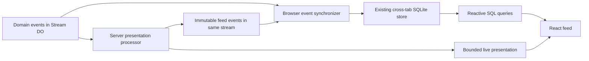

# OS without browser stream processors

Research began on 2026-09-09 against checkout `52823a370`. The inventory below
records that baseline; the implementation branches from `54e9e6946`.
Baseline source links are pinned to the researched commit.

**Confirmed implementation constraints:** Jonas will destroy the old deployment's
data. There is no backward compatibility, old-state migration, dual running, or
historical backfill requirement. Recovery and replay within the new system must
still be correct. Normal browser synchronization is **durable-only**; server live
state supplies in-progress response text, so browsers do not consume or reduce
chunk events. Raw/debug callers can explicitly request ephemeral events through
the stream API.

**Recommendation:** separate removing browser computation from replacing the
browser database. Publish presentation records as immutable stream events;
publish the bounded current presentation through live state; turn the browser
runtime into one event-copy subscriber. Keep the existing reactive SQLite
wrapper for the first cut. Evaluate TanStack DB after this boundary works.

The largest simplification comes from removing client interpretation and
processor lifecycle, independently of the local database library.

Jonas's follow-up explicitly accepts retaining the current store and its
cross-tab synchronization. **The default plan therefore retains SQLite/OPFS,
writer election, and reactive SQL.** Replacing them with TanStack DB is an
optional later decision, not part of the completion criteria for this work.



## Baseline inventory (before this change)

There are exactly **two** configured browser processors:

| Processor            | Output                                                                                 | Current readers                                                        |
| -------------------- | -------------------------------------------------------------------------------------- | ---------------------------------------------------------------------- |
| `browser-raw-events` | Append-only `events`, indexed generated fields, trigger-maintained `event_type_counts` | Raw inspection, request/script inspection, counts, pause/reply queries |
| `browser-feed`       | Mutable `feed_items`, durable `AgentUiState`, volatile streaming overlay               | Pretty/raw feed, activity tail, presence, queued messages, token usage |

Each gets a runner and a separate checkpoint. The browser downloads once,
drives both, reconciles their progress, elects a cross-tab writer, and broadcasts
volatile agent state separately. Core processor state is already read from the
server; it is not a third browser processor. [Browser configuration][config],
[runtime][runtime], [group][group], [raw-event storage][raw], [core-state parser][core].

The desired reactive behaviour already exists: `StreamBrowserDatabase.query`
exposes query handles; committed changes rerun observed queries, compare
snapshots, and notify React after applying the refreshed results together.
This is query rerunning, not incremental relational maintenance. Retaining it
avoids changing every SQL reader while removing processors. [Database][db].

There is an older [server-reads replacement proposal][old-proposal] and an
[unresolved move-versus-collapse task][old-task]. They are useful context, but
their numerical assumptions are stale: offsets now have permanent gaps from
ephemeral events, `local_index` is independent of offset, and neither the head
offset nor a feed position equals an event count. The older proposal also
removes the local mirror altogether; this proposal retains the local query
model requested here. [Current raw-event schema][raw].

## Workstream 1: make feed records actual events

“Render” should mean producing a typed presentation record, such as a message
or activity with resolved content and source references. React continues to
render components and Markdown. Persisting JSX, generated HTML, or current
component implementation details would make every styling change a data
migration.

The current pure reducer is a useful starting point, but moving its SQLite
writes verbatim would preserve substantial accidental complexity. Its mutations
are more extensive than just token streaming:

| Current mutation                                                                       | Append-only treatment                                                                                                                                  |
| -------------------------------------------------------------------------------------- | ------------------------------------------------------------------------------------------------------------------------------------------------------ |
| A raw group grows while consecutive events share a type, up to 200 events              | Prefer one raw row per original event. If grouping is essential, publish closed groups and put the open group in live state, or accept group revisions |
| Repeated adjacent pretty wake markers replace one row with a larger count              | Prefer individual debug markers initially; retaining compaction requires revisions or a live open group                                                |
| An activity with an inferred script outcome is corrected by a late durable settlement  | Publish a complete new revision of the same item, or keep the item provisional until its terminal outcome                                              |
| Mention resolution replaces a previously emitted message                               | Publish a complete revision with resolved mentions; do not delay displaying the user's message                                                         |
| Runtime becoming idle flushes activity and deferred messages through a browser overlay | Move this boundary decision to the server; durable completion must eventually produce durable feed records                                             |

These cases are explicit in the [feed planner][planner], its
[late-correction SQL lookup][feed-implementation], and the
[shared UI reducer][ui-reducer]. The lookup matters: after a bounded in-memory
correction index prunes an activity, today's processor searches SQLite to find
it again. A server implementation needs an equivalent durable lookup or a
different, explicit finalization rule; moving the bounded map alone loses
corrections.

### Immutable events do not require an unchanging visible item

The implementation publishes complete immutable **item revisions**, not patches:

```ts
{
  type: "events.iterate.com/feed/item-published",
  payload: {
    firstOffset: 120,
    ordinal: 0,
    revisionOffset: 145,
    item: { id: "activity-120", kind: "activity", /* complete renderable item */ }
  }
}
```

The enclosing stream identity supplies the lifetime. SQL selects the newest
revision by `(revisionOffset, publication event offset)` for each `item.id`,
then filters the result. Display order is the **first committed publication
offset** for that item. A correction keeps that position; a delayed first
publication appends after existing rows. `firstOffset` and `ordinal` preserve
source causality for inspection. Ordering new rows by source offset would insert
them into previously displayed history and break the virtualizer's dense cache.

The browser inserts every event unchanged. The `feed_items` SQL view selects
latest revisions with `NOT EXISTS` and an expression index on item identity and
revision. There is no imperative domain reducer or feed-table write buffer.

A small synthetic SQLite experiment verified correction selection, stable
position, and an older revision arriving later. It also showed an outer scan
and temporary ordering tree without an ordering index. This proves semantics,
not million-row performance; count, filtering, and virtualization need a
representative benchmark before choosing the final indexes/query plan.

If “immutable” instead means exactly one permanently final record per item,
that is also possible, but changes UX: unresolved mentions and inferred
activities must remain live until final, or later corrections become separate
visible items. Complete revisions are the least disruptive first step.

### Keep raw history cheap

Original stream events already are the raw rows. Do not append a second
`feed/item-published` event merely to wrap every raw event. Pretty mode selects
published items; Raw selects original events; Pretty + raw combines them using
an explicit source order and tie-break rule. React can dispatch the existing
special raw renderer by event type without a stream processor.

Exclude feed publications from the publisher's input. Otherwise a generic
“render every event” processor can recursively publish feed-of-feed events.
For debugging, Raw can explicitly include presentation events; it still must
not cause further publication. Removing raw grouping changes existing group
filters/counts and must be an intentional UI change. [Current filter model][filters].

## Workstream 2: host projection and live presentation on the server

The infrastructure already exists. `ProcessorFacet` registers path-specific
processor compositions, while each named subscription drives its own facet.
Registering a class alone does not activate it: a named facet subscription must
be installed. A general feed processor must be available for every supported
stream family, including deployment-global streams, rather than only the
`/agents/` composition. The new creation path installs the subscription. Existing deployments are
erased, so no installation/backfill path is needed. [Facet composition][facet],
[facet base][facet-base], [creation doctrine][doctrine].

Two implementation choices are reasonable:

| Choice                                                | Benefit                                                                                                                            | Remaining work                                                                                                  |
| ----------------------------------------------------- | ---------------------------------------------------------------------------------------------------------------------------------- | --------------------------------------------------------------------------------------------------------------- |
| A dedicated `feed` processor facet                    | One presentation owner for agent and other rich items; can rebuild presentation independently                                      | Install/backfill subscription; deliver authoritative agent runtime/current text to it                           |
| Begin with agent presentation inside `AgentProcessor` | Agent runtime, model chunks, settlements and presentation share an owner; avoids new sibling communication for the first agent cut | Changes agent state/contract; generic non-agent feed records still need their own publisher or later extraction |

For the requested general destination, use a dedicated feed facet. For the
smallest first implementation focused on agent chat, putting publication and
live presentation inside the existing agent processor is a sensible staging
choice. Keep the presentation logic in a plain server module so extraction
does not change the event contract. Do not run two independent durable
publishers for the same item namespace at the same time.

### Live state has plumbing, but not yet the required data

`AgentLiveState` currently contains only `runtimeChange`. The browser still
folds ephemeral response chunks, then runs `reduceAgentUiRuntime` against that
runtime change. Replacing the hook alone would remove streaming text and
activity finalization. [Agent live-state contract][agent-contract],
[browser presentation][view], [UI reducer][ui-reducer].

Publish a bounded server presentation containing current activity/text,
queued/deferred messages as needed, presence, usage totals, pause/status,
stream identity, and explicit source/publication watermarks. Keep full history
and private reducer bookkeeping out of this payload. Bound text/activity size
as well as item count.

The implementation retains at most 65,536 UTF-16 units of LLM preview text
across the current activity, prioritizing newer requests. A shortened preview
is explicitly labelled. The complete live message also has a 1,000,000-byte
serialized budget: oversized code, results, queued input or presence produce
an explicit `omitted` presentation with identity, publication cursor and
runtime intact. These limits apply only to the preview; durable reduction,
publications and completed request inspection retain recorded content.

The agent's model-call owner already receives every provider chunk and retains
partial response text. It is the simplest place to maintain a volatile current
text view and notify live state directly. The registry has `refreshLive()` for
inputs outside committed reducer state. Current chunks are explicitly ephemeral;
wildcard processor consumption excludes ephemeral events unless their types are
named. A feed-facet chunk subscriber therefore needs explicit consumption and a
volatile overlay, not an assumption that moving the durable reducer preserves
all streaming behaviour. [Model call][llm], [processor matching][processor],
[registry live-state API][registry].

Define recovery deliberately: a reconnect to a still-running owner can receive
its bounded current text snapshot. After owner eviction, vanished chunks are
not durable history; the existing request recovery/settlement path determines
the result. Rebuild committed presentation from durable facts and surface the
actual request status. Do not persist a growing response in every processor
checkpoint merely to make live state work.

### Make the live-to-history handoff explicit

Event sync and live-state patches are separately delivered even when they use
the same socket. If the server removes a live item before its durable feed
publication reaches the local store, the UI can briefly lose it; the reverse
order can duplicate it.

Live snapshots carry `streamId` and `publicationOffset`, the latest committed
feed publication. The browser requires its `stream_sync` identity to match and
its committed `through_offset` to reach that offset. A snapshot from the
previous lifetime is discarded when the mirror is replaced. The mirror's
existing generation also renews the live subscription, so a healthy transport
cannot keep watching a deleted source after recreation.
Within one lifetime, the browser retains its previous server snapshot until
the replacement's publications arrive. If the journal arrives first, an indexed item-ID query hides the
matching live activity. Both arrival orders therefore replace the live activity
with its settled row without a second client history store or any browser
reduction. The server exposes settled volatile state only after its publication
and offset exist. If that activity is already journaled while the next live
snapshot is still in transit, the server runtime's active-work counts keep a
visible progress indicator in the feed. Deduplication must not make ongoing
work appear idle.

### Deletion scope, measured at this checkout

| Code                                                                  | Current non-test lines | Treatment                                                                                       |
| --------------------------------------------------------------------- | ---------------------: | ----------------------------------------------------------------------------------------------- |
| Browser processor configuration + group                               |                    296 | Delete                                                                                          |
| Processor progress, projection buffer, processor cache reconciliation |                    676 | Replace with simple event-sync metadata; retain stream-lifetime checks                          |
| Cross-tab live-agent state channel                                    |                    230 | Delete when live state owns presentation                                                        |
| Browser raw processor contract + implementation                       |                    239 | Delete class/contract; keep necessary event schema and insert invariants                        |
| Browser feed contract + implementation + planner                      |                    840 | Remove from browser; move/simplify domain logic on server                                       |
| `stream-browser-store.ts`                                             |                  2,243 | Rewrite around replication; not 2,243 lines of guaranteed net deletion                          |
| SQLite wrapper + Worker                                               |                    735 | Keep initially; replace only if store choice justifies it                                       |
| Shared `agent-ui-reducer.ts`                                          |                  1,901 | Move browser interpretation server-side; shared mobile/TUI consumers prevent wholesale deletion |

These are file line counts, not promised savings. There is clearly thousands
of lines of processor machinery and interpretation in scope, but server
projection and the replacement subscriber add code. The shared processor
framework still powers server processors and stays.

Also migrate consumers outside the obvious feed:

- `llm-request-replay.ts` imports the agent prompt fold and reconstructs wire
  requests in the browser. Replace that with a finite server request-inspection
  read if the rule is “the browser only queries and renders”. Keep the existing
  contract-version/reconstruction distinction; moving it does not make older
  prompts byte-exact. [Request replay][request-replay].
- Activity/script/raw inspectors, filter counts, pause state and reply-presented
  claims still depend on event queries. Preserve these behaviours when changing
  schemas; reply claims use the original reply event offset, not the derived
  publication offset. [View][view], [filters][filters].
- `apps/streams-example-app` imports the browser runtime directly. Mobile and
  the TUI share the UI reducer. Update the example app alongside OS, and keep
  shared exports until other clients are deliberately migrated. [Example feed][example],
  [mobile feed][mobile], [TUI feed][tui].

## Workstream 4: choose the reactive store

An indexed **in-memory** collection and a durable **IndexedDB** database are
different choices. TanStack DB does not require IndexedDB to provide reactive
queries.

| Option                             | What it supplies                                                                              | Work Iterate still owns                                                                       | Assessment                                                                                            |
| ---------------------------------- | --------------------------------------------------------------------------------------------- | --------------------------------------------------------------------------------------------- | ----------------------------------------------------------------------------------------------------- |
| Existing SQLite + `useStreamQuery` | Persistent indexed event history, SQL, existing readers and cross-tab query notifications     | Simplified sync/cursor protocol, query indexes, existing Worker/election maintenance          | Least implementation resistance for deleting processors first                                         |
| TanStack DB                        | Typed collections, indexes, incremental live queries, React binding, custom sync transactions | Cap'n Web sync integration, replay/identity/error handling, retention policy, query migration | Strong candidate for the next UI data layer; prove latest-revision queries and deep-history behaviour |
| Dexie + `useLiveQuery`             | IndexedDB tables, transactions, observable queries and React binding                          | Same stream sync protocol; rewrites of SQL filters/joins and latest-revision selection        | Direct candidate if IndexedDB persistence is specifically desired                                     |

Sources: [existing SQLite wrapper][db], [TanStack collections/indexes][ts-collection],
[TanStack live queries][ts-queries], [Dexie liveQuery][dexie-live],
[Dexie source][dexie-source].

### TanStack DB's integration point is custom sync

Its `sync` callback receives `begin`, `write`, `commit`, and `markReady`, and
returns cleanup. This can ingest confirmed event batches from the existing
Cap'n Web subscription. Collection transactions apply a batch together;
`useLiveQuery` subscribes to the resulting query. Commands still call the
server; don't use optimistic collection mutations to manufacture authoritative
feed records. [Custom-sync guide][ts-sync], [React hook source][ts-react].

For the strict “copy events, then query” design, key the event collection by
stream lifetime and offset. TanStack documents grouping, `max`, subqueries,
and joins: a grouped maximum revision joined back to its full row is a
plausible latest-item query. That combined query, including a composite
revision and filtering/ordering, was **not executed in this research**. Verify
it before adopting TanStack DB for immutable revision history. Its documented
operations are not a measured substitute for the SQLite query above.
[Query guide][ts-queries].

An alternative is a collection of current items keyed by `itemId`, where
confirmed full-row revisions update that index. This avoids a historical
arg-max query but introduces a small mutable materialization in the browser.
It is much simpler than a stream processor, yet it is a different promise
from “only insert immutable events”; make that choice explicit.

Do not equate an in-memory collection with an affordable complete mirror of
every deep stream. Start its evaluation with a bounded working set. If loading
only recent events, fetch current item snapshots at a defined boundary: a
recent correction may refer to an old item, and a window of revision events
is not necessarily a complete page of current feed items. Partial caches also
need range/completeness metadata; a single high-water cursor cannot describe
holes created by paging or eviction. Counts/search must describe their scope.

### Persistence can replace ownership of plumbing, not its existence

The checked upstream browser persistence package is
`@tanstack/browser-db-sqlite-persistence` version `0.1.11`. It uses wa-sqlite
in OPFS through a dedicated Worker. Single-tab coordination is the default;
`BrowserCollectionCoordinator` opts into Web Locks and BroadcastChannel for
multiple tabs. It manages TanStack's persisted collection format, rather than
being a direct reactive facade over our existing `events` table.
[Persistence README][ts-persistence], [package manifest][ts-manifest].

That can still be a useful reduction in code **we maintain**. Before migration,
verify atomic persistence of events plus the replication cursor, cache schema
reset, initial readiness/error behaviour, and multi-tab recovery. A collection
`commit()` applying to memory is not by itself proof of durable cursor safety.
Do not keep both complete SQLite mirrors as the final design.

Dexie is the straightforward IndexedDB alternative, with observable indexed
queries and transactions, but its basic database/reactive APIs do not implement
Iterate's custom stream protocol. SQL-shaped relational inspection and a
revision-history query would need deliberate translation. [Dexie source][dexie-source],
[liveQuery documentation][dexie-live].

Upstream source snapshots inspected: TanStack/db
`be656be5c5fa65cc1c2bf76bc0b60be3d9d2a577`; dexie/Dexie.js
`32ad221a518a9b2375d2fed4137a4105d055c288`. The citations below pin source files
to those revisions where practical. No dependency was added to this repository.

## Implementation and acceptance proof

1. **Publish server-side from stream birth.** Install one feed facet, emit full
   immutable item revisions, and expose current presentation through live state.
2. **Switch the browser to event queries + live state.** Preserve SQLite/OPFS;
   replace feed-table writes with a view over publication events and replace
   processor checkpoints with one sync cursor. Move prompt reconstruction to
   a server read.
3. **Delete unused processor code and imports.** Update the example app and
   browser tests. No compatibility publisher or migration coordinator remains.
4. **Verify the fresh system.** Prove retry, eviction, cross-tab ownership,
   reactive rendering, and deployment behavior before opening the PR.

Raw history now renders one event per row. Consecutive-event grouping and wake
compaction are deliberately dropped: every raw event already is immutable stream
data. Publications remain visible in Raw as well as supplying Pretty rows.

Publication runs during historical replay too: use deterministic keys based on
publication generation, item identity and causal revision. Await/track appends
through the processor's blocking work API so a failed append cannot advance the
cursor past unpublished work. Append success followed by facet eviction must
dedupe on redelivery. Do not gate all publication on `caughtUp`, which would
skip history. Do not let chunk arrival windows or wall-clock timing determine
durable revision contents. [Processor append/idempotency semantics][processor],
[authoring/recovery rules][authoring].

The implementation targets a clean data reset. Designing upgrades between old
publication generations is outside this change.

Required acceptance evidence for implementation:

- Replay from empty state produces the same item identities/order/content;
  replay over committed publications adds no duplicate records.
- Eviction immediately before/after publication, failed append, and failed
  local cursor commit neither lose items nor create contradictory revisions.
- No publisher recursion, no token-by-token durable publication, no stalled
  projection whose lag is hidden by a healthy stream request.
- Live/history arrivals in either order, browser refresh mid-response, reconnect,
  and agent eviction produce no duplicate/lost bubble or stuck activity.
- Stream recreation, ephemeral gaps, concurrent tabs, slow local writes and
  oversized history pages preserve replication invariants.
- Representative short and very deep streams: initial catch-up, memory/storage,
  count/search/scroll query cost, live update latency, and server event/byte
  amplification. Full revision events duplicate some presentation content;
  repeated large activity revisions must be measured and bounded.
- Preview traces/logs/state show bounded recovery, coherent cursor advancement,
  successful projection, and no new unexplained error volume, as required by
  the repository's operational acceptance policy.

## Implementation validation

- Root checks passed: install, typecheck, lint, knip, format, and test. OS reported
  3,075 passing tests; subsequent focused feed/sync/recovery/inspection tests
  passed 43 tests, plus the nameless-wake regression suite.
- Preview validation on `a35eefc66`: 30 stream-browser tests and 21 protocol
  tests passed; OS engine e2e reported 208 passing tests. Its agent-script
  browser failure exposed a progress gap when the journal beat live state.
  A rendering regression test reproduced it, and the fixed real-browser test
  passed three consecutive local runs; the final preview run remains required.
- Real browser tests covered append/filter/index use, simultaneous cold tabs,
  writer handoff, reload at the tail, kill/reconnect, reset/recopy, and raw rows.
- Local OS smoke used synthetic agent-domain events through the real ITX API.
  A live subscription delivered streamed response text; the LLM inspector
  displayed it, then switched to the durable response after settlement.
  Durable reads returned no chunk events. The final assistant message appeared
  once with no remaining live activity.
- A full local worker restart exposed nameless alarm wakes. Stream boot now
  recovers its address from the committed creation event, including when it
  configures the feed facet; the real Stream DO regression test covers this.
- Submission remains pending until a server acknowledgement arrives with its
  resulting runtime. The processor retains only unresolved mention/slash-command
  consequences; ordinary and no-op input use its committed processing cursor.
  This closes the initial append-to-runtime gap without browser event reduction.
  A component regression fails without the acknowledgement check; 147 focused
  tests pass, and four real browser scenarios each passed twice locally.
- Independent reviews covered publication/replay/causal order and browser
  copying/ownership/rendering, followed by reviews of the ordering, source reset,
  and bounded inspection fixes.
- React Doctor with all normal checks: changed scope **84/100**, with no reported
  issues; full OS **41/100**, unchanged from baseline. No rules were disabled.
  Deletions must be staged before this version scans: otherwise its Git-index
  reader attempts to open absent files and reports incomplete maintainability.

Current implementation: [feed facet](../../apps/os/src/domains/streams/feed-entrypoint.ts),
[processor](../../apps/os/src/domains/streams/feed-processor.ts),
[event mirror](../../apps/os/src/domains/streams/client-libraries/browser/stream-event-mirror.ts),
[synchronizer](../../apps/os/src/domains/streams/client-libraries/browser/stream-browser-store.ts).

[config]: https://github.com/iterate/iterate/blob/52823a370/apps/os/src/domains/streams/client-libraries/browser/browser-stream-processors.ts
[runtime]: https://github.com/iterate/iterate/blob/52823a370/apps/os/src/domains/streams/client-libraries/browser/stream-browser-store.ts
[group]: https://github.com/iterate/iterate/blob/52823a370/apps/os/src/domains/streams/client-libraries/browser/browser-stream-processor-group.ts
[raw]: https://github.com/iterate/iterate/blob/52823a370/apps/os/src/domains/streams/client-libraries/processors/browser-raw-events/implementation.ts
[core]: https://github.com/iterate/iterate/blob/52823a370/apps/os/src/domains/streams/client-libraries/browser/core-processor-state.ts
[db]: https://github.com/iterate/iterate/blob/52823a370/apps/os/src/domains/streams/client-libraries/browser/stream-browser-db.ts
[planner]: https://github.com/iterate/iterate/blob/52823a370/apps/os/src/domains/streams/client-libraries/processors/browser-feed/projector.ts
[feed-implementation]: https://github.com/iterate/iterate/blob/52823a370/apps/os/src/domains/streams/client-libraries/processors/browser-feed/implementation.ts
[ui-reducer]: https://github.com/iterate/iterate/blob/52823a370/packages/ui/src/components/events/agent-ui-reducer.ts
[filters]: https://github.com/iterate/iterate/blob/52823a370/apps/os/src/lib/stream-feed-filters.ts
[facet]: https://github.com/iterate/iterate/blob/52823a370/apps/os/src/domains/processor-facet-durable-object.ts
[facet-base]: https://github.com/iterate/iterate/blob/52823a370/packages/iterate/src/processors/processor-facet.ts
[doctrine]: ../domain-objects-and-stream-processors.md
[agent-contract]: https://github.com/iterate/iterate/blob/52823a370/apps/os/src/domains/agents/agent-processor-contract.ts
[view]: https://github.com/iterate/iterate/blob/52823a370/apps/os/src/components/project-stream-view.tsx
[llm]: https://github.com/iterate/iterate/blob/52823a370/apps/os/src/domains/agents/agent-llm-request.ts
[processor]: https://github.com/iterate/iterate/blob/52823a370/packages/iterate/src/processors/stream-processor.ts
[registry]: https://github.com/iterate/iterate/blob/52823a370/packages/iterate/src/processors/stream-processor-registry.ts
[catch-up]: https://github.com/iterate/iterate/blob/52823a370/apps/os/src/domains/streams/client-libraries/browser/catch-up-page.ts
[sender]: https://github.com/iterate/iterate/blob/52823a370/apps/os/src/domains/streams/stream-event-sender.ts
[writer]: https://github.com/iterate/iterate/blob/52823a370/apps/os/src/domains/streams/client-libraries/browser/stream-writer.ts
[request-replay]: https://github.com/iterate/iterate/blob/52823a370/apps/os/src/lib/llm-request-replay.ts
[example]: https://github.com/iterate/iterate/blob/52823a370/apps/streams-example-app/src/routes/-event-feed-view.tsx
[mobile]: https://github.com/iterate/iterate/blob/52823a370/apps/mobile/src/lib/feed.ts
[tui]: https://github.com/iterate/iterate/blob/52823a370/packages/iterate/src/stream-tui/agent-feed-model.ts
[authoring]: ../writing-stream-processors.md
[old-proposal]: https://github.com/iterate/iterate/blob/52823a370/apps/os/docs/replace-browser-stream-database.md
[old-task]: ../../tasks/stream-mirror-collapse-vs-move.md
[ts-collection]: https://github.com/TanStack/db/blob/be656be5c5fa65cc1c2bf76bc0b60be3d9d2a577/packages/db/src/collection/index.ts
[ts-queries]: https://github.com/TanStack/db/blob/be656be5c5fa65cc1c2bf76bc0b60be3d9d2a577/docs/guides/live-queries.md
[ts-sync]: https://github.com/TanStack/db/blob/be656be5c5fa65cc1c2bf76bc0b60be3d9d2a577/docs/guides/collection-options-creator.md
[ts-react]: https://github.com/TanStack/db/blob/be656be5c5fa65cc1c2bf76bc0b60be3d9d2a577/packages/react-db/src/useLiveQuery.ts
[ts-persistence]: https://github.com/TanStack/db/blob/be656be5c5fa65cc1c2bf76bc0b60be3d9d2a577/packages/browser-db-sqlite-persistence/README.md
[ts-manifest]: https://github.com/TanStack/db/blob/be656be5c5fa65cc1c2bf76bc0b60be3d9d2a577/packages/browser-db-sqlite-persistence/package.json
[dexie-live]: https://dexie.org/docs/liveQuery()
[dexie-source]: https://github.com/dexie/Dexie.js/blob/32ad221a518a9b2375d2fed4137a4105d055c288/README.md
