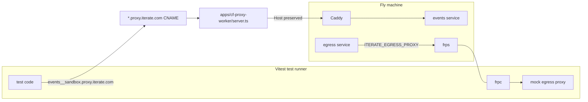

# Title

Deployment abstraction for Docker/Fly + internet E2E for Fly

# Why

Primary design goal: tests should not need to change when deployment topology changes.

The same test code should work if the runtime changes from Fly/Docker to GKE, mixed heterogeneous compute, home lab hardware (Mac Mini/Raspberry Pi), or personal tailnets. The deployment interface is the stable contract; provider/runtime details are replaceable.

Fly is the first concrete provider because it is the current production path.

# What this PR changes

- Introduces a shared deployment abstraction in `packages/shared/src/jonasland/deployment/` used by both OS worker and Vitest-style runners.
- Adds Docker and Fly implementations behind the same deployment contract.
- Makes Fly internet-path behavior end-to-end testable from a Vitest runner machine.
- Adds explicit ingress + egress internet plumbing for tests:
  - ingress via `apps/cf-proxy-worker/server.ts` + host-header routing in Caddy
  - egress interception via FRP tunnel back into the Vitest process
- Keeps tests provider-agnostic: same test logic, different deployment factory.

# Internet path (explicit)

## Ingress (runner -> Fly machine service)

Example: the Vitest runner calls `https://events__sandbox.proxy.iterate.com`.

- `*.proxy.iterate.com` wildcard CNAME points to the Cloudflare worker ingress proxy.
- Worker implementation: `apps/cf-proxy-worker/server.ts`.
- The worker route for `events__sandbox` forwards to the Fly machine public URL and preserves the `Host` header.
- Caddy in the Fly machine (`jonasland/sandbox/caddy/Caddyfile`) matches that host and routes to the internal events service.

If the host were `registry__sandbox.proxy.iterate.com`, Caddy would route to registry instead.

## Egress (Fly machine service -> runner mock HTTP server)

Example: a service in Fly wants `https://api.slack.com`.

- Outbound HTTP is redirected by iptables to Caddy.
- Caddy forwards to the egress service (`services/egress-service/src/server.ts`).
- Egress path reads `ITERATE_EGRESS_PROXY`.
- In this test setup, that points at FRP (`frps` on the deployment side).
- `frpc` on the Vitest runner creates the reverse tunnel.
- Requests arrive at the mock egress proxy HTTP server inside the Vitest Node.js process, where tests can inspect/mock responses.

# Diagram



# Mini test example

Canonical test file:
`jonasland/e2e/tests/clean/example.e2e.ts`

Clean example tests live under `jonasland/e2e/tests/clean/`.

```ts
import { describe, expect, test } from "vitest";
import {
  DockerDeployment,
  FlyDeployment,
  MockEgressProxy,
  startFlyFrpEgressBridge,
  type Deployment,
} from "../test-helpers/index.ts";

const providers: Array<{
  label: "docker" | "fly";
  enabled: boolean;
  create: () => Promise<Deployment>;
}> = [
  {
    label: "docker",
    enabled: true,
    create: () =>
      DockerDeployment.createWithOpts({ dockerImage: "jonasland-sandbox:local" }).create({
        name: "jonasland-vitest-docker-mini",
      }),
  },
  {
    label: "fly",
    enabled: Boolean(process.env.JONASLAND_E2E_FLY_IMAGE),
    create: () =>
      FlyDeployment.createWithOpts({
        flyImage: process.env.JONASLAND_E2E_FLY_IMAGE!,
        flyApiToken: process.env.FLY_API_TOKEN!,
        flyBaseDomain: process.env.FLY_BASE_DOMAIN ?? "fly.dev",
      }).create({
        name: "jonasland-vitest-fly-mini",
      }),
  },
];

for (const provider of providers) {
  // Filter one provider by name: `pnpm jonasland e2e -t docker` or `-t fly`.
  describe.runIf(provider.enabled)(`mini parity (${provider.label})`, () => {
    test("egress request is observable from runner", async () => {
      // Keep the primitive low-level for now: plain fetch + waitFor.
      await using proxy = await MockEgressProxy.create();

      // create() provisions infra and includes base readiness wait.
      await using deployment = await provider.create();

      await using bridge = await startFlyFrpEgressBridge({
        deployment,
        localTargetPort: proxy.port,
      });

      const egressProcess = await deployment.pidnap.processes.get({
        target: "egress-proxy",
        includeEffectiveEnv: false,
      });
      await deployment.pidnap.processes.updateConfig({
        processSlug: "egress-proxy",
        definition: {
          ...egressProcess.definition,
          env: {
            ...(egressProcess.definition.env ?? {}),
            ITERATE_EGRESS_PROXY: bridge.dataProxyUrl,
          },
        },
        restartImmediately: true,
      });
      await deployment.waitForPidnapProcessRunning({ target: "egress-proxy" });

      const seen = proxy.waitFor((request) => new URL(request.url).pathname === "/mini");
      proxy.fetch = async (request) =>
        Response.json({ ok: true, path: new URL(request.url).pathname });
      const curl = await deployment.exec([
        "curl",
        "-4",
        "-k",
        "-sS",
        "-i",
        "-H",
        "content-type: application/json",
        "--data",
        JSON.stringify({ hello: "world" }),
        "https://api.openai.com/mini",
      ]);

      expect(curl.exitCode).toBe(0);
      expect(curl.output).toMatch(/HTTP\/\d(?:\.\d)? 200/);

      const curlBody =
        curl.output
          .split(/\r?\n\r?\n/)
          .at(-1)
          ?.trim() ?? "";
      const curlJson = JSON.parse(curlBody) as {
        ok: boolean;
        path: string;
      };
      expect(curlJson.ok).toBe(true);
      expect(curlJson.path).toBe("/mini");

      // Slightly clunky for now: register waitFor first to avoid races.
      const { request, response } = await seen;
      expect(new URL(request.url).pathname).toBe("/mini");
      expect(response.status).toBe(200);
    });
  });
}
```

# Running

From repo root:

```bash
pnpm jonasland e2e
```
