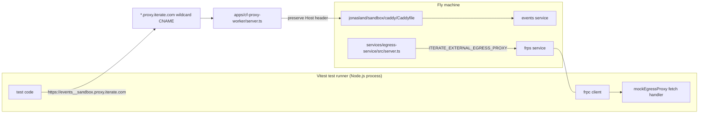

# Jonasland E2E

This suite validates internet-path behavior from a Vitest test runner process, not just local in-container behavior.

## Primary design goal

Tests should not need to change when deployment topology changes.

The same Vitest test code should keep working if the runtime behind it is:

- Fly (current production path)
- Docker
- GKE / Kubernetes
- heterogeneous compute across multiple environments
- Mac Mini / Raspberry Pi clusters
- personal Tailscale tailnet deployments

The only requirement is that the deployment exposes the minimal deployment interface consumed by tests.

## Why this exists

To test Fly credibly from a Vitest runner machine, we need two independent internet paths:

1. Ingress path from Vitest runner -> specific service inside one Fly machine
   We need many hostnames that all reach one Fly machine, so Caddy can route to the correct internal service by host header.

2. Egress path from Fly service -> mock server inside Vitest runner process
   We need outbound HTTP from Fly to be observable and mockable by tests running on another machine.

FRP provides the reverse tunnel for (2).

## Why Fly is here

Fly is the first concrete implementation because it is what we currently use in production.

The design target is provider/topology independence. Fly-specific work in this suite is in service of that broader contract.

## Three core capabilities in this suite

1. Provider-agnostic deployment control interface (tests stay stable)
2. Host-routed Fly ingress over the internet (CF proxy -> Fly -> Caddy)
3. FRP-backed egress interception from Fly into the Vitest runner process

## Concrete components (repo paths)

- Cloudflare ingress proxy worker: `apps/cf-proxy-worker/server.ts`
- Fly deployment harness used by tests: `jonasland/e2e/test-helpers/fly-deployment.ts`
- In-machine router (Caddy): `jonasland/sandbox/caddy/Caddyfile`
- Egress service implementation: `services/egress-service/src/server.ts`
- FRP bridge orchestration used by tests: `jonasland/e2e/test-helpers/frp-egress-bridge.ts`
- Registry public URL resolver (`events__...` / `registry__...` style host mapping): `services/registry-service/src/resolve-public-url.ts`

## Diagram



## Network path examples

```text
Ingress example (Vitest runner calling events service in Fly):

Vitest test code
  -> https://events__sandbox.proxy.iterate.com
  -> wildcard CNAME (*.proxy.iterate.com) -> CF ingress proxy worker (apps/cf-proxy-worker/server.ts)
  -> worker route for events__sandbox points to Fly machine public URL
  -> worker forwards request and preserves Host header
  -> Caddy on Fly machine (jonasland/sandbox/caddy/Caddyfile) matches Host=events__sandbox.proxy.iterate.com
  -> Caddy routes internally to events service

If host was registry__sandbox.proxy.iterate.com, Caddy would route to registry service instead.

Egress example (hypothetical slack service in Fly calling api.slack.com):

slack service in Fly machine
  -> HTTP request to https://api.slack.com
  -> iptables redirects outbound traffic to Caddy
  -> Caddy forwards to egress service (services/egress-service/src/server.ts)
  -> egress service reads ITERATE_EXTERNAL_EGRESS_PROXY
  -> set to FRP endpoint in this test setup
  -> frps (Fly side) <-> frpc (Vitest runner side) tunnel (wired by jonasland/e2e/test-helpers/frp-egress-bridge.ts)
  -> mock egress proxy HTTP server in Vitest Node.js process (jonasland/e2e/test-helpers/mock-egress-proxy.ts)
  -> test inspects/mocks request and response
```

Equivalent local Docker pattern is `*.iterate.localhost` with host-header routing.

## Minimal parity test example

Canonical test file:
`jonasland/e2e/tests/example.end2end.e2e.ts`

```ts
import { describe, expect, test } from "vitest";
import {
  DockerDeployment,
  FlyDeployment,
  MockEgressProxy,
  startFlyFrpEgressBridge,
  type Deployment,
} from "../test-helpers/index.ts";

const providers: Array<{
  name: "docker" | "fly";
  enabled: boolean;
  create: () => Promise<Deployment>;
}> = [
  {
    name: "docker",
    enabled: true,
    create: () =>
      DockerDeployment.withConfig({ image: "jonasland-sandbox:local" }).create({
        name: "jonasland-vtest-docker-my-test",
      }),
  },
  {
    name: "fly",
    enabled: Boolean(process.env.JONASLAND_E2E_FLY_IMAGE),
    create: () =>
      FlyDeployment.withConfig({ image: process.env.JONASLAND_E2E_FLY_IMAGE! }).create({
        name: "jonasland-vtest-fly-my-test",
      }),
  },
];

for (const provider of providers) {
  // Tip: run one provider with `pnpm jonasland e2e -t docker` or `-t fly`.
  describe.runIf(provider.enabled)(`egress parity (${provider.name})`, () => {
    test("egress reaches the vitest mock across the internet path", async () => {
      // Low-level on purpose for now. Higher-level APIs can layer on top.
      await using proxy = await MockEgressProxy.create();

      // `create()` calls `start()`, and `start()` waits for base readiness.
      await using deployment = await provider.create();

      await using frpBridge = await startFlyFrpEgressBridge({
        deployment,
        localTargetPort: proxy.port,
      });

      const egressProcess = await deployment.pidnap.processes.get({
        target: "egress-proxy",
        includeEffectiveEnv: false,
      });
      await deployment.pidnap.processes.updateConfig({
        processSlug: "egress-proxy",
        definition: {
          ...egressProcess.definition,
          env: {
            ...(egressProcess.definition.env ?? {}),
            ITERATE_EXTERNAL_EGRESS_PROXY: frpBridge.dataProxyUrl,
          },
        },
        restartImmediately: true,
      });
      await deployment.waitForPidnapProcessRunning({ target: "egress-proxy" });

      const observed = proxy.waitFor((request) => new URL(request.url).pathname === "/mini");
      proxy.fetch = async (request) =>
        Response.json({ ok: true, path: new URL(request.url).pathname });
      const curl = await deployment.exec([
        "curl",
        "-4",
        "-k",
        "-sS",
        "-i",
        "-H",
        "content-type: application/json",
        "--data",
        JSON.stringify({ from: provider.name }),
        "https://api.openai.com/mini",
      ]);

      expect(curl.exitCode).toBe(0);
      expect(curl.output).toMatch(/HTTP\/\d(?:\.\d)? 200/);

      const curlBody =
        curl.output
          .split(/\r?\n\r?\n/)
          .at(-1)
          ?.trim() ?? "";
      const curlJson = JSON.parse(curlBody) as {
        ok: boolean;
        path: string;
      };
      expect(curlJson.ok).toBe(true);
      expect(curlJson.path).toBe("/mini");

      // Slightly clunky for now: register waitFor before sending the request
      // to avoid race conditions.
      const { request, response } = await observed;
      expect(new URL(request.url).pathname).toBe("/mini");
      expect(response.status).toBe(200);
    });
  });
}
```

`DockerDeployment` automatically includes `host.docker.internal:host-gateway`, so egress tests do not need to pass `extraHosts` per test.

## What tests assert

- Deployment interface stability: tests call one minimal interface regardless of provider/topology
- Provider-parity compatibility for current implementations (`DockerDeployment`, `FlyDeployment`)
- Host-routed ingress reaches intended service endpoints
- Fly public URL resolution works end-to-end
- FRP egress path allows external-proxy mode to hit Vitest-local mocks
- Events/firehose workflows remain functional through these routing paths

## Run

From repo root with jonasland command:

```bash
pnpm jonasland e2e
```

Run specific test files:

```bash
pnpm jonasland e2e -- tests/mock-egress-proxy.e2e.ts tests/fixtures-stress.e2e.ts
```

Provider selection:

```bash
JONASLAND_E2E_PROVIDER=docker pnpm jonasland e2e
JONASLAND_E2E_PROVIDER=fly pnpm jonasland e2e
JONASLAND_E2E_PROVIDER=all pnpm jonasland e2e
```
