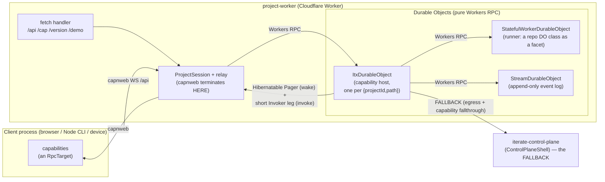
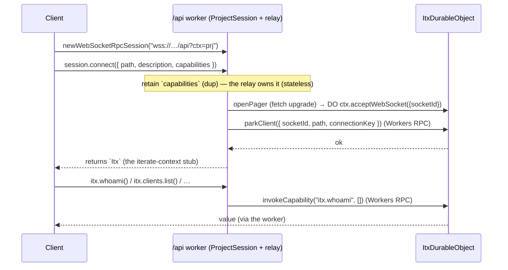
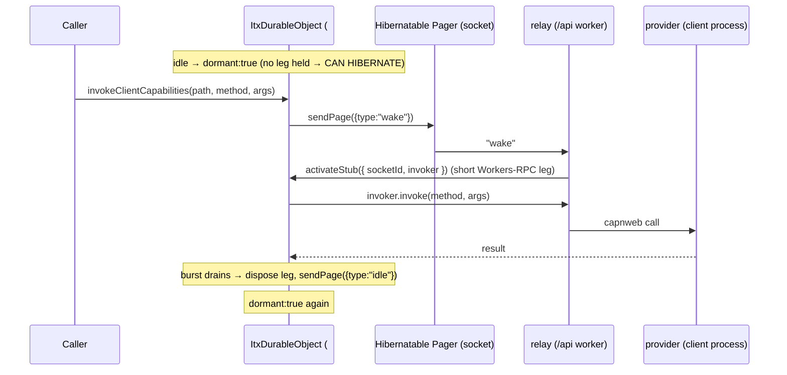

# Clean-room inner core — architecture & API

A stock-take of `packages/v3/project-worker` as it stands (branch `wip/kernel-wayfinder-2026-07-30`). This is the
clean-room rebuild of iterate's platform inner core: a capability host, a don't-pin live-capability transport,
dynamic workers (stateless / stateful / fetch-shaped), streams, and the `connect → itx` + `itx.clients` client
model. Design ledger: `apps/os/docs/simplification/wayfinder/innermost-core/map.md`. Increment-by-increment
history + proofs: [`BUILD-LOG.md`](./BUILD-LOG.md).

---

## 1. The big picture

Two Cloudflare Workers, one package each (`packages/v3/*`, decision D40 — flat cloudflare-os-style layout,
a package is a worker iff it has a `wrangler.jsonc`):

- **`project-worker`** (this package) — the inner core. A stateless edge worker fronting one `ItxDurableObject`
  per `{projectId, path}` context, plus dynamic-worker runner DOs and stream DOs.
- **`iterate-control-plane`** (`packages/v3/control-plane-shell`) — the outer shell a project falls back to
  (platform-secret substitution, the capability fallthrough, cross-script stream writes). Minimal stand-in for
  the real control plane. Shared code (`egress`, the dial contract) lives in `packages/v3/shared`.

Two hard rules run through everything:

1. **capnweb terminates ONLY in the stateless worker** (`/api`). The Durable Objects speak nothing but native
   **Workers RPC**. This keeps the DO hibernatable and is non-negotiable.
2. **A connected client does not pin its DO.** A live provider lives in a stateless relay; the DO holds only a
   _hibernatable stub_ (a socket + a small record) and borrows a real RPC leg on demand.



---

## 2. Deployment topology & bindings

Each worker deploys via its own package's `wrangler.jsonc` (`packages/v3/project-worker`,
`packages/v3/control-plane-shell`). Both to POC account `04b3b57291ef2626c6a8daa9d47065a7`.

### `project-worker` (`main: src/worker.ts`)

| Binding               | Kind                                                | Purpose                                                           |
| --------------------- | --------------------------------------------------- | ----------------------------------------------------------------- |
| `ITX_HOST`            | DO namespace → `ItxDurableObject`                   | the capability host, one instance per context (by name)           |
| `STREAM_DO`           | DO namespace → `StreamDurableObject`                | `itx.streams`, named `{projectId}:{streamPath}`                   |
| `STATEFUL_WORKER`     | DO namespace → `StatefulWorkerDurableObject`        | runner for stateful dynamic workers                               |
| `LOADER`              | Worker Loader                                       | loads confined dynamic workers (code / stateful / web / agents)   |
| `SECRETS_KV`          | KV                                                  | project secrets `secret:{projectId}:{name}` (egress substitution) |
| `ITX_KV`              | KV                                                  | `itx.kv` + `itx.repo`, both project-prefixed                      |
| `FALLBACK`            | Service → `iterate-control-plane#ControlPlaneShell` | egress + capability fallthrough                                   |
| `CF_VERSION_METADATA` | version metadata                                    | folded into loader cacheKeys (fresh isolate per deploy)           |

### `iterate-control-plane` (`packages/v3/control-plane-shell`, `main: src/index.ts`)

| Binding               | Kind                                                           | Purpose                                     |
| --------------------- | -------------------------------------------------------------- | ------------------------------------------- |
| `PLATFORM_SECRETS_KV` | KV (hosted only)                                               | first-party secrets, keyed by bare name     |
| `STREAM_DO`           | **cross-script** DO → `project-worker`'s `StreamDurableObject` | write INTO a project's stream (outer→inner) |

### Exported entrypoints per worker

`project-worker` (`src/worker.ts` re-exports):

- `default` — the edge fetch handler (§4.1)
- `ItxDurableObject`, `StreamDurableObject`, `StatefulWorkerDurableObject` — the DO classes
- `ProjectRunner`, `ProjectEntrypoint`, `ProjectAuth` — the older two-worker-split runner (§7)
- `DummyControlPlane` — the solo-mode fallback entrypoint

`iterate-control-plane`: `default` (fetch, incl. `/emit`) + `ControlPlaneShell`.

---

## 3. Core flows

### 3.1 `connect → itx` (capnweb at the edge, Workers RPC to the DO)



`get()` is pure addressing; `connect()` is _get + presence_ — the client is registered at `path` and its live
`capabilities` are provided. Both return the same `Itx`. `itx.provideCapability({type:"live"})` adds more.

### 3.2 The don't-pin lifecycle (a call to a live provider)

The DO holds **no stub** between calls. On a call it pages the relay, borrows a short Workers-RPC leg, invokes,
and drops the leg — so it hibernates while any number of providers stay connected.



**Proven at scale:** 1000 clients connected → `itx.hostState() = {stubs:1000, active:0, dormant:true}`; held 3 min idle;
`incarnation` climbed (the DO truly hibernated and was reconstructed ~4× while holding all 1000); calling two
named clients woke only those two. Leases survive because they live in the socket attachment (§5).

### 3.3 `invokeCapability` dispatch order

```mermaid
flowchart TD
  A["invokeCapability(callPath, args)"] --> B{built-in?}
  B -- "itx.whoami / kv / streams / repo /<br/>provideCapability / clients / files /<br/>configure / secrets.set" --> BI[resolve in-place]
  B -- no --> L{live capability stub?<br/>(#capabilityStub, longest prefix)}
  L -- yes --> LI["#stubs.invoke(socketId, method, args)<br/>(don't-pin leg)"]
  L -- no --> M{local mount?}
  M -- "itx-expression" --> AL[alias → re-invoke]
  M -- "code" --> CO[stateless dynamic worker]
  M -- "static" --> SV[return value]
  M -- no --> SF{stateful mount?}
  SF -- yes --> SD["forward to StatefulWorkerDurableObject"]
  SF -- no --> FB{root?}
  FB -- "deep path" --> PP["→ PARENT PATH DO.invokeCapability"]
  FB -- "root" --> SH["→ FALLBACK (shell) invokeCapability"]
```

"Reads fall back, writes stay local": a deep context falls back to its parent path; the root falls back to the
shell.

### 3.4 The fetch lane (WebSocket upgrades through a capability)

A 101 upgrade can't cross an RPC hop, so a fetch-shaped capability is reached by **native `.fetch()` hops**,
addressed by a serialized `ItxExpression` (or callPath) in the `x-itx-cap` header:

```
client --WS /cap?cap=["site"]--> edge --x-itx-cap--> ItxDurableObject.fetch
  → #fetchCapability → { web: load worker → getEntrypoint().fetch(req)   ← accept()s the 101
                       | stateful: → runner /facet → facet.fetch
                       | alias: re-resolve
                       | deep path: → parent DO.fetch (native, 101 survives) }
```

This is the thing apps/os could not do (a provided capability there is reachable only by RPC replay). A live
capnweb provider still can't take a raw 101 (needs a frame bridge — deferred).

---

## 4. Worker entrypoints

### 4.1 `project-worker` edge — `default.fetch(request, env, ctx)` (`src/worker.ts`)

| Route                  | Method   | Behaviour                                                                                                                                    |
| ---------------------- | -------- | -------------------------------------------------------------------------------------------------------------------------------------------- |
| `/version`             | GET      | the `CODE_VERSION` marker (smoke tests wait for it)                                                                                          |
| `/api?ctx=<projectId>` | WS       | **the one capnweb entrypoint** → `newWorkersWebSocketRpcResponse(request, new ProjectSession(...))`                                          |
| `/cap?ctx=&cap=<expr>` | any/WS   | the fetch lane → sets `x-itx-cap`, forwards to the host DO (carries WS)                                                                      |
| `/demo`                | GET      | the hosted live-state demo page (self-contained React + capnweb, served from the worker)                                                     |
| `itx.hostState()`      | capnweb  | observability over the ONE door → `{ incarnation, facetProcessors, core, subscriptionMounts, …stubs }` (the old `/state` HTTP door, retired) |
| `/facet?ctx=&path=`    | any/WS   | stateful-worker fetch lane → forwards to the DO                                                                                              |
| `/call?ctx=`           | POST/GET | `invokeCapability(path, args)` — `{path,args}` body or `?path=&args=` (agents/harnesses)                                                     |
| bare WS upgrade        | WS       | ingress → the DO                                                                                                                             |

### 4.2 `ProjectSession` — the capnweb main (`src/core/itx-surface.ts`)

The object a client gets from `/api`. capnweb terminates here; it reaches the DO only over Workers RPC.

```ts
class ProjectSession extends RpcTarget {
  get(): Itx; // pure addressing → the iterate-context stub
  connect(opts: ConnectOpts): Promise<Itx>; // get + presence (registers a client, provides its capabilities)
}
interface ConnectOpts {
  path: string;
  description?: string;
  capabilities?: RpcTarget;
  connectionKey?: string;
}
```

### 4.3 `ControlPlaneShell` (`packages/v3/control-plane-shell/src/index.ts`) — the FALLBACK

```ts
class ControlPlaneShell extends WorkerEntrypoint {
  fetch(request): Promise<Response>; // egress: substitute {{secret:platform:*}} → terminal
  invokeCapability(callPath, args?): Promise<unknown>; // capability fallthrough (auth stand-in)
}
// default.fetch: /emit?projectId=&path=&type= → cross-script write INTO a project's stream (outer→inner, D27)
```

### 4.4 The two-worker-split runner (`src/index.ts`) — the older confined-config-worker path

Predates the capability-host `/api` model; still exported so a live control-plane `RUNNER` service binding
resolves. Loads the per-project **config worker** (`src/config-worker.ts`) into a Worker-Loader sandbox and
serves it, minting a per-project `ITX` loopback.

```ts
class ProjectRunner extends WorkerEntrypoint {
  // same-account dial target (service binding)
  serve(request, projectId, app, callerHeader): Promise<Response>;
}
class ProjectEntrypoint extends WorkerEntrypoint<Env, { projectId }> {
  // the per-project ITX loopback
  whoami(): { projectId };
  get auth(): ProjectAuth;
  fetch(request): Promise<Response>; // globalOutbound egress (TODO: unrestricted today)
}
class ProjectAuth extends RpcTarget {
  gate(callerHeader, cpOrigin, requestUrl): { authorized: boolean; loginUrl?: string }; // forward-auth
}
// default.fetch: POST /serve (cross-account dial: shared secret + x-iterate-* headers)  — dormant behind worker.ts
```

### 4.5 `DummyControlPlane` (`src/worker.ts`) — solo fallback

`fetch` → terminal; `invokeCapability("itx.auth.gate")` → `{ok:true}`. Bound as `FALLBACK` only in solo config.

---

## 5. Durable Object classes

### 5.1 `ItxDurableObject` (`src/itx-durable-object.ts`) — the capability host

One per `{projectId, path}` (a faux-URL name `{projectId}.iterate{path}`). **Pure Workers RPC** — no capnweb.

**Public methods (called over Workers RPC by the relay / edge / sibling DOs):**

```ts
// native fetch — the ONE method a 101 can flow through
fetch(request): Promise<Response>
//   x-itx-pager → #stubs.accept (Hibernatable Pager upgrade)
//   x-itx-cap   → #fetchCapability (the fetch lane)
//   /facet      → stateful runner fetch
//   /state      → { incarnation, ...#stubs.state() }
//   WS upgrade  → ingress echo ;  non-WS → EGRESS (secret-sub → FALLBACK)
webSocketMessage/Close/Error(ws, …)    // echo socket echoes; a Pager close → #stubs.closed(ws)

// the capability model
provideCapability(input: ProvideCapabilityInput): Promise<{ ok: true }>   // mount code/stateful/web/static/alias
invokeCapability(callPath: string, args?: unknown[]): Promise<unknown>    // THE dispatch (§3.3)
load(source: string, request?): Promise<Response>                        // run a confined agent in this context

// don't-pin: relay-facing (capabilities + client connections are both hibernatable stubs)
parkCapability({ socketId, capPath, description? }): { ok: true }
parkClient({ socketId, path, connectionKey, description? }): { ok: true; connectionKey }
activateStub({ socketId, invoker }): { ok: true } | undefined            // wake handshake
dropCapability({ capPath }): { ok: true }                                // revoke

// itx.clients (no stream-connection machinery — a client connection IS a parked stub)
clientsList(): unknown[]                                                  // roster, one row per client path
clientConnections(path): unknown[]                                       // connections at a path
invokeClientCapabilities(path, method, args): Promise<unknown[]>         // FAN OUT (allSettled — Q4-tolerant)
invokeClientCapability(connectionKey, method, args): Promise<unknown>    // single-target (strict)
closeClientConnection(connectionKey): { ok: true }                       // kick

incarnation: number   // durable, bumped per (re)construction — the hibernation tell
```

**Built-in capability call-paths** (resolved in-place by `invokeCapability`):

| call-path                                 | meaning                                                                      |
| ----------------------------------------- | ---------------------------------------------------------------------------- |
| `itx.whoami`                              | `{ projectId }`                                                              |
| `itx.kv.{get,put,delete,list}`            | project-prefixed KV over `ITX_KV`                                            |
| `itx.streams.append` / `itx.streams.read` | project-prefixed stream over `STREAM_DO`                                     |
| `itx.repo.{get,put,list}`                 | project file store (`{projectId}:repo:` view of `ITX_KV`)                    |
| `itx.files.read(path)`                    | v1 dynamic-worker source reader (returns `{ "cap.js": … }`; a hello for now) |
| `itx.secrets.set(name,value)`             | write-only project secret                                                    |
| `itx.provideCapability(input)`            | mount a dynamic-worker capability                                            |
| `itx.clients.{list,connections,call}`     | client roster + fan-out (root context only)                                  |
| `itx.configure`                           | run the project's `/worker.js` config worker                                 |

**Mounts** (`provideCapability`) — dynamic-worker source is an `ItxExpression` (data), resolved to a modules map:

```ts
type Mount =
  | { type: "itx-expression"; expression } // alias to another callPath
  | { type: "static"; value }
  | { type: "code"; source } // stateless: cap.js default-exports (itx, ...args) => result
  | { type: "stateful"; source; className } // a DurableObject class run by StatefulWorkerDurableObject
  | { type: "web"; source }; // fetch-shaped: cap.js default-exports { fetch } — the fetch lane
```

### 5.2 `StatefulWorkerDurableObject` (`src/stateful-worker-durable-object.ts`)

One instance per stateful capability, named `{projectId}::{path}::{callPath}`. Hosts a repo `DurableObject` class
**directly as a facet** with its own SQLite; facet-method RPC is **native** (`Reflect.apply`), no tunnel. Every
hosted class gets `env.ITX` = a stub to its owning host + `globalOutbound`.

```ts
interface StatefulInvoke {
  source: ItxExpression;
  className: string;
  method: string;
  args: unknown[];
}
class StatefulWorkerDurableObject extends DurableObject {
  invokeCapability(input: StatefulInvoke): Promise<unknown>; // RPC lane: native facet-method call
  fetch(request): Promise<Response>; // WS/streaming lane → the facet's own fetch
}
```

### 5.3 `StreamDurableObject` (`src/stream-durable-object.ts`)

One per `(projectId, streamPath)`, named `{projectId}:{streamPath}`. Deliberately thin (delivery spine deferred).

```ts
type StreamEventInput = { type: string; payload?: unknown };
type StreamEvent = { offset: number; type: string; createdAt: string; payload: unknown };
class StreamDurableObject extends DurableObject {
  append(input: StreamEventInput): { offset: number }; // monotonic AUTOINCREMENT offset
  read(afterOffset = 0, limit = 1000): StreamEvent[]; // poll-based replay
}
```

---

## 6. The client-facing `itx` surface (capnweb RpcTargets, `src/core/itx-surface.ts`)

Everything a connected client holds. These are capnweb targets in the `/api` worker; their methods forward to the
DO over Workers RPC. The dotted `itx.a.b(x)` and `.capabilities.a.b(x)` ergonomics are client-side sugar over the
`invokeCapability({path, args})` methods below.

```ts
class Itx extends RpcTarget {
  whoami(): Promise<{ projectId }>
  invokeCapability({ path: string[]; args?: unknown[] }): Promise<unknown>   // built-ins + provided caps
  get clients(): ClientCollection
  provideCapability(input: ProvideLiveInput): Promise<CapabilityProvision>   // add a live capability
}
interface ProvideLiveInput { type: "live"; path: string[]; capability: RpcTarget; instructions? }

class ClientCollection extends RpcTarget {      // itx.clients
  get(path: string): Client
  list(): Promise<unknown[]>                    // roster: [{ path, description, connections, hasCapabilities }]
}
class Client extends RpcTarget {                // itx.clients.get(path)
  connections(): Promise<unknown[]>
  invokeCapability({ path, args? }): Promise<unknown[]>   // .capabilities.* — FANS OUT over connections
  getConnection(connectionKey: string): ClientConnection
}
class ClientConnection extends RpcTarget {      // …getConnection(key)
  invokeCapability({ path, args? }): Promise<unknown>     // single-target
  close(): Promise<unknown>                                // kick
}
class CapabilityProvision extends RpcTarget {   // returned by itx.provideCapability
  __leaseActive(): boolean                       // relay-local liveness — never wakes the DO
  revoke(): Promise<void>
}
```

`ProjectSession` (§4.2) is the capnweb main; `Invoker` (internal) is the short Workers-RPC leg the relay hands
the DO on wake — it dispatches `invoke(capPath, args)` onto the retained capnweb provider.

---

## 7. Core libraries (`src/core/`)

### `hibernatable-stub.ts` — the don't-pin mechanism

An emulated hibernatable **outbound** RPC stub (workerd has none natively). Provider-agnostic: knows only
`{ socketId }` + opaque meta and how to invoke on demand. The DO's `#stubs`.

```ts
type Invoker = { invoke(path: string[], args: unknown[]): Promise<unknown>; dup?(): Invoker };
type Stub = { socketId: string; [meta: string]: unknown };
class HibernatableStubs {
  accept(request): Response; // the Pager upgrade (DO fetch)
  park(socketId, meta): void; // stamp meta onto the socket (survives hibernation)
  all(): Stub[]; // derived from the surviving Pager sockets
  invoke(socketId, path, args): Promise<unknown>; // wake → borrow a short leg → invoke → release
  activate({ socketId, invoker }): { ok: true } | undefined; // the relay's wake answer
  drop(socketId, reason): void; // close the Pager + forget
  closed(ws): void; // a Pager closed → clean up
  state(): { stubs; active; pending; dormant };
}
```

### `hibernatable-pager.ts` — the transport (a hibernation-safe DO→relay back-channel)

```ts
const PAGER_HEADER = "x-itx-pager"
type Page = { type: "wake" } | { type: "idle" }        // one-way DO→relay messages
type PagerRecord = { socketId: string; [k: string]: unknown }   // the socket attachment (survives hibernation)
acceptPager(request, hooks): Response                  // DO: accept the relay's upgrade (ctx.acceptWebSocket)
openPager(stub, socketId): Promise<WebSocket>          // relay: open a Pager to a DO
pagerSockets(hooks): WebSocket[]                        // DO: all open Pagers
pagerSocketFor(socketId, hooks): WebSocket | undefined
pagerAttachment(ws): PagerRecord | undefined
stampPager(ws, record): void                           // (re)stamp the attachment
sendPage(ws, page): void ;  parsePage(data): Page | undefined
```

### `itx-expression.ts` — the capability-call codec (a two-way JS↔data codec)

```ts
type ItxStep = string | [method: string, ...args: unknown[]]   // property read | call
type ItxExpression = ItxStep[]                                  // e.g. ["files", ["read", "/hello.js"]]
captureExpression(): { root; steps(): ItxExpression }           // encode: drive a proxy → read back steps
evaluateItxExpression(root, expr): Promise<unknown>             // decode: Reflect.get / Reflect.apply walk
itxRoot(invoke): unknown                                        // a root whose dotted access → invoke("itx.a.b", args)
expressionCallPath(expr): string                                // reduce an expression to an addressing callPath
```

### `names.ts` — the ONE place a context DO name is formatted/parsed

```ts
type ContextName = { projectId: string; path: string }
normalizePath(path): string ; stringifyName({projectId,path}): string ; parseName(name): ContextName
canonicalName(raw): string ; parentPath(path): string | null      // {projectId}.iterate{path}
```

### `egress.ts` — WS-safe secret substitution

```ts
substituteHeaderSecrets(request, scope: "project" | "platform", resolve): Promise<Request>
//   replaces {{secret:<scope>:<name>}} tokens in HEADERS only (preserves method + Upgrade → 101 flows through)
```

### `config.ts` — deployment `APP_CONFIG`

```ts
type ItxCallPath = `itx.${string}`
type FallbackRef = { via:"terminal" } | { via:"service-binding"; binding } | { via:"loopback-entrypoint"; entrypoint }
type AppConfig = { fallback: FallbackRef }
parseAppConfig(raw): AppConfig     // default: solo → the worker's own DummyControlPlane
```

### `worker-loader.ts` — the confined-worker loader

- `ITX_SURFACE_MODULE` — injected as `itx.js`: `itxFromStub(stub)` wraps the raw `env.ITX` host stub in the
  dotted `itx.a.b(args)` Proxy (each call → `stub.invokeCapability("itx.a.b", [args])`).
- `CODE_CAP_RUNNER` — wraps a repo file's `(itx, ...args) => result` default export as a stateless worker.

### `config-worker.ts` — the per-project config-worker source

`CONFIG_WORKER_SOURCE`: the confined worker `ProjectRunner` serves (§4.4). A PUBLIC default app + a PRIVATE
`admin` app that calls `env.ITX.auth.gate(...)` for forward-auth.

---

## 8. Data model & storage

| What                                               | Where                                                   | Keying                                                 |
| -------------------------------------------------- | ------------------------------------------------------- | ------------------------------------------------------ |
| Capability **mounts**                              | `ItxDurableObject` storage (`"mounts"`)                 | callPath → Mount                                       |
| Live **stubs** (capabilities + client connections) | **the Pager socket attachment** (hibernation-safe)      | `{ socketId, capPath \| clientPath+connectionKey, … }` |
| Active legs / pending wakes                        | `HibernatableStubs` in-memory (mid-call only)           | socketId                                               |
| `itx.kv`                                           | `ITX_KV`                                                | `{projectId}:{key}`                                    |
| `itx.repo`                                         | `ITX_KV`                                                | `{projectId}:repo:{path}`                              |
| `itx.streams`                                      | `StreamDurableObject` (SQLite)                          | DO name `{projectId}:{streamPath}`                     |
| project secrets                                    | `SECRETS_KV`                                            | `secret:{projectId}:{name}`                            |
| stateful facet state                               | the facet's own SQLite in `StatefulWorkerDurableObject` | per runner instance                                    |

**Isolation** is constructive: every backing view is prefixed by the DO's own (unforgeable) `projectId`, so
byte-identical project code is isolated in a shared namespace (decision D8).

---

## 9. Status — proven & deferred

**Proven on the live deployment** (`project-worker.iterate.workers.dev`): the full capability model; dynamic
workers (stateless / stateful-facet-native / fetch-shaped web); WS upgrades through the capability graph; the
`connect → itx` + `itx.clients` client model; and — the headline — **don't-pin at 1000**: 1000 clients connected
with the DO hibernating throughout, only the called clients woken. Details + commits: [`BUILD-LOG.md`](./BUILD-LOG.md).

**Deferred:** the stream delivery spine (processors / folds / push subscriptions — `processEventBatch`); the real
repo-backed `itx.files` reader (refs + globs + deref-then-key); the `authenticate → Session → projects.get` chain
(the clean room addresses by `projectId` via `/api?ctx=`); the pipelined `itx.a.b()` sugar over capnweb;
cross-deploy lease reconciliation (v1 reconciles on socket close); a WS frame-bridge to an external capnweb
provider; folding the older `ProjectRunner` config-worker path (§4.4) into the capability host.
