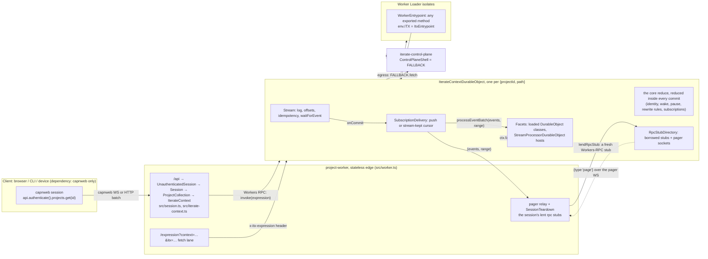
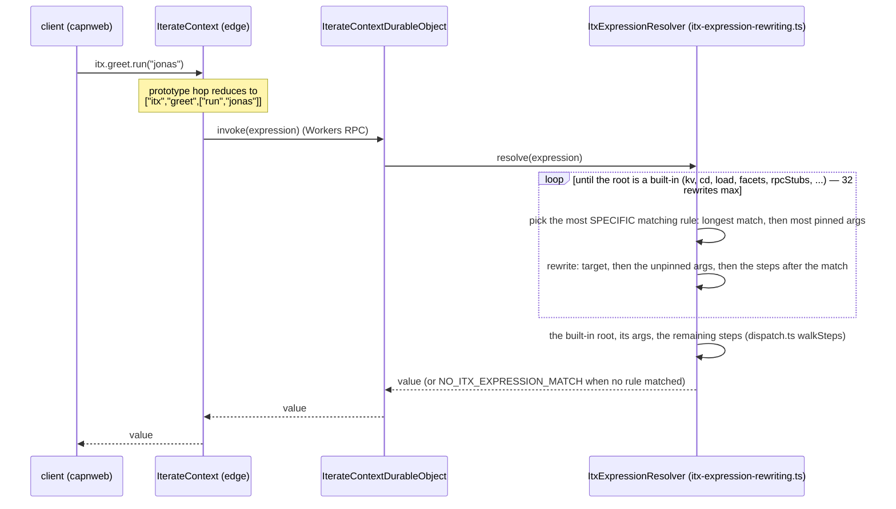
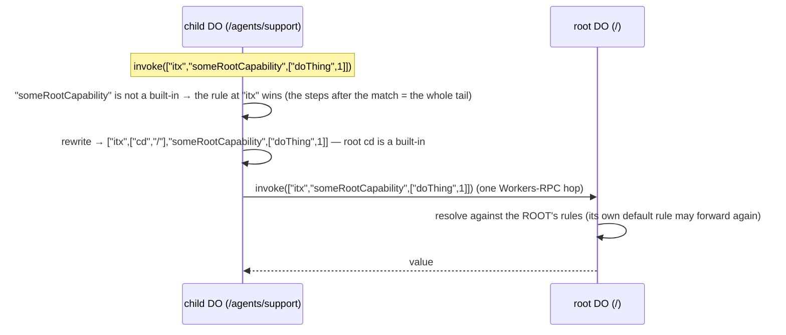

# The clean-room Iterate Context: API and code-structure walkthrough

> Current as of the itx-surface rename (2026-09-02) on `wip/kernel-wayfinder-2026-07-30`.
> Package: `packages/v3/project-worker`. Every interface below is transcribed from
> source; file paths are given so you can check. The design these steps
> implemented is `docs/design-onion-subscriptions-processors.md` (and, for the
> surface itself, `docs/proposals/itx-surface-SYNTHESIS.md`); the tutorial
> that builds the same system from nothing is
> `docs/tutorial-build-the-iterate-context.md`.
>
> Older documents in this package (`ARCHITECTURE.md`, `docs/iterate-context.md`,
> `ITX-KERNEL-SHAPE.md`, `docs/state-of-play.md`) describe earlier shapes and
> carry a banner pointing here. Read them as history.

---

## 1. The picture in one screen

Three primitives, one worker, one Durable Object class, and an onion of layers
on top of the stream.

- **The context.** A dotted surface you call in both directions: a client calls
  the project (`itx.kv.get('x')`), and the project calls back into the client (a
  callback you handed over with `provide`). Two things, named apart: **rpc
  stubs** — physical, lent by a session under an opaque `rpcStubKey`, borrowed by
  the DO, paged back on demand — and **itx-expression rewrite rules** — pure
  data, `{ match, target }`: a call starting with `match` runs as the same call
  with `match` replaced by `target`.
- **Fetch.** In both directions: anything fetch-shaped can be a web server
  (reached via a terminal `.fetch(request)`), and every outbound fetch from
  project code is egress with `{{secret:project:NAME}}` substitution.
- **The stream.** One append-only log per context. One inline reduce (`core`)
  reduces the context's own control events at the commit point — identity, wake,
  pause, the rewrite rules, the subscriptions; one delivery loop hands every
  commit to the subscriptions; a processor is a Durable Object class hosted as a
  facet and subscribed to the log.

Every context is one `IterateContextDurableObject`, named by the codec
`{projectId}.iterate{path}` (`prj_demo.iterate/` is the project root,
`prj_demo.iterate/agents/support` a child). The stateless worker at `/api` is
the only place capnweb terminates. It reaches the DO over Workers RPC. Loaded
userspace code runs in Worker Loader isolates or as facets of the DO, and its
entire world is one binding, `env.ITX`.



---

## 2. File map

The tree is laid out by primitive, one folder per chapter of the tutorial.

```text
packages/v3/project-worker/
  wrangler.jsonc                 bindings: CONTEXT (DO), LOADER, ITX_KV, SECRETS_KV,
                                 CF_VERSION_METADATA, FALLBACK (service → ControlPlaneShell)
  build-sdk.mjs                  bundles src/sdk/index.ts → generated/processor-sdk.ts (processor.js),
                                 client/demo.tsx → generated/demo-page.ts
  src/
    worker.ts                    THE EDGE. default fetch routes /api /expression /demo /version.
                                 Exports DummyControlPlane, ItxEntrypoint, IterateContextDurableObject.
    session.ts                   UnauthenticatedSession → Session → ProjectCollection (the gate + catalog),
                                 SessionTeardown (what a session undoes at its end)
    iterate-context.ts           IterateContext, the client-facing RpcTarget: a PROXY in front of the DO —
                                 cd · invoke · provide · rewrite · subscribe · enableProcessor · disableProcessor;
                                 RewriteRuleHandle / SubscriptionHandle (disposable)
    iterate-context-durable-object.ts  THE CONTEXT DO: stream + the core reduce + delivery + facets +
                                 rpc stubs + the fetch doors. One class, ~600 lines. First line:
                                 #name = parseIterateContextDurableObjectName(ctx.id.name)
    itx-entrypoint.ts            ItxEntrypoint: what a loaded worker's env.ITX is
    context/                     chapter 1 — the context: rpc stubs, expressions, rewrite rules
      built-ins.ts               the kernel roots: whoami, kv, append, read, waitForEvent, cd, fetch,
                                 rpcStubs, rewriteRules, facets, subscriptions, load, runScript
      expression.ts              the codec: "itx.a.b(1)" ⇄ ["itx","a",["b",1]]; ItxExpression /
                                 ItxExpressionInput / ItxExpressionPrefix; canonicalItxExpressionPrefix
      itx-expression-rewriting.ts  THE RULES 1–5 (match / pick / apply / rewrite-to-built-in), the ONE
                                 event (rewriteRuleConfiguredEvent), the reader (ItxExpressionResolver)
      dispatch.ts                walkSteps / callOn — execute a rewritten call's steps on a live object graph
      dotted-path-proxy.ts       the prototype hop: unknown dotted members reduce into ONE invoke(expression)
      invoke-handle.ts           InvokeHandle + the two brands FacetHandle / RpcStubHandle
      rpc-stub-directory.ts      the rpc stubs, DO side, two layers: the BORROWED table (lendRpcStub /
                                 invokeRpcStub / returnBorrowedRpcStubs), then the PAGERS
                                 (attachRpcStubPager, the pager door, pages); presence events
      rpc-stub-relay.ts          edge side: lendRpcStubOverPager (the DON'T-PIN relay), LentRpcStub
      worker-loader.ts           loadConfinedWorker, facetLoaderOwner, WorkerSource
      durable-object-names.ts    DurableObjectNameCodec, resolveContextPath
    fetch/                       chapter 2 — fetch, in both directions
      rpc-stub-fetch.ts          fetch-shaped calls: the x-itx-expression lane (itxExpressionEndingInFetch),
                                 the 101 tunnel on a lent rpc stub (fenced WORKAROUND, delete-day checklist inside)
    stream/                      chapter 3 — the log and what reduces it
      stream.ts                  Stream (the commit pipeline), Context interface, localContext
      events.ts                  StreamEventInput / StreamEvent (plain types), defineProcessorContract (zod)
      processor.ts               StreamProcessor (the pure author class), ProcessorEngine, consumesEvent
      reduce-checkpoint.ts       the one persisted reduce-checkpoint shape
      core-processor.ts          CoreStreamProcessor (slug core, 4.0.0): created/woken/paused/resumed
                                 + the rewrite rules (a map) + the subscriptions, one reduce
      subscriptions.ts           the subscriptions' one command: subscriptionConfiguredEvent
                                 ({ name, target | null, consumes? })
      subscription-delivery.ts   THE ONE DELIVERY LOOP: push to a facet or lent stub, else a
                                 stream-kept cursor with a bounded retry ladder
      live-state.ts              LiveState<S>: revision chain + diff → ephemeral delta event
    sdk/                         what userspace imports from "./processor.js"
      index.ts                   the export list
      stream-processor-durable-object.ts  StreamProcessorDurableObject: the host, `processor = new X()`
    lib/                         errors.ts (codedError / errorCode)  logs.ts  patch.ts (diff / applyPatch)  timeout.ts
    client/
      live-state-store.ts        pure store: seed + deltas → current state
      live-state-client.ts       connectLiveState(itx, { key, door, ... })
      react.tsx                  useLiveState hook
      demo.tsx                   the hosted /demo page
    generated/                   build outputs (committed; rebuilt by build-sdk.mjs)
  e2e/                           `pnpm e2e` — the real worker, booted ONCE (support/global-setup.ts),
                                 every <primitive>-<claim>.e2e.test.ts speaks capnweb at /api through
                                 support/client.ts (the whole client surface a test uses)
  __workers-tests__/             `pnpm test` workers project — @cloudflare/vitest-plugin, runs INSIDE
                                 workerd for the hibernation cases that need its controls
  specs/                         `pnpm spec` — Playwright drives the hosted /demo page
../control-plane-shell/src/index.ts   ControlPlaneShell: fetch (platform secrets → internet),
                                 a stub fallthrough verb, default fetch /emit writes into a
                                 project's context
../shared/src/egress.ts          substituteHeaderSecrets({{secret:<scope>:NAME}})
```

Unit-lane tests (`pnpm test`, in-process node) sit next to their subject
(`context/itx-expression-rewriting.test.ts` is the rules' table test) and share
one `stream/test-support.ts` (the in-memory stream and storage fakes); the
workers lane shares `__workers-tests__/support.ts`. Everything that needs the
real worker is in `e2e/`, one file per primitive-and-claim, on one shared worker;
its client is `e2e/support/client.ts`. A file's name says what it proves — there
are no "failing" files; an expected failure is a `test.fails` inside a plainly
named file.

---

## 3. Reaching a context

The client's only dependency is the capnweb fork (`npm:@iterate-com/capnweb`,
imported as `capnweb`). There is no client SDK. The session shape is apps/os's.

```ts
import { newWebSocketRpcSession, newHttpBatchRpcSession } from "capnweb";

using api = newWebSocketRpcSession("wss://<worker>/api");
const itx = api.authenticate().projects.get("prj_demo"); // the project ROOT, path "/"
const agent = itx.cd("/agents/x"); // a context within the project
const inbox = agent.cd("../inbox"); // relative resolves; absolute by convention

// One-shot and socketless (CLI, cron): every call chained off the session flushes as ONE POST.
// A batch session cannot hold live callbacks (nothing outlives the response).
const cli = newHttpBatchRpcSession("https://<worker>/api").authenticate().projects.get("prj_demo");
```

`projects.get` takes a project id (the root context's full name is accepted too);
a non-root context name is refused, reach those with `cd`. One
session may hold contexts of many projects; the session's `SessionTeardown` is keyed
`"<iterateContextName> <rpcStubKey>"`, so two contexts lending under the same key never
recall each other's stubs.

Every call has two spellings, and both land on the same door:

```ts
await itx.kv.get("greeting"); // dotted sugar
await itx.invoke("itx.kv.get('greeting')"); // string expression
await itx.invoke(["itx", "kv", ["get", "greeting"]]); // structured expression
```

The dotted sugar works because `IterateContext.prototype` carries a prototype
hop (`src/context/dotted-path-proxy.ts`): a member the class does not declare
becomes an accumulating path, and the final call reduces everything into one
`invoke([...])`. The structured form is the only one that can carry non-JSON
args (a callback function, a Date, bytes, a `Request`).

---

## 4. The client-facing interfaces

### 4.1 The gate and the catalog (what `/api` hands you)

`src/session.ts`

```ts
class UnauthenticatedSession extends RpcTarget {
  /** THE introduction door. A no-op today; the one place a real credential check lands
   *  without changing any caller (clients already spell `api.authenticate(creds)`). */
  authenticate(credentials?: unknown): Session;
  /** capnweb calls this when the session ends: every stub this session lent is recalled
   *  (its pager closed), and every handle it exported is disposed — see 4.2. */
  [Symbol.dispose](): void;
}

class Session extends RpcTarget {
  /** The project catalog. A getter, not a field: capnweb exposes prototype members only. */
  get projects(): ProjectCollection;
}

class ProjectCollection extends RpcTarget {
  /** Pure addressing → that project's ROOT context ("/"). The DO itself is materialized by the
   *  first door that reaches it (its constructor appends `stream/created` + `stream/woken`,
   *  section 5.5). A project id only; a context name belongs to `cd`. */
  get(projectId: string): IterateContext;
}
```

### 4.2 `IterateContext` (the `itx` you hold)

`src/iterate-context.ts`. The edge is A PROXY IN FRONT OF THE DO. The DO owns
every contract; every DO built-in root rides the dotted hop with zero edge code
— `itx.append(...)`, `itx.read(...)`, `itx.waitForEvent(...)`, `itx.fetch(request)`,
`itx.kv.get(k)`, `itx.rpcStubs.list()`, `itx.rewriteRules.list()`,
`itx.subscriptions.list()`, `itx.facets.get('tally').snapshot()`, and every
rewritten name (`itx.myCap.hello()`). The class declares only what must be edge
code, in the order the tutorial builds them:

```ts
class IterateContext extends RpcTarget {
  /** Another context of the SAME project. Absolute by convention ("/agents/x"); relative
   *  ("agents/x", "../inbox") resolves against this context's path. Pure addressing, zero DO
   *  hops; an EDGE context, so a `provide` on it lends in this session. */
  cd(path: string): IterateContext;

  /** THE ONE dispatch door — the landing door of the prototype hop. A dotted string or the
   *  parsed array. ONE routing fork: a call whose terminal step is `fetch(request)` with a live
   *  Request rides the DO's fetch channel with the expression in `x-itx-expression` (so a 101
   *  comes back; the root `itx.fetch(request)` — egress — takes it too); everything else is the
   *  DO's `invoke`. */
  invoke(call: ItxExpressionInput): Promise<unknown>;

  // ── THE ONE FRONT DOOR: make `match` mean `target` ──
  /** A call starting with `match` runs as the same call with `match` replaced by `target` (`match`
   *  may pin literal args: `itx.ai.run('gpt-5')`). `target` is EITHER a client's rpc stub (a function,
   *  an RpcTarget) — THE ONE PHYSICAL ACT: lent to the DO's `itx.rpcStubs` registry through a pager
   *  owned HERE (DON'T-PIN) under the key = the canonical match, plus the rule
   *  `match ⇒ itx.rpcStubs.get('<match>')`, un-set by the DO when the stub's last pager closes;
   *  re-providing the same match re-lends (reconnect — the pager is replaced) — OR an itx EXPRESSION,
   *  a pure rewrite: literally `append(rewriteRuleConfiguredEvent(match, target))` — OR `null`, which
   *  un-sets the rule at `match`. */
  provide(
    match: ItxExpressionInput,
    target: ClientRpcStub | ItxExpressionInput | null,
  ): Promise<RewriteRuleHandle>;

  // ── subscriptions: ONE event, over (a) when the target is live ──
  /** Have each committed batch — filtered by `consumes` — delivered to `target` as
   *  `(events, range)`. `target` is an itx expression whose terminal is callable that way, OR a
   *  live callback (lent under `subscription:<name>`, targeted as `itx.rpcStubs.get('…')`),
   *  OR `null` to remove the row. No name ⇒ `sub-<8hex>`. Same name REPLACES. Literally
   *  `append(subscriptionConfiguredEvent({ name, target, consumes }))`. */
  subscribe(input: {
    name?: string;
    target: ItxExpressionInput | ClientRpcStub | null;
    consumes?: string[];
  }): Promise<SubscriptionHandle>;

  // ── processors: DURABLE configuration, two lines each over the subscription event ──
  /** Host `className` (the StreamProcessorDurableObject host exported by `source`) as the facet
   *  named `name` and subscribe its `processEventBatch`. Literally the subscription event with the
   *  target `itx.load(source).getDurableObjectClass(className).get(name).processEventBatch`.
   *  No handle: a processor outlives the session that enabled it. */
  enableProcessor(
    name: string,
    ref: { source: WorkerSource; className: string; consumes?: string[] },
  ): Promise<{ name: string }>;
  /** `subscription-configured { name, target: null }` + `itx.facets.delete(name)`, storage
   *  included: a re-enable is a clean rebuild. */
  disableProcessor(name: string): Promise<void>;

  // ── everything else: the DO's built-in roots and every rewrite rule ──
  /** Any undeclared dotted access reduces into invoke: itx.append({...}), itx.read(0),
   *  itx.waitForEvent({ type }), itx.fetch(request), itx.kv.get(k), itx.cd('/x').read(),
   *  itx.facets.get('tally').snapshot(), itx.rpcStubs.list(), itx.rewriteRules.get(m),
   *  itx.myCap.hello(), itx.site.fetch(request). */
  [dotted: string]: unknown;
}

/** What `provide` hands back: ONLY `[Symbol.dispose]` — the caller already holds the match it
 *  passed. Disposing UNDOES the act: a lent stub is recalled (the DO un-sets the rule that named it
 *  on its last pager close); an expression rule is un-set by appending `null`. */
class RewriteRuleHandle extends RpcTarget {
  [Symbol.dispose](): void;
}
/** `subscribe`'s handle: disposing removes the row (and recalls the callback lent for it). */
class SubscriptionHandle extends RpcTarget {
  get name(): string; // the generated `sub-<8hex>` when none was given
  [Symbol.dispose](): void;
}
```

Every verb that returns a handle returns a DISPOSABLE one, so `using` works —
and capnweb disposes every exported handle when the session ends. So a rule or a
subscription made through the verb is **session-scoped**, like a lent stub; one
that must outlive the session is the raw event through the same door — the verb
minus the handle:

```ts
// session-scoped: gone when `rule` leaves scope, or when this session ends
using rule = await itx.provide("itx.db", "itx.kv");
// durable: the same event, appended by hand
await itx.append(rewriteRuleConfiguredEvent("itx.db", "itx.kv"));
await itx.append({
  type: "events.iterate.com/itx/rewrite-rule-configured",
  payload: { match: "itx.db", target: "itx.kv" }, // both halves strings; `target: null` deletes
});
```

Processors are the exception on purpose: `enableProcessor` returns `{ name }`,
not a handle, and `disableProcessor` is the explicit inverse.

The stream verbs `append` / `read` / `waitForEvent` and egress `fetch` are DO
built-ins (section 4.4) reached through the hop — `itx.append({...})` and
`itx.invoke("itx.append({...})")` are the same call, and a full page of
`read` chains `scannedThroughOffset` (a full page's last row, a short page's
DURABLE mark — never the in-memory head). The edge itself writes through that
door too: every verb above builds its event and calls
`invoke(["itx", ["append", event]])`; the DO has `append` and no configuration
verbs.

Semantics worth knowing:

- `provide` with a live stub builds the rule event **first** (a spelling the
  codec refuses throws with nothing lent), lends the stub, then appends the
  rule, so the event records a name that can already serve. If the DO refuses
  the rule (a paused stream), the lend is recalled and the refusal propagates.
- `provide` and `subscribe` always append; the reduce treats a `null` on a
  match or name that has no row as a no-op (no state change, no live-state
  delta), and a same-valued set simply replaces the entry.
- A lent stub's rule and subscriptions die with the stub: when a key's last
  pager closes, the DO un-sets every rule and subscription whose target is
  `itx.rpcStubs.get('<rpcStubKey>')` (section 9.2). A reconnect replaces the
  pager and is not a close.
- Presence (which keys have a borrowed stub or an open pager) is
  `itx.rpcStubs.list()`, never the rewrite-rule table. The table is pure data.
- A rewrite rule carries nothing but `{ match, target }`. Delivery policy,
  processor hosting, and lanes are gone from it; those live in the
  subscriptions layer (section 6).

### 4.3 The types those methods use

`src/context/expression.ts`

```ts
/** One step: a property read (string) or a call (`[method, ...args]`). The method `""` is the
 *  ANONYMOUS call — call the value itself: `itx.rpcStubs.get('cam')(1, 2)` is
 *  `["itx","rpcStubs",["get","cam"],["",1,2]]`. */
type ItxExpressionStep = string | [method: string, ...args: unknown[]];
/** A call written as data: the scope root ("itx") then steps. THE parsed form every door works on. */
type ItxExpression = ItxExpressionStep[];
/** Either codec half — what a door ACCEPTS: "itx.facets.get('core')" or ["itx","facets",["get","core"]]. */
type ItxExpressionInput = string | ItxExpression;
/** A rewrite rule's `match`: dotted names, any of which may be a call step PINNING literal args —
 *  `itx.ai.run('gpt-5')`. Pinned args must equal the call's and are CONSUMED by the match. */
type ItxExpressionPrefix = ItxExpression;

/** THE ONE canonical spelling of a prefix (parsed, then printed) — the rewrite-rule table's key. */
function canonicalItxExpressionPrefix(source: ItxExpressionInput): string;
```

`src/context/itx-expression-rewriting.ts`

```ts
/** The ONE event that writes the table: `itx/rewrite-rule-configured { match, target | null }`,
 *  both halves canonicalized NOW so a bad spelling fails loud in the parser's own words. */
function rewriteRuleConfiguredEvent(
  match: ItxExpressionInput,
  target: ItxExpressionInput | null,
): StreamEventInput;
```

`src/stream/events.ts`

```ts
type StreamEventInput = {
  /** Convention: events.iterate.com/<domain>/<fact>. Any non-empty string is accepted. */
  type: string;
  payload?: Record<string, unknown>;
  metadata?: Record<string, unknown>;
  /** Provenance, stamped by the engine when a processor appends. */
  source?: {
    processor?: {
      slug: string;
      version: string;
      whileProcessing?: { offset: number; type: string };
    };
  };
  /** Same key + same body → the existing event is returned; different body → IDEMPOTENCY_CONFLICT. */
  idempotencyKey?: string;
  /** Rides to subscribers that name its type, takes an offset, is NEVER persisted and costs NO
   *  write. An idempotencyKey on one is simply never stored (ephemerals never reach the
   *  idempotency column). */
  ephemeral?: true;
};

/** A committed event: the input plus the identity the stream assigned. */
type StreamEvent = StreamEventInput & { offset: number; createdAt: string; path: string };
```

`src/stream/stream.ts`

```ts
type WaitForEventFilter = { type?: string; afterOffset?: number; timeoutMs?: number };
/** What read() returns on every hop. */
interface StreamPage {
  events: StreamEvent[];
  scannedThroughOffset: number;
}
```

`src/stream/processor.ts`

```ts
/** The contiguity proof a delivery carries: the half-open offset window (after, through]. */
type ScannedRange = { after: number; through: number };
```

`src/iterate-context.ts` / `src/context/rpc-stub-relay.ts`

```ts
/** A live value a client hands to provide/subscribe: a function or an RpcTarget — on the wire, a
 *  capnweb stub. */
/** The client's live capnweb stub as the session holds it (`.dup()` keeps it past the call). */
type ClientRpcStub = { dup(): ClientRpcStub; [k: string]: unknown };
```

### 4.4 The built-in roots (what `itx.<root>` resolves to on the DO)

`src/context/built-ins.ts`. These are the kernel. A call `itx.<root>...` whose
root is one of these resolves **directly**, before any rewrite rule is
consulted, so they cannot be shadowed. Everything else is rewritten through the
rules until its root IS one of these (section 9.1).

```ts
interface BuiltInScope {
  /** Identify this context. */
  whoami(): { projectId: string; path: string };

  /** Project-prefixed durable key/value. The `${projectId}:` prefix IS the isolation. */
  kv: {
    get(key: string): Promise<string | null>;
    put(key: string, value: string): Promise<{ ok: true }>;
    delete(key: string): Promise<{ ok: true }>;
    list(prefix?: string): Promise<{ keys: string[] }>;
  };

  /** This context's log — the same commit pipeline the edge's verbs write through. */
  append(...events: StreamEventInput[]): Promise<StreamEvent[]>;
  read(
    afterOffset?: number,
    limit?: number,
  ): Promise<{ events: StreamEvent[]; scannedThroughOffset: number }>;
  /** Next matching event (default afterOffset = head at call time). 30s default timeout, 120s cap,
   *  rejects with code WAIT_TIMEOUT. A root, so the edge declares nothing for it. */
  waitForEvent(filter?: WaitForEventFilter): Promise<StreamEvent>;

  /** Another context of the same project, resolved through ITS rules. Same resolver as the edge cd.
   *  Own path → same isolate; anything else → a Workers-RPC call to that DO. */
  cd(path: string): InvokeHandle;

  /** Egress: {{secret:project:NAME}} substituted, then FALLBACK — the same terminal a loaded
   *  worker's globalOutbound lands on. */
  fetch(request: Request): Promise<Response>;

  /** The rpc-stub REGISTRY — physical, never event-sourced: a client's live value lent under an
   *  OPAQUE key by its session. `get(rpcStubKey)` is how a rewrite rule names one; offline ⇒
   *  RPC_STUB_OFFLINE at call time. `list()` is presence (borrowed ∪ pager-backed). */
  rpcStubs: {
    get(rpcStubKey: string): RpcStubHandle;
    list(): string[];
  };

  /** The rewrite-rule table, READ (a slice of core; both halves printed). Written by the edge's
   *  `provide` — sugar over the ONE `itx/rewrite-rule-configured` event — never a verb here. */
  rewriteRules: {
    list(): { match: string; target: string }[];
    get(match: string): { match: string; target: string } | null;
  };

  /** Address a facet that is ALREADY RUNNING by name (a processor, a named instance); reaches
   *  any method the facet's object exposes. `delete` removes it, storage included. */
  facets: { get(name: string): FacetHandle; delete(name: string): void };

  /** The subscriptions layer, READ: the core reduce's `subscriptions` slice joined with the
   *  stream-kept cursors. Written by the edge's `subscribe`, never a verb here. */
  subscriptions: {
    list(): SubscriptionListEntry[];
    get(name: string): SubscriptionListEntry | null;
  };

  /** Load code → a WORKER, then pick the host (mirror of Cloudflare's Worker Loader). */
  load(source: WorkerSource): {
    /** A stateless WorkerEntrypoint isolate: ANY method it exports, by name. `props` is
     *  Cloudflare's WorkerStubEntrypointOptions.props, read back as this.ctx.props. */
    getEntrypoint(className?: string, opts?: { props?: unknown }): InvokeHandle;
    /** A DurableObject class hosted as a durable FACET of this context (own storage).
     *  `.get()` with no name is named by the class. */
    getDurableObjectClass(className: string): { get(name?: string): FacetHandle };
  };

  /** Sugar for a bare lambda string: wraps it into a WorkerEntrypoint and runs
   *  load(...).getEntrypoint().run(...). The lambda receives (itx, ...args). */
  runScript(script: string, ...args: unknown[]): Promise<unknown>;
}

/** Where code comes from: an itx expression that evaluates to module source(s), a bare
 *  string, or inline files. `{ type: "inline", files }` is the shape every example here uses;
 *  "itx.kv.get('src/greet.js')" is a storage choice, not the shape of the API. */
type WorkerSource = string | ItxExpression | { type: "inline"; files: Record<string, string> };

type SubscriptionListEntry = {
  name: string;
  target: string; // the expression, printed
  consumes?: string[];
  configuredAtOffset: number;
  /** Present ONLY when the stream keeps the cursor (a target that cannot own its progress). */
  cursor?: { confirmedOffset: number; attempt: number; nextAttemptAtMs?: number };
  halted?: { afterOffset: number; attempts: number; error?: string };
};

// cd and getEntrypoint return a plain InvokeHandle (context/invoke-handle.ts): a real RpcTarget
// whose unknown dotted members reduce into one dispatch, so the chain pipelines over every lane.
// FacetHandle and RpcStubHandle are InvokeHandle SUBCLASSES — brands the delivery loop reads
// (section 6). Spell whatever the target exposes.
```

Two rules that follow from the resolver:

- A rewrite rule's target must be rooted at `itx`
  (`itx.provide("itx.greet", "itx.kv.get")` is legal; `"kv.get"` is rejected
  when the event is built). Userspace can only reach a root by recursing
  through the `itx` symbol, so the built-ins are unshadowable.
- The prefix `itx` by itself is the shortest legal match and acts as a
  default rule: it claims any call whose root is not a built-in. This is how
  ancestry is spelled (section 9.4).

### 4.5 Facets you can address, and the one always-on core reduce

`itx.facets.get(name)` walks the facet's object. For a processor facet the
doors are those of `StreamProcessorDurableObject` (section 5.3): `snapshot`,
`liveSnapshot`, `waitUntilProcessed`, `catchUpFromLog`, `processEventBatch`. For a loaded
`DurableObject` class hosted as a facet, every method the class defines is
reachable the same way, and a terminal `.fetch(request)` rides the facet's own
fetch channel (so a 101 works).

One reduce-only processor is always on and runs **inline** in the commit
transaction: `CoreStreamProcessor` (`src/stream/core-processor.ts`, slug `core`,
contract 4.0.0), owned by the `Stream` itself (`stream.coreReducedState`). It reduces the context's own control
events — and nothing else — into everything the DO needs synchronously at its
doors: who it is, which incarnation runs, whether appends are paused, the
rewrite rules every call goes through, the subscriptions every commit is sent
to. It has no facet, but `snapshot()`, `liveSnapshot()` and `waitUntilProcessed()` (always
`{ ok: true }`) are exposed through the same door (it publishes
`live-state/changed` deltas like any processor, keyed `core`), and the name
`core` is reserved (a subscription may not take it; `facets.delete('core')` is
refused):

```ts
// itx.facets.get('core').snapshot().state
type CoreState = {
  projectId?: string; // from stream/created (offset 1)
  path?: string;
  createdAt?: string;
  incarnation?: number; // from stream/woken — grows across hibernation wakes
  paused: { reason: string } | null; // stream/paused / stream/resumed
  // THE REWRITE-RULE TABLE: a MAP by canonical match — a configured target REPLACES, null DELETES
  itxExpressionRewriteRules: Record<
    string, // canonicalItxExpressionPrefix(match), e.g. "itx.greet" or "itx.ai.run('gpt-5')"
    {
      match: ItxExpressionPrefix; // parsed once from the event's string
      target: ItxExpression; // a lent stub's is itx.rpcStubs.get('<rpcStubKey>')
    }
  >;
  // THE SUBSCRIPTIONS TABLE: by name; a same-named configure REPLACES
  subscriptions: Record<
    string,
    {
      target: ItxExpression;
      consumes?: string[];
      configuredAtOffset: number;
      halted?: { afterOffset: number; attempts: number; error?: string };
      resumed?: { afterOffset?: number; atOffset: number };
    }
  >;
};

type ItxExpressionRewriteRule = CoreState["itxExpressionRewriteRules"][string];
```

The layering is in the EVENTS, not in the reduce: the rules are Layer 2's one
event (`itx/rewrite-rule-configured`), the rows are Layer 3's three; the
commands that build them live beside their readers
(`context/itx-expression-rewriting.ts`, `stream/subscriptions.ts`). `core` holds no
policy — a token-bucket breaker is a facet processor that appends
`stream/paused` (section 5.3).

There is no separate status verb anywhere: runtime state IS reduced state.
Identity, incarnation, pause, the rewrite rules and the subscription rows are one
snapshot, `itx.facets.get('core').snapshot()`; the rules printed are
`itx.rewriteRules.list()`; presence is `itx.rpcStubs.list()`;
enabled processors are `itx.subscriptions.list()` entries whose target ends in
`.processEventBatch`, and a halted delivery is a `halted` field. A snapshot reads
the reduce only — it never arms the quiet-clock alarm.

---

## 5. Writing code that runs inside a context

A loaded isolate receives exactly two things: `env.ITX` (a stub of
`ItxEntrypoint`, section 8) and a `globalOutbound` that routes every `fetch()`
through the context's egress. The processor SDK is injected as `./processor.js`
into every load, so `import { ... } from "./processor.js"` always works. Every
example below hands the source over INLINE (`{ type: "inline", files }`);
storing it in `itx.kv` first and loading with `"itx.kv.get('src/x.js')"` is a
storage choice, not a different API.

### 5.1 A stateless entrypoint

```ts
const GREET_SRC = `
import { WorkerEntrypoint } from "cloudflare:workers";
export default class Greeter extends WorkerEntrypoint {
  async run(name) {
    const itx = await this.env.ITX.get(); // the real IterateContext scope, pipelinable
    await itx.append({ type: "greeted", payload: { name } });
    return \`hi \${name}\`;
  }
  async fetch(request) {
    return new Response("hello");
  } // makes this fetch-shaped
}`;
const greetSource = { type: "inline", files: { "greet.js": GREET_SRC } };
```

```ts
await itx.load(greetSource).getEntrypoint().run("jonas");
// a rewrite rule: itx.greet ⇒ itx.load(<source>).getEntrypoint() — the structured half carries the
// inline source as a plain object (the string half spells the same with JSON5 args)
using greet = await itx.provide("itx.greet", ["itx", ["load", greetSource], ["getEntrypoint"]]);
await itx.greet.run("jonas"); // now reachable by name, through the rules
const res = await itx.greet.fetch(new Request("https://x/")); // its fetch: the terminal-fetch rule

// the bare-lambda sugar
await itx.runScript("async (itx, n) => (await itx.kv.get('counter')) ?? n", 0);
```

A stateless entrypoint cannot own progress, so subscribing one is the
at-least-once case (section 6):

```ts
using digest = await itx.provide("itx.digest", ["itx", ["load", digestSource], ["getEntrypoint"]]);
using sub = await itx.subscribe({
  name: "digest",
  target: "itx.digest.processEventBatch",
  consumes: ["mark"],
});
```

### 5.2 A durable class hosted as a facet

```ts
const COUNTER_SRC = `
import { DurableObject } from "cloudflare:workers";
export class CounterDurableObject extends DurableObject {
  async bump() {
    const n = ((await this.ctx.storage.get("n")) ?? 0) + 1;
    await this.ctx.storage.put("n", n);
    return n;
  }
}`;
const counterSource = { type: "inline", files: { "counter.js": COUNTER_SRC } };
```

```ts
await itx.load(counterSource).getDurableObjectClass("CounterDurableObject").get("c1").bump(); // 1
await itx.facets.get("c1").bump(); // 2, same instance, no source
using counter = await itx.provide("itx.counter", [
  "itx",
  ["load", counterSource],
  ["getDurableObjectClass", "CounterDurableObject"],
  ["get", "c1"],
]);
await itx.counter.bump(); // 3
```

A facet keeps its storage across restarts; a source change restarts it in
place (the `facet:<name>:version` marker). The class is minted with `props: { iterateContextName, name }`,
readable as `this.ctx.props`. A busy stateful facet pins its context DO awake,
an accepted trade. Facets have no alarms (workerd#6810); a future "append at
this time" primitive on the context is the planned replacement, not a proxy.

### 5.3 A stream processor

A processor is two classes. The processor itself is **pure**: a class extending
`StreamProcessor` with a contract and three hooks, constructed with `new` and
nothing else, so a unit test calls its `reduce` directly. Its **host** is a
`DurableObject` extending `StreamProcessorDurableObject` with one field,
`processor = new PresenceProcessor()`, hosted exactly like the counter above; the host
knows how to reduce the log. The names follow the base class: a processor class
ends in `Processor`, a Durable Object class in `DurableObject`. `src/sdk/index.ts`
is the whole userspace SDK, bundled into `./processor.js`:

```ts
export { StreamProcessor }; // + ProcessorContract, ReduceArgs, ProcessEventArgs, ScannedRange, ...
export { StreamProcessorDurableObject, type StreamProcessorProps };
export { defineProcessorContract, StreamEvent, StreamEventInput, jsonEqual };
export { z } from "zod";
export { newHttpBatchRpcSession, newWebSocketRpcSession } from "capnweb";
export { applyPatch, diff, type PatchOp };
export { LiveState, type LiveStateSink };
```

The author class, `src/stream/processor.ts`:

```ts
abstract class StreamProcessor<State> {
  abstract readonly contract: ProcessorContract<State>;
  /** Pure. Return the NEXT state (a new object), or null/undefined to keep the current. */
  reduce(args: ReduceArgs<State>): State | null | undefined;
  /** Side effects. Synchronous by design; register async work via the two helpers in args. */
  processEvent(args: ProcessEventArgs<State>): undefined;
  /** The live projection clients see. Default: the reduced state verbatim. Re-projected after
   *  EVERY batch, so a runtime field bumped inside processEvent publishes on its own. */
  projectLiveState(state: State): unknown;
  /** `${slug}/${key}`, or `${slug}/${key}@${offset}` with the event being processed. */
  idempotencyKey(key: string, event?: StreamEvent): string;
}
```

The host, `src/sdk/stream-processor-durable-object.ts`:

```ts
type StreamProcessorProps = { iterateContextName: string; name: string };

abstract class StreamProcessorDurableObject<
  State = unknown,
  Env extends { ITX: Service<ItxEntrypoint> } = { ITX: Service<ItxEntrypoint> },
> extends DurableObject<Env, StreamProcessorProps> {
  /** The processor this object hosts — `processor = new PresenceProcessor()` at the top of the subclass. */
  abstract readonly processor: StreamProcessor<State>;

  // ── what you reach ──
  protected readonly context: { projectId: string; path: string; name: string }; // from ctx.props
  protected readonly name: string; // facet name = subscription name = .get(name)
  protected get itx(): Promise<unknown>; // the owning context's scope (env.ITX.get())
  protected publishLiveState(): void; // after a runtime field moved OUTSIDE a batch (an RPC method)

  // ── the doors the delivery loop and itx.facets.get(name) reach ──
  processEventBatch(events: StreamEvent[], range: ScannedRange): Promise<void>;
  catchUpFromLog(): Promise<void>;
  snapshot(): Promise<{ offset: number; state: State }>;
  liveSnapshot(): Promise<{ rev: number; state: unknown }>;
  /** The barrier: processed at least through `offset` (default timeout 10s). An offset above the
   *  durable mark (an ephemeral's) is reached only if this processor was pushed it. */
  waitUntilProcessed(input: { offset: number; timeoutMs?: number }): Promise<void>;
  // NEVER define alarm(): facets have none.
}
```

The engine underneath — `ProcessorEngine` in `src/stream/processor.ts` — is
built by the host on first use over the facet's kv and `env.ITX`, and by a test
over the in-memory stand-ins in `src/stream/test-support.ts`
(`new ProcessorEngine(new PresenceProcessor(), { stream, storage })`). Its types:

```ts
type ProcessorContract<State> = {
  slug: string;
  /** Bumping re-reduces from offset 0 (reduce only; side effects never re-run). */
  version: string;
  description?: string;
  /** Types to react to, or "*" for every DURABLE event. Ephemerals only when named. */
  consumes: readonly string[];
  /** What this processor's own append may emit. */
  emits: readonly string[];
  initialState: () => State;
};

/** zod schemas in, ProcessorContract + buildEvent out. stateSchema must parse {}. */
function defineProcessorContract<S extends z.ZodType>(c: {
  slug: string;
  version: string;
  description: string;
  stateSchema: S;
  events: Record<string, { description?: string; payloadSchema: z.ZodType }>;
  consumes: readonly string[];
  emits: readonly string[];
}): ProcessorContract<z.infer<S>> & { stateSchema: S; buildEvent(e): StreamEventInput };

type ReduceArgs<State> = { event: StreamEvent; state: State };
type ProcessEventArgs<State> = {
  /** null on the eventless at-head pass. */
  event: StreamEvent | null;
  state: State;
  previousState: State;
  /** Validated against `emits`, provenance-stamped. */
  append: (...events: StreamEventInput[]) => Promise<StreamEvent[]>;
  /** Hold the cursor until work settles (FIFO with other blockers of the same event). */
  blockProcessorWhile: (work: () => Promise<unknown>) => void;
  /** Fire-and-forget; may overtake later events; outcome must be state-recoverable. */
  runInBackground: (work: () => Promise<unknown>) => void;
  delivery: { caughtUp: boolean };
};
```

The core reduce (`CoreStreamProcessor`, section 4.5) is the same
`StreamProcessor` class, hosted INLINE at the commit point instead of in a facet:
only its `reduce` is ever called — the stream reduces it inside every commit and
never runs `processEvent`. A processor class is a contract plus a reduce — nothing
else.

A complete userspace processor (this is the one the `/demo` page loads):

```ts
import {
  StreamProcessor,
  StreamProcessorDurableObject,
  defineProcessorContract,
  z,
} from "./processor.js";

const contract = defineProcessorContract({
  slug: "presence",
  version: "1.0.0",
  description: "Reduced tick count beside a runtime lastPokeMs.",
  stateSchema: z.object({ ticks: z.number().default(0) }),
  events: {},
  consumes: ["tick", "poke"],
  emits: [],
});

// The processor: pure. `new PresenceProcessor().reduce({ event, state })` is a unit test.
class PresenceProcessor extends StreamProcessor {
  contract = contract;
  #lastPokeMs = 0; // runtime: a field, not reduced state — gone with the host, never re-reduced
  reduce({ event, state }) {
    if (event.type === "tick") return { ...state, ticks: state.ticks + 1 };
  }
  processEvent({ event }) {
    if (event?.type === "poke") this.#lastPokeMs = Date.now(); // published at batch end
  }
  projectLiveState(state) {
    return { ticks: state.ticks, lastPokeMs: this.#lastPokeMs };
  }
}

// The host: one line. This is what `className` names.
export class PresenceDurableObject extends StreamProcessorDurableObject {
  processor = new PresenceProcessor();
}
```

```ts
await itx.enableProcessor("presence", {
  source: { type: "inline", files: { "presence.js": PRESENCE_SRC } },
  className: "PresenceDurableObject",
  consumes: ["tick", "poke"], // what is SENT; the contract above says what is reduced
});
await itx.append({ type: "tick" });
await itx.facets.get("presence").snapshot(); // { offset, state: { ticks: 1 } }
await itx.facets.get("presence").liveSnapshot(); // { rev, state: { ticks: 1, lastPokeMs: 0 } }
await itx.subscriptions.get("presence"); // { name, target: "itx.load({...}).getDurableObjectClass('PresenceDurableObject').get('presence').processEventBatch", ... }
await itx.disableProcessor("presence"); // removes the subscription, deletes the facet + storage
```

How it is hosted: `enableProcessor` is nothing but a subscription whose target
is `itx.load(source).getDurableObjectClass(className).get(name).processEventBatch`.
The DO loads your module plus `processor.js` into one isolate, takes the HOST
class by name, and hosts it as a facet named `name` with `props: { iterateContextName, name }`.
Every commit that carries an event the subscription consumes, the delivery loop
evaluates the target, sees a `FacetHandle`, and pushes
`processEventBatch(events, range)` to it (awaited, so the facet's batches stay
in order); the engine inside the facet keeps its own checkpoint and gap-repairs
from the log when a range does not chain. There is no runner module and no
host-side processor registry.

Testing a processor needs no worker: `new PresenceProcessor().reduce({ event, state })`
for the reduce; for the effect rules (serial chain, blockers, at-head pass) build a
`ProcessorEngine` over `memoryStream()` / `memoryStorage()` from
`src/stream/test-support.ts`, the way `src/stream/processor.test.ts` does.

Two filters, in two places: the subscription's `consumes` decides what is
**sent** (absent means every durable event), the contract's `consumes` decides
what the engine **reduces**. A processor that reduces ephemerals must name them on
`enableProcessor` too, or they never reach it.

The DO remembers `{ source, className }` for each facet name in its own kv
(`facet:<name>`), which is how `itx.facets.get(name)` re-materializes a facet
after an eviction without the load expression in hand.

**A policy processor: the breaker.** Stream control is ordinary events the core
reduce reads (section 5.5), so a policy that decides WHEN to pause is not
kernel code — it is a facet processor that speaks those events.
`BreakerProcessor` (`e2e/support/sources.ts`) reduces every durable event into a
token bucket and, when the bucket runs dry, appends `stream/paused` with its
reason; the next non-control append is refused with `STREAM_PAUSED` by the one
`if` in `Stream.append`, and an operator's `stream/resumed` lifts it. Core knows
nothing about buckets:

```ts
const CAPACITY = 100; // tokens
const REFILL_PER_SECOND = 1;

const contract = defineProcessorContract({
  slug: "breaker",
  version: "1.0.0",
  description: "Token bucket over durable log growth; trips the stream when empty.",
  stateSchema: z.object({
    tokens: z.number().default(CAPACITY),
    lastAtMs: z.number().nullable().default(null),
  }),
  events: {},
  consumes: ["*"],
  emits: ["events.iterate.com/stream/paused"],
});

class BreakerProcessor extends StreamProcessor {
  contract = contract;
  reduce({ event, state }) {
    // refill by wall time, then spend one token per durable event
    const atMs = Date.parse(event.createdAt);
    const refilled =
      state.lastAtMs === null
        ? CAPACITY
        : Math.min(CAPACITY, state.tokens + ((atMs - state.lastAtMs) / 1000) * REFILL_PER_SECOND);
    return { tokens: refilled - 1, lastAtMs: atMs };
  }
  processEvent({ state, previousState, append }) {
    if (state.tokens < 0 && previousState.tokens >= 0)
      // trip once, on the crossing
      append({
        type: "events.iterate.com/stream/paused",
        payload: { reason: "breaker: bucket empty" },
      });
  }
}
export class BreakerDurableObject extends StreamProcessorDurableObject {
  processor = new BreakerProcessor();
}
```

```ts
await itx.enableProcessor("breaker", {
  source: { type: "inline", files: { "breaker.js": BREAKER_SRC } },
  className: "BreakerDurableObject",
});
// ... a burst empties the bucket → the facet appends stream/paused ...
await itx.append({ type: "spend" }); // rejects: STREAM_PAUSED "breaker: bucket empty"
await itx.append({ type: "events.iterate.com/stream/resumed" }); // control events are exempt
```

### 5.4 Live state for mini-apps, and the client side

A durable class that is not a processor can still publish live state:

```ts
import { DurableObject } from "cloudflare:workers";
import { LiveState } from "./processor.js";

export class ChatroomDurableObject extends DurableObject {
  #live = new LiveState({ append: (e) => this.env.ITX.get().append(e) }, "chat", { messages: [] }); // sink, key, initial
  state() {
    return this.#live.snapshot();
  } // the seed door: { rev, state }
  post(who, text) {
    const cur = this.#live.get();
    this.#live.set({ messages: [...cur.messages, { who, text }] }); // diff → rev+1 → ephemeral delta
  }
}
```

```ts
class LiveState<S> {
  constructor(
    sink: {
      append(e: { type: string; ephemeral?: true; payload?: Record<string, unknown> }): unknown;
    },
    key: string,
    initial: S,
  );
  get(): S;
  snapshot(): { rev: number; state: S };
  /** Diff held → next; on a real change bump rev and append
   *  events.iterate.com/live-state/changed { key, from, to, patch } (ephemeral). Lossy by contract. */
  set(next: S): void;
}
```

A live-state watcher is an ordinary subscription that names the delta type:
`consumes: ["events.iterate.com/live-state/changed"]` (every key's deltas
arrive; filter `payload.key` client-side). `src/client/live-state-client.ts`
and `src/client/react.tsx` do exactly that:

```ts
function connectLiveState<S>(itx: LiveItx, opts: {
  key: string;
  name?: string;
  door: () => Promise<{ rev: number; state: S }>;   // e.g. () => itx.facets.get('presence').liveSnapshot()
  onResync?: (result: "healed" | Error) => void;
}): Promise<{ store: LiveStateStore<S>; dispose(): Promise<void> }>;

function useLiveState<S>(itx, { key, name?, door }): { value: S | undefined; rev: number | null; status: "connecting" | "live" | "error"; error?: string };
```

Subscribe happens before the first seed; a delta whose `from` does not match
the held rev triggers one single-flight re-read of the door.

### 5.5 Event conventions, control events, and the layer events

- Type strings follow `events.iterate.com/<domain>/<fact>`; anything non-empty
  is accepted, and short bare types like `"tick"` are fine in tests.
- `idempotencyKey`: same key and same body returns the existing event; a
  different body throws. Processors derive keys with `this.idempotencyKey(...)`.
- `ephemeral: true`: takes an offset from the shared sequence, is delivered to
  subscribers that name its type, is never persisted, never reaches an inline
  reduce, and **costs no write**: an ephemeral-only append does no transaction
  and does not move the high-water mark. The contract that buys this: an
  ephemeral's offset is unique within an incarnation; a later incarnation
  resumes from the last durable mark, and `stream/woken` (durable, appended by
  each incarnation's constructor) marks the boundary. Every persisted checkpoint
  in the package advances only on a batch that carried a durable.
- The wake record: the DO's constructor calls `Stream.appendCreatedAndWokenEvents()` synchronously,
  before any door opens. The first incarnation appends
  `stream/created { projectId, path }` at offset 1 and `stream/woken { incarnation }`
  at offset 2; every later incarnation appends its `woken` first. So the first
  user append lands at offset 4 (core's live-state delta, an ephemeral, took 3), and any door —
  a read, a snapshot, a facet call —
  materializes a never-touched context. The quiet-clock alarm arms only once a
  facet is live or a stub is borrowed.
- Stream control is ordinary events read by the core reduce (inline). A paused
  stream refuses every non-control append with `STREAM_PAUSED`; the control
  events (`created`, `woken`, `paused`, `resumed`) are exempt, so a paused stream
  always accepts its own resume. Policy that decides WHEN to pause is a facet
  processor (section 5.3), never kernel code:

```ts
await itx.append({ type: "events.iterate.com/stream/paused", payload: { reason: "maintenance" } });
await itx.append({ type: "events.iterate.com/stream/resumed" });
```

- The layers' own events, all plain appends you may read or write yourself
  (the verbs build exactly these; appending one by hand is the durable
  spelling):

| Event                                                           | Payload                                    | Written by                                                                                                                                |
| --------------------------------------------------------------- | ------------------------------------------ | ----------------------------------------------------------------------------------------------------------------------------------------- |
| `events.iterate.com/itx/rewrite-rule-configured`                | `{ match, target \| null }` (both strings) | `provide` (a live stub or an expression); `null` on dispose / session end, or by the DO when the key's last pager closes                  |
| `events.iterate.com/stream/subscription-configured`             | `{ name, target \| null, consumes? }`      | `subscribe` / `enableProcessor`; `null` from `disableProcessor`, dispose, session end, or the DO when a lent callback's last pager closes |
| `events.iterate.com/stream/subscription-delivery-halted`        | `{ name, afterOffset, attempts, error? }`  | the delivery loop, after the ladder                                                                                                       |
| `events.iterate.com/stream/subscription-delivery-resumed`       | `{ name, afterOffset? }`                   | you, to un-halt and optionally seek                                                                                                       |
| `events.iterate.com/rpc-stub/attached` / `detached` (ephemeral) | `{ rpcStubKey }`                           | the rpc-stub directory, first/last pager of a key                                                                                         |
| `events.iterate.com/live-state/changed` (ephemeral)             | `{ key, from, to, patch }`                 | `LiveState.set`                                                                                                                           |
| `events.iterate.com/stream/created`                             | `{ projectId, path }`                      | the DO constructor (`Stream.appendCreatedAndWokenEvents`), offset 1, once                                                                 |
| `events.iterate.com/stream/woken`                               | `{ incarnation }`                          | the DO constructor (`Stream.appendCreatedAndWokenEvents`), every incarnation                                                              |
| `events.iterate.com/stream/paused` / `resumed`                  | `{ reason }` / `{}`                        | you, or a policy facet such as `BreakerProcessor`                                                                                         |

Refusals surface as coded errors (`src/lib/errors.ts`): `STREAM_PAUSED`,
`IDEMPOTENCY_CONFLICT`, `OFFSET_CONFLICT`, `NO_ITX_EXPRESSION_MATCH`, `NO_FACET`,
`RPC_STUB_OFFLINE`, `WAIT_TIMEOUT`, `NOT_A_METHOD`, `TIMEOUT`.

---

## 6. Subscriptions and the one delivery loop

`src/stream/subscriptions.ts` is the one command that builds the layer's event
(`subscriptionConfiguredEvent({ name, target | null, consumes? })` — a `null`
target removes the row); the core reduce reduces the three subscription events
into `state.subscriptions`. `src/stream/subscription-delivery.ts` is the loop, run from the
stream's post-commit hook. For every subscription it filters the batch by
`consumes`, evaluates the target expression, and asks the **value** what it is:

- A `FacetHandle` or an `RpcStubHandle` **owns its progress**: a facet keeps its
  own checkpoint and gap-repairs from the log; a live client owns its offset and
  heals a range gap with `read(through)`. It gets a push of
  `(events, { after, through })`, serialized per subscription: fire-and-forget
  for a lent stub (a stalled tab never blocks the chain; `RPC_STUB_OFFLINE`
  is swallowed), awaited for a facet (its batches stay in order and the idle
  quiesce never aborts it mid-reduce). No cursor row either way.
- Anything else (a Worker-Loader entrypoint, a sibling context via `cd`, a
  rewrite rule whose target is one of those) cannot own progress, so **the stream keeps a cursor**:
  at-least-once, the awaited call is the ack, one bounded retry ladder
  (1s·2ⁿ⁻¹ with ±20% jitter, capped at 30 min, 15 attempts; an error with
  `retryable: false` halts at once), then a `subscription-delivery-halted` fact.
  Retries ride the DO's own alarm, with a 20 s watchdog per attempt. The cursor
  is born at the subscription's `configuredAtOffset`, lives in memory, and is
  written to kv only at durable boundaries: a delivered batch that held a
  durable event, a ladder step, a halt, a resume. An ephemeral-only advance
  touches no storage.

Nothing reads a "kind" off an event: the kind is the evaluated value's brand,
minted by the built-in that produced it, so a rule whose target names another
rule's prefix classifies correctly because it evaluates to the same handle.
`consumes` has one rule (`consumesEvent`, shared with the engine and the core
reduce): absent or `"*"` means every durable event; naming a type opts it in,
ephemerals included.

```ts
// a live tab — session-scoped: dispose the handle, or let the session end
using tab = await itx.subscribe({
  target: (events, range) => render(events),
  consumes: ["mark"],
});
tab.name; // "sub-3f9a12bc"
// the stateless worker (stream-kept cursor)
using digest = await itx.subscribe({
  name: "digest",
  target: "itx.digest.processEventBatch",
  consumes: ["mark"],
});
(await itx.subscriptions.get("digest")).cursor; // { confirmedOffset, attempt, nextAttemptAtMs? }
// the same row, DURABLE: the raw event outlives this session
await itx.append(
  subscriptionConfiguredEvent({
    name: "digest",
    target: "itx.digest.processEventBatch",
    consumes: ["mark"],
  }),
);
// remove by hand
await itx.subscribe({ name: "digest", target: null });
// recovery from a halt, or a seek
await itx.append({
  type: "events.iterate.com/stream/subscription-delivery-resumed",
  payload: { name: "digest", afterOffset: 40 },
});
```

Per subscription the loop remembers the last `through` it handed over, so a
batch the filter skipped still rides inside the next delivered range and a push
subscriber's chain stays contiguous. A cursor target additionally receives
ephemerals when it is caught up (they ride the pushed batch), never when it is
behind.

Small print: a subscription name is one segment, `[A-Za-z0-9_-]+` (it doubles
as a facet name and a registry key tail); `core` is reserved. A resume's seek is
clamped to the stream head. Every subscription made through `subscribe` is
removed when its handle is disposed or the session ends (capnweb disposes the
exported handle); `enableProcessor` returns no handle, so a processor's row
stays until `disableProcessor`. The DO's
quiet clock is 60 s: an alarm that finds no delivery or facet call in flight
and no activity for a minute aborts every live facet and returns every borrowed
stub; the next call re-materializes them (a `facets.delete` that lands while a
facet's source is loading wins: the load refuses with `NO_FACET` instead of
resurrecting an orphan), and a context with no live facet and no borrowed stub
arms no alarm at all. Configuring a subscription drops whatever the loop remembered under
that name (the old target's cursor included) and wakes a facet target at once,
as the head of that name's push chain. Re-subscribing a HALTED row with the same
target un-halts it and restarts from now; to replay from the halt point, append
`subscription-delivery-resumed` instead.
A delivery-resumed that lands while an attempt is in flight is applied before
any halt or backoff.

---

## 7. The Durable Object's Workers-RPC surface (host level)

`src/iterate-context-durable-object.ts`. You do not call this directly as a
client, but this is the skeleton everything above forwards to. `IterateContext`
calls `invoke` (and, for a terminal fetch, `fetch`); the edge relay calls the
rpc-stub plumbing; facets reach the context only through `env.ITX`. There are
NO configuration verbs here: the edge's `provide` / `subscribe` /
`enableProcessor` / `disableProcessor` build an event and call `append` through
`invoke`.

```ts
class IterateContextDurableObject extends DurableObject<Env> {
  // ── the stream ──
  append(...events: StreamEventInput[]): Promise<StreamEvent[]>;
  read(
    afterOffset?: number,
    limit?: number,
  ): { events: StreamEvent[]; scannedThroughOffset: number };
  waitForEvent(filter?: WaitForEventFilter): Promise<StreamEvent>;

  // ── dispatch: ONE door ──
  /** parse → rewrite through the current rules until the root is a built-in (most specific
   *  match wins; default-deny; 32-rewrite budget) → the root, its args, the remaining steps. */
  invoke(call: ItxExpressionInput): Promise<unknown>;

  // (facets have no public verb: they are reached through `invoke` → the `facets` built-in and
  //  the load chain; the resolve-walk-apply door behind both, #invokeFacet, is private)

  // ── the rpc-stub plumbing the edge relay calls (OFF the itx surface) ──
  /** LAYER 1: lend a Workers-RPC stub under an opaque key — anyone with a route may. */
  lendRpcStub(input: { rpcStubKey: string; stub: unknown }): void;
  /** LAYER 2: reserve a pager for a key; the relay then opens the pager WebSocket carrying the id. */
  attachRpcStubPager(input: { rpcStubKey: string }): { transportId: string };
  /** In-memory socket facts { rpcStubPagers, borrowedRpcStubs, rpcStubPagesInFlight, dormant } for
   *  the hibernation probes. Not on the itx surface. */
  rpcStubTransportState(): {
    rpcStubPagers: number;
    borrowedRpcStubs: number;
    rpcStubPagesInFlight: number;
    dormant: boolean;
  };

  // ── native platform entry points ──
  /** Ordered partial-fetch walk: x-itx-rpc-stub-pager (the pager WS) → x-itx-fetch-upgrade (the
   *  101 leg of an rpc-stub fetch) → x-itx-expression (the fetch lane) → else EGRESS:
   *  {{secret:project:NAME}} substitution then FALLBACK.fetch. */
  fetch(request: Request): Promise<Response>;
  /** The cursor retry pump, then idle quiesce (aborts idle facets, returns borrowed stubs). */
  alarm(): Promise<void>;
  webSocketMessage(ws: WebSocket, message: string | ArrayBuffer): void;
  webSocketClose(ws: WebSocket, code: number, reason: string): void;
  webSocketError(ws: WebSocket): void;
}
```

A facet's answer arrives as a Workers-RPC result object, which holds a reference
on the facet until disposed; the private facet door copies the data out and
disposes it at once (an undisposed `snapshot()` result once kept an aborted facet,
and with it the whole DO, pinned until garbage collection).

What one context reaches another through, `src/stream/stream.ts`:

```ts
/** What itx.cd(path) routes through. A sibling DO stub satisfies it structurally; the own DO
 *  is wrapped by localContext(). */
interface Context {
  append(...events: StreamEventInput[]): Promise<StreamEvent[]>;
  read(
    afterOffset?: number,
    limit?: number,
  ): Promise<{ events: StreamEvent[]; scannedThroughOffset: number }>;
  invoke(call: ItxExpressionInput): Promise<unknown>;
}
```

---

## 8. Worker entrypoints, DO classes, bindings

| Export (from `src/worker.ts`) | Kind                                                                                          | Surface                                                                                                                                                                                                |
| ----------------------------- | --------------------------------------------------------------------------------------------- | ------------------------------------------------------------------------------------------------------------------------------------------------------------------------------------------------------ |
| `default`                     | module worker `fetch`                                                                         | `/api` (capnweb: WS or one-shot HTTP batch → `UnauthenticatedSession`), `/expression?context=<id or name>&itx=<expr>` (fetch lane → DO with `x-itx-expression`; 400 without both), `/demo`, `/version` |
| `IterateContextDurableObject` | Durable Object (binding `CONTEXT`)                                                            | section 7                                                                                                                                                                                              |
| `ItxEntrypoint`               | `WorkerEntrypoint`, minted via `ctx.exports.ItxEntrypoint({ props: { iterateContextName } })` | `get()` → the real `IterateContext` scope (every stream verb rides it: `env.ITX.get().append(…)`); `fetch` (egress). Nothing else.                                                                     |
| `DummyControlPlane`           | `WorkerEntrypoint`                                                                            | `fetch` = bare `fetch(request)`. Bound as `FALLBACK` only in solo/test config                                                                                                                          |

Injected into loaded isolates, never deployed as a class:

| Module         | Source                                 | Role                                                   |
| -------------- | -------------------------------------- | ------------------------------------------------------ |
| `processor.js` | `src/sdk/index.ts` via `build-sdk.mjs` | the userspace SDK (section 5.3), present in every load |

The other package, `packages/v3/control-plane-shell`:

```ts
class ControlPlaneShell extends WorkerEntrypoint<Env> {
  /** Egress terminal: substitute {{secret:platform:NAME}} then fetch the internet. */
  fetch(request: Request): Promise<Response>;
  /** Stand-in fallthrough verb (its own, pre-rename spelling `invokeCapability(callPath, args)`;
   *  only "itx.auth.gate" answers). Nothing in project-worker calls it yet. */
}
// default fetch: GET /emit?projectId=&path=&type= appends into a project's context (outer → inner)
```

Bindings (`wrangler.jsonc`):

| Binding               | Kind                                                | Used for                                                       |
| --------------------- | --------------------------------------------------- | -------------------------------------------------------------- |
| `CONTEXT`             | DO namespace → `IterateContextDurableObject`        | every context, `getByName(codec)`                              |
| `LOADER`              | Worker Loader                                       | `itx.load`, `runScript`, processors                            |
| `ITX_KV`              | KV                                                  | `itx.kv`, keys prefixed `${projectId}:`                        |
| `SECRETS_KV`          | KV                                                  | egress substitution, keys `secret:${projectId}:${name}`        |
| `CF_VERSION_METADATA` | version metadata                                    | reduced into loader cacheKeys so a deploy mints fresh isolates |
| `FALLBACK`            | service → `iterate-control-plane#ControlPlaneShell` | the egress terminal                                            |

The loader cacheKey is `${kind}:${deploy}:${owner}:${contentHash}`. Every
distinct key is a billed dynamic worker, so nothing per request may ever enter
it. Loaded isolates run under one compatibility block (inline in `loadConfinedWorker`): the same
compatibility date, `no_nodejs_compat` (userspace stays pure-play), and
`allow_irrevocable_stub_storage` (loaded code may store its `env.ITX` stub and
replay it; the parent config carries the same flag). The DO's lifecycle is the
declarative `exports` entry, not a migrations history; observability is on.

---

## 9. Four flows

### 9.1 A dotted call



A rule's target is itself an `itx.…` expression, so rewriting repeats and rules
compose (`itx.greet ⇒ itx.load(...).getEntrypoint()`, `itx.hello ⇒ itx.greet.run`:
`itx.hello("jonas")` becomes `itx.greet.run("jonas")` becomes
`itx.load(...).getEntrypoint().run("jonas")`). A match step may pin literal args,
which the match CONSUMES: with `itx.ai.run('gpt-5') ⇒ itx.openai.chat`, the call
`itx.ai.run('gpt-5', inputs)` runs as `itx.openai.chat(inputs)`. A terminal
`.fetch(request)` takes the DO's fetch channel instead of `invoke`, with the
expression in `x-itx-expression`; the DO resolves it as the terminal-fetch call
(`itxExpressionEndingInFetch`) through the same rules, the live Request as the
one runtime arg.

### 9.2 A lent rpc stub and the pager

```mermaid
sequenceDiagram
  participant C as client (capnweb)
  participant E as edge relay (owns the stub)
  participant D as context DO
  C->>E: itx.provide("itx.robot", robotObject)
  E->>D: attachRpcStubPager({ rpcStubKey: "itx.robot" })
  D-->>E: { transportId }
  E->>D: open the pager WebSocket (x-itx-rpc-stub-pager, carries transportId)
  Note over D: rpc-stub/attached { rpcStubKey: "itx.robot" } (ephemeral)
  E->>D: invoke(["itx", ["append", rewrite-rule-configured { match: "itx.robot", target: "itx.rpcStubs.get('itx.robot')" }]])
  Note over D: the rule appended — pure data; the log never records the socket
  E-->>C: RewriteRuleHandle
  Note over D: ... idle: DO hibernates, the pager socket survives ...
  C->>D: itx.robot.move(10)   (via edge, invoke)
  Note over D: rewrite → itx.rpcStubs.get('robot').move(10)
  D->>E: { type: "page" } down the pager socket
  E->>D: lendRpcStub({ rpcStubKey: "robot", stub })   a fresh Workers-RPC LentRpcStub
  D->>E: stub.invoke([["move", 10]])
  E->>C: robotObject.move(10)   (capnweb, same session)
  C-->>D: result
  Note over D: stub kept BORROWED while traffic flows,<br/>RETURNED at idle quiesce; a page borrows it back
```

The DO never holds a client stub across idle, so any number of connected
clients leave it free to hibernate. The relay sends a keepalive frame down the
pager every 30 s; the DO answers it with a WebSocket auto-response set once in
its constructor, without waking. The `rpcStubKey` is OPAQUE — the caller picks
it; the registry never parses it; a new pager under an existing key attaches
before the old one drops (the reconnect swap; the newest pager wins). Presence
is `itx.rpcStubs.list()`; a key gaining its first pager appends
`rpc-stub/attached`, losing its last appends `rpc-stub/detached` (both ephemeral;
a replaced pager emits neither). A provided stub's rule dies with the stub, from
both sides: disposing the handle (or the session ending) recalls the stub and
appends `rewrite-rule-configured { match, target: null }` from the edge; and
when a key's LAST pager closes, the DO itself appends the un-set for every
rewrite rule and every subscription whose target is
`itx.rpcStubs.get('<rpcStubKey>')` (`#unsetWhatNamesRpcStub`, run from the
directory's `onPresence("detached")`) — decided DO-side because only the DO
knows the truth: a reconnect REPLACES the pager and is never a detach, so a
reconnected session's rule survives a late-dying old session, while a genuine
last close un-sets it exactly once. Whichever un-set lands first wins; the other
is a no-op in the reduce. `RPC_STUB_OFFLINE` is what a call answers when a rule
names a key nobody has lent right now — a rule appended raw by hand, or the
window before the un-set lands (a paused stream refuses it, and the rule then
stays until the stream resumes and someone un-sets it).

### 9.3 A commit

```mermaid
sequenceDiagram
  participant A as caller (itx.append)
  participant D as context DO
  participant S as Stream
  participant I as core reduce (Stream.coreReducedState, a CoreStreamProcessor)
  participant L as SubscriptionDelivery
  participant F as facet (processor)
  participant P as lent rpc stub (tab)
  participant W as stateless worker (cursor)
  A->>D: append(events)
  D->>S: append(events)
  S->>I: paused()? — one if; control events exempt
  alt every event ephemeral
    S->>S: offsets from memory — no transaction, no mark write
  else
    S->>S: idempotency, offsets, chunk large bodies, high-water mark — one transaction
    S->>I: reduce fresh DURABLE events in the same transaction; cursor every batch, state on change
  end
  S-->>D: committed StreamEvent[]
  D->>L: onCommit(events, after, through)
  L->>L: per subscription: consumes filter, evaluate target, read the brand
  L->>F: processEventBatch(events, range)   FacetHandle: awaited push
  L->>P: (events, range)                    RpcStubHandle: fire-and-forget push
  L->>W: processEventBatch(events, range)   else: from the stream-kept cursor, awaited = ack
  I->>P: live-state/changed delta (key "core") when the reduce changed
  D-->>A: StreamEvent[]
```

`range` is `{ after, through }`; a subscriber whose chain has a hole heals
with `read(afterOffset)`. A subscriber whose `consumes` skipped a batch still
sees the skipped span in its next range.

### 9.4 Ancestry as a default rule

There is no parent link. A child spells one with the shortest legal match and
a target in the parent:

```ts
const child = itx.cd("/agents/support");
await child.append(rewriteRuleConfiguredEvent("itx", "itx.cd('/')")); // durable: misses go to the project root
await child.someRootCapability.doThing(1); // not a built-in, no longer match → the default rule
```



Built-ins never fall through (`whoami`, `kv`, `append`, `read` stay the
child's). Nothing appends this rule for you today. The 32-rewrite budget does
not survive a `cd` hop, so do not configure `itx ⇒ itx.cd('/')` on the root
itself.

---

## 10. Vocabulary

| Word                  | Meaning here                                                                                                                                                                                                                              |
| --------------------- | ----------------------------------------------------------------------------------------------------------------------------------------------------------------------------------------------------------------------------------------- |
| context               | one `IterateContextDurableObject`, named `{projectId}.iterate{path}`; a stream + a rewrite-rule table + a subscriptions table + the rpc-stub directory                                                                                    |
| session               | what `/api` hands you: `UnauthenticatedSession → authenticate() → Session → projects.get(id)`; a session is not a context, it is how you reach one                                                                                        |
| itx expression        | `["itx", ...steps]` (`ItxExpression`) or its string form; either half is an `ItxExpressionInput`; the persisted currency of every target                                                                                                  |
| itx-expression prefix | a rewrite rule's `match`: dotted names, any step may pin literal args — `itx.greet`, `itx.ai.run('gpt-5')`; `canonicalItxExpressionPrefix` is its one spelling, the table's key                                                           |
| rewrite rule          | `{ match, target }`: a call starting with `match` runs as the same call with `match` replaced by `target`; one map entry per canonical match, written by `itx/rewrite-rule-configured { match, target \| null }`; nothing else rides it   |
| default rule          | a rule at the bare prefix `itx`; claims any non-built-in call                                                                                                                                                                             |
| built-in              | a root of `BuiltInScope`; resolved before the rules; unshadowable                                                                                                                                                                         |
| InvokeHandle          | a pipelinable `RpcTarget` returned mid-chain (`cd`, `load(...)`); `FacetHandle` and `RpcStubHandle` are its two brands                                                                                                                    |
| rpc stub              | a live capnweb value a session LENDS under an opaque `rpcStubKey`; the edge owns it, the DO BORROWS it per page and RETURNS it at idle; `itx.rpcStubs.get(rpcStubKey)` is how a rule or a subscription names it; presence is `list()`     |
| pager                 | the hibernatable WebSocket from the edge relay to the DO, one per key, carrying `{ transportId, rpcStubKey }`; the DO sends `{ type: "page" }` to get a fresh stub lent                                                                   |
| session-scoped handle | what `provide` / `subscribe` return (`RewriteRuleHandle`, `SubscriptionHandle`): disposable; disposing — or the session ending — undoes the act; the durable spelling is the raw event                                                    |
| subscription          | a named row `{ target, consumes? }` in the subscriptions table; delivered every commit by the one loop                                                                                                                                    |
| push                  | delivery to a target that owns its progress: `(events, range)`, fire-and-forget to a lent stub, awaited to a facet                                                                                                                        |
| stream-kept cursor    | delivery to a target that cannot own progress: at-least-once from a kv cursor, retry ladder, halt fact                                                                                                                                    |
| processor             | a pure `StreamProcessor` (contract + reduce, optional effects) inside a `StreamProcessorDurableObject` host, hosted as a facet and subscribed to `processEventBatch`; durable configuration; the core reduce is one hosted inline instead |
| core reduce           | the ONE reduce-only processor run inside the commit transaction: `core` (identity, wake, pause, rewrite rules, subscriptions), owned by the `Stream`                                                                                      |
| facet                 | a workerd `ctx.facets` child of the DO with its own storage; hosts loaded `DurableObject` classes, processors included                                                                                                                    |
| scanned range         | `{ after, through }` delivered with each batch; the contiguity proof subscribers chain                                                                                                                                                    |
| ephemeral             | an event that takes an offset but is never stored and costs no write; delivered only to subscribers that name its type                                                                                                                    |
| incarnation           | one life of the DO between evictions; the constructor's `stream/woken` opens each (offset 1 is the first one's `stream/created`); ephemeral offsets are unique within one                                                                 |
| live state            | a `LiveState` holder's `{ rev, state }` plus `live-state/changed` deltas; clients chain revs and re-seed on a gap                                                                                                                         |
| egress                | any fetch leaving project code: `{{secret:project:NAME}}` substituted in the DO, then `FALLBACK.fetch`                                                                                                                                    |
| fetch lane            | reaching something fetch-shaped: `/expression?context=&itx=` from outside (`x-itx-expression` to the DO), a terminal `itx.x.fetch(request)` from inside a session                                                                         |

---

## 11. Read next

- `docs/tutorial-build-the-iterate-context.md` builds the same system from
  nothing in eight bricks and maps each chapter to these files.
- `LAYERS.md` is the bottom-up layer map (axioms → rewrite rules →
  subscriptions → processors → the edge).
- `docs/design-onion-subscriptions-processors.md` is the design of record for
  the subscriptions and processors layers, with the decisions table;
  `docs/proposals/itx-surface-SYNTHESIS.md` is the design of record for the
  surface (its §9 is "as built").
- The source headers of `context/built-ins.ts`,
  `context/itx-expression-rewriting.ts`, `iterate-context.ts`,
  `stream/subscription-delivery.ts`, `fetch/rpc-stub-fetch.ts` and
  `context/rpc-stub-directory.ts` each carry their doctrine at the top.
- `e2e/*.e2e.test.ts` are the executable examples; `e2e/support/client.ts` is
  the whole client surface a test uses.
