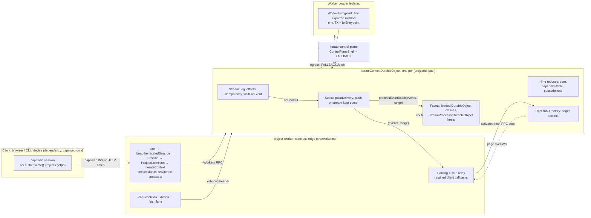
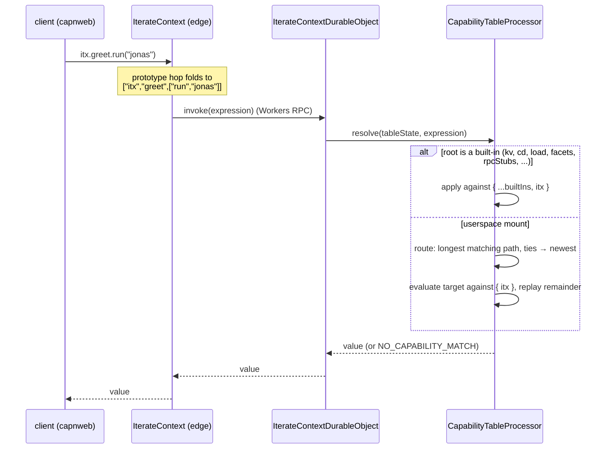
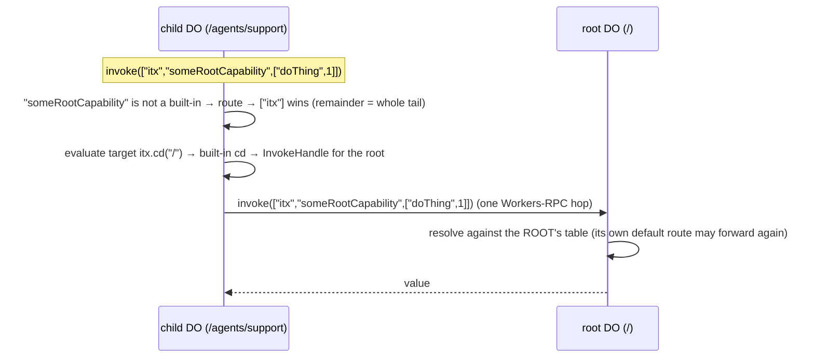

# The clean-room Iterate Context: API and code-structure walkthrough

> Current as of the onion steps 0–5 (2026-09-02) on `wip/kernel-wayfinder-2026-07-30`.
> Package: `packages/v3/project-worker`. Every interface below is transcribed from
> source; file paths are given so you can check. The design these steps
> implemented is `docs/design-onion-subscriptions-processors.md`; the tutorial
> that builds the same system from nothing is
> `docs/tutorial-build-the-iterate-context.md`.
>
> Older documents in this package (`ARCHITECTURE.md`, `docs/iterate-context.md`,
> `ITX-KERNEL-SHAPE.md`, `docs/state-of-play.md`) describe earlier shapes and
> carry a banner pointing here. Read them as history.

---

## 1. The picture in one screen

Three primitives, one worker, one Durable Object class, and an onion of layers
on top of the stream.

- **The context.** A capability surface you call with dotted paths, in both
  directions: a client calls the project (`itx.kv.get('x')`), and the project
  calls back into the client (a callback you handed over with `provide`).
- **Fetch.** In both directions: any capability can be a web server (reached via
  a terminal `.fetch(request)`), and every outbound fetch from project code is
  egress with `{{secret:project:NAME}}` substitution.
- **The stream.** One append-only log per context. Three inline reduces fold it
  at the commit point (`core`, `capability-table`, `subscriptions`); one
  delivery loop hands every commit to the subscriptions; a processor is a
  Durable Object class hosted as a facet and subscribed to the log.

Every context is one `IterateContextDurableObject`, named by the codec
`{projectId}.iterate{path}` (`prj_demo.iterate/` is the project root,
`prj_demo.iterate/agents/support` a child). The stateless worker at `/api` is
the only place capnweb terminates. It reaches the DO over Workers RPC. Loaded
userspace code runs in Worker Loader isolates or as facets of the DO, and its
entire world is one binding, `env.ITX`.



---

## 2. File map

The tree is laid out by primitive, one folder per chapter of the tutorial.

```text
packages/v3/project-worker/
  wrangler.jsonc                 bindings: CONTEXT (DO), LOADER, ITX_KV, SECRETS_KV,
                                 CF_VERSION_METADATA, FALLBACK (service → ControlPlaneShell)
  build-sdk.mjs                  bundles src/sdk/index.ts → generated/processor-sdk.ts (processor.js),
                                 client/demo.tsx → generated/demo-page.ts
  src/
    worker.ts                    THE EDGE. default fetch routes /api /cap /demo /version.
                                 Exports DummyControlPlane, ItxEntrypoint, IterateContextDurableObject.
    session.ts                   UnauthenticatedSession → Session → ProjectCollection (the gate + catalog)
    iterate-context.ts           IterateContext, the client-facing RpcTarget: axioms + sugar
    iterate-context-durable-object.ts  THE CONTEXT DO: stream + inline reduces + delivery + facets +
                                 transport + the fetch doors. One class, ~700 lines.
    itx-entrypoint.ts            ItxEntrypoint: what a loaded worker's env.ITX is
    context/                     chapter 1 — capabilities, called in both directions
      built-ins.ts               the kernel roots: whoami, kv, append, read, cd, fetch, rpcStubs,
                                 facets, subscriptions, load, runScript
      capability-table.ts        the mount table as a reduce-only processor: resolve / route /
                                 provide / revoke / resolveFetch
      expression.ts              the codec: "itx.a.b(1)" ⇄ ["itx","a",["b",1]]
      dispatch.ts                match(path, call), evaluate / apply / invokePath
      dotted-path-proxy.ts       the prototype hop: unknown dotted members fold into ONE
                                 invokeCapability(expression)
      invoke-handle.ts           InvokeHandle + the two brands FacetHandle / RpcStubHandle
      rpc-stub-directory.ts      the live transport table: key → pager socket; presence events
      rpc-stub-relay.ts          edge side: Parking, startRpcStubRelay
      hibernatable-rpc-stub.ts   the stub pager WebSocket + HibernatableRpcStubManager
      worker-loader.ts           confinedWorker, loadConfinedWorker, versionedFacet, WorkerSource
      durable-object-names.ts    DurableObjectNameCodec, resolveContextPath, canonicalName
    fetch/                       chapter 2 — fetch, in both directions
      fetch-capabilities.ts      fetch-shaped capabilities, the x-itx-cap lane, the 101 tunnel
                                 (fenced WORKAROUND, delete-day checklist inside)
    stream/                      chapter 3 — the log and what folds it
      stream.ts                  Stream (the commit pipeline), Context interface, localContext
      events.ts                  StreamEventInput / StreamEvent (zod), defineProcessorContract
      processor.ts               StreamProcessor (the pure author class), ProcessorEngine, consumesEvent
      reduce-checkpoint.ts       the one persisted reduce-checkpoint shape
      inline-reduces.ts          InlineReduces: hosts reduce-only processors AT the commit point
      core-processor.ts          the core inline reduce: pause, breaker, incarnation
      subscriptions.ts           the subscriptions table: four events, one reduce, configure/remove
      subscription-delivery.ts   THE ONE DELIVERY LOOP: push to a facet or live stub, else a
                                 stream-kept cursor with a bounded retry ladder
      live-state.ts              LiveState<S>: revision chain + diff → ephemeral delta event
    sdk/                         what userspace imports from "./processor.js"
      index.ts                   the export list
      stream-processor-durable-object.ts  StreamProcessorDurableObject: the host, `processor = new X()`
    lib/                         errors.ts  logs.ts  hash.ts  patch.ts (diff / applyPatch)
    client/
      live-state-store.ts        pure store: seed + deltas → current state
      live-state-client.ts       connectLiveState(itx, { key, door, ... })
      react.tsx                  useLiveState hook
      demo.tsx                   the hosted /demo page
    generated/                   build outputs (committed; rebuilt by build-sdk.mjs)
  e2e/                           `pnpm e2e` — the real worker, booted ONCE (support/global-setup.ts),
                                 every <primitive>-<claim>.e2e.test.ts speaks capnweb at /api through
                                 support/client.ts (the whole client surface a test uses)
  __workers-tests__/             `pnpm test` workers project — @cloudflare/vitest-plugin, runs INSIDE
                                 workerd for the hibernation cases that need its controls
  specs/                         `pnpm spec` — Playwright drives the hosted /demo page
../control-plane-shell/src/index.ts   ControlPlaneShell: fetch (platform secrets → internet),
                                 invokeCapability (stub), default fetch /emit writes into a
                                 project's context
../shared/src/egress.ts          substituteHeaderSecrets({{secret:<scope>:NAME}})
```

Unit-lane tests (`pnpm test`, in-process node) sit next to their subject
(`context/dispatch.test.ts`) and share one `stream/test-support.ts` (the
in-memory stream and storage fakes); the workers lane shares
`__workers-tests__/support.ts`. Everything that needs the real worker is in
`e2e/`, one file per primitive-and-claim, on one shared worker; its client is
`e2e/support/client.ts`. A file's name says what it proves — there are no
"failing" files; an expected failure is a `test.fails` inside a plainly named
file.

---

## 3. Reaching a context

The client's only dependency is the capnweb fork (`npm:@iterate-com/capnweb`,
imported as `capnweb`). There is no client SDK. The session shape is apps/os's.

```ts
import { newWebSocketRpcSession, newHttpBatchRpcSession } from "capnweb";

using api = newWebSocketRpcSession("wss://<worker>/api");
const itx = api.authenticate().projects.get("prj_demo"); // the project ROOT, path "/"
const agent = itx.cd("/agents/x"); // a context within the project
const inbox = agent.cd("../inbox"); // relative resolves; absolute by convention

// One-shot and socketless (CLI, cron): every call chained off the session flushes as ONE POST.
// A batch session cannot hold live callbacks (nothing outlives the response).
const cli = newHttpBatchRpcSession("https://<worker>/api").authenticate().projects.get("prj_demo");
```

`projects.get` takes a project id (the root context's full name is accepted too);
a non-root context name is refused, reach those with `cd`. One
session may hold contexts of many projects; the session's `Parking` is keyed by
canonical context name plus capability path, so they never touch each other's
relays.

Every call has two spellings, and both land on the same door:

```ts
await itx.kv.get("greeting"); // dotted sugar
await itx.invokeCapability("itx.kv.get('greeting')"); // string expression
await itx.invokeCapability(["itx", "kv", ["get", "greeting"]]); // structured expression
```

The dotted sugar works because `IterateContext.prototype` carries a prototype
hop (`src/context/dotted-path-proxy.ts`): a member the class does not declare
becomes an accumulating path, and the final call folds everything into one
`invokeCapability([...])`. The structured form is the only one that can carry
non-JSON args (a callback function, a Date, bytes, a `Request`).

---

## 4. The client-facing interfaces

### 4.1 The gate and the catalog (what `/api` hands you)

`src/session.ts`

```ts
class UnauthenticatedSession extends RpcTarget {
  /** THE introduction door. A no-op today; the one place a real credential check lands
   *  without changing any caller (clients already spell `api.authenticate(creds)`). */
  authenticate(credentials?: unknown): Session;
  /** capnweb calls this when the session ends: every relay parked by this session is torn
   *  down, and every unnamed subscription it made is removed. */
  [Symbol.dispose](): void;
}

class Session extends RpcTarget {
  /** The project catalog. A getter, not a field: capnweb exposes prototype members only. */
  get projects(): ProjectCollection;
}

class ProjectCollection extends RpcTarget {
  /** Pure addressing → that project's ROOT context ("/"). Nothing is minted until the context
   *  is first written to. A project id only; a context name belongs to `cd`. */
  get(projectId: string): IterateContext;
}
```

### 4.2 `IterateContext` (the `itx` you hold)

`src/iterate-context.ts`. The class body is two banded sections. The AXIOMS are
the doors that need the edge (a session-held stub, a live Request, the fold);
everything else is SUGAR: one-line compositions of the axioms that append no
event shape of their own. Every method forwards to the context DO over Workers
RPC; the DO owns every contract.

```ts
class IterateContext extends RpcTarget {
  // ── AXIOMS ──
  /** Another context of the SAME project. Absolute by convention ("/agents/x"); relative
   *  ("agents/x", "../inbox") resolves against this context's path. Pure addressing. */
  cd(path: string): IterateContext;

  /** THE ONE dispatch door. A dotted string or the parsed array. ONE routing rule: a call whose
   *  terminal step is `fetch(request)` with a live Request rides the DO's fetch channel (so a 101
   *  comes back); everything else is `invoke`. */
  invokeCapability(call: ItxExpression): Promise<unknown>;

  // the stream verbs, flattened onto itx
  append(...events: StreamEventInput[]): Promise<StreamEvent[]>;
  /** afterOffset default 0, limit default 500. Non-minting: reading a virgin stream leaves it
   *  virgin. `scannedThroughOffset` is the contiguity cursor to chain: a full page's last row, a
   *  short page's DURABLE mark (never the in-memory head — ephemeral offsets are not proven). */
  read(
    afterOffset?: number,
    limit?: number,
  ): Promise<{ events: StreamEvent[]; scannedThroughOffset: number }>;
  /** Next matching event (default afterOffset = head at call time). 30s default timeout, 120s cap,
   *  rejects with code WAIT_TIMEOUT. */
  waitForEvent(filter?: WaitForEventFilter): Promise<StreamEvent>;

  /** Egress through the context: {{secret:project:NAME}} substituted in the DO, then FALLBACK. */
  fetch(request: Request): Promise<Response>;

  /** The live-stub registry, edge half: `provide(value, { key })` parks a capnweb value for the
   *  session (DON'T-PIN relay); `get(key)` / `list()` fold onto the DO's built-in; `close(key)`. */
  get rpcStubs(): RpcStubs;

  // ── SUGAR ──
  /** THE ONE provide door. `target` is EITHER an itx expression (a durable mount:
   *  `capability-provided { path, target }`, string at rest, same-path mounts shadow, newest wins)
   *  OR a live capnweb value (function | RpcTarget): parked under `path` in rpcStubs, then the
   *  ordinary mount `path ⇒ itx.rpcStubs.get('<path>')` is appended. Re-providing a live value
   *  re-parks (reconnect) and appends nothing. */
  provide(
    path: string,
    target: ItxExpression | ProviderStub,
  ): Promise<{ providedAtOffset: number }>;
  /** Pop a mount: by path (the newest winner at that exact path; what it shadowed is restored) —
   *  this also closes THIS session's parked stub under that path — or by identity. */
  revoke(input: string | { providedAtOffset: number }): Promise<void>;

  /** Subscribe a target to the log (the subscriptions layer's ONE event,
   *  `subscription-configured`). `target` is an itx expression whose terminal is callable with
   *  `(events, range)`, or a live callback (parked under `itx.subscriptions.<name>`). No name ⇒
   *  `sub-<8hex>`, removed when the session ends. Identical re-subscribe appends nothing. */
  subscribe(input: {
    name?: string;
    target: ItxExpression | ProviderStub;
    consumes?: string[];
  }): Promise<{ name: string }>;
  /** Appends `subscription-removed`; a stream-kept cursor goes with it; this session's parked
   *  callback under the name is closed. */
  unsubscribe(name: string): Promise<void>;

  /** Host `className` (the StreamProcessorDurableObject host exported by `source`) as the facet
   *  named `name` and subscribe its `processEventBatch`. Literally
   *  subscribe({ name, target: itx.load(source).getDurableObjectClass(className).get(name).processEventBatch, consumes }). */
  enableProcessor(
    name: string,
    ref: { source: WorkerSource; className: string; consumes?: string[] },
  ): Promise<{ name: string }>;
  /** unsubscribe(name) + delete the facet, storage included: a re-enable is a clean rebuild. */
  disableProcessor(name: string): Promise<void>;

  // ── everything else ──
  /** Any undeclared dotted access folds into invokeCapability: itx.kv.get(k), itx.cd('/x').read(),
   *  itx.facets.get('tally').snapshot(), itx.myCap.hello(), itx.site.fetch(request). */
  [dotted: string]: unknown;
}
```

Semantics worth knowing:

- `provide` with a live value parks the stub **first**, then appends the mount,
  so the event records a capability that can already serve. If the DO refuses
  the mount, the relay is disposed again.
- `provide` with an expression target is idempotent too: the same target at the
  same path answers the existing `providedAtOffset` and appends nothing.
  `revoke(path)` with no mount at that path throws.
- Presence (which live keys have an open transport) is `itx.rpcStubs.list()`,
  never the capability table. The table is pure data.
- Mounts carry nothing but `{ path, target }`. Delivery policy, processor
  hosting, and lanes are gone from the mount event; those live in the
  subscriptions layer (section 6).

### 4.3 The types those methods use

`src/context/expression.ts`

```ts
/** One step: a property read, or a call with JSON args. */
type Step = string | [method: string, ...args: unknown[]];
/** A call written as data: the scope root ("itx") then steps. */
type Expression = Step[];
/** Either codec half: "itx.facets.get('core')" or ["itx","facets",["get","core"]]. */
type ItxExpression = string | Expression;
/** A mount's left side: dotted names only, no calls. */
type CapabilityPath = string[];
```

`src/stream/events.ts`

```ts
type StreamEventInput = {
  /** Convention: events.iterate.com/<domain>/<fact>. Any non-empty string is accepted. */
  type: string;
  payload?: Record<string, unknown>;
  metadata?: Record<string, unknown>;
  /** Provenance, stamped by the engine when a processor appends. */
  source?: {
    processor?: {
      slug: string;
      version: string;
      whileProcessing?: { offset: number; type: string };
    };
  };
  /** Same key + same body → the existing event is returned; different body → IDEMPOTENCY_CONFLICT. */
  idempotencyKey?: string;
  /** Rides to subscribers that name its type, takes an offset, is NEVER persisted and costs NO
   *  write. Cannot carry an idempotencyKey. */
  ephemeral?: true;
};

/** A committed event: the input plus the identity the stream assigned. */
type StreamEvent = StreamEventInput & { offset: number; createdAt: string; path: string };
```

`src/stream/stream.ts`

```ts
type WaitForEventFilter = { type?: string; afterOffset?: number; timeoutMs?: number };
/** What read() returns on every hop. */
interface StreamPage {
  events: StreamEvent[];
  scannedThroughOffset: number;
}
```

`src/stream/processor.ts`

```ts
/** The contiguity proof a delivery carries: the half-open offset window (after, through]. */
type ScannedRange = { after: number; through: number };
```

`src/context/rpc-stub-relay.ts`

```ts
/** A live capnweb value you hand to provide/subscribe: a function or an RpcTarget instance. */
type ProviderStub = unknown;
```

### 4.4 The built-in roots (what `itx.<root>` resolves to on the DO)

`src/context/built-ins.ts`. These are the kernel. A call `itx.<root>...` whose
root is one of these resolves **directly**, before the capability table is
consulted, so they cannot be shadowed. Everything else goes to the table
(section 9.1).

```ts
interface BuiltInScope {
  /** Identify this context. */
  whoami(): { projectId: string; path: string };

  /** Project-prefixed durable key/value. The `${projectId}:` prefix IS the isolation. */
  kv: {
    get(key: string): Promise<string | null>;
    put(key: string, value: string): Promise<{ ok: true }>;
    delete(key: string): Promise<{ ok: true }>;
    list(prefix?: string): Promise<{ keys: string[] }>;
  };

  /** This context's log. Same commit pipeline as IterateContext.append / read. */
  append(...events: StreamEventInput[]): Promise<StreamEvent[]>;
  read(
    afterOffset?: number,
    limit?: number,
  ): Promise<{ events: StreamEvent[]; scannedThroughOffset: number }>;

  /** Another context of the same project, routed through ITS table. Same resolver as the edge cd.
   *  Own path → same isolate; anything else → a Workers-RPC call to that DO. */
  cd(path: string): InvokeHandle;

  /** Egress: {{secret:project:NAME}} substituted, then FALLBACK — the same terminal a loaded
   *  worker's globalOutbound lands on. */
  fetch(request: Request): Promise<Response>;

  /** The live rpc-stub REGISTRY — physical, never event-sourced. `get(key)` is how a mount names a
   *  parked value; offline ⇒ CONNECTION_OFFLINE at call time. `list()` is presence. */
  rpcStubs: {
    get(key: string): RpcStubHandle;
    list(): string[];
  };

  /** Address a facet that is ALREADY RUNNING by name (a processor, a named instance); reaches
   *  any method the facet's object exposes. `delete` removes it, storage included. */
  facets: { get(name: string): FacetHandle; delete(name: string): void };

  /** The subscriptions layer, read: the table (an inline reduce) joined with the stream-kept cursors. */
  subscriptions: {
    list(): SubscriptionListEntry[];
    get(name: string): SubscriptionListEntry | null;
  };

  /** Load code → a WORKER, then pick the host (mirror of Cloudflare's Worker Loader). */
  load(source: WorkerSource): {
    /** A stateless WorkerEntrypoint isolate: ANY method it exports, by name. `props` is
     *  Cloudflare's WorkerStubEntrypointOptions.props, read back as this.ctx.props. */
    getEntrypoint(className?: string, opts?: { props?: unknown }): InvokeHandle;
    /** A DurableObject class hosted as a durable FACET of this context (own storage).
     *  `.get()` with no name is named by the class. */
    getDurableObjectClass(className: string): { get(name?: string): FacetHandle };
  };

  /** Sugar for a bare lambda string: wraps it into a WorkerEntrypoint and runs
   *  load(...).getEntrypoint().run(...). The lambda receives (itx, ...args). */
  runScript(script: string, ...args: unknown[]): Promise<unknown>;
}

/** Where code comes from: an itx expression that evaluates to module source(s), a bare
 *  string, or inline files. "itx.kv.get('src/greet.js')" is the common shape. */
type WorkerSource = string | Expression | { type: "inline"; files: Record<string, string> };

type SubscriptionListEntry = {
  name: string;
  target: string; // the expression, printed
  consumes?: string[];
  configuredAtOffset: number;
  /** Present ONLY when the stream keeps the cursor (a target that cannot own its progress). */
  cursor?: { confirmedOffset: number; attempt: number; nextAttemptAtMs?: number };
  halted?: { afterOffset: number; attempts: number; error?: string };
};

// cd and getEntrypoint return a plain InvokeHandle (context/invoke-handle.ts): a real RpcTarget
// whose unknown dotted members fold into one dispatch, so the chain pipelines over every lane.
// FacetHandle and RpcStubHandle are InvokeHandle SUBCLASSES — brands the delivery loop reads
// (section 6). Spell whatever the target exposes.
```

Two rules that follow from the resolver:

- A provided target must be rooted at `itx` (`itx.provide("itx.greet", "itx.kv.get")`
  is legal; `"kv.get"` is rejected). Userspace can only reach a root by recursing
  through the `itx` symbol.
- The path `itx` by itself is the shortest legal mount path and acts as a
  default route: it claims any call whose root is not a built-in. This is how
  ancestry is spelled (section 9.4).

### 4.5 Facets you can address, and the three always-on inline reduces

`itx.facets.get(name)` walks the facet's object. For a processor facet the
doors are those of `StreamProcessorDurableObject` (section 5.3): `snapshot`,
`liveSnapshot`, `waitUntilProcessed`, `wake`, `processEventBatch`. For a loaded
`DurableObject` class hosted as a facet, every method the class defines is
reachable the same way, and a terminal `.fetch(request)` rides the facet's own
fetch channel (so a 101 works).

Three reduce-only processors are always on and run **inline** in the commit
transaction. They have no facet, but `snapshot()`, `liveSnapshot()` and
`waitUntilProcessed()` (always `{ ok: true }`) are exposed through the same door (they publish `live-state/changed` deltas like any
processor, keyed by their slug), and their names are reserved (a subscription
may not take them):

```ts
// itx.facets.get('core').snapshot().state
type CoreState = {
  incarnation?: number; // grows across hibernation wakes
  paused: { reason: string } | null;
  breaker: { capacity: number; refillPerSecond: number; tokens: number; lastAtMs: number } | null;
};

// itx.facets.get('capability-table').snapshot().state   (contract 5.0.0)
type CapabilityTable = {
  mounts: Array<{
    path: string[]; // ["itx","greet"]
    target: Expression; // always present; a live stub's is itx.rpcStubs.get('<path>')
    providedAtOffset: number; // the mount's identity
  }>;
};

// itx.facets.get('subscriptions').snapshot().state
type SubscriptionsState = {
  subscriptions: Record<
    string,
    {
      target: Expression;
      consumes?: string[];
      configuredAtOffset: number;
      halted?: { afterOffset: number; attempts: number; error?: string };
      resumed?: { afterOffset?: number; atOffset: number };
    }
  >;
};
```

There is no separate status verb anywhere: presence is `itx.rpcStubs.list()`,
enabled processors are `itx.subscriptions.list()` entries whose target ends in
`.processEventBatch`, and a halted delivery is a `halted` field.

---

## 5. Writing code that runs inside a context

A loaded isolate receives exactly two things: `env.ITX` (a stub of
`ItxEntrypoint`, section 8) and a `globalOutbound` that routes every `fetch()`
through the context's egress. The processor SDK is injected as `./processor.js`
into every load, so `import { ... } from "./processor.js"` always works.

### 5.1 A stateless entrypoint

```ts
// stored with itx.kv.put("src/greet.js", ...)
import { WorkerEntrypoint } from "cloudflare:workers";
export default class Greeter extends WorkerEntrypoint {
  async run(name) {
    const itx = await this.env.ITX.get(); // the real IterateContext scope, pipelinable
    await itx.append({ type: "greeted", payload: { name } });
    return `hi ${name}`;
  }
  async fetch(request) {
    return new Response("hello");
  } // makes this a fetch-shaped capability
}
```

```ts
await itx.load("itx.kv.get('src/greet.js')").getEntrypoint().run("jonas");
await itx.provide("itx.greet", "itx.load(\"itx.kv.get('src/greet.js')\").getEntrypoint()");
await itx.greet.run("jonas"); // now reachable by name, through the table
const res = await itx.greet.fetch(new Request("https://x/")); // its fetch: the terminal-fetch rule

// the bare-lambda sugar
await itx.runScript("async (itx, n) => (await itx.kv.get('counter')) ?? n", 0);
```

A stateless entrypoint cannot own progress, so subscribing one is the
at-least-once case (section 6):

```ts
await itx.provide("itx.digest", "itx.load(\"itx.kv.get('src/digest.js')\").getEntrypoint()");
await itx.subscribe({ name: "digest", target: "itx.digest.processEventBatch", consumes: ["mark"] });
```

### 5.2 A durable class hosted as a facet

```ts
// stored with itx.kv.put("src/counter.js", ...)
import { DurableObject } from "cloudflare:workers";
export class CounterDurableObject extends DurableObject {
  async bump() {
    const n = ((await this.ctx.storage.get("n")) ?? 0) + 1;
    await this.ctx.storage.put("n", n);
    return n;
  }
}
```

```ts
const src = "itx.kv.get('src/counter.js')";
await itx.load(src).getDurableObjectClass("CounterDurableObject").get("c1").bump(); // 1
await itx.facets.get("c1").bump(); // 2, same instance, no source
await itx.provide(
  "itx.counter",
  `itx.load(${JSON.stringify(src)}).getDurableObjectClass('CounterDurableObject').get('c1')`,
);
await itx.counter.bump(); // 3
```

A facet keeps its storage across restarts; a source change restarts it in
place (`versionedFacet`). The class is minted with `props: { contextName, name }`,
readable as `this.ctx.props`. A busy stateful facet pins its context DO awake,
an accepted trade. Facets have no alarms (workerd#6810); a future "append at
this time" primitive on the context is the planned replacement, not a proxy.

### 5.3 A stream processor

A processor is two classes. The processor itself is **pure**: a class extending
`StreamProcessor` with a contract and three hooks, constructed with `new` and
nothing else, so a unit test calls its `reduce` directly. Its **host** is a
`DurableObject` extending `StreamProcessorDurableObject` with one field,
`processor = new PresenceProcessor()`, hosted exactly like the counter above; the host
knows how to fold the log. The names follow the base class: a processor class
ends in `Processor`, a Durable Object class in `DurableObject`. `src/sdk/index.ts`
is the whole userspace SDK, bundled into `./processor.js`:

```ts
export { StreamProcessor }; // + ProcessorContract, ReduceArgs, ProcessEventArgs, ScannedRange, ...
export { StreamProcessorDurableObject, type StreamProcessorProps, type ItxBinding };
export { defineProcessorContract, StreamEvent, StreamEventInput, jsonEqual };
export { z } from "zod";
export { newHttpBatchRpcSession, newWebSocketRpcSession } from "capnweb";
export { applyPatch, diff, type PatchOp };
export { LiveState, type LiveStateSink };
```

The author class, `src/stream/processor.ts`:

```ts
abstract class StreamProcessor<State> {
  abstract readonly contract: ProcessorContract<State>;
  /** Pure. Return the NEXT state (a new object), or null/undefined to keep the current. */
  reduce(args: ReduceArgs<State>): State | null | undefined;
  /** Side effects. Synchronous by design; register async work via the two helpers in args. */
  processEvent(args: ProcessEventArgs<State>): undefined;
  /** The live projection clients see. Default: the reduced state verbatim. Re-projected after
   *  EVERY batch, so a runtime field bumped inside processEvent publishes on its own. */
  projectLiveState(state: State): unknown;
  /** `${slug}/${key}`, or `${slug}/${key}@${offset}` with `whileProcessing`. */
  idempotencyKey(key: string, whileProcessing?: StreamEvent): string;
}
```

The host, `src/sdk/stream-processor-durable-object.ts`:

```ts
type StreamProcessorProps = { contextName: string; name: string };

abstract class StreamProcessorDurableObject<
  State = unknown,
  Env extends { ITX: ItxBinding } = { ITX: ItxBinding },
> extends DurableObject<Env, StreamProcessorProps> {
  /** The processor this object hosts — `processor = new PresenceProcessor()` at the top of the subclass. */
  abstract readonly processor: StreamProcessor<State>;

  // ── what you reach ──
  protected readonly context: { projectId: string; path: string; name: string }; // from ctx.props
  protected readonly name: string; // facet name = subscription name = .get(name)
  protected get itx(): Promise<unknown>; // the owning context's scope (env.ITX.get())
  protected publishLiveState(): void; // after a runtime field moved OUTSIDE a batch (an RPC method)

  // ── the doors the delivery loop and itx.facets.get(name) reach ──
  processEventBatch(events: StreamEvent[], range: ScannedRange): Promise<void>;
  wake(): Promise<void>;
  snapshot(): Promise<{ offset: number; state: State }>;
  liveSnapshot(): Promise<{ rev: number; state: unknown }>;
  /** The barrier: processed at least through `offset` (default timeout 10s). An offset above the
   *  durable mark (an ephemeral's) is reached only if this processor was pushed it. */
  waitUntilProcessed(input: { offset: number; timeoutMs?: number }): Promise<void>;
  // NEVER define alarm(): facets have none.
}
```

The engine underneath — `ProcessorEngine` in `src/stream/processor.ts` — is
built by the host on first use over the facet's kv and `env.ITX`, and by a test
over the in-memory stand-ins in `src/stream/test-support.ts`
(`new ProcessorEngine(new PresenceProcessor(), { stream, storage })`). Its types:

```ts
type ProcessorContract<State> = {
  slug: string;
  /** Bumping re-reduces from offset 0 (reduce only; side effects never re-run). */
  version: string;
  description?: string;
  /** Types to react to, or "*" for every DURABLE event. Ephemerals only when named. */
  consumes: readonly string[];
  /** What this processor's own append may emit. */
  emits: readonly string[];
  initialState: () => State;
};

/** zod schemas in, ProcessorContract + buildEvent out. stateSchema must parse {}. */
function defineProcessorContract<S extends z.ZodType>(c: {
  slug: string;
  version: string;
  description: string;
  stateSchema: S;
  events: Record<string, { description?: string; payloadSchema: z.ZodType }>;
  consumes: readonly string[];
  emits: readonly string[];
}): ProcessorContract<z.infer<S>> & { stateSchema: S; buildEvent(e): StreamEventInput };

type ReduceArgs<State> = { event: StreamEvent; state: State };
type ProcessEventArgs<State> = {
  /** null on the eventless at-head pass. */
  event: StreamEvent | null;
  state: State;
  previousState: State;
  /** Validated against `emits`, provenance-stamped. */
  append: (...events: StreamEventInput[]) => Promise<StreamEvent[]>;
  /** Hold the cursor until work settles (FIFO with other blockers of the same event). */
  blockProcessorWhile: (work: () => Promise<unknown>) => void;
  /** Fire-and-forget; may overtake later events; outcome must be state-recoverable. */
  runInBackground: (work: () => Promise<unknown>) => void;
  delivery: { caughtUp: boolean };
};
```

The three built-ins (`core`, `capability-table`, `subscriptions`) are the same
`StreamProcessor` class, hosted INLINE at the commit point instead of in a facet:
only their `reduce` is ever called, and `InlineReduces` refuses a processor that
overrides `processEvent` (its effects would silently never run).

A complete userspace processor (this is the one the `/demo` page loads):

```ts
import {
  StreamProcessor,
  StreamProcessorDurableObject,
  defineProcessorContract,
  z,
} from "./processor.js";

const contract = defineProcessorContract({
  slug: "presence",
  version: "1.0.0",
  description: "Reduced tick count beside a runtime lastPokeMs.",
  stateSchema: z.object({ ticks: z.number().default(0) }),
  events: {},
  consumes: ["tick", "poke"],
  emits: [],
});

// The processor: pure. `new PresenceProcessor().reduce({ event, state })` is a unit test.
class PresenceProcessor extends StreamProcessor {
  contract = contract;
  #lastPokeMs = 0; // runtime: a field, not reduced state — gone with the host, never refolded
  reduce({ event, state }) {
    if (event.type === "tick") return { ...state, ticks: state.ticks + 1 };
  }
  processEvent({ event }) {
    if (event?.type === "poke") this.#lastPokeMs = Date.now(); // published at batch end
  }
  projectLiveState(state) {
    return { ticks: state.ticks, lastPokeMs: this.#lastPokeMs };
  }
}

// The host: one line. This is what `className` names.
export class PresenceDurableObject extends StreamProcessorDurableObject {
  processor = new PresenceProcessor();
}
```

```ts
await itx.kv.put("src/presence.js", PRESENCE_SRC);
await itx.enableProcessor("presence", {
  source: "itx.kv.get('src/presence.js')",
  className: "PresenceDurableObject",
  consumes: ["tick", "poke"], // what is SENT; the contract above says what is folded
});
await itx.append({ type: "tick" });
await itx.facets.get("presence").snapshot(); // { offset, state: { ticks: 1 } }
await itx.facets.get("presence").liveSnapshot(); // { rev, state: { ticks: 1, lastPokeMs: 0 } }
await itx.subscriptions.get("presence"); // { name, target: "itx.load(...).getDurableObjectClass('PresenceDurableObject').get('presence').processEventBatch", ... }
await itx.disableProcessor("presence"); // removes the subscription, deletes the facet + storage
```

How it is hosted: `enableProcessor` is nothing but a subscription whose target
is `itx.load(source).getDurableObjectClass(className).get(name).processEventBatch`.
The DO loads your module plus `processor.js` into one isolate, takes the HOST
class by name, and hosts it as a facet named `name` with `props: { contextName, name }`.
Every commit that carries an event the subscription consumes, the delivery loop
evaluates the target, sees a `FacetHandle`, and pushes
`processEventBatch(events, range)` to it (awaited, so the facet's batches stay
in order); the engine inside the facet keeps its own checkpoint and gap-repairs
from the log when a range does not chain. There is no runner module and no
host-side processor registry.

Testing a processor needs no worker: `new PresenceProcessor().reduce({ event, state })`
for the fold; for the effect rules (serial chain, blockers, at-head pass) build a
`ProcessorEngine` over `memoryStream()` / `memoryStorage()` from
`src/stream/test-support.ts`, the way `src/stream/processor.test.ts` does.

Two filters, in two places: the subscription's `consumes` decides what is
**sent** (absent means every durable event), the contract's `consumes` decides
what the engine **folds**. A processor that folds ephemerals must name them on
`enableProcessor` too, or they never reach it.

The DO remembers `{ source, className }` for each facet name in its own kv
(`facet:<name>`), which is how `itx.facets.get(name)` re-materializes a facet
after an eviction without the load expression in hand.

### 5.4 Live state for mini-apps, and the client side

A durable class that is not a processor can still publish live state:

```ts
import { DurableObject } from "cloudflare:workers";
import { LiveState } from "./processor.js";

export class ChatroomDurableObject extends DurableObject {
  #live = new LiveState(this.env.ITX, "chat", { messages: [] }); // sink, key, initial
  state() {
    return this.#live.snapshot();
  } // the seed door: { rev, state }
  post(who, text) {
    const cur = this.#live.get();
    this.#live.set({ messages: [...cur.messages, { who, text }] }); // diff → rev+1 → ephemeral delta
  }
}
```

```ts
class LiveState<S> {
  constructor(
    sink: {
      append(e: { type: string; ephemeral?: true; payload?: Record<string, unknown> }): unknown;
    },
    key: string,
    initial: S,
  );
  get(): S;
  snapshot(): { rev: number; state: S };
  /** Diff held → next; on a real change bump rev and append
   *  events.iterate.com/live-state/changed { key, from, to, patch } (ephemeral). Lossy by contract. */
  set(next: S): void;
}
```

A live-state watcher is an ordinary subscription that names the delta type:
`consumes: ["events.iterate.com/live-state/changed"]` (every key's deltas
arrive; filter `payload.key` client-side). `src/client/live-state-client.ts`
and `src/client/react.tsx` do exactly that:

```ts
function connectLiveState<S>(itx: LiveItx, opts: {
  key: string;
  name?: string;
  door: () => Promise<{ rev: number; state: S }>;   // e.g. () => itx.facets.get('presence').liveSnapshot()
  onResync?: (result: "healed" | Error) => void;
}): Promise<{ store: LiveStateStore<S>; dispose(): Promise<void> }>;

function useLiveState<S>(itx, { key, name?, door }): { value: S | undefined; rev: number | null; status: "connecting" | "live" | "error"; error?: string };
```

Subscribe happens before the first seed; a delta whose `from` does not match
the held rev triggers one single-flight re-read of the door.

### 5.5 Event conventions, control events, and the layer events

- Type strings follow `events.iterate.com/<domain>/<fact>`; anything non-empty
  is accepted, and short bare types like `"tick"` are fine in tests.
- `idempotencyKey`: same key and same body returns the existing event; a
  different body throws. Processors derive keys with `this.idempotencyKey(...)`.
- `ephemeral: true`: takes an offset from the shared sequence, is delivered to
  subscribers that name its type, is never persisted, never reaches an inline
  reduce, and **costs no write**: an ephemeral-only append does no transaction
  and does not move the high-water mark. The contract that buys this: an
  ephemeral's offset is unique within an incarnation; a later incarnation
  resumes from the last durable mark, and `stream/woken` (durable, first batch
  of each incarnation) marks the boundary. Every persisted checkpoint in the
  package advances only on a batch that carried a durable.
- Stream control is ordinary events read by the core reduce (inline):

```ts
await itx.append({ type: "events.iterate.com/stream/paused", payload: { reason: "maintenance" } });
await itx.append({ type: "events.iterate.com/stream/resumed" });
await itx.append({
  type: "events.iterate.com/stream/breaker-configured",
  payload: { capacity: 100, refillPerSecond: 1 },
});
await itx.append({ type: "events.iterate.com/stream/breaker-configured" }); // empty payload = breaker off
```

- The layers' own events, all plain appends you may read or write yourself:

| Event                                                           | Payload                                   | Written by                                         |
| --------------------------------------------------------------- | ----------------------------------------- | -------------------------------------------------- |
| `events.iterate.com/capability-table/capability-provided`       | `{ path, target }` (both strings)         | `provide`                                          |
| `events.iterate.com/capability-table/capability-revoked`        | `{ providedAtOffset }`                    | `revoke`                                           |
| `events.iterate.com/stream/subscription-configured`             | `{ name, target, consumes? }`             | `subscribe` / `enableProcessor`                    |
| `events.iterate.com/stream/subscription-removed`                | `{ name }`                                | `unsubscribe` / `disableProcessor`                 |
| `events.iterate.com/stream/subscription-delivery-halted`        | `{ name, afterOffset, attempts, error? }` | the delivery loop, after the ladder                |
| `events.iterate.com/stream/subscription-delivery-resumed`       | `{ name, afterOffset? }`                  | you, to un-halt and optionally seek                |
| `events.iterate.com/rpc-stub/attached` / `detached` (ephemeral) | `{ key }`                                 | the transport table, first/last transport of a key |
| `events.iterate.com/live-state/changed` (ephemeral)             | `{ key, from, to, patch }`                | `LiveState.set`                                    |
| `events.iterate.com/stream/woken`                               | `{ incarnation }`                         | the stream, first commit of an incarnation         |

Refusals surface as coded errors: `STREAM_PAUSED`, `STREAM_BREAKER_OPEN`,
`IDEMPOTENCY_CONFLICT`, `EPHEMERAL_IDEMPOTENCY_KEY`, `NO_CAPABILITY_MATCH`,
`NO_FACET`, `CONNECTION_OFFLINE`, `WAIT_TIMEOUT`, `NOT_A_METHOD`.

---

## 6. Subscriptions and the one delivery loop

`src/stream/subscriptions.ts` is the table (four events, one reduce,
`configure` / `remove` doors that append idempotently against the current
state). `src/stream/subscription-delivery.ts` is the loop, run from the
stream's post-commit hook. For every subscription it filters the batch by
`consumes`, evaluates the target expression, and asks the **value** what it is:

- A `FacetHandle` or an `RpcStubHandle` **owns its progress**: a facet keeps its
  own checkpoint and gap-repairs from the log; a live client owns its offset and
  heals a range gap with `read(through)`. It gets a push of
  `(events, { after, through })`, serialized per subscription: fire-and-forget
  for a live stub (a stalled tab never blocks the chain; `CONNECTION_OFFLINE`
  is swallowed), awaited for a facet (its batches stay in order and the idle
  quiesce never aborts it mid-reduce). No cursor row either way.
- Anything else (a Worker-Loader entrypoint, a sibling context via `cd`, a
  mount alias to one) cannot own progress, so **the stream keeps a cursor**:
  at-least-once, the awaited call is the ack, one bounded retry ladder
  (1s·2ⁿ⁻¹ with ±20% jitter, capped at 30 min, 15 attempts; an error with
  `retryable: false` halts at once), then a `subscription-delivery-halted` fact.
  Retries ride the DO's own alarm, with a 20 s watchdog per attempt. The cursor
  is born at the subscription's `configuredAtOffset`, lives in memory, and is
  written to kv only at durable boundaries: a delivered batch that held a
  durable event, a ladder step, a halt, a resume. An ephemeral-only advance
  touches no storage.

Nothing reads a "kind" off an event: the kind is the evaluated value's brand,
minted by the built-in that produced it, so an alias classifies correctly
because it evaluates to the same handle. `consumes` has one rule
(`consumesEvent`, shared with the engine and the inline reduces): absent or `"*"`
means every durable event; naming a type opts it in, ephemerals included.

```ts
// a live tab
const { name } = await itx.subscribe({
  target: (events, range) => render(events),
  consumes: ["mark"],
});
// the stateless worker (stream-kept cursor)
await itx.subscribe({ name: "digest", target: "itx.digest.processEventBatch", consumes: ["mark"] });
(await itx.subscriptions.get("digest")).cursor; // { confirmedOffset, attempt, nextAttemptAtMs? }
// recovery from a halt, or a seek
await itx.append({
  type: "events.iterate.com/stream/subscription-delivery-resumed",
  payload: { name: "digest", afterOffset: 40 },
});
```

Per subscription the loop remembers the last `through` it handed over, so a
batch the filter skipped still rides inside the next delivered range and a push
subscriber's chain stays contiguous. A cursor target additionally receives
ephemerals when it is caught up (they ride the pushed batch), never when it is
behind.

Small print: a subscription name is one segment, `[A-Za-z0-9_-]+` (it doubles
as a facet name and a registry key tail). A resume's seek is clamped to the
stream head. An unnamed `subscribe` is removed when the session ends. The DO's
quiet clock is 60 s: an alarm that finds no delivery or facet call in flight
and no activity for a minute aborts every live facet and disposes paged-in
stubs; the next call re-materializes them (a `facets.delete` that lands while a
facet's source is loading wins: the load refuses with `NO_FACET` instead of
resurrecting an orphan), and a never-written context with no live facet arms no
alarm at all. Configuring a subscription drops whatever the loop remembered under
that name (the old target's cursor included) and wakes a facet target at once,
as the head of that name's push chain. Re-subscribing a HALTED row with the same
target un-halts it and restarts from now; to replay from the halt point, append
`subscription-delivery-resumed` instead.
A delivery-resumed that lands while an attempt is in flight is applied before
any halt or backoff.

---

## 7. The Durable Object's Workers-RPC surface (host level)

`src/iterate-context-durable-object.ts`. You do not call this directly as a
client, but this is the skeleton everything above forwards to. `IterateContext`
calls the verbs; the edge relay calls the transport verbs; facets reach the
context only through `env.ITX`.

```ts
class IterateContextDurableObject extends DurableObject<BuiltInsEnv> {
  // ── the stream ──
  append(...inputs: StreamEventInput[]): Promise<StreamEvent[]>;
  read(
    afterOffset?: number,
    limit?: number,
  ): { events: StreamEvent[]; scannedThroughOffset: number };
  waitForEvent(filter?: WaitForEventFilter): Promise<StreamEvent>;

  // ── dispatch: ONE door ──
  /** parse → built-in-first / longest-path mount → evaluate → replay remainder. */
  invoke(call: ItxExpression, depth?: number): Promise<unknown>;

  // ── the capability table (pure data) ──
  provideCapability(input: {
    path: string;
    target: ItxExpression;
  }): Promise<{ providedAtOffset: number }>;
  revokeCapability(input: { providedAtOffset?: number; path?: string }): Promise<void>;

  // ── the subscriptions table ──
  configureSubscription(input: {
    name: string;
    target: ItxExpression;
    consumes?: string[];
  }): Promise<{ name: string; configuredAtOffset: number }>;
  removeSubscription(name: string): Promise<void>;

  // (facets have no public verb: they are reached through `invoke` → the `facets` built-in and
  //  the load chain; the resolve-walk-apply door behind both is private)

  // ── doors the edge relay calls (the hibernatable stub dance) ──
  rpcStubAttach(input: { key: string }): { transportId: string }; // refused unless already canonical
  rpcStubActivate(input: { transportId: string; invoker: unknown }): unknown;
  /** In-memory socket facts { stubs, pagedIn, pagesPending, dormant }. Not on the itx surface. */
  transportState(): Record<string, unknown>;

  // ── native platform entry points ──
  /** Ordered partial-fetch walk: x-itx-stub-pager (pager WS) → x-itx-fetch-upgrade (live-cap 101
   *  leg) → x-itx-cap (the fetch lane) → else EGRESS: {{secret:project:NAME}} substitution then
   *  FALLBACK.fetch. */
  fetch(request: Request): Promise<Response>;
  /** The cursor retry pump, then idle quiesce (aborts idle facets, disposes paged-in stubs). */
  alarm(): Promise<void>;
  webSocketMessage(ws: WebSocket, message: string | ArrayBuffer): void;
  webSocketClose(ws: WebSocket, code: number, reason: string): void;
  webSocketError(ws: WebSocket): void;
}
```

A facet's answer arrives as a Workers-RPC result object, which holds a reference
on the facet until disposed; the private facet door copies the data out and
disposes it at once (an undisposed `snapshot()` result once kept an aborted facet,
and with it the whole DO, pinned until garbage collection).

What one context reaches another through, `src/stream/stream.ts`:

```ts
/** What itx.cd(path) routes through. A sibling DO stub satisfies it structurally; the own DO
 *  is wrapped by localContext(). */
interface Context {
  append(...events: StreamEventInput[]): Promise<StreamEvent[]>;
  read(
    afterOffset?: number,
    limit?: number,
  ): Promise<{ events: StreamEvent[]; scannedThroughOffset: number }>;
  invoke(call: ItxExpression): Promise<unknown>;
}
```

---

## 8. Worker entrypoints, DO classes, bindings

| Export (from `src/worker.ts`) | Kind                                                                                   | Surface                                                                                                                                                                                  |
| ----------------------------- | -------------------------------------------------------------------------------------- | ---------------------------------------------------------------------------------------------------------------------------------------------------------------------------------------- |
| `default`                     | module worker `fetch`                                                                  | `/api` (capnweb: WS or one-shot HTTP batch → `UnauthenticatedSession`), `/cap?context=<id or name>&cap=<expr>` (fetch lane → DO with `x-itx-cap`; 400 without both), `/demo`, `/version` |
| `IterateContextDurableObject` | Durable Object (binding `CONTEXT`)                                                     | section 7                                                                                                                                                                                |
| `ItxEntrypoint`               | `WorkerEntrypoint`, minted via `ctx.exports.ItxEntrypoint({ props: { contextName } })` | `get()` → the real `IterateContext` scope; `append`, `read`, `waitForEvent`; `fetch` (egress)                                                                                            |
| `DummyControlPlane`           | `WorkerEntrypoint`                                                                     | `fetch` = bare `fetch(request)`. Bound as `FALLBACK` only in solo/test config                                                                                                            |

Injected into loaded isolates, never deployed as a class:

| Module         | Source                                 | Role                                                   |
| -------------- | -------------------------------------- | ------------------------------------------------------ |
| `processor.js` | `src/sdk/index.ts` via `build-sdk.mjs` | the userspace SDK (section 5.3), present in every load |

The other package, `packages/v3/control-plane-shell`:

```ts
class ControlPlaneShell extends WorkerEntrypoint<Env> {
  /** Egress terminal: substitute {{secret:platform:NAME}} then fetch the internet. */
  fetch(request: Request): Promise<Response>;
  /** Stand-in. Only "itx.auth.gate" answers. Nothing in project-worker calls this yet. */
  invokeCapability(callPath: string, args?: unknown[]): Promise<unknown>;
}
// default fetch: GET /emit?projectId=&path=&type= appends into a project's context (outer → inner)
```

Bindings (`wrangler.jsonc`):

| Binding               | Kind                                                | Used for                                                      |
| --------------------- | --------------------------------------------------- | ------------------------------------------------------------- |
| `CONTEXT`             | DO namespace → `IterateContextDurableObject`        | every context, `getByName(codec)`                             |
| `LOADER`              | Worker Loader                                       | `itx.load`, `runScript`, processors                           |
| `ITX_KV`              | KV                                                  | `itx.kv`, keys prefixed `${projectId}:`                       |
| `SECRETS_KV`          | KV                                                  | egress substitution, keys `secret:${projectId}:${name}`       |
| `CF_VERSION_METADATA` | version metadata                                    | folded into loader cacheKeys so a deploy mints fresh isolates |
| `FALLBACK`            | service → `iterate-control-plane#ControlPlaneShell` | the egress terminal                                           |

The loader cacheKey is `${kind}:${deploy}:${owner}:${contentHash}`. Every
distinct key is a billed dynamic worker, so nothing per request may ever enter
it. Loaded isolates run under one `LOADED_WORKER_COMPATIBILITY`: the same
compatibility date, `no_nodejs_compat` (userspace stays pure-play), and
`allow_irrevocable_stub_storage` (loaded code may store its `env.ITX` stub and
replay it; the parent config carries the same flag). The DO's lifecycle is the
declarative `exports` entry, not a migrations history; observability is on.

---

## 9. Four flows

### 9.1 A dotted call



The `itx` symbol inside a target is an `InvokeHandle` that re-enters `resolve`
with the depth carried, so alias mounts compose (`itx.greet ⇒ itx.load(...).getEntrypoint()`,
`itx.hello ⇒ itx.greet.run`). A terminal `.fetch(request)` takes the DO's fetch
channel instead of `invoke`, with the capability in `x-itx-cap`; the table's
`resolveFetch` walks the same rows.

### 9.2 A live capability and the pager

```mermaid
sequenceDiagram
  participant C as client (capnweb)
  participant E as edge relay (Parking)
  participant D as context DO
  C->>E: itx.provide("itx.robot", robotObject)
  E->>D: rpcStubAttach({ key: "itx.robot" })
  D-->>E: { transportId }
  E->>D: open stub-pager WebSocket (x-itx-stub-pager, carries transportId)
  Note over D: rpc-stub/attached { key: "itx.robot" } (ephemeral)
  E->>D: provideCapability({ path: "itx.robot", target: "itx.rpcStubs.get('itx.robot')" })
  Note over D: capability-provided { path, target } appended — pure data
  D-->>C: { providedAtOffset }
  Note over D: ... idle: DO hibernates, socket survives ...
  C->>D: itx.robot.move(10)   (via edge, invoke)
  D->>E: { type: "page" } down the pager socket
  E->>D: rpcStubActivate({ transportId, invoker })   fresh Workers-RPC stub
  D->>E: invoker.invoke(["move"], [10])
  E->>C: robotObject.move(10)   (capnweb, same session)
  C-->>D: result
  Note over D: stub kept warm while traffic flows,<br/>disposed at idle quiesce; a page gets it back
```

The DO never retains a client stub across idle, so any number of connected
clients leave it free to hibernate. The relay sends a keepalive frame down the
pager every 30 s; the DO answers it with a WebSocket auto-response set once in
its constructor, without waking. `rpcStubAttach` refuses a key that is not
already canonical (the edge canonicalizes before parking), so the registry key
and the mount path that names it can never drift. Presence is `itx.rpcStubs.list()`; a key
gaining its first transport appends `rpc-stub/attached`, losing its last
appends `rpc-stub/detached` (both ephemeral; a replaced transport emits
neither). The mount stays in the table when the socket closes; a call then
fails with `CONNECTION_OFFLINE` until the client re-provides, which re-parks and
appends nothing.

### 9.3 A commit

```mermaid
sequenceDiagram
  participant A as caller (itx.append)
  participant D as context DO
  participant S as Stream
  participant I as inline reduces (core, capability-table, subscriptions)
  participant L as SubscriptionDelivery
  participant F as facet (processor)
  participant P as live stub (tab)
  participant W as stateless worker (cursor)
  A->>D: append(events)
  D->>S: append(events)
  S->>I: assertCanAppend: core state (paused? breaker tokens?)
  alt every event ephemeral
    S->>S: offsets from memory — no transaction, no mark write
  else
    S->>S: idempotency, offsets, chunk large bodies, high-water mark — one transaction
    S->>I: reduce fresh DURABLE events in the same transaction; cursor every batch, state on change
  end
  S-->>D: committed StreamEvent[]
  D->>L: onCommit(events, after, through)
  L->>L: per subscription: consumes filter, evaluate target, read the brand
  L->>F: processEventBatch(events, range)   FacetHandle: awaited push
  L->>P: (events, range)                    RpcStubHandle: fire-and-forget push
  L->>W: processEventBatch(events, range)   else: from the stream-kept cursor, awaited = ack
  I->>P: live-state/changed deltas for changed inline states
  D-->>A: StreamEvent[]
```

`range` is `{ after, through }`; a subscriber whose chain has a hole heals
with `read(afterOffset)`. A subscriber whose `consumes` skipped a batch still
sees the skipped span in its next range.

### 9.4 Ancestry as a default route

There is no parent link. A child spells one by mounting the shortest path with
a target in the parent:

```ts
const child = itx.cd("/agents/support");
await child.provide("itx", "itx.cd('/')"); // misses go to the project root
await child.someRootCapability.doThing(1); // not a built-in, no longer match → default route
```



Built-ins never fall through (`whoami`, `kv`, `append`, `read` stay the
child's). Nothing appends this mount for you today. The recursion-depth guard
does not survive a `cd` hop, so do not mount `itx ⇒ itx.cd('/')` on the root
itself.

---

## 10. Vocabulary

| Word               | Meaning here                                                                                                                                       |
| ------------------ | -------------------------------------------------------------------------------------------------------------------------------------------------- |
| context            | one `IterateContextDurableObject`, named `{projectId}.iterate{path}`; a stream + a capability table + a subscriptions table + transport            |
| session            | what `/api` hands you: `UnauthenticatedSession → authenticate() → Session → projects.get(id)`; a session is not a context, it is how you reach one |
| capability path    | dotted names starting with `itx`, no calls: `itx.greet`                                                                                            |
| mount              | a row in the capability table, `{ path, target, providedAtOffset }`, created by a `capability-provided` event; nothing else rides it               |
| shadow stack       | same-path mounts stack; newest wins; revoke pops one                                                                                               |
| default route      | a mount at the bare path `itx`; claims any non-built-in call                                                                                       |
| built-in           | a root of `BuiltInScope`; resolved before the table; unshadowable                                                                                  |
| expression         | `["itx", ...steps]` or its string form; the persisted currency of every target                                                                     |
| InvokeHandle       | a pipelinable `RpcTarget` returned mid-chain (`cd`, `load(...)`); `FacetHandle` and `RpcStubHandle` are its two brands                             |
| rpc stub           | a live capnweb value parked for a session under a key; `itx.rpcStubs.get(key)` is how a mount or a subscription names it; presence is `list()`     |
| subscription       | a named row `{ target, consumes? }` in the subscriptions table; delivered every commit by the one loop                                             |
| push               | delivery to a target that owns its progress: `(events, range)`, fire-and-forget to a live stub, awaited to a facet                                 |
| stream-kept cursor | delivery to a target that cannot own progress: at-least-once from a kv cursor, retry ladder, halt fact                                             |
| processor          | a pure `StreamProcessor` (contract + hooks) inside a `StreamProcessorDurableObject` host, hosted as a facet and subscribed to `processEventBatch`  |
| inline reduce      | a reduce-only processor run inside the commit transaction: `core`, `capability-table`, `subscriptions`                                             |
| facet              | a workerd `ctx.facets` child of the DO with its own storage; hosts loaded `DurableObject` classes, processors included                             |
| scanned range      | `{ after, through }` delivered with each batch; the contiguity proof subscribers chain                                                             |
| ephemeral          | an event that takes an offset but is never stored and costs no write; delivered only to subscribers that name its type                             |
| incarnation        | one life of the DO between evictions; `stream/woken` opens each; ephemeral offsets are unique within one                                           |
| live state         | a `LiveState` holder's `{ rev, state }` plus `live-state/changed` deltas; clients chain revs and re-seed on a gap                                  |
| pager              | the hibernatable WebSocket from edge relay to DO; the DO sends `{ type: "page" }` to get a fresh stub                                              |
| egress             | any fetch leaving project code: `{{secret:project:NAME}}` substituted in the DO, then `FALLBACK.fetch`                                             |
| fetch lane         | reaching a fetch-shaped capability: `/cap?context=&cap=` from outside, a terminal `itx.x.fetch(request)` from inside a session                     |

---

## 11. Read next

- `docs/tutorial-build-the-iterate-context.md` builds the same system from
  nothing in eight bricks and maps each chapter to these files.
- `LAYERS.md` is the bottom-up layer map (axioms → mounts → subscriptions →
  processors → live state).
- `docs/design-onion-subscriptions-processors.md` is the design of record for
  the subscriptions and processors layers, with the decisions table.
- The source headers of `context/built-ins.ts`, `context/capability-table.ts`,
  `iterate-context.ts`, `stream/subscription-delivery.ts`,
  `fetch/fetch-capabilities.ts` and `context/hibernatable-rpc-stub.ts` each
  carry their doctrine at the top.
- `e2e/*.e2e.test.ts` are the executable examples; `e2e/support/client.ts` is
  the whole client surface a test uses.
