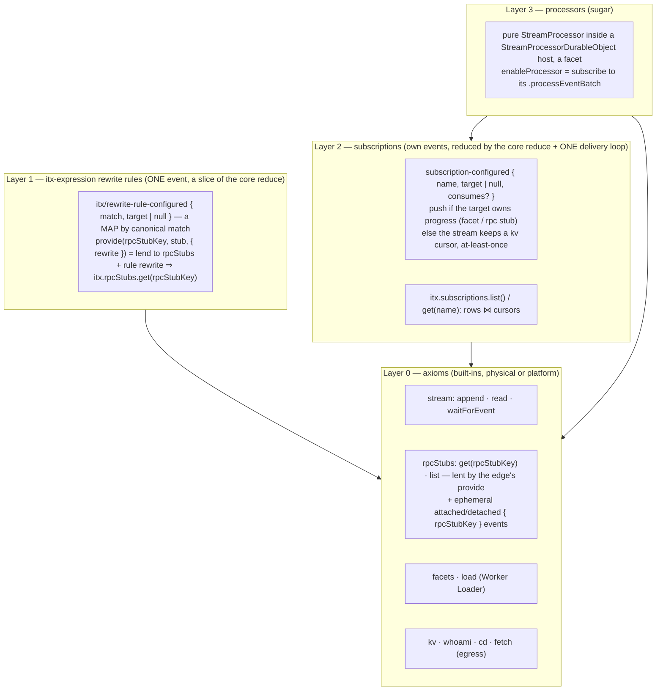

# Design: the onion — rpcStubs → rewrite rules → subscriptions → processors

> Synthesis of six candidate designs (five subagents with opposed stances, plus my own baseline),
> written against HEAD `69080fd9e` (C7), revised after the first annotation round. Section 1 is the
> recommendation. Section 7 ends with the honest "what you actually lose" list. Section 8 shows where
> the candidates disagreed and why each choice went the way it did. Nothing here was code when it was
> written. Sections 0–6 are kept in line with the code AS BUILT — including the itx-surface rename
> of 2026-09-02 (`docs/proposals/itx-surface-SYNTHESIS.md`, §9 "as built"): the noun is **rewrite
> rule** (`{ match, target }`, ONE event `itx/rewrite-rule-configured { match, target | null }`, a MAP
> by canonical match), a live value enters through `provide(rpcStubKey, stub, { rewrite? })` under an
> OPAQUE key, the dispatch door is `invoke`, and every verb hands back a DISPOSABLE handle. Sections
> 7–9 are the decision and sequence record and keep the names of their day.

## 0. Your constraints, restated as the rules this design obeys

- **The interface is events, except the axiomatic built-ins.** Physical facts live in a built-in;
  events are pure data that name things by expression. No discriminator flags on events.
- **Layering.** Low axioms (`rpcStubs` and its presence events, the stream, `facets`, `load`) at
  the core; rewrite rules, subscriptions, and processors are successive layers that only use what is
  below them. Sugar is kept visibly apart from axioms. `itx.connections` could one day be one more
  layer over `rpcStubs`. Not built here.
- **Sessions like apps/os**: `authenticate().projects.get(id)` returns the root context; `cd` takes
  absolute paths by convention (relative and `..` also resolve); no `list`/`create` yet; plural
  collections end in `Collection`.
- **A processor is a `DurableObject` subclass** of an SDK base, hosted through the ordinary
  `getDurableObjectClass`. No runner adapter, no third accessor, and, it turns out, no built-in
  processor that runs as a facet (the one built-in `StreamProcessor` is the core reduce, inline).
- **Durable at-least-once delivery to a stateless `processEventBatch` worker is a requirement.**
- **Facet-owns-progress vs stream-keeps-offsets is a fair, real distinction.**
- **Anything expressible in userspace is not a built-in.** `connectToCapnweb` goes.
- **Latest Workers.** `ctx.props` on facets is available; bump wrangler, workers-types, and the
  compatibility date first. Installed today vs published latest (checked 2026-09-01):

  | Package                     | Installed    | Latest                 |
  | --------------------------- | ------------ | ---------------------- |
  | `wrangler`                  | 4.127.1      | 4.128.0                |
  | `@cloudflare/workers-types` | 4.20260702.1 | 5.20260901.1 (a major) |
  | `@cloudflare/vitest-plugin` | 1.0.0        | 1.1.3                  |
  | `compatibility_date`        | 2026-07-01   | 2026-09-01             |

## 1. The recommendation in one screen



Client usage, the whole surface in one block. Lines marked SUGAR are compositions of the lines above
them (section 6 keeps the two groups apart in the code too). Every verb that returns a handle
returns a DISPOSABLE one (`using`); capnweb disposes it at session end, so a rule or subscription
made through the verb is SESSION-SCOPED — the durable spelling is the raw event through
`itx.append(...)`. Sources are handed over INLINE:

```ts
using api = newWebSocketRpcSession("wss://<worker>/api");
const itx = api.authenticate().projects.get("prj_123"); // the project ROOT context
const agent = itx.cd("/agents/support"); // absolute by convention; relative and ".." also resolve

const greetSource = { type: "inline", files: { "greet.js": GREET_SRC } };
using greet = await itx.rewrite("itx.greet", ["itx", ["load", greetSource], ["getEntrypoint"]]); // a rewrite rule
using robot = await itx.provide("robot", robotObject, { rewrite: "itx.robot" }); // SUGAR: lends to rpcStubs under the opaque key + rule itx.robot ⇒ itx.rpcStubs.get('robot')
await itx.rpcStubs.list(); // presence, physical
await itx.expressionRewriteRules.list(); // the rules, printed

using tab = await itx.subscribe({ name: "tab", target: (events, range) => render(events) }); // SUGAR; push (see "range" below)
using worker = await itx.subscribe({
  name: "worker",
  target: "itx.greet.processEventBatch",
  consumes: ["task/created"],
}); // cursor, at-least-once
await itx.enableProcessor("presence", {
  source: { type: "inline", files: { "presence.js": PRESENCE_SRC } },
  className: "PresenceDurableObject", // the host; `processor = new PresenceProcessor()` inside
}); // SUGAR over the subscription event; DURABLE (no handle) — disableProcessor is the inverse
await itx.facets.get("presence").snapshot();
await itx.subscriptions.list(); // config rows joined with cursors and halts
```

**`range`, and how a push subscriber heals.** Every delivery carries `range = { after, through }`,
the offset window this batch covers (`after` exclusive, `through` inclusive). Consecutive deliveries
chain: this batch's `after` equals the last batch's `through`. A subscriber keeps the last `through`;
when the next `range.after` differs, a batch was missed (a socket blip, a dropped push) and one
`read(through)` fills the hole. That is the entire client-side protocol for a push target, it is
what the live-state client already does, and it is why a browser tab needs no server-side cursor.

## 2. Layer 0 — the axioms

Unchanged from C7 except: `fetch` becomes a root, `rpcStubs` gains presence events,
`getEntrypoint` takes Cloudflare's own `props`, and `connectToCapnweb` leaves. AS BUILT, three more
roots: `waitForEvent` (so the edge declares nothing for it) and the two READ views of core's
slices, `expressionRewriteRules` and `subscriptions`.

```ts
interface BuiltInScope {
  whoami(): { projectId: string; path: string };
  kv: {
    get(k): Promise<string | null>;
    put(k, v): Promise<{ ok: true }>;
    delete(k): Promise<{ ok: true }>;
    list(prefix?): Promise<{ keys: string[] }>;
  };
  append(...events: StreamEventInput[]): Promise<StreamEvent[]>;
  read(afterOffset?: number, limit?: number): Promise<StreamPage>;
  waitForEvent(filter?: WaitForEventFilter): Promise<StreamEvent>;
  /** Absolute by convention ("/agents/x"); relative and ".." also resolve. Same resolver as the edge `cd`. */
  cd(path: string): InvokeHandle;
  /** Egress: {{secret:project:NAME}} substituted here, then FALLBACK. Loaded code's globalOutbound already lands here. */
  fetch(request: Request): Promise<Response>;
  /** THE physical registry. Keys are OPAQUE rpcStubKeys the lender picks; a rewrite rule names one as itx.rpcStubs.get('<rpcStubKey>'). */
  rpcStubs: { get(rpcStubKey: string): RpcStubHandle; list(): string[] };
  /** The rewrite-rule table, READ (a slice of core, printed). Written only by the ONE event. */
  expressionRewriteRules: {
    list(): { match: string; target: string }[];
    get(match: string): { match: string; target: string } | null;
  };
  /** A facet that is already running, by name. Re-materializes from the parent's startup memo after eviction. */
  facets: { get(name: string): FacetHandle; delete(name: string): void };
  load(source: WorkerSource): {
    /** `props` is Cloudflare's WorkerStubEntrypointOptions.props — a url, a key name, whatever the code wants. */
    getEntrypoint(className?: string, opts?: { props?: unknown }): InvokeHandle; // run · fetch · processEventBatch · anything it exports
    getDurableObjectClass(className: string): { get(instance?: string): FacetHandle };
  };
  runScript(script: string, ...args: unknown[]): Promise<unknown>; // sugar over load(...).getEntrypoint().run — kept for the bare-lambda case
}
```

`FacetHandle` and `RpcStubHandle` are the two `InvokeHandle` subclasses (brands) the DO already
mints (same reduce, a brand each). The brand is what Layer 2 reads.

**`connectToCapnweb` is userspace.** It was the one built-in that maps onto nothing Cloudflare
ships. A loaded entrypoint can dial a remote capnweb API through the context's own egress (secret
substitution included), and `props` carry the url:

```js
// remote.js — uploaded userspace code
import { WorkerEntrypoint } from "cloudflare:workers";
import { newHttpBatchRpcSession } from "capnweb";
export default class extends WorkerEntrypoint {
  call(path, args) {
    // walk the remote with no intervening awaits (one HTTP batch)
    let t = newHttpBatchRpcSession(this.ctx.props.url);
    for (const seg of path.slice(0, -1)) t = t[seg];
    return t[path.at(-1)](...args);
  }
}
```

```ts
const remoteSource = { type: "inline", files: { "remote.js": REMOTE_SRC } };
using os = await itx.rewrite("itx.os", [
  "itx",
  ["load", remoteSource],
  ["getEntrypoint", undefined, { props: { url: "https://os.iterate.com/api" } }],
]);
```

**Presence events (new).** The rpcStub layer appends two **ephemeral** events on its own
transitions, so the log never claims a socket is open but a live watcher can see it change:

```ts
"events.iterate.com/rpc-stub/attached" (ephemeral): { rpcStubKey: string }   // first pager opened for the key
"events.iterate.com/rpc-stub/detached" (ephemeral): { rpcStubKey: string }   // last pager closed for the key
```

Nothing reduces them (ephemerals never reach an inline reduce). A UI subscribes with
`consumes: ["events.iterate.com/rpc-stub/attached", ".../detached"]` and seeds from `rpcStubs.list()`.

## 3. Layer 1 — itx-expression rewrite rules

AS BUILT (`context/itx-expression-rewriting.ts`): a rewrite rule is `{ match, target }` — a call
that starts with `match` runs as the same call with `match` replaced by `target`; `match` is an
`ItxExpressionPrefix` (dotted names, any step may pin literal args, which the match CONSUMES),
`target` an `itx.…` expression. ONE event, `itx/rewrite-rule-configured { match, target | null }`
(`rewriteRuleConfiguredEvent`, both halves canonicalized through the codec, string at rest), reduced
by the core reduce into `state.itxExpressionRewriteRules`, a MAP by canonical match: a configured
target REPLACES the entry, `null` DELETES it — no shadow stack, no removal by identity, no offset on
a row. Built-ins first; then the most SPECIFIC matching rule (longest match, then most pinned args)
rewrites the call, repeating until the root is a built-in (32-rewrite budget; no match ⇒
`NO_ITX_EXPRESSION_MATCH`, default-deny). The `delivery`, `processor` and `lane` fields of the old
row are gone; `itx.subscribers.*` stops being a convention; a rewrite rule is a name for a target
and nothing else. The edge verb is `rewrite(match, target | null)` → a disposable
a disposable handle; a client's rpc stub enters through `provide(rpcStubKey, stub, { rewrite? })`, which
lends under the OPAQUE key and configures the rule `rewrite ⇒ itx.rpcStubs.get('<rpcStubKey>')`.
The rule dies with the stub: the handle's dispose un-sets it from the edge, and when the key's LAST
pager closes the DO un-sets every rule and subscription whose target is that stub (a reconnect
replaces the pager and is not a close).

## 4. Layer 2 — subscriptions

### 4.1 Events and reduce

Three events of the layer's own, reduced by the ONE core reduce (`stream/core-processor.ts`,
`CoreStreamProcessor`, slug `core`, contract 4.0.0 — the `subscriptions` slice beside
`itxExpressionRewriteRules`). DECIDED 2026-09-02, reversing this doc's earlier "own inline reduce
beside `core` and a separate rule reduce" (§8): the layering lives in the EVENTS, and one reduce
serves every synchronous reader — the append door, the dispatcher, the delivery loop. Jonas: "a core
stream processor that controls all the reduced state that is needed synchronously before append… the
token bucket runs in a facet and appends stream/paused." `stream/subscriptions.ts` is the ONE
COMMAND that builds the first event (`subscriptionConfiguredEvent({ name, target | null, consumes? })`
— `target: null` removes the row; removal is not a second event); the edge appends it through
`invoke(["itx", ["append", event]])`. apps/os event names.

```ts
"events.iterate.com/stream/subscription-configured": {
  name: string;          // [A-Za-z0-9_-]+; same name REPLACES (no stack — an enablement wants replace)
  target: string | null; // an itx expression whose terminal is callable with (events: StreamEvent[], range: ScannedRange); null REMOVES the row (and a cursor target's cursor)
  consumes?: string[];   // consumesEvent rule: absent = every durable event; naming a type opts its ephemerals in
}
"events.iterate.com/stream/subscription-delivery-halted":  { name: string; afterOffset: number; attempts: number; error?: string }  // appended by the loop
"events.iterate.com/stream/subscription-delivery-resumed": { name: string; afterOffset?: number }   // operator: un-halt, optionally seek

// reduced state
subscriptions: Record<string, {
  target: ItxExpression; consumes?: string[]; configuredAtOffset: number;
  halted?: { afterOffset: number; attempts: number; error?: string };
  resumed?: { afterOffset?: number; atOffset: number };            // level-triggered onto the cursor row
}>;
```

The `subscriptions` built-in is the small view you said you could live with:

```ts
subscriptions: {
  list(): Promise<SubscriptionListEntry[]>;
  get(name: string): Promise<SubscriptionListEntry | null>;
};
type SubscriptionListEntry = {
  name: string; target: string; consumes?: string[]; configuredAtOffset: number;
  /** Present only when the STREAM keeps the cursor (a target that cannot own its progress). */
  cursor?: { confirmedOffset: number; attempt: number; nextAttemptAtMs?: number };
  halted?: { afterOffset: number; attempts: number; error?: string };
};
```

It joins the reduced rows with the kv cursor rows. The cursor row is effect-side truth, like a
facet's checkpoint: never in the log (a per-batch cursor event would double every stream).

### 4.2 The one delivery loop, and the one rule

```
onCommit(fresh, scannedAfter, next):
  for (name, sub) of subscriptions:
    events = fresh.filter(consumesEvent(sub.consumes))
    after  = deliveredThrough[name] ?? scannedAfter;  deliveredThrough[name] = next     // in memory: a skipped batch rides the next range
    if events.empty: continue
    chain(name, async () => {
      { callee, method } = evaluateHead({ itx }, sub.target)      // everything but the final property step
      if callee is FacetHandle or RpcStubHandle:                 // IT OWNS ITS PROGRESS
        callOn(callee, method, [events, { after, through: next }])   // fire-and-forget; swallow RPC_STUB_OFFLINE, log the rest
      else:                                                      // it cannot: THE STREAM KEEPS THE CURSOR
        cursorLane.push(name, sub, events, after, next)
    })

cursorLane.push / pump(name, sub):                               // one in flight per name; also entered from alarm()
  row = kv[`subscription-cursor:${name}`] ?? { confirmedOffset: sub.configuredAtOffset, attempt: 0 }
  apply sub.resumed if newer than the row (seek + attempt 0)
  if sub.halted or row.nextAttemptAtMs > now: return             // alarm() pumps due rows
  if row.confirmedOffset < after: deliver read(row.confirmedOffset → after) in pages, acking each   // durable gap repair
  try:   await callOn(await resolve(sub.target), [events, range]), 20s watchdog
         kv.put(row with confirmedOffset = next, attempt 0)
  catch: attempt++; if attempt ≥ 15 or error.retryable === false → append subscription-delivery-halted
         else row.nextAttemptAtMs = now + jitter(1s·2^attempt, ≤30m); kv.put(row); stream.armNoLaterThan(it)
alarm(): pump every cursor row that is due; then the idle quiesce as today
```

**The rule, in words:** the loop evaluates the target and looks at what Cloudflare handed back. A
facet stub or a lent rpc stub owns its own progress (the facet's checkpoint and gap repair; the
client's offset and `read`), so it gets a push. Anything else, a Worker Loader entrypoint, a sibling
context, a remote capnweb API, cannot own progress, so the context keeps a cursor and awaits each
call as the acknowledgement. Nothing is declared, stamped, or re-sniffed from a string; a rewrite
rule whose target names another rule's prefix classifies correctly because it evaluates to the same
handle.

The cursor lane is kernel code in the DO over the DO's own kv and the DO's own alarm, which is what
apps/os does (`StreamEventSender` in the stream DO) and what Cloudflare ships. It is not a facet
processor: that shape needed an alarm proxy facets do not have (workerd#6810, still open as of
2026-09-01), plus three parent doors and an auto-enable rule.

### 4.3 Edge sugar

```ts
/** A LIVE target is lent under key `itx.subscriptions.<name>` and configures target
 *  "itx.rpcStubs.get('itx.subscriptions.<name>')"; an expression is stored as written; `null`
 *  removes the row. Same name replaces. Literally `append(subscriptionConfiguredEvent(…))` — the
 *  returned handle removes the row (and recalls the lent callback) when disposed or when the
 *  session ends. */
subscribe(input: { name?: string; target: ItxExpressionInput | ClientRpcStub | null; consumes?: string[] }): Promise<SubscriptionHandle>;
class SubscriptionHandle extends RpcTarget { get name(): string; [Symbol.dispose](): void }
```

AS BUILT there is no `unsubscribe`: `subscribe({ name, target: null })` is the removal, and every
`subscribe` hands back a DISPOSABLE `SubscriptionHandle` (`name` is the generated `sub-<8 hex>` when
none was given). capnweb disposes every exported handle when the session ends, so a subscription made
through the verb — named or not — is SESSION-SCOPED; a row that must outlive its session is the raw
event, `itx.append(subscriptionConfiguredEvent({ name, target, consumes }))`. When a lent callback's
LAST pager closes, the DO itself un-sets the row (and every rewrite rule targeting that stub) — a
reconnect replaces the pager and is not a close; a push that races the un-set hits
`RPC_STUB_OFFLINE` and is swallowed. A `subscribe` with the same name re-lends and replaces the row.

Live-state mode is not a mode: `subscribe({ target: fn, consumes: ["events.iterate.com/live-state/changed"] })`
and the client filters `payload.key`. The rule that no processor may reduce a live-state delta moves
into the SDK base, where it belongs.

## 5. Layer 3 — processors

### 5.1 The SDK base

```ts
// stream/processor.ts — THE AUTHOR CLASS, pure (as landed 2026-09-02, Jonas: "pure classes that
// subclass a StreamProcessor class that are easy to unit test")
export abstract class StreamProcessor<State> {
  abstract readonly contract: ProcessorContract<State>;
  reduce(args: ReduceArgs<State>): State | null | undefined;
  processEvent(args: ProcessEventArgs<State>): undefined;
  /** The live PROJECTION of the reduced state — what liveSnapshot() serves and what deltas are diffed over.
   *  Default: the state verbatim. Override to trim, or to reduce in runtime fields the reduce does not own;
   *  the engine re-projects after every batch, so a field bumped in processEvent publishes on its own. */
  projectLiveState(state: State): unknown;
  idempotencyKey(key: string, event?: StreamEvent): string;
}

// sdk/stream-processor-durable-object.ts — THE HOST, bundled into processor.js
export type StreamProcessorProps = { contextName: string; name: string };

export abstract class StreamProcessorDurableObject<State = unknown, Env = {}> extends DurableObject<
  Env, // Env extends { ITX: Service<ItxEntrypoint> } — as landed
  StreamProcessorProps
> {
  /** `processor = new PresenceProcessor()` at the top of the subclass — the one thing an author writes here. */
  abstract readonly processor: StreamProcessor<State>;
  // what an author reaches
  /** The owning context's parsed address — the same `{ projectId, path, name }` object the DO holds as #name
   *  (`name` is the canonical codec string). Parsed once from ctx.props.contextName. */
  protected readonly context: DurableObjectAddress;
  /** This processor's own name: the facet name, the subscription name, the `.get(name)` name. From ctx.props.name. */
  protected readonly name: string;
  /** The owning context's scope: the loaded isolate's env.ITX, bound at load. */
  protected get itx(): Promise<unknown>; // the owning context's scope, via env.ITX.get()
  protected publishLiveState(): void; // after a runtime field moved OUTSIDE a batch
  // the doors the delivery loop and itx.facets.get(name) reach
  processEventBatch(events: StreamEvent[], range: ScannedRange): Promise<void>;
  catchUpFromLog(): Promise<void>;
  snapshot(): Promise<{ offset: number; state: State }>;
  liveSnapshot(): Promise<{ rev: number; state: unknown }>; // { rev, state: projectLiveState(reduced) } — the client's seed door
  waitUntilProcessed(input: { offset: number; timeoutMs?: number }): Promise<void>;
  // never define alarm(): facets have none (workerd#6810). Nothing in scope needs one — see §7 "what you lose".
}
```

Identity is `ctx.props`, minted once by the only party that knows it: the parent passes
`{ props: { contextName, name } }` to `worker.getDurableObjectClass(className, { props })`, then
`ctx.facets.get(name, () => ({ class }))`. `configure()`, `FacetIdentity`, the identity kv key and
the `proc:`/`named:`/`stateful:` name prefixes all die. A processor IS a named facet; the facet
name is the subscription name is the `.get(name)` name.

The `stream/processor.ts` engine (serial chain, checkpoint, gap repair, at-head pass, version
re-reduce, live-state publish) was first landed **wrapped, not split** (the DurableObject was the
processor, hooks forwarded to it). Jonas then asked for the split (2026-09-02): the author's
processor is a PURE `StreamProcessor` subclass — constructible bare, `reduce` callable in a Node
test — and the DurableObject is a one-field HOST (`processor = new PresenceProcessor()`) that builds a
`ProcessorEngine` over the pure instance with its facet kv and `env.ITX`. The engine calls the
processor's public hooks directly (no forwarding adapter); the core reduce is a `StreamProcessor`
subclass too (reduced by the `Stream` itself inside every commit, `reduce` only — `ReduceOnlyProcessor` is
gone), and re-projects live state after every batch so a
runtime field bumped inside `processEvent` needs no explicit publish. apps/os's two-class shape
returns, for a different reason than there (unit-testability, not facet-vs-DO hosting).

### 5.2 There are no built-in processors

With the forwarder re-homed into the kernel, nothing the platform NEEDS runs as a facet processor.
The one built-in `StreamProcessor` is the core reduce — slug `core`, reducing the context's own
control events (`stream/created`, `stream/woken`, `stream/paused`, `stream/resumed`, the one
rewrite-rule event, the three subscription events) into
`{ projectId, path, createdAt, incarnation, paused, itxExpressionRewriteRules, subscriptions }`, hosted inline at the
commit point because every reader is synchronous. Anything that is NOT needed synchronously before
an append is not built in at all: the token-bucket breaker left core (2026-09-02) and is
`BreakerProcessor` (`e2e/support/sources.ts`), an ordinary userspace facet processor that reduces
durable events into a bucket and, on exhaustion, appends `stream/paused { reason }`; an operator
appends `stream/resumed`. Core knows nothing about it — the pause check is one `if` in
`Stream.append`. Tally was only ever the
facet-spine demo, so it becomes what the demo's `PresenceProcessor` already is: a userspace source seeded by
`e2e/support/sources.ts`, extending the same base. That deletes `processor-facet.ts`,
`FACET_PROCESSORS`, `BUILT_IN_PROCESSOR_SLUGS`, the `ProcessorFacet` export, and the `itx.exports`
root an earlier draft proposed. `enableProcessor` always has a source:

```
enableProcessor(name, { source, className, consumes? }) ⇒ append(subscriptionConfiguredEvent({ name, target: `itx.load(${src}).getDurableObjectClass('${className}').get('${name}').processEventBatch`, consumes }))  // DURABLE: returns { name }, no handle
disableProcessor(name)                                  ⇒ append(subscriptionConfiguredEvent({ name, target: null })); itx.facets.delete(name)      // storage included
```

A userspace processor, plain JS, two classes — the pure processor and its one-line host:

```js
import {
  StreamProcessor,
  StreamProcessorDurableObject,
  defineProcessorContract,
  z,
} from "./processor.js";
const contract = defineProcessorContract({
  slug: "presence",
  version: "1.0.0",
  description: "ticks",
  stateSchema: z.object({ ticks: z.number().default(0) }),
  events: {},
  consumes: ["tick", "poke"],
  emits: [],
});
class PresenceProcessor extends StreamProcessor {
  contract = contract;
  #lastPokeMs = 0;
  reduce({ event, state }) {
    if (event.type === "tick") return { ...state, ticks: state.ticks + 1 };
  }
  processEvent({ event }) {
    if (event?.type === "poke") this.#lastPokeMs = Date.now(); // re-projected at batch end
  }
  projectLiveState(state) {
    return { ...state, lastPokeMs: this.#lastPokeMs };
  }
}
export class PresenceDurableObject extends StreamProcessorDurableObject {
  processor = new PresenceProcessor();
}
```

The stateless project worker, apps/os shape:

```js
import { WorkerEntrypoint } from "cloudflare:workers";
export default class extends WorkerEntrypoint {
  async processEventBatch(events, range) {
    // resolving IS the ack; throwing ⇒ retry; { retryable: false } ⇒ halt now
    const itx = await this.env.ITX.get();
    for (const e of events) await react(itx, e, `${e.path}@${e.offset}`); // the idempotency-key idiom
  }
}
```

```ts
const workerSource = { type: "inline", files: { "worker.js": WORKER_SRC } };
using worker = await itx.rewrite("itx.worker", ["itx", ["load", workerSource], ["getEntrypoint"]]);
using sub = await itx.subscribe({ name: "project-worker", target: "itx.worker.processEventBatch" });
(await itx.subscriptions.get("project-worker")).cursor; // { confirmedOffset, attempt, nextAttemptAtMs? }
await itx.append({
  type: "events.iterate.com/stream/subscription-delivery-resumed",
  payload: { name: "project-worker", afterOffset: poison.offset },
});
```

## 6. The edge surface, complete — axioms apart from sugar

```ts
class UnauthenticatedSession extends RpcTarget {
  authenticate(credentials?: unknown): Session;
  [Symbol.dispose](): void;
} // what /api serves; no-op gate today; dispose: relays + anonymous subscriptions
class Session extends RpcTarget {
  get projects(): ProjectCollection;
} // a GETTER: capnweb exposes prototype members only
class ProjectCollection extends RpcTarget {
  get(projectId: string): IterateContext;
} // the ROOT context; pure addressing

// iterate-context.ts — A PROXY IN FRONT OF THE DO. Declares only what must be edge code, in the order the tutorial builds them;
// every DO built-in root (append · read · waitForEvent · fetch · whoami · kv · rpcStubs.get/list · expressionRewriteRules · facets · subscriptions · load · runScript)
// and every rewrite rule ride the prototype hop into ONE invoke(expression) with ZERO code here.
class IterateContext extends RpcTarget {
  cd(path: string): IterateContext; // pure addressing, zero DO hops; returns an EDGE context
  invoke(call: ItxExpressionInput): Promise<unknown>; // THE dispatch door; a terminal .fetch(Request) rides the fetch lane (x-itx-expression; root egress included)
  // (a) rpc stubs — THE ONE PHYSICAL ACT: the client's capnweb stub must live in this stateless worker, never in the DO
  provide(
    rpcStubKey: string,
    stub: ClientRpcStub,
    options?: { rewrite?: ItxExpressionInput },
  ): Promise<ProvidedRpcStubHandle>; // lend under the OPAQUE key (+ the rule rewrite ⇒ itx.rpcStubs.get('<rpcStubKey>'))
  // (b) rewrite rules · subscriptions · processors — each is visibly "build the event, append it" (the DO has append and no configuration verbs)
  rewrite(match: ItxExpressionInput, target: ItxExpressionInput | null): Promise<RewriteRuleHandle>;
  subscribe(input: {
    name?: string;
    target: ItxExpressionInput | ClientRpcStub | null;
    consumes?: string[];
  }): Promise<SubscriptionHandle>;
  enableProcessor(
    name: string,
    ref: { source: WorkerSource; className: string; consumes?: string[] },
  ): Promise<{ name: string }>; // DURABLE, no handle
  disableProcessor(name: string): Promise<void>;
  [dotted: string]: unknown; // everything else
}
class ProvidedRpcStubHandle extends RpcTarget {
  [Symbol.dispose](): void;
} // provide / rewrite: disposing (or session end) undoes the act
class SubscriptionHandle extends ProvidedRpcStubHandle {
  get name(): string;
} // subscribe: the generated name when none was given
```

The banding survives: the client still holds one `itx`, but the code reads as the tutorial does —
the physical act first, then verbs that are nothing but `append` plus a handle. `rewrite` and
`subscribe` are declared on the edge only because their target may be a live value (which only the
edge can lend); `enableProcessor` / `disableProcessor` because they are two appends spelled for you.
Every verb that returns a handle returns a DISPOSABLE one, and capnweb disposes it at session end,
so a rule or subscription made through the verb is session-scoped — the durable spelling is the raw
event. Processors are durable configuration on purpose (no handle).

Gone: `ProjectSession.get`, `?ctx=` on `/api` (`/expression` takes `?context=` and `?itx=`;
sub-contexts via `cd` in the expression), `fetchCap`, `resumeSubscription`, `provide(opts)`,
`revoke`, `unsubscribe`, `connectToCapnweb`; the DO's configuration verbs.

## 7. What is deleted, what is added, what you actually lose

| Delete                                                                                                                                                                                                                                                                                    | Where                                                | ~lines     |
| ----------------------------------------------------------------------------------------------------------------------------------------------------------------------------------------------------------------------------------------------------------------------------------------- | ---------------------------------------------------- | ---------- |
| the forwarder facet: cursor, ladder, halt, pump door, alarm proxy, auto-enable                                                                                                                                                                                                            | `subscription-forwarder-processor.ts` + DO doors     | 335 + ~70  |
| `ProcessorFacet`, `FACET_PROCESSORS`, `BUILT_IN_PROCESSOR_SLUGS`, `FacetIdentity`, `configure`, built-in Tally                                                                                                                                                                            | `processor-facet.ts`                                 | 180        |
| `ProcessorFacetRunner` (`runner.js`) and its build step                                                                                                                                                                                                                                   | `runner-entry.ts`, `generated/processor-runner.ts`   | 79 + gen   |
| `laneOf`, `facetTarget`, `rpcStubTarget`, `SubscriptionMount`, `#subscriptionMounts`, `#activeSubscriptionMounts`, `#deliverToConnectedSubscriptions`, `#driveFacets`, `#facetEntries`, `#facet`, the resurrection pass, `revokeCapability.all`, DO-side `enable/disableProcessor` bodies | `stream-durable-object.ts`                           | ~400 → ~70 |
| `delivery` / `processor` / `lane` on `capability-provided`; `ProcessorPolicy`; `deliverTo` by row                                                                                                                                                                                         | `capability-table-processor.ts` (→ 5.0.0)            | ~80        |
| `DeliveryPolicy`, `SubscriptionLane`                                                                                                                                                                                                                                                      | `core/events.ts`                                     | ~35        |
| ~~abstract `StreamProcessor` as an author class~~ — REVERSED 2026-09-02: it IS the author class (pure); the DO is its host                                                                                                                                                                | `stream/processor.ts`                                | —          |
| `connectToCapnweb` root (+ `connect.e2e`)                                                                                                                                                                                                                                                 | `built-ins.ts`, `worker.ts` brand registration stays | ~25        |
| `ProjectSession.get`, `?ctx=`, `DEFAULT_CTX`, `fetchCap`, `resumeSubscription`, `provide` opts, live-state mode                                                                                                                                                                           | `itx-surface.ts`, `worker.ts`                        | ~110       |

| Add                                                                                                                                        | Where                                                           | ~lines        |
| ------------------------------------------------------------------------------------------------------------------------------------------ | --------------------------------------------------------------- | ------------- |
| `UnauthenticatedSession` / `Session` / `ProjectCollection`; `cd` relative; `fetch` root; `/cap?context=`; `getEntrypoint(name, { props })` | `session.ts`, `iterate-context.ts`, `built-ins.ts`, `worker.ts` | ~95           |
| the 4 subscription events (reduced by the core reduce) + their two commands + the `subscriptions` built-in view                            | `stream/core-processor.ts`, `stream/subscriptions.ts`           | ~80           |
| the delivery loop + cursor lane over kv + alarm                                                                                            | `stream/subscription-delivery.ts`                               | ~140          |
| `ProcessorEngine` (the engine, split from the pure `StreamProcessor`) + the `StreamProcessorDurableObject` host                            | `stream/`, `sdk/`                                               | ~30 net + ~60 |
| `FacetHandle` / `RpcStubHandle` brands; `facet:<name>` startup memo; `facets.delete`                                                       | `invoke-handle.ts`, the DO, `built-ins.ts`                      | ~40           |
| presence events on attach/final close; tally as a test-fixture source                                                                      | `rpc-stub-directory.ts`, `e2e/support/sources.ts`               | ~30           |

Net roughly −950 lines. Concepts dead: lane, delivery policy, processor policy, facet identity,
configure, runner adapter, alarm proxy, forwarder facet, built-in processors, `itx.subscribers.*`,
subscription shadow stacks, `all:` revoke, live-state mode, `maxAttempts`/`start`, resurrection pass,
`?ctx=`, `connectToCapnweb`. Concepts added: cursor (kv row), `itx.subscriptions`, the two presence
events, the three handle brands.

### What you actually lose (the honest list)

Nothing you can do today becomes impossible. Four things get coarser and two safety nets go:

1. **Per-subscription retry tuning.** `maxAttempts` and `start` become one fixed ladder
   (15 attempts, 1s·2ⁿ capped at 30 min, `retryable: false` halts at once) and "start from the
   beginning" is `subscription-delivery-resumed { afterOffset: 0 }`. apps/os's defaults, no knobs.
2. **Server-side live-state key filtering.** A tab that consumes `live-state/changed` receives every
   key's deltas and filters `payload.key` itself. With N publishing processors that is N small
   ephemeral deltas per commit per tab. If it is measured to matter, `consumes` can grow a payload
   predicate later; the kernel does not change.
3. **The forwarder as "a model citizen of the processor idiom".** The cursor lane becomes ~140
   lines of kernel code. Smaller than today, larger than design C's kernel, and it maps onto DO
   storage and the DO alarm, which Cloudflare ships; the facet version needed an alarm proxy,
   which Cloudflare does not.
4. **`connectToCapnweb`'s one-round-trip pipelining from the DO.** Userspace gets the same
   behaviour inside its isolate (section 2). One extra loader hop per call.
5. **The resurrection pass.** Today the first alarm of each incarnation snapshots every facet, so
   a reduce aborted by an eviction catches up without traffic. Under the design a facet catches up
   on the next push (every append pushes to every subscription) or the next read (which
   gap-repairs). The residual: a DO woken by something that is not an append and not a facet read,
   say a pager message, would not re-drive facets until the next append. Reduced state is never
   wrong; only a lost `processEvent` effect waits for traffic, which is exactly the obligation
   pattern's at-head recovery in apps/os anyway.
6. **The alarm proxy.** Its only user was the forwarder, and the forwarder moves into the DO,
   which has a real alarm. So it is not "we do not need alarms", it is "no facet in scope needs
   one". The first processor or mini-app that wants a timer (a scheduler, a debounce, an obligation
   keepalive) needs something. Your preferred shape (2026-09-01) is not a proxy at all but a
   **scheduled append**: the context natively supports "append this event at time T"
   (`itx.append({ type, payload, at: atMs })` or a sibling verb), the stream's own alarm commits it
   when due, and it reaches every processor through the ordinary `processEventBatch` door like any
   other event. That is one kernel feature over the DO's real alarm, no facet ever touches an
   alarm API, and it stays correct the day workerd#6810 ships facet alarms. Adding it now would be
   speculative machinery with zero callers; it is the answer when the first caller appears.

## 8. Where the six candidates disagreed, and why each call went this way

| Decision                                        | Candidates                                                                                                                                                     | Chosen                                                             | Why                                                                                                                                                                                                                                                                                                                                                                                                   |
| ----------------------------------------------- | -------------------------------------------------------------------------------------------------------------------------------------------------------------- | ------------------------------------------------------------------ | ----------------------------------------------------------------------------------------------------------------------------------------------------------------------------------------------------------------------------------------------------------------------------------------------------------------------------------------------------------------------------------------------------- |
| How the two kinds are told apart                | A: structural predicate on the expression string · B: declared `receiver.delivery?` field · C/D: by which event you appended · E: brand of the evaluated value | **E**                                                              | No flag on the event, and alias-robust: the loop already evaluates the target before calling it, so it costs nothing to look at what came back. A's string predicate misclassifies an alias; B's field is a declaration the target already implies.                                                                                                                                                   |
| Live browser tabs                               | A, C: stream keeps a cursor per tab (at-least-once, hold on offline) · B, D, E: push, client owns its offset                                                   | **push**                                                           | Today's measured behaviour (p50 ~215 ms, zero server state) survives untouched; the live-state client already heals by `read`. A per-tab kv write per batch and per-tab back-pressure buy reconnect catch-up nobody asked for yet. If a device later needs it, that is a new requirement, not a flag.                                                                                                 |
| Where the cursor lane lives                     | A, B, E: kernel loop in the DO over kv + alarm · C, D: a built-in facet processor                                                                              | **kernel loop**                                                    | Maps onto what Cloudflare ships (DO storage, DO alarm); a facet version needs an alarm proxy Cloudflare does not ship, three parent doors and an auto-enable rule. apps/os hosts its sender in the stream DO too. C's kernel is smaller on paper but adds two hops and ack serialization in front of every tab, an unmeasured latency bet.                                                            |
| Where subscription rows are reduced             | A, B, E: the core reduce · C, D: a facet's own reduce · this doc: its own inline reduce                                                                        | **the core reduce** (REVERSED 2026-09-02; was "own inline reduce") | First landed as its own inline reduce beside `core` and `capability-table`. Reversed once it ran: three inline reduces over one log was three checkpoints and three facet addresses for one synchronous reduce with one set of readers. The layering is the EVENTS — the four subscription events stay the layer's own — but the reduce is one (`state.subscriptions` on core), as A, B and E had it. |
| Whether a tab's subscription is an event at all | B: no, `openConnection` is physical, event types ride the pager attachment · others: `subscription-configured` targeting `itx.rpcStubs.get(...)`               | **an event**                                                       | Your feedback 8 asked for an event that tells the stream to send events to a live subscriber. B's shape leaks nothing but loses that, and adds a verb. The leak (rows for dead named tabs) is bounded by distinct names and swept for anonymous ones.                                                                                                                                                 |
| Presence                                        | all: `rpcStubs.list()`; B optional ephemeral connection events                                                                                                 | **list() + ephemeral attached/detached**                           | Your "rpcStub and associated presence event". Ephemeral keeps C7's promise: the log never claims a socket is open.                                                                                                                                                                                                                                                                                    |
| Processor identity                              | A, B, D: `env.ITX.whoami()` · C: keep `configure()` until props land · E: `ctx.props`                                                                          | **`ctx.props`**                                                    | You confirmed facets get `ctx.props` on current Workers; the installed types already carry `getDurableObjectClass(name, { props })` and `DurableObjectState<Props>.props`. One mint by the only party that knows the identity; no side channel, no `whoami` round trip.                                                                                                                               |
| Engine vs SDK base                              | C, D: merge the engine onto the DO base · E: split into a hook-parameterized runner + a thin base · B: keep apps/os two-class `createProcessor`                | **wrap** (landed; the row above chose split)                       | The engine stays dependency-free and Node-tested, unchanged; the DO base builds one instance with its hooks pointed at the author's methods; the core reduce keeps using it; the author writes one class.                                                                                                                                                                                             |
| Built-in processors                             | D: ship as SDK-bundled source through the loader · B: `facets.get(name)` with a name→class map · E: `itx.exports.<Class>.get(name)` · this doc: none           | **none**                                                           | With the forwarder in the kernel, no platform processor runs as a facet. Tally is a demo and becomes a test fixture like `Presence`. `itx.exports` was a root serving one demo class.                                                                                                                                                                                                                 |
| Recovery                                        | A/B/E: `-cursor-set` + `-delivery-resumed` (apps/os pair) · C/D: one `-delivery-resumed { afterOffset? }`                                                      | **one event**                                                      | Resume, optionally from a new offset, reads as one operator intent. apps/os's pair stays available if the two ever need to differ.                                                                                                                                                                                                                                                                    |
| `subscribe`/`unsubscribe` verbs                 | B: delete, append events directly · D: a subscription IS a provide · A, C, E: keep as edge sugar                                                               | **keep as sugar, a banded section**                                | A live target needs the edge to lend the stub, so sugar exists anyway; the same two lines serve expressions. Your annotation asked for sugar to be visibly apart from axioms: it is the second banded section of `IterateContext` (a second file would need declaration merging to type).                                                                                                             |

## 9. Sequence

Each step is one commit, gated by `pnpm typecheck && pnpm test && pnpm e2e` in the package.

| #   | Commit                                                                                                                                                                                                                                                                                                                                                                                                                                                                                                                                                                                                                                                                                                                                                                                                                                                                                                                                                                                                              | Notes                                                                                                                                                                                                                                                                                                                                                                                                                                                                           |
| --- | ------------------------------------------------------------------------------------------------------------------------------------------------------------------------------------------------------------------------------------------------------------------------------------------------------------------------------------------------------------------------------------------------------------------------------------------------------------------------------------------------------------------------------------------------------------------------------------------------------------------------------------------------------------------------------------------------------------------------------------------------------------------------------------------------------------------------------------------------------------------------------------------------------------------------------------------------------------------------------------------------------------------- | ------------------------------------------------------------------------------------------------------------------------------------------------------------------------------------------------------------------------------------------------------------------------------------------------------------------------------------------------------------------------------------------------------------------------------------------------------------------------------- |
| 0   | **Latest Workers + the probe.** Bump wrangler, `@cloudflare/workers-types` (5.x), `@cloudflare/vitest-plugin`, and `compatibility_date`. Add a `__workers-tests__` probe: a facet started from `worker.getDurableObjectClass('X', { props })` sees `ctx.props`. Re-check workerd#6810 (facet alarms) while there.                                                                                                                                                                                                                                                                                                                                                                                                                                                                                                                                                                                                                                                                                                   | The one platform fact this design leans on. If it fails, fallback is `FacetStartupOptions.id = "<contextName>#<name>"` parsed from `ctx.id.name`.                                                                                                                                                                                                                                                                                                                               |
| 1   | **Sessions, `cd`, `fetch`, `props`.** `UnauthenticatedSession`/`Session`/`ProjectCollection`; relative `cd` on both sides; `fetch` on the edge and as a root; `fetchCap` reduced into the dotted door; `/cap?context=`; `getEntrypoint(name, { props })`; delete `?ctx=`, `ProjectSession.get`, `connectToCapnweb` (re-spell `connect.e2e` as a userspace worker). Re-point `e2e/support/client.ts` (the harness lane has since been reduced into e2e/).                                                                                                                                                                                                                                                                                                                                                                                                                                                                                                                                                            | LANDED (f2d4f33af).                                                                                                                                                                                                                                                                                                                                                                                                                                                             |
| 2+3 | **Subscriptions + processors, ONE commit.** Merged: the subscriptions layer needs the processor base at once, or enablement would still carry a processor policy for one commit — a half-state not worth shipping. The `subscriptions` inline reduce and its four events; the one delivery loop with the brand rule; the cursor lane over kv + the DO alarm, the cursor IN MEMORY and written only at durable boundaries (an ephemeral-only batch touches no storage); the `itx.subscriptions` view; `subscribe`/`unsubscribe` sugar; presence events; `StreamProcessorDurableObject` in the SDK — a shell around the unchanged `StreamProcessor` engine (wrap, not split: the engine stays Node-tested with zero test churn); `ctx.props` identity; no built-in processors (tally is a fixture); `enableProcessor` re-spelled; deleted: the forwarder, lanes, policies, live-state mode, resurrection pass, `revokeCapability.all`, `runner-entry.ts`, `processor-facet.ts`, `configure`, the facet-name prefixes. | Landed as one commit.                                                                                                                                                                                                                                                                                                                                                                                                                                                           |
| 2b  | **Ephemerals cost zero writes.** An ephemeral-only append still writes ONE kv value (`maxAssignedOffset`) so an offset is never reused across incarnations. Make it free: assign ephemeral offsets in memory, write the counter only with a durable, and make every offset-keyed consumer persist the last DURABLE boundary (the processor engine persists `range.through` today — under reuse that would skip a durable landing on a reused offset; the inline reduces likewise; the delivery cursor already does). The contract becomes: an ephemeral's offset is unique within an incarnation, and the `stream/woken` record marks the boundary. Probe: N ephemeral appends leave `maxAssignedOffset` untouched; the throughput guard and `ephemeralflood` re-measured.                                                                                                                                                                                                                                          | LANDED. Smaller than planned: every persisted checkpoint already advanced only on a durable batch (the engine's `sawDurable`, the inline reduces' write-on-change, the cursor lane's durable-boundary rule), and such a batch commits the high-water mark with its rows — so the ONLY change was `Stream.append`'s all-ephemeral fast path (no transaction, no mark write, offsets from memory) plus the contract written down and pinned (`__workers-tests__/stream.test.ts`). |
| 4   | **Layout.** Folders by primitive, the renames, import rewrites, tutorial appendix. `LAYERS.md` is already rewritten. The axiom/sugar split is two banded sections on `IterateContext`, not a second file: a prototype-installed `sugar.ts` needs declaration merging to type, which is cleverness for its own sake.                                                                                                                                                                                                                                                                                                                                                                                                                                                                                                                                                                                                                                                                                                 | LANDED. `git mv` + one split (`core/itx-surface.ts` → `session.ts` + `iterate-context.ts`); imports rewritten mechanically; the tutorial appendix now shows the tree.                                                                                                                                                                                                                                                                                                           |
| 5   | Rewrite `docs/clean-room-api-walkthrough.md` to the new surface; retire the "in flight" banner and the superseded docs' banners.                                                                                                                                                                                                                                                                                                                                                                                                                                                                                                                                                                                                                                                                                                                                                                                                                                                                                    | LANDED. Walkthrough rewritten from source (sessions, the one provide door, subscriptions + the one delivery loop, `StreamProcessorDurableObject`, zero-write ephemerals, the tree by primitive). `ARCHITECTURE.md`, `docs/iterate-context.md`, `ITX-KERNEL-SHAPE.md`, `docs/state-of-play.md` carry one short SUPERSEDED banner each, pointing here.                                                                                                                            |

Layout after step 4 (the tutorial's map) — AS LANDED. Two deviations from the sketch, both toward
the plain reading: no `sugar.ts` (row 4) and no `stream-processor-runner.ts` (the engine stayed
`processor.ts`, wrapped by the SDK base rather than split); `patch.ts` is a generic diff/apply and
went to `lib/`, `live-state.ts` is a stream projection and went to `stream/`; `fetch/egress.ts` was
never a file here (egress lives in `../shared`). `core/` is gone — it was not a name.

```text
src/
  worker.ts  session.ts  iterate-context.ts  iterate-context-durable-object.ts  itx-entrypoint.ts
  context/   built-ins.ts itx-expression-rewriting.ts expression.ts dispatch.ts invoke-handle.ts dotted-path-proxy.ts
             rpc-stub-directory.ts rpc-stub-relay.ts worker-loader.ts durable-object-names.ts
  fetch/     rpc-stub-fetch.ts
  stream/    stream.ts events.ts processor.ts reduce-checkpoint.ts core-processor.ts
             subscriptions.ts subscription-delivery.ts live-state.ts
  sdk/       index.ts (→ processor.js) stream-processor-durable-object.ts (the host)
  lib/       errors.ts logs.ts patch.ts timeout.ts     client/     generated/
```

(After the itx-surface rename of 2026-09-02: `capability-table.ts` + `routing.ts` became
`itx-expression-rewriting.ts`, `fetch-capabilities.ts` became `rpc-stub-fetch.ts`.)

Steps 1 and 3 can run as parallel agents once 0 and 2 are in. Step 2 touches the DO's commit path
and I would do it myself.

Tests. Die: `resume-race`, `resume-race-control` (the facet's rev-CAS race no longer exists),
`disable-shadow` (same name replaces), `resub-zombie` (reduces into `reconnect`). Re-spelled:
`connect` (userspace remote worker), `push` (cursor via `itx.subscriptions`, halt/resume as
events), `live-state`/`woken`/`ephemeral`/`ephemeralflood` (subscribe shape; live-state mode →
consumes + client key filter), `facet1`/`userfacet`/`facetaddr`/`load`/`dw2dw`/`source-refetch`/
`edge` (tally from a seeded source, bare facet names, `.fetch` dotted), every e2e via
`support/client.ts` (`.projects.get(ctx)`, `subscriberMounts` → `itx.subscriptions.list()`). Unit:
`processor.test.ts` onto the engine; `capability-table-processor.test.ts` loses lane/policy
cases; `do-doors`/`alarm-quiesce` re-spelled (cursor pump in `alarm()`). `ephemeralflood` is
re-measured, not just re-spelled: the push path for tabs is unchanged, so its numbers should hold.

## 10. Open risks, ranked

1. ~~`ctx.props` through `ctx.facets.get`~~ **Proven** (step 0, `__workers-tests__/facet-props.test.ts`,
   2026-09-01): props minted at `worker.getDurableObjectClass(name, { props })` arrive as
   `ctx.props` inside the facet. Two more facts pinned there: a facet's `ctx.id.name` is its
   PARENT's codec name, and `ctx.exports` is populated inside a facet. Also learned: workers-types'
   `Rpc.Serializable` rejects `unknown`, so any stub method returning a `StreamEvent`
   (`payload: Record<string, unknown>`) types as `never` on the stub (it compiles only because
   `never` is assignable to anything). A recursive JSON payload type hits TS2589 inside
   `Rpc.Serializable`, so that fix is unavailable; the one caller that destructures such a result
   (the control-plane shell) casts, with a comment. Step-0 bump landed at wrangler 4.127.1 /
   workers-types 5.20260901.1 / vitest-plugin 1.1.2: the repo's 24h `minimumReleaseAge` excludes
   same-day releases.
2. Named tab subscriptions outlive their tabs. Bounded by distinct names; anonymous ones are
   swept on session dispose. A TTL is a later, separate decision.
3. The brand check needs the DO-minted handle, not something that crossed RPC. A sibling
   context's facet (`itx.cd('/x').facets.get('p')`) therefore classifies as remote and gets a cursor
   it does not strictly need. Harmless double bookkeeping, and exactly apps/os's `wake-processor`
   placement.
4. No facet alarm in scope (section 7, item 6). The first timer-needing processor adds the generic
   proxy as its own commit.
5. Presence events on a paused stream are refused like every non-control ephemeral. Paused means
   quiet; accepted.
6. Ephemerals reach cursor targets only when the target is caught up (they ride the pushed batch,
   never the log). Same contract as today's forwarder.
