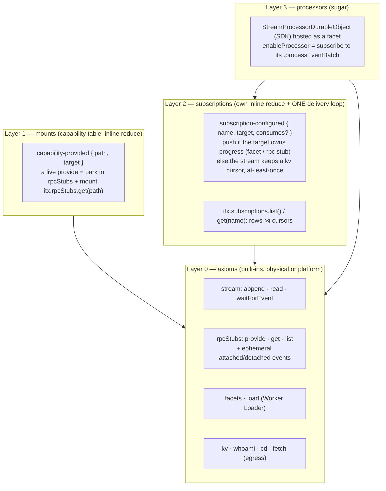

# Design: the onion — rpcStubs → mounts → subscriptions → processors

> Synthesis of six candidate designs (five subagents with opposed stances, plus my own baseline),
> written against HEAD `69080fd9e` (C7), revised after the first annotation round. Section 1 is the
> recommendation. Section 7 ends with the honest "what you actually lose" list. Section 8 shows where
> the candidates disagreed and why each choice went the way it did. Nothing here is code yet.

## 0. Your constraints, restated as the rules this design obeys

- **The interface is events, except the axiomatic built-ins.** Physical facts live in a built-in;
  events are pure data that name things by expression. No discriminator flags on events.
- **Layering.** Low axioms (`rpcStubs` and its presence events, the stream, `facets`, `load`) at
  the core; mounts, subscriptions, and processors are successive layers that only use what is
  below them. Sugar is kept visibly apart from axioms. `itx.connections` could one day be one more
  layer over `rpcStubs`. Not built here.
- **Sessions like apps/os**: `authenticate().projects.get(id)` returns the root context; `cd` takes
  absolute paths by convention (relative and `..` also resolve); no `list`/`create` yet; plural
  collections end in `Collection`.
- **A processor is a `DurableObject` subclass** of an SDK base, hosted through the ordinary
  `getDurableObjectClass`. No runner adapter, no third accessor, and, it turns out, no built-in
  processors at all.
- **Durable at-least-once delivery to a stateless `processEventBatch` worker is a requirement.**
- **Facet-owns-progress vs stream-keeps-offsets is a fair, real distinction.**
- **Anything expressible in userspace is not a built-in.** `connectToCapnweb` goes.
- **Latest Workers.** `ctx.props` on facets is available; bump wrangler, workers-types, and the
  compatibility date first. Installed today vs published latest (checked 2026-09-01):

  | Package                     | Installed    | Latest                 |
  | --------------------------- | ------------ | ---------------------- |
  | `wrangler`                  | 4.127.1      | 4.128.0                |
  | `@cloudflare/workers-types` | 4.20260702.1 | 5.20260901.1 (a major) |
  | `@cloudflare/vitest-plugin` | 1.0.0        | 1.1.3                  |
  | `compatibility_date`        | 2026-07-01   | 2026-09-01             |

## 1. The recommendation in one screen



Client usage, the whole surface in one block. Lines marked SUGAR are compositions of the lines above
them (section 6 keeps the two groups apart in the code too):

```ts
using api = newWebSocketRpcSession("wss://<worker>/api");
const itx = api.authenticate().projects.get("prj_123"); // the project ROOT context
const agent = itx.cd("/agents/support"); // absolute by convention; relative and ".." also resolve

await itx.provide("itx.greet", "itx.load(\"itx.kv.get('greet.js')\").getEntrypoint()"); // a mount
await itx.provide("itx.robot", robotObject); // SUGAR: parks in rpcStubs + mounts itx.rpcStubs.get('itx.robot')
await itx.rpcStubs.list(); // presence, physical

await itx.subscribe({ name: "tab", target: (events, range) => render(events) }); // SUGAR; push (see "range" below)
await itx.subscribe({
  name: "worker",
  target: "itx.greet.processEventBatch",
  consumes: ["task/created"],
}); // cursor, at-least-once
await itx.enableProcessor("presence", {
  source: "itx.kv.get('presence.js')",
  className: "Presence",
}); // SUGAR over subscribe
await itx.facets.get("presence").snapshot();
await itx.subscriptions.list(); // config rows joined with cursors and halts
```

**`range`, and how a push subscriber heals.** Every delivery carries `range = { after, through }`,
the offset window this batch covers (`after` exclusive, `through` inclusive). Consecutive deliveries
chain: this batch's `after` equals the last batch's `through`. A subscriber keeps the last `through`;
when the next `range.after` differs, a batch was missed (a socket blip, a dropped push) and one
`read(through)` fills the hole. That is the entire client-side protocol for a push target, it is
what the live-state client already does, and it is why a browser tab needs no server-side cursor.

## 2. Layer 0 — the axioms

Unchanged from C7 except: `fetch` becomes a root, `rpcStubs` gains presence events,
`getEntrypoint` takes Cloudflare's own `props`, and `connectToCapnweb` leaves.

```ts
interface BuiltInScope {
  whoami(): { projectId: string; path: string };
  kv: {
    get(k): Promise<string | null>;
    put(k, v): Promise<{ ok: true }>;
    delete(k): Promise<{ ok: true }>;
    list(prefix?): Promise<{ keys: string[] }>;
  };
  append(...events: StreamEventInput[]): Promise<StreamEvent[]>;
  read(afterOffset?: number, limit?: number): Promise<StreamPage>;
  /** Absolute by convention ("/agents/x"); relative and ".." also resolve. Same resolver as the edge `cd`. */
  cd(path: string): ContextHandle;
  /** Egress: {{secret:project:NAME}} substituted here, then FALLBACK. Loaded code's globalOutbound already lands here. */
  fetch(request: Request): Promise<Response>;
  /** THE physical registry. Keys are canonical dotted paths. */
  rpcStubs: { get(key: string): RpcStubHandle; list(): string[] };
  /** A facet that is already running, by name. Re-materializes from the parent's startup memo after eviction. */
  facets: { get(name: string): FacetHandle; delete(name: string): void };
  load(source: WorkerSource): {
    /** `props` is Cloudflare's WorkerStubEntrypointOptions.props — a url, a key name, whatever the code wants. */
    getEntrypoint(className?: string, opts?: { props?: unknown }): EntrypointHandle; // run · fetch · processEventBatch · anything it exports
    getDurableObjectClass(className: string): { get(instance?: string): FacetHandle };
  };
  runScript(script: string, ...args: unknown[]): Promise<unknown>; // sugar over load(...).getEntrypoint().run — kept for the bare-lambda case
}
```

`FacetHandle`, `RpcStubHandle`, `EntrypointHandle` are `InvokeHandle` subclasses the DO already
mints (same fold, a brand each). The brand is what Layer 2 reads.

**`connectToCapnweb` is userspace.** It was the one built-in that maps onto nothing Cloudflare
ships. A loaded entrypoint can dial a remote capnweb API through the context's own egress (secret
substitution included), and `props` carry the url:

```js
// remote.js — uploaded userspace code
import { WorkerEntrypoint } from "cloudflare:workers";
import { newHttpBatchRpcSession } from "capnweb";
export default class extends WorkerEntrypoint {
  call(path, args) {
    // walk the remote with no intervening awaits (one HTTP batch)
    let t = newHttpBatchRpcSession(this.ctx.props.url);
    for (const seg of path.slice(0, -1)) t = t[seg];
    return t[path.at(-1)](...args);
  }
}
```

```ts
await itx.provide(
  "itx.os",
  "itx.load(\"itx.kv.get('remote.js')\").getEntrypoint(undefined, { props: { url: 'https://os.iterate.com/api' } })",
);
```

**Presence events (new).** The rpcStub layer appends two **ephemeral** events on its own
transitions, so the log never claims a socket is open but a live watcher can see it change:

```ts
"events.iterate.com/rpc-stub/attached" (ephemeral): { key: string }   // pager opened for key
"events.iterate.com/rpc-stub/detached" (ephemeral): { key: string }   // final close for key
```

Nothing reduces them (ephemerals never reach an inline reduce). A UI subscribes with
`consumes: ["events.iterate.com/rpc-stub/attached", ".../detached"]` and seeds from `rpcStubs.list()`.

## 3. Layer 1 — mounts

Exactly C7. `capability-provided { path, target }`, `capability-revoked { providedAtOffset }`,
shadow stack, longest path wins, built-ins first, idempotent door. The `delivery`, `processor` and
`lane` fields are deleted (contract 5.0.0). `itx.subscribers.*` stops being a convention; a mount is
a name for a target and nothing else.

## 4. Layer 2 — subscriptions

### 4.1 Events and reduce

A third inline reduce-only processor, slug `subscriptions`, beside `core` and `capability-table`
(the layer gets its own reduce, not a bag on core). apps/os event names.

```ts
"events.iterate.com/stream/subscription-configured": {
  name: string;          // [A-Za-z0-9_-]+; same name REPLACES (no stack — an enablement wants replace, an alias wants shadow)
  target: string;        // an itx expression whose terminal is callable with (events: StreamEvent[], range: ScannedRange)
  consumes?: string[];   // consumesEvent rule: absent = every durable event; naming a type opts its ephemerals in
}
"events.iterate.com/stream/subscription-removed":          { name: string }
"events.iterate.com/stream/subscription-delivery-halted":  { name: string; afterOffset: number; attempts: number; error?: string }  // appended by the loop
"events.iterate.com/stream/subscription-delivery-resumed": { name: string; afterOffset?: number }   // operator: un-halt, optionally seek

// reduced state
subscriptions: Record<string, {
  target: Expression; consumes?: string[]; configuredAtOffset: number;
  halted?: { afterOffset: number; attempts: number; error?: string };
  resumed?: { afterOffset?: number; atOffset: number };            // level-triggered onto the cursor row
}>;
```

The `subscriptions` built-in is the small view you said you could live with:

```ts
subscriptions: {
  list(): Promise<SubscriptionListEntry[]>;
  get(name: string): Promise<SubscriptionListEntry | null>;
};
type SubscriptionListEntry = {
  name: string; target: string; consumes?: string[]; configuredAtOffset: number;
  /** Present only when the STREAM keeps the cursor (a target that cannot own its progress). */
  cursor?: { confirmedOffset: number; attempt: number; nextAttemptAtMs?: number };
  halted?: { afterOffset: number; attempts: number; error?: string };
};
```

It joins the reduced rows with the kv cursor rows. The cursor row is effect-side truth, like a
facet's checkpoint: never in the log (a per-batch cursor event would double every stream).

### 4.2 The one delivery loop, and the one rule

```
onCommit(fresh, scannedAfter, next):
  for (name, sub) of subscriptions:
    events = fresh.filter(consumesEvent(sub.consumes))
    after  = deliveredThrough[name] ?? scannedAfter;  deliveredThrough[name] = next     // in memory: a skipped batch rides the next range
    if events.empty: continue
    chain(name, async () => {
      { callee, method } = evaluateHead({ itx }, sub.target)      // everything but the final property step
      if callee is FacetHandle or RpcStubHandle:                 // IT OWNS ITS PROGRESS
        callOn(callee, method, [events, { after, through: next }])   // fire-and-forget; swallow CONNECTION_OFFLINE, log the rest
      else:                                                      // it cannot: THE STREAM KEEPS THE CURSOR
        cursorLane.push(name, sub, events, after, next)
    })

cursorLane.push / pump(name, sub):                               // one in flight per name; also entered from alarm()
  row = kv[`subscription-cursor:${name}`] ?? { confirmedOffset: sub.configuredAtOffset, attempt: 0 }
  apply sub.resumed if newer than the row (seek + attempt 0)
  if sub.halted or row.nextAttemptAtMs > now: return             // alarm() pumps due rows
  if row.confirmedOffset < after: deliver read(row.confirmedOffset → after) in pages, acking each   // durable gap repair
  try:   await apply({ itx }, sub.target, { boundaryArgs: [events, range] }, 20s watchdog)
         kv.put(row with confirmedOffset = next, attempt 0)
  catch: attempt++; if attempt ≥ 15 or error.retryable === false → append subscription-delivery-halted
         else row.nextAttemptAtMs = now + jitter(1s·2^attempt, ≤30m); kv.put(row); stream.armNoLaterThan(it)
alarm(): pump every cursor row that is due; then the idle quiesce as today
```

**The rule, in words:** the loop evaluates the target and looks at what Cloudflare handed back. A
facet stub or a parked rpc stub owns its own progress (the facet's checkpoint and gap repair; the
client's offset and `read`), so it gets a push. Anything else, a Worker Loader entrypoint, a sibling
context, a remote capnweb API, cannot own progress, so the context keeps a cursor and awaits each
call as the acknowledgement. Nothing is declared, stamped, or re-sniffed from a string; an alias
classifies correctly because it evaluates to the same handle.

The cursor lane is kernel code in the DO over the DO's own kv and the DO's own alarm, which is what
apps/os does (`StreamEventSender` in the stream DO) and what Cloudflare ships. It is not a facet
processor: that shape needed an alarm proxy facets do not have (workerd#6810, still open as of
2026-09-01), plus three parent doors and an auto-enable rule.

### 4.3 Edge sugar

```ts
/** A LIVE target parks under key `itx.subscriptions.<name>` and configures target
 *  "itx.rpcStubs.get('itx.subscriptions.<name>')"; an expression is stored as written. Same name
 *  replaces; an identical config appends NOTHING, so a reconnect is zero events. */
subscribe(input: { name?: string; target: ItxExpression | ProviderStub; consumes?: string[] }): Promise<{ name: string }>;
/** Appends subscription-removed; closes this session's parked stub under the key, if any. */
unsubscribe(name: string): Promise<void>;
```

An unnamed subscription gets `sub-<8 hex>` and is session-scoped: the session's dispose
unsubscribes it (best effort). A named one is durable by intent; when its tab dies the row stays,
pushes hit `CONNECTION_OFFLINE` and are swallowed, and the next `subscribe` with the same name
re-parks with zero events.

Live-state mode is not a mode: `subscribe({ target: fn, consumes: ["events.iterate.com/live-state/changed"] })`
and the client filters `payload.key`. The rule that no processor may reduce a live-state delta moves
into the SDK base, where it belongs.

## 5. Layer 3 — processors

### 5.1 The SDK base

```ts
// sdk/stream-processor-durable-object.ts — bundled into processor.js
export type StreamProcessorProps = { contextName: string; name: string };

export abstract class StreamProcessorDurableObject<State, Env = {}> extends DurableObject<
  Env & { ITX: ItxEntrypointStub },
  StreamProcessorProps
> {
  abstract readonly contract: ProcessorContract<State>;
  // the three hooks — the author surface
  protected reduce(args: ReduceArgs<State>): State | null | undefined;
  protected processEvent(args: ProcessEventArgs<State>): undefined;
  /** The live PROJECTION of the reduced state — what liveSnapshot() serves and what deltas are diffed over.
   *  Default: the state verbatim. Override to trim, or to fold in runtime fields the reduce does not own. */
  protected projectLiveState(state: State): unknown;
  // what an author reaches
  /** The owning context's parsed address — the same `{ projectId, path, name }` object the DO holds as #address
   *  (`name` is the canonical codec string). Parsed once from ctx.props.contextName. */
  protected readonly context: DurableObjectAddress;
  /** This processor's own name: the facet name, the subscription name, the `.get(name)` name. From ctx.props.name. */
  protected readonly name: string;
  /** The owning context's scope: the loaded isolate's env.ITX, bound at load. */
  protected get itx(): IterateContextScope;
  protected get stream(): ProcessorStream;
  protected publishLiveState(): void;
  protected idempotencyKey(key: string, whileProcessing?: StreamEvent): string;
  // the doors the delivery loop and itx.facets.get(name) reach
  processEventBatch(events: StreamEvent[], range: ScannedRange): Promise<void>;
  wake(): Promise<void>;
  snapshot(): Promise<ProcessorSnapshot<State>>;
  liveSnapshot(): Promise<{ rev: number; state: unknown }>; // { rev, state: projectLiveState(reduced) } — the client's seed door
  waitUntilProcessed(input: { offset: number; timeoutMs?: number }): Promise<void>;
  // never define alarm(): facets have none (workerd#6810). Nothing in scope needs one — see §7 "what you lose".
}
```

Identity is `ctx.props`, minted once by the only party that knows it: the parent passes
`{ props: { contextName, name } }` to `worker.getDurableObjectClass(className, { props })`, then
`ctx.facets.get(name, () => ({ class }))`. `configure()`, `FacetIdentity`, the identity kv key and
the `proc:`/`named:`/`stateful:` name prefixes all die. A processor IS a named facet; the facet
name is the subscription name is the `.get(name)` name.

Today's `core/processor.ts` engine (serial chain, checkpoint, gap repair, at-head pass, version
refold, live-state publish) is **split, not wrapped**: it becomes `StreamProcessorRunner`, a
dependency-free class taking hooks plus `{ stream, storage, path }`, still Node-testable and still
the home of `ReduceOnlyProcessor` and `consumesEvent` for the inline hosts. The DO base is ~60
lines of wiring around it. The abstract `StreamProcessor` author class disappears: the author's
DurableObject is the processor (deliberate divergence from apps/os's two-class
`createProcessor(deps)`; that split existed so one processor could run either in a facet or its own
DO, and the clean room has only facets).

### 5.2 There are no built-in processors

With the forwarder re-homed into the kernel, nothing the platform needs runs as a facet processor.
`core`, `capability-table` and `subscriptions` are inline reduces. Tally was only ever the
facet-spine demo, so it becomes what the demo's `Presence` already is: a userspace source seeded by
`e2e/support/sources.ts`, extending the same base. That deletes `processor-facet.ts`,
`FACET_PROCESSORS`, `BUILT_IN_PROCESSOR_SLUGS`, the `ProcessorFacet` export, and the `itx.exports`
root an earlier draft proposed. `enableProcessor` always has a source:

```
enableProcessor(name, { source, className }) ⇒ subscribe({ name, target: `itx.load(${src}).getDurableObjectClass('${className}').get('${name}').processEventBatch` })
disableProcessor(name)                       ⇒ unsubscribe(name); itx.facets.delete(name)      // storage included
```

A userspace processor, plain JS, one class:

```js
import { StreamProcessorDurableObject, defineProcessorContract, z } from "./processor.js";
const contract = defineProcessorContract({
  slug: "presence",
  version: "1.0.0",
  description: "ticks",
  stateSchema: z.object({ ticks: z.number().default(0) }),
  events: {},
  consumes: ["tick", "poke"],
  emits: [],
});
export class Presence extends StreamProcessorDurableObject {
  contract = contract;
  #lastPokeMs = 0;
  reduce({ event, state }) {
    if (event.type === "tick") return { ...state, ticks: state.ticks + 1 };
  }
  processEvent({ event }) {
    if (event?.type === "poke") {
      this.#lastPokeMs = Date.now();
      this.publishLiveState();
    }
  }
  projectLiveState(state) {
    return { ...state, lastPokeMs: this.#lastPokeMs };
  }
}
```

The stateless project worker, apps/os shape:

```js
import { WorkerEntrypoint } from "cloudflare:workers";
export default class extends WorkerEntrypoint {
  async processEventBatch(events, range) {
    // resolving IS the ack; throwing ⇒ retry; { retryable: false } ⇒ halt now
    const itx = await this.env.ITX.get();
    for (const e of events) await react(itx, e, `${e.path}@${e.offset}`); // the idempotency-key idiom
  }
}
```

```ts
await itx.provide("itx.worker", "itx.load(\"itx.kv.get('worker.js')\").getEntrypoint()");
await itx.subscribe({ name: "project-worker", target: "itx.worker.processEventBatch" });
(await itx.subscriptions.get("project-worker")).cursor; // { confirmedOffset, attempt, nextAttemptAtMs? }
await itx.append({
  type: "events.iterate.com/stream/subscription-delivery-resumed",
  payload: { name: "project-worker", afterOffset: poison.offset },
});
```

## 6. The edge surface, complete — axioms apart from sugar

```ts
class UnauthenticatedSession extends RpcTarget { authenticate(credentials?: unknown): Session }   // what /api serves; no-op gate today
class Session extends RpcTarget { readonly projects: ProjectCollection; [Symbol.dispose](): void }  // dispose: relays + anonymous subscriptions
class ProjectCollection extends RpcTarget { get(projectId: string): IterateContext }               // the ROOT context; pure addressing

// iterate-context.ts — AXIOMS: each is a built-in door that needs the edge (a session-held stub, a live Request, a fold)
class IterateContext extends RpcTarget {
  cd(path: string): IterateContext;                                    // absolute by convention; returns an EDGE context
  invokeCapability(call: ItxExpression): Promise<unknown>;             // THE dispatch door; a terminal .fetch(Request) rides the fetch lane
  append(...events: StreamEventInput[]): Promise<StreamEvent[]>;
  read(afterOffset?: number, limit?: number): Promise<StreamPage>;
  waitForEvent(filter?: WaitForEventFilter): Promise<StreamEvent>;    // an HTTP-batch client's only "next event"
  fetch(request: Request): Promise<Response>;                          // egress
  get rpcStubs(): RpcStubs;                                            // provide(fn,{key}) · get(key) · list() · close(key) — the physical axiom
  [dotted: string]: unknown;   // whoami · kv · facets · subscriptions · load · runScript · every mount
}

// sugar.ts — SUGAR: plain functions over the axioms, installed on the same RpcTarget so the client sees one object.
// Each is a one-line composition and appends no event shape of its own.
provide(path: string, target: ItxExpression | ProviderStub): Promise<{ providedAtOffset: number }>;   // fn ⇒ rpcStubs.provide + mount itx.rpcStubs.get(path)
revoke(input: string | { providedAtOffset: number }): Promise<void>;                                 // + close this session's stub at that path
subscribe(input: { name?: string; target: ItxExpression | ProviderStub; consumes?: string[] }): Promise<{ name: string }>;
unsubscribe(name: string): Promise<void>;
enableProcessor(name: string, ref: { source: WorkerSource; className: string }): Promise<{ ok: true }>;
disableProcessor(name: string): Promise<{ ok: true }>;
```

Splitting the file this way is the answer to "could we separate the sugar from the axiomatic base
layer": the client still holds one `itx`, but the code reads as the tutorial does, axioms first and
everything else composition. `provide(path, expression)` with a string target is itself an append
(`capability-provided`) and could live in either half; it sits with the sugar so the axiom half
contains nothing that appends a Layer 1 or Layer 2 event.

Gone: `ProjectSession.get`, `?ctx=` on `/api` (`/cap` takes `?project=`; sub-contexts via `cd` in
the expression), `fetchCap`, `resumeSubscription`, `provide(opts)`, `unsubscribe({ name })`,
`connectToCapnweb`.

## 7. What is deleted, what is added, what you actually lose

| Delete                                                                                                                                                                                                                                                                                    | Where                                                | ~lines     |
| ----------------------------------------------------------------------------------------------------------------------------------------------------------------------------------------------------------------------------------------------------------------------------------------- | ---------------------------------------------------- | ---------- |
| the forwarder facet: cursor, ladder, halt, pump door, alarm proxy, auto-enable                                                                                                                                                                                                            | `subscription-forwarder-processor.ts` + DO doors     | 335 + ~70  |
| `ProcessorFacet`, `FACET_PROCESSORS`, `BUILT_IN_PROCESSOR_SLUGS`, `FacetIdentity`, `configure`, built-in Tally                                                                                                                                                                            | `processor-facet.ts`                                 | 180        |
| `ProcessorFacetRunner` (`runner.js`) and its build step                                                                                                                                                                                                                                   | `runner-entry.ts`, `generated/processor-runner.ts`   | 79 + gen   |
| `laneOf`, `facetTarget`, `rpcStubTarget`, `SubscriptionMount`, `#subscriptionMounts`, `#activeSubscriptionMounts`, `#deliverToConnectedSubscriptions`, `#driveFacets`, `#facetEntries`, `#facet`, the resurrection pass, `revokeCapability.all`, DO-side `enable/disableProcessor` bodies | `stream-durable-object.ts`                           | ~400 → ~70 |
| `delivery` / `processor` / `lane` on `capability-provided`; `ProcessorPolicy`; `deliverTo` by row                                                                                                                                                                                         | `capability-table-processor.ts` (→ 5.0.0)            | ~80        |
| `DeliveryPolicy`, `SubscriptionLane`                                                                                                                                                                                                                                                      | `core/events.ts`                                     | ~35        |
| abstract `StreamProcessor` as an author class                                                                                                                                                                                                                                             | `core/processor.ts` (reshaped into the runner)       | —          |
| `connectToCapnweb` root (+ `connect.e2e`)                                                                                                                                                                                                                                                 | `built-ins.ts`, `worker.ts` brand registration stays | ~25        |
| `ProjectSession.get`, `?ctx=`, `DEFAULT_CTX`, `fetchCap`, `resumeSubscription`, `provide` opts, live-state mode                                                                                                                                                                           | `itx-surface.ts`, `worker.ts`                        | ~110       |

| Add                                                                                                                                        | Where                                                           | ~lines        |
| ------------------------------------------------------------------------------------------------------------------------------------------ | --------------------------------------------------------------- | ------------- |
| `UnauthenticatedSession` / `Session` / `ProjectCollection`; `cd` relative; `fetch` root; `/cap?project=`; `getEntrypoint(name, { props })` | `session.ts`, `iterate-context.ts`, `built-ins.ts`, `worker.ts` | ~95           |
| `subscriptions` inline reduce (4 events) + the `subscriptions` built-in view                                                               | `stream/subscriptions.ts`                                       | ~80           |
| the delivery loop + cursor lane over kv + alarm                                                                                            | `stream/subscription-delivery.ts`                               | ~140          |
| `StreamProcessorRunner` (rename + hook-parameterize) + `StreamProcessorDurableObject`                                                      | `stream/`, `sdk/`                                               | ~30 net + ~60 |
| `FacetHandle` / `RpcStubHandle` / `EntrypointHandle` brands; `facet:<name>` startup memo; `facets.delete`                                  | `invoke-handle.ts`, the DO, `built-ins.ts`                      | ~40           |
| presence events on attach/final close; tally as a test-fixture source                                                                      | `rpc-stub-directory.ts`, `e2e/support/sources.ts`               | ~30           |

Net roughly −950 lines. Concepts dead: lane, delivery policy, processor policy, facet identity,
configure, runner adapter, alarm proxy, forwarder facet, built-in processors, `itx.subscribers.*`,
subscription shadow stacks, `all:` revoke, live-state mode, `maxAttempts`/`start`, resurrection pass,
`?ctx=`, `connectToCapnweb`. Concepts added: cursor (kv row), `itx.subscriptions`, the two presence
events, the three handle brands.

### What you actually lose (the honest list)

Nothing you can do today becomes impossible. Four things get coarser and two safety nets go:

1. **Per-subscription retry tuning.** `maxAttempts` and `start` become one fixed ladder
   (15 attempts, 1s·2ⁿ capped at 30 min, `retryable: false` halts at once) and "start from the
   beginning" is `subscription-delivery-resumed { afterOffset: 0 }`. apps/os's defaults, no knobs.
2. **Server-side live-state key filtering.** A tab that consumes `live-state/changed` receives every
   key's deltas and filters `payload.key` itself. With N publishing processors that is N small
   ephemeral deltas per commit per tab. If it is measured to matter, `consumes` can grow a payload
   predicate later; the kernel does not change.
3. **The forwarder as "a model citizen of the processor idiom".** The cursor lane becomes ~140
   lines of kernel code. Smaller than today, larger than design C's kernel, and it maps onto DO
   storage and the DO alarm, which Cloudflare ships; the facet version needed an alarm proxy,
   which Cloudflare does not.
4. **`connectToCapnweb`'s one-round-trip pipelining from the DO.** Userspace gets the same
   behaviour inside its isolate (section 2). One extra loader hop per call.
5. **The resurrection pass.** Today the first alarm of each incarnation snapshots every facet, so
   a reduce aborted by an eviction catches up without traffic. Under the design a facet catches up
   on the next push (every append pushes to every subscription) or the next read (which
   gap-repairs). The residual: a DO woken by something that is not an append and not a facet read,
   say a pager message, would not re-drive facets until the next append. Reduced state is never
   wrong; only a lost `processEvent` effect waits for traffic, which is exactly the obligation
   pattern's at-head recovery in apps/os anyway.
6. **The alarm proxy.** Its only user was the forwarder, and the forwarder moves into the DO,
   which has a real alarm. So it is not "we do not need alarms", it is "no facet in scope needs
   one". The first processor or mini-app that wants a timer (a scheduler, a debounce, an obligation
   keepalive) needs something. Your preferred shape (2026-09-01) is not a proxy at all but a
   **scheduled append**: the context natively supports "append this event at time T"
   (`itx.append({ type, payload, at: atMs })` or a sibling verb), the stream's own alarm commits it
   when due, and it reaches every processor through the ordinary `processEventBatch` door like any
   other event. That is one kernel feature over the DO's real alarm, no facet ever touches an
   alarm API, and it stays correct the day workerd#6810 ships facet alarms. Adding it now would be
   speculative machinery with zero callers; it is the answer when the first caller appears.

## 8. Where the six candidates disagreed, and why each call went this way

| Decision                                        | Candidates                                                                                                                                                     | Chosen                                   | Why                                                                                                                                                                                                                                                                                                                                        |
| ----------------------------------------------- | -------------------------------------------------------------------------------------------------------------------------------------------------------------- | ---------------------------------------- | ------------------------------------------------------------------------------------------------------------------------------------------------------------------------------------------------------------------------------------------------------------------------------------------------------------------------------------------ |
| How the two kinds are told apart                | A: structural predicate on the expression string · B: declared `receiver.delivery?` field · C/D: by which event you appended · E: brand of the evaluated value | **E**                                    | No flag on the event, and alias-robust: the loop already evaluates the target before calling it, so it costs nothing to look at what came back. A's string predicate misclassifies an alias; B's field is a declaration the target already implies.                                                                                        |
| Live browser tabs                               | A, C: stream keeps a cursor per tab (at-least-once, hold on offline) · B, D, E: push, client owns its offset                                                   | **push**                                 | Today's measured behaviour (p50 ~215 ms, zero server state) survives untouched; the live-state client already heals by `read`. A per-tab kv write per batch and per-tab back-pressure buy reconnect catch-up nobody asked for yet. If a device later needs it, that is a new requirement, not a flag.                                      |
| Where the cursor lane lives                     | A, B, E: kernel loop in the DO over kv + alarm · C, D: a built-in facet processor                                                                              | **kernel loop**                          | Maps onto what Cloudflare ships (DO storage, DO alarm); a facet version needs an alarm proxy Cloudflare does not ship, three parent doors and an auto-enable rule. apps/os hosts its sender in the stream DO too. C's kernel is smaller on paper but adds two hops and ack serialization in front of every tab, an unmeasured latency bet. |
| Where subscription rows are reduced             | A, B, E: the core reduce · C, D: a facet's own reduce · this doc: its own inline reduce                                                                        | **own inline reduce**                    | Your layering: subscriptions are a layer, so they get their own reduce beside `core` and `capability-table`, not a bag on the stream's operational truth. Same engine, one more slug.                                                                                                                                                      |
| Whether a tab's subscription is an event at all | B: no, `openConnection` is physical, event types ride the pager attachment · others: `subscription-configured` targeting `itx.rpcStubs.get(...)`               | **an event**                             | Your feedback 8 asked for an event that tells the stream to send events to a live subscriber. B's shape leaks nothing but loses that, and adds a verb. The leak (rows for dead named tabs) is bounded by distinct names and swept for anonymous ones.                                                                                      |
| Presence                                        | all: `rpcStubs.list()`; B optional ephemeral connection events                                                                                                 | **list() + ephemeral attached/detached** | Your "rpcStub and associated presence event". Ephemeral keeps C7's promise: the log never claims a socket is open.                                                                                                                                                                                                                         |
| Processor identity                              | A, B, D: `env.ITX.whoami()` · C: keep `configure()` until props land · E: `ctx.props`                                                                          | **`ctx.props`**                          | You confirmed facets get `ctx.props` on current Workers; the installed types already carry `getDurableObjectClass(name, { props })` and `DurableObjectState<Props>.props`. One mint by the only party that knows the identity; no side channel, no `whoami` round trip.                                                                    |
| Engine vs SDK base                              | C, D: merge the engine onto the DO base · E: split into a hook-parameterized runner + a thin base · B: keep apps/os two-class `createProcessor`                | **split**                                | The engine stays dependency-free and Node-tested; the inline hosts keep using it; the author writes one class.                                                                                                                                                                                                                             |
| Built-in processors                             | D: ship as SDK-bundled source through the loader · B: `facets.get(name)` with a name→class map · E: `itx.exports.<Class>.get(name)` · this doc: none           | **none**                                 | With the forwarder in the kernel, no platform processor runs as a facet. Tally is a demo and becomes a test fixture like `Presence`. `itx.exports` was a root serving one demo class.                                                                                                                                                      |
| Recovery                                        | A/B/E: `-cursor-set` + `-delivery-resumed` (apps/os pair) · C/D: one `-delivery-resumed { afterOffset? }`                                                      | **one event**                            | Resume, optionally from a new offset, reads as one operator intent. apps/os's pair stays available if the two ever need to differ.                                                                                                                                                                                                         |
| `subscribe`/`unsubscribe` verbs                 | B: delete, append events directly · D: a subscription IS a provide · A, C, E: keep as edge sugar                                                               | **keep as sugar, in `sugar.ts`**         | A live target needs the edge to park the stub, so sugar exists anyway; the same two lines serve expressions. Your annotation asked for sugar to be visibly apart from axioms, so it gets its own file.                                                                                                                                     |

## 9. Sequence

Each step is one commit, gated by `pnpm typecheck && pnpm test && pnpm e2e` in the package.

| #   | Commit                                                                                                                                                                                                                                                                                                                                                                                                                                                             | Notes                                                                                                                                             |
| --- | ------------------------------------------------------------------------------------------------------------------------------------------------------------------------------------------------------------------------------------------------------------------------------------------------------------------------------------------------------------------------------------------------------------------------------------------------------------------ | ------------------------------------------------------------------------------------------------------------------------------------------------- |
| 0   | **Latest Workers + the probe.** Bump wrangler, `@cloudflare/workers-types` (5.x), `@cloudflare/vitest-plugin`, and `compatibility_date`. Add a `__workers-tests__` probe: a facet started from `worker.getDurableObjectClass('X', { props })` sees `ctx.props`. Re-check workerd#6810 (facet alarms) while there.                                                                                                                                                  | The one platform fact this design leans on. If it fails, fallback is `FacetStartupOptions.id = "<contextName>#<name>"` parsed from `ctx.id.name`. |
| 1   | **Sessions, `cd`, `fetch`, `props`.** `UnauthenticatedSession`/`Session`/`ProjectCollection`; relative `cd` on both sides; `fetch` on the edge and as a root; `fetchCap` folded into the dotted door; `/cap?project=`; `getEntrypoint(name, { props })`; delete `?ctx=`, `ProjectSession.get`, `connectToCapnweb` (re-spell `connect.e2e` as a userspace worker). Re-point `e2e/support/client.ts` and `__tests__/harness.ts`.                                     | Independent of 2 and 3.                                                                                                                           |
| 2   | **Subscriptions layer.** The `subscriptions` inline reduce and its four events; the one delivery loop with the brand rule; the cursor lane over kv + alarm; `itx.subscriptions` view; `subscribe`/`unsubscribe` in `sugar.ts`; presence events; delete the forwarder, lanes, policies, live-state mode, resurrection pass, `revokeCapability.all`. Processors keep working through `itx.facets.get(slug).processEventBatch` targets on the existing facet hosting. | The big one. Facet hosting itself is untouched here.                                                                                              |
| 3   | **Processor layer.** `StreamProcessorRunner` split; `StreamProcessorDurableObject` in the SDK with `context`, `name`, `projectLiveState`; `ctx.props` identity; tally becomes a fixture source; `enableProcessor` re-spelled; delete `runner-entry.ts`, `processor-facet.ts`, `configure`, the facet-name prefixes.                                                                                                                                                | Depends on 0 and 2.                                                                                                                               |
| 4   | **Layout.** Folders by primitive, `sugar.ts`, the renames, import rewrites, tutorial appendix, `LAYERS.md`.                                                                                                                                                                                                                                                                                                                                                        | `git mv` only.                                                                                                                                    |
| 5   | Rewrite `docs/clean-room-api-walkthrough.md` to the new surface; retire the "in flight" banner and the superseded docs' banners.                                                                                                                                                                                                                                                                                                                                   |                                                                                                                                                   |

Layout after step 4 (the tutorial's map):

```text
src/
  worker.ts  session.ts  iterate-context.ts  sugar.ts  itx-entrypoint.ts  iterate-context-durable-object.ts
  context/   built-ins.ts capability-table.ts expression.ts dispatch.ts invoke-handle.ts dotted-path-proxy.ts
             rpc-stub-directory.ts rpc-stub-relay.ts hibernatable-rpc-stub.ts worker-loader.ts durable-object-names.ts
  fetch/     fetch-capabilities.ts egress.ts
  stream/    stream.ts events.ts core-processor.ts inline-core.ts reduce-checkpoint.ts
             stream-processor-runner.ts subscriptions.ts subscription-delivery.ts
  sdk/       index.ts (→ processor.js) stream-processor-durable-object.ts live-state.ts patch.ts
  lib/ errors.ts logs.ts hash.ts     client/     generated/
```

Steps 1 and 3 can run as parallel agents once 0 and 2 are in. Step 2 touches the DO's commit path
and I would do it myself.

Tests. Die: `resume-race`, `resume-race-control` (the facet's rev-CAS race no longer exists),
`disable-shadow` (same name replaces), `resub-zombie` (folds into `reconnect`). Re-spelled:
`connect` (userspace remote worker), `push` (cursor via `itx.subscriptions`, halt/resume as
events), `live-state`/`woken`/`ephemeral`/`ephemeralflood` (subscribe shape; live-state mode →
consumes + client key filter), `facet1`/`userfacet`/`facetaddr`/`load`/`dw2dw`/`source-refetch`/
`edge` (tally from a seeded source, bare facet names, `.fetch` dotted), every e2e via
`support/client.ts` (`.projects.get(ctx)`, `subscriberMounts` → `itx.subscriptions.list()`). Unit:
`processor(.failing).test.ts` onto the runner; `capability-table-processor.test.ts` loses lane/policy
cases; `do-doors`/`failing-alarm-quiesce` re-spelled (cursor pump in `alarm()`). `ephemeralflood` is
re-measured, not just re-spelled: the push path for tabs is unchanged, so its numbers should hold.

## 10. Open risks, ranked

1. ~~`ctx.props` through `ctx.facets.get`~~ **Proven** (step 0, `__workers-tests__/facet-props.test.ts`,
   2026-09-01): props minted at `worker.getDurableObjectClass(name, { props })` arrive as
   `ctx.props` inside the facet. Two more facts pinned there: a facet's `ctx.id.name` is its
   PARENT's codec name, and `ctx.exports` is populated inside a facet. Also learned: workers-types'
   `Rpc.Serializable` rejects `unknown`, so any stub method returning a `StreamEvent`
   (`payload: Record<string, unknown>`) types as `never` on the stub (it compiles only because
   `never` is assignable to anything). A recursive JSON payload type hits TS2589 inside
   `Rpc.Serializable`, so that fix is unavailable; the one caller that destructures such a result
   (the control-plane shell) casts, with a comment. Step-0 bump landed at wrangler 4.127.1 /
   workers-types 5.20260901.1 / vitest-plugin 1.1.2: the repo's 24h `minimumReleaseAge` excludes
   same-day releases.
2. Named tab subscriptions outlive their tabs. Bounded by distinct names; anonymous ones are
   swept on session dispose. A TTL is a later, separate decision.
3. The brand check needs the DO-minted handle, not something that crossed RPC. A sibling
   context's facet (`itx.cd('/x').facets.get('p')`) therefore classifies as remote and gets a cursor
   it does not strictly need. Harmless double bookkeeping, and exactly apps/os's `wake-processor`
   placement.
4. No facet alarm in scope (section 7, item 6). The first timer-needing processor adds the generic
   proxy as its own commit.
5. Presence events on a paused stream are refused like every non-control ephemeral. Paused means
   quiet; accepted.
6. Ephemerals reach cursor targets only when the target is caught up (they ride the pushed batch,
   never the log). Same contract as today's forwarder.
