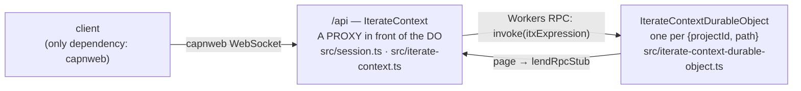

# The clean-room itx surface, as built

> `packages/v3/project-worker`, the review commit of 2026-09-02 (after the first Plannotator
> round on this document). Every signature below is transcribed from source; the file is named so
> you can check. Sections 1–11 are what exists. Section 12 records what the review decided and
> what is still open, each open item with a concrete proposal. The long-form walkthrough is
> `docs/clean-room-api-walkthrough.md`; the design record is `docs/proposals/itx-surface-SYNTHESIS.md`.

---

## 1. The picture

One stateless worker, one Durable Object class, one dotted surface.



- **The context** is a dotted surface. `itx.kv.get('x')`, `itx.slack.chat.postMessage(…)`,
  `itx.append({…})` are all ONE thing on the wire: `invoke(itxExpression)`.
- **Two vocabularies, kept apart.** (a) **rpc stubs**: physical. A client's live function or
  RpcTarget, lent under an opaque `rpcStubKey`, borrowed by the DO, paged back on demand.
  (b) **itx-expression rewrite rules**: pure data. `{ match, target }` in a record keyed by the
  canonical match, written by one event. "A call starting with `match` runs as the same call with
  `match` replaced by `target`."
- **Everything else is an event.** The DO has `append` and no configuration verbs. The edge's
  verbs (`provide`, `subscribe`, `enableProcessor`, `disableProcessor`) build an event and append it.
- **The DO is the parent** of: the stream, the core reduce (inline at commit), the one delivery
  loop, the facets (loaded DurableObject classes), the rpc-stub directory, the fetch door.
- **Two hosts for loaded code, one door each:** `itx.workers.get(spec)` (stateless) and
  `itx.facets.get(name, spec)` (durable).
- **Bindings, named for what they hold.** `env.ITERATE_CONTEXT` is the project worker's
  `DurableObjectNamespace<IterateContextDurableObject>` (singular, the Cloudflare and apps/os
  convention: `PROJECT`, `STREAM`, `MY_DURABLE_OBJECT`). `env.ITX` is what a LOADED worker gets: a
  stub of `ItxEntrypoint` minted with the one prop `iterateContextName`.

---

## 2. The tour in the tutorial's order

Five chapters. Each one adds exactly one idea. Every example uses the string half of the codec;
the array half (`["itx", "kv", ["get", "x"]]`) is the same call and is what a dotted call compiles to.

```ts
using api = newWebSocketRpcSession("wss://<worker>/api");
const itx = api.authenticate().projects.get("prj_demo"); // the root context "/"
const support = itx.cd("/agents/support"); // pure addressing, no DO hop

// ── 1. rpc stubs: provide a live stub — it is lent under the key = its match ──
using laptop = await itx.provide("itx.laptop", {
  async ping() {
    return "pong";
  },
});
await itx.invoke("itx.rpcStubs.get('itx.laptop').ping()"); // "pong" — the physical door
await itx.invoke("itx.laptop.ping()"); // "pong" — through the rule provide wrote

// ── 2. itx expressions: the dotted sugar IS invoke ──
await itx.laptop.ping(); // the same call

// ── 3. rewrite rules: provide an EXPRESSION and it is a pure rewrite ──
using grok = await itx.provide("itx.grok", "itx.openai.chat"); // itx.grok(x) ⇒ itx.openai.chat(x)
await itx.provide("itx.ai.run('gpt-5')", async (inputs) => …); // a live stub behind a pinned arg
await itx.provide("itx.laptop", null); // delete

// ── 4. subscriptions: a name for a delivery ──
using tail = await itx.subscribe({
  target: (events, range) => render(events), // a live callback…
  consumes: ["events.iterate.com/chat/message"],
});
await itx.subscribe({ name: "mirror", target: "itx.cd('/archive').append" }); // …or an expression
await itx.append({ type: "events.iterate.com/chat/message", payload: { text: "hi" } });

// ── 5. processors: a subscription whose target is a facet's processEventBatch ──
await itx.enableProcessor("presence", {
  source: { "cap.js": PRESENCE_SOURCE },
  className: "PresenceDurableObject",
});
await itx.facets.get("presence").snapshot();
await itx.disableProcessor("presence"); // ONE event; the facet goes with it

// the durable spelling of any verb is its raw event (no handle, outlives the session)
await itx.append({
  type: "events.iterate.com/itx/rewrite-rule-configured",
  payload: { match: "itx.cam", target: "itx.rpcStubs.get('cam')" },
});
```

---

## 3. Itx expressions (`src/context/expression.ts`)

The one codec every door speaks. String half ⇄ structured half.

| Type                  | Shape                                             | Example                                          |
| --------------------- | ------------------------------------------------- | ------------------------------------------------ |
| `ItxExpressionStep`   | `string` (property) or `[method, ...args]` (call) | `"kv"`, `["get", "x"]`                           |
| `ItxExpression`       | `ItxExpressionStep[]`, root first                 | `["itx", "kv", ["get", "x"]]`                    |
| `ItxExpressionInput`  | `string \| ItxExpression`                         | `"itx.kv.get('x')"` — what every door accepts    |
| `ItxExpressionPrefix` | an `ItxExpression` used as a rule's `match`       | `["itx", "ai", ["run", "gpt-5"]]` pins `'gpt-5'` |

- Args are JSON5 in the string half. `print(parse(s))` round-trips; the canonical spelling
  (`canonicalItxExpressionPrefix`) is the rewrite-rule record's key.
- The **anonymous call step** `""` calls the value itself: `itx.rpcStubs.get('cam')(1)` is
  `["itx","rpcStubs",["get","cam"],["",1]]`. It is what a rule spells when a lent stub is
  called with args.
- **The dotted surface is a prototype hop**, not a Proxy around the instance
  (`src/context/dotted-path-proxy.ts`, `installPrototypeInvokeFallback`). Declared methods
  win; every unknown segment accumulates and lands on `invoke` as ONE expression. It is a
  prototype hop so workerd's pipelining brand-check still passes (workerd#6873).

---

## 4. The edge: what `IterateContext` declares (`src/iterate-context.ts`, 355 lines)

The class declares only what the edge must do itself. Everything else rides the hop. Since this
review the class's TYPE also carries every built-in root (section 5) by declaration merging
(`export interface IterateContext extends Omit<BuiltInScope, "cd"> {}`): zero runtime, but a
reader of the file sees the whole surface, and `env.ITX.get().append(…)` typechecks in loaded code.

| Method                                                                                 | Returns                           | What physically happens                                                                                                                                                                                                                                                    |
| -------------------------------------------------------------------------------------- | --------------------------------- | -------------------------------------------------------------------------------------------------------------------------------------------------------------------------------------------------------------------------------------------------------------------------- |
| `cd(path)`                                                                             | `IterateContext`                  | Pure addressing. Absolute by convention, relative resolves. Returns an EDGE context so a later `provide` lends in this session.                                                                                                                                            |
| `invoke(call: ItxExpressionInput)`                                                     | `Promise<unknown>`                | THE door. `durableObject.invoke(expression)`. One fork: a terminal `fetch(Request)` rides `durableObject.fetch` with the expression in `x-itx-expression`.                                                                                                                 |
| `provide(match, target: ClientRpcStub \| ItxExpressionInput \| null)`                  | `RewriteRuleHandle`               | THE ONE FRONT DOOR: make `match` mean `target`. A live stub is lent to the DO through a pager owned here (DON'T-PIN) under the key = the canonical match, and the rule `match ⇒ itx.rpcStubs.get('<match>')` is appended; an expression is the rule alone; `null` un-sets. |
| `subscribe({ name?, target: ItxExpressionInput \| ClientRpcStub \| null, consumes? })` | `SubscriptionHandle` (has `name`) | A live target is lent under the key `subscription:<name>` first, then `append(subscriptionConfiguredEvent(…))` with target `itx.rpcStubs.get('subscription:<name>')`.                                                                                                      |
| `enableProcessor(name, { source, className, consumes? })`                              | `{ name }`                        | `append(subscriptionConfiguredEvent)` with target `itx.facets.get(name, { source, className }).processEventBatch`. DURABLE, no handle.                                                                                                                                     |
| `disableProcessor(name)`                                                               | `void`                            | ONE append: `{ name, target: null }`. The DO deletes the facet the row hosted before the append returns (section 9).                                                                                                                                                       |

The two handles (`RewriteRuleHandle`, `SubscriptionHandle`) are server-side RpcTargets with one
member, `[Symbol.dispose]`, plus a `name` getter on `SubscriptionHandle`. Disposing undoes the act. capnweb disposes every
exported handle when the session ends, so **a verb's effect is session-scoped; the raw event
is durable**.

`ClientRpcStub` (`src/context/rpc-stub-relay.ts`) is the type of what a client hands over:
`{ dup(): ClientRpcStub; [k: string]: unknown }`. On the wire it is a callable capnweb Proxy, so
a bare `async function` and an `RpcTarget` subclass both work.

How a client reaches one (`src/session.ts`):
`UnauthenticatedSession.authenticate(credentials?)` (a no-op gate today) → `Session.projects`
→ `ProjectCollection.get(projectId)` → the root `IterateContext`. Nothing here touches a DO.

---

## 5. The built-in roots: the DO's physical scope (`src/context/built-ins.ts`, 318 lines)

A plain record. A call `itx.<root>…` resolves DIRECTLY against these, no rule. A rule's target
must be rooted at `itx`, so a bare root is unspellable and the built-ins are unshadowable.

| Root                         | Signature                                                                                                                          | Backed by                                                     |
| ---------------------------- | ---------------------------------------------------------------------------------------------------------------------------------- | ------------------------------------------------------------- |
| `whoami()`                   | `→ { projectId, path }`                                                                                                            | the DO name                                                   |
| `kv`                         | `.get(k)` `.put(k, v)` `.delete(k)` `.list(prefix?)`                                                                               | `ITX_KV`, `${projectId}:` prefixed                            |
| `append(...events)`          | `→ StreamEvent[]`                                                                                                                  | the stream                                                    |
| `read(afterOffset?, limit?)` | `→ { events, scannedThroughOffset }`                                                                                               | the stream                                                    |
| `waitForEvent(filter?)`      | `{ type?, afterOffset?, timeoutMs? } → StreamEvent`                                                                                | the stream                                                    |
| `cd(path)`                   | `→ InvokeHandle` onto a sibling context (append/read skip its rules; else `invoke`)                                                | `ITERATE_CONTEXT.getByName`                                   |
| `fetch(request)`             | egress: `{{secret:project:NAME}}` substituted → `FALLBACK`                                                                         | the control plane                                             |
| `rpcStubs`                   | `.get(rpcStubKey) → RpcStubHandle` · `.list() → string[]` (presence)                                                               | `RpcStubDirectory`                                            |
| `rewriteRules`               | `.list() → { match, target }[]` · `.get(match)`                                                                                    | a read of core state                                          |
| `facets`                     | `.get(name) → FacetHandle` (a RUNNING facet) · `.get(name, { source, cacheKey?, className })` (load and host it) · `.delete(name)` | `ctx.facets`; mirrors `ctx.facets.get(name, startupCallback)` |
| `subscriptions`              | `.list() → SubscriptionListEntry[]` · `.get(name)`                                                                                 | core state ⋈ the loop's cursors                               |
| `workers`                    | `.get({ source, cacheKey?, className?, props? }) → InvokeHandle`, a stateless WorkerEntrypoint; any exported method                | Worker Loader; the stateless twin of `facets.get`             |
| `runScript(script, ...args)` | sugar: wrap the lambda string → `workers.get({ source }).run(...)`                                                                 | same                                                          |

`WorkerSource` is the worker's modules, literally (`Record<string, string>`, module name → code,
`"cap.js"` the main module) OR an itx expression that PRODUCES them. A producer needs a `cacheKey`
(a build id, a commit): the loader is Cloudflare's `LOADER.get(id, getCode)`, and the producer runs
inside `getCode`, so only when no isolate is warm under `kind:deploy:context:cacheKey`. Same key
means same code, the caller's contract; a producer without a key is refused at the door, since
hashing the expression would run stale code. Literal modules key by their content hash.

Two brands the delivery loop reads (`src/context/invoke-handle.ts`): `FacetHandle` and
`RpcStubHandle`, both `InvokeHandle` (a genuine RpcTarget whose unknown members reduce into
one relative dispatch, so mid-chain calls pipeline). Reserved words on any handle: `invoke`,
`applyRoot`.

**Why the edge has `cd` and the built-ins have `cd` too.** The edge `cd` returns an EDGE
`IterateContext`, so `itx.cd('/x').provide(…)` lends in the caller's session and costs no DO hop.
The built-in `cd` exists for expressions evaluated INSIDE the DO, where there is no edge: a
subscription target `itx.cd('/archive').append`, a rule whose target is a sibling's capability.
Same resolver (`resolveContextPath`), two evaluation sites. Deleting either breaks one of those.

---

## 6. Vocabulary (a): rpc stubs (`rpc-stub-directory.ts` 350 · `rpc-stub-relay.ts` 201)

Two layers, in the order the tutorial builds them.

**Layer 1, the borrowed table.** Anyone with a Workers-RPC route to the DO can
`lendRpcStub({ rpcStubKey, stub })`. The DO keeps it in `#borrowedRpcStubs`, every call on that
key rides it, and `returnBorrowedRpcStubs()` at the 60 s idle quiesce, because a held stub
pins the DO awake. A lender with no pager is one-shot.

**Layer 2, the pagers.** One hibernatable WebSocket per key, opened by the edge relay with
`{ transportId, rpcStubKey }` in its attachment. A standing offer: "I can lend this back."

```
invokeRpcStub(rpcStubKey, steps):
  borrowed?      → call it
  else pager?    → send {type:"page"}, the edge answers with lendRpcStub, then call it
  else           → RPC_STUB_OFFLINE
```

- **Key**: opaque to the directory, which never parses it. `provide` uses the canonical match
  (`"itx.laptop"`, `"itx.ai.run('gpt-5')"`); `subscribe` uses `subscription:<name>`.
- **Reconnect**: a new pager under an existing key REPLACES the old one (newest wins). Not a
  detach.
- **Presence**: `itx.rpcStubs.list()` = borrowed ∪ pager-backed. Two EPHEMERAL events as it
  changes: `rpc-stub/attached` / `rpc-stub/detached { rpcStubKey }`. The log never claims a
  socket is open.
- **The rule dies with the stub, DO-side.** On a key's LAST pager close the DO appends
  `rewrite-rule-configured { match, null }` for every rule and `subscription-configured { name,
null }` for every subscription whose target is `itx.rpcStubs.get('<key>')`. The edge's
  teardown only closes the pager. Accepted: an expression rule's handle disposed after another
  session re-set the same match deletes it (last writer wins).
- **DON'T-PIN**: the client's capnweb stub lives in the stateless worker for the session. The
  DO holds no stub while idle and hibernates with any number of clients attached.
- Wire: `x-itx-rpc-stub-pager` header; keepalive pair answered by `setWebSocketAutoResponse`
  so a pager stays warm without waking the DO.

---

## 7. Vocabulary (b): rewrite rules (`src/context/itx-expression-rewriting.ts`, 201 lines)

ONE file: the rules, the one event, the resolver. Every rule is a row in its table test.

**THE RULES**

1. A `match` is an expression PREFIX: dotted names; any step may be a call step pinning
   literal args (`itx.ai.run('gpt-5')`).
2. A name step matches the same property, or as the final step a call of that name. A call
   step matches a call whose leading args equal the pinned literals; pinned args are CONSUMED.
3. The most SPECIFIC rule wins: longest match, then most pinned args.
4. The rewrite is the target, then the unpinned args, then the call's remaining steps. Args
   fold into the target's final step when it is a name (`itx.grok ⇒ itx.openai.chat`), else
   become an anonymous call on the target's result (`itx.cam ⇒ itx.rpcStubs.get('cam')`).
5. Repeat until the root is a built-in. 32 rewrites is the budget. No match is
   `NO_ITX_EXPRESSION_MATCH` (default-deny).

**The table** is a plain-object record keyed by canonical match in core state
(`itxExpressionRewriteRules`, a `z.record`, JSON-safe; the values hold the two halves parsed).
Set replaces, `null` deletes. No stack, no offset, no identity beyond the match.

**The one event** `events.iterate.com/itx/rewrite-rule-configured { match: string, target:
string | null }`. Both halves are canonicalized through the codec at build time, so a bad
spelling fails at the door, never silently in the reduce.

**A live stub behind a pinned match** (`rewrite-rules-argument-pinned.e2e`):
`provide("itx.ai.run('gpt-5')", fn)`, then `itx.ai.run('gpt-5', inputs)` runs as
`itx.rpcStubs.get("itx.ai.run('gpt-5')")(inputs)`, so `fn(inputs)`. No key to invent: the key is the match.

**A chain**:

```
itx.greeter.hello()
  rule itx.greeter ⇒ itx.greeterA
itx.greeterA.hello()
  rule itx.greeterA ⇒ itx.rpcStubs.get('greeterA')
itx.rpcStubs.get('greeterA').hello()          ← root is a built-in: runs
```

---

## 8. The stream and the core reduce (`stream.ts` 598 · `core-processor.ts` 267)

One append-only log per context. Offsets shared by durable and ephemeral events (an
ephemeral consumes an offset, never a row). Idempotency at the door. `waitForEvent`.
`read` with a scanned-range proof. The DO's own alarm.

ONE reduce-only processor runs INLINE at the commit point: `CoreStreamProcessor`
(slug `core`, contract `4.0.0`). Its state is everything the DO needs synchronously:

| Event                                                       | Payload                               | Reduces into                                               |
| ----------------------------------------------------------- | ------------------------------------- | ---------------------------------------------------------- |
| `stream/created`                                            | `{ projectId, path }`                 | `projectId`, `path`, `createdAt`                           |
| `stream/woken`                                              | `{ incarnation }`                     | `incarnation`                                              |
| `stream/paused` · `stream/resumed`                          | `{ reason }` · `{}`                   | `paused: { reason } \| null` (one `if` in `Stream.append`) |
| `itx/rewrite-rule-configured`                               | `{ match, target \| null }`           | `itxExpressionRewriteRules` (a record by match)            |
| `stream/subscription-configured`                            | `{ name, target \| null, consumes? }` | `subscriptions` (a record by name)                         |
| `stream/subscription-delivery-halted` · `-delivery-resumed` | `{ name, afterOffset, … }`            | a row's `halted` / `resumed`                               |

All prefixed `events.iterate.com/`. Control is ORDINARY events: a breaker processor pauses
the stream by appending `stream/paused`. Runtime state IS reduced state:
`itx.facets.get('core').snapshot()`. The whole state is plain JSON (zod `record`s and arrays),
so the checkpoint and the live-state snapshot carry it as is.

Event envelope (`src/stream/events.ts`, plain TS types):
`{ type, payload?, metadata?, source?, idempotencyKey?, offset?, ephemeral? }` in;
`+ offset, createdAt, path` out.

---

## 9. Subscriptions and delivery (`subscriptions.ts` 42 · `subscription-delivery.ts` 379)

A subscription is pure data: a name, a target expression whose terminal is callable with
`(events, range)`, an optional `consumes` filter. `subscriptionConfiguredEvent(input)` is the
ONE builder. Same name replaces; `null` removes.

After every commit the ONE loop evaluates each row's target through the ordinary dispatch
door and asks the value what it is:

| The value evaluates to                           | Owns its progress? | Delivery                                                          |
| ------------------------------------------------ | ------------------ | ----------------------------------------------------------------- |
| `FacetHandle` (a facet's `processEventBatch`)    | yes                | PUSH `(events, { after, through })`, awaited, serialized per row  |
| `RpcStubHandle` (a lent client callback)         | yes                | PUSH, fire-and-forget; the client heals a gap with `read`         |
| anything else (an entrypoint, a sibling context) | no                 | the STREAM keeps a cursor: at-least-once, retry ladder, halt fact |

Nothing is declared on the event. The brand is minted where the built-in mints the handle.

**The one effect of a removal.** When `subscription-configured { name, target: null }` commits
and the removed row's target HOSTED a facet (`itx.facets.get(name, { source, className })…`, the
shape `enableProcessor` writes), the DO deletes that facet, storage included, before the
append returns (`#deleteFacetsWhoseHostingSubscriptionWasRemoved`). A row that only ADDRESSED a
running facet (`itx.facets.get(name)…`, no spec) deletes nothing. So the raw event is the disablement.

---

## 10. Processors, loaded code, lifetimes, fetch

**Processors** (`stream/processor.ts` 560 · `sdk/stream-processor-durable-object.ts` 103).
Two classes. `StreamProcessor` is pure: a contract plus `reduce` / `processEvent` /
`projectLiveState`, no constructor args, unit-testable bare. Its host is a
`StreamProcessorDurableObject` with one field, `processor = new PresenceProcessor()`.
Hosted like any class: `itx.facets.get('presence', { source, className: 'PresenceDurableObject' })`,
identity in `ctx.props` as `{ iterateContextName, name }`. A processor IS a subscription whose
target is that chain plus `.processEventBatch`. Durable configuration, no handle.

**Loaded code's world** (`src/itx-entrypoint.ts`, 55 lines). Every loaded worker's `env.ITX`
and `globalOutbound` are one stub of `ItxEntrypoint`, minted with `{ iterateContextName }` as
its prop. It has TWO doors and nothing else: `get()` BUILDS the same `IterateContext` RpcTarget
a capnweb client holds (every stream verb rides it: the processor engine appends with
`env.ITX.get().append(…)`, one pipelined round trip), and `fetch`, which exists because
Cloudflare calls `fetch` on the globalOutbound binding. `fetch` hands the raw Request to the DO's
fetch door unchanged, because that door is where raw Requests are sorted (pager, upgrade leg,
`x-itx-expression` lane, egress); a loaded worker may have addressed the lane itself, and routing
through the RpcTarget's `itx.fetch` would overwrite that header. A `LiveState` sink in a field
initializer is one line over the scope:
`new LiveState({ append: (e) => this.env.ITX.get().append(e) }, "chat", {…})`.

**Lifetimes.**

| Thing                        | Made by                                 | Dies when                                                              |
| ---------------------------- | --------------------------------------- | ---------------------------------------------------------------------- |
| a lent rpc stub              | `provide(match, stub)`, `subscribe(fn)` | handle disposed, or the session ends                                   |
| a rule for a live stub       | `provide(match, stub)`                  | the stub's last pager closes (the DO un-sets it)                       |
| a rule for an expression     | `provide(match, expression)`            | handle disposed, or the session ends (the handle appends `null`)       |
| a subscription (expression)  | `subscribe`                             | same as above                                                          |
| a processor                  | `enableProcessor`                       | its `null` event (verb or raw), which also deletes the facet it hosted |
| anything spelled as an event | `itx.append(event)`                     | its `null` event                                                       |

**Fetch** (`src/fetch/rpc-stub-fetch.ts`, 286 lines, parked). A fetch-shaped capability is
always called through a terminal `.fetch(request)`. Two doors: the plain-HTTP lane
`/expression?context=<id>&itx=<expression>` (the worker copies the expression into
`x-itx-expression`), and a terminal `.fetch` inside a session, which `invoke` forks onto the DO's
fetch channel. Everything unusual in the file is fenced WORKAROUND for the day workerd and
capnweb serialize sockets over plain RPC.

---

## 11. Code structure

Two ways to count, both honest. **Code lines** (non-blank, non-comment) in non-test `src/`:
4,481 on the morning of 2026-09-01 → 3,879 at `fe8168c13` → 3,903 after this review's six
commits (the entrypoint verbs, the `rewrite` verb, the `getDurableObjectClass` chain and the
`load`/`getEntrypoint` two-step went; the facet-delete effect, the typed interface and the
cacheKey-gated producer source came). **Raw lines** including comments and blanks: 6,293 in 36
files. About 38 percent of the source is comment. The first review figure of 6,234 was the raw
count; it was never a thousand added lines of code.

Tests: unit + workers 252; e2e 141 passed and 2 expected fails on 36 files.

| Layer                    | Files (raw lines, comments included)                                                  | Lines |
| ------------------------ | ------------------------------------------------------------------------------------- | ----: |
| the edge                 | `worker.ts` · `session.ts` · `iterate-context.ts` · `itx-entrypoint.ts`               |   626 |
| the DO                   | `iterate-context-durable-object.ts`                                                   |   667 |
| expressions + dispatch   | `context/expression.ts` · `dispatch.ts` · `dotted-path-proxy.ts` · `invoke-handle.ts` |   442 |
| built-ins + loader       | `context/built-ins.ts` · `worker-loader.ts` · `durable-object-names.ts`               |   555 |
| (a) rpc stubs            | `context/rpc-stub-directory.ts` · `rpc-stub-relay.ts`                                 |   551 |
| (b) rewrite rules        | `context/itx-expression-rewriting.ts`                                                 |   206 |
| the stream + core        | `stream/stream.ts` · `core-processor.ts` · `events.ts` · `reduce-checkpoint.ts`       | 1,037 |
| subscriptions + delivery | `stream/subscriptions.ts` · `subscription-delivery.ts`                                |   421 |
| processors + live state  | `stream/processor.ts` · `live-state.ts` · `sdk/*`                                     |   814 |
| fetch (parked)           | `fetch/rpc-stub-fetch.ts`                                                             |   286 |
| lib, client demo         | `lib/*` · `client/*` (the generated bundles excluded)                                 |   675 |

Error codes (`src/lib/errors.ts`): `NO_ITX_EXPRESSION_MATCH`, `RPC_STUB_OFFLINE`,
`IDEMPOTENCY_CONFLICT`, `OFFSET_CONFLICT`, `STREAM_PAUSED`, `NOT_A_METHOD`, `NO_FACET`,
`WAIT_TIMEOUT`, `TIMEOUT`.

---

## 12. The review: decided, and open

### Decided on 2026-09-02, done in this commit

- Examples use the string half of the codec and inline sources; stub keys in examples are bare.
- `subscribe` keeps its single object argument. A live subscriber is lent under `subscription:<name>`.
- `enableProcessor` / `disableProcessor` stay, the one durable pair. `disableProcessor` is one
  event: the DO deletes the facet a removed row hosted (section 9), so the raw event agrees.
- `ItxEntrypoint` is `get()` and `fetch` only. `get()` builds the `IterateContext` RpcTarget;
  `fetch` is the raw-Request door to the DO (section 10 says why it cannot ride the RpcTarget).
- The edge `IterateContext` TYPE includes every built-in root (declaration merging).
- `env.CONTEXT` → `env.ITERATE_CONTEXT` (project worker and control-plane shell); the prop
  `contextName` → `iterateContextName`. Singular, as Cloudflare and apps/os name DO bindings.
- `authenticate()` stays a no-op gate.
- **A, done ("ok" on the recommendations):** ONE front door `provide(match, target)`; `rewrite`
  deleted; a live stub is lent under the key = the canonical match; `ProvidedRpcStubHandle` gone,
  `RewriteRuleHandle` for both cases; read root `itx.rewriteRules`; a rule's match must be rooted
  at `itx` (refused at the door). The bare-key question dissolved with the key.
- **C, done:** ONE facet door `itx.facets.get(name, { source, className })` hosts; `itx.facets.get(name)`
  addresses. `enableProcessor`'s target is
  `itx.facets.get(name, spec).processEventBatch`; the hosting check in the DO is "a `facets.get` with a spec".
- **E, done (your follow-up):** `itx.workers.get({ source, className?, props? })` is the stateless twin of
  `facets.get`; `load` and the `getEntrypoint` step are deleted. One door per host kind, named for the
  host; a stateless worker has no name because it has no identity beyond its spec.
- **F, done (your follow-up on cache keys):** `workers.get` and `facets.get` take `cacheKey?`, and
  `source` may again be an itx expression that produces the modules, evaluated only on a cold isolate
  under that key — Cloudflare's `get(id, getCode)` used as designed. Checked against apps/os first:
  it derives its key from a repo content hash and caches the BUILD artifact in KV under it; that
  tier belongs to a build capability, not to the loader door.
- **B, done:** sources are INLINE ONLY — `WorkerSource = Record<string, string>` (module name → code,
  `"cap.js"` the main module). The producer-expression branch (`"itx.kv.get('src/x.js')"`), the old
  inline wrapper object, the loader's `invoke` and `resolved` options and the DO's resolved-source
  cache are deleted; a facet's startup memo stores the modules. The e2e fixtures are inline; nothing
  is seeded into kv.

### Open

**D. `cd` on the edge and in the built-ins.** Explained in section 5; both are needed as long as
expressions evaluated inside the DO may name a sibling context. Recommendation: keep both.
