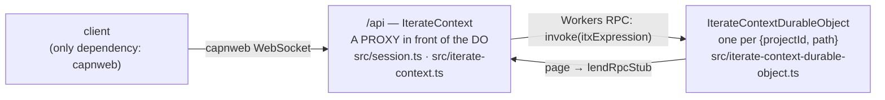

# The clean-room itx surface, as built

> `packages/v3/project-worker` at `fe8168c13` (2026-09-02). Every signature below is
> transcribed from source; the file is named so you can check. This is the feedback
> document: sections 1–11 are what exists, section 12 is where I still see smell.
> The long-form walkthrough is `docs/clean-room-api-walkthrough.md`; the design record
> is `docs/proposals/itx-surface-SYNTHESIS.md`.

---

## 1. The picture

One stateless worker, one Durable Object class, one dotted surface.



- **The context** is a dotted surface. `itx.kv.get('x')`, `itx.slack.chat.postMessage(…)`,
  `itx.append({…})` are all ONE thing on the wire: `invoke(itxExpression)`.
- **Two vocabularies, kept apart.** (a) **rpc stubs**: physical. A client's live function or
  RpcTarget, lent under an opaque `rpcStubKey`, borrowed by the DO, paged back on demand.
  (b) **itx-expression rewrite rules**: pure data. `{ match, target }` in a map, written by one
  event. "A call starting with `match` runs as the same call with `match` replaced by `target`."
- **Everything else is an event.** The DO has `append` and no configuration verbs. The edge's
  verbs (`rewrite`, `subscribe`, `enableProcessor`) build an event and append it.
- **The DO is the parent** of: the stream, the core reduce (inline at commit), the one delivery
  loop, the facets (loaded DurableObject classes), the rpc-stub directory, the fetch door.

---

## 2. The tour in the tutorial's order

Five chapters. Each one adds exactly one idea.

```ts
using api = newWebSocketRpcSession("wss://<worker>/api");
const itx = api.authenticate().projects.get("prj_demo"); // the root context "/"
const support = itx.cd("/agents/support"); // pure addressing, no DO hop

// ── 1. rpc stubs: provide + invoke ──
using laptop = await itx.provide("laptop", {
  async ping() {
    return "pong";
  },
});
await itx.invoke(["itx", "rpcStubs", ["get", "laptop"], ["ping"]]); // "pong"

// ── 2. itx expressions: the string half and the dotted sugar are the SAME call ──
await itx.invoke("itx.rpcStubs.get('laptop').ping()");
await itx.rpcStubs.get("laptop").ping();

// ── 3. rewrite rules: a name for a target ──
using rule = await itx.rewrite("itx.laptop", "itx.rpcStubs.get('laptop')");
await itx.laptop.ping(); // "pong"
using cam = await itx.provide("cam", camera, { rewrite: "itx.cam" }); // both in one
await itx.rewrite("itx.ai.run('gpt-5')", "itx.openai.chat"); // a pinned arg
await itx.rewrite("itx.laptop", null); // delete

// ── 4. subscriptions: a name for a delivery ──
using tail = await itx.subscribe({
  target: (events, range) => render(events), // a live callback…
  consumes: ["events.iterate.com/chat/message"],
});
await itx.subscribe({ name: "mirror", target: "itx.cd('/archive').append" }); // …or an expression
await itx.append({ type: "events.iterate.com/chat/message", payload: { text: "hi" } });

// ── 5. processors: a subscription whose target is a facet's processEventBatch ──
await itx.enableProcessor("presence", {
  source: "itx.kv.get('src/presence.js')",
  className: "PresenceDurableObject",
});
await itx.facets.get("presence").snapshot();
await itx.disableProcessor("presence");

// the durable spelling of any verb is its raw event (no handle, outlives the session)
await itx.append({
  type: "events.iterate.com/itx/rewrite-rule-configured",
  payload: { match: "itx.cam", target: "itx.rpcStubs.get('cam')" },
});
```

---

## 3. Itx expressions (`src/context/expression.ts`)

The one codec every door speaks. String half ⇄ structured half.

| Type                  | Shape                                             | Example                                          |
| --------------------- | ------------------------------------------------- | ------------------------------------------------ |
| `ItxExpressionStep`   | `string` (property) or `[method, ...args]` (call) | `"kv"`, `["get", "x"]`                           |
| `ItxExpression`       | `ItxExpressionStep[]`, root first                 | `["itx", "kv", ["get", "x"]]`                    |
| `ItxExpressionInput`  | `string \| ItxExpression`                         | `"itx.kv.get('x')"` — what every door accepts    |
| `ItxExpressionPrefix` | an `ItxExpression` used as a rule's `match`       | `["itx", "ai", ["run", "gpt-5"]]` pins `'gpt-5'` |

- Args are JSON5 in the string half. `print(parse(s))` round-trips; the canonical spelling
  (`canonicalItxExpressionPrefix`) is the rewrite-rule map's key.
- The **anonymous call step** `""` calls the value itself: `itx.rpcStubs.get('cam')(1)` is
  `["itx","rpcStubs",["get","cam"],["",1]]`. It is what a rule spells when a lent stub is
  called with args.
- **The dotted surface is a prototype hop**, not a Proxy around the instance
  (`src/context/dotted-path-proxy.ts`, `installPrototypeInvokeFallback`). Declared methods
  win; every unknown segment accumulates and lands on `invoke` as ONE expression. It is a
  prototype hop so workerd's pipelining brand-check still passes (workerd#6873).

---

## 4. The edge: what `IterateContext` declares (`src/iterate-context.ts`, 346 lines)

The class declares only what the edge must do itself. Everything else rides the hop.

| Method                                                                                 | Returns                           | What physically happens                                                                                                                                                                             |
| -------------------------------------------------------------------------------------- | --------------------------------- | --------------------------------------------------------------------------------------------------------------------------------------------------------------------------------------------------- |
| `cd(path)`                                                                             | `IterateContext`                  | Pure addressing. Absolute by convention, relative resolves. Returns an EDGE context so a later `provide` lends in this session.                                                                     |
| `invoke(call: ItxExpressionInput)`                                                     | `Promise<unknown>`                | THE door. `durableObject.invoke(expression)`. One fork: a terminal `fetch(Request)` rides `durableObject.fetch` with the expression in `x-itx-expression`.                                          |
| `provide(rpcStubKey, stub: ClientRpcStub, options?: { rewrite? })`                     | `ProvidedRpcStubHandle`           | THE ONE PHYSICAL ACT. Opens a pager WebSocket to the DO (`lendRpcStubOverPager`), registers it with the session's teardown; with `rewrite`, appends the rule `rewrite ⇒ itx.rpcStubs.get('<key>')`. |
| `rewrite(match, target \| null)`                                                       | `RewriteRuleHandle`               | `append(rewriteRuleConfiguredEvent(match, target))`. Nothing else.                                                                                                                                  |
| `subscribe({ name?, target: ItxExpressionInput \| ClientRpcStub \| null, consumes? })` | `SubscriptionHandle` (has `name`) | A live target is lent under `itx.subscriptions.<name>` first, then `append(subscriptionConfiguredEvent(…))` with target `itx.rpcStubs.get('…')`.                                                    |
| `enableProcessor(name, { source, className, consumes? })`                              | `{ name }`                        | `append(subscriptionConfiguredEvent)` with target `itx.load(source).getDurableObjectClass(className).get(name).processEventBatch`. DURABLE, no handle.                                              |
| `disableProcessor(name)`                                                               | `void`                            | Append `{ name, target: null }`, then `invoke(itx.facets.delete(name))`.                                                                                                                            |

The three handles are server-side RpcTargets with one member, `[Symbol.dispose]`, plus a
`name` getter on `SubscriptionHandle`. Disposing undoes the act. capnweb disposes every
exported handle when the session ends, so **a verb's effect is session-scoped; the raw event
is durable**.

`ClientRpcStub` (`src/context/rpc-stub-relay.ts`) is the type of what a client hands over:
`{ dup(): ClientRpcStub; [k: string]: unknown }`. On the wire it is a callable capnweb Proxy, so
a bare `async function` and an `RpcTarget` subclass both work.

How a client reaches one (`src/session.ts`):
`UnauthenticatedSession.authenticate(credentials?)` (a no-op gate today) → `Session.projects`
→ `ProjectCollection.get(projectId)` → the root `IterateContext`. Nothing here touches a DO.

---

## 5. The built-in roots: the DO's physical scope (`src/context/built-ins.ts`, 318 lines)

A plain record. A call `itx.<root>…` resolves DIRECTLY against these, no rule. A rule's target
must be rooted at `itx`, so a bare root is unspellable and the built-ins are unshadowable.

| Root                         | Signature                                                                                | Backed by                                             |
| ---------------------------- | ---------------------------------------------------------------------------------------- | ----------------------------------------------------- |
| `whoami()`                   | `→ { projectId, path }`                                                                  | the DO name                                           |
| `kv`                         | `.get(k)` `.put(k, v)` `.delete(k)` `.list(prefix?)`                                     | `ITX_KV`, `${projectId}:` prefixed                    |
| `append(...events)`          | `→ StreamEvent[]`                                                                        | the stream                                            |
| `read(afterOffset?, limit?)` | `→ { events, scannedThroughOffset }`                                                     | the stream                                            |
| `waitForEvent(filter?)`      | `{ type?, afterOffset?, timeoutMs? } → StreamEvent`                                      | the stream                                            |
| `cd(path)`                   | `→ InvokeHandle` onto a sibling context (append/read skip its rules; else `invoke`)      | `CONTEXT.getByName`                                   |
| `fetch(request)`             | egress: `{{secret:project:NAME}}` substituted → `FALLBACK`                               | the control plane                                     |
| `rpcStubs`                   | `.get(rpcStubKey) → RpcStubHandle` · `.list() → string[]` (presence)                     | `RpcStubDirectory`                                    |
| `expressionRewriteRules`     | `.list() → { match, target }[]` · `.get(match)`                                          | a read of core state                                  |
| `facets`                     | `.get(name) → FacetHandle` (a RUNNING facet) · `.delete(name)`                           | `ctx.facets`                                          |
| `subscriptions`              | `.list() → SubscriptionListEntry[]` · `.get(name)`                                       | core state ⋈ the loop's cursors                       |
| `load(source)`               | `.getEntrypoint(name?, { props? }).<method>(…)` · `.getDurableObjectClass(C).get(name?)` | Worker Loader; mirrors Cloudflare's own two accessors |
| `runScript(script, ...args)` | sugar: wrap the lambda string → `load(...).getEntrypoint().run(...)`                     | same                                                  |

`WorkerSource` is `string | ItxExpression | { type: "inline", files }`. A string is a PRODUCER
expression (`"itx.kv.get('src/x.js')"`); the code is whatever it returns.

Two brands the delivery loop reads (`src/context/invoke-handle.ts`): `FacetHandle` and
`RpcStubHandle`, both `InvokeHandle` (a genuine RpcTarget whose unknown members reduce into
one relative dispatch, so mid-chain calls pipeline). Reserved words on any handle: `invoke`,
`applyRoot`.

---

## 6. Vocabulary (a): rpc stubs (`rpc-stub-directory.ts` 350 · `rpc-stub-relay.ts` 201)

Two layers, in the order the tutorial builds them.

**Layer 1, the borrowed table.** Anyone with a Workers-RPC route to the DO can
`lendRpcStub({ rpcStubKey, stub })`. The DO keeps it in `#borrowedRpcStubs`, every call on that
key rides it, and `returnBorrowedRpcStubs()` at the 60 s idle quiesce, because a held stub
pins the DO awake. A lender with no pager is one-shot.

**Layer 2, the pagers.** One hibernatable WebSocket per key, opened by the edge relay with
`{ transportId, rpcStubKey }` in its attachment. A standing offer: "I can lend this back."

```
invokeRpcStub(rpcStubKey, steps):
  borrowed?      → call it
  else pager?    → send {type:"page"}, the edge answers with lendRpcStub, then call it
  else           → RPC_STUB_OFFLINE
```

- **Key**: opaque, chosen by the lender. The directory never parses it.
- **Reconnect**: a new pager under an existing key REPLACES the old one (newest wins). Not a
  detach.
- **Presence**: `itx.rpcStubs.list()` = borrowed ∪ pager-backed. Two EPHEMERAL events as it
  changes: `rpc-stub/attached` / `rpc-stub/detached { rpcStubKey }`. The log never claims a
  socket is open.
- **The rule dies with the stub, DO-side.** On a key's LAST pager close the DO appends
  `rewrite-rule-configured { match, null }` for every rule and `subscription-configured { name,
null }` for every subscription whose target is `itx.rpcStubs.get('<key>')`. The edge's
  teardown only closes the pager. Accepted: a pure `rewrite` handle disposed after another
  session re-set the same match deletes it (last writer wins).
- **DON'T-PIN**: the client's capnweb stub lives in the stateless worker for the session. The
  DO holds no stub while idle and hibernates with any number of clients attached.
- Wire: `x-itx-rpc-stub-pager` header; keepalive pair answered by `setWebSocketAutoResponse`
  so a pager stays warm without waking the DO.

---

## 7. Vocabulary (b): rewrite rules (`src/context/itx-expression-rewriting.ts`, 201 lines)

ONE file: the rules, the one event, the resolver. Every rule is a row in its table test.

**THE RULES**

1. A `match` is an expression PREFIX: dotted names; any step may be a call step pinning
   literal args (`itx.ai.run('gpt-5')`).
2. A name step matches the same property, or as the final step a call of that name. A call
   step matches a call whose leading args equal the pinned literals; pinned args are CONSUMED.
3. The most SPECIFIC rule wins: longest match, then most pinned args.
4. The rewrite is the target, then the unpinned args, then the call's remaining steps. Args
   fold into the target's final step when it is a name (`itx.grok ⇒ itx.openai.chat`), else
   become an anonymous call on the target's result (`itx.cam ⇒ itx.rpcStubs.get('cam')`).
5. Repeat until the root is a built-in. 32 rewrites is the budget. No match is
   `NO_ITX_EXPRESSION_MATCH` (default-deny).

**The table** is a MAP by canonical match in core state (`itxExpressionRewriteRules`). Set
replaces, `null` deletes. No stack, no offset, no identity beyond the match.

**The one event** `events.iterate.com/itx/rewrite-rule-configured { match: string, target:
string | null }`. Both halves are canonicalized through the codec at build time, so a bad
spelling fails at the door, never silently in the reduce.

**A chain**:

```
itx.greeter.hello()
  rule itx.greeter ⇒ itx.greeterA
itx.greeterA.hello()
  rule itx.greeterA ⇒ itx.rpcStubs.get('greeterA')
itx.rpcStubs.get('greeterA').hello()          ← root is a built-in: runs
```

---

## 8. The stream and the core reduce (`stream.ts` 598 · `core-processor.ts` 267)

One append-only log per context. Offsets shared by durable and ephemeral events (an
ephemeral consumes an offset, never a row). Idempotency at the door. `waitForEvent`.
`read` with a scanned-range proof. The DO's own alarm.

ONE reduce-only processor runs INLINE at the commit point: `CoreStreamProcessor`
(slug `core`, contract `4.0.0`). Its state is everything the DO needs synchronously:

| Event                                                       | Payload                               | Reduces into                           |
| ----------------------------------------------------------- | ------------------------------------- | -------------------------------------- |
| `stream/created`                                            | `{ projectId, path }`                 | `projectId`, `path`, `createdAt`       |
| `stream/woken`                                              | `{ incarnation }`                     | `incarnation`                          |
| `stream/paused` · `stream/resumed`                          | `{ reason }` · `{}`                   | `paused` (one `if` in `Stream.append`) |
| `itx/rewrite-rule-configured`                               | `{ match, target \| null }`           | `itxExpressionRewriteRules` (a map)    |
| `stream/subscription-configured`                            | `{ name, target \| null, consumes? }` | `subscriptions` (a map by name)        |
| `stream/subscription-delivery-halted` · `-delivery-resumed` | `{ name, afterOffset, … }`            | a row's `halted` / `resumed`           |

All prefixed `events.iterate.com/`. Control is ORDINARY events: a breaker processor pauses
the stream by appending `stream/paused`. Runtime state IS reduced state:
`itx.facets.get('core').snapshot()`.

Event envelope (`src/stream/events.ts`, plain TS types):
`{ type, payload?, metadata?, source?, idempotencyKey?, offset?, ephemeral? }` in;
`+ offset, createdAt, path` out.

---

## 9. Subscriptions and delivery (`subscriptions.ts` 42 · `subscription-delivery.ts` 379)

A subscription is pure data: a name, a target expression whose terminal is callable with
`(events, range)`, an optional `consumes` filter. `subscriptionConfiguredEvent(input)` is the
ONE builder. Same name replaces; `null` removes.

After every commit the ONE loop evaluates each row's target through the ordinary dispatch
door and asks the value what it is:

| The value evaluates to                           | Owns its progress? | Delivery                                                          |
| ------------------------------------------------ | ------------------ | ----------------------------------------------------------------- |
| `FacetHandle` (a facet's `processEventBatch`)    | yes                | PUSH `(events, { after, through })`, awaited, serialized per row  |
| `RpcStubHandle` (a lent client callback)         | yes                | PUSH, fire-and-forget; the client heals a gap with `read`         |
| anything else (an entrypoint, a sibling context) | no                 | the STREAM keeps a cursor: at-least-once, retry ladder, halt fact |

Nothing is declared on the event. The brand is minted where the built-in mints the handle.

---

## 10. Processors, sessions, fetch

**Processors** (`stream/processor.ts` 560 · `sdk/stream-processor-durable-object.ts` 103).
Two classes. `StreamProcessor` is pure: a contract plus `reduce` / `processEvent` /
`projectLiveState`, no constructor args, unit-testable bare. Its host is a
`StreamProcessorDurableObject` with one field, `processor = new PresenceProcessor()`.
Hosted like any class: `itx.load(src).getDurableObjectClass('PresenceDurableObject').get('presence')`,
identity in `ctx.props`. A processor IS a subscription whose target is that chain plus
`.processEventBatch`. Durable configuration, no handle.

**Lifetimes.**

| Thing                        | Made by                    | Dies when                                                        |
| ---------------------------- | -------------------------- | ---------------------------------------------------------------- |
| a lent rpc stub              | `provide`, `subscribe(fn)` | handle disposed, or the session ends                             |
| a rule made by `provide`     | `provide({ rewrite })`     | the stub's last pager closes (the DO un-sets it)                 |
| a rule made by `rewrite`     | `rewrite`                  | handle disposed, or the session ends (the handle appends `null`) |
| a subscription (expression)  | `subscribe`                | same as above                                                    |
| a processor                  | `enableProcessor`          | `disableProcessor`, only                                         |
| anything spelled as an event | `itx.append(event)`        | its `null` event                                                 |

**Loaded code's world** (`src/itx-entrypoint.ts`, 75 lines): every loaded worker's `env.ITX`
and `globalOutbound` are one stub of `ItxEntrypoint`, minted with `{ contextName }` as its
prop. `get()` hands back the same `IterateContext` class a capnweb client holds; `append`,
`read`, `waitForEvent`, `fetch` are the four the processor engine and egress drive directly.

**Fetch** (`src/fetch/rpc-stub-fetch.ts`, 286 lines, parked). A fetch-shaped capability is
always called through a terminal `.fetch(request)`. Two doors: the plain-HTTP lane
`/expression?context=<id>&itx=<expression>` (the worker copies the expression into
`x-itx-expression`), and a terminal `.fetch` inside a session, which `invoke` forks onto the DO's
fetch channel. Everything unusual in the file is fenced WORKAROUND for the day workerd and
capnweb serialize sockets over plain RPC.

---

## 11. Code structure

Non-test `src/`: 6,234 lines in 36 files (`stream/test-support.ts` excluded). Tests: 10,841 lines (unit 251, workers 45, e2e 141
passed + 2 expected fail).

| Layer                       | Files                                                                                 | Lines |
| --------------------------- | ------------------------------------------------------------------------------------- | ----: |
| the edge                    | `worker.ts` · `session.ts` · `iterate-context.ts` · `itx-entrypoint.ts`               |   638 |
| the DO                      | `iterate-context-durable-object.ts`                                                   |   642 |
| expressions + dispatch      | `context/expression.ts` · `dispatch.ts` · `dotted-path-proxy.ts` · `invoke-handle.ts` |   442 |
| built-ins + loader          | `context/built-ins.ts` · `worker-loader.ts` · `durable-object-names.ts`               |   523 |
| (a) rpc stubs               | `context/rpc-stub-directory.ts` · `rpc-stub-relay.ts`                                 |   551 |
| (b) rewrite rules           | `context/itx-expression-rewriting.ts`                                                 |   201 |
| the stream + core           | `stream/stream.ts` · `core-processor.ts` · `events.ts` · `reduce-checkpoint.ts`       | 1,037 |
| subscriptions + delivery    | `stream/subscriptions.ts` · `subscription-delivery.ts`                                |   421 |
| processors + live state     | `stream/processor.ts` · `live-state.ts` · `sdk/*`                                     |   812 |
| fetch (parked)              | `fetch/rpc-stub-fetch.ts`                                                             |   286 |
| lib, client demo, generated | `lib/*` · `client/*` · `generated/*`                                                  |   681 |

Error codes (`src/lib/errors.ts`): `NO_ITX_EXPRESSION_MATCH`, `RPC_STUB_OFFLINE`,
`IDEMPOTENCY_CONFLICT`, `OFFSET_CONFLICT`, `STREAM_PAUSED`, `NOT_A_METHOD`, `NO_FACET`,
`WAIT_TIMEOUT`, `TIMEOUT`.

---

## 12. Where I still see smell (for your feedback)

Each with my recommendation. None is done.

1. **The rpc stub key looks like an expression.** The e2e tests spell keys as `"itx.tools"`,
   and `subscribe` lends a callback under `itx.subscriptions.<name>`. The key is opaque by
   doctrine, but the examples teach the opposite. Recommend: bare keys in every example
   (`"tools"`, `"laptop"`), and `subscribe` lends under `subscription:<name>` or the bare name.
2. **`subscribe` takes an object, `provide` and `rewrite` are positional.** Recommend
   `subscribe(name, target, options?)` where `name` may be `undefined` for a generated one, or
   `subscribe(target, { name?, consumes? })`. One shape for the three verbs.
3. **`expressionRewriteRules` vs `rewrite`.** The read root is `itx.expressionRewriteRules`,
   the verb is `itx.rewrite`, the state key is `itxExpressionRewriteRules`, the event is
   `itx/rewrite-rule-configured`. Recommend the root be `itx.rewriteRules` (the event and the
   verb already say "rewrite rule"; "expression" adds nothing at that position).
4. **`enableProcessor` / `disableProcessor` are the only durable verbs on the edge.** They are
   sugar over the subscription event plus one facet delete. Either they earn their place as
   the one durable pair, or `subscribe` grows a `durable: true` and they go. I lean keep: a
   processor is the thing a product author enables, and `disableProcessor` deletes storage,
   which `subscribe(null)` should not.
5. **Two doors to a facet.** `itx.facets.get(name)` (running, by name) and
   `itx.load(src).getDurableObjectClass(C).get(name)` (load and host). Both land on
   `#invokeFacet`. This mirrors Cloudflare, so I'd keep it, but the split is the most-asked
   question in the docs.
6. **`runScript` and the built-in `cd`.** `runScript` is one bare-lambda sugar over `load`;
   the built-in `cd` duplicates the edge `cd` so an expression can name a sibling. Both are
   small. Recommend keep `cd`, delete `runScript` (`load({ type: "inline", … })` is one line).
7. **`ItxEntrypoint` is a second surface.** Loaded code gets `get()` plus `append` / `read` /
   `waitForEvent` / `fetch`. The four exist because the engine and egress call them directly
   without a dotted hop. Could be `get()` only, at the cost of one hop per engine call.
8. **`authenticate()` is a no-op.** The shape is right (`authenticate(credentials).projects.get`)
   and nothing needs to change when the real gate lands. Flagging only so it is a decision.
9. **The handle for `provide` carries nothing.** `ProvidedRpcStubHandle` and
   `RewriteRuleHandle` are the same class body. They could be one `DisposableHandle`, but the
   last review asked for a noun per thing, so they stay two. Your call.
10. **`disableProcessor` does two things.** Append the removal, then delete the facet. If the
    second step fails the row is gone and the storage stays. Recommend the DO do the delete on
    reduce of a `null` target whose old target was a facet chain, so it is one event.
