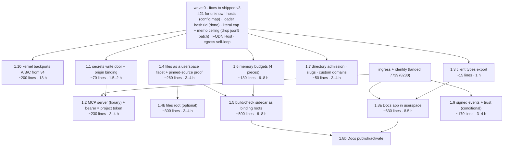

# v4's features, layered onto the clean room — the plan (2026-09-07)

> `packages/v4/project-worker` ("the clean room, extended") forked v3's working tree and carries features v3 does not.
> This plan isolates each as a discrete item — what v4 has (measured), what v3 has, the proposed layering and API on
> v3, an implementation sketch, an effort estimate, dependencies — and orders them into a tech tree, so each can land
> as its own arc, proved through the unchanged public door against the deployed worker. Eleven read-only reviews
> produced the material (`docs/reviews/2026-09-07-v4-*.md`); nothing in v4 was edited, built, tested or deployed.
> Code lines throughout are non-blank, non-comment, non-test, measured with `wc`/`grep`.

## 0. The two trees at a glance

|                   | v3 `packages/v3/project-worker` (9a6f74bbe)                                                       | v4 `packages/v4/project-worker` (untracked)                                                                                                                                                                                                                                                                       |
| ----------------- | ------------------------------------------------------------------------------------------------- | ----------------------------------------------------------------------------------------------------------------------------------------------------------------------------------------------------------------------------------------------------------------------------------------------------------------- |
| source code lines | 6,415 in 45 files                                                                                 | 9,660 in 55 files (+3,245)                                                                                                                                                                                                                                                                                        |
| shared files      | —                                                                                                 | 33 identical · 34 changed · 17 v4-only (`auth.ts`, `build.ts`, `bundler.ts`, `ingress.ts`, `mcp-server.ts`, `provenance.ts`, `repos.ts`, `fetch/policy.ts`, `fetch/secret-substitution.ts`, `context/rpc-admission.ts`, `stream/resource-budget.ts`, `context/expression-memory-scenario.ts`, `client/docs.ts` …) |
| built-in roots    | 17                                                                                                | 22 (`repos`, `secrets`, `approvals`, `build`, `check`)                                                                                                                                                                                                                                                            |
| deployed          | `project-worker.iterate.workers.dev`, live-53; project hosts under `*.project-worker.iterate.com` | an isolated preview `v4.iterate2.app` with its own Doppler project and KV namespaces (per its README)                                                                                                                                                                                                             |
| identity          | a signed project token → `source.principal` stamped by the DO (2026-09-06)                        | a demo login (email-shaped string) + an OAuth AS; the principal never reaches an event                                                                                                                                                                                                                            |
| ingress           | `<label>--<projectId>.<base>` ⇒ `itx.apps.<label>`, the Request verbatim into the fetch lane      | every host enters `itx.fetch` under the policy; a userspace router dispatches                                                                                                                                                                                                                                     |
| memory            | read-admission ceiling (live-49), delivery budgets, a documented fan-out limit                    | edge RPC admission, append/reply shape estimates, a parsed-bytes page budget, a json5 dependency patch                                                                                                                                                                                                            |

**The layering verdict, in the three sources' own words.** v3's litmus test ("could this be written in a userspace
worker?"), v4's reading guide ("a public root is not automatically a primitive") and the human-blessed skeleton
(`iterate-context-tutorial`, NARRATION.md: "exactly THREE primitives — the context, fetch, and the stream — and
everything else is composition on top") agree on the facts: repos, build/check, secrets, approvals, provenance and a
served MCP endpoint are COMPOSITION. v4's disagreement is only whether composition may be spelled as a flat root. This
plan keeps v3's rule — a root is an axiom or a binding; everything else is the library or userspace — and takes v4's
capability where it is real.

**What v4 found in v3 that is simply wrong, and what this plan fixes first (wave 0):**

- **The open wildcard mints Durable Objects from the public internet.** Every DNS label under
  `*.project-worker.iterate.com` is a valid address and a context's DO appends `stream/created` on first touch, so
  `curl https://x--anything.project-worker.iterate.com/` creates durable storage, unauthenticated, unbounded (ingress
  review §3). v4 answers 421 for an unknown host before any DO is dialled.
- **Two loader bugs** (bundling review §1): the djb2 content hash collides on two-character differences (`"Aa"` and
  `"B@"`, verified numerically), so two different sources could share one isolate; and the `:`-joined loader id is
  ambiguous when an owner or a cache key contains `:`. Both fixed tonight (`src/context/worker-loader.ts`, two pins).
- **A hidden dependency on an uncommitted patch.** v3 survives a 4.5 MiB expression literal only because v4's
  `patches/json5@2.2.3.patch` is installed in this worktree (stock json5 OOMs at 128 MiB); tonight's deployed bundles
  carry it. The fix is an O(1) length cap before `JSON5.parse`, after which the patch is unnecessary (budgets review §3).
- A fully-qualified `Host` (trailing `.`) misses `projectHostOf` (2 lines); an egress request to the project's own
  host loops out to the internet (8 lines).

## 1. The items

Each item: what v4 has · what v3 has · layering on v3 · sketch · effort · dependencies · the questions only Jonas can
answer. Effort is calibrated on 2026-09-06: ~300 code lines with tests, docs and a deployed proof in ~3 hours.

### 1.1 Secrets: a write door and origin binding (assessment Gap 7, the credential half)

- **v4 has:** `src/fetch/policy.ts` (535 code lines) — AES-GCM-encrypted direct secrets under a deployment-wide
  `EGRESS_KEY`, origin binding, one-shot APPROVAL receipts (a 202 protocol with request ids and fingerprints, an
  `egress_pending` table), a deployment-admin `POST /secrets` door behind `EXPERIMENT_ADMIN_TOKEN`, three SQL tables
  outside the core reduce, a `StreamCommitParticipant` seam and `Stream.appendSystem`, 20 error codes, `itx.secrets.list()`
  and `itx.approvals.pending()` as receipts, and an `itx.system.*` event namespace. Its `secret-substitution.ts` is a
  verbatim copy of v3's `packages/v3/shared/src/egress.ts`. Only `egress-deployed.e2e.test.ts` is deployed, opt-in on
  three env vars.
- **v3 has:** the egress terminal `itx.builtins.fetch` with `{{secret:project:NAME}}` substitution from `SECRETS_KV`
  (read-only; nothing in `src/` writes it), FALLBACK to the control-plane shell.
- **Verdict on approvals: speculative machinery.** The gate defends the operator against the project's own code — the
  insider model the trusted-client doctrine deletes — and v4's own `fetch-policy-authority.e2e.test.ts:44-71` shows an
  unsigned append removes the gate at the default trust level, so it means nothing without the 310-line provenance
  stack. The 5% that is real (hold outbound traffic) is a userspace router in front of `itx.fetch`, which holds the
  Request and needs no protocol.
- **Layering on v3:** AXIOM stays `itx.builtins.fetch`, plus origin binding at the terminal: a secret stored with
  `metadata.origin` is refused for any other origin (a mis-typed URL cannot mail a credential to a stranger). ROOT
  `itx.builtins.secrets.set(name, value, { origin? })` / `.list()` — write-only, no `get`, the same physical-write
  carve-out as `itx.builtins.kv.put`, one leaf in `built-in-roots.ts`. EVENT `events.iterate.com/secrets/changed
{ name, origin? }`, no value, attributed by `source.principal`. USERSPACE: the gate, if wanted —
  `itx.provide("itx.fetch", "itx.facets.get('egress-guard').fetch")` delegating to `itx.builtins.fetch` (v4's own
  `examples/docs/router.ts:12-16` is that shape). Left out: `EGRESS_KEY`/AES-GCM at rest, `POST /secrets`, the 202
  protocol, `appendSystem`, `itx.system.*`.
- **Sketch:** (1) `SECRETS_KV.getWithMetadata` + the origin refusal in `#egress` (~12); (2) the `secrets` root (~45)
  with its event; (3) the self-host loop refusal (~8); (4) docs. Proof: `e2e/secrets.e2e.test.ts` deployed — set,
  list shows no value, substitution works on the bound origin and is refused on another, an anonymous session's
  `set` carries no principal, an authenticated one's does.
- **Effort:** ~70 code lines + ~90 test lines · **1.5–2 h** (v4's equivalent ≈ 650 + a provenance dependency).
- **Dependencies:** none — `SECRETS_KV` is bound and the prefix convention exists. Unblocks the library connectors'
  credentials and the machine lane (1.2).
- **Questions:** may every holder of `itx` write a secret, or only a principal (then the gate rides `source.principal`)?

### 1.2 The MCP server as a library member; the bearer is the project token (Gap 7, the machine lane)

- **v4 has:** `src/auth.ts` (236) — a login proving possession of an email-shaped string, an opaque KV session, an
  OAuth 2.1 AS whose consent form asks the user to TYPE a project id — and `src/mcp-server.ts` (71): one Streamable
  HTTP tool `itx.invoke` at `/mcp?project=<id>`. The principal terminates at `Session.identity()` and never reaches an
  event; the `/mcp` branch drops it, so an OAuth-authorized MCP write is anonymous in the log. A configured deployment
  401s `/api` without a cookie — identity turned into authority, with zero assurance.
- **v3 has:** the project token, `session.whoami()`, `source.principal`, the `/.itx/session` cookie door; and in
  `packages/v3/control-plane` a richer AS (CIMD + PKCE + `resolveExternalToken`), a D1 directory, `StampedCaller`, an
  MCP server.
- **Layering on v3:** LIBRARY `itx.serveMcp()` — a handle whose one member is `fetch(request)`, one tool
  `itx.invoke({ expression, args? })`, mounted by userspace as `itx.provide("itx.apps.mcp", "itx.serveMcp()")` and
  served by tonight's ingress at `mcp--<projectId>.<base>/`; the fetch lane already runs the call under the request's
  principal, so the appended events carry `source.principal`. EDGE: a project host accepts
  `Authorization: Bearer <projectToken>` beside the cookie — the same `verifyProjectToken`, the same `x-itx-principal`
  (~8 lines) — and answers an unauthenticated MCP request 401 with `WWW-Authenticate: Bearer resource_metadata=<control
plane>`. CONTROL PLANE: mint a project token for a member (a browser redirect to `/.itx/session?token=`; an MCP
  client through the existing AS, one `project_token` tool). `auth.ts` is deleted, not ported. `LibraryItx` widens to
  `fetch | cd`; the boundary test admits `context/expression.ts`.
- **Sketch:** (1) `src/library/mcp-server.ts` + root row + boundary (~120); (2) the bearer at ingress (~8);
  (3) proof: `e2e/library-mcp-server.e2e.test.ts` deployed — a `tools/call` is an ordinary `itx.…` invocation, its
  event carries the bearer's principal, an unauthenticated call carries none and gets the 401 discovery header;
  (4) control plane minting (~40, separate package).
- **Effort:** ~230 code lines, 0 new deps, ~90 test lines · **3–4 h** (+1–2 h control plane).
- **Dependencies:** ingress + identity (landed). Steps 1–3 need no control plane; a test mints its own token.
- **Questions:** is the control plane the only login (v3's doctrine) — v4 proves a project worker can front users;
  v3 says it must not. Take from v4 regardless: the stateless per-request transport, the JSON boundary, the CSWSH
  check, RFC 9728 discovery.

### 1.3 The client types export (assessment Gap 8)

- **v4 has:** `build-types.mjs` (190) emitting a 2.7 MB `.d.ts` corpus under `src/generated/itx-types/`, whose only
  client consumer is one import in `client/docs.ts` (its real consumer is `itx.check`); it aliases `IterateContext` as
  `Itx` and invents a `node_modules/itx` identity. The browser client library itself (`live-state-client.ts`,
  `live-state-store.ts`, `react.tsx`, `demo.tsx`, the live-state spec) is byte-identical to v3's.
- **Layering on v3:** a hand-written `src/types.ts` of type re-exports (~8 lines: `IterateContext`, `Session`,
  `SessionPrincipal`, `Principal`, `StreamEvent`, `StreamEventInput`, the live-state client types) and two export-map
  entries, `./types` and `./client`. Names stay full. No generated graph; `build-types.mjs` arrives with `itx.check`
  if ever.
- **Effort:** ~15 lines · **1 h** · independent · land first.

### 1.4 Files (repos) — userspace first, a root only if wanted (assessment Gap 3, the files half)

- **v4 has:** `src/repos.ts` (275 + ~37 wired elsewhere): `itx.repos.get("/path")` → `commit/head/read/list`, a
  content-addressed revision (`sha256` of files+parent+message), a parent→head compare-and-swap decided INSIDE
  `Stream.append`'s synchronous transaction through a new `StreamCommitParticipant` seam (v4's own chapter 9 is titled
  "Build an application without adding a kernel mechanism"), a two-phase `prepare()`/WeakMap dance because
  `crypto.subtle.digest` is async, a `REPO_UNVERIFIED` forgery guard, five SQL tables. Defects: blobs are keyed
  `revision:path`, so "content-addressed" dedupes nothing and every file is stored twice; the declared caps (256 ×
  64 KiB = 16 MiB) exceed the 8 MiB `EVENT_TOO_LARGE` ceiling; 64 KiB/file cannot hold minified Yjs (v4's own docs).
  Its `events.ts` deletes `source.principal`, so a commit records no author. Six e2e, none deployed-only.
- **v3 has:** Gap 3's own decision — files buildable in userspace as a facet; "platform-hosted repos should not be the
  first cut"; `PLAN.md:92` reserves the name `itx.files`.
- **Layering on v3:** USERSPACE. A facet is a real Cloudflare DO facet with its own SQLite and single-threaded turns,
  so parent→head CAS is atomic by construction — no seam, no WeakMap, no async/sync split (a facet turn may await
  `digest`). After the swap it appends `events.iterate.com/repo/committed` through `env.ITX.get().builtins.append`,
  so the log stays the interface and a fresh context can rebuild the projection. LIBRARY: only the pure half
  (canonical bytes, `sha256`, path validation). **If Jonas wants a root anyway:** `itx.builtins.files`, and the
  revision IS the committing event's offset — server-assigned, monotonic, a pure integer compare inside
  `transactionSync` — which deletes ~90 of v4's 275 lines; the head map lives in the core reduce, file bytes in event
  bodies. Keep from v4 regardless: the pinned `{ source: { repo, revision }, options }` build input as DATA, and
  `RepositoryHandle extends InvokeHandle` (pipelining).
- **Sketch:** (1) the facet fixture (~90) + `e2e/files-facet.e2e.test.ts` (CAS, race, idempotent retry, isolation)
  deployed; (2) the pinned-source proof (~40 e2e); (3, optional) the root: `src/files.ts` (~110), one core reduce case,
  four error codes, the §5 row.
- **Effort:** steps 1–2 ~260 lines · **3–4 h**, zero platform change; the root ~300 · **3–4 h**.
- **Dependencies:** none for 1–2 (identity gives attribution for free); the 8 MiB event ceiling caps a commit.
  Unblocks the Docs workspace facet and the pinned arm of build/check (1.5). Does NOT unblock git — that stays a
  fetch from a loaded worker.
- **Questions:** is `StreamCommitParticipant` acceptable in v3's `stream.ts` at all (v4 opened it and ran three
  modules through it)? Root or facet? Handle per path, or path as an argument?

### 1.5 Build and check: a sidecar bundler as binding roots; no `workers.load`

- **v4 has:** `src/bundler.ts` (224), a SEPARATELY DEPLOYED sidecar worker (`wrangler.bundler.jsonc`, its own
  `BUILD_CACHE` KV, `nodejs_compat`) running esbuild (13 MB wasm) + TypeScript (4.4 MB) + a 2.7 MB `.d.ts` corpus;
  `src/build.ts` (51); `workers.load(code, { cacheKey? })` (~160 lines across `worker-loader.ts`/`built-ins.ts`)
  taking Cloudflare-native loader input. It refuses npm dependencies. Defects: `workers.load` has no facet twin, bypasses
  v3's confinement contract (no forced compat flags, no processor SDK), and the Docs example inlines
  `JSON.stringify(built.code)` into a durable rewrite target (v4's research doc: "a real cost"; it collides with the
  memory arc).
- **v3 has:** `workers.get({ source, cacheKey })` where `source` may be a PRODUCER expression; `docs/reviews/
2026-09-02-futures.md:399-410` already decided the bundler is a sidecar ("the 13 MiB wasm and the 128 MiB isolate
  ceiling make that a topology fact").
- **Layering on v3:** BINDING ROOTS `itx.builtins.build(input)` / `itx.builtins.check(input)` over a `BUNDLER` service
  binding — the same tier as `itx.ai`. `input` is v4's `BundleInput | RepositoryBuildInput`, verbatim. The loader door
  is UNCHANGED: activation is `itx.workers.get({ source: "itx.build({ source: { repo, revision }, options }).code",
cacheKey: "<buildKey>" })` — the producer names the pinned INPUT, so a KV eviction rebuilds instead of stranding a
  durable activation; `facets.get` gets the same for free (a built processor hosts itself, which v4 cannot do). Left
  out: `workers.load`, `NativeWorkerCode` and its digest (~130), caller-chosen compat flags/`limits`/`env`/`tails`, npm
  resolution, the single-flight coordinator and `budgetMs` for a first cut.
- **Sketch:** (1) the loader bugs — done tonight; (2) `src/build.ts` shapes + the two roots + the binding;
  (3) port the sidecar; (4) proof: build a pinned input, `workers.get` it through the producer, `fetch` it, deployed;
  (5) `facets.get` with the same producer.
- **Effort:** ~500 code + ~300 test lines · **6–8 h**; infra: one worker name + one KV per environment, an ordered
  two-worker deploy.
- **Dependencies:** `BundleInput` needs nothing; the pinned arm needs 1.4. Unblocks the Docs publish flow (1.8b).
- **Questions:** root vs a userspace remote app for `build`; pin a resolved lockfile into the build key now
  ("un-fixable later"); producer expression vs inlined bundle in the durable target.

### 1.6 Memory admission and resource budgets (take four pieces, drop the patch)

- **v4 has:** `context/rpc-admission.ts` (184): `/api` wire-text admission before capnweb's parse; `stream/resource-
budget.ts` (188): a native-shape estimate on append input and on the reply, a parsed-bytes budget per read page, a
  durable `stream_resource_halts` row; `expression-memory-scenario.ts`; the json5 patch (299 lines, workspace-wide).
  Its `read()` is sync at a 32 MiB level — taking v4's `stream.ts` wholesale would re-open the concurrent-reader reset
  v3 closed on live-49. Its 30 MiB reply budget over a ×2 estimate would refuse v3's green 4 × 8 MiB control.
- **v3 has:** the read-admission ceiling, delivery budgets, `EVENT_TOO_LARGE`, and three red pins v4 turns green
  (`memory-budget.test.ts:188, 394, 410`). No facet startup-memo ceiling (an oversize source fails late at
  materialization and is re-parsed on every post-eviction wake). Measured: a 4 MiB `[[]],…` body parses to 77 MiB and
  v3's char ceiling admits it.
- **Layering on v3:** isolate axioms, invisible at the doors, no events. TAKE: (1) an O(1) length cap in
  `expression.ts` before `JSON5.parse` (~8) → drop the json5 patch; (2) a facet startup-memo ceiling (~20);
  (3) `src/stream/event-shape.ts` — a structural estimate beside the char count (containers, members, a DEPTH cap v4
  lacks), `EVENT_TOO_COMPLEX`, plus a reply-shape budget set against MEASURED bytes (~70); (4) v4's parsed-bytes page
  cut in `readPage` at ~48 MiB, a single over-budget row reusing `EVENT_UNREADABLE` (~25). REJECT: edge RPC admission
  (against the 2026-09-07 "edge is out of scope" decision) and the halt table (back-compat machinery for a resettable
  tree).
- **Effort:** ~130 code + ~120 test lines · **6–8 h**, of which steps 1–2 are ~30 lines / 1.5 h.
- **Dependencies:** independent; step 3 bumps `CoreContract.version` (one re-reduce per context on wake) — land it
  with any other core bump, not as a second. Must land before the json5 patch is reverted.
- **Questions:** who owns the decision to drop the workspace patch (other consumers unaudited)?

### 1.7 Ingress, the remainder: a directory, 421 for the unknown, pretty slugs, custom domains

- **v4 has:** `src/ingress.ts` (47) + a worker branch (22) + an egress self-loop guard (18): every project host enters
  `itx.fetch` (the EGRESS verb — a visitor's `{{secret:project:NAME}}` header becomes an existence oracle on secret
  names); the default for a host with no router is self-recursion (recorded live in `docs/preview-proof.md:981`); the
  directory is a DEPLOYMENT VARIABLE (`APP_CONFIG_PROJECTS_JSON`, `..._CUSTOM_HOSTNAMES_JSON` in `envs.ts`, a redeploy
  per project); `ProjectHostResolution.app` has no consumer; a router "must not be lent with `itx.provide()`", which
  kills the tunnel case. Its two deployed rows are opt-in and skipped by default. No identity on a project host.
- **v3 has:** `projectHostOf` ⇒ `itx.apps.<label>`, deployed, one row per app, the cookie door.
- **Layering on v3:** keep v3's primitive verbatim. ADD one edge admission step before the DO is dialled: the
  control-plane shell over `FALLBACK` answers `resolveProjectHostname(hostname) → { projectId, label } | null`, cached
  per isolate; a decline is 421 — which closes the DO-minting hole and delivers pretty slugs and custom domains as
  ordinary directory rows in one code path. Take v4's `normalizeHostname` (trailing `.`, leading `*.`), its
  reserved-origin guard as a config row, and its config map ONLY as the solo/workers-lane stand-in.
- **Effort:** ~50 code lines + ~55 test lines · **3–4 h** (+1 h if the shell has no table yet).
- **Dependencies:** none in the platform; the shell is deployable today. Real third-party domains need Cloudflare for
  SaaS, which exists in neither tree.
- **Questions:** fix the open wildcard now with the config map (yes — wave 0); directory in the control plane or KV;
  who provisions custom domains; should `itx.fetch` stay shadowable (outbound only)?

### 1.8 The Docs app, entirely in userspace (assessment step 3's first real app)

- **v4 has:** `src/client/docs.ts` (495) + `build-docs.mjs` (45) + `examples/docs/` (66) + `e2e/docs-app.e2e.test.ts`
  (183); `/docs` is a wrangler static asset on the platform host; `router.ts` hardcodes hostnames; no Playwright spec
  for `/docs` in either tree (the "two tabs converged" claim is manual). Better than v3: `build-docs.mjs`'s
  `define`-injection (the processor authored as real TypeScript, esbuild → module bytes), the `connectionGeneration`
  guard, the failed-append `retry`/`revert` pair.
- **Layering on v3:** USERSPACE — the processor from `examples/docs/processor.ts` verbatim (it extends only what v3's
  SDK exports), the page as `itx.provide("itx.apps.docs", "itx.workers.get({ source })")` on `docs--<projectId>.<base>`,
  identity through `/.itx/session`. No platform door, no `Itx` alias.
- **Sketch and effort:** (1) types (1.3) 1 h; (2) processor + deployed vitest e2e ~177 lines 2 h; (3) page minus
  publish ~335 lines 3 h; (4) page as an app row + identity assertion ~60 lines 1.5 h; (5) a two-browser Playwright
  spec ~40 lines 1 h · **~630 lines, ~8.5 h**. (b) The publish/activate half waits on 1.4 + 1.5.
- **Dependencies:** 1.3; ingress + identity (landed); wildcard DNS (exists).

### 1.9 Signed events and a trust policy — last, and only on Jonas's word

- **v4 has:** `src/provenance.ts` (310 + ~50 wired): optional Ed25519 evidence verified at append, a server-derived
  receipt (`level`, signers, `policyOffset`), a `TrustPolicyStore` in a private SQL table, a 0/1/2 level ladder,
  `events.iterate.com/provenance/trust-configured`. Deployed evidence exists (`docs/preview-proof.md:712`). No unit
  table. Conflicts: the signed body INCLUDES `source`, which v3 now stamps before the append — adopt verbatim and
  every signature from an authenticated session fails; the policy is a second commit-time projection when the core
  reduce already owns that shape (`paused`); `minimumLevel ≥ 1` refuses the pager-attached rule, so a locked context
  cannot lend an rpc stub at all (v4's guide concedes it).
- **What it buys over the principal:** offline third-party verification, and signers that never hold a session (a
  device, a build system, a partner). Not cross-project non-repudiation (the message pins `projectId`+`path`), not an
  auditable history (no hash chain).
- **Layering on v3, if taken:** no new root. `provenance` on the envelope; the receipt as `source.signers` beside
  `source.principal`; the signed body EXCLUDES `source`; the policy a `CoreState` field with ONE knob
  (`minimumSignatures`; level 1 refuses nobody); the gate beside the pause gate; verify in `src/principal.ts`;
  `provenanceMessage` exported from the SDK; `Stream.appendSystem` so platform facts survive a lock. Copy from v4:
  the async-prepare/sync-commit split, refusing caller-supplied receipts, canonical base64url, no evidence on
  ephemerals, widened idempotency equality.
- **Effort:** ~170 code + ~190 test lines · **3–4 h**.
- **Dependencies:** identity (landed); the `appendSystem` split (shared with any other gate). Deliberately LAST: it is
  the only item that changes what the log will accept, and v4's own finding — two internal call sites had to move to a
  private system append before a locked policy tolerated them — shows admission rules ripple down into the kernel.
- **Questions:** is there a real signer that is not a session? If every writer authenticates to `/api`,
  `source.principal` already answers "who" and this is speculative. Does locking exempt configuration events, or do
  the session verbs learn to sign?

### 1.10 Kernel fixes to backport (from the kernel-diff review)

- **Fork point, measured:** v4 forked v3's working tree at `b1cd35934` (2026-09-06); ten later v3 commits are
  missing from it (edge#10, the live-state reorder fix, ingress + identity, the read-admission ceiling, the delivery
  budgets). What v4 changed in the shared files splits into feature hunks (covered above), drift, and ten fixes v3
  lacks, each verified against v3's CURRENT file. ≈200 net code lines, ≈13 h, in three small commits:
- **A — memory and correctness core (~60 lines, flips one red pin):** (2.1) `CoreStreamProcessor.reduceBatch` with
  per-batch draft tables — v3 copies the whole subscriptions table on every control event, the exact O(rows²)
  re-reduce its own `memory-budget.test.ts:373` pins red (25 s, a reboot loop against the CPU limit); v4 copies once
  per 500-event page (32 lines). (2.2) `using` on the SDK host's append/read so the native RPC promise is released
  instead of pinning the parent DO until GC (16 lines; on d3's arc). (2.4) reserve `core` at the append door — a raw
  `subscription-configured { name: "core" }` installs an undeliverable row today (12 lines).
- **B — delivery and lease lifetimes (~85 lines):** (2.3) halt once, for the right row — no in-flight guard on
  `subscription-delivery-halted`, `#catchUpFacetRow` never halting on a deterministic refusal, a queued push landing
  on a row that halted meanwhile (49 lines, three unit pins + one deployed). (2.6) a stale `provide` handle must not
  tear down its replacement: re-provide at the same match, dispose the OLD handle, and the NEW pager dies today —
  the lease is the handle (23 lines). (2.7) drop a poisoned DO stub instead of keeping it forever (13 lines; v4's
  premise about workerd marking stubs broken is unverified, the fix is cheap either way).
- **C — hygiene (~35 lines):** a bounded 300-char error-body read instead of buffering a whole body; `close()` over
  `Symbol.dispose` in `releaseConnections`; a coded `INVALID_CONTEXT`; report instead of swallow in
  `#unsetWhatNamesRpcStub`; classify platform DO resets as an expected interruption in the logs (21 lines — but it
  also hides them; Jonas's call). The JSON loader id (2.9) is DONE tonight.
- **An investigation before a fix (2.5):** an evicted context with a CURSOR subscription that consumes the wake type
  looks like an infinite 60-second billed wake loop (constructor appends `woken` → delivery records activity →
  the alarm re-arms → evicted → repeat). Inferred from the code, not run; a deployed wake-count probe comes first.
- **Drift to refuse:** `stream/processor.ts` went 191 → 10 comment lines and `subscription-delivery.ts` 181 → 12 with
  zero behaviour change (the concurrency contract and every budget rationale gone); 21 abbreviations against the
  fully-qualified-names rule (`#reducedThroughOffset` → `#cursor`, …); a new unowned noun `ContextLeaseBook`; the
  hand-written MCP client swapped for `@modelcontextprotocol/sdk` (174 → 177 lines, one dependency) right after v3
  deleted zod for 11 ms of startup; an uncached SHA-256 content hash that undoes v3's measured memo.

### 1.11 Ideas from the project-core experiments (from the project-core review)

- **What it is:** `packages/v3/project-core` is a whole second project kernel — 2,837 code lines in `src/`, 3,799
  raw implementation + 2,292 raw e2e, under a hard <5,000-line budget enforced by a 23-line `scripts/size.ts`,
  plus 10,521 lines of notes and 30 dated `evidence/` records; deployed twice, one stack in the PRODUCTION account
  with live zone routes on `iterate2.com` and `iterate.computer`, none of it in the root `envs.ts`. Its
  "replacement member-array API" is `ScopeTarget.invoke(path: string[], ...args)` — args only at the terminal step.
  v3's `ItxExpression` carries args at EVERY step, which is what makes mid-chain pipelining work. **Rejected: strictly
  less expressive.** Also rejected: its `mount/fetch` policy worker (mounts carry no policies), plural Ed25519 trust
  levels that reject an append (identity as authority), and its re-implemented lending/processors/stream.
- **Worth taking:** the egress terminal's shape — origin-pinned secrets, secret REVISIONS (encrypt-then-CAS), and a
  freshness recheck → one-shot claim → native fetch with no intervening `await` (feeds 1.1); `src/repositories.ts`
  (155 lines) as the reference for the optional files root in 1.4 — immutable file-map commits with the head CAS'd in
  the append transaction; `CUSTOM_HOSTNAMES` as the shape of 1.7's directory row; `subscribe({ afterOffset })` for
  the assessment's Gap 6 (~30 lines); a line-budget script (`pnpm size`) — cheap, honest, and Jonas asked "how much
  complexity" tonight.
- **The two probes:** `project-core-fetch` (135 lines, Node-only) is a clean null result — append/read/subscribe fit
  `fetch`; capabilities, callbacks and confinement do not. **`project-core-ws-probe` is the most valuable artifact**:
  minimized deployed A/Bs show that a NAMED `LOADER.get(id, …)` whose child returns a 101 or fetches through
  `globalOutbound` produces native `exception`/`canceled` telemetry, while `get(null, …)` and `load()` are clean.
  `src/context/worker-loader.ts` is exactly that shape (a named cacheKey + `globalOutbound: opts.itxEntrypoint`), and
  nothing in v3 — no BUILD-LOG entry, doctrine comment or test — accounts for it. No user-visible harm was
  demonstrated. **An investigation, first in wave 0b:** reproduce with v3's own e2e (`fetch-door-dynamic-live-ws`),
  read the telemetry, decide whether the cacheKey strategy everything sits on has to change.
- **The four root docs:** `native-rpc-fetch-lifecycle-research.md` independently confirms v3's `rpc-stub-fetch.ts`
  fence (workerd cannot serialize `Response.webSocket`) — nothing changes; `v4-native-websocket-close-repro.md` and
  `preview-proof.md` are v4 release records v3 does not depend on (v3 is exposed to the same WebSocket-telemetry
  condition); `wrangler-local-body-upgrade-research.md` is a parked local-tooling finding.

### Rejected outright (with the review that decided it)

- **Approval receipts / the 202 egress protocol** — speculative machinery (1.1).
- **`workers.load` native loader input** — the producer expression already covers it; it bypasses confinement (1.5).
- **A login page and an OAuth AS in the project worker** — the control plane's; a gate on `/api` turns attribution into
  authority with zero assurance (1.2).
- **Ingress through `itx.fetch` with a userspace router** — a second mechanism, an oracle on secret names, a
  self-recursion default (1.7).
- **Edge RPC admission and the halt table** — against the 2026-09-07 edge decision; back-compat machinery (1.6).
- **`StreamCommitParticipant` as a general seam** — v4 opened it and ran three modules through it; the file-CAS case
  is atomic in a facet without it (1.4).
- **The `Itx` alias and a generated type graph for clients** (1.3).

## 2. The tech tree

The ordering principle (layering review §5): a feature layers where its proof is an ordinary call through the
UNCHANGED public door against the deployed worker, and adding it re-spells nothing beneath it. Two constraints fall
out: anything deciding inside `Stream.append`'s transaction lands before anything that merely reacts; anything that
passes the litmus test lands last and outside the kernel.

## 3. Sequencing

| wave                                                | items                                                                                                                                                        | code lines | hours   | runs in parallel                                                                    |
| --------------------------------------------------- | ------------------------------------------------------------------------------------------------------------------------------------------------------------ | ---------- | ------- | ----------------------------------------------------------------------------------- |
| 0 — fix what the review found in shipped v3         | 421 admission via the config map, literal cap + memo ceiling (then drop the json5 patch), FQDN Host, egress self-loop; the loader fix is in                  | ~100       | ~4      | one session; touches worker.ts, expression.ts, the DO                               |
| 0b — kernel backports from v4 (1.10) and two probes | the loader-telemetry check (1.11) and the wake-loop probe FIRST; then A memory/correctness core (flips a red pin) · B delivery + lease lifetimes · C hygiene | ~200       | ~15     | d3's files mostly (stream, delivery, SDK host) — its session; C anyone              |
| 1 — independent, small, each closes a gap           | 1.3 types · 1.1 secrets · 1.2 MCP + bearer · 1.6 budgets · 1.7 directory                                                                                     | ~500       | ~16     | four sessions: types+secrets, MCP, budgets (stream files), directory (edge + shell) |
| 2 — the app path                                    | 1.4 files facet → 1.5 build/check sidecar → 1.8 Docs (a, then b)                                                                                             | ~1,400     | ~20     | files and Docs-a in parallel; build after files; Docs-b last                        |
| 3 — conditional                                     | 1.9 provenance, on Jonas's word                                                                                                                              | ~170       | ~4      | one session, last                                                                   |
|                                                     | **total**                                                                                                                                                    | **~2,400** | **~60** | vs v4's +3,245 lines for the same ground plus the rejected items                    |

Deploy discipline unchanged: one deployer at a time ("worker free"), every item's proof against the deployed worker
in the sequential lane, the BUILD-LOG entry per arc.

## 4. Decisions for Jonas

1. **Which kernel is the trunk** — v3 (this plan assumes so), v4, or the skeleton as a second runtime. The "teaching
   path below 5k lines" has two incompatible meanings (the skeleton's second runtime vs v4's manifest-checked subset).
2. **Fix the open wildcard now?** Wave 0 does it with the config map; the directory (1.7) makes it real.
3. **Files: facet or root?** Userspace first is the plan; say the word for `itx.builtins.files` (offset-as-revision).
4. **Build: root or a userspace remote app?** And pin a resolved lockfile into the build key now?
5. **Is the control plane the only login?** v3's doctrine says yes; v4 proves a worker can front users.
6. **May every holder of `itx` write a secret**, or only a principal?
7. **Signed events: is there a signer that is not a session?** If not, 1.9 does not happen.
8. **Drop the json5 workspace patch** once 1.6's two caps land (other consumers unaudited).
9. **`Itx` or `IterateContext`** for external authors (the plan says the full name).
10. **`StreamCommitParticipant`** — acceptable in `stream.ts` at all?
11. **project-core's production-account deployment** (routes on `iterate2.com` / `iterate.computer`, absent from
    `envs.ts`): keep, record, or tear down?
12. **A line budget** (`pnpm size`, project-core's 23-line script): adopt for the clean room, and at what number?
