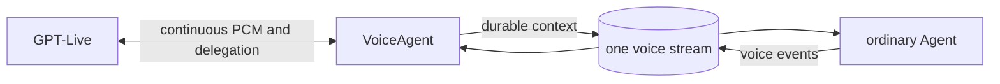

# GPT-Live client delegation and the ordinary Agent

The final backend design is one voice stream containing VoiceAgent and the
ordinary Agent. GPT-Live uses client delegation; VoiceAgent owns Live/audio and
the Agent owns project work. This replaces direct Responses/capability-host
work delegation.

## Event contract

| Durable event | Purpose |
| --- | --- |
| `agents/context-added` | Voice protocol, transcripts and Agent-triggering delegation metadata. |
| `voice-agent/instructions` | `{ activation, delegationId, content }` behaviour for GPT-Live. |
| `voice-agent/thinking` | Same identity fields; quiet verified context while work continues. |
| `voice-agent/commentary` | Same identity fields plus optional `hangUp`; verified speakable result. |

`activation` is the call fence; `delegationId` is GPT-Live’s opaque identity.
There is no task ID, child Agent path, reply-order matcher, custom queue or
completion protocol. Content is plain text and updates have stable idempotency
keys. Raw model settlements/web-chat output are not commentary because Agent
output may be executable code.

## Setup and delegation

Setup creates the ordinary Agent once on the voice stream and writes one keyed
system section explaining the protocol, preserving normal Agent configuration.
Completed user/assistant transcripts project once as non-triggering context. A
client delegation appends current transcript snapshots and one developer
metadata item with `after-current-request`; it is the sole voice trigger for
ordinary Agent work. It is durable before GPT-Live hears that the request was
handed off, and audio never waits for it.

Later transcript rows remain ordinary context. The Agent is told speech may be
incomplete/corrected; no transcript-completeness classifier or fixed quiet wait
is added. A correction may interrupt a model turn through ordinary Agent
semantics but does not silently cancel a running project action.

## Completion and hang-up

The Agent may append several thinking/commentary updates. VoiceAgent forwards
only the live activation. `hangUp: true` arms its existing goodbye/terminal
path after the relevant playout boundary; it does not terminate unrelated work.
Old results remain durable and may be context for a later call, never replayed
as if heard.

Back-to-back standby/work can journal two `llm-request-requested` rows. The
first runnable turn contains both contexts and delivers the work callback; the
reducer ignores only the redundant later delayed intent while that request is
open. This does not drop work.

## Primary sources

- [GPT-Live client delegation](https://developers.openai.com/api/docs/guides/live-delegation?delegation-mode=client): IDs and client-appended thinking, commentary and instructions.
- [GPT-Live prompting](https://developers.openai.com/api/docs/guides/live-prompting): documented delegation, backchannel and interruption labels.
- [GPT-Live conversations](https://developers.openai.com/api/docs/guides/live-conversations): a closed session has no continuation channel.
- [Agent input contract](https://github.com/iterate/iterate/blob/5ea321596ad0126d345686b4b21be25d09501514/apps/os/src/domains/agents/agent-processor-contract.ts): typed inputs and request/settlement identity.
- [Agent turn loop](https://github.com/iterate/iterate/blob/5ea321596ad0126d345686b4b21be25d09501514/apps/os/src/domains/agents/agent-turn-loop.ts): debounce, lifecycle, expiry and interruption.
- [Atomic stream append](https://github.com/iterate/iterate/blob/5ea321596ad0126d345686b4b21be25d09501514/apps/os/src/domains/streams/stream-durable-object.ts): durable append boundary.

Preview/HAVPE proof exercised ordinary-Agent delegation, delayed work,
commentary and model-decided hang-up. The standby experiment showed no reliable
cache latency benefit, so automatic warmup remains disabled. Exact evidence is
in [implementation evidence](2026-09-11-gpt-live-implementation-evidence.md).
