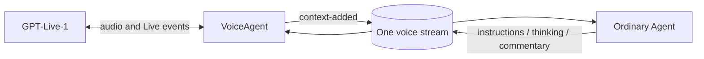

# GPT-Live client delegation through the existing Agent

Research and implementation record, 12 September 2026. This supersedes the
backend choice in [the earlier simplification plan](2026-09-11-gpt-live-simplification-plan.md),
while preserving its device, capture, playback, and face work. Implementation
has run on preview-12 and HAVPE. Fable's review and direct Live probes are
complete. The real-call hang-up regression exposed prompt/context defects;
the final prompt passed three consecutive preview calls with real backend work
and separate spoken hang-up requests, then passed an actual HAVPE air-path call
on production. Kit's five-device installer is published. The deferred standby
benchmark found no cache benefit, so automatic warmup remains disabled. The
large-result replay memory and ordering fixes are deployed and proven; PR #2624
tracks the final branch review.

## Decision

**One stream, with the ordinary Agent and VoiceAgent processors. Events are
their interface.** GPT-Live uses `delegation: { type: "client" }`. The Agent
owns project work; VoiceAgent owns the live conversation and audio transport.



Slow work continues while GPT-Live listens and converses. Each update retains
its original delegation ID. A new request does not make older independent
work obsolete. Hanging up closes the call, not the Agent's background work.

**The Agent LLM tracks delegation IDs from its context.** Explain the interface
once at setup. Do not build a parallel task state machine, cancellation
classifier, obligation reconciler, or progress monitor. VoiceAgent may keep
a small pending-delegation collection if the actual Live protocol needs it.

**No early resolution is needed to unblock GPT-Live.** A direct client-mode
probe produced a second delegation while the first had received no client
append at all. Let the models handle conversation and work; return useful
context through the three documented channels.

## What was working, and what changed

The original Futurehomes branch (`backup/futurehomes-before-gpt-live-integration`,
`bd4353c88`) had durable Agent requests, transcript forwarding, status, and
delayed replies. That Agent lived on a separate colleague stream. The GPT-Live
branch replaced that connection with managed Responses delegation and direct
capability-host execution. We should restore the durable Agent integration
without restoring the old cross-stream routing.
[Old event implementation](https://github.com/iterate/iterate/blob/a1f43360d/configs/voice-agent/voice-agent.ts),
[GPT-Live replacement](https://github.com/iterate/iterate/commit/6a042c529).

The reported example.com request ran through that Responses path, not the
ordinary Agent processor. Spoken hang-up failed because the isolated v23
HAVPE setup omitted its optional `hang_up` tool. The exact v23 guest has since
been restored with that tool, and a synthetic-audio call proved model-decided
goodbye and termination. That is a temporary repair of the old architecture,
not proof of this proposal. During diagnosis, an accidental v20 setup change
was also reverted. Evidence is in
`/tmp/havpe-spoken-hangup-investigation/`,
`/tmp/havpe-spoken-hangup-fix/`, and
`/tmp/havpe-spoken-hangup-proof/`.

## OpenAI's contract and vocabulary

The client delegation event supplies an opaque ID and timeline position,
not a task description. The application supplies conversation context.
`session.thinking.append` carries quiet context; `session.commentary.append`
carries facts to paraphrase aloud; `session.instructions.append` changes
behavior. Each takes a string of at most 500 tokens and a `delegation_id`
(a known ID, or `null` for general context). Several appends may serve one
delegation. An acknowledgment establishes context injection, not speech or
task completion. Cancellation and action reconciliation belong to the
application. [Client delegation documentation](https://developers.openai.com/api/docs/guides/live-delegation?delegation-mode=client).

Keep the documented prompt labels: **Backchannel policy**, **Interruption
policy**, **Delegation policy**, **Backend tools**, **Delegate to the backend
when**, and **Do not delegate to the backend when**. Keep detailed procedures
in the Agent prompt. OpenAI explicitly recommends retaining these labels;
it does not quantify the benefit from post-training vocabulary alignment.
[GPT-Live prompting](https://developers.openai.com/api/docs/guides/live-prompting).

Transcript fragments do not establish complete turns. Closing a Live session
does not provide a continuation channel for that session. Our existing
connection teardown and transcript record must handle that boundary.
[GPT-Live session lifecycle](https://developers.openai.com/api/docs/guides/live-conversations).

Use **backend**, **client delegation**, **thinking**, **commentary**, and
**instructions** consistently in code documentation and prompts. These names
describe the protocol; they are not new GPT-Live tool definitions.

## Small event interface

All event names below use the existing `events.iterate.com/` prefix.

| Event | Meaning |
| --- | --- |
| `agents/context-added` | Standing voice instructions, observed transcripts, and a delegation that triggers ordinary Agent work. |
| `voice-agent/instructions` | `{ activation, delegationId, content }`: directions for the live model's behavior. |
| `voice-agent/thinking` | `{ activation, delegationId, content }`: useful factual context while work continues. |
| `voice-agent/commentary` | `{ activation, delegationId, content, hangUp? }`: verified information or a clarification to convey; optional call-end decision. |

These are application events mapped onto Live's corresponding append commands.
`content` is always a plain string. `delegationId` may be null for general
context. Instructions direct behavior; thinking can inform a later answer
without being announced on arrival; commentary is information to say aloud.
They do not add another model runner. The Agent can append several thinking or
commentary events for one delegation. Each distinct update needs its own
idempotency key; redelivery of that update must not produce duplicate speech.
Do not mark a delegation complete merely because one commentary arrived.

Use the existing call `activation` and GPT-Live's original `delegationId`.
Do not invent a second task ID, a child Agent path, or an order-based reply
matcher. Ordinary web-chat output and raw model settlements are not voice
commentary; model settlements can contain executable code.
[Agent event contract](https://github.com/iterate/iterate/blob/596005f4e6e6b81cec23d345026da68968dbe507/apps/os/src/domains/agents/agent-processor-contract.ts),
[Agent output interpretation](https://github.com/iterate/iterate/blob/596005f4e6e6b81cec23d345026da68968dbe507/apps/os/src/domains/agents/agent-codemode.ts).

### Setup once

Create the ordinary Agent on the voice stream during setup. Add one keyed
system context section explaining the voice protocol. Use normal project
Agent configuration, including its configuration readiness, rather than
creating and configuring another Agent on every call. Existing Agent model
settings must survive voice setup unless explicitly changed.
[Agent creation and typed append](https://github.com/iterate/iterate/blob/596005f4e6e6b81cec23d345026da68968dbe507/apps/os/src/rpc-targets.ts#L5152).

### Delegate without waiting for the Agent

Cross-post user and assistant transcripts as non-triggering context. A client
delegation creates one unkeyed developer context event containing its
activation, delegation ID, and request to act on the conversation and append
voice updates. **This delegation event is the sole voice input that triggers
an Agent LLM request**, using `after-current-request`; it does not interrupt
existing work. Before the trigger, include passive snapshots of any open
transcript rows in the same append batch. Each uses a stable transcript key;
the finished transcript replaces that entry instead of duplicating it. This
makes already-transcribed words available without waiting for a turn boundary.
Do not copy user speech into the developer delegation metadata.
These context events are the durable request. Avoid a second request event,
queue, or settlement protocol.
[Atomic stream append](https://github.com/iterate/iterate/blob/596005f4e6e6b81cec23d345026da68968dbe507/apps/os/src/domains/streams/stream-durable-object.ts#L903).

Keep platform correlation metadata separate from spoken user text. Do not
use `agent.message()` here: this caller already has an Agent scope, which
would attribute the relay as another Agent. Do not overwrite a keyed
"current delegation" item. Background work needs its own original metadata.

Send an immediate truthful thinking update after the durable handoff:
the request was handed to the backend; the conversation can continue.
Subsequent thinking reports actual changes, not timer-generated activity.

There is no documented client "resolve" or "done" command, and the wire probe
showed that neither thinking nor commentary is required to permit a subsequent
delegation. Keep the handoff notice quiet and truthful. No artificial completion
event, forced spoken acknowledgment, or early-result protocol is needed.

### Keep transcripts current

Cross-post every durable user and assistant transcript row exactly once as
Agent context, preserving the speaker identity and using
`llmRequestPolicy: { behaviour: "dont-trigger-request" }` for both. Use the
source event offset for idempotency so two separate identical phrases remain
two entries. New rows also retain their transcript key for replacing an open
snapshot; historical rows need no key. Historical replay remains non-triggering.
Audio capture and upload never wait for transcription, delegation, or Agent
readiness.

**A late context append cannot change an inference already in flight.** Tell
the Agent that speech may be unfinished and corrected. Pass later context
through its ordinary input path and test the resulting behavior, including
delegation before usable transcript. Let the LLM interpret the request; do
not add a transcript-completeness classifier or a fixed 1.5-second quiet wait.

### Let the Agent own work lifetime

Use the ordinary Agent's request, script, retry, expiry, pause, and runtime
events. Do not add a VoiceAgent task deadline or change the Agent's normal
expiry to 120 seconds. Do not await task completion on the audio path.
[Agent lifecycle](https://github.com/iterate/iterate/blob/596005f4e6e6b81cec23d345026da68968dbe507/apps/os/src/domains/agents/agent-turn-loop.ts).

Distinguish a model-turn interruption from cancellation of a background action.
The Agent can execute scripts while subsequent model turns handle new context.
A correction needs prompt attention and verified action reconciliation; an
independent delegation must preserve the earlier task. No string heuristic
or "newest delegation wins" rule may decide this silently.

The Agent uses its ordinary context and work history to report failures and
changes truthfully. Do not add a VoiceAgent observer that guesses task
completion from runtime idleness or generates nudges on a timer.

### Deliver commentary and end the call

Only forward updates valid for the current activation, with the supplied
Live delegation ID or null for general context. The Agent is trusted to choose
IDs and call-end decisions; do not introduce a separate authorization ledger.
Keep older-call results durable. Restore relevant verified facts
as new-session context when appropriate, without reusing an old provider ID,
claiming they were heard, or replaying an old hang-up action.

`hangUp: true` arms the existing VoiceAgent goodbye path. The Agent does not
append the terminal device event itself. Wait for the goodbye's output
boundary and playout allowance, with the existing bounded grace if no goodbye
arrives. An acknowledgment already playing when the decision arrives is not
the subsequent goodbye. Device playout is the closest product delivery
evidence; neither it nor the server's allowance proves the user heard it.

## Prompt drafts

Use one short live prompt with the documented headings. Describe only the
backend capabilities the project actually grants: project work, lookups,
reasoning, and ending this call. Delegate actual work, corrections, and
hang-up; handle ordinary conversation and clarification in GPT-Live.
Tell it that instructions guide behavior, thinking describes background state,
and commentary supplies information to speak; conversation can continue while
work proceeds.
Remove repeated handoff rules and any requirement for exact canned wording.

The Agent's standing context should say, in substance:

> You are the backend for GPT-Live client delegation on this stream. Continue
> using your normal instructions and capabilities. Voice transcripts may be
> incomplete or corrected; use the latest context before taking an action.
> Keep the activation and delegationId supplied with each request associated
> with that work, including while other work or conversation continues.
>
> Append instructions to direct the voice model's behavior, such as speaking
> more briefly, greeting the user, or stopping speech. Append thinking for
> facts and progress it can use when relevant, without announcing them on
> arrival. Append commentary for information it should say aloud, including
> verified results or a needed clarification. GPT-Live paraphrases commentary.
> Each event's content is a plain string. Multiple updates may belong to one
> delegation; use its supplied ID, or null for general context. Keep each
> append within 500 tokens. Use a distinct stable idempotency key per update.
>
> When ending the call is appropriate, append commentary with a short goodbye and
> hangUp: true. VoiceAgent owns playback and termination. Ending the call does
> not cancel unrelated background work. Reconcile a changed or cancelled task
> before reporting its outcome. Preserve outstanding delegation IDs through
> your normal task state and context compaction.

Give the Agent this executable example, with the actual stream path supplied
once at setup. The other two event names are
`events.iterate.com/voice-agent/instructions` and
`events.iterate.com/voice-agent/commentary`, with the same string-content shape:

```ts
await itx.streams.get("<this stream path>").append({
  type: "events.iterate.com/voice-agent/thinking",
  idempotencyKey: "<a stable key for this distinct update>",
  payload: {
    activation: "<activation from context>",
    delegationId: "<delegation ID from context>", // Or null for general context.
    content: "The first check finished. The second check is still running.",
  },
});
```

For commentary, `hangUp: true` is the application's optional call-end action.
It is not a GPT-Live builtin tool or a fourth kind of model context.

## Delete, preserve, and prove

Delete the Voice-owned Responses configuration/function executor, optional
hang-up tool registry, `AgentBackend` wrapper, per-call Agent setup, singleton
delegation state, overwritten metadata, arbitrary transcript hold, and
voice-side backend deadline. Update CLI probes, mobile setup, examples, and
docs together; CLI proof commands must observe commentary and subsequent speech.

Preserve immediate button/wake capture, bounded opening audio, continuous
input clock, device activation fencing, native playout, physical mute/volume,
the talking faces, HAVPE wheel direction, and the current ring lighting.
Preserve the independent local fixes for terminal-event fencing and CLI
hang-up retry.

Before changing the HAVPE, prove the exact new guest on an isolated stream:

1. A real example.com lookup produces ordinary Agent request/script events
   on that same stream and a verified commentary event, with client delegation
   in `session.start` and no Voice-owned Responses function path.
2. Hold work beyond 120 seconds, converse and delegate unrelated work, then
   deliver results in reverse order. No task is lost or falsely failed.
3. Exercise incomplete/late transcripts and a correction during both model
   reasoning and script execution; never announce stale action success.
4. Redeliver context and commentary; evict after the request commits. Agent
   work survives without duplicate execution or duplicate commentary.
5. End the call while work remains. The result stays durable, never controls
   the ended call, and cannot hang up a later activation.
6. Speak a hang-up while an acknowledgment is already playing. The later
   goodbye finishes before one terminal event; test the no-goodbye grace too.
7. Check repeated commentary, null general context, multilingual content
   limits, stream failures, and Agent failure/paused states against real Live.
8. Deploy the reviewed guest to preview and inspect traces, logs, and final
   state. Verify the exact guest reference and readiness barrier before any
   idle HAVPE cutover; never use the stale generic v20 entrypoint.

## Direct wire evidence

### Implementation verification in progress

The local implementation removes the Responses backend and uses the existing
Agent on the voice stream. The Live prompt explicitly says it can end a call
through delegation. Both transcript roles are passive context; delegation
metadata is the sole voice input that requests an Agent turn and does not
interrupt existing work. Open transcript snapshots and final keyed replacements
are ordered so the Agent receives the available words before its trigger.

Repository typecheck and the full repository test command passed (4,513 tests
passed, 21 expected failures, one skipped). The independent firmware host lane
passed 72 tests. Knip passed. The focused voice suite then passed 60 tests,
including delayed transcript append, keyed replacement ordering, and a rejected
Agent handoff producing one classified terminal without a false handoff notice.
Full lint and formatting pass. Four additional CLI ownership tests pass.

Preview-12 was redeployed successfully. The first synthetic call did not reach
OpenAI: its test resources had been created under an unregistered project ID,
without the canonical root project subscription. The proof must use the normal
project-creation API before retrying. This was a test setup defect; no HAVPE
guest, firmware, or configuration changed.

A normally-created replacement proof project,
`prj_545717b1616444aba14012a0363fe4d4` (`voice-v24-proof-20260912`), passed the
first real integration check. On `/agents/voice/v24/preview-proof`, a passive
transcript snapshot and triggering delegation committed together at offsets
160/161. The normal Agent request at 169 explicitly records the delegation
context as its cause. The final transcript at 195 was passive. The Agent's
ordinary capability-host script fetched example.com, returned its actual page
title, and appended commentary at 457; GPT-Live then said “The page title is
Example Domain.” The probe took 24.4 seconds from request playback through
result observation. This includes speech input and Agent work, and is not a
direct-provider first-response latency measurement.

Evidence: `/tmp/havpe-v24-preview/fresh-minimal-example-com.log`,
`minimal-stream-events.json`, `fresh-deploy-source-guest.json`, and
`fresh-project-canonical-state.json` in the same directory.

The first longer probe generated distinct client delegations and all three
context channels. Its first assertion incorrectly treated an acknowledgment
script as the delayed operation. The Agent's next script used the normal
scheduler to record the 125-second task; the callback later appended
`amber finished.` with its original activation and delegation ID. The other
task completed while it was scheduled. The late callback survived call end
and did not restart the ended conversation. This is a partial background-work
proof; the corrected probe must keep the call open through the delayed result
and then prove natural spoken hang-up. The immutable first-run journal is
`/tmp/havpe-v24-preview/long-run-1-stream-events.json`.

The corrected full probe passed on `/agents/voice/v24/preview-proof-long-3`:

| Observation | Durable evidence |
| --- | --- |
| A scheduled using the normal Agent | `/scheduler/primary` schedule 59 at 09:05:34.081Z; due at 09:07:38.430Z |
| B completed while A remained pending | Separate delegation ID, successful Agent script, instructions/thinking/commentary at voice offsets 1347–1349 |
| B result spoken | Transcript 1535: verified violet result |
| A survived beyond two minutes | Scheduler trigger 67 after 124,402 ms; callback 72 succeeded |
| A result delivered using its original ID | Commentary 3014, followed by spoken “Amber finished.” at 3058 |
| Natural hang-up | “Can you hang up now?” led to commentary 3225 with `hangUp: true`, spoken “Goodbye!” at 3273, terminal 3290 at 09:07:51.556Z |

Artifact: `/tmp/long-agent-2afcc07a-e077-4bce-bfdf-1e79630ad4d2.json`, SHA-256
`130b0dcd5a4d008bfea2c6c5ed72935de8c7850422f1fa7351792038a22cde3a`.

The first minimal proof's final state was clean, but telemetry exposed a
test-client resource leak: it closed the stream callback while leaving the
socket-owning project session alive, then dropped that socket at process exit.
The CLI now drains microphone appends and releases callback, stream and session;
post-stop transcript reads use their own session. It also avoids appending a
second terminal after a model hang-up. A fresh-helper natural hang-up passed
in 14.0 seconds. Its final Agent and Voice subscriptions were active with zero
lag, the call was cleared, and the bounded preview Workers error query returned
zero events (`/tmp/havpe-v24-preview/close-helper-operational-audit.json`).

HAVPE switched at 09:15:58Z to `voice-agent-v24-havpe.ts`, preserving its
existing stream and firmware. The exact seven-file source digest was
`e21949bcb0a77552874023d9dda12ca6a83d9fa4b228fee79ffa8d136764268e`; rollback
configuration is saved in `/tmp/havpe-v24-rollback.json`. Its physical acoustic
proof heard “Please say banana, then hang up the call” and played “Banana.”
Call acceptance took 2,641 ms; microphone drops and speaker starvation were zero.
That harness ended the call locally, so natural hang-up is established by the
separate preview proof above. All eleven production subscriptions were active,
without lag or errors; both processors were idle afterward. The production
Workers error query was empty through 09:24:07Z. Evidence:
`/tmp/havpe-v24-acoustic-proof.json`, `/tmp/prod-havpe-v24-acoustic-events.txt`,
and `/tmp/prod-havpe-v24-acoustic-errors.json`.

The latest real v23 HAVPE call did not delegate its hang-up request and claimed
it could not hang up. It also recorded intermittent PCM source refills. The
available counters do not establish audible gap duration or the cause of the
reported jitter. No firmware timing change has been made on that evidence.
Diagnosis: `/tmp/havpe-latest-jitter-investigation.md`.

### Real HAVPE follow-up failure and prompt correction

A later user call exposed a model compliance failure after a successful weather
delegation. Activation `2a42e06d8fd0141e22d31c0ecf92dcd6` accepted at offset
13668; weather metadata 13829 led to Agent requests and commentary 14134.
“Can you hang up now” and its repeat reached transcript/context pairs
14453/14458 and 15253/15257, but GPT-Live emitted no further client delegation.
Its “Sure thing, bye now” was ordinary assistant speech. No Agent hang-up event
was produced; subsequent speech was still transcribed, and only the user's
button ended the call at 15502. Provider/Workers error telemetry was empty.
This was a missing model action, not a lost Agent append or device terminal.

The prompt now makes delegation the default for actionable requests and
follow-ups, explicitly requires a fresh delegation after earlier work completes,
and requires delegation before goodbye. It tells Live to keep responding if
closing has merely been acknowledged. Transcripts remain passive. A repeated
real backend-task → spoken-hang-up regression is required before cutover.
Evidence: `/tmp/havpe-v24-real-call-incident-summary.json` and
`/tmp/havpe-v24-real-call-relevant-events.txt`.

The stronger prompt's first regression also caught an ordinary Agent ending a
call after a lookup despite no end request. The Agent protocol now explicitly
separates finishing work from ending the call: ordinary results omit `hangUp`;
only a current end request or clear goodbye permits it.

A subsequent two-run regression passed the complete lookup → separate hang-up
sequence once, then failed result delivery on the second run. The real browser
returned `Example Domain` at 1188 and the exact Agent request at 1199 contained
that result. The model returned only a copied voice-transcript section at
1248/1249, without a script or commentary. This was not a missing tool result
or a harness matching error; a third run was not attempted.
Evidence: `/tmp/gpt-live-hangup-0ac45e12-edfd-4987-af78-4cfe5c83ce44.json` and
`/tmp/havpe-v24-preview/hangup-2-request-1199-replay.txt`.

The context audit found two defects: Live's speech was supplied as the ordinary
Agent's own assistant outputs, and the Agent prompt renderer merged any leading
keyed context into its system document, including user speech. Corrections keep
Live speech labelled as an observation and preserve each context's model role.
All transcript appends remain passive; no retry observer or new task state
machine is needed. Compaction now retains only the latest keyed system sections
as standing context: covered keyed transcripts compact away, and post-cutoff
corrections keep their original roles. Regressions cover both directions of a
key's role change as well as late transcript corrections.

After those fixes, one complete call passed but the next call again exposed
Live acknowledging a lookup without delegating it. The microphone transcript
and two spoken acknowledgments were present, with no delegation or Agent
request. The call expired through the normal 60-second device inactivity path;
the backend had never been asked to work. Evidence:
`/tmp/gpt-live-hangup-fe11634e-ac98-446e-975e-d4f99272faf1.json`.

The final prompt requires client delegation **before acknowledging any action**,
including simple information requests and newly spoken repeats from previous
calls. Earlier acknowledgments in history do not count as a current handoff.
Only social conversation, brief clarification, and repeating verified results
are exempt. Core SHA-256:
`840de39824e15bf891822a41331310563eafe4b572e959b29985807593d10c71`.

Three consecutive calls on the recovered preview stream passed between
10:19:48Z and 10:21:39Z. Each spoke the verified `Example Domain` title, remained
open, then issued a distinct delegation after “Can you hang up now?”, spoke
the Agent's goodbye, and recorded `the Agent hung up`. Final Agent/Voice state
was idle and subscriptions healthy; the exact preview error window was empty.

| Run | Lookup delegation | Hang-up delegation | Hang-up commentary | Spoken goodbye | Agent terminal |
| --- | --- | --- | --- | --- | --- |
| 1 | 6745 | 7170 | 7287 | 7338 | 7349 |
| 2 | 7504 | 7981 | 8110 | 8156 | 8175 |
| 3 | 8353 | 8809 | 8937 | 8984 | 9001 |

Evidence: `/tmp/gpt-live-hangup-0cc3d4c3-b696-4d8e-a35e-26a5ecd79a4a.json`
and `/tmp/havpe-v24-preview/hangup-4-errors.json`.
Preview OS version: `7125dad6-8134-4caf-9b39-b6c4dfe5273f`.
The source guest was `voice-agent-v24-hangup-proof-4.ts` on
`/agents/voice/v24/hangup-proof-2`. Production cutover and physical proof follow.

### Platform defects found during the deployment audit

The voice stream was healthy, but the production audit found a Feed stalled
at offset 88 on `/agents/repos/iterate/pr/2633/ai-linter`. Event 89 retained
a complete 6.49 MB script result; projecting that result into one SQLite
`feed_publications.data` cell threw `SQLITE_TOOBIG` on every retry. The fix
keeps the Feed reducer and displayed data intact and stores publication JSON
in 512 KiB UTF-8 chunks, matching the existing stream-log storage pattern.
Native transactions preserve the previous revision if a write fails. An
explicit inferred-execution index preserves late-settlement lookup semantics.
Legacy publication rows migrate once; this changes a derived index's storage
format, so rolling back to code that only understands the old format is unsafe.
The original durable events remain intact.

Regressions cover an 8 MiB result, Unicode across chunk boundaries, interrupted
writes, and migration/reopening of legacy rows. The intended production repair
is the standard `resumeSubscription({ name: "feed" })` at its existing cursor,
followed by complete source/publication comparison and a caught-up cursor.
No source event, cursor, or history is deleted or reset.

A second defect occurred when project workers returned a normal 404 before
reading forwarded POST bodies. Small, large, and chunked requests reproduced
`Can't read from request stream after response has been sent`. The candidate
releases unclaimed body ownership before returning the outer response; actual
cross-worker echo and transformed-stream controls must prove that streaming
remains intact. Preview version `06802204-d920-4c20-9a15-366c2bf00aaf` contains
these candidates; its deployment smokes and 3,103 OS tests passed. The actual
preview probes rejected both initial gates: Feed's first replay still reported
`SQLITE_TOOBIG`, and cancelling the caller's request body could not reach a
stream already owned by the child worker. Feed later caught up before another
deployment, so that first replay does not by itself establish which write
failed. Echo and transform
responses remained byte-exact, but all three unread POST controls still logged
the error. Neither candidate was promoted to production.

The next correction bounds Feed's reduction cache using the runner's existing
reduce-only recovery path. A cache above 512 KiB persists validated initial
state at reduction offset zero, preserving the processing acknowledgment.
Warm state remains complete; a cold runner refolds without repeating actions.
Normal caching resumes when state shrinks. Other processors keep native KV
storage unchanged. No new state format or serializer is needed.

The HTTP bridge preserves request ownership until the response body completes.
Evidence for the failed
gates: `/tmp/feed-preview-oversized-proof.json` and
`/tmp/preview12-project-body-controls.json`.

Preview version `60c3361e-3dc2-4367-8023-7d3a096578a1` passed all five native
HTTP controls: 13-byte, declared 65,537-byte, and chunked 65,537-byte unread
POSTs returned the expected 404; direct and transformed echo both retained
every byte. The five exact request Ray IDs had no error telemetry or
post-response read failures. Evidence:
`/tmp/preview12-project-body-controls-final-result.json`.

On a fresh disposable Feed stream, an oversized active result remained visible
after its settlement checkpoint. Final source and publication results matched
at 6,491,625 bytes, with confirmed offset 13, lag zero, attempt zero, and no
last error. The earlier reused proof stream exceeded the existing 8 MiB live
presentation cap; its explicit `previewStatus: omitted` was an expected display
outcome, not lost source data. Cloudflare cold-refold timing was not measured;
the fresh-runner regression proves reduce-only recovery without repeated effects.
Evidence: `/tmp/feed-preview-fresh-verify-v60c3361e.log` and
`/tmp/feed-preview-describe-fresh-v60c3361e.log`.

The final outer ITX WebSocket adapter classifies an observed peer close before
Cap'n Web propagates it into outstanding provider calls. It preserves an
application-initiated abort as an error and adds no retry or Pager bookkeeping.
Preview version `b1cacea9-f8ee-4306-8117-03744cc8ada1` passed the native held-call
disconnect, replacement-provider ping, and intentional business-error controls.
The disconnected call was positively observed as an informational
`client_disconnected` outcome; the injected business failure remained an error.

Forcibly terminating TCP also produces a raw Cloudflare `Network connection
lost.` invocation entry. Source inspection identified the native WebSocketPair
upstream/downstream pump in workerd's `LegacyWebSocketAdapter::couple`, outside
JavaScript, as its source. Cap'n Web's close listener does not close the socket
again, and the adapter skips its own redundant abort after a peer close. This
entry is explicitly classified as the deliberately induced 1006 transport
disconnect; it is not evidence of an application failure or a zero-error raw
Cloudflare window. No broad suppression was introduced. Native proof artifacts:
`/tmp/pager-disconnect-preview-proof/result.json`, `narrow-trace-audit.json`,
and `errors-window.json` in the same directory.

Final local checks passed: 4,555 JavaScript tests and 72 firmware host tests,
typecheck, lint, unused-code analysis, and formatting. The JavaScript suite
also reports 21 expected failures and one skipped test.

### Production and HAVPE acceptance

Production OS version `3b3f5931-59a3-4ffc-b0d1-97db61ceabc6` deployed with
all standard smokes passing. HAVPE's idle-only cutover installed the byte-verified
`voice-agent-v24-hangup.ts` guest; its seven-file source digest is
`83510b091c4e62de95cc67db824502331185b667ee9892834000d0419439b49e`.
The prior configuration is saved in `/tmp/havpe-aggressive-rollback.json`.
Deployment/cutover evidence: `/tmp/os-final-gpt-live-prd-deploy.log` and
`/tmp/havpe-aggressive-cutover-result.json`.

The actual HAVPE air-path test then passed. Spoken input from the computer
requested example.com's title. The ordinary Agent returned “Example Domain,”
which Live spoke; a separate “Can you hang up now?” produced a different
delegation ID, `hangUp: true` commentary, a spoken goodbye, and the terminal
reason `the Agent hung up`. The device returned to ready/idle with no queued
audio. This test used microphone capture and speaker playback; it was not a
digital-only probe or an operator-issued local hang-up.

The call accepted after 2,663 ms while retaining 57 opening microphone frames.
Speaker starvation, microphone drops, frame failures, and speaker overflow
remained zero. The test does not establish long-duration or far-field room
performance. Evidence: `/tmp/havpe-natural-hangup-1789212548998.json`.

The audio-health audit also confirmed zero discarded PCM, midplay supersession,
decode failures, and speaker write failures. The legacy `spkDrops` field rose
with `spkAnswerStarts`; it counts response-start controls, not dropped audio.
The pre-existing codec/playback lifetime overflow counters did not increase.

The original production Feed recovered after deployment without needing a
resume: source event 89 and publication 882 match exactly at 6,491,535 bytes.
A settled read showed head/confirmed offset 910, lag zero, attempt zero, and
no error, unchanged over five seconds. The first operator helper incorrectly
tried to resume this already-active subscription and was rejected; a second
helper sampled a still-advancing reported cursor too early. Neither changed
source history or cursor position. Final read-only evidence:
`/tmp/feed-prod-read-audit.log`.

The exact HAVPE call window (11:29:08–11:29:49 UTC) had zero production OS
error telemetry rows. The subsequent durable-state audit found the voice call
cleared, no open or pending Agent request, no active scripts, and all eleven
subscriptions active with zero lag and no last error. Evidence:
`/tmp/havpe-natural-hangup-production-exact-errors.json` and
`/tmp/havpe-production-state-audit-clean.json`.

The separate Feed replay had one real post-rollout memory-limit reset at
11:29:05 UTC, trace `3fed5283075463aa17635d06eb9ea905`. It recovered, but that
does not make the allocation defect acceptable. The sender enforced its 1 MiB
delivery budget only after storage loaded and parsed up to 1,000 complete
event bodies. A backlog containing repeated multi-megabyte publications could
therefore exhaust memory before the guard ran.

The fix propagates the delivery byte limit down to storage. Storage first
reads aggregate chunk lengths, selects the bounded replay prefix, and only
then loads those bodies. One oversized first event is still delivered so it
cannot wedge progress. Public count-based read/pagination semantics remain
unchanged. The SQL uses a bounded replay-window query rather than one bind
per event, respecting workerd's 100-variable limit even for 1,000 small events.

The first native preview of this limit exposed a new ordering defect: merging
ephemeral rows beyond the shortened durable prefix let a copy cursor skip the
first large durable event. That candidate was never promoted. The corrected
merge clips ephemeral reads to the retained durable prefix; the next read
then resumes in source order. A real Stream Durable Object copy regression
covers an oversized durable event followed by an ephemeral event. The native
rerun used fresh streams so ephemeral interleaving was exercised again.

Preview `6a978f70-a8d5-492d-839b-a6489be3c7b9` passed that fresh replay:
six separately appended 6,491,584-byte bodies copied in source order with
matching SHA-256 hashes and source provenance. The copy subscription settled
with zero lag, zero attempts, and no error. Both built-in Feed subscriptions
also settled with zero lag and no error. The bounded `os-preview-12` error
query for 11:54:00–12:01:30 UTC returned no rows. This proves the shared
sender/storage path and ordered durable copy; it is not a separate stress
test of hosted Feed's four simultaneous callbacks. Evidence:
`/tmp/feed-preview-delivery-byte-proof-6a978f70.md`.

The final ordered replay fix deployed to production as
`aeab234f-4e27-4ee6-835e-7de26a06192e`; dashboard, event docs, API, and auth
Workers RPC smoke checks passed. Deployment evidence:
`/tmp/os-ordered-bounded-replay-prd-deploy.log`.

A second physical HAVPE call on that final deployment completed a real lookup,
a fresh hang-up delegation, goodbye, and exactly one `the Agent hung up`
terminal at 12:05:47 UTC. Voice and Agent returned to idle with no pending
requests or scripts; all subscriptions were active with zero lag and no error.
The call added 1,928 microphone frames and 66 speaker frames without new
drop, starvation, overflow, codec, transport, or AEC failures. Its exact
12:05:05–12:05:50 UTC production error query returned zero rows. Evidence:
`/tmp/havpe-natural-hangup-1789214707327.json`,
`/tmp/havpe-natural-hangup-ordered-production-exact-errors.json`, and
`/tmp/havpe-natural-hangup-ordered-production-state.json`.

The original production Feed remains lossless: source 89/publication 882 match
at 6,491,535 bytes; confirmed offset 912, lag zero, attempt zero, no error.
No Feed or memory-limit reset recurred in the post-deploy query. That broader
window did contain two native Durable Object reset failures in the existing
capability-provision disposal path, at 12:04:04 and 12:04:43 UTC. The logger and
revoke path are unchanged by this branch; this is the already tracked
[capability-provision teardown defect](capability-provision-teardown.md).
The second row is on the new worker version, so this is not a claim that the
deployment eliminated that separate lifecycle defect. The rows lack enough
mount identity to prove their cleanup state. Evidence:
`/tmp/feed-prod-final-ordered-replay-audit.log` and
`/tmp/feed-prod-trace-errors-aeab234f.json`.

### CI follow-up regressions

CI's Node 24 runtime exposed an HTTP bridge cancellation race that local Node
26 did not: aborting the owned input pump could error the response reader
before `reader.cancel()` ran. The bridge now accepts only that exact private
abort as successful cleanup; a new negative test preserves unrelated reader
failures. Both runtimes pass the focused controls, and the full Node 24 root
suite passes 4,555 JavaScript tests. Native preview `d4cf8f0f` passes the five
request-body controls and a real network cancellation after a 6,491,625-byte
upload and a 713-byte response prefix, without worker errors. Evidence:
`/tmp/preview12-body-bridge-native-controls.json` and
`/tmp/preview12-body-bridge-slow-consumer-disconnect.json`.
The HTTP fix then deployed to production as
`a1baef0c-9e0d-4314-97a0-0fb6f746402d`; the normal Node 24 deployment pipeline
passed all smoke checks (`/tmp/os-body-cancel-node24-prd-deploy.log`).

The former expected-failure eviction test now passes as an ordinary regression.
It requires six successful 14 MB appends, evicts the stream, verifies the wake
facts, and reads each body separately to check its length and SHA-256. It passed
on preview `d4cf8f0f` in 19.26 seconds, run
`os-vitest-run-20260912-132455`. No rejected append can satisfy the test.

A review also caught delayed acceptance and speaker frames after an early local
hang-up. ESP32 now clears the active ID immediately after copying any required
terminal into the existing pending queue. A regression injects the delayed
acceptance and audio through the actual callback path and verifies the call
stays ended and no sound is queued. The old code fails that regression.
The CLI has a separate loop: its physical, capability, and unattended paths
now share `cli_runtime_begin_hangup`, which clears playback while retaining the
activation for its bounded terminal retry and acknowledgement. Its regression
dispatches the actual capability and delayed wire events through the parser,
then proves the acknowledgement still completes. All 72 host tests pass with
both fixes; independent review found no remaining blocker in these changes.

After the last OS rollout, all eleven HAVPE subscriptions settled with zero lag
and no error, and the device remained ready and idle. Its
`playbackQueueOverflows` counter advanced once, 13 to 14, during the idle
deployment interval. Source inspection classifies that as the ESP-IDF TX
completion-notification queue, not rejected voice PCM: HAVPE continuously
writes idle silence for AEC, and all response-audio writes, plays, discards,
failures, and starvation counters stayed flat. This interpretation is now in
the firmware bench notes. Evidence: `/tmp/havpe-post-a1baef-device-health.json`
and `/tmp/havpe-posthog-settled-read.json`.

### Provider concurrency probes

Three synthetic-audio sessions connected directly to GPT-Live in client mode.
They asked for an alpha-file lookup and then an independent beta-file lookup;
no real lookup executed. Output was recorded, never played through a speaker.

| First-delegation treatment | First delegation | Second delegation | API errors |
| --- | --- | --- | --- |
| No client append at all | 6.761 s | 12.153 s | None |
| Immediate thinking, no commentary | 5.441 s | 10.635 s | None |
| Immediate commentary acknowledgment | 5.887 s | 11.270 s | None |

Times are each probe's clock, not backend latency measurements. The no-append
case directly disproves a requirement to resolve A before Live can emit B.
The model acknowledged both requests itself. These runs establish at least
two simultaneously unanswered client delegations; they do not establish an
unlimited concurrency guarantee or prove background task execution.

Logs and temporary probe scripts:
`/tmp/gpt-live-client-delegation/{noappend,thinking-only,immediate-commentary}.log`.
No HAVPE configuration, firmware, or deployed guest changed during these tests.

## Fable review

Claude Fable (`claude-fable-5-1`, xhigh) completed an independent source/history
review. It agrees on one stream and flags overwritten delegation metadata,
newest-only result filtering, and 120-second deadlines. Its follow-up supports
atomic context input and direct thinking/commentary events.

Several Fable details are rejected against the primary sources: a delegation
does not carry task instructions; ordinary Agent replies are not already
stamped with a voice activation; thinking is not a substitute for commentary;
and the official prompt labels must be retained. Its claim that client
delegations serialize was contradicted by the direct no-append wire probe.
All three context channels are part of the final proposed interface.

Raw review: `/tmp/gpt-live-clean-fable-proposal.md`.
Model/run evidence: `/tmp/gpt-live-clean-fable-proposal.jsonl`.
Follow-up: `/tmp/gpt-live-clean-fable-followup.md` and `.jsonl`.
Source investigations: `/tmp/gpt-live-clean-event-protocol-research.md`,
`/tmp/gpt-live-same-stream-agent-research.md`, and
`/tmp/gpt-live-prior-working-event-interface.md`.

## Kit installer and new-board path

Kit now builds all five supported firmware targets from this checkout and
publishes content-addressed ESP Web Tools parts. The browser's Prepare step
installs this Kit build's isolated, source-addressed VoiceAgent guest, checks
the project's OpenAI secret, resolves its canonical project ID, and prepares
the chosen board stream. Flash writes that ID, endpoint, project key, and Wi-Fi
configuration directly to the board's CRC-protected configuration partition.
The project key goes directly to OS; Wi-Fi stays local until USB flashing.

The final ESP-IDF 5.4.2 source fingerprint is
`bc5edb907464495e39c2f205734a05dec4a3e79ffabbe259d9486564f73ed0bb`.
All five target builds, normal Kit build, 19 installer tests, and 72 firmware
host tests pass. HAVPE and Satellite have five flash parts; M5StickS3, StackChan,
and Waveshare have four. All hashed filenames match their bytes. A cross-language
proof encoded open and WPA Wi-Fi images using the real TypeScript encoder and
decoded both through firmware `configuration.c`, checking every field.

The isolated browser prepared Satellite1 against preview-12, generated a valid
4096-byte configuration image at `0x510000`, and opened the actual USB chooser.
No Satellite USB port was attached, so this establishes browser/manifest/config
correctness, not a physical Satellite flash. Evidence:
`/tmp/kit-browser-satellite-manifest-proof.json`,
`/tmp/kit-config-cross-language.log`, and
`/tmp/kit-final-release-metadata-20260912/`.

The short canonical onboarding guide is
[`apps/kit/firmware/README.md`](../apps/kit/firmware/README.md). It covers the
minimum board, shared code ownership, catalog registration, build, provisioning,
and physical proof. Detailed hardware measurements remain in its linked bench
notes.

Kit production version `e3151312-f32d-45be-b020-1d6858e768d5` is deployed at
`https://k.iterate.com`. All five published manifests match this build, all
22 binary parts return 200 and match their filename hashes, and all five device
pages serve successfully. The deployed browser prepared Satellite1 against
preview-12 and opened Chrome's USB chooser; its generated configuration has the
correct canonical project ID, offset, magic, size, and CRC. No port was selected.
Evidence: `/tmp/kit-published-assets-proof.json`,
`/tmp/kit-browser-satellite-published-proof.json`, and
`/tmp/kit-final-prd-deploy-20260912.log`.

HAVPE subsequently accepted an idle-only OTA update to the published app
`768c7d09f1daa99406aa37978e4187e4902a41ca700e268f46e0201639c693fe`.
This includes the shared call-end fix that abandons queued speaker audio.
The layout and provisioning remain unchanged. The OTA path verifies SHA-256
before selecting the new boot image; the device reconnected with a fresh
uptime and `restartNote: system-update`, ready and idle, with zero microphone
drops and speaker starvation. Evidence:
`/tmp/havpe-final-published-firmware-ota.json` and
`/tmp/havpe-after-final-firmware-health.json`.

## Follow-up: measure a standby request

After production deployment and the physical HAVPE proof, three matched pairs
tested one triggering `agents/context-added` event saying to do nothing yet and
stand by. The ordinary Agent used `openai/gpt-5.6-terra` on fresh preview streams
with the exact verified voice protocol. These measure Agent event latency,
not audio or a GPT-Live connection.

| Median durable work-trigger latency | Standby first | Control |
| --- | ---: | ---: |
| Request started | 255 ms | 253 ms |
| Request settled | 3,671 ms | 2,802 ms |
| Same-stream thinking result appended | 7,151 ms | 5,734 ms |

Only one warmed request reported cached input (6,380 tokens); its callback was
2.156 seconds slower than its matched control. The other two warmed work
requests reported no cached input. All six work responses were Gateway misses.
Standby itself added a median 1,448 ms before the work trigger; later identical
standby responses were Gateway hits, which is distinct from input/KV caching.
Three pairs do not establish a universal negative, but they give no reason to
add automatic warmup. It remains disabled.

Three separate immediate-arrival cases appended standby and work back-to-back.
Their median work-trigger-to-callback time was 5,644 ms. They are queue/coalescing
controls, not evidence of a prepared cache; all finished without pending work.
Each second request-intent row arrived while the first request was open and
was ignored by the documented Agent fold; it did not start another model call
requiring settlement. The first request saw the later work context and returned
its result.
Evidence and per-pair figures:
`/tmp/gpt-live-agent-standby-benchmark/result.md` and
`/tmp/gpt-live-agent-standby-benchmark/results.normalized.json`.
