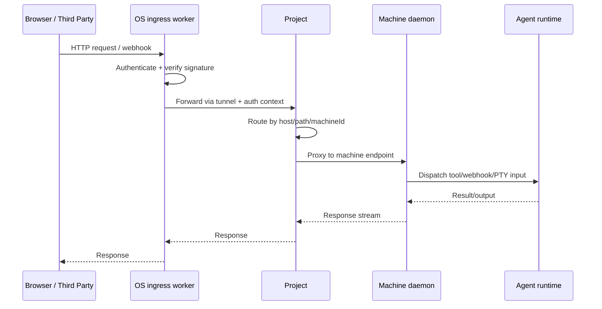
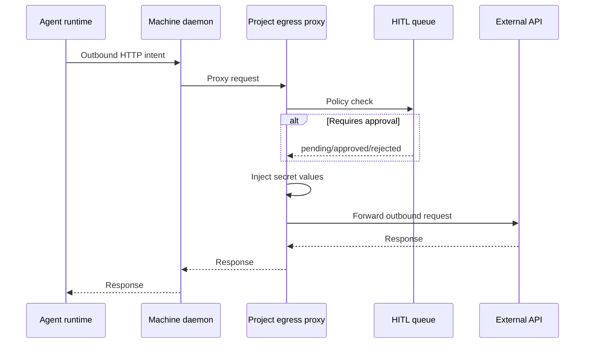

# Platform Layer Architecture

> **Document rules**
>
> - Sacrifice grammar for concision, not information
> - This is a working document. Notes, open questions, rough edges are fine
> - Clean up once open questions are resolved
> - Topology diagrams: ASCII and light. Request flow diagrams: Mermaid sequence OK

## Overview

```
          INGRESS                                          EGRESS
            |                                                ^
            v                                                |
+------------------------------------+                       |
|  OS Layer (Cloudflare)             |                       |
|                                    |                       |
|  +------------------------------+  |                       |
|  |  Ingress Worker (skinny)     |  |                       |
|  |  - resolve project from host |  |                       |
|  |  - auth / verify webhook sig |  |                       |
|  |  - forward via CF tunnel     |  |                       |
|  +--------------+---------------+  |                       |
|                 |                  |                       |
|           Cloudflare Tunnel        |                       |
+-----------------+------------------+                       |
                 (only way in)                               |
                  |                                          |
                  v                                          |
+------------------------------------------------------------+---+
|  Project  (misha.iterate.app)                              |   |
|                                                            |   |
|  +------------------------------------------------------+  |   |
|  |  Project (trusted)                                   |  |   |
|  |  - sees real secrets                                 |  |   |
|  |  - runs human-in-the-loop approval (HITL)            |  |   |
|  |  - injects secrets into egress                       |  |   |
|  |  - ingress routing to machine daemons                |--+   |
|  |  - egress proxy (only exit for machine daemons)      |      |
|  |  - webapp, SQLite, Doppler sync                      |      |
|  +-------------+----------------------+------------------+      |
|                |                      |                         |
|          only way in            only way out                    |
|                |                      |                         |
|                v                      |                         |
|  +------------------------------------+---------------------+   |
|  |  Machine Layer (untrusted)         |                     |   |
|  |  - machine daemon + agents (root)                        |   |
|  |  - NO secrets in memory, ever                            |   |
|  |  - env vars carry secret refs (example: get_iterate_secret), not raw creds |
|  |  - no external ingress except via project                |   |
|  |  - all egress via project egress proxy                   |   |
|  |  - currently 1 machine, designed for N                   |   |
|  +----------------------------------------------------------+   |
+----------------------------------------------------------------+
```

**Auth model:** OS edge does all external authentication. By the time a request reaches project via tunnel, it is authenticated and scoped.

1. **Browser/API request**: OS checks cookies, access tokens, shared secrets; adds auth context.
2. **Webhook**: OS verifies provider signature (Slack/GitHub/etc), extracts external ID, resolves project.

Hard invariant for externally-originated traffic:

- Browser/webhook traffic enters at OS first
- OS authenticates external caller
- OS forwards to project
- Project routing decides machine target
- Machine daemon dispatches to agent runtime
- No direct external ingress path to machine daemons

## API surface at a glance

### Hosts

| Host                                       | Layer   | What                                                                              |
| ------------------------------------------ | ------- | --------------------------------------------------------------------------------- |
| `os.iterate.com`                           | OS      | Webapp (Better Auth, billing UI), tRPC, skinny ingress worker                     |
| `{project}.iterate.app`                    | Project | Project ingress via Cloudflare tunnel -> project                                  |
| `{port}--{machine}--{project}.iterate.app` | Machine | Routed by project to specific machine/port (no direct browser ingress to machine) |

### Hostname scheme

One wildcard cert for `*.iterate.app`. Routing info is in subdomain prefix. Project knows its base URL (example: `misha.iterate.app`) and parses incoming hostnames relative to that.

```
misha.iterate.app                        -> project (default route)
3000--misha.iterate.app                  -> project port 3000
3000--mach_abc--misha.iterate.app        -> machine mach_abc port 3000 (via project router)
```

Pattern: `{port}--{machineId}--{project}.iterate.app`

- `{project}` -> project default route
- `{port}--{project}` -> project specific port
- `{port}--{machineId}--{project}` -> machine specific port, selected by project router

Project parses prefix, resolves target machine + port, proxies. OS ingress worker does not parse machine routes; it forwards `*.iterate.app` to the right project tunnel.

**Standalone / BYO domain:** same prefix parsing works with any base domain. `npx iterate` can use `localhost:8000`. BYO example: `3000--mach_abc--myproject.example.com`.

### OS Layer - `os.iterate.com`

```
tRPC  /api/trpc/*
  user, organization, project, billing, accessToken

oRPC  /api/orpc/*
  project.reportStatus     (project -> OS)
  TBD - OS only talks to projects, never directly to machines

REST
  /api/auth/*              Auth (Better Auth)
  /api/integrations/slack/{callback,webhook,interactive,commands}
  /api/integrations/github/{callback,webhook}
  /api/integrations/google/callback
  /api/integrations/stripe/webhook
  Webhook handler extracts external ID (example: Slack team ID)
    -> looks up project -> forwards to project ingress

Skinny worker
  Ingress worker: resolve project from hostname -> auth -> forward via tunnel
```

### Project Layer - project (trusted)

```
oRPC  /api/orpc/*
  secrets.list, secrets.set, secrets.delete
  envVars.list, envVars.set, envVars.delete
  approvals.list, approvals.get, approvals.approve, approvals.reject
  machines.list, machines.health
  TBD - project lifecycle, routing config

REST
  /api/integrations/*/webhook    Receives forwarded webhooks from OS
    -> routes to correct machine daemon
  /api/egress-proxy              Egress proxy for machine daemons
    -> HITL check -> inject secrets -> forward to internet

React webapp (SPA)
  Full-stack app, hits project oRPC + machine oRPC
  Includes terminal UI (xterm.js); PTY websocket endpoint is on machine
```

**Storage:** SQLite per project, self-contained, no external DB dependency.

### Machine Layer - machine daemon (untrusted)

```
oRPC  /api/orpc/*
  agent.list, agent.create, agent.start, agent.stop
  agent.conversation.*
  daemon lifecycle

REST
  /api/pty/ws                    Terminal WebSocket
  /api/files/{read/*,upload}     File access
  /api/health
```

## Layer 1: OS Layer

Cloudflare Workers. Skinny, edge-native. Optional: projects can run without it.

**Owns:**

- Billing and metering
- Project topology (which projects exist, where they live)
- Authentication of external requests to projects
- Iterate-owned OAuth clients (Slack/GitHub/Google/etc), shared across projects
- Webhook multiplexing by external integration IDs
- Supplies OAuth client credentials to projects as env vars/secrets
- Creates Cloudflare tunnels on project creation and gives access token to project
- Supervision and health monitoring

**Does NOT own:**

- Machine topology details (OS knows projects, not machines)
- Runtime secrets management (project manages runtime secret use)
- HITL (project layer)
- Egress proxying (project talks directly to internet)

**One skinny worker:**

- Ingress worker: resolves project from hostname, auths request, forwards via Cloudflare tunnel to project

**Hosts:** `os.iterate.com`

**Key implementation:** stateless worker at edge, not Durable Object proxy.

## Layer 2: Project Layer

Runs on the **Project** host (trusted). Core business logic lives here.

**Owns:**

- Secrets storage/injection (OAuth tokens, API keys, env vars)
- HITL approval queue and enforcement (SQLite)
- Egress proxy for machine daemon outbound traffic
- Ingress routing table mapping routes to machine daemons + ports
- Cloudflare tunnel client (hosted mode)
- Full-stack React webapp
- Metering data collection and report to OS
- Integration webhook routing from OS to correct machine daemon

**Does NOT own:**

- Billing (OS)
- OAuth client registration (OS owns shared clients)
- Agent orchestration internals (machine layer)

**Storage:** SQLite per project.

**Hosts:** `{project}.iterate.app` via Cloudflare tunnel (hosted) or local/BYO in standalone.

**Trust model:** trusted host. Users do not get shell access. Secrets can live in memory.

## Layer 3: Machine

Where machine daemon + agents run. Agents have root.

**Assumption:** hostile to secrets. No raw long-lived credentials in machine/agent memory.

**Owns:**

- Agent lifecycle (create/start/stop/destroy)
- Agent conversations and tool execution
- PTY websocket (`/api/pty/ws`)
- File system access (`/api/files/*`)
- Health reporting

**Does NOT own:**

- Secrets (must request through project egress proxy)
- HITL decisions
- External ingress routing
- Shared database

**Hosts:** `{port}--{machine}--{project}.iterate.app` (resolved/proxied by project ingress router)

**Trust model:** untrusted. Agents may attempt exfiltration. Egress must go through project egress proxy.

**Codebase:** same monorepo; OS/project/machine are different runtime configs/entrypoints.

Current state: 1 project + 1 machine per project. Design target: N machines and N agents per machine.

## Ingress + egress stories

### Browser -> project webapp

```
Browser -> GET misha.iterate.app/
  |
  v
OS ingress worker
  - resolve project "misha"
  - auth request
  - add auth context
  - forward via tunnel
        |
        v
      Project
        - ingress table route GET / to webapp
        - serve React app
```

### Browser -> terminal PTY

```
Browser loads project webapp from misha.iterate.app
  |
  v
OS ingress worker -> auth -> tunnel -> Project
  |
  v
Project serves React app with xterm.js
  |
  +-- xterm opens PTY session via project route
      /api/pty/ws?machineId=mach_abc
        |
        v
      Project ingress routing table
        -> proxy websocket to machine daemon /api/pty/ws
              |
              v
            Machine daemon -> attached agent shell
```

### Webhook -> agent

```
Slack/GitHub/etc -> POST os.iterate.com/api/integrations/.../webhook
  |
  v
OS Layer
  - verify webhook signature
  - extract provider external ID
  - resolve project
  - forward via tunnel
        |
        v
      Project
        - route to correct machine daemon
        - forward webhook
              |
              v
            Machine daemon -> agent handles webhook
```

### Browser -> agent API call

```
Browser -> POST misha.iterate.app/agents/banana-king
  |
  v
OS ingress worker -> auth -> tunnel -> Project
  |
  v
Project ingress routing
  - POST /agents/* -> machine
  - proxy to machine oRPC/API
        |
        v
      Machine daemon -> handles request
```

### Agent egress with HITL + secret injection

```
Agent process -> HTTP intent
  |
  v
Machine daemon (no direct internet by policy)
  -> project egress proxy
        |
        v
      Project egress proxy
        - HITL check (block/allow/ask)
        - inject secrets
        - meter request
        - forward to internet
              |
              v
            External API
```

### Sequence diagram: external ingress



### Sequence diagram: egress with HITL + secrets



## Key design principles

1. **Standalone-first.** A project (project + machine) must work without OS.
2. **Machine-agnostic.** Linux hosts with network access. No provider lock-in.
3. **Secrets never touch machine daemons.** Project injects secrets at egress.
4. **OS is thin.** Auth/webhook mux/billing/tunnel provisioning, not heavy runtime logic.
5. **OS does not know machine topology internals.** OS knows projects.
6. **N agents per machine, N machines per project.** Current 1:1:1 does not constrain future scale.
7. **`npx iterate` must work.** No hard dependency on `iterate.app` or Cloudflare.
8. **Prefixed opaque IDs.** `proj_*`, `mach_*`, `agnt_*`; no slug assumptions.
9. **External ingress always OS -> Project -> Machine -> Agent.**

## Machine providers and lifecycle

Provider is replaceable. Project talks to provider adapter, not Fly/Docker directly.

Ownership boundary:

- Project owns machine lifecycle (create/start/stop/delete/list/health)
- OS layer and CLI may provision bootstrap env vars, but lifecycle API calls originate from project
- Provider credentials are injected via env vars (OS bootstrap, Doppler, or local `.env`)

Core machine provider interface:

- `createProject(spec)` -> project host + metadata
- `createMachine(projectId, spec)` -> machine host + metadata
- `startMachine(machineId)` / `stopMachine(machineId)` / `deleteMachine(machineId)`
- `getMachineStatus(machineId)` -> healthy/unhealthy + endpoint data
- `listMachines(projectId)` -> current topology
- `streamMachineLogs(machineId)` (optional)

Lifecycle:

1. Project created (OS in hosted, CLI in standalone/dev)
2. Provider creates project host
3. Provider creates at least one machine host
4. Project writes routing entries for machines
5. Project monitors health and updates routing
6. Scale by add/remove machine through provider adapter
7. Destroy project tears down project + machine hosts

## Deployment configurations

Three run modes, same architecture. Differences are provisioning and ownership.

### Config 1: Hosted Iterate

Full stack. Customers pay us. OS runs at cloud edge.

```
OS Layer (cloud edge) -> Project (trusted host) -> Machine (untrusted host)
```

**Customer gets:**

- Iterate-owned OAuth clients
- Webhook multiplexing
- Billing
- UI for project/secrets/HITL
- Tunnel-based ingress (`{project}.iterate.app`)
- No public inbound ports on project/machine. Project opens outbound Cloudflare tunnel only
- Doppler-managed secrets

**Customer does not do:**

- Docker/provider infra management
- OAuth app registration with third parties
- DNS setup

### Config 2: Homebrew Hacker (`npx iterate`)

User runs project themselves. No mandatory OS. No mandatory Cloudflare.

```
npx iterate
  - choose provider (local container or remote provider adapter)
  - run project
  - run machine
  - open project UI
```

Two first-run paths:

1. Existing customer: `npx iterate login` -> OAuth with `os.iterate.com` -> pick project
2. New local-only: `npx iterate init` -> generate config + `.env` -> run project + machine

What works:

- HITL local in project
- Secrets from local `.env` (no Doppler required)
- Project egress proxy + secret injection
- Webhooks via user-managed ingress tunnel/proxy (cloudflared/ngrok/Caddy/etc)
- OAuth with user-owned apps in `.env`

What user brings:

- Env vars/secrets
- OAuth clients (if integrations enabled)
- Domain or localhost
- Ingress tunnel/proxy choice
- Machine provider implementation

### Config 3: Iterate Dev

Engineers run full platform locally for development.

```
OS Layer (miniflare/wrangler dev) -> Project (local) -> Machine (local)
```

- `pnpm dev` runs OS worker locally
- Can provision projects -> spins project + machine via provider adapters
- End-to-end testing of full stack
- Uses `doppler run --config dev` for dev secrets

## Tunnel lifecycle

1. OS creates Cloudflare tunnel when project is created
2. OS gives tunnel access token to project (bootstrap env var)
3. Project establishes outbound-only tunnel session to Cloudflare
4. The only external path to project in hosted mode is this tunnel
5. OS ingress routes `{project}.iterate.app` through tunnel
6. Token rotation: OS updates bootstrap secret, project reconnects, old token revoked
7. Tunnel failure: OS health checks mark degraded; ingress returns explicit unavailable response

## Work in progress: scalability + performance

- Deliberately thin edge: no heavy compute/state at OS edge
- Request proxy path is stateless worker, not Durable Object
- Current reality: project host is single point of success per project; each machine is its own failure domain
- Scale path exists:
  - multiple machines per project
  - health-aware routing over tunnel/machine endpoints
  - project-side registry + synchronization strategy for machine metadata
  - eventual extraction of discovery/routing registry out of a single daemon
- Goal: keep edge simple + low latency now, keep explicit upgrade path for reliability/perf later

## Security

### Threat model A: evil/prompt-injected agent on untrusted machine

Attacker capability:

- Arbitrary code execution as root in machine guest
- Reads machine memory/filesystem
- Attempts policy bypass, secret exfiltration, direct internet calls, audit tampering

Primary defenses:

- No long-lived raw secrets in machine/agent memory by design; secrets injected at project egress only
- External ingress never terminates on machine; OS/project boundaries are enforced first
- Provider-level network policy restricts machine egress to project egress endpoint(s) + required control-plane endpoints
- HITL + project-side egress policy before outbound request leaves trusted boundary
- Metering/logging at project egress path, not only in machine guest

Residual risk / limits:

- Agent can exfiltrate data intentionally provided by user (prompt/context/files)
- Provider policy misconfiguration can allow egress bypass
- In-guest controls only (example: iptables inside guest) are insufficient against root attacker
- V1 has no project<->machine app-layer auth; isolation failure implies lateral access risk

### Threat model B: internet attacker targeting public edge

Attacker capability:

- Forged webhooks, replay attempts, path fuzzing, auth bypass attempts
- Attempts to route traffic to wrong project or hit machine endpoints directly
- Attempts to abuse OS ingress worker for cross-project actions

Primary defenses:

- OS performs external auth before forwarding to project
- Webhook signatures verified at OS before routing
- Routing keyed by validated project context + provider external IDs
- No direct external ingress to machine daemons
- Project endpoints behind tunnel and scoped OS forwarding path

Residual risk / limits:

- Stolen client tokens/cookies are out of scope for network architecture alone
- Replay defense specifics (timestamp window, nonce storage) are per-integration implementation work

### Threat model C: control-plane/provider misconfiguration

Attacker capability:

- Mis-scoped security groups, open ports, bad routes, leaked provider keys

Primary defenses:

- Provider adapter contract centralizes lifecycle + network policy application
- Project-owned lifecycle avoids split ownership and unclear control paths
- Bootstrap env contract makes required credentials explicit and auditable
- Health checks + explicit degraded behavior reduce silent exposure

Residual risk / limits:

- Architecture doc is not enough; provider policy conformance tests are required per adapter

## Decided invariants

- External ID webhook mux is at OS
- OAuth client ownership is at OS
- Secret flow is OS/bootstrap -> project store -> project egress injection
- OS webapp stays skinny (auth/billing/org/project)
- Project webapp stays full app (agents/terminal/secrets/HITL)
- PTY split: xterm.js in project webapp, PTY endpoint on machine, browser reaches PTY through OS->project routing
- SQLite per project, no shared external DB required
- Same monorepo, different runtime configs
- No direct external ingress to machine daemon
- Standalone ingress is user-managed
- Machine egress enforcement is provider-level outside guest
- Project owns machine lifecycle
- Project <-> machine internal auth (v1): none; trust boundary is provider network isolation only

### External ID mapping examples

| Provider | External ID extracted by OS              | Project lookup key                                   |
| -------- | ---------------------------------------- | ---------------------------------------------------- |
| Slack    | `team_id`                                | `integration_external_id(slack, team_id)`            |
| GitHub   | `installation.id`                        | `integration_external_id(github, installation_id)`   |
| Google   | `sub` / tenant ID (integration-specific) | `integration_external_id(google, subject_or_tenant)` |
| Stripe   | `account` / endpoint account context     | `integration_external_id(stripe, account_id)`        |

## Parked questions (need decisions later)

- Future OS-level egress worker:
  - trigger: centralized rate limits
  - trigger: egress IP allowlisting
  - trigger: cross-project billing instrumentation
- Naming follow-up:
  - keep `OS Layer` for now
  - optional future rename to `Platform Edge` if scope expands

## Secrets delivery model + Doppler implementation

### Abstract model (provider-agnostic)

1. Bootstrap env vars are required so project can boot infra + secret sync
2. User-managed secrets cover integration tokens, API keys, OAuth tokens, tool env vars

Flow:

```
secret source (OS UI / CLI / file) -> project secret store -> egress injection at project
```

Machine/agent sees request shapes, never long-lived raw credential values.

### Bootstrap env contract (minimum)

| Var                                      | Scope         | Purpose                                          |
| ---------------------------------------- | ------------- | ------------------------------------------------ |
| `PROJECT_ID`                             | project       | stable project identity                          |
| `PROJECT_BASE_URL`                       | project       | hostname parsing + canonical links               |
| `PROJECT_INGRESS_TOKEN`                  | OS -> project | tunnel ingress authorization context             |
| `PROJECT_EGRESS_BIND`                    | project       | egress proxy bind/advertise address for machines |
| `MACHINE_PROVIDER`                       | project       | provider adapter selector (`fly`, `docker`, ...) |
| `MACHINE_PROVIDER_CONFIG`                | project       | provider credentials/config payload reference    |
| `DOPPLER_TOKEN` (optional in standalone) | project       | fetch user-managed secrets from Doppler          |

### Doppler implementation note (hosted mode)

```
OS layer -> writes project-scoped secret config in Doppler
  |
  v
Project (has DOPPLER_TOKEN bootstrap var)
  - periodic sync: doppler pull -> .env on disk
  - cached .env allows degraded operation during Doppler outage
```

### Standalone mode

User writes `.env` manually or passes env at runtime. Project consumes same contract. No Doppler dependency.

## Raw notes (still to process)

- Platform worker ingress pattern: `return getFetcher(req)(req)`
- Auth options at OS layer: cookies, access tokens, OAuth, shared secrets
- Future: extract machine discovery/routing registry out of any single machine daemon
- Candidate: project-owned discovery service with health + capacity awareness
- Result target: cleaner scale-out, faster failover, less routing coupling to one daemon
